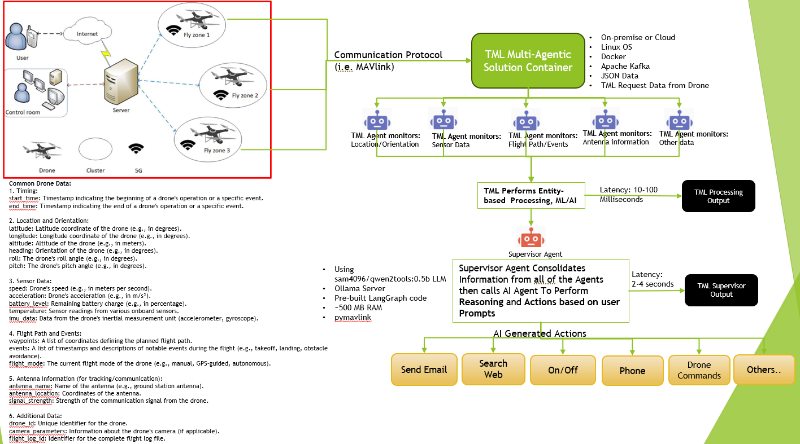

TML and Agentic AI
------------------

- The growth of Agent based computing integrated with GenAI is the next evolution of AI
- Agents are now able to reason and perform the appropriate tasks on their own - without human intervention
- The maket for Agentic AI is expected to aggressively grow in the next 5 years with a CAGR of 41%
- This growth will be driven by demand for automation of simple and complex tasks

In the above Figure:

* Agents are a natural evolution of the AI market 

* Agentic AI market will experience tremendous growth as AI LLM get smarter with a CAGR of 41.48% 

* agents are the way to incorporate LLMs in advanced real-time workflows

* Mutli-agents allow for a community of agents with more advanced capabilities

* For more information read this `blog <https://www.linkedin.com/pulse/agentic-ai-5-basic-research-facts-multiagents-from-my-maurice-ph-d--sv4fc/?trackingId=O7arqnVYn4wfmc4R7Yg%2BmA%3D%3D>`_

What is an Agent?
======================

.. important::

   A computer system that is situated in some environment, and that is capable of autonomous action in this environment in order to meet its design objectives      [Wooldridge and Jennings 1995].	

TML and Agentic AI: A Powerful Combination for Real-Time Data
==================================================

- Real-time agent-based systems for entity level processing and machine learning is a ground-breaking capability currently “unparalleled” in the global AI market

- Integrating Agentic AI in TML solutions opens up tremendous opportunities for real-time workflow solutions that can incorporate multiple data sources that can be   processed by Multiple Agents at the same time

- TML solutions are already a “Single” agent

- The more advanced use of TML and Agents is in a **multi-agent framework**
   - This will be the powerful capability in TML

TML and Multi-Agentic AI Process Flow in Real-Time: GenAI Reasoning and Actions
==============================================

The figure below shows the TML and Multi-Agentic AI process flow for real-time data processing.  Integrating multi-agentic framework with TML for real-time data processing with GenAI reasoning and actions offers tremendous opportunities for machines to perform advanced reasoning and actions for real-time decision making by humans.

TML and Multi-Agentic AI Solution Reference
==============================================

The figure below shows how the TML agentic AI solution processes real-time data with multi-agents:

* Individual agents monitor the Kafka topics containing TML processed real-time data
* The individual agents are prompted with questions to analyse the real-time data
* The individual agent responses are writte to a Vector DB
* The Team Lead agent summarizes the individual agents' responses by querying the vector DB
* The Supervisor agent takes the Team Lead's response summary and generates ACTION
* The autonomous actions could be send email, update file or update some operational technology
* Human or machine decision maker then receives the outcome of this ACTION.

Building TML and Agentic AI Solutions with TML Solution Studio (TSS)
==============================================

- All TML solutions are built with the `TSS <https://tml.readthedocs.io/en/latest/docker.html>`_
- TSS enforces a process driven approach to build TML solution in a few minutes
- The image on the left shows an example of a TML solution build process
- Every TML solution are built with NO-CODE
- Each TML solution takes less than 5 minutes to develop
- The output of a TSS solution build is a docker container

.. figure:: agentic2.png
   :scale: 70%

TML and (Multi) Agentic AI Architecture
========================

- The TML and Agentic Architecture is very simple: Agents can be configured in the `TSS <https://tml.readthedocs.io/en/latest/docker.html>`_
- With NO-CODE - users can advanced agent based solutions that process real-time data and perform tasks in real-time
- The AI integration is with the `TML privateGPT Agentic AI containers <https://tml.readthedocs.io/en/latest/genai.html#tml-and-agentic-ai-special-container>`_
   * This local container uses `Ollama server <https://ollama.com/>`_ for API based Agentic workflow automation
   * Two LLM models can be used: `Llama 3.1 <https://huggingface.co/meta-llama/Llama-3.1-8B>`_ or `Llama 3.2 <https://huggingface.co/meta-llama/Llama-3.2-1B>`_
- Using local GenAI containers drastically reduces the cost of Agentic solution for large scale data processing

Implementing Complex Workflows with TML and (Multi) Agentic AI
""""""""""""""""""""""""""""""

Implementing complex real-time workflows to automate complex tasks is possible with TML and Agentic AI, as shown below.  In fact, this is would be a new skill set for Busniness analysts but focused on Agentic AI solutions:

.. figure:: agentic4.png
   :scale: 70%

TML and TSS use `LangGraph <https://www.langchain.com/langgraph>`_ for (multi) Agent based code. TML agents can execute tools autonomously.  Tools are out of the box, or users can build their own custom tools and integrate with their TML solutions, easily.

Sample Output from TML Multi-Agentic AI Solution
"""""""""""""""""""""""""""""""""""""

Below is sample output from a TML agentic solution monitoring IoT device topics.

.. code-block::

      [
      	{
      		"Date": "2025-09-20 20:35:39.393392+00:00",
      		"Topic_Agent": "a",
      		"Prompt": "this json is an output of a machine learning model.the json field hyperprediction is a probability prediction of an iot device failure.if the probability is greater than 0.70 then there is a high likelihood of the device failing.  each devive entity is in the mainuid parameter.can you tell which device has a high likelihood of failure?",
      		"Response": "based on the json output, i can see that there are two devices with their respective predictions.the device with a high likelihood of failure is the one with hyperprediction value greater than 0.70.looking at the json, i find that:**device ac000w020486693 has a high likelihood of failure**here's why:* in the first object (device) in the array:+ hyperprediction: 0.898 (greater than 0.70)+ mainuid: ac000w020486693this device has a probability prediction of 89.8% that it will fail.let me know if you'd like to analyze anything else!",
      		"Model": "llama3.1",
      		"Embedding": "nomic-embed-text",
      		"Temperature": "0.0"
      	},
      	{
      		"Date": "2025-09-20 20:36:01.873288+00:00",
      		"Topic_Agent": "b",
      		"Prompt": "can you describe what is happening in this json?",
      		"Response": "this is a json array containing two objects, each representing a single data point or event. here's a breakdown of what's happening in this json:**array structure**the outermost structure is an array [], which contains two objects {}.**object 1:*** the first object has several key-value pairs:+ hyperprediction: 0.898 (a prediction score)+ probability1: 0.347 (probability of a specific outcome)+ probability0: 0.653 (probability of the opposite outcome)+ algokey: streamconsumer_topicid137_json (an algorithm key or identifier)+ algo: streamconsumer_topicid1370_jsonlgt (algorithm name)+ usedeploy: 1 (deployment status, likely indicating that the model is being used)+ created: 2022-10-29t18:24:27.5145-04:00 (timestamp when the data was created)+ inputdata: 0.000,0.000,0.000,122022.000,0.000,0.000 (input data for the model, likely a comma-separated list of values)+ fieldnames: date, topicid1370_voltage_preprocessed_anomprob, topicid1370_current_preprocessed_anomprob, topicid1370_power_preprocessed_trend,topicid1370_voltage_preprocessed_avg, topicid1370_current_preprocessed_avg,topicid1370_power_preprocessed_avg (field names for the input data)+ topicid: 1370 (a unique identifier for the topic or dataset)+ fullpathtomodels: c:/maads/golang/go/bin/viperlogs/iotlogistic/deploy (path to the model deployment directory)+ identifier: a complex string containing metadata about the data, including identifiers and joined identifiers+ islogistic: 1 (indicating that this is a logistic regression model)+ compression: gzip (compression algorithm used for the data)+ produceto: iot-ml-prediction-results-output (output topic or destination for the predicted results)+ kafkacluster: pkc-6ojv2.us-west4.gcp.confluent.cloud:9092 (kafka cluster connection details)+ minmax: a string containing minimum and maximum values for each feature+ machinelearningalgorithm: logistic regression (the machine learning algorithm used)+ parameterestimates: -0.6322068,0.0000000,0.0000000,0.0000000,0.0000000,0.0000000,0.0000000 (estimated parameters for the model)+ hasconstantterm: 1 (indicating that a constant term is included in the model)**object 2:**the second object has similar key-value pairs to the first one, with some differences:* the prediction score and probabilities are different (hyperprediction: 0.347, probability1: 0.347, probability0: 0.653)* the input data is identical to the first object* the rest of the fields have similar values or structuresin summary, this json array contains two objects representing events or data points from a machine learning model deployment. each object has various metadata and configuration details about the model, including algorithm settings, input data, and output destinations.",
      		"Model": "llama3.1",
      		"Embedding": "nomic-embed-text",
      		"Temperature": "0.0"
      	},
      	{
      		"Date": "2025-09-20 20:36:16.325118+00:00",
      		"Topic_Agent": "c",
      		"Prompt": "can you describe what is happening in this json?",
      		"Response": "this is a json array containing two objects, each representing a single data point or record.here's a breakdown of the key fields and their values:**common fields*** hyperprediction: a prediction score between 0 and 1.* probability1 and probability0: the probabilities of class 1 and class 0, respectively. these are likely related to the output of a binary classification model (e.g., logistic regression).* algokey, algo, and usedeploy: these fields seem to be related to the machine learning algorithm used for prediction.+ algokey is a unique key for the algorithm.+ algo is the name of the algorithm (in this case, streamconsumer_topicid1370_jsonlgt).+ usedeploy indicates whether the algorithm was deployed (1) or not (0).* created: the timestamp when the data point was created.**data input*** inputdata: a string containing six comma-separated values. these are likely the input features for the machine learning model.* fieldnames: a string listing the names of the fields in the inputdata string.**topic and model information*** topicid: the id of the topic associated with this data point (1370).* fullpathtomodels: the full path to the models used for prediction.* identifier: a unique identifier for the data point, including information about the iot device and its performance.**machine learning algorithm*** machinelearningalgorithm: the type of algorithm used for prediction (in this case, logistic regression).* parameterestimates: the estimated parameters of the model, represented as a comma-separated list of values.* hasconstantterm: a flag indicating whether the model includes a constant term (1) or not (0).**output and kafka configuration*** produceto: the topic to which the prediction results are produced.* kafkacluster: the kafka cluster configuration, including the broker address and port.the two data points in this json array seem to be identical, with only minor differences in their timestamps. it's possible that these are duplicate records or that there was an error in generating the second record.",
      		"Model": "llama3.1",
      		"Embedding": "nomic-embed-text",
      		"Temperature": "0.0"
      	},
      	{
      		"Date": "2025-09-20 20:36:21.033379+00:00",
      		"Team_Lead_Agent": "topic",
      		"Pompt": "does the data indicate any anomalies or irregular behaviour? give a detailed response - use the mainuid to indicate device name. specifically, look in the hyperprediction field, these numbers representprobability prediction failure for iot devices.  the device name can be found in the mainuid parameter in the identifier field. if a numberin hyperprediction is greater than 0.70 then there is a problem in this device.",
      		"Response": "yes, the data indicates an anomaly or irregular behavior for one of the iot devices. the device with identifier ac000w020486693 has a high likelihood of failure, as indicated by its hyperprediction value being greater than 0.70. this suggests that there is a problem with this particular device.upon closer inspection, it appears that the model used to predict device failures has identified this device as having a significant probability of failing (89.8% in this case).",
      		"Model": "llama3.1",
      		"Embedding": "nomic-embed-text",
      		"Temperature": "0.0"
      	},
      	{
      		"Date": "2025-09-20 20:36:27.926185+00:00",
      		"Supervisor_Agent": "topic",
      		"Prompt": "here is the team lead's response: yes, the data indicates an anomaly or irregular behavior for one of the iot devices. the device with identifier ac000w020486693 has a high likelihood of failure, as indicated by its hyperprediction value being greater than 0.70. this suggests that there is a problem with this particular device.upon closer inspection, it appears that the model used to predict device failures has identified this device as having a significant probability of failing (89.8% in this case)..  generate an approprate action using one of the tools.",
      		"Response": "The email has been sent to Sebastian regarding the anomaly detected on IoT device ac000w020486693.",
      		"Model": "llama3.1",
      		"Embedding": "nomic-embed-text",
      		"Temperature": "0.0"
      	}
      ]

Advantages of TML with Agentic AI
========================

- Real-Time entity-based Agent computing can offer finer-grained insights that could improve the quality of real-time decisions for many uses in IoT,       Cybersecurity, Finance, Manufacturing, Energy etc.
- By processing data from multiple data sources by individual agents, and then combining the output (supervisor agent) increases the level intelligences extracted from the data leading to higher dimensional, entity-level, intelligence in real-time
- Ability to perform complex workflow tasks in real-time offers greater, and faster, visibility on critical operational functions
- COST: Drastic reduction in costs using TML and Agentic AI.  Because TML uses `local Agentic AI container <https://tml.readthedocs.io/en/latest/genai.html#tml-and-agentic-ai-special-container>`_ API calls are FREE.  This leads to a drastic reduction in costs for TML and Agentic AI solutions, immediately.

EXAMPLE: TML Agentic AI For Drones
===================================

Below is an example solution architecture applying TML and Agentic AI to Drones using MAVLink as the communication prootocol.

