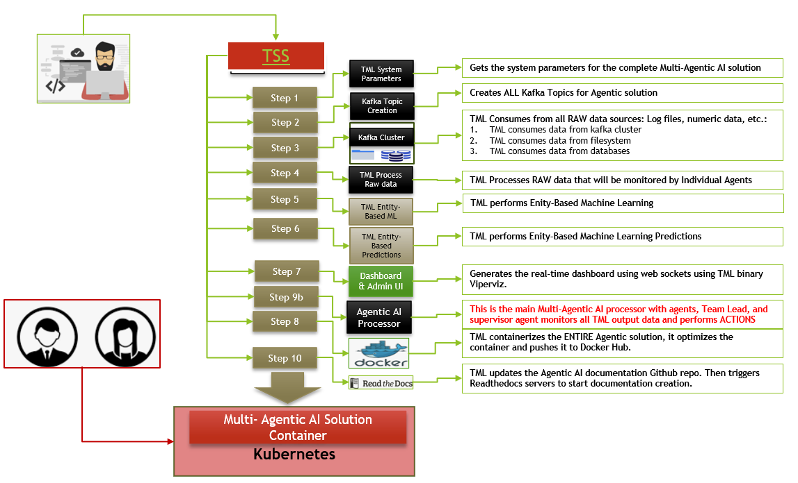

TML and Agentic AI
------------------

- The growth of Agent based computing integrated with GenAI is the next evolution of AI
- Agents are now able to reason and perform the appropriate tasks on their own - without human intervention
- The maket for Agentic AI is expected to aggressively grow in the next 5 years with a CAGR of 41%
- This growth will be driven by demand for automation of simple and complex tasks

.. figure:: agentic1.png
   :scale: 70%

In the above Figure:

* Agents are a natural evolution of the AI market 

* Agentic AI market will experience tremendous growth as AI LLM get smarter with a CAGR of 41.48% 

* agents are the way to incorporate LLMs in advanced real-time workflows

* Mutli-agents allow for a community of agents with more advanced capabilities

* For more information read this `blog <https://www.linkedin.com/pulse/agentic-ai-5-basic-research-facts-multiagents-from-my-maurice-ph-d--sv4fc/?trackingId=O7arqnVYn4wfmc4R7Yg%2BmA%3D%3D>`_

TML and Agentic AI: A Powerful Combination for Real-Time Data
==================================================

- Real-time agent-based systems for entity level processing and machine learning is a ground-breaking capability currently “unparalleled” in the global AI market

- Integrating Agentic AI in TML solutions opens up tremendous opportunities for real-time workflow solutions that can incorporate multiple data sources that can be   processed by Multiple Agents at the same time

- TML solutions are already a “Single” agent

- The more advanced use of TML and Agents is in a **multi-agent framework**
 - This will be the powerful capability in TML

Building TML and Agentic AI Solutions with TML Solution Studio (TSS)
==============================================

- All TML solutions are built with the `TSS <https://tml.readthedocs.io/en/latest/docker.html>`_
- TSS enforces a process driven approach to build TML solution in a few minutes
- The image on the left shows an example of a TML solution build process
- Every TML solution are built with NO-CODE
- Each TML solution takes less than 5 minutes to develop
- The output of a TSS solution build is a docker container

TML and (Multi) Agentic AI Architecture
========================

- The TML and Agentic Architecture is very simple: Agents can be configured in the `TSS <https://tml.readthedocs.io/en/latest/docker.html>`_
- With NO-CODE - users can advanced agent based solutions that process real-time data and perform tasks in real-time
- The AI integration is with the `TML privateGPT containers <https://tml.readthedocs.io/en/latest/genai.html#privategpt-special-containers>`_
 - Using local GenAI containers drastically reduces the cost of Agentic solution for large scale data processing

.. figure:: agentic3.png
   :scale: 70%

Implementing Complex Workflows with TML and (Multi) Agentic AI
""""""""""""""""""""""""""""""

Implementing complex real-time workflows to automate complex tasks is possible with TML and Agentic AI, as shown below.  In fact, this is would be a new skill set for Busniness analysts but focused on Agentic AI

Advantages of TML with Agentic AI
========================

- Real-Time entity-based Agent computing can offer finer-grained insights that could improve the quality of real-time decisions for many uses in IoT,       Cybersecurity, Finance, Manufacturing, Energy etc.
- By processing data from multiple data sources by individual agents, and then combining the output (supervisor agent) increases the level intelligences extracted from the data leading to higher dimensional, entity-level, intelligence in real-time
- Ability to perform complex workflow tasks in real-time offers greater, and faster, visibility on critical operational functions
