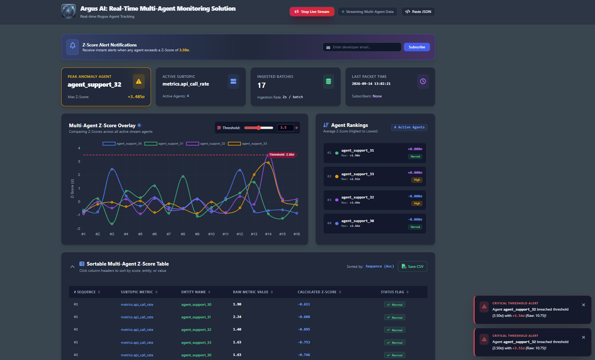
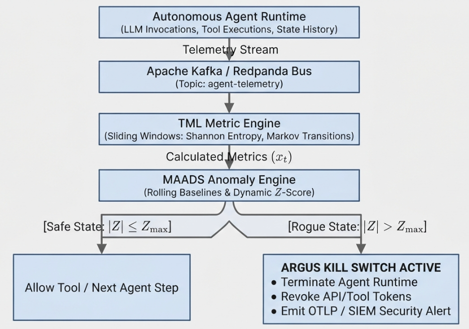

=========================================================
Argus AI: TML Rogue Agent Detection & Circuit Breaker
=========================================================

---------------------------------------------------------
Technical Specification & Architecture Documentation
---------------------------------------------------------

Executive Summary
=================

**Argus AI** is a real-time autonomous safety and risk-monitoring engine built on the **Transactional Machine Learning (TML)** framework. Designed for autonomous LLMs, Multi-Agent Systems (MAS), and agentic workflows, Argus AI monitors streaming operational telemetry to detect **Rogue Agents**—such as infinite tool-use loops, unexpected prompt-injection behavior, resource exhaustion spikes, rapid unauthorized parameter updates, and structural workflow drift—before operational, financial, or security incidents occur.

By leveraging distributed streaming backbones (Apache Kafka / Redpanda), sliding-window statistical metric producers (Shannon Entropy, Markov State Transitions, Jaccard Distance), real-time AutoML anomaly scoring, and dynamic **Circuit Breakers / Kill Switches**, Argus AI provides sub-second threat mitigation for enterprise AI governance.

Argus AI Dashboard
===================

Below is the real-time Argus AI dashboard for Rogue Agent detection.

System Architecture & Data Flow
================================

Below figure shows the process flow of Argus AI:

Technical Specifications & Thresholds
======================================

.. list-table:: System Parameters
   :widths: 25 20 55
   :header-rows: 1

   * - Parameter
     - Default Setting
     - Operational Description
   * - **Streaming Backbone**
     - Apache Kafka / Redpanda
     - Event ingestion bus for high-throughput operational traces
   * - **Sliding Window (N)**
     - 50 agent turns
     - Sample window size used to maintain baseline statistics (:math:`\mu, \sigma`)
   * - **Warmup Buffer (:math:`N_{\text{min}}`)**
     - 10 observations
     - Minimum baseline samples required before enforcing kill switch
   * - **Anomaly Threshold (:math:`Z_{\text{max}}`)**
     - 3.0
     - Standard deviation offset threshold for triggering termination
   * - **Stability Constant (:math:`\epsilon`)**
     - :math:`10^{-6}`
     - Small constant added to standard deviation to avoid zero-division
   * - **Interception Point**
     - Pre-execution gate
     - Evaluates step parameters *before* side effects reach external systems

Core Detection Metrics
======================

.. list-table:: Mathematical Detection Metrics
   :widths: 25 35 40
   :header-rows: 1

   * - Metric
     - Mathematical Formula
     - Threat Vector Targeted
   * - **Shannon Entropy (H)**
     - :math:`H(X) = -\sum_{i=1}^{n} P(x_i) \log_2 P(x_i)`
     - Uncontrolled generation randomness, hallucination loops, prompt degradation
   * - **Markov State Probability**
     - :math:`P(S_t \mid S_{t-1}) = \frac{\text{count}(S_{t-1} \to S_t)}{\text{count}(S_{t-1})}`
     - Structural execution drift (e.g., ``READ_DB`` :math:`\to` ``EXEC_SHELL`` :math:`\to` ``EXEC_SHELL``)
   * - **Token & Action Density**
     - :math:`\text{Density} = \frac{\text{Total Tokens / Actions}}{\Delta t}`
     - Resource exhaustion, rapid parameter manipulation, runaway retry loops
   * - **Jaccard Distance**
     - :math:`J(A, B) = 1 - \frac{|A \cap B|}{|A \cup B|}`
     - Sudden behavioral departure from established tool usage baselines

Competitive Analysis & Feature Matrix
=====================================

.. list-table:: Platform Comparison
   :widths: 20 40 40
   :header-rows: 1

   * - Feature Dimension
     - Commercial SaaS Tools (e.g., MS Agent 365)
     - Argus AI (TML Framework)
   * - **Primary Focus**
     - Identity, access control, DLP, and fleet inventory management
     - Sub-second algorithmic anomaly detection & execution control
   * - **Detection Engine**
     - Static rules, regex, sensitivity labels, RBAC roles
     - Rolling :math:`Z`-score, Shannon entropy, Markov state transitions
   * - **Kill Switch Mechanism**
     - Administrative override, compliance policy flag, manual block
     - Automatic runtime exception (:math:`|Z| > Z_{\text{max}}`) raised in code loop
   * - **Data Evaluated**
     - Enterprise content, email headers, documents, API scopes
     - Raw transaction streams, prompt tokens, latencies, tool calls
   * - **System Placement**
     - API Gateways, Cloud Portals, Entra ID / Purview agents
     - Event streaming bus (Kafka / Redpanda), embedded runtime sidecar

Cost-Benefit Trade-Offs
=======================

.. list-table:: Tool Trade-Off Analysis
   :widths: 20 40 40
   :header-rows: 1

   * - Tool Category
     - Key Benefits
     - Key Costs & Drawbacks
   * - **Commercial SaaS** *(e.g., MS Agent 365)*
     - | • Turnkey integration with enterprise SSO/Entra ID
       | • Centralized fleet inventory and audit portals
       | • Out-of-the-box compliance and e-discovery reporting
     - | • High recurring enterprise license costs
       | • Reactive detection (evaluates post-generation)
       | • Lacks streaming mathematical anomaly metrics
   * - **Argus AI** *(TML Engine)*
     - | • Mathematical precision via dynamic baseline (:math:`\mu, \sigma`)
       | • Sub-second pre-execution interruption
       | • Self-hosted; zero vendor lock-in or per-agent SaaS fee
     - | • Requires developer integration into agent code loops
       | • Demands streaming infrastructure (Kafka/Redpanda)
       | • Requires initial warmup period (:math:`N_{\text{min}}`) to set baseline

Operational Verification & Deployment Plan
==========================================

1. **Sidecar Integration:** Deploy Argus AI alongside agent orchestration runtimes (e.g., LangGraph, AutoGen, or custom Go/Python agent loops).
2. **SIEM / OTLP Alerting:** Route ``argus-alerts-output`` streams into enterprise security monitoring pipelines to audit agent memory state dumps upon termination.
3. **Automated Verification:** Run integration tests that inject synthetic volume spikes or infinite tool retries to ensure the engine raises a critical runtime exception and halts execution prior to external API dispatch.
