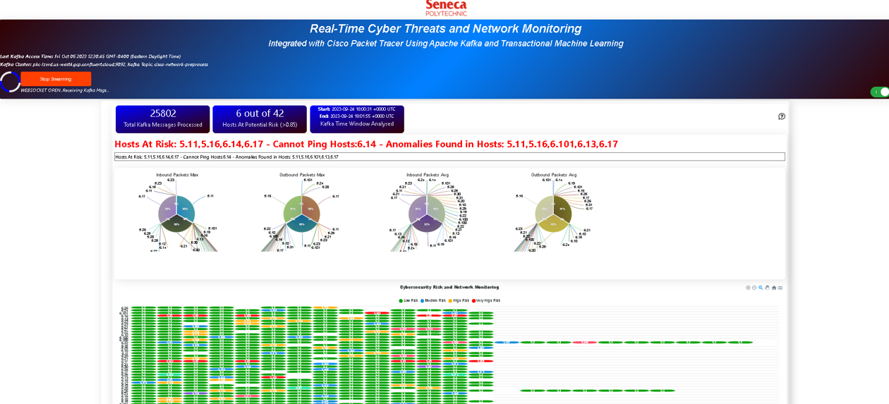
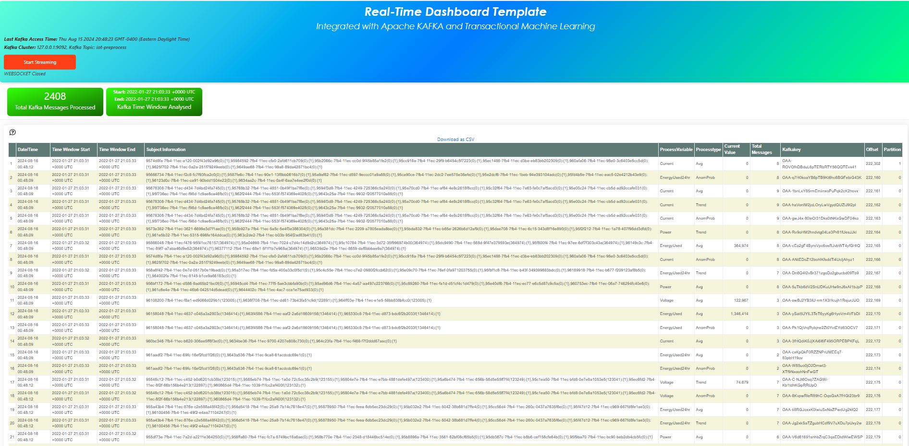

TML Real-Time Dashboards
=========================

You can create real-time dashboards using TML binary called **Viperviz**.  These dashboards are integrated with TML solutions and users can build very unique and powerful real-time dashboards using simple HTML and javascript.

.. note::

   Viperviz streams data **directly** from the **Docker Container** to the client browser.  Viperviz binary uses websockets to stream data to the browser.  This 
   means you do not need a third-party visualization tool.

Some sample dashboards samples are below.

.. figure:: d1.png

.. figure:: d2.png

.. figure:: d3.png

.. figure:: d4.png

.. figure:: hdash1.png

Running Dashboards
-------------------

Creating Your Own Dashboards
^^^^^^^^^^^^^^^^^^^^^^^^^

Creating Real-Time Dashboard in TML are simple, yet very powerful and free.  No third-party visualization tool is necessary. 

.. important::
   All dashboards MUST be created and saved in your **<repo>/tml-airflow/dashboard** folder as shown in Figure below.

.. figure:: d1.png
   :scale: 50% 

.. note::
   Refer to :ref:`STEP 7: Real-Time Visualization: tml-system-step-7-kafka-visualization-dag` for details.  

   To access your dashboard you must enter the filename of the HTML file (i.e. Your Dashboard file) in the **dashboardhtml** field in DAG 7.

.. figure:: d2.png
   :scale: 50%

Once you have created a dashboard to visualize TML data you enter a URL in your browser to run it.

Here is an example URL:

http://localhost:<PORT>/dashboard.html?topic=iot-preprocess&offset=-1&groupid=&rollbackoffset=500&topictype=prediction&append=0&secure=1

.. note::
   When you run your TML solution in TSS by following the instructions here :ref:`Lets Start Building a TML Solution` a visualization URL will be generated for you in your TML solution documentation.  A sample documentation is `here <https://myawesometmlsolution-3f10.readthedocs.io/en/latest/operating.html#your-solution-dashboard-url>`_. A PORT will be assigned to your dashboard at runtime.

.. list-table::

   * - **URL Key**
     - **Description**
   * - http://localhost:<PORT>
     - Almost all of the dashboard will point to the 

       IP and Port that Viperviz is listening on.  Viperviz 

       has a built in webserver, so no setup is need, 

       just plug and play.

       The above URL points to localhost and 

       port 9005 for Viperviz
   * - dashboard.html
     - TML Solution Studio (TSS) provides a template 

       dashboard to get you up and running quickly.  

       This is a base dashboard but will show you how 

       real-time data 

       from TML is analysed and processed.  As shown in 

       the above dashboards, you can create amazing 

       dashboards with HTML and Javascript.
   * - topic=iot-preprocess
     - In the topic key you specify the topic you 

       want to consume data from.  Viperviz will start 

       consuming from this topic, i.e. iot-preprocess or 

       whatever topic you have created to store your data.

       Note: You can specify more than one 

       topic to consume from, just separate multiple 

       topics with comma.
   * - offset=-1
     - This tells Viperviz to start consuming 

       from the latest data in the stream.
   * - groupid=
     - ignored
   * - rollbackoffset=500
     - This tells Viperviz to rollback the datastream 

       by 500 offsets and send it to the browser.  

       NOTE: While you can increase this number - 

       use it with caution 

       because it may overload your browser.  
   * - topictype=prediction
     - Leave as is
   * - append=0
     - If this is 0, the dashboard will not keep 

       appending new data because it may crash 

       your browser as lots of data accumulates.  

       If you set to 1, then data will 

       append.
   * - secure=1
     - Secure connection

.. caution::

   Be careful streaming too many topics at once, and/or, setting the rollbackoffset to a high number because this will cause Viperviz to send a large amout of 
   data to your computer browser, which could overload or crash your browser and/or your computer.

Dashboard Template
------------------

.. tip::
   
   Here is the dashboard template - you can easily build on this to create your amazing real-time dashboards.

   This dashboard is a template that will immediately start to visualize your streaming data.  You can add/edit/modify this dashboard to fit your business needs - 
   it is written in simple HTML and Javascript.  This template is a great way to quickly get you started with amazing real-time visualizations.

   You can modify it in TML Solution Studio (TSS) and commit changes to Github directly from the TSS.

Dashboard Template: Code Explanation
----------------------------

.. code-block:: HTML
   :emphasize-lines: 7, 180, 191, 215, 216, 217,218,219,220,221,222,223,224, 225,226,227,228,229,230,231,232,233,323, 331, 
                     359,360,361,362,363,364,365,366,367,368,369, 
                     370,371,372,373,374,375,376,377,378,379,380,381,382, 383,384,385,386,387,388,389,390,391, 392,393,394,395,396,397,398,399,400,401,402, 
                     403,404,405,406,407,408,414,456,548,594,595,596, 597,598,599,600,603,605,606,607,608,609,614,653,654,655,663, 664,688,689,690,691,692, 
                     693,694,695,696,697,698,699,700, 722,723,724,725,726,727,728,729,730,731,732,733,734,735,736,737,738,746,756
 
      <!DOCTYPE html>
      <html lang="en">
      <!--
      <head>
          <meta charset="UTF-8" />
      	<link rel="shortcut icon" type="image/x-icon" href="./oticsico.png" />
         <title>IoT Device Failure Surveillance Dashboard</title>                             <!-- CHANGE TITLE HERE -->
      
      <!-- ************************************** START OF STYLE *************************************  -->    
        
      
      <!-- ************************************** END OF STYLE *************************************  -->

      <!-- ************************************** START SCRIPTS *************************************  -->      
         
         
         
         
      
      
      
      	
      <!-- ************************************** END SCRIPTS ************************************************************  -->
      
      <link rel="stylesheet" href="/leaflet/leaflet.css" />
      <link href="https://stackpath.bootstrapcdn.com/bootstrap/4.3.1/css/bootstrap.min.css" rel="stylesheet" integrity="sha384-ggOyR0iXCbMQv3Xipma34MD+dH/1fQ784/j6cY/iJTQUOhcWr7x9JvoRxT2MZw1T" crossorigin="anonymous">
      <link href="/css/tilesblockchain.css" rel="stylesheet">
      <link href="/css/attention.css" rel="stylesheet">
      <link href="/css/button.css" rel="stylesheet">
      <link href="/css/textbox.css" rel="stylesheet">
      <link href="/css/table3d.css" rel="stylesheet">
      <link href="/css/dropdown.css" rel="stylesheet">
      <link href="/css/component-custom-switch.css" rel="stylesheet">
      
      </head>
      
      <!-- ******************************************************* END OF HEAD ******************************************* -->
      
      <!-- ******************************************************* START WEBSITE BODY  ******************************************* -->
      
      <body>
      <!-- ********************************************************* DASHBOARD HEADER ******************************************** -->      
      <table style="width: 100%;height: 80px;    background: linear-gradient(135deg,  rgba(102, 255, 217,1) 0%,rgba(0, 128, 255,1) 50%,rgba(0, 128, 255,1) 51%,rgba(0, 255, 128,1) 100%);">
      <tr>
       <td>
         

         

           

            <label id="maintitle"><b><h1><i><b>Real-Time Dashboard Template</b></h1><h3><i>Integrated with  Apache KAFKA and Transactional Machine Learning</i></h3></b></label>
          

        

        

      
        

        

        

            <form id="idForm">						
      		<h6>
      			 <b>Last Kafka Access Time:</b></b> <label id="accesstime"></label> 
      			 <b>Kafka Cluster:</b> <label id="kafkacluster"></label> 			
      	    </h6>
      		 
             

      
      	      <button id="start" class="btn btn1" name="submit">Start Streaming</button>   
      		  <label id="statustext"></label>
      	      

                <label class="custom-switch-btn" for="example_1"></label>
             
	
      		
       </td>
      </tr>
      </table>											
      <!-- ********************************************************* DASHBOARD HEADER ******************************************** -->
      
      <table border=0 style='width: 100%;height: 400px; vertical-align: top;'>
        <tr>					   			   
      	<td  >	
      		

      			

                  

                   
0

                      
Total Kafka Messages Processed

                  

                  

      			

                  

                  
  

                  
Kafka Time Window Analysed

                  

                  

                  

      	</td>
      	</tr>
      				 
      <!-- *************************************** MAIN TABLE ****************************** -->
      	 <tr>				 
      	 <td colspan=4>
      	 <table style="width: 100%;">
            <tr>
      	    <td>
      	     	
      	     
<a id="Export" href="#"> Download as CSV </a> 

       	     

      	    </td>
      	  </tr>
      	 </table>
           </td>
      	 </tr>
           </table>				 
         </form>
         

          

      	
      	<i><b>Powered by:</b> Transactional Machine Learning, Kafka, Viper, Viperviz <b>Developed by:</b> OTICS Advanced Analytics, Inc.</i>
      
          

      
          <!-- CONTAINER FOR CHART -->
          
          
          
                
      </body>   
      </html>

More Dashboard Examples
------------------

More examples are here: `<https://github.com/smaurice101/raspberrypi/tree/main/tml-airflow/dashboard>`_
