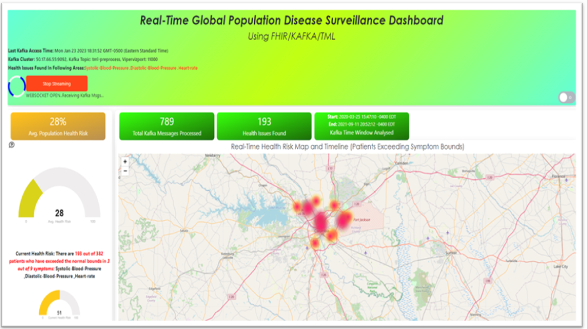

TML Real-Time Dashboards
=========================

You can create real-time dashboards using TML binary called **Viperviz**.  These dashboards are integrated with TML solutions and users can build very unique and powerful real-time dashboards using simple HTML and javascript.

.. note::

   Viperviz streams data **directly** from the **Docker Container** to the client browser.  Viperviz binary uses websockets to stream data to the browser.  This 
   means you do not need a third-party visualization tool.

Some sample dashboards samples are below.

.. figure:: d1.png

.. figure:: d4.png

.. figure:: hdash1.png

Running Dashboards
-------------------

Creating Real-Time Dashboard in TML are simple, yet very powerful and free.  No third-party visualization tool is necessary. 

.. note::
   Refer to :ref:`STEP 7: Real-Time Visualization: tml-system-step-7-kafka-visualization-dag` for creating dashboards and details on Viperviz.

Once you have created a dashboard to visualize TML data you enter a URL in your browser to run it.

Here is an example URL:

http://localhost:9005/dashboard.html?topic=iot-preprocess&offset=-1&groupid=&rollbackoffset=500&topictype=prediction&append=0&secure=1

.. list-table::

   * - **URL Key**
     - **Description**
   * - http://localhost:9005
     - Almost all of the dashboard will point to the IP and Port that Viperviz is listening on.  Viperviz has a built in webserver, so no setup is need, just plug 
       and play.

       The above URL points to localhost and port 9005 for Viperviz
   * - dashboard.html
     - TML Solution Studio (TSS) provides a template dashboard to get you up and running quickly.  This is a base dashboard but will show you how real-time data 
       from TML is analysed and processed.  As shown in the above dashboards, you can create amazing dashboards with HTML and Javascript.
   * - topic=iot-preprocess
     - In the topic key you specify the topic you want to consume data from.  Viperviz will start consuming from this topic, i.e. iot-preprocess or whatevev topic 
       you have created to store your data.

       Note: You can specify more than one topic to consume from, just separate multiple topics with comma.
   * - offset=-1
     - This tells Viperviz to start consuming from the latest data in the stream.
   * - groupid=
     - ignored
   * - rollbackoffset=500
     - This tells Viperviz to rollback the datastream by 500 offsets and send it to the browser.  NOTE: While you can increase this number - use it with caution 
       because it may overload your browser.  
   * - topictype=prediction
     - Leave as is
   * - append=0
     - If this is 0, the dashboard will not keep appending new data because it may crash your browser as lots of data accumulates.  If you set to 1, then data will 
       append.
   * - secure=1
     - Secure connection
