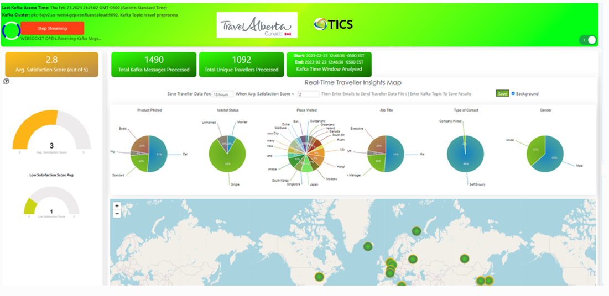

TML Real-Time Dashboards
=========================

You can create real-time dashboards using TML binary called **Viperviz**.  These dashboards are integrated with TML solutions and users can build very unique and powerful real-time dashboards using simple HTML and javascript.

.. note::

   Viperviz streams data **directly** from the **Docker Container** to the client browser.  Viperviz binary uses websockets to stream data to the browser.  This 
   means you do not need a third-party visualization tool.

Some sample dashboards samples are below.

.. figure:: d2.png

.. figure:: d3.png

.. figure:: d4.png

Running Dashboards
-------------------

Creating Real-Time Dashboard in TML are simple, yet very powerful and free.  No third-party visualization tool is necessary. 

.. note::
   Refer to :ref:`STEP 7: Real-Time Visualization: tml-system-step-7-kafka-visualization-dag` for creating 

Once you have created a dashboard to visualize TML data you enter a URL in your browser to run it.

Here is an example URL:

http://localhost:9005/dashboard.html?topic=iot-preprocess&offset=-1&groupid=&rollbackoffset=500&topictype=prediction&append=0&secure=1
