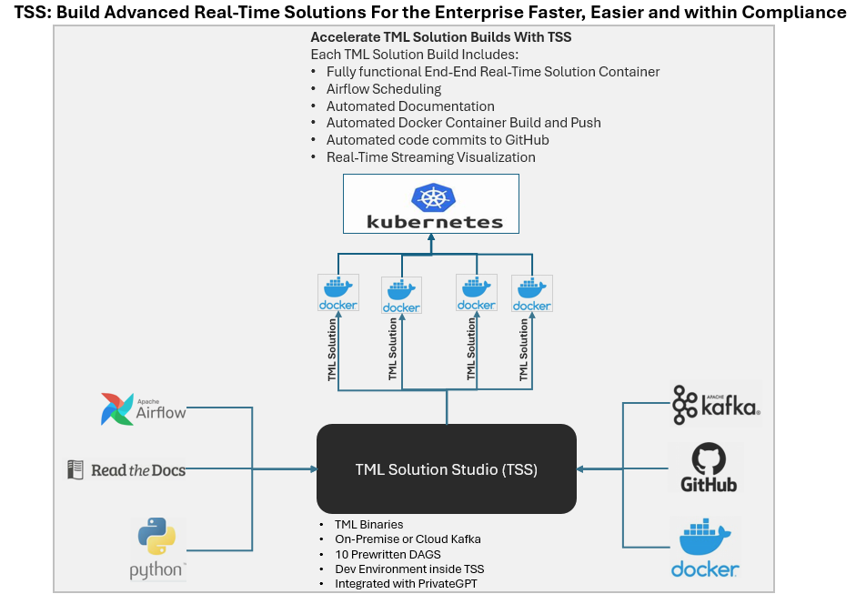
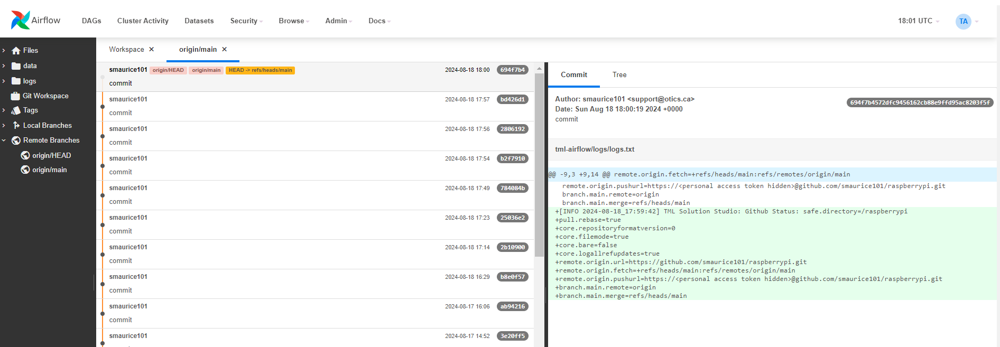

TML Solution Studio (TSS) Container
======================================

Coming Soon.

This is the main container that you need to use to build TML solutions.  Below is the :ref:`TSS Docker Run Command` to run the container.

.. important::
   Use this TSS container and start building amazing, advanced and scalable real-time data streaming solutions - with real-time dashboards - auto deployment to 
   Docker - auto solution documentation - integrated with AI - integrated with Github - integrated with Apache Airflow - integrated with Apache Kafka - in just a 
   few hours.

.. attention::

   **The following prerequisites MUST be met before you run the TML Solution Studio Container:**

   1. You MUST Install Docker - in Ubuntu run: sudo apt install docker.io

   2. You MUST have a `Github Account <https://github.com/>`_

   3. You MUST Clone Github Repo: https://github.com/smaurice101/raspberrypi.git

   4. You MUST Create Github **Personal Access Token** (Refer to :ref:`Generating Personal Access Tokens in Github`)

   5. You MUST have sign up for a `Docker Hub account: <https://hub.docker.com/>`_

   6. Create a `Readthedocs <https://app.readthedocs.org/>`_ account and get an API token: :ref:`Set Up Readthedocs`

   7. Create a `HiveMQ account <https://www.hivemq.com/>`_ - while this is OPTIONAL - if using MQTT and HiveMQ you will need this.

   FOLLOW THE :ref:`How To Use the TML Solution Container` SECTION.

TSS Contains a TML Dev Environment
----------------------------

.. important::
   Another powerful feature is the TSS TML Development environment which is contained directly inside the TSS container.  TSS comes with all the TML solution 
   components installed like: 1. Apache Kafka, 2. TML binaries, 3. MariaDB config db 4. your TML DAG scripts, 5. Viperviz for visualization

   Once you are satisfied with your solution - you can use the :ref:`STEP 8: Deploy TML Solution to Docker : tml-system-step-8-deploy-solution-to-docker-dag.py` 
   to deploy your solution to Docker.

.. tip::
   TML developers can test each component or their entire TML solution inside the TSS before deploying the solution in the container.  This is a very convenient 
   way to make sure all the solution components are working before shipping your TML product.

TSS Logging
-----------------

The entire TSS solution build process is logged and committed to Github.  This makes it very convenient to check for any errors in the TSS build process, and because errors are commited to the remote branch, the errors become visible to others to help in quickly rectifying any issues.

.. tip::
    The logs are committed to your Github folder: **/tml-airflow/logs/logs.txt**

.. figure:: tsslogs2.png

TSS Docker Run Command
--------------------

.. important::
   If you are producing data using a local file, you need to add an extra -v volume map to the /rawdata folder in the container: Refer to :ref:`Producing Data 
   Using a Local File`.

   For example add **-v /your_localmachine/foldername:/rawdata:z**, where **your_localmachine/foldername** is a path in your local machine, and it is where you 
   save your local file for processing.

   Your file must contains JSON messages on each line.  See `Sample File <https://github.com/smaurice101/raspberrypi/blob/main/tml- 
   airflow/data/IoTDatasample.txt>`_

.. code-block::

   docker run -d --net="host" 
   --env CHIP="AMD64"
   --env MAINHOST=127.0.0.1 
   --env TSS=1
   --env SOLUTIONNAME=TSS
   --env AIRFLOWPORT=9000 
   --env VIPERVIZPORT=9005
   -v /var/run/docker.sock:/var/run/docker.sock:z 
   -v /<your local dagsbackup folder>:/dagslocalbackup:z
   --env READTHEDOCS=<Token>
   --env GITREPOURL=<your git hub repo> 
   --env  GITUSERNAME=<your github username> 
   --env GITPASSWORD=<Personal Access Token> 
   --env DOCKERUSERNAME=<your docker hub account> 
   --env DOCKERPASSWORD=<password> 
   --env MQTTUSERNAME=<enter MQTT username>
   --env MQTTPASSWORD=<enter MQTT password>
   maadsdocker/tml-solution-studio-with-airflow-amd64

.. list-table::

   * - **Parameter**
     - **Description**
   * - CHIP
     - Specifies the container OS.  NOTE: If you are using MAC then 
 
       change to CHIP=ARM64 and run:
 
       **maadsdocker/tml-solution-studio-with-airflow-arm64** containter
   * - --env MAINHOST=127.0.0.1
     - This is the IP address for the TML solution 

       container.  It will normally listen 

       on 127.0.0.1
   * - TSS
     - Do not modify.
   * - SOLUTIONNAME
     - Do not modify.
   * - --env AIRFLOWPORT=9000 
     - This is the AIRFLOWPORT.  This port 

       will be needed to access the TML 

       solution studio from your browser.  

       For sample, enter: http://localhost:9000/
 
       You will be asked for a 

       username and password: enter **tml** for both.
   * - VIPERVIZPORT
     - Choose a Viperviz port for visualization.  

       For example, 9005
   * - -v /<your local dagsbackup folder>:/dagslocalbackup:z
     - If you like, you can also backsup the dags to your local folder with this volume mapping
   * - -v /var/run/docker.sock:/var/run/docker.sock:z 
     - This maps the docker volume to the container - 

       so TML studio can automatically build 

       your solution container.
   * - --env READTHEDOCS=<Token>
     - Create, copy and paste the Readthedocs token here.  Refer to :ref:`Set Up Readthedocs`
   * - --env GITREPOURL=<your github repo> 
     - This is your Git repo you cloned from: 

       https://github.com/smaurice101/raspberrypi.git. 
   * - --env GITUSERNAME=<your github username> 
     - This is the username to your repo.
   * - --env GITPASSWORD=<Personal Access Token> 
     - This is the **Personal Access Token** for 

       your repo.   

       Look at the image below to find out how 

       to generate this token.
   * - --env DOCKERUSERNAME=<your docker hub account> 
     - This is your Docker Hub username.
   * - --env DOCKERPASSWORD=<password> 
     - This is your password to Dockerhub account.
   * - --env MQTTUSERNAME=<your MQTT username> 
     - This is your MQTT username.
   * - --env MQTTPASSWORD=<MQTT password> 
     - This is your password to MQTT cluster.
   * - **maadsdocker/tml-solution-studio-with-airflow-amd64**
     - This is the official TML Solution Studio container.  If using MAC change 

       **amd64** to **arm64**       

.. important::
   It is highly recommended you map your local folder to the **dagslocalbackup** folder: 

    **-v /<your local dagsbackup folder>:/dagslocalbackup:z**

    This ensures that if anything happens to Github you always have a local copy of all

    of your solution dags.

Generating Personal Access Tokens in Github
-------------------------

.. figure:: tmlgit2.png

Generating Personal Access Tokens in Github: Explanation
^^^^^^^^^^^^^^^^^^^^^^^^^^^^^^^^^

.. tip:: 
   Follow these steps:

      1. Log in to your Github account
      
      2. In the Top-Right corner of your Github account click **Settings**
      
      3. In the next screen, scroll all the way down and click **<> Developer settings**
      
      4. Click **Personal access tokens**
      
      5. Choose **Tokens (classic)**
      
      6. Click **Generate new token** -  Your token should start with **ghp_**
      
      7. Copy and paste token in **GITPASSWORD** docker run command: :ref:`TSS Docker Run Command`

How To Use the TML Solution Container
-------------------------

.. tip::
   Once you have the TML Solution container running you can go to your favourite browser and type the URL: http://localhost:9000

.. note::
   
   The PORT number in the URL is what you specified in the Docker Run AIRFLOWPORT parameter i.e. **--env AIRFLOWPORT=9000**

After you enter the URL you will the following website:

.. figure:: ts1.png

.. tip::

   The username and password are both **tml**

After you have signed in successfully you will see the following screen with example DAGs:

.. figure:: ts2.png

If you scroll down you will see the **TML DAGs** - as defined here: :ref:`DAG Table`.  These are the DAGs you will use to build your TML Solutions:

TSS Code Editor
-----------------

.. important::
   Next go into the DAG Code Editor: Select Drop-down menu **Admin --> DAGs Code Editor**.  Most of your TML Solution building will be done here.  Note the DAGs 
   solution process flows defined here: :ref:`Apache Airflow DAGs`

.. figure:: ts4.png

