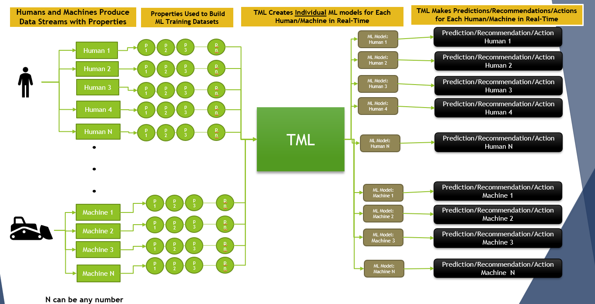
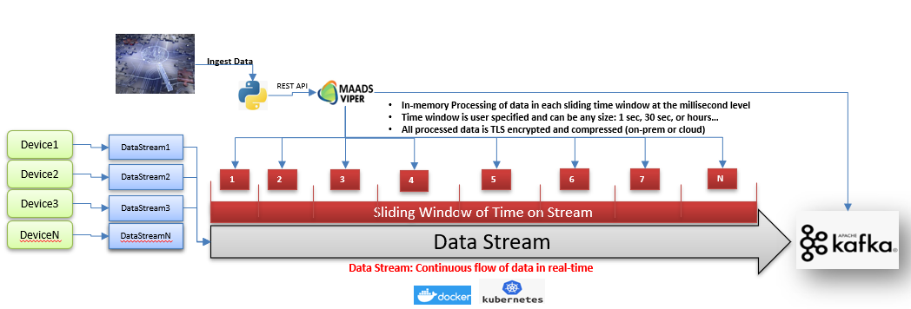
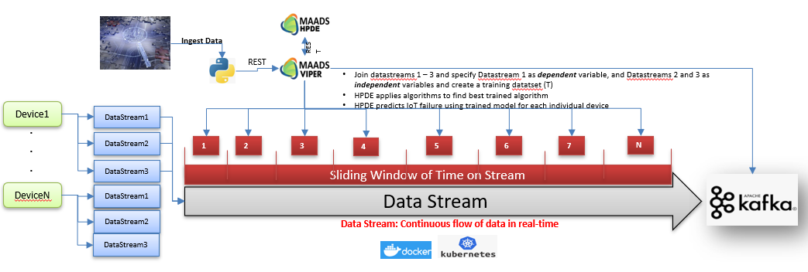

TML Performs Entity Level Machine Learning and Processing
========================================================

What does entity level processing and machine learning mean? 
-----------------------

An entity is any device or object that produces real-time data.  TML processes data from **individual devices or objects**.  This means TML can create machine learning models for each invidual device.  

.. important:: 

   The power of real-time entity based processing and machine learning means that if there are **1 million devices generating data, TML can create 1 million machine 
   learning models for each device**.

   Because each device or object operates in its own environment - by processing each device invidually - TML offers a much deeper understanding of the behaviour of 
   that device, and therefore able to **predict the future behaviours** of that device more accurately.

TML Processes Data Using Sliding Time Windows
----------------------------------------

.. note::

   * TML performs in-memory processing of data in the Kafka Topic using TWO components across all sliding time windows
   * REST API connect MAADSTML python script to MAADS-VIPER
   * 35+ different processing types: min, max, dataage, timediff, variance, anomaly prediction, outlier detection, etc…
   * Apache Kafka is the central source of both input and output data – no external real-time database needed
   * No SQL queries are made for processing and machine learning
   * All TML solutions are containerized with Docker and scale with Kubernetes

TML Machine Learning  Using Sliding Time Windows
----------------------------------------

.. note::

   * TML performs in-memory machine learning of data in the Kafka Topic by joining data streams using THREE components across all sliding time windows:   
   * REST API connect MAADSTML python script to MAADS-VIPER and MAADS-HPDE
   * 5 different algorithm types: logistic regression, linear regression, gradient boosting, neural networks, ridge regression
   * Apache Kafka is the central source of both input and output data for estimated parameters – no external real-time database needed
   * TML auto-creates individual machine learning models for each Device at the “entity” level and joins datastreams 1-3 for each device and user specifies 
   * “Dependent” variable streams, and “Independent” variables streams
