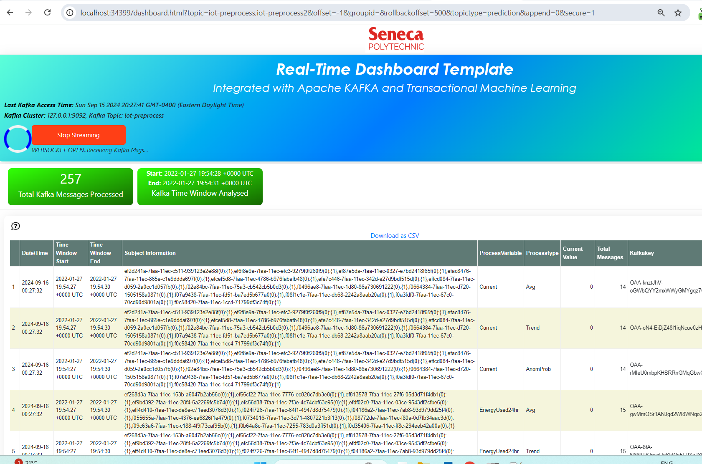

TML Solution Examples
======================

All examples simply follow the steps here :ref:`Lets Start Building a TML Solution`

Real-Time IoT Data Preprocessing Example
----------------------

.. figure:: soldags1.png
   :scale: 70%

Solution DAG Code: solution_preprocessing_dag-myawesometmlsolution
^^^^^^^^^^^^^^^^^^^^^^^^^^^^^^^^^

The Python code below is the code representtion for the figure.  **This code builds the entire end-end TML solution in about 2 minutes.**

.. code-block:: PYTHON

      from __future__ import annotations
      import pendulum
      from airflow.decorators import task
      from airflow.models.dag import DAG
      from airflow.operators.bash import BashOperator
      from airflow.sensors.external_task import ExternalTaskSensor 
      import tsslogging
      import os
      from datetime import datetime
      import importlib
      from airflow.operators.python import (
          ExternalPythonOperator,
          PythonOperator
      )
      step1 = importlib.import_module("tml-solutions.myawesometmlsolution.tml_system_step_1_getparams_dag-myawesometmlsolution")
      step2 = importlib.import_module("tml-solutions.myawesometmlsolution.tml_system_step_2_kafka_createtopic_dag-myawesometmlsolution")
      step3 = importlib.import_module("tml-solutions.myawesometmlsolution.tml_read_LOCALFILE_step_3_kafka_producetotopic_dag-myawesometmlsolution")
      step4 = importlib.import_module("tml-solutions.myawesometmlsolution.tml_system_step_4_kafka_preprocess_dag-myawesometmlsolution")
      step5 = importlib.import_module("tml-solutions.myawesometmlsolution.tml_system_step_5_kafka_machine_learning_dag-myawesometmlsolution")
      step6 = importlib.import_module("tml-solutions.myawesometmlsolution.tml_system_step_6_kafka_predictions_dag-myawesometmlsolution")
      step7 = importlib.import_module("tml-solutions.myawesometmlsolution.tml_system_step_7_kafka_visualization_dag-myawesometmlsolution")
      step8 = importlib.import_module("tml-solutions.myawesometmlsolution.tml_system_step_8_deploy_solution_to_docker_dag-myawesometmlsolution")
      step9 = importlib.import_module("tml-solutions.myawesometmlsolution.tml_system_step_9_privategpt_qdrant_dag-myawesometmlsolution")
      step10 = importlib.import_module("tml-solutions.myawesometmlsolution.tml_system_step_10_documentation_dag-myawesometmlsolution")
      
      
      with DAG(
          dag_id="solution_preprocessing_dag-myawesometmlsolution",
          start_date=datetime(2023, 1, 1),
          schedule=None,
      ) as dag:
        start_task = BashOperator(
          task_id="start_tasks_tml_preprocessing",
          bash_command="echo 'Start task'",
        )
      # STEP 1: Get the Parameters
        sensor_A = PythonOperator(
                  task_id="step_1_solution_task_getparams",
                  python_callable=step1.getparams,
                  provide_context=True,
        )
      
      # STEP 2: Create the Kafka topics
        sensor_B = PythonOperator(
            task_id="step_2_solution_task_createtopic",
            python_callable=step2.setupkafkatopics,
            provide_context=True,
        )
      # STEP 3: Produce data to topic        
        sensor_C = PythonOperator(
            task_id="step_3_solution_task_producetotopic",
            python_callable=step3.startproducing,
            provide_context=True,
        )
      # STEP 4: Preprocess the data        
        sensor_D = PythonOperator(
            task_id="step_4_solution_task_preprocess",
            python_callable=step4.dopreprocessing,
            provide_context=True,
        )
      # STEP 7: Containerize the solution     
        sensor_E = PythonOperator(
            task_id="step_7_solution_task_visualization",
            python_callable=step7.startstreamingengine,
            provide_context=True,
        )
      # STEP 8: Containerize the solution        
        sensor_F = PythonOperator(
            task_id="step_8_solution_task_containerize",
            python_callable=step8.dockerit,
            provide_context=True,      
        )
        start_task2 = BashOperator(
          task_id="Starting_Docker",
          bash_command="echo 'Start task Completed'",
        )    
        start_task3 = BashOperator(
          task_id="Starting_Documentation",
          bash_command="echo 'Start task Completed'",
        )
        start_task4 = BashOperator(
          task_id="Completed_TML_Setup_Now_Spawn_Main_Processes",
          bash_command="echo 'Start task Completed'",
        )
      # STEP 10: Document the solution
        sensor_G = PythonOperator(
            task_id="step_10_solution_task_document",
            python_callable=step10.generatedoc,
            provide_context=True,      
        )
      
        start_task >> sensor_A >> sensor_B >> start_task4 >> [sensor_C, sensor_D, sensor_E] >> start_task2 >> sensor_F >> start_task3  >> sensor_G

Successful Run Screen
"""""""""""""""""""""""

Below the TSS/Airflow screen that shows a successful TML solution build.  All colors should be green for all of the steps.  If you see a red color, it means your DAG has an error.

Solution Documentation Example
---------------------------
This is the solution documentation that is auto-generated by TSS.  Every TML solution you create will have its own auto-generated documentation that will provide details on the entire solution.

.. important::
   You will need to run the solution in your own TSS environment for the links to work in this documentation.  It is provided as an example of the powerful capabilities of TSS: https://myawesometmlsolution.readthedocs.io/en/latest/index.html

Here is the Solution Real-Time Dashboard:

Here is the Solution Docker Run container:

.. figure:: sp6.png
   :scale: 60%

The entire end-end real-time solution took less than 2 minutes to build:

.. figure:: sp7.png
   :scale: 60%

Real-Time IoT Data Preprocessing and Machine Learning Example 
-----------------------------

comming soon

Cybersecurity Solution with PrivateGPT and Qdrant Vector DB
-------------------------------------

comming soon
