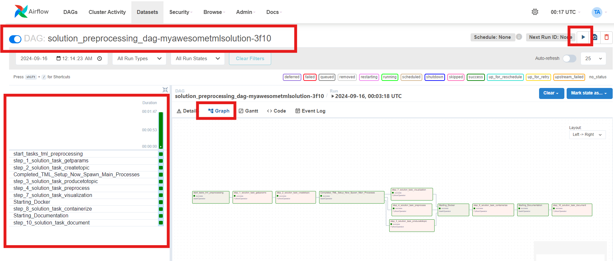
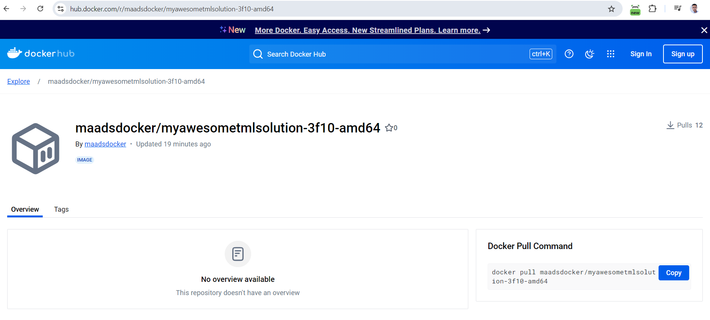

TML Solution Examples
======================

All examples simply follow the steps here :ref:`Lets Start Building a TML Solution`

.. tip::
   You can watch the development and running of the examples below in this `Youtube video <https://www.youtube.com/watch?v=ZzLL3tfBsh0>`_.

.. list-table::

   * - **TSS Starter Examples**
   * - 1. :ref:`Real-Time IoT Data Preprocessing Example`
       
       This will process IoT data for anomalies, stream the results to a dashboard,

       build and push the container to docker hub, automatically create the

       solution documentation on Readthdocs, and auto-commit your solution

       to GitHub.

       Data Used is here (unzip the file): `Demo Data <https://github.com/smaurice101/raspberrypi/blob/main/tml-airflow/data/IoTData.zip>`_
   * - 2. :ref:`Real-Time IoT Data Preprocessing With Secondary Preprocessing and With Map Example`

       This will process IoT data for anomalies, stream the results to a dashboard,

       but will also perform a **secondary processing** using 

       :ref:`STEP 4b: Preprocesing 2 Data: tml-system-step-4b-kafka-preprocess-dag`

       to build and push the container to docker hub, automatically create the

       solution documentation on Readthdocs, and auto-commit your solution

       to GitHub.
   * - 2b. :ref:`Real-Time IoT Data Preprocessing With RESTAPI, Secondary Preprocessing and With Map Example`

       This solution is the same as 2, BUT this will solution will ingest real-time data from a RESTAPI client.

       To run this solution you must:
       
        1. Have this `solution <https://github.com/smaurice101/raspberrypitss/tree/main/tml-airflow/dags/tml-solutions/iotsolution-restapi-3f10>`_ running in Kubernetes
 
        2. Download the `IoTData.zip demo data <https://github.com/smaurice101/raspberrypi/blob/main/tml-airflow/data/IoTData.zip>`_

        3. Download and Run the client `RESTAPI file <https://github.com/smaurice101/raspberrypi/blob/main/tml-airflow/dags/tml_client_RESTAPI_step_3_kafka_producetotopic.py>`_

        4. Store these files to your local computer

   * - 2c. :ref:`Real-Time IoT Data Preprocessing With gRPC, Secondary Preprocessing and With Map Example`

       This solution is the same as 2, BUT this will solution will ingest real-time data from a gRPC client.

       To run this solution you must:
       
        1. Have this `solution <https://github.com/smaurice101/raspberrypitss/tree/main/tml-airflow/dags/tml-solutions/iotsolution-grpc-3f10>`_ running in Kubernetes

        2. Download the `IoTData.zip demo data <https://github.com/smaurice101/raspberrypi/blob/main/tml-airflow/data/IoTData.zip>`_

        3. Download and Run the client `gRPC file <https://github.com/smaurice101/raspberrypi/blob/main/tml-airflow/dags/tml_client_gRPC_step_3_kafka_producetotopic.py>`_

        4. Store these files to your local computer

   * - 3. :ref:`Real-Time IoT Data Preprocessing and Machine Learning Example`
      
       This will process IoT data, and perform entity level machine learning (TML)

       on the data, stream the results to a dashboard,

       build and push the container to docker hub, automatically create the

       solution documentation on Readthdocs, and auto-commit your solution

       to GitHub.

       Data Used is here (unzip the file): `Demo Data <https://github.com/smaurice101/raspberrypi/blob/main/tml-airflow/data/IoTData.zip>`_
   * - 4. :ref:`Cybersecurity Solution with PrivateGPT, MQTT, HiveMQ`
     
       This will process cybersecurity data for anomalies, 

       and further process the TML anomalies
      
       data by sending the results to privateGPT container. It will stream 

       the results to a dashboard,

       build and push the container to docker hub, automatically create the

       solution documentation on Readthdocs, and auto-commit your solution

       to GitHub.

       MQTT Client File here is: `MQTT Client <https://github.com/smaurice101/raspberrypi/blob/main/tml-airflow/python/cyberwithprivategptmqtt.py>`_

       Data Used is here (unzip the file): `Demo Data <https://github.com/smaurice101/raspberrypi/blob/main/tml-airflow/data/cisco_network_data.zip>`_
   * - 4b. To Scale this Solution Watch the YouTube Video: `here <https://www.youtube.com/watch?v=MEbmTXIQpVo>`_

.. note::
   While we are using a local file for the demos, this is to make it easy for users to build and run these solutions themselves.  Ideally, in industry, we would use APIs like MQTT, REST and gRPC to ingest data from devices and stream it to TML solutions.  TSS allows you to build solutions with these APIs with pre-written DAGs here:

   - :ref:`STEP 3a: Produce Data Using MQTT: tml-read-MQTT-step-3-kafka-producetotopic-dag`

     - With pre-built client library: :ref:`STEP 3a.i: MQTT CLIENT`

   - :ref:`STEP 3b: Produce Data Using RESTAPI: tml-read-RESTAPI-step-3-kafka-producetotopic-dag`

     - With pre-built client library: :ref:`STEP 3b.i: REST API CLIENT`

   - :ref:`STEP 3c: Produce Data Using gRPC: tml-read-gRPC-step-3-kafka-producetotopic-dag`

     - With pre-built client library: :ref:`STEP 3c.i: gRPC API CLIENT`

Real-Time IoT Data Preprocessing Example
----------------------

:ref:`Solution DAG Code: solution_preprocessing_dag-myawesometmlsolution-3f10`

This IoT Data Preprocessing Solution DAG: **solution_preprocessing_dag-myawesometmlsolution-3f10** reads local file data in **/rawdata/IoTdata.txt** and streams it to Kafka.  The streaming data are then processed with TML binary Viper and the output data are streamed to a browser that runs the dashboard: dashboard.html that is located in /Viperviz/viperviz/views.  

The solution will automatically build and push the solution container to docker hub, automatically create documentation on READTHEDOCS.io and **automatically commits your solution code to Github, all in about 2 minutes.**

.. figure:: soldags1.png
   :scale: 70%

Solution DAG Code: solution_preprocessing_dag-myawesometmlsolution-3f10
^^^^^^^^^^^^^^^^^^^^^^^^^^^^^^^^^

The Python code below is the code representtion for the figure.  **This code builds the entire end-end TML solution in about 2 minutes.**

.. code-block:: PYTHON

      from __future__ import annotations
      
      import pendulum
      from airflow.decorators import task
      from airflow.models.dag import DAG
      from airflow.operators.bash import BashOperator
      from airflow.sensors.external_task import ExternalTaskSensor 
      import tsslogging
      import os
      from datetime import datetime
      import importlib
      from airflow.operators.python import (
          ExternalPythonOperator,
          PythonOperator
      )
      step1 = importlib.import_module("tml-solutions.myawesometmlsolution-3f10.tml_system_step_1_getparams_dag-myawesometmlsolution-3f10")
      step2 = importlib.import_module("tml-solutions.myawesometmlsolution-3f10.tml_system_step_2_kafka_createtopic_dag-myawesometmlsolution-3f10")
      step3 = importlib.import_module("tml-solutions.myawesometmlsolution-3f10.tml_read_LOCALFILE_step_3_kafka_producetotopic_dag-myawesometmlsolution-3f10")
      step4 = importlib.import_module("tml-solutions.myawesometmlsolution-3f10.tml_system_step_4_kafka_preprocess_dag-myawesometmlsolution-3f10")
      step5 = importlib.import_module("tml-solutions.myawesometmlsolution-3f10.tml_system_step_5_kafka_machine_learning_dag-myawesometmlsolution-3f10")
      step6 = importlib.import_module("tml-solutions.myawesometmlsolution-3f10.tml_system_step_6_kafka_predictions_dag-myawesometmlsolution-3f10")
      step7 = importlib.import_module("tml-solutions.myawesometmlsolution-3f10.tml_system_step_7_kafka_visualization_dag-myawesometmlsolution-3f10")
      step8 = importlib.import_module("tml-solutions.myawesometmlsolution-3f10.tml_system_step_8_deploy_solution_to_docker_dag-myawesometmlsolution-3f10")
      step9 = importlib.import_module("tml-solutions.myawesometmlsolution-3f10.tml_system_step_9_privategpt_qdrant_dag-myawesometmlsolution-3f10")
      step10 = importlib.import_module("tml-solutions.myawesometmlsolution-3f10.tml_system_step_10_documentation_dag-myawesometmlsolution-3f10")
      
      
      with DAG(
          dag_id="solution_preprocessing_dag-myawesometmlsolution-3f10",
          start_date=datetime(2023, 1, 1),
          schedule=None,
      ) as dag:
        start_task = BashOperator(
          task_id="start_tasks_tml_preprocessing",
          bash_command="echo 'Start task'",
        )
      # STEP 1: Get the Parameters
        sensor_A = PythonOperator(
                  task_id="step_1_solution_task_getparams",
                  python_callable=step1.getparams,
                  provide_context=True,
        )
      
      # STEP 2: Create the Kafka topics
        sensor_B = PythonOperator(
            task_id="step_2_solution_task_createtopic",
            python_callable=step2.setupkafkatopics,
            provide_context=True,
        )
      # STEP 3: Produce data to topic        
        sensor_C = PythonOperator(
            task_id="step_3_solution_task_producetotopic",
            python_callable=step3.startproducing,
            provide_context=True,
        )
      # STEP 4: Preprocess the data        
        sensor_D = PythonOperator(
            task_id="step_4_solution_task_preprocess",
            python_callable=step4.dopreprocessing,
            provide_context=True,
        )
      # STEP 7: Containerize the solution     
        sensor_E = PythonOperator(
            task_id="step_7_solution_task_visualization",
            python_callable=step7.startstreamingengine,
            provide_context=True,
        )
      # STEP 8: Containerize the solution        
        sensor_F = PythonOperator(
            task_id="step_8_solution_task_containerize",
            python_callable=step8.dockerit,
            provide_context=True,      
        )
        start_task2 = BashOperator(
          task_id="Starting_Docker",
          bash_command="echo 'Start task Completed'",
        )    
        start_task3 = BashOperator(
          task_id="Starting_Documentation",
          bash_command="echo 'Start task Completed'",
        )
        start_task4 = BashOperator(
          task_id="Completed_TML_Setup_Now_Spawn_Main_Processes",
          bash_command="echo 'Start task Completed'",
        )
      # STEP 10: Document the solution
        sensor_G = PythonOperator(
            task_id="step_10_solution_task_document",
            python_callable=step10.generatedoc,
            provide_context=True,      
        )
      
        start_task >> sensor_A >> sensor_B >> start_task4 >> [sensor_C, sensor_D, sensor_E] >> start_task2 >> sensor_F >> start_task3  >> sensor_G

TML Dag Parameter Changes To Be Made For: solution_preprocessing_dag-myawesometmlsolution-3f10
""""""""""""""""""""""""""""""""

.. note::
   No TML Dag parameter changes are needed for this solution.

Successful Run Screen
"""""""""""""""""""""""

Below the TSS/Airflow screen that shows a successful TML solution build.  All colors should be green for all of the steps.  If you see a red color, it means your DAG has an error.

Solution Documentation Example
---------------------------
This is the solution documentation that is auto-generated by TSS.  Every TML solution you create will have its own auto-generated documentation that will provide details on the entire solution.

.. figure:: sp1.png
   :scale: 60%

.. important::
   You will need to run the solution in your own TSS environment for the links to work in this documentation.  It is provided as an example of the powerful capabilities of TSS: `https://myawesometmlsolution-3f10.readthedocs.io/ <https://myawesometmlsolution-3f10.readthedocs.io/>`_

Here is the Solution Real-Time Dashboard:

.. figure:: sp4.png
   :scale: 50%

Here is the Solution Docker Run container:

The entire end-end real-time solution took less than 2 minutes to build:

.. figure:: sp7.png
   :scale: 50%

Github Commits
----------------

Real-Time IoT Data Preprocessing With Secondary Preprocessing and With Map Example
-------------------------------

:ref:`Solution DAG Code: solution_preprocessing_dag-iotsolution-3f10`

This IoT Data Preprocessing Solution DAG: **solution_preprocessing_dag-myawesometmlsolution-3f10** reads local file data in **/rawdata/IoTdata.txt** and streams it to Kafka.  The streaming data are then processed TWICE with TML binary Viper and the output data are streamed to a browser that runs the dashboard with a map: iot-failure-seneca.html that is located in /Viperviz/viperviz/views.  

The solution will automatically build and push the solution container to docker hub, automatically create documentation on READTHEDOCS.io and **automatically commits your solution code to Github, all in about 2 minutes.**

Solution DAG Code: solution_preprocessing_dag-iotsolution-3f10
^^^^^^^^^^^^^^^^^^^^^^^^^^^^^^^^^^^^^^^^

.. code-block:: PYTHON

      from __future__ import annotations
      
      import pendulum
      from airflow.decorators import task
      from airflow.models.dag import DAG
      from airflow.operators.bash import BashOperator
      from airflow.sensors.external_task import ExternalTaskSensor 
      import tsslogging
      import os
      from datetime import datetime
      import importlib
      from airflow.operators.python import (
          ExternalPythonOperator,
          PythonOperator
      )
      step1 = importlib.import_module("tml-solutions.iotsolution-3f10.tml_system_step_1_getparams_dag-iotsolution-3f10")
      step2 = importlib.import_module("tml-solutions.iotsolution-3f10.tml_system_step_2_kafka_createtopic_dag-iotsolution-3f10")
      step3 = importlib.import_module("tml-solutions.iotsolution-3f10.tml_read_LOCALFILE_step_3_kafka_producetotopic_dag-iotsolution-3f10")
      step4 = importlib.import_module("tml-solutions.iotsolution-3f10.tml_system_step_4_kafka_preprocess_dag-iotsolution-3f10")
      step4b = importlib.import_module("tml-solutions.iotsolution-3f10.tml_system_step_4b_kafka_preprocess_dag-iotsolution-3f10")
      
      step5 = importlib.import_module("tml-solutions.iotsolution-3f10.tml_system_step_5_kafka_machine_learning_dag-iotsolution-3f10")
      step6 = importlib.import_module("tml-solutions.iotsolution-3f10.tml_system_step_6_kafka_predictions_dag-iotsolution-3f10")
      step7 = importlib.import_module("tml-solutions.iotsolution-3f10.tml_system_step_7_kafka_visualization_dag-iotsolution-3f10")
      step8 = importlib.import_module("tml-solutions.iotsolution-3f10.tml_system_step_8_deploy_solution_to_docker_dag-iotsolution-3f10")
      step9 = importlib.import_module("tml-solutions.iotsolution-3f10.tml_system_step_9_privategpt_qdrant_dag-iotsolution-3f10")
      step10 = importlib.import_module("tml-solutions.iotsolution-3f10.tml_system_step_10_documentation_dag-iotsolution-3f10")
      
      
      with DAG(
          dag_id="solution_preprocessing_dag-iotsolution-3f10",
          start_date=datetime(2023, 1, 1),
          schedule=None,
      ) as dag:
        start_task = BashOperator(
          task_id="start_tasks_tml_preprocessing",
          bash_command="echo 'Start task'",
        )
      # STEP 1: Get the Parameters
        sensor_A = PythonOperator(
                  task_id="step_1_solution_task_getparams",
                  python_callable=step1.getparams,
                  provide_context=True,
        )
      
      # STEP 2: Create the Kafka topics
        sensor_B = PythonOperator(
            task_id="step_2_solution_task_createtopic",
            python_callable=step2.setupkafkatopics,
            provide_context=True,
        )
      # STEP 3: Produce data to topic        
        sensor_C = PythonOperator(
            task_id="step_3_solution_task_producetotopic",
            python_callable=step3.startproducing,
            provide_context=True,
        )
      # STEP 4: Preprocess the data        
        sensor_D = PythonOperator(
            task_id="step_4_solution_task_preprocess",
            python_callable=step4.dopreprocessing,
            provide_context=True,
        )
          # STEP 4b: Preprocess the data        
        sensor_D2 = PythonOperator(
            task_id="step_4b_solution_task_preprocess",
            python_callable=step4b.dopreprocessing,
            provide_context=True,
        )    
      # STEP 7: Containerize the solution     
        sensor_E = PythonOperator(
            task_id="step_7_solution_task_visualization",
            python_callable=step7.startstreamingengine,
            provide_context=True,
        )
      # STEP 8: Containerize the solution        
        sensor_F = PythonOperator(
            task_id="step_8_solution_task_containerize",
            python_callable=step8.dockerit,
            provide_context=True,      
        )
        start_task2 = BashOperator(
          task_id="Starting_Docker",
          bash_command="echo 'Start task Completed'",
        )    
        start_task3 = BashOperator(
          task_id="Starting_Documentation",
          bash_command="echo 'Start task Completed'",
        )
        start_task4 = BashOperator(
          task_id="Completed_TML_Setup_Now_Spawn_Main_Processes",
          bash_command="echo 'Start task Completed'",
        )
      # STEP 10: Document the solution
        sensor_G = PythonOperator(
            task_id="step_10_solution_task_document",
            python_callable=step10.generatedoc,
            provide_context=True,      
        )
      
        start_task >> sensor_A >> sensor_B >> start_task4 >> [sensor_C, sensor_D, sensor_D2, sensor_E] >> start_task2 >> sensor_F >> start_task3  >> sensor_G

TML Dag Parameter Changes To Be Made For: solution_preprocessing_dag-iotsolution-3f10
""""""""""""""""""""""""""""""""

.. note::
   No TML Dag parameter changes are needed for this solution.

Successful Run Screen
"""""""""""""""""""""""

Below the TSS/Airflow screen that shows a successful TML solution build.  All colors should be green for all of the steps.  If you see a red color, it means your DAG has an error.

Solution Documentation Example
---------------------------
This is the solution documentation that is auto-generated by TSS.  Every TML solution you create will have its own auto-generated documentation that will provide details on the entire solution.

.. important::
   You will need to run the solution in your own TSS environment for the links to work in this documentation.  It is provided as an example of the powerful capabilities of TSS: `https://iotsolution-3f10.readthedocs.io/ <https://iotsolution-3f10.readthedocs.io/>`_

Here is the Solution Real-Time Dashboard:

Here is the Solution Docker Run container:

Real-Time IoT Data Preprocessing With RESTAPI, Secondary Preprocessing and With Map Example
----------------------------------

:ref:`Solution DAG Code: solution_preprocessing_dag_restapi-iotsolution-restapi-3f10`

This IoT Data Preprocessing Solution DAG: **solution_preprocessing_dag_restapi-iotsolution-restapi-3f10** ingest data by REST API.  Users can stream data using the `client REST file <https://github.com/smaurice101/raspberrypi/blob/main/tml-airflow/dags/tml_client_RESTAPI_step_3_kafka_producetotopic.py>`_ into Kubernetes.

The streaming data are then processed TWICE with TML binary Viper and the output data are streamed to a browser that runs the dashboard with a map: iot-failure-seneca.html that is located in /Viperviz/viperviz/views.  

The solution will automatically build and push the solution container to docker hub, automatically create documentation on READTHEDOCS.io and **automatically commits your solution code to Github, all in about 2 minutes.**

Solution DAG Code: solution_preprocessing_dag_restapi-iotsolution-restapi-3f10
^^^^^^^^^^^^^^^^^^^^^^^^^^^^^^^^^^^^^^^^

.. code-block:: PYTHON

      from __future__ import annotations
      
      import pendulum
      from airflow.decorators import task
      from airflow.models.dag import DAG
      from airflow.operators.bash import BashOperator
      from airflow.sensors.external_task import ExternalTaskSensor 
      import tsslogging
      import os
      from datetime import datetime
      
      import importlib
      from airflow.operators.python import (
          ExternalPythonOperator,
          PythonOperator
      )
      step1 = importlib.import_module("tml-solutions.iotsolution-restapi-3f10.tml_system_step_1_getparams_dag-iotsolution-restapi-3f10")
      step2 = importlib.import_module("tml-solutions.iotsolution-restapi-3f10.tml_system_step_2_kafka_createtopic_dag-iotsolution-restapi-3f10")
      step3 = importlib.import_module("tml-solutions.iotsolution-restapi-3f10.tml_read_RESTAPI_step_3_kafka_producetotopic_dag-iotsolution-restapi-3f10")
      step4 = importlib.import_module("tml-solutions.iotsolution-restapi-3f10.tml_system_step_4_kafka_preprocess_dag-iotsolution-restapi-3f10")
      step4b = importlib.import_module("tml-solutions.iotsolution-restapi-3f10.tml_system_step_4b_kafka_preprocess_dag-iotsolution-restapi-3f10")
      
      step5 = importlib.import_module("tml-solutions.iotsolution-restapi-3f10.tml_system_step_5_kafka_machine_learning_dag-iotsolution-restapi-3f10")
      step6 = importlib.import_module("tml-solutions.iotsolution-restapi-3f10.tml_system_step_6_kafka_predictions_dag-iotsolution-restapi-3f10")
      step7 = importlib.import_module("tml-solutions.iotsolution-restapi-3f10.tml_system_step_7_kafka_visualization_dag-iotsolution-restapi-3f10")
      step8 = importlib.import_module("tml-solutions.iotsolution-restapi-3f10.tml_system_step_8_deploy_solution_to_docker_dag-iotsolution-restapi-3f10")
      step9 = importlib.import_module("tml-solutions.iotsolution-restapi-3f10.tml_system_step_9_privategpt_qdrant_dag-iotsolution-restapi-3f10")
      step10 = importlib.import_module("tml-solutions.iotsolution-restapi-3f10.tml_system_step_10_documentation_dag-iotsolution-restapi-3f10")
      
      with DAG(
          dag_id="solution_preprocessing_dag_restapi-iotsolution-restapi-3f10",
          start_date=datetime(2023, 1, 1),
          schedule=None,
      ) as dag:
        start_task = BashOperator(
          task_id="start_tasks_tml_preprocessing_restapi",
          bash_command="echo 'Start task'",
        )
      # STEP 1: Get the Parameters
        sensor_A = PythonOperator(
                  task_id="step_1_solution_task_getparams",
                  python_callable=step1.getparams,
                  provide_context=True,
        )
      
      # STEP 2: Create the Kafka topics
        sensor_B = PythonOperator(
            task_id="step_2_solution_task_createtopic",
            python_callable=step2.setupkafkatopics,
            provide_context=True,
        )
      # STEP 3: Produce data to topic        
        sensor_C = PythonOperator(
            task_id="step_3_solution_task_producetotopic",
            python_callable=step3.startproducing,
            provide_context=True,
        )
      # STEP 4: Preprocess the data        
        sensor_D = PythonOperator(
            task_id="step_4_solution_task_preprocess",
            python_callable=step4.dopreprocessing,
            provide_context=True,
        )
      # STEP 4b: Preprocess the data        
        sensor_D2 = PythonOperator(
            task_id="step_4b_solution_task_preprocess",
            python_callable=step4b.dopreprocessing,
            provide_context=True,
        )
          
      # STEP 7: Containerize the solution     
        sensor_E = PythonOperator(
            task_id="step_7_solution_task_visualization",
            python_callable=step7.startstreamingengine,
            provide_context=True,
        )
      # STEP 8: Containerize the solution        
        sensor_F = PythonOperator(
            task_id="step_8_solution_task_containerize",
            python_callable=step8.dockerit,
            provide_context=True,      
        )
        start_task2 = BashOperator(
          task_id="Starting_Docker",
          bash_command="echo 'Start task Completed'",
        )    
        start_task3 = BashOperator(
          task_id="Starting_Documentation",
          bash_command="echo 'Start task Completed'",
        )
        start_task4 = BashOperator(
          task_id="Completed_TML_Setup_Now_Spawn_Main_Processes",
          bash_command="echo 'Start task Completed'",
        )
      # STEP 10: Document the solution
        sensor_G = PythonOperator(
            task_id="step_10_solution_task_document",
            python_callable=step10.generatedoc,
            provide_context=True,      
        )
      
        start_task >> sensor_A >> sensor_B >> start_task4 >> [sensor_C, sensor_D, sensor_D2, sensor_E] >> start_task2 >> sensor_F >> start_task3  >> sensor_G

TML Dag Parameter Changes To Be Made For: solution_preprocessing_dag_restapi-iotsolution-restapi-3f10
""""""""""""""""""""""""""""""""

.. note::
   No TML Dag parameter changes are needed for this solution.

Successful Run Screen
"""""""""""""""""""""""

Below the TSS/Airflow screen that shows a successful TML solution build.  All colors should be green for all of the steps.  If you see a red color, it means your DAG has an error.

Solution Documentation Example
"""""""""""""""""""""""""""""
This is the solution documentation that is auto-generated by TSS.  Every TML solution you create will have its own auto-generated documentation that will provide details on the entire solution.

.. important::
   You will need to run the solution in your own TSS environment for the links to work in this documentation.  It is provided as an example of the powerful capabilities of TSS: `https://iotsolution-restapi-3f10.readthedocs.io/en/latest/index.html>`_

Here is the Solution Real-Time Dashboard:

Here is the Solution Docker Run container:

Real-Time IoT Data Preprocessing With gRPC, Secondary Preprocessing and With Map Example
----------------------------------------

:ref:`Solution DAG Code: solution_preprocessing_dag_grpc-iotsolution-grpc-3f10`

This IoT Data Preprocessing Solution DAG: **solution_preprocessing_dag_grpc-iotsolution-grpc-3f10** ingest data by gRPC API.  Users can stream data using the `client gRPC file <https://github.com/smaurice101/raspberrypi/blob/main/tml-airflow/dags/tml_client_gRPC_step_3_kafka_producetotopic.py>`_ into Kubernetes.

The streaming data are then processed TWICE with TML binary Viper and the output data are streamed to a browser that runs the dashboard with a map: iot-failure-seneca.html that is located in /Viperviz/viperviz/views.  

The solution will automatically build and push the solution container to docker hub, automatically create documentation on READTHEDOCS.io and **automatically commits your solution code to Github, all in about 2 minutes.**

Solution DAG Code: solution_preprocessing_dag_grpc-iotsolution-grpc-3f10
^^^^^^^^^^^^^^^^^^^^^^^^^^^^^^^^^^^^^^^^

.. code-block:: PYTHON

      from __future__ import annotations
      
      import pendulum
      from airflow.decorators import task
      from airflow.models.dag import DAG
      from airflow.operators.bash import BashOperator
      from airflow.sensors.external_task import ExternalTaskSensor 
      import tsslogging
      import os
      from datetime import datetime
      
      import importlib
      from airflow.operators.python import (
          ExternalPythonOperator,
          PythonOperator
      )
      step1 = importlib.import_module("tml-solutions.iotsolution-grpc-3f10.tml_system_step_1_getparams_dag-iotsolution-grpc-3f10")
      step2 = importlib.import_module("tml-solutions.iotsolution-grpc-3f10.tml_system_step_2_kafka_createtopic_dag-iotsolution-grpc-3f10")
      step3 = importlib.import_module("tml-solutions.iotsolution-grpc-3f10.tml_read_gRPC_step_3_kafka_producetotopic_dag-iotsolution-grpc-3f10")
      step4 = importlib.import_module("tml-solutions.iotsolution-grpc-3f10.tml_system_step_4_kafka_preprocess_dag-iotsolution-grpc-3f10")
      step4b = importlib.import_module("tml-solutions.iotsolution-grpc-3f10.tml_system_step_4b_kafka_preprocess_dag-iotsolution-grpc-3f10")
      
      step5 = importlib.import_module("tml-solutions.iotsolution-grpc-3f10.tml_system_step_5_kafka_machine_learning_dag-iotsolution-grpc-3f10")
      step6 = importlib.import_module("tml-solutions.iotsolution-grpc-3f10.tml_system_step_6_kafka_predictions_dag-iotsolution-grpc-3f10")
      step7 = importlib.import_module("tml-solutions.iotsolution-grpc-3f10.tml_system_step_7_kafka_visualization_dag-iotsolution-grpc-3f10")
      step8 = importlib.import_module("tml-solutions.iotsolution-grpc-3f10.tml_system_step_8_deploy_solution_to_docker_dag-iotsolution-grpc-3f10")
      step9 = importlib.import_module("tml-solutions.iotsolution-grpc-3f10.tml_system_step_9_privategpt_qdrant_dag-iotsolution-grpc-3f10")
      step10 = importlib.import_module("tml-solutions.iotsolution-grpc-3f10.tml_system_step_10_documentation_dag-iotsolution-grpc-3f10")
      
      with DAG(
          dag_id="solution_preprocessing_dag_grpc-iotsolution-grpc-3f10",
          start_date=datetime(2023, 1, 1),
          schedule=None,
      ) as dag:
        start_task = BashOperator(
          task_id="start_tasks_tml_preprocessing_grpc",
          bash_command="echo 'Start task'",
        )
      # STEP 1: Get the Parameters
        sensor_A = PythonOperator(
                  task_id="step_1_solution_task_getparams",
                  python_callable=step1.getparams,
                  provide_context=True,
        )
      
      # STEP 2: Create the Kafka topics
        sensor_B = PythonOperator(
            task_id="step_2_solution_task_createtopic",
            python_callable=step2.setupkafkatopics,
            provide_context=True,
        )
      # STEP 3: Produce data to topic        
        sensor_C = PythonOperator(
            task_id="step_3_solution_task_producetotopic",
            python_callable=step3.startproducing,
            provide_context=True,
        )
      # STEP 4: Preprocess the data        
        sensor_D = PythonOperator(
            task_id="step_4_solution_task_preprocess",
            python_callable=step4.dopreprocessing,
            provide_context=True,
        )
      # STEP 4b: Preprocess the data        
        sensor_D2 = PythonOperator(
            task_id="step_4b_solution_task_preprocess",
            python_callable=step4b.dopreprocessing,
            provide_context=True,
        )
          
      # STEP 7: Containerize the solution     
        sensor_E = PythonOperator(
            task_id="step_7_solution_task_visualization",
            python_callable=step7.startstreamingengine,
            provide_context=True,
        )
      # STEP 8: Containerize the solution        
        sensor_F = PythonOperator(
            task_id="step_8_solution_task_containerize",
            python_callable=step8.dockerit,
            provide_context=True,      
        )
        start_task2 = BashOperator(
          task_id="Starting_Docker",
          bash_command="echo 'Start task Completed'",
        )    
        start_task3 = BashOperator(
          task_id="Starting_Documentation",
          bash_command="echo 'Start task Completed'",
        )
        start_task4 = BashOperator(
          task_id="Completed_TML_Setup_Now_Spawn_Main_Processes",
          bash_command="echo 'Start task Completed'",
        )
      # STEP 10: Document the solution
        sensor_G = PythonOperator(
            task_id="step_10_solution_task_document",
            python_callable=step10.generatedoc,
            provide_context=True,      
        )
      
        start_task >> sensor_A >> sensor_B >> start_task4 >> [sensor_C, sensor_D, sensor_D2, sensor_E] >> start_task2 >> sensor_F >> start_task3  >> sensor_G

TML Dag Parameter Changes To Be Made For: solution_preprocessing_dag_grpc-iotsolution-grpc-3f10
""""""""""""""""""""""""""""""""

.. note::
   No TML Dag parameter changes are needed for this solution.

Successful Run Screen
"""""""""""""""""""""""

Below the TSS/Airflow screen that shows a successful TML solution build.  All colors should be green for all of the steps.  If you see a red color, it means your DAG has an error.

Solution Documentation Example
"""""""""""""""""""""""""""""
This is the solution documentation that is auto-generated by TSS.  Every TML solution you create will have its own auto-generated documentation that will provide details on the entire solution.

.. important::
   You will need to run the solution in your own TSS environment for the links to work in this documentation.  It is provided as an example of the powerful capabilities of TSS: `https://iotsolution-grpc-3f10.readthedocs.io/en/latest/index.html>`_

Here is the Solution Real-Time Dashboard:

Here is the Solution Docker Run container:

Real-Time IoT Data Preprocessing and Machine Learning Example 
-----------------------------

:ref:`Solution DAG Code: solution_preprocessing_ml_dag-myawesometmlsolutionml-3f10`

This IoT Data Preprocessing and Machine Learning Solution DAG: **solution_preprocessing_ml_dag-myawesometmlsolutionml-3f10** reads local file data in /rawdata/IoTdata.txt and streams it to Kafka. **The streaming data are then processed and entity level machine learning is performed with TML binaries Viper and HPDE**, the output data are streamed to a browser that runs the dashboard: iot-failure-machinelearning.html, that is located in /Viperviz/viperviz/views.

The solution will automatically build and push the solution container to docker hub, automatically create documentation on READTHEDOCS.io and automatically commit your solution code to Github, all in about 2 minutes.

Solution DAG Code: solution_preprocessing_ml_dag-myawesometmlsolutionml-3f10
^^^^^^^^^^^^^^^^^^^^^^^^^^^^^^^^^^^^^^^^

.. code-block:: PYTHON

    from __future__ import annotations
    
    import pendulum
    from airflow.decorators import task
    from airflow.models.dag import DAG
    from airflow.operators.bash import BashOperator
    from airflow.sensors.external_task import ExternalTaskSensor 
    import tsslogging
    import os
    from datetime import datetime
    import importlib
    from airflow.operators.python import (
        ExternalPythonOperator,
        PythonOperator
    )
    step1 = importlib.import_module("tml-solutions.myawesometmlsolutionml-3f10.tml_system_step_1_getparams_dag-myawesometmlsolutionml-3f10")
    step2 = importlib.import_module("tml-solutions.myawesometmlsolutionml-3f10.tml_system_step_2_kafka_createtopic_dag-myawesometmlsolutionml-3f10")
    step3 = importlib.import_module("tml-solutions.myawesometmlsolutionml-3f10.tml_read_LOCALFILE_step_3_kafka_producetotopic_dag-myawesometmlsolutionml-3f10")
    step4 = importlib.import_module("tml-solutions.myawesometmlsolutionml-3f10.tml_system_step_4_kafka_preprocess_dag-myawesometmlsolutionml-3f10")
    step5 = importlib.import_module("tml-solutions.myawesometmlsolutionml-3f10.tml_system_step_5_kafka_machine_learning_dag-myawesometmlsolutionml-3f10")
    step6 = importlib.import_module("tml-solutions.myawesometmlsolutionml-3f10.tml_system_step_6_kafka_predictions_dag-myawesometmlsolutionml-3f10")
    step7 = importlib.import_module("tml-solutions.myawesometmlsolutionml-3f10.tml_system_step_7_kafka_visualization_dag-myawesometmlsolutionml-3f10")
    step8 = importlib.import_module("tml-solutions.myawesometmlsolutionml-3f10.tml_system_step_8_deploy_solution_to_docker_dag-myawesometmlsolutionml-3f10")
    step9 = importlib.import_module("tml-solutions.myawesometmlsolutionml-3f10.tml_system_step_9_privategpt_qdrant_dag-myawesometmlsolutionml-3f10")
    step10 = importlib.import_module("tml-solutions.myawesometmlsolutionml-3f10.tml_system_step_10_documentation_dag-myawesometmlsolutionml-3f10")
    
    with DAG(
        dag_id="solution_preprocessing_ml_dag-myawesometmlsolutionml-3f10",
        start_date=datetime(2023, 1, 1),
        schedule=None,
    ) as dag:
      start_task = BashOperator(
        task_id="start_tasks_tml_preprocessing_ml",
        bash_command="echo 'Start task'",
      )
    # STEP 1: Get the Parameters
      sensor_A = PythonOperator(
                task_id="step_1_solution_task_getparams",
                python_callable=step1.getparams,
                provide_context=True,
      )
    
    # STEP 2: Create the Kafka topics
      sensor_B = PythonOperator(
          task_id="step_2_solution_task_createtopic",
          python_callable=step2.setupkafkatopics,
          provide_context=True,
      )
    # STEP 3: Produce data to topic        
      sensor_C = PythonOperator(
          task_id="step_3_solution_task_producetotopic",
          python_callable=step3.startproducing,
          provide_context=True,
      )
    # STEP 4: Preprocess the data        
      sensor_D = PythonOperator(
          task_id="step_4_solution_task_preprocess",
          python_callable=step4.dopreprocessing,
          provide_context=True,
      )
    # STEP 5: ML        
      sensor_E = PythonOperator(
          task_id="step_5_solution_task_ml",
          python_callable=step5.startml,
          provide_context=True,
      )
    # STEP 6: Predictions        
      sensor_F = PythonOperator(
          task_id="step_6_solution_task_prediction",
          python_callable=step6.startpredictions,
          provide_context=True,
      )    
        
    # STEP 7: Visualization the solution     
      sensor_G = PythonOperator(
          task_id="step_7_solution_task_visualization",
          python_callable=step7.startstreamingengine,
          provide_context=True,
      )
    # STEP 8: Containerize the solution        
      sensor_H = PythonOperator(
          task_id="step_8_solution_task_containerize",
          python_callable=step8.dockerit,
          provide_context=True,      
      )
      start_task2 = BashOperator(
        task_id="Starting_Docker",
        bash_command="echo 'Start task Completed'",
      )    
      start_task3 = BashOperator(
        task_id="Starting_Documentation",
        bash_command="echo 'Start task Completed'",
      )
      start_task4 = BashOperator(
        task_id="Completed_TML_Setup_Now_Spawn_Main_Processes",
        bash_command="echo 'Start task Completed'",
      )
    # STEP 10: Document the solution
      sensor_J = PythonOperator(
          task_id="step_10_solution_task_document",
          python_callable=step10.generatedoc,
          provide_context=True,      
      )
    
      start_task >> sensor_A >> sensor_B >> start_task4 >> [sensor_C, sensor_D, sensor_E, sensor_F, sensor_G] >> start_task2 >> sensor_H >> start_task3 >> sensor_J

TML Dag Parameter Changes To Be Made For: solution_preprocessing_ml_dag-myawesometmlsolutionml-3f10
""""""""""""""""""""""""""""""""

.. important
   1. You must make the following parameter changes to the TML Dags as define in the table.

   2. You must make these changes to the TML Dags inside your project in the TSS.  In this example, changes are being made to Dags inside the project: **myawesometmlsolutionml-3f10**

.. tip::
   This is the same that is located here: `solution_preprocessing_ml_dag-myawesometmlsolutionml-3f10 <https://github.com/smaurice101/raspberrypi/blob/main/tml-airflow/dags/tml-solutions/myawesometmlsolutionml-3f10/solution_template_processing_ml_dag-myawesometmlsolutionml-3f10.py>`_

.. list-table::

   * - **TML Dag Default_args Parameter To Change To New Value**
   * - **TML Dag:** tml_system_step_2_kafka_createtopic_dag-myawesometmlsolutionml-3f10.py

       **Current Value:** 'numpartitions': '1'

       **New Value:** 'numpartitions': '3'
   * - **TML Dag:** tml_system_step_5_kafka_machine_learning_dag-myawesometmlsolutionml-3f10.py
       
       **Current Value:** 'islogistic' : '0'
     
       **New Value:** 'islogistic' : '1'     
   * - **TML Dag:** tml_system_step_5_kafka_machine_learning_dag-myawesometmlsolutionml-3f10.py
     
       **Current Value:** 'dependentvariable' : ''
     
       **New Value:** 'dependentvariable' : 'failure'
   * - **TML Dag:** tml_system_step_5_kafka_machine_learning_dag-myawesometmlsolutionml-3f10.py
      
       **Current Value:** 'independentvariables': ''
     
       **New Value:** 'independentvariables': 'Power_preprocessed_AnomProb'
   * - **TML Dag:** tml_system_step_5_kafka_machine_learning_dag-myawesometmlsolutionml-3f10.py
      
       **Current Value:** 'fullpathtotrainingdata' : '/Viper-ml/viperlogs/<choose foldername>', 
      
       **New Value:** 'fullpathtotrainingdata' : '/Viper-ml/viperlogs/iotlogistic'
   * - **TML Dag:** tml_system_step_5_kafka_machine_learning_dag-myawesometmlsolutionml-3f10.py
      
       **Current Value:** 'processlogic' : ''
     
       **New Value:**  processlogic': 'classification_name=failure_prob:Power_preprocessed_AnomProb=55,n'
   * - **TML Dag:** tml_system_step_6_kafka_predictions_dag-myawesometmlsolutionml-3f10.py
      
       **Current Value:** 'consumefrom' : ''
     
       **New Value:** 'consumefrom' : 'ml-data'
   * - **TML Dag:** tml_system_step_6_kafka_predictions_dag-myawesometmlsolutionml-3f10.py
      
       **Current Value:** 'pathtoalgos' : '/Viper-ml/viperlogs/<choose foldername>'
     
       **New Value:** 'pathtoalgos' : '/Viper-ml/viperlogs/iotlogistic'
   * - **TML Dag:** tml_system_step_7_kafka_visualization_dag-myawesometmlsolutionml-3f10.py
      
       **Current Value:** 'topic' : 'iot-preprocess,iot-preprocess2'
     
       **New Value:** 'topic' : 'iot-preprocess,iot-ml-prediction-results-output'
   * - **TML Dag:** tml_system_step_7_kafka_visualization_dag-myawesometmlsolutionml-3f10.py
      
       **Current Value:** 'dashboardhtml': 'dashboard.html'
     
       **New Value:** 'dashboardhtml': 'iot-failure-machinelearning.html'

Here is the TSS successful run:

Here is the automated readthedocs documentation

.. figure:: ml2.png
   :scale: 50%     

This is the real-time dashboard generated:

.. figure:: mldash.png
   :scale: 50%     

Here is the docker container that was automatically built and pushed to Docker hub:

.. figure:: ml4.png
   :scale: 50%     

Cybersecurity Solution with PrivateGPT, MQTT, HiveMQ
-------------------------------------

:ref:`Solution DAG Code: solution_preprocessing_ai_mqtt_dag-cybersecuritywithprivategpt-3f10`

This Cybersecurity Data Preprocessing with GenAI Solution DAG: **solution_preprocessing_ai_dag-cybersecuritysolutionwithprivategpt-3f10** reads local file data in /rawdata/cisco_network_data.txt and streams it to Kafka. **The streaming data are then processed, the processed output data sent to the privateGPT container and Qdrant vector DB for further analysis.** Processing is done by Viper and AI is performed by privateGPT, the output data are streamed to a browser that runs the dashboard: tml-cisco-network-privategpt-monitor.html, that is located in /Viperviz/viperviz/views.

The solution will automatically build and push the solution container to docker hub, automatically create documentation on READTHEDOCS.io and automatically commit your solution code to Github, all in about 2 minutes.

Note also the solution will start the privateGPT and Qdrant containers automatically for you.

Solution DAG Code: solution_preprocessing_ai_mqtt_dag-cybersecuritywithprivategpt-3f10
^^^^^^^^^^^^^^^^^^^^^^^^^^^^

.. code-block:: PYTHON

    from __future__ import annotations
    
    import pendulum
    from airflow.decorators import task
    from airflow.models.dag import DAG
    from airflow.operators.bash import BashOperator
    from airflow.sensors.external_task import ExternalTaskSensor 
    import tsslogging
    import os
    from datetime import datetime
    import importlib
    from airflow.operators.python import (
        ExternalPythonOperator,
        PythonOperator
    )
    step1 = importlib.import_module("tml-solutions.cybersecuritywithprivategpt-3f10.tml_system_step_1_getparams_dag-cybersecuritywithprivategpt-3f10")
    step2 = importlib.import_module("tml-solutions.cybersecuritywithprivategpt-3f10.tml_system_step_2_kafka_createtopic_dag-cybersecuritywithprivategpt-3f10")
    step3 = importlib.import_module("tml-solutions.cybersecuritywithprivategpt-3f10.tml_read_MQTT_step_3_kafka_producetotopic_dag-cybersecuritywithprivategpt-3f10")
    step4 = importlib.import_module("tml-solutions.cybersecuritywithprivategpt-3f10.tml_system_step_4_kafka_preprocess_dag-cybersecuritywithprivategpt-3f10")
    step5 = importlib.import_module("tml-solutions.cybersecuritywithprivategpt-3f10.tml_system_step_5_kafka_machine_learning_dag-cybersecuritywithprivategpt-3f10")
    step6 = importlib.import_module("tml-solutions.cybersecuritywithprivategpt-3f10.tml_system_step_6_kafka_predictions_dag-cybersecuritywithprivategpt-3f10")
    step7 = importlib.import_module("tml-solutions.cybersecuritywithprivategpt-3f10.tml_system_step_7_kafka_visualization_dag-cybersecuritywithprivategpt-3f10")
    step8 = importlib.import_module("tml-solutions.cybersecuritywithprivategpt-3f10.tml_system_step_8_deploy_solution_to_docker_dag-cybersecuritywithprivategpt-3f10")
    step9 = importlib.import_module("tml-solutions.cybersecuritywithprivategpt-3f10.tml_system_step_9_privategpt_qdrant_dag-cybersecuritywithprivategpt-3f10")
    step10 = importlib.import_module("tml-solutions.cybersecuritywithprivategpt-3f10.tml_system_step_10_documentation_dag-cybersecuritywithprivategpt-3f10")
    
    
    with DAG(
        dag_id="solution_preprocessing_ai_mqtt_dag-cybersecuritywithprivategpt-3f10",
        start_date=datetime(2023, 1, 1),
        schedule=None,
    ) as dag:
      start_task = BashOperator(
        task_id="start_tasks_tml_preprocessing_ai_mqtt",
        bash_command="echo 'Start task'",
      )
    # STEP 1: Get the Parameters
      sensor_A = PythonOperator(
                task_id="step_1_solution_task_getparams",
                python_callable=step1.getparams,
                provide_context=True,
      )
    
    # STEP 2: Create the Kafka topics
      sensor_B = PythonOperator(
          task_id="step_2_solution_task_createtopic",
          python_callable=step2.setupkafkatopics,
          provide_context=True,
      )
    # STEP 3: Produce data to topic        
      sensor_C = PythonOperator(
          task_id="step_3_solution_task_producetotopic",
          python_callable=step3.startproducing,
          provide_context=True,
      )
    # STEP 4: Preprocess the data        
      sensor_D = PythonOperator(
          task_id="step_4_solution_task_preprocess",
          python_callable=step4.dopreprocessing,
          provide_context=True,
      )
    # STEP 7: Containerize the solution     
      sensor_E = PythonOperator(
          task_id="step_7_solution_task_visualization",
          python_callable=step7.startstreamingengine,
          provide_context=True,
      )
    # STEP 8: Containerize the solution        
      sensor_F = PythonOperator(
          task_id="step_8_solution_task_containerize",
          python_callable=step8.dockerit,
          provide_context=True,      
      )
    # STEP 9: PrivateGPT      
      sensor_I = PythonOperator(
          task_id="step_9_solution_task_ai",
          python_callable=step9.startprivategpt,
          provide_context=True,      
      )       
      start_task2 = BashOperator(
        task_id="Starting_Docker",
        bash_command="echo 'Start task Completed'",
      )    
      start_task3 = BashOperator(
        task_id="Starting_Documentation",
        bash_command="echo 'Start task Completed'",
      )
      start_task4 = BashOperator(
        task_id="Completed_TML_Setup_Now_Spawn_Main_Processes",
        bash_command="echo 'Start task Completed'",
      )
    # STEP 10: Document the solution
      sensor_G = PythonOperator(
          task_id="step_10_solution_task_document",
          python_callable=step10.generatedoc,
          provide_context=True,      
      )
    
      start_task >> sensor_A >> sensor_B  >> start_task4 >> [sensor_I, sensor_C, sensor_D, sensor_E] >> start_task2 >> sensor_F >> start_task3  >> sensor_G

TML Dag Parameter Changes To Be Made For: solution_preprocessing_ai_mqtt_dag-cybersecuritywithprivategpt-3f10
""""""""""""""""""""""""""""""""

.. important
   1. You must make the following parameter changes to the TML Dags as define in the table.

   2. You must make these changes to the TML Dags inside your project in the TSS.  In this example, changes are being made to Dags inside the project: **myawesometmlsolutionml-3f10**

.. tip::
   This is the same that is located here: `solution_preprocessing_ai_mqtt_dag-cybersecuritywithprivategpt-3f10 <https://github.com/smaurice101/raspberrypi/blob/main/tml-airflow/dags/tml-solutions/cybersecuritywithprivategpt-3f10/solution_template_processing_ai_dag_mqtt-cybersecuritywithprivategpt-3f10.py>`_

.. list-table::

   * - **TML Dag Default_args Parameter To Change To New Value**
   * - **TML Dag:** tml_system_step_2_kafka_createtopic_dag-cybersecuritywithprivategpt-3f10.py

       **Current Value:** 'raw_data_topic' : 'iot-raw-data'

       **New Value:** 'raw_data_topic' : 'cisco-network-mainstream'
   * - **TML Dag:** tml_system_step_2_kafka_createtopic_dag-cybersecuritywithprivategpt-3f10.py
       
       **Current Value:** 'preprocess_data_topic' : 'iot-preprocess,iot-preprocess2'
       
       **New Value:** 'preprocess_data_topic' : 'cisco-network-preprocess'

   * - **TML Dag:** tml_read_MQTT_step_3_kafka_producetotopic_dag-cybersecuritywithprivategpt-3f10.py
      
       **Current Value:** 'topics' : 'iot-raw-data'
     
       **New Value:** 'topics' : 'cisco-network-mainstream'

   * - **TML Dag:** tml_read_MQTT_step_3_kafka_producetotopic_dag-cybersecuritywithprivategpt-3f10.py
      
       **Current Value:** 'mqtt_broker' : ''
     
       **New Value:**  'mqtt_broker' : '<ENTER YOUR HIVEMQ BROKER>'

       For example - HIVEMQ broker should look similar to this:

       **b526253c5560459da5337e561c142369.s1.eu.hivemq.cloud**
   * - **TML Dag:** tml_read_MQTT_step_3_kafka_producetotopic_dag-cybersecuritywithprivategpt-3f10.py
      
       **Current Value:** 'mqtt_port' : ''
     
       **New Value:**  'mqtt_port' : '8883',
   * - **TML Dag:** tml_read_MQTT_step_3_kafka_producetotopic_dag-cybersecuritywithprivategpt-3f10.py
      
       **Current Value:** 'mqtt_subscribe_topic' : ''
     
       **New Value:**  'mqtt_subscribe_topic' : 'tml/cybersecurity'
   * - **TML Dag:** tml_read_MQTT_step_3_kafka_producetotopic_dag-cybersecuritywithprivategpt-3f10.py
      
       **Current Value:** 'mqtt_enabletls': '0'
     
       **New Value:**  'mqtt_enabletls': '1'
   * - **TML Dag:** tml_system_step_4_kafka_preprocess_dag-cybersecuritywithprivategpt-3f10.py
     
       **Curent Value:** 'raw_data_topic' : 'iot-raw-data'
     
       **New Value:** 'raw_data_topic' : 'cisco-network-mainstream'
   * - **TML Dag:** tml_system_step_4_kafka_preprocess_dag-cybersecuritywithprivategpt-3f10.py
 
       **Current Value:** 'preprocess_data_topic' : 'iot-preprocess'

       **New Value:** 'preprocess_data_topic' : 'cisco-network-preprocess'
   * - **TML Dag:** tml_system_step_4_kafka_preprocess_dag-cybersecuritywithprivategpt-3f10.py

       **Current Value:** 'identifier' : 'IoT device performance and failures'

       **New Value:** 'identifier' : 'Detect potential cyber attacks and monitor network'
   * - **TML Dag:** tml_system_step_4_kafka_preprocess_dag-cybersecuritywithprivategpt-3f10.py
     
       **Current Value:** 'preprocesstypes' : 'anomprob,trend,avg'

       **New Value:** 'preprocesstypes' : 'min,max,trend,anomprob,variance,avg'
   * - **TML Dag:** tml_system_step_4_kafka_preprocess_dag-cybersecuritywithprivategpt-3f10.py

       **Current Value:** 'jsoncriteria' : 'uid=metadata.dsn,filter:allrecords~\

       subtopics=metadata.property_name~\ 

       values=datapoint.value~\

       identifiers=metadata.display_name~\

       datetime=datapoint.updated_at~\

       msgid=datapoint.id~\

       latlong=lat:long',
     
       **New Value:** 'jsoncriteria' : 'uid=hostName,filter:allrecords~\

       subtopics=hostName,hostName,hostName~\

       values=inboundpackets,outboundpackets,pingStatus~\

       identifiers=inboundpackets,outboundpackets,pingStatus~\

       datetime=lastUpdated~\

       msgid=~\

       latlong=',
   * - **TML Dag:** tml_system_step_7_kafka_visualization_dag-cybersecuritywithprivategpt-3f10.py
     
       **Current Value:** 'topic' : 'iot-preprocess,iot-preprocess2' 

       **New Value:** 'topic' : 'cisco-network-preprocess,cisco-network-privategpt'
   * - **TML Dag:** tml_system_step_7_kafka_visualization_dag-cybersecuritywithprivategpt-3f10.py
     
       **Current Value:** 'dashboardhtml' : 'dashboard.html' 

       **New Value:** 'dashboardhtml': 'tml-cisco-network-privategpt-monitor.html'
   * - **TML Dag:** tml_system_step_9_privategpt_qdrant_dag-cybersecuritywithprivategpt-3f10.py

       **NOTE: THIS CHANGE IS ONLY FOR USERS WITHOUT ACCESS TO A NVIDIA GPU CARD** 

       **Current Value:** 'pgptcontainername' : 'maadsdocker/tml-privategpt-with-gpu-nvidia-amd64', 

       **New Value:** 'pgptcontainername' : 'maadsdocker/tml-privategpt-no-gpu-amd64'
   * - **TML Dag:** tml_system_step_9_privategpt_qdrant_dag-cybersecuritywithprivategpt-3f10.py

       **Current Value:** 'consumefrom' : 'iot-preprocess', 

       **New Value:** 'consumefrom' : 'cisco-network-preprocess'
   * - **TML Dag:** tml_system_step_9_privategpt_qdrant_dag-cybersecuritywithprivategpt-3f10.py
       
       **Current Value:** 'prompt': 'Do the device data show any malfunction or defects?'
       
       **New Value:** 'prompt': 'Do any of the values of the inbound or outbound packets look abnormal?'
   * - **TML Dag:** tml_system_step_9_privategpt_qdrant_dag-cybersecuritywithprivategpt-3f10.py
      
       **Current Value:** 'context' : 'This is IoT data from devices. The data are 

       anomaly probabilities for each IoT device. If voltage or current 

       probabilities are low, it is likely the device is not working properly.'
     
       **New Value:** 'context' : 'These data are anomaly probabilities of suspicious data traffic.  

       A high probability of over 0.80 is likely suspicious.'
   * - **TML Dag:** tml_system_step_9_privategpt_qdrant_dag-cybersecuritywithprivategpt-3f10.py

       **Current Value:** 'keyattribute' : 'Voltage,current'
     
       **New Value:** 'keyattribute' : 'outboundpackets,inboundpackets'

DAG Successful Run
^^^^^^^^^^^^^^^^^

.. figure:: gptdash2.png
   :scale: 50%

The Dashboard with PrivateGPT
^^^^^^^^^^^^^^^^^^^^^^^^^

The HiveMQ Cluster
^^^^^^^^^^^^^^^^^^^^^^^^^

Solution Documentation
^^^^^^^^^^^^^^^^^

.. figure:: cyberdoc.png
   :scale: 50%

Solution Docker Container
^^^^^^^^^^^^^^^^^

