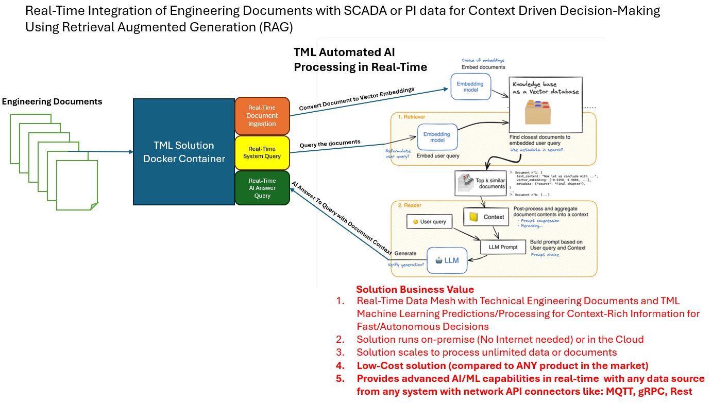

TML and Generative AI
=================

TML uses privateGPT containers (discussed below) for secure, fast, and distributed, AI. 

.. attention::
    #. **These containers are dependent on the NVidia GPU cards up to 5090.**
    #. Containers are compatible with CUDA versions upto 12.8.
    #. Containers will run on AMD64 and ARM64 chip architectures.
    #. They also require `Qdrant Vector DB <https://qdrant.tech/>`_
       - Here is the Qdrant Docker Run Command to Install Qdrant Vector DB locally with TML integration:
          .. code-block::

             docker run -d -p 6333:6333 -v $(pwd)/qdrant_storage:/qdrant/storage:z qdrant/qdrant

.. note::
   TML Solution developers have several privateGPT container options.  These range from the small to large models with varying GPU memory requirements.

   These models and containers are listed in the table below.

.. tip::
   These models all follow a llama2 prompt style.  See `here <https://www.llama.com/docs/model-cards-and-prompt-formats/meta-llama-2/>`_ for more details.

PrivateGPT Special Containers 
========================

.. list-table::

   * - **TML-privateGPT Container**
     - **GPU Suggested Requirements**
   * - `AMD64: Basic Model Version 1 <https://hub.docker.com/r/maadsdocker/tml-privategpt-with-gpu-nvidia-amd64>`_

        * `ARM64 container <https://hub.docker.com/r/maadsdocker/tml-privategpt-with-gpu-nvidia-arm64>`_
        * LLM: `TheBloke/Mistral-7B-Instruct-v0.1-GGUF <https://huggingface.co/TheBloke/Mistral-7B-Instruct-v0.1-GGUF>`_
        * Embedding: `BAAI/bge-small-en-v1.5 <https://huggingface.co/BAAI/bge-small-en-v1.5>`_
        * Vector Dimension: 384
        * **Docker Run Command for AMD64 Container:**
       .. code-block::

            docker run -d -p 8001:8001 --net=host --gpus all \
            --env PORT=8001 --env TSS=0 --env GPU=1 \
            --env COLLECTION=tml --env WEB_CONCURRENCY=2 \
            --env CUDA_VISIBLE_DEVICES=0 --env TOKENIZERS_PARALLELISM=false \
            --env temperature=0.1 --env vectorsearchtype=cosine \
            --env contextwindowsize=4096 --env vectordimension=384 \
            --env mainmodel="TheBloke/Mistral-7B-Instruct-v0.1-GGUF" \
            --env mainembedding="BAAI/bge-small-en-v1.5" \
            -v /var/run/docker.sock:/var/run/docker.sock:z \
            maadsdocker/tml-privategpt-with-gpu-nvidia-amd64:latest

     - #. Suggested VRAM/GPU should be around 20GB
       #. SSD 2-3 TB
       #. Suggested Machine: On-demand 1x NVIDIA A10 
       #. Suggested Cost GPU/Hour: $0.75/GPU/h
   * - `AMD64: Mid Model Version 2 <https://hub.docker.com/r/maadsdocker/tml-privategpt-with-gpu-nvidia-amd64-v2>`_

        * `ARM64 container <https://hub.docker.com/r/maadsdocker/tml-privategpt-with-gpu-nvidia-arm64-v2>`_
        * LLM: `mistralai/Mistral-7B-Instruct-v0.2 <https://huggingface.co/mistralai/Mistral-7B-Instruct-v0.2>`_
        * Embedding: `BAAI/bge-small-en-v1.5 <https://huggingface.co/BAAI/bge-small-en-v1.5>`_
        * Vector Dimension: 384
        * **Docker Run Command for AMD64 Container:**
       .. code-block::

            docker run -d -p 8001:8001 --net=host --gpus all \
            --env PORT=8001 --env TSS=0 --env GPU=1 \
            --env COLLECTION=tml --env WEB_CONCURRENCY=2 \
            --env CUDA_VISIBLE_DEVICES=0 --env TOKENIZERS_PARALLELISM=false \
            --env temperature=0.1 --env vectorsearchtype=cosine \
            --env contextwindowsize=4096 --env vectordimension=384 \
            --env mainmodel="mistralai/Mistral-7B-Instruct-v0.2" \
            --env mainembedding="BAAI/bge-small-en-v1.5" \
            -v /var/run/docker.sock:/var/run/docker.sock:z \
            maadsdocker/tml-privategpt-with-gpu-nvidia-amd64-v2:latest

     - #. Suggested VRAM/GPU should be around 24GB
       #. SSD 2-3 TB
       #. Suggested Machine: On-demand 1x NVIDIA A10 
       #. Suggested Cost GPU/Hour: $0.75/GPU/h
   * - `AMD64: Advanced Model Version 3 <https://hub.docker.com/r/maadsdocker/tml-privategpt-with-gpu-nvidia-amd64-v3>`_

        * `ARM64 container <https://hub.docker.com/r/maadsdocker/tml-privategpt-with-gpu-nvidia-arm64-v3>`_
        * LLM: `mistralai/Mistral-7B-Instruct-v0.3 <https://huggingface.co/mistralai/Mistral-7B-Instruct-v0.3>`_
        * Embedding: `BAAI/bge-base-en-v1.5 <https://huggingface.co/BAAI/bge-base-en-v1.5>`_
        * Vector Dimension: 768
        * **Docker Run Command for AMD64 Container:**
       .. code-block::

            docker run -d -p 8001:8001 --net=host --gpus all \
            --env PORT=8001 --env TSS=0 --env GPU=1 \
            --env COLLECTION=tml --env WEB_CONCURRENCY=2 \
            --env CUDA_VISIBLE_DEVICES=0 --env TOKENIZERS_PARALLELISM=false \
            --env temperature=0.1 --env vectorsearchtype=cosine \
            --env contextwindowsize=4096 --env vectordimension=768 \
            --env mainmodel="mistralai/Mistral-7B-Instruct-v0.3" \
            --env mainembedding="BAAI/bge-base-en-v1.5" \
            -v /var/run/docker.sock:/var/run/docker.sock:z \
            maadsdocker/tml-privategpt-with-gpu-nvidia-amd64-v3

     - #. Suggested VRAM/GPU should be around 24GB
       #. SSD 2-3 TB
       #. Suggested Machine: On-demand 1x NVIDIA A10 
       #. Suggested Cost GPU/Hour: $0.75/GPU/h
   * - `AMD64: Large Advanced Model Version 3 <https://hub.docker.com/r/maadsdocker/tml-privategpt-with-gpu-nvidia-amd64-v3-large>`_

        * `ARM64 container <https://hub.docker.com/r/maadsdocker/tml-privategpt-with-gpu-nvidia-arm64-v3-large>`_
        * LLM: `mistralai/Mistral-7B-Instruct-v0.3 <https://huggingface.co/mistralai/Mistral-7B-Instruct-v0.3>`_
        * Embedding: `BAAI/bge-m3 <https://huggingface.co/BAAI/bge-m3>`_
        * Vector Dimension: 1024
        * **Docker Run Command for AMD64 Container:**
       .. code-block::

            docker run -d -p 8001:8001 --net=host --gpus all \
            --env PORT=8001 --env TSS=0 --env GPU=1 \
            --env COLLECTION=tml --env WEB_CONCURRENCY=2 \
            --env CUDA_VISIBLE_DEVICES=0 --env TOKENIZERS_PARALLELISM=false \
            --env temperature=0.1 --env vectorsearchtype=cosine \
            --env contextwindowsize=4096 --env vectordimension=1024 \
            --env mainmodel="mistralai/Mistral-7B-Instruct-v0.3" \
            --env mainembedding="BAAI/bge-m3" \
            -v /var/run/docker.sock:/var/run/docker.sock:z \
            maadsdocker/tml-privategpt-with-gpu-nvidia-amd64-v3-large

     - #. Suggested VRAM/GPU should be around 40GB
       #. SSD 2-3 TB
       #. Suggested Machine: On-demand 1x NVIDIA A6000 or A100
       #. Suggested Cost GPU/Hour: $0.80 - $1.30/GPU/h

TML and Agentic AI Special Container
============================

For TML and Agentic AI solutions users must you the following container

   * - `AMD64: Agentic AI Llama3 with Ollama Server <https://hub.docker.com/r/maadsdocker/tml-privategpt-with-gpu-nvidia-amd64-llama3-tools>`_

        * `ARM64 container <https://hub.docker.com/r/maadsdocker/tml-privategpt-with-gpu-nvidia-arm64-llama3-tools>`_
        * LLM: `Llama 3.1 <https://huggingface.co/meta-llama/Llama-3.1-8B>`_ OR `Llama 3.2 <https://huggingface.co/meta-llama/Llama-3.2-1B>`_ OR ANY OTHER TOOL' MODELS
        * Embedding: `nomic-embed-text <https://ollama.com/library/nomic-embed-text>`_
        * Vector Dimension: n/a
        * **Docker Run Command for AMD64 Container:**

        .. code-block::

           docker run -d -p 8001:8001 --net=host --gpus all --env PORT=8001 \
           --env TSS=0 \
           --env GPU=1 \
           --env COLLECTION=tml \
           --env WEB_CONCURRENCY=2 \
           --env CUDA_VISIBLE_DEVICES=0 \
           --env TOKENIZERS_PARALLELISM=false \
           --env temperature=0.1 \
           --env vectorsearchtype=cosine \
           --env contextwindowsize=4096 \
           --env vectordimension=384 \
           --env mainembedding="nomic-embed-text" \
           -v /var/run/docker.sock:/var/run/docker.sock:z \
           --env LLAMAMODEL=llama3.2 \
           --env OLLAMASERVERPORT="http://localhost:11434" \
           maadsdocker/tml-privategpt-with-gpu-nvidia-amd64-llama3-tools

     - #. Suggested VRAM/GPU should be around 20GB
       #. SSD 2-3 TB
       #. Suggested Machine: On-demand 1x NVIDIA A10 
       #. Suggested Cost GPU/Hour: $0.75/GPU/h

.. tip::
   You can switch between Llama 3.1 and Llama 3.2 models by updating the:

   -  **--env LLAMAMODEL=llama3.2**

   - You can also use ANY other TOOLS models from Ollama.com (see figure below)

   Ollama server host and port can be updated by updating the:

   - --env OLLAMASERVERPORT="http://localhost:11434" 

To use models other models go to `Ollama.com <https://ollama.com/search?q=tools>`_ and search **tools**

TML and Vision Models
=========================

You can use the `Llava vision models <https://ollama.com/blog/vision-models>`_ by setting the **\-\-env LLAMAMODEL=** with the following:

 - **\-\-env LLAMAMODEL=llava:7b**
 - **\-\-env LLAMAMODEL=llava:13b**
 - **\-\-env LLAMAMODEL=llava:34b**

The general reference architecture shows how TML connects to Ollama server container and Video ChatGPT in real-time to process images and Videos:

.. note::
   VideoChatGPT uses Vicuna v1.1

.. note::

    All images must be base64 decoded - see code below in section :ref:`TML and Vision Models: Sample Code`

    You must have the Ollama server container running:

     .. code-block::

        docker run -d -p 8001:8001 --net=host --gpus all --env PORT=8001 \
        --env TSS=0 \
        --env GPU=1 \
        --env COLLECTION=tml \
        --env WEB_CONCURRENCY=2 \
        --env CUDA_VISIBLE_DEVICES=0 \
        --env TOKENIZERS_PARALLELISM=false \
        --env temperature=0.1 \
        --env vectorsearchtype=cosine \
        --env contextwindowsize=4096 \
        --env vectordimension=384 \
        --env mainembedding="nomic-embed-text" \
        -v /var/run/docker.sock:/var/run/docker.sock:z \
        --env LLAMAMODEL=llava:7b \
        --env OLLAMASERVERPORT="http://localhost:11434" \
        maadsdocker/tml-privategpt-with-gpu-nvidia-amd64-llama3-tools

TML and Vision Models: Sample Code
------------------------

.. code-block:: PYTHON

        import base64
        import requests

        def base64encodeimage(imagefile):
             with open(imagefile, "rb") as image_file:
                 data = base64.b64encode(image_file.read())
                
             return data
        
        def base64ToString(b):
            return b.decode("utf-8") 
        
        
        def describeimage(imgname):
        
            imgdata=base64encodeimage(imgname)
            
            headers = {
                'Content-Type': 'application/x-www-form-urlencoded',
            }
        
            data = '{\n  "model": "llava:7b",\n  "prompt":"What is in this picture?",\n  "stream": false,\n  "images": ["'+base64ToString(imgdata)+'"]\n}'
        
            response = requests.post('http://localhost:11434/api/generate', headers=headers, data=data)
        
            print(response.text)
            
            return response
        
        describeimage("./image2.png")

TML and Video ChatGPT
============================

Users can call video chatGPT container as follows:

Docker Run Command
------------------

.. code-block::

    docker run --gpus all -d -p 7900:7900 \
    --net=host --env CUDA_VISIBLE_DEVICES=0 \
    --env VIDEOGPTPORT=7900 \
    -v /mnt/c/sample_videos:/VideoChatGPT/videofile:z \
    --env VIDEOGPTFOLDER=/VideoChatGPT/videofile maadsdocker/tml-videochatgpt-nvidia-gpu-amd64

.. note::
        NOTE: Details on the Docker run command:
        
        * -p 7900:7900: This is port forwarding port 7900 host port to the container port 7900
        * VIDEOGPTPORT=7900: This enables the API to connect to video chatgpt on port 7900
        * -v /mnt/c/sample_videos:/VideoChatGPT/videofile:z: All your video files need to be stored on the host machine, the Docker container maps this host folder to the container folder for video retrieval
        * VIDEOGPTFOLDER=/VideoChatGPT/videofile : This is the container video folder
        * NOTE: You need to drop the mp4 files on your host folder that is mapped to the container folder.

Video ChatGPT Sample Code
-----------------------

.. code-block::

        import maadstml # import the maadstml python library: pip install maadstml
        
        ################### NOTE: This will only work if Video Chatgpt is running on a machine with NVidia GPU and Cuda toolkit installed
        
        def videochat(videofilename):
        
            url='http://127.0.0.1'            # IP video chatgpt is listening on
            
            port='7900'                       # Port Video chatgpt is listening on 
            
            filename=videofilename          # Video file name 
            
            responsefolder='sample-videos'   # folder, video chatgpt will write out the responses to
            
            temperature=0.1                   # temperature - varies between 0-1, closer to 0 more conservative the responses
            
            max_output_tokens=512             #  max tokens or words returned
        
            prompt='What is this video about? Is there anythin strange about this video?'  # prompts to ask video chatgot about the video
        
        #Load video chatgpt
            ret=maadstml.videochatloadresponse(url,port,filename,prompt,responsefolder,temperature,max_output_tokens)        
            print(ret)
            
        #CALL Video chat gpt container - you can put this in a loop and analyse several videos at once with multiple containers
        videofilename = 'sample_6.mp4'
    
        ret = videochat(videofilename) # returns the response file name
        print(ret)

TML API for GenAI Using MAADSTML Python Library
==================================

TML solutions can be built to access GPT technology in real-time using the `MAADSTML python library <https://pypi.org/project/maadstml/>`_ functions:

.. list-table::

   * - **MAADSTML Python Function**
     - **Description**
   * - pgptingestdocs
     - Set Context for PrivateGPT by ingesting PDFs 

       or text documents. All responses will then use 

       these documents for context.
   * - pgptgetingestedembeddings
     - After documents are ingested, you can retrieve 

       the embeddings for the ingested documents. These 

       embeddings allow you to filter the documents 

       for specific context.
   * - pgptchat
     - Send any prompt to privateGPT 

       (with or without context) and get back a response.
   * - pgptdeleteembeddings
     - Delete embeddings.
   * - pgpthealth
     - Check the health of the privateGPT http server.

GenAI With STEP 9
------------

Several powerful, real-time, AI analysis can be performed with :ref:`STEP 9: PrivateGPT and Qdrant Integration: tml-system-step-9-privategpt_qdrant-dag`

These are the following:

 1. Perform post-analyis on TML output with GenAI

 2. Use Qdrant vector DB, to use local documents, for querying with GenAI

 3. Scale GenAI with privateGPT for secure, local, and quality AI analysis.  

.. tip::
   Take a look here :ref:`TML, PrivateGPT and Qdrant Example Scenarios` for more information.

TML and RAG: A Powerful Combination
------------

TML using :ref:`STEP 9: PrivateGPT and Qdrant Integration: tml-system-step-9-privategpt_qdrant-dag` can perform RAG (Retrieval-augmented Generation) with a few simple configurations.  

Below is a figure to show Advanced RAG model (`inspiration from huggingface blog <https://huggingface.co/learn/cookbook/en/advanced_rag>`_) to ingest Engineering documents for real-time prompting using one of the privateGPT containers. Together with Qdrant vector DB, users can analyse local files with TML in real-time with no-code just configurations of Step 9.

.. important::
   This would be very useful especially for Cybersecurity uses cases where you want to cross-reference source IP address with web log files to determine if there 
   are any "authentication failures" or "wrong passwords" in the log files associated to the source IP address.

   Together with `Qdrant vector DB <https://qdrant.tech/>`_, users can analyse local files with TML in real-time with no-code just configurations of Step 9, in few seconds. 

The incorporation of RAG with TML for real-time cybersecurity analysis of log files is demonstrated in :ref:`Cybersecurity Solution with PrivateGPT, MQTT, HiveMQ`

Private GPT Container
--------------------

More privateGPT containers can be found here: :ref:`PrivateGPT Special Containers`.  The container will require a NVIDIA GPU.

.. code-block::

   docker pull maadsdocker/tml-privategpt-with-gpu-nvidia-amd64

.. code-block::

   docker run -d -p 8001:8001 --net=host --gpus all \
   --env PORT=8001 --env TSS=0 --env GPU=1 \
   --env COLLECTION=tml --env WEB_CONCURRENCY=2 \
   --env CUDA_VISIBLE_DEVICES=0 --env TOKENIZERS_PARALLELISM=false \
   --env temperature=0.1 --env vectorsearchtype=cosine \
   --env contextwindowsize=4096 --env vectordimension=384 \
   --env mainmodel="TheBloke/Mistral-7B-Instruct-v0.1-GGUF" \
   --env mainembedding="BAAI/bge-small-en-v1.5" \
   maadsdocker/tml-privategpt-with-gpu-nvidia-amd64:latest

.. tip::

   To check if privateGPT is running enter this in your browser: http://localhost:8001

   You should see the private GPT website below.

.. figure:: pgpt1.png
    :scale: 70%

.. note::
   
   If you set WEB_CONCURRENCY greater than 1, you will need Qdrant Vector DB running (see below)

PrivateGPT Container With NO GPU
-----------------

.. tip::

   If you do not have a Nvidia GPU you can use the docker container with NO GPU: 

   docker run -d -p 8001:8001 --env PORT=8001 --env GPU=0 --env CUDA_VISIBLE_DEVICES=0  maadsdocker/tml-privategpt-no-gpu-amd64

Installing CUDA For NVIDIA GPU
^^^^^^^^^^^^^^^^^^

.. important::
   It is highly recommended that users run the privateGPT container using the NVIDIA GPU for FASTER performance.  

   If you have a NVIDIA GPU you must install the `CUDA Software Development Kit <https://developer.nvidia.com/cuda-downloads>`_ in your Linux environment.

   To confirm your GPU card is recognized in Linux type: **nvidia-smi** - You should see an image similar to below.

NVIDIA Common Issues
^^^^^^^^^^^^^^^^^^^^^^^^

.. important::
   
   If you run Docker or Minikube with the **\-\-gpus all** flag and see an ERROR message like:

    **docker: Error response from daemon: could not select device driver "" with capabilities: [[gpu]].**

    Then run the following:

.. code-block::

   sudo nvidia-ctk runtime configure --runtime=docker 

   sudo systemctl restart docker

.. attention::

   Make sure to STOP the TSS Container and other containers before running Kubernetes/Minikube.

   If you get the following WARNING from Kubernetes:

    Warning  FailedScheduling  13m    default-scheduler  0/1 nodes are available: 1 Insufficient nvidia.com/gpu. preemption: 0/1 nodes are available: 1 No preemption victims found for 
    incoming pod.

    Issue the commands below:

.. code-block::

   sudo apt update && sudo apt install -y nvidia-docker2

   sudo nvidia-ctk runtime configure --runtime=docker
  
   sudo systemctl restart docker

To Enable GPU in Kubernetes
---------------------------

You can apply the following YML file to the Kubernetes cluster to enable GPU support.

.. code-block::

   kubectl create -f https://raw.githubusercontent.com/NVIDIA/k8s-device-plugin/v0.12.3/nvidia-device-plugin.yml

Also see section: :ref:`NVIDIA GPU On Windows WSL`

Accessing PrivateGPT With MAADSTML Python API
-----------------

Once you have the PrivateGPT container running you can access it using the maadstml API. Here is some sample Python code to access the privateGPT container:

.. note::

   Since PrivateGPT is compatible with REST API, you can use any programming language, and take advantage of free, and fast AI.

.. code-block::
   :emphasize-lines: 4,11,21,22,23,26

   import maadstml
   import json

   def sendpromptgpt(prompt,pgptip,pgptport):
     pgptendpoint="/v1/completions"
     includesources=False
     docfilter=""
     context=False

     try:
       response=maadstml.pgptchat(prompt,context,docfilter,pgptport,includesources,pgptip,pgptendpoint)
       jb=json.loads(response)
       response=jb['choices'][0]['message']['content']
      
     except Exception as e:
      print("ERROR: connecting to PrivateGPT=",e)
      return ""

     return response

   def setupprompt():
        pgptip="http://127.0.0.1"
        pgptport="8001"

        prompt="Who is the prime minister of Canada?"
        message=sendpromptgpt(prompt,pgptip,pgptport) 

.. list-table::

   * - **Details of LLM Used in privateGPT Container**
   * - llm_load_print_meta: format = GGUF V2
   * - llm_load_print_meta: arch = llama
   * - llm_load_print_meta: vocab type = SPM
   * - llm_load_print_meta: n_vocab = 32000
   * - llm_load_print_meta: n_merges = 0
   * - llm_load_print_meta: n_ctx_train = 32768
   * - llm_load_print_meta: n_embd = 4096
   * - llm_load_print_meta: n_head = 32
   * - llm_load_print_meta: n_head_kv = 8
   * - llm_load_print_meta: n_layer = 32
   * - llm_load_print_meta: n_rot = 128
   * - llm_load_print_meta: n_gqa = 4
   * - llm_load_print_meta: f_norm_eps = 0.0e+00
   * - llm_load_print_meta: f_norm_rms_eps = 1.0e-05
   * - llm_load_print_meta: f_clamp_kqv = 0.0e+00
   * - llm_load_print_meta: f_max_alibi_bias = 0.0e+00
   * - llm_load_print_meta: n_ff = 14336
   * - llm_load_print_meta: rope scaling = linear
   * - llm_load_print_meta: freq_base_train = 10000.0
   * - llm_load_print_meta: freq_scale_train = 1
   * - llm_load_print_meta: n_yarn_orig_ctx = 32768
   * - llm_load_print_meta: rope_finetuned = unknown
   * - llm_load_print_meta: model type = 7B
   * - llm_load_print_meta: model ftype = mostly Q4_K - Medium
   * - llm_load_print_meta: model params = 7.24 B
   * - llm_load_print_meta: model size = 4.07 GiB (4.83 BPW)
   * - **llm_load_print_meta: general.name = mistralai_mistral-7b-instruct-v0.2**
   * - llm_load_print_meta: BOS token = 1 ''
   * - llm_load_print_meta: EOS token = 2 ''
   * - llm_load_print_meta: UNK token = 0 ''
   * - llm_load_print_meta: LF token = 13 '<0x0A>'
   * - llm_load_tensors: ggml ctx size = 0.11 MB
   * - llm_load_tensors: mem required = 4165.47 MB

Qdrant Vector Database
---------------------

The privateGPT is also integrated with `Qdrant Vector DB <https://qdrant.tech/>`_

.. code-block::

   docker run -d -p 6333:6333 -v $(pwd)/qdrant_storage:/qdrant/storage:z qdrant/qdrant

.. tip::
   After running the container, to access the Qdrant dashboard enter the following URL in your browser:

    .. code-block::

        http://localhost:6333/dashboard
   
