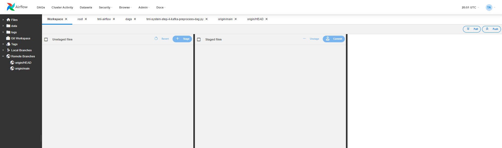

TML Solution Studio's Tight Integration with GitHub
================================

TML Solution build process is tightly integrated with GitHub to maintain a seamless process of tracking TML solution changes.  The figure below shows this integration.  As TML solution code is updated in Airflow, it can be committed directly from the Airflow UI.  This provides a high-level of convevience to ensure all code is properly checked in and committed to the main branch. 

.. important::
   You integrate Github with TSS you need to generate a Personal Access Token from your Githib repo.  Follow the instructions here: :ref:`Generating Personal 
   Access Tokens in Github`

You can push and pull changes directly from the TML Solution Studio - integrated with Airflow.

.. note::

   You can commit your code in the local and remote branches to ensure tightly controlled code changes.  This is an important aspect of the TML Studio Studio (TSS) as    well, all **git pushes** can be done directly from the TSS.

Push To and Pull From Local and Remote Github Branches
---------------------

All changes are committed to local and remote branches by simple press of a button in the TML Studio Git Workspace.

Viewing Local and Remote Github Branches
---------------------

You can view the local and remote branches conveniently inside the TML Solution Studio.

.. figure:: tmlgit.png

