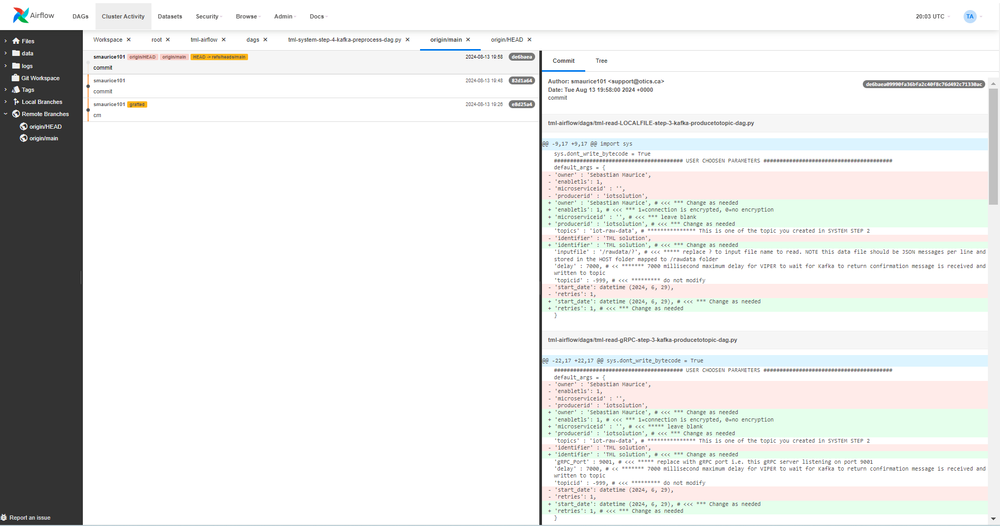

TML Solution Tight Integration with GitHub
================================

TML Solution build process is tightly integrated with GitHub to maintain a seamless process of tracking TML solution changes.  The figure below shows this integration.  As TML solution code is updated in Airflow, it can be committed directly from the Airflow UI.  This provides a high-level of convevience to ensure all code is properly checked in and committed to the main branch. 

You can push and pull changes directly from the TML Solution Studio - integrated with Airflow.

.. figure:: tmlgit2.png

