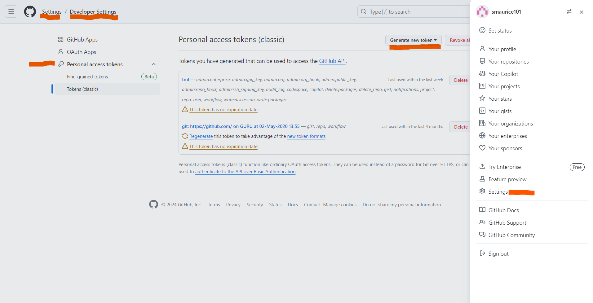
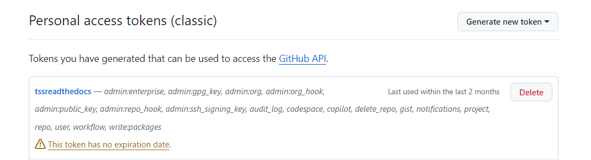
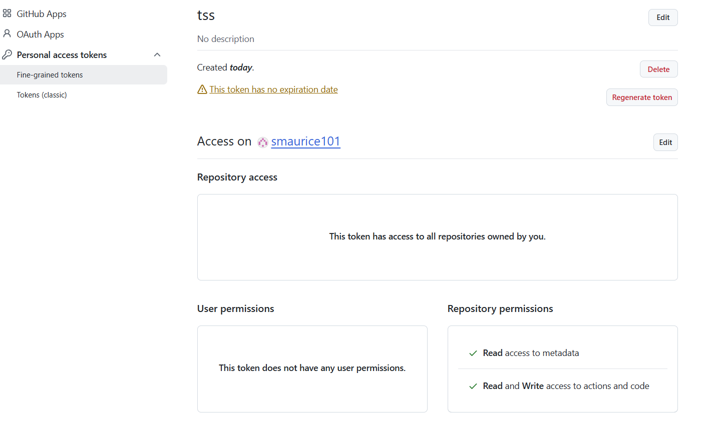

Set Up Personal Access Tokens in Github
==================

Generating Personal Access Tokens in Github: Explanation
^^^^^^^^^^^^^^^^^^^^^^^^^^^^^^^^^

.. tip:: 
   Follow these steps:

      1. Log in to your Github account
      
      2. In the Top-Right corner of your Github account click **Settings**
      
      3. In the next screen, scroll all the way down and click **<> Developer settings**
      
      4. Click **Personal access tokens**
      
      5. Choose **Tokens (classic)**
      
      6. Click **Generate new token** -  Your token should start with **ghp_**.  

         **Give your Token Read/Write access**: see :ref:`Permissions For Your Token`
      
      7. Copy and paste token in **GITPASSWORD** docker run command: :ref:`TSS Docker Run Command`

Permissions For Your Token
----------------------------------

Your token permissions should look like this below:

Fine-Grained Tokens
--------------------

Use fine grained tokens for stricter access.  Make sure to give Actions and Content Read/Write access to the selected Repo of your choice.

