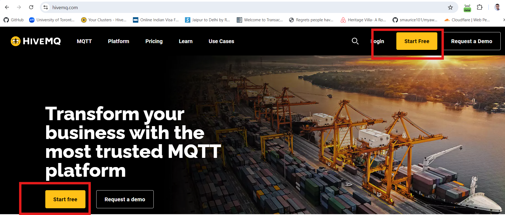
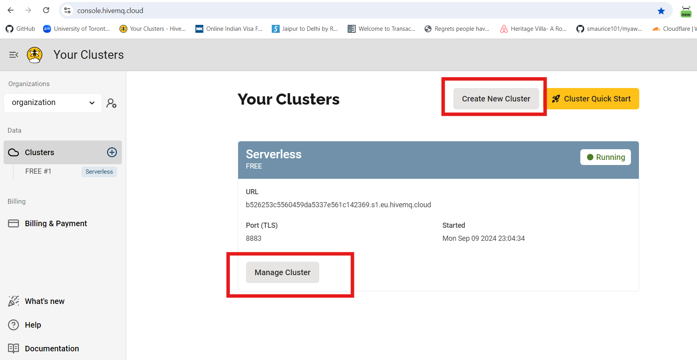
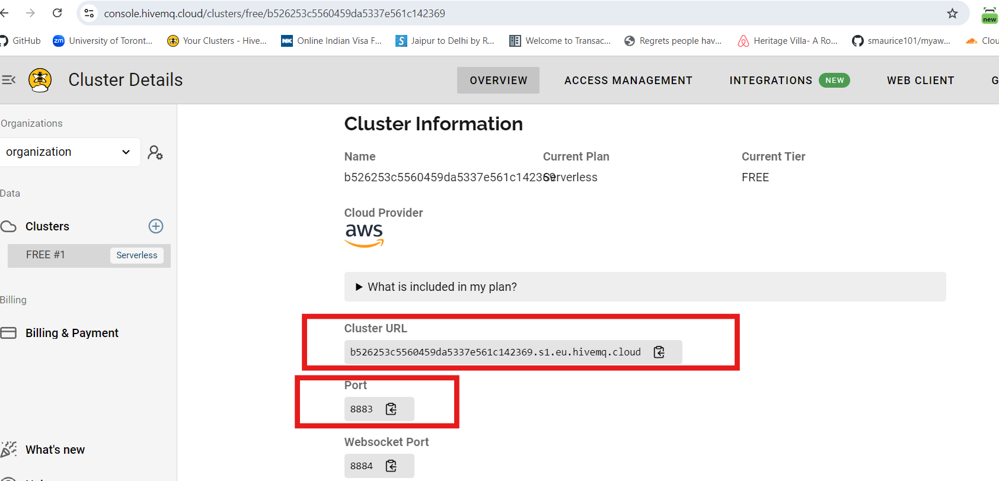
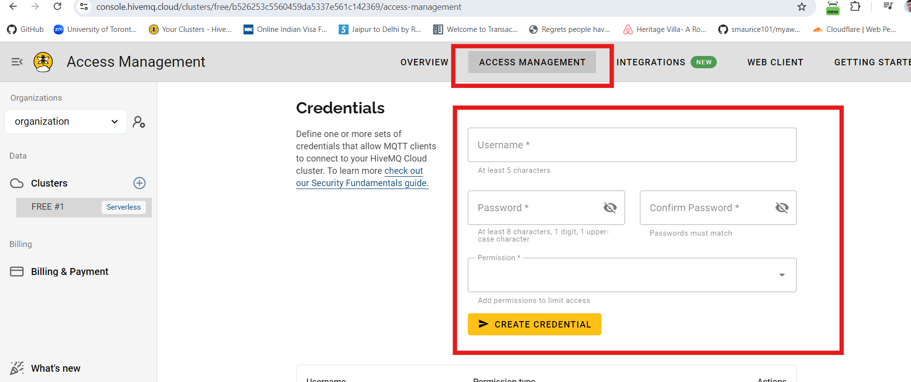

HiveMQ Setup
=================

Setting up a HiveMQ cluster is a simle process and users can setup a HiveMQ cluster for free here at `HiveMQ wesbite <https://www.hivemq.com/>`_

.. important::
   If you are planning on using the MQTT protocol in your TML solution then you will need to setup HiveMQ cluster.

   You will need to enter the **MQTTUSERNAME='<enter MQTT username>'** and **MQTTPASSWORD='<enter MQTT password>'** in the :ref:`TSS Docker Run Command`

Step 1: Setup a Free HiveMQ Account
-----------------------

Step 2: Create a FREE Serverless Cluster
----------------

Step 3: Cluster Details
----------------

.. note::

   Note the cluster URL and Port.  You will need these details if publishing and subscribing from the HiveMQ cluster topic.

Step 4: Create MQTT Username and Password
----------------

.. important::

   Give your username **Publishing and Subscribing** permission.  These will be needed in the :ref:`TSS Docker Run Command`

