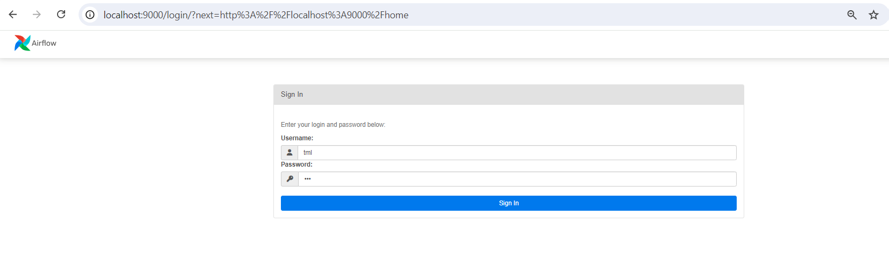

How To Use the TML Solution Container
^^^^^^^^^^^^^^^^^^^^

.. tip::
   Once you have the TML Solution container running you can go to your favourite browser and type the URL: http://localhost:9000

.. note::
   
   The PORT number in the URL is what you specified in the Docker Run AIRFLOWPORT parameter i.e. **--env AIRFLOWPORT=9000**

After you enter the URL you will the following website:

.. tip::

   The username and password are both **tml**

After you have signed in successfully you will see the following screen with example DAGs:

.. figure:: ts2.png

If you scroll down you will see the **TML DAGs** - as defined here: :ref:`DAG Table`.  These are the DAGs you will use to build your TML Solutions:

.. figure:: ts3.png

.. attention::

   Next go into the DAG Code Editor: Select Drop-down menu **Admin --> DAGs Code Editor**.  Most of your TML Solution building will be done here.  Note the DAGs 
   solution process flows defined here: :ref:`Apache Airflow DAGs`

.. figure:: ts4.png
