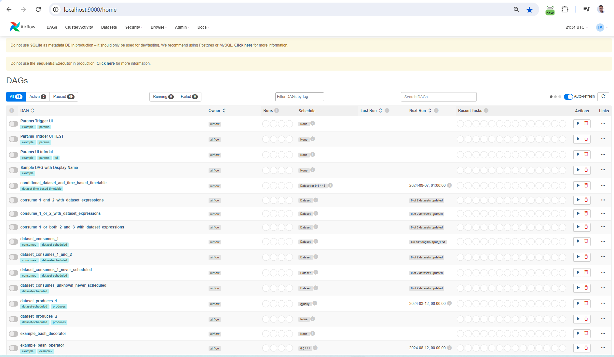

How To Use the TML Solution Container
====================================

Once you have the TML Solution container running you can go to your favourite browser and type the URL: http://localhost:9000

.. important::
   
   The PORT number in the URL is what you specified in the Docker Run AIRFLOWPORT parameter i.e. **--env AIRFLOWPORT=9000**

After you enter the URL you will the following website:

.. figure:: ts1.png

.. important::

   The username and password are both **tml**

After you have signed in successfully you will see the following screen with example DAGs:

If you scroll down you will see the **TML DAGs** - as defined here: :ref:`Apache Airflow DAGs`.  These are the DAGs you will use to build your TML Solutions:

.. figure:: ts3.png

.. important::

   Next go into the DAG Code Editor.  Most of your TML Solution building will be done here.

.. figure:: ts4.png
