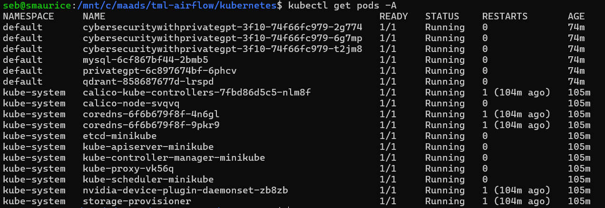
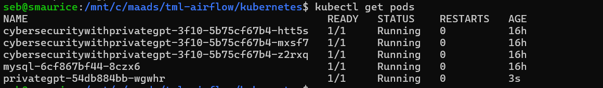

Scaling TML Solutions with Kubernetes
=================================

All TML solutions can be scaled with Kubernetes to perform unlimited processing of real-time data wit machine learning and AI - as shown in the figure below.

.. figure:: kube.png
   :scale: 70%

Everytime you create a TML solution in the TSS - TSS will generate YAML files automatically.  These YAML files can be used immediately to scale your solution.

.. tip::
   Watch the YouTube Video: `here <https://www.youtube.com/watch?v=MEbmTXIQpVo>`_.

.. important::
   You can scale your TML solution to process unlimited data with integration with PrivateGPT and Qdrant vector DB for fast AI. 

   Note: If scaling your TML solution you should use KAFKA CLOUD for efficient processing of large amounts of real-time data.  Because TML uses sliding time windows, instances of TML pods, 
   replicated by Kubernetes, will not duplicate the processing of sliding time windows.  **For example, if you have 100 TML pods running, each TML pod will check if a sliding time has 
   already 
   been processed by another TML pod, if so, it will not re-process that window.  This dramatically saves on processing time and leverages the fully capabilites of kubernetes to manage the 
   sending of data to pods that are not busy.** 

Auto-Generated YAML Files
-------------------

Five YAML files are auto-generated for every TML solution and are found in your READTHEDOCS solution documentation:

.. list-table::

   * - **YAML File**
     - **Description**
   * - TML Solution Yaml File
     - This is your main TML solution YAML 

       that Kubernetes will need to replicate 

       your TML solution.  This solution Yaml

       will be auto-generated and found in your 

       readthedocs solution documentation.
   * - Secrets Yaml File
     - Secrets file is used to store base64 encoded passwords.

       This ensures your passwords are securely accessed in 

       Kubernetes.  See below for instructions.
   * - MySQL DB Deployment Yaml File
     - MySQL DB is used for TML configurations.  

       This DB Yaml service will allow all 

       TML solutions to process
   * - MySQL DB Storage Yaml File
     - This Yaml file claims storage for the MySQL db.
   * - PrivateGPT Yaml (Optional)
     - A privateGPT yaml file is provided if your

       TML solution is perform AI using Step 9 Dag.

       This is a powerful way to incorporate fast AI 

       in your TML solution.
   * - Qdrant Vector DB Yaml (Optional)
     - If you are concurrently performing AI 

       in the provateGPT container by setting 

       WEB_CONCURRENCY > 1, then you MUST 

       have Qdrant vector DB running.
  
.. tip::
   These YAMLs can be applied to your Kubernetes cluster as follows:

   **kubectl apply -f secrets.yml -f mysql-storage.yml -f mysql-db-deployment.yml -f <TML solution name>.yml**, where you replace <TML solution name> with your actual TML solution name.

   If using AI:

   **kubectl apply -f secrets.yml -f mysql-storage.yml -f mysql-db-deployment.yml -f privategpt.yml -f qdrant.yml -f <TML solution name>.yml**, where you replace <TML solution name> with 
   your actual TML solution name.

Example Kubernetes Run From Applying YAML Files
-------------------

.. attention::

   The docker images for privateGPT and other solution containers, using GPU, can take several minutes to pull and run. So be patient. 

How To Store Secure Passwords in Kubernetes
-------------------

All TML solution passwords must be base64 encoded and copied to your **secrets.yml** file as shown in Steps below.

Step 1: Convert Your Plain Text Password to Base64

 .. code-block::

    echo -n <ENTER YOUR PASSORD HERE> | base64 

Repeat Step 1 for ALL your passwords:
 
  1. GITPASSWORD (MANDATORY)

  2. READTHEDOCS (MANDATORY)

  3. KAFKACLOUDPASSWORD (OPTIONAL)

  4. MQTTPASSWORD (OPTIONAL)

Step 2: You will need to COPY this base64 encoded password

Step 3: You will need to PASTE this base64 encoded password in the **secrets.yml** file

.. code-block:: YAML
      
      ###################secrets.yml
      apiVersion: v1
      kind: Secret
      metadata:
        name: tmlsecrets
      type: Opaque
      data:
        readthedocs: <Paste your base64 encoded password>
        githubtoken: <Paste your base64 encoded password>
        mqttpass: <Paste your base64 encoded password>
        kafkacloudpassword: <Paste your base64 encoded password>

Step 4: You will need to APPLY it to the Kubernetes cluster:

  .. code-block::

     kubectl create -f secrets.yml

Step 5: Confirm the Secrets are Stored in Kubernetes:

  .. code-block::

     kubectl get secrets/tmlsecrets

  or, 

  .. code-block::

     kubectl describe secret/tmlsecrets

That's it!  You now have stored secure - base64 encoded - passwords in Kubernetes.

NVIDIA GPU On Windows WSL
------------------

.. important::

   If you are installing Minikube in WSL you need to ensure:

   1. You must install the Windows NVIDIA Drivers on your HOST operating system: `Get the Official NVidia drivers here <https://www.nvidia.com/en-us/drivers/>`_

   2. THEN install wsl by opening Windows Powershell and Typing:  **wsl --install**

   3. Then update the wsl install in Linux Ubuntu by typing: **sudo apt update && sudo apt upgrade**

   4. Install Docker by typing: **sudo apt install docker.io**

   5. Install the CUDA Keyring: 
     a. wget https://developer.download.nvidia.com/compute/cuda/repos/<distro>/x86_64/cuda-keyring_1.1-1_all.deb
      1. Replace **<distro>** with your Linux Distro i.e. ubuntu2404 (`see here <https://docs.nvidia.com/cuda/cuda-installation-guide-linux/index.html#ubuntu>`_)
     b. sudo dpkg -i cuda-keyring_1.1-1_all.deb

   6. sudo apt-get update

   7. sudo apt-get install cuda-toolkit 

   8. sudo apt update && sudo apt install -y nvidia-docker2

   9. sudo apt-get install -y nvidia-container-toolkit

   10. sudo nvidia-ctk runtime configure --runtime=docker

   11. sudo systemctl restart docker

   12. Now install minikube (as shown below)

 
Installing minikube
-------------------

Follow these steps to install minikube - which is a 1 node kubernetes cluster for testing and development.

.. note::
      1.	Create a folder in your VM called kubernetes
       a. Note minikube is a ONE node Kubernetes cluster – it is the SAME functionality as a production grade Kubernetes cluster
      2.	cd to kubernetes folder
      3. Now install Kubernetes (minikube):
       a. RUN: **wget https://storage.googleapis.com/minikube/releases/latest/minikube-linux-amd64**
       b. RUN: **sudo install minikube-linux-amd64 minikube**
      
      4.	Now install kubectl
       a. **curl -LO https://storage.googleapis.com/kubernetes-release/release/`curl -s https://storage.googleapis.com/kubernetes-release/release/stable.txt`/bin/linux/amd64/kubectl**
       b. RUN: **sudo chmod +x kubectl**
       c. RUN: **sudo install -o root -g root -m 0755 kubectl /usr/local/bin/kubectl**
      
      5.	RUN Kubernetes: **minikube start --driver=docker \-\-cni calico \-\-memory 8192**
       a. make sure docker engine is installed. If not run: **sudo apt-get install docker.io**
       b. RUN: **sudo chmod 666 /var/run/docker.sock**
       c. Note: If you have a Nvidia GPU then use: **minikube start --driver docker \-\-container-runtime docker \-\-gpus all \-\-cni calico \-\-memory 8192**
       d. Note **\-\-cni calico** uses the **calico** Container Networking Interface (CNI)

      6.	Create POD inside Kubernetes running your Docker Container
       a. RUN: **kubectl apply -f <YAML files>**
       b. RUN: **kubectl get deployments**
            
      7.	PORT Forward 9005:
       a. RUN: **kubectl port-forward deployment/<deployment name> 9005:9005**

Confirming CUDA Installation in Kubernetes (minikube)
-----------------------------------

.. important::

   Make sure to update the key rings: :ref:`NVIDIA Common Issues`

To confirm your NVIDIA CUDA is properly installed in Kubernetes run the a test workload.

nvidia-test-vector-add.yml
^^^^^^^^^^^^^^^^^

Apply this yaml file to the kubernetes cluster by running: **kubectl apply -f nvidia-test-vector-add.yml**

.. code-block::

      #source: nvidia-test-vector-add.yml
      apiVersion: v1
      kind: Pod
      metadata:
        name: cuda-vector-add
      spec:
        restartPolicy: OnFailure
        containers:
          - name: cuda-vector-add
            image: k8s.gcr.io/cuda-vector-add:v0.1
            resources:
              limits:
                nvidia.com/gpu: 1

.. code-block::
 
   kubectl apply -f nvidia-test-vector-add.yml

If your NVIDIA install is correct, you should see the output after typing: **kubectl logs cuda-vector-add**

.. code-block::

   kubectl logs cuda-vector-add

The results:

.. code-block::

    [Vector addition of 50000 elements]
    Copy input data from the host memory to the CUDA device
    CUDA kernel launch with 196 blocks of 256 threads
    Copy output data from the CUDA device to the host memory
    Test PASSED
    Done

Scaling EXAMPLE: Scaling Cybersecurity with privateGPT solution
--------------------------------------------

To show how simple it is to scale TML solutions in kubernetes, we will scale :ref:`Cybersecurity Solution with PrivateGPT, MQTT, HiveMQ`

.. tip::
   If you do not have Kubernetes cluster access then install minikube locally: See this section :ref:`Installing minikube`

.. note::
   Here are the steps to scaling the cybersecurity solution with privateGPT:

   1. Run the :ref:`Solution DAG Code: solution_preprocessing_ai_mqtt_dag-cybersecuritywithprivategpt-3f10` in the TSS.  
   2. Go to the `solution documentation on readthedocs <https://cybersecuritywithprivategpt-3f10.readthedocs.io/en/latest/index.html>`_
   3. Go to section: `Scaling [cybersecuritywithprivategpt-3f10] With Kubernetes <https://cybersecuritywithprivategpt-3f10.readthedocs.io/en/latest/kube.html#scaling-cybersecuritywithprivategpt-3f10-with-kubernetes>`_
   4. Copy the following YML files and save to your local computer in Linux:
     a. `mysql-storage.yml <https://cybersecuritywithprivategpt-3f10.readthedocs.io/en/latest/kube.html#mysql-storage-yml>`_
     b. `mysql-db-deployment.yml <https://cybersecuritywithprivategpt-3f10.readthedocs.io/en/latest/kube.html#mysql-db-deployment-yml>`_
     c. `privategpt.yml <https://cybersecuritywithprivategpt-3f10.readthedocs.io/en/latest/kube.html#privategpt-yml>`_
     d. `qdrant.yml <https://cybersecuritywithprivategpt-3f10.readthedocs.io/en/latest/kube.html#qdrant-yml>`_
     e. `cybersecuritywithprivategpt-3f10.yml <https://cybersecuritywithprivategpt-3f10.readthedocs.io/en/latest/kube.html#cybersecuritywithprivategpt-3f10-yml>`_
   5. Now apply the YML files to your Kubernetes cluster:
     a. **kubectl apply -f mysql-storage.yml -f mysql-db-deployment.yml -f qdrant.yml -f privategpt.yml -f cybersecuritywithprivategpt-3f10.yml**
   6. Run: **kubectl get pods**
     a. You should see a list of pods - as shown in figure below.
   7. Run the Cybersecurity dashboard.
     a. Run: **kubectl get deployment**
     b. Run: **kubectl port-forward deployment/<deployment name> 9005:<SOLUTIONVIPERVIZPORT>**
     c. Run the Dashboard - it should look like :ref:`The Dashboard with PrivateGPT`:
         `http://localhost:9005/tml-cisco-network-privategpt-monitor.html?topic=cisco-network-preprocess,cisco-network- 
         privategpt&offset=-1&groupid=&rollbackoffset=400&topictype=prediction&append=0&secure=1 <http://localhost:9005/tml-cisco-network-privategpt-monitor.html?topic=cisco-network-preprocess,cisco-network- 
         privategpt&offset=-1&groupid=&rollbackoffset=400&topictype=prediction&append=0&secure=1>`_

This image shows 3 replicas of the TML solution: cybersecuritywithprivategpt-3f10, along with a mysql pod and a privategpt pod.  

.. tip::
   The number of replicas can be changed in the **cybersecuritywithprivategpt-3f10.yml** file: look for **replicas**.  You can increase or decrease the number of replicas based on the amout of real-time data you are processing.

   To inside the pods, you can type command: 

    COMMAND: **kubectl exec -it <pod name> \-\- bash** (replace <pod name> with actual pod name)

   To delete the pods type:

    COMMAND: **kubectl delete all \-\-all \-\-all-namespaces**

   To get information on a pod type:

    COMMAND: **kubectl describe pod <pod name>** (replace <pod name> with actual pod name)

