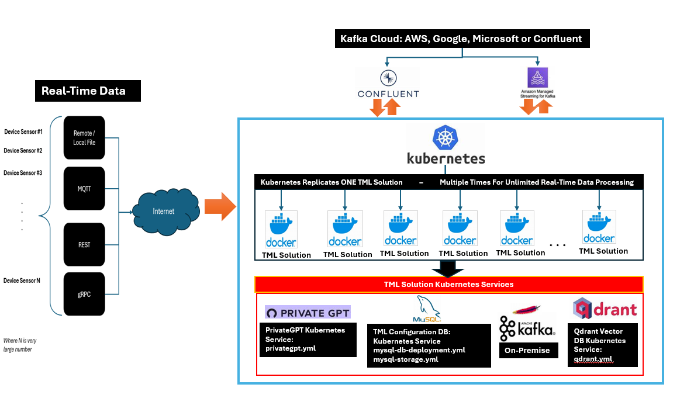

Scaling TML Solutions with Kubernetes
=================================

All TML solutions can be scaled with Kubernetes to perform unlimited processing of real-time data wit machine learning and AI - as shown in the figure below.

Everytime you create a TML solution in the TSS - TSS will generate YAML files automatically.  These YAML files can be used immediately to scale your solution.

.. important::
   You can scale your TML solution to process unlimited data with integration with PrivateGPT and Qdrant vector DB for fast AI. 

   Note: If scaling your TML solution you should use KAFKA CLOUD for efficient processing of large amounts of real-time data.  Because TML uses sliding time windows, instances of TML pods, 
   replicated by Kubernetes, will not duplicate the processing of sliding time windows.  **For example, if you have 100 TML pods running, each TML pod will check if a sliding time has 
   already 
   been processed by another TML pod, if so, it will not re-process that window.  This dramatically saves on processing time and leverages the fully capabilites of kubernetes to manage the 
   sending of data to pods that are not busy.** 

Five YAML files are auto-generated for every TML solution and are found in your READTHEDOCS solution documentation:

.. list-table::

   * - **YAML File**
     - **Description**
   * - TML Solution Yaml File
     - This is your main TML solution YAML 

       that Kubernetes will need to replicate 

       your TML solution.  This solution Yaml

       will be auto-generated and found in your 

       readthedocs solution documentation.
   * - MySQL DB Deployment Yaml File
     - MySQL DB is used for TML configurations.  

       This DB Yaml service will allow all 

       TML solutions to process
   * - MySQL DB Storage Yaml File
     - This Yaml file claims storage for the MySQL db.
   * - PrivateGPT Yaml (Optional)
     - A privateGPT yaml file is provided if your

       TML solution is perform AI using Step 9 Dag.

       This is a powerful way to incorporate fast AI 

       in your TML solution.
   * - Qdrant Vector DB Yaml (Optional)
     - If you are concurrently performing AI 

       in the provateGPT container by setting 

       WEB_CONCURRENCY > 1, then you MUST 

       have Qdrant vector DB running.
  
.. tip::
   These YAMLs can be applied to your Kubernetes cluster as follows:

   **kubectl apply -f mysql-storage.yml -f mysql-db-deployment.yml -f <TML solution name>.yml**, where you replace <TML solution name> with your actual TML solution name.

   If using AI:

   **kubectl apply -f mysql-storage.yml -f mysql-db-deployment.yml -f privategpt.yml -f qdrant.yml -f <TML solution name>.yml**, where you replace <TML solution name> with your actual TML 
   solution name.

Installing minikube
-------------------

Follow these steps to install minikube - which is a 1 node kubernetes cluster for testing and development.

.. note::
      1.	Create a folder in your VM called kubernetes
       a.	Note minikube is a ONE node Kubernetes cluster – it is the SAME functionality as a production grade Kubernetes cluster
      2.	cd to kubernetes folder
      3. Now install Kubernetes (minikube):
       a.	RUN: wget https://storage.googleapis.com/minikube/releases/latest/minikube-linux-amd64
       b.	RUN: sudo install minikube-linux-amd64 minikube
      
      4.	Now install kubectl
       a.	curl -LO https://storage.googleapis.com/kubernetes-release/release/`curl -s https://storage.googleapis.com/kubernetes-release/release/stable.txt`/bin/linux/amd64/kubectl
       b.	RUN: sudo chmod +x kubectl
       c.	RUN: sudo install -o root -g root -m 0755 kubectl /usr/local/bin/kubectl
      
      
      5.	RUN Kubernetes: minikube start --driver=docker
       b.	make sure docker engine is installed. If not run: sudo apt-get install docker.io
       c.	RUN: sudo chmod 666 /var/run/docker.sock
       Note: If you have a Nvidia GPU then use: minikube start --driver docker --container-runtime docker --gpus all

      6.	Create POD inside Kubernetes running your Docker Container
       a.	RUN: kubectl apply -f <YAML files>
       b.	RUN: kubectl get pods
            
      7.	PORT Forward 9005:
       a.	RUN: kubectl port-forward <pod name> 9005:9005
