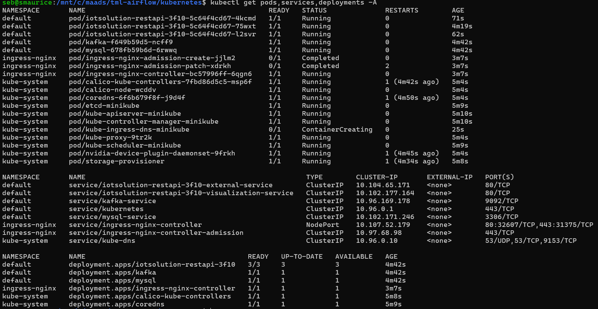

Scaling TML Solutions with Kubernetes
=================================

All TML solutions can be scaled with Kubernetes to perform unlimited processing of real-time data wit machine learning and AI - as shown in the figure below.

Everytime you create a TML solution in the TSS - TSS will generate YAML files automatically.  These YAML files can be used immediately to scale your solution.

.. tip::
   Watch the YouTube Video: `here <https://youtu.be/dAsn9RLMPO8>`_.

.. important::
   You can scale your TML solution to process unlimited data with integration with PrivateGPT and Qdrant vector DB for fast AI. 

   Note: If scaling your TML solution you should use KAFKA CLOUD for efficient processing of large amounts of real-time data.  Because TML uses sliding time windows, instances of TML pods, 
   replicated by Kubernetes, will not duplicate the processing of sliding time windows.  **For example, if you have 100 TML pods running, each TML pod will check if a sliding time has 
   already 
   been processed by another TML pod, if so, it will not re-process that window.  This dramatically saves on processing time and leverages the fully capabilites of kubernetes to manage the 
   sending of data to pods that are not busy.** 

Auto-Generated YAML Files
-------------------

Five YAML files are auto-generated for every TML solution and are found in your READTHEDOCS solution documentation:

.. list-table::

   * - **YAML File**
     - **Description**
   * - TML Solution Yaml File
     - This is your main TML solution YAML 

       that Kubernetes will need to replicate 

       your TML solution.  This solution Yaml

       will be auto-generated and found in your 

       readthedocs solution documentation.
   * - Secrets Yaml File
     - Secrets file is used to store base64 encoded passwords.

       This ensures your passwords are securely accessed in 

       Kubernetes.  See below for instructions.
   * - Kafka Yaml File For On-Premise Kafka
     - Users have the option of using Kafka Cloud 

       or Kafka On-Premise.  If using Kafka On-premise

       this Yaml MUST be applied to the cluster.
   * - MySQL DB Deployment Yaml File
     - MySQL DB is used for TML configurations.  

       This DB Yaml service will allow all 

       TML solutions to process
   * - MySQL DB Storage Yaml File
     - This Yaml file claims storage for the MySQL db.
   * - PrivateGPT Yaml (Optional)
     - A privateGPT yaml file is provided if your

       TML solution is perform AI using Step 9 Dag.

       This is a powerful way to incorporate fast AI 

       in your TML solution.
   * - Qdrant Vector DB Yaml (Optional)
     - If you are concurrently performing AI 

       in the provateGPT container by setting 

       WEB_CONCURRENCY > 1, then you MUST 

       have Qdrant vector DB running.
   * - NGINX Ingress Yaml (Optional)
     - If you are scaling your TML solution you must

       apply the nginx-ingress.yml; this yaml is 

       auto-generated for every TML solution.

       For more details see section 

       :ref:`Scaling with NGINX Ingress and Ingress Controller`

.. tip::
   These YAMLs can be applied to your Kubernetes cluster as follows:

   **kubectl apply -f secrets.yml -f mysql-storage.yml -f mysql-db-deployment.yml -f <TML solution name>.yml**, where you replace <TML solution name> with your actual TML solution name.

   If using AI:

   **kubectl apply -f secrets.yml -f mysql-storage.yml -f mysql-db-deployment.yml -f privategpt.yml -f qdrant.yml -f <TML solution name>.yml**, where you replace <TML solution name> with 
   your actual TML solution name.

Example Kubernetes Run From Applying YAML Files
-------------------

.. attention::

   The docker images for privateGPT and other solution containers, using GPU, can take several minutes to pull and run. So be patient. 

Scaling with NGINX Ingress and Ingress Controller
-------------------------

All TML solutions can be easily scaled using NGINX Ingress and Ingress controller for proper load balancing.

Here is a sample Ingress YAML file: This file is auto-generated by the TSS for the TML solution using REST api to ingest data: `iotsolution-3f10 <https://iotsolution-restapi-3f10.readthedocs.io/en/latest/kube.html#nginx-ingress-iotsolution-restapi-3f10-yml>`_

.. code-block:: 

      ############# nginx-ingress-iotsolution-restapi-3f10.yml
      apiVersion: networking.k8s.io/v1
      kind: Ingress
      metadata:
        name: tml-ingress
        annotations:
          nginx.ingress.kubernetes.io/use-regex: "true"
          nginx.ingress.kubernetes.io/rewrite-target: /$2
      spec:
        ingressClassName: nginx
        rules:
          - host: tml.tss
            http:
              paths:
                - path: /viz(/|$)(.*)
                  pathType: ImplementationSpecific
                  backend:
                    service:
                      name: iotsolution-restapi-3f10-visualization-service
                      port:
                        number: 80
                - path: /ext(/|$)(.*)
                  pathType: ImplementationSpecific
                  backend:
                    service:
                      name: iotsolution-restapi-3f10-external-service
                      port:
                        number: 80
      ---
      apiVersion: v1
      kind: ConfigMap
      apiVersion: v1
      metadata:
        name: ingress-nginx-controller
        namespace: ingress-nginx
      data:
        allow-snippet-annotations: "true"

.. important::
   Here are the STEPS to enable Ingress in your Kubernetes cluster using Minikube.  **Ingress MUST be enabled in the Kubernetes cluster.**

   **STEP 1:  To turn on ingress in minikube type:**

   .. code-block::

      minikube addons enable ingress

   .. code-block::

      minikube addons enable ingress-dns

   **STEP 2:  In Linux Add tml.tss domain name to /etc/hosts file**

    a. Edit your **/etc/hosts** file 

    b. add an entry to **/etc/hosts**: 

      .. code-block::
     
         127.0.0.1 tml.tss

    c. Save the file

   **STEP 2b:  In Windows Add tml.tss domain name to C:\\Windows\\System32\\drivers\\etc**

    a. Edit your **C:\\Windows\\System32\\drivers\\etc\\hosts** file  (Note: You may need to COPY the hosts file to another directory, then edit the file, then copy it back to 
       **C:\\Windows\\System32\\drivers\\etc\\hosts**

    b. add an entry: 

       .. code-block:: 

          127.0.0.1 tml.tss

    c. Save the file 

    d. copy it back to **C:\\Windows\\System32\\drivers\\etc\\hosts**

   **STEP 3:  In a new Linux terminal you MUST turn on minikube tunnel type:**

   .. code-block::

      minikube tunnel

   **STEP 4:  Apply nginx-ingress-iotsolution-restapi-3f10.yml to your kubernetes cluster.  First you need to save it locally then apply it:**

   .. code-block::

      kubectl apply -f nginx-ingress-iotsolution-restapi-3f10.yml

In the above **nginx-ingress-iotsolution-restapi-3f10.yml** two NGINX paths are defined:

.. attention::
   The **/ext** path is only available if you are ingesting real-time data using RESTful or gRPC protocols.

   For example see `Iot Solution Documentation usig gRPC <https://iotsolution-grpc-3f10.readthedocs.io/en/latest/kube.html#nginx-ingress-iotsolution-grpc-3f10-yml>`_

   And,  `Iot Solution Documentation usig REST <https://iotsolution-restapi-3f10.readthedocs.io/en/latest/kube.html#nginx-ingress-iotsolution-restapi-3f10-yml>`_

.. list-table::

   * - **Path**
     - **Description**
   * - /viz
     - This path will be routed to the **iotsolution-restapi-3f10-visualization-service** listening on Port 80.  

       This service is mapped to the iotsolution deployment app - so all connections to the service will

       be properly load balanced by the Ingress service.  This service is for the visualization dashboard.       
   * - /ext
     - This path will be routed to the **iotsolution-restapi-3f10-external-service** listening on Port 80.  

       This service is mapped to the iotsolution deployment app - so all connections to the service will

       be properly load balanced by the Ingress service.  This service is to handle connection from the MQTT,

       RESTful and gRPC protocols to the TML solution hat will stream the data to Kafka.  

       **In effect, you can process real-time data from an unlimited number of devices with this solution.**

       
.. note::
   This NGINX ingress offers a higher level of security because ports from your TML pods are not exposed to the outside world.

   The only port that is exposed is the Ngnix ingress controller port 80 for http or 443 for https.
       
If you have applied the ingress YAML your kubernetes setup should look similar to the figure below:

Making Secure TLS Connection with gRPC
-----------------------

You can make secure connection through the NGINX controller to your TML service using TLS encryption.  TML solutions utilizing gRPC have a built-in gRPC server for secure and fast connections.

.. note::
   Note that the REST API service is unencrypted, but very useful if you don't have the need for security inside your VM.

.. attenton::
   These configurations are for advanced, yet more powerful and secure, usage of TML.

Here are the Steps to follow.
"""""""""""""""""""""""""""""""""""

Step 1: Get Server Certificates
^^^^^^^^^^^^^^^^^^^^^^^

To utilize the secure gRPC service you must have valid security certificates for each server.  You can self-sign your own certificates by following the steps here: 
`Steps to Self-Signing Certificates <https://github.com/smaurice101/raspberrypi/blob/main/tml-airflow/certs/san-keycreationprocess.md>`_

.. tip::
   You can download the all the certificates from the `certs repo <https://github.com/smaurice101/raspberrypi/tree/main/tml-airflow/certs>`_

Step 2: Apply the Server Certificates to Kubernetes Cluster
^^^^^^^^^^^^^^^^^^

.. attention::
   These certificates are for the **tml.tss** sever.  Follow the steps to add this host to your /etc/hosts file: :ref:Scaling with NGINX Ingress and Ingress Controller`

   If you have a different host, then you will need to re-generate these certificates for your new host, replace tls.crt and tls.key with your your new keys.  **Note these keys are in 
   base64 format for security.**  To replace with your own hosts, just update the the `san.cnf file <https://github.com/smaurice101/raspberrypi/blob/main/tml-airflow/certs/san.cnf>`_
   then `re-generate the certificates and keys following these steps <https://github.com/smaurice101/raspberrypi/blob/main/tml-airflow/certs/san-keycreationprocess.md>`_, and update the 
   tls.crt and tls.key below (in base64 format) and re-apply to cluster.

.. code-block::

      ########## NOTE: tls certs are for tml.tss server only
      # You can replace tls.crt and tls.key with your own server.crt and server.key
      #############secret-tls.yml
      apiVersion: v1
      data:                  
        tls.crt: LS0tLS1CRUdJTiBDRVJUSUZJQ0FURS0tLS0tCk1JSUY5ekNDQTkrZ0F3SUJBZ0lVWFlPeUJia21qaUxMMDFiMkI2NVI5UllHbVNBd0RRWUpLb1pJaHZjTkFRRUwKQlFBd1ZURUxNQWtHQTFVRUJoTUNRMEV4RURBT0JnTlZCQWdNQjA5dWRHRnlhVzh4RURBT0JnTlZCQWNNQjFSdgpjbTl1ZEc4eERqQU1CZ05WQkFvTUJVOTBhV056TVJJd0VBWURWUVFEREFsVFpXSmhjM1JwWVc0d0lCY05NalF4Ck1qRTVNVFF4T1RJeldoZ1BNakV5TkRFeE1qVXhOREU1TWpOYU1GVXhDekFKQmdOVkJBWVRBa05CTVJBd0RnWUQKVlFRSURBZFBiblJoY21sdk1SQXdEZ1lEVlFRSERBZFViM0p2Ym5Sdk1RNHdEQVlEVlFRS0RBVlBkR2xqY3pFUwpNQkFHQTFVRUF3d0pVMlZpWVhOMGFXRnVNSUlDSWpBTkJna3Foa2lHOXcwQkFRRUZBQU9DQWc4QU1JSUNDZ0tDCkFnRUE3SEdwMFVVV2toejIzWVpRWE41VEVSR3JHYk43RzdQRWI3dEtRTWFObUtkVmFRQjlpRmVqQ3ZtUWxYNXUKcjZjMjF6VkMrVC8zZ0lQZmN3bW9SNzVDZGQ4dDhYRkVIOXRFSVBsZXYrbzVRNzFHajRqdnh1YTBBeU1KQlVuRwpNeEZTT2Qxek9heVlGSDFNMk94R0RUOU1RT3liZEFLd3pGU2YyZHlDcUx3cW0rWTJjWlIrbkFWOS81T1RaOVhiCktmVjJwWFNyRjVhcGovQTFCL3lDTlpDb284Nit4bFBFajRISGhxV1NvVkZxT1dhMlZ4dC9UQjlnKzFyL2hGOWEKV2g5UTZZNmRtK1FYUnhaWGxZR1pzdGVmbjFCcmY2cHdrWTRJZmtPd3RCb29EUnhUajg5U213bjdwaDJQczdFMQpvU2NoYkVkSDZLSjIxZ3JVSXEwZFMzaEZES2pYL2UrT2xIclk1bE42UmJqLzAwUjVhenRMcXFQWjFGNVdBTHNsCnp5MzV2SHNoR2dzVVRNVGVZLzQ1RmpMamJrLzdMckdOZWlhQUZXcFkrb0oyTUF6ZUN1QnlRRW95OWhrLzVjNTUKS0IyMVNzdU02M3Q0bElQV0VGNFBrbUFGNHFDNEZOMldLQ2E2RTgyWTFsdmxYQmNHL2dZalZ0ZTdmTzdaLy9MRQp6Vk5tOHJqRGVXTUR6eEdTYzIvVXQ3QzJKVkF6VlRlWmZ5Vm9TZWtMZmZ1S1FreWxRUERHMGVQRXR6UEEyYjI3CkE1dTdsaThaV1RMUEs3WW0xTXNPOHN5ZmNmTTI1c0had2pDVVBOdzNhbXl6blRtLzhtb2FheVR2RWZZaTlIVjYKejlNY3Y1dlltdFhDaDZxSm00RHNLbmdGMkNrd29DMldmQjRjVjRvRDE2RStETGNDQXdFQUFhT0J2RENCdVRBYwpCZ05WSFJFRUZUQVRnZ2QwYld3dWRITnpnZ2gwYld3dWRITnpNakFkQmdOVkhRNEVGZ1FVVVZ2aE5zS3RHaURVCkFQTXo0Ni8wV2s0QkpuWXdlZ1lEVlIwakJITXdjYUZacEZjd1ZURUxNQWtHQTFVRUJoTUNRMEV4RURBT0JnTlYKQkFnTUIwOXVkR0Z5YVc4eEVEQU9CZ05WQkFjTUIxUnZjbTl1ZEc4eERqQU1CZ05WQkFvTUJVOTBhV056TVJJdwpFQVlEVlFRRERBbFRaV0poYzNScFlXNkNGQk5aVGFPVStaQlVDa29LVVJzZ2o3QVN0ZFBzTUEwR0NTcUdTSWIzCkRRRUJDd1VBQTRJQ0FRQjAwUThodVJ2d3RvTzFkQjZKRzBHTjE1bXJGYUhyRlR4dnU3RFlPK0xWc2RtQmxoNVoKUFFSUVdjUUZaeFRvVmJZbldPY2hmY1VMK3padVo2QVdQOVp4RHljWjNrT3JFUm9EbjJzL0wzSk5sK0IyRGhmUQpwUytMeWdLMWt6RGhEeWI2dE0rSVdTRzY2RWdIZHF0U0dDM2czWXR0eTNEZTZidzFzSERwTkg3Q08wNndId1Y4CkdCVC9PempoS2U2M3RyaGxZZmtvM1IrQnFQTWd0YlN4MTlOOVBBY0FRbFgrQVJEckJ5a2tZZkExVVpKcml5aHQKRllZNXdmcmpJcTB5N0RtSDBYVkwxRkhNKzFCdFJrcnJxU1pSWHYybjRlTnFuMlRiUjZpdTdWS0pjdnVCYkYrMwpMRDdEZDBjdjRYSmxxektyUWtWR0R5T3M2bVMvcEhPcVhMNmNOREdpc1BpSFRRWkppcEFaUFpQQ3pXUjdjam1WCmkyVmZMN3NPTmlReXY5WFIyYzYrQndFbXk3bDg1dnBmVG9VaHN2R1lMemJjcndDM1lOL0d1WnQzQW5EQ1cyT04KV05lcldSTmhrYjFSdUFtWVREY21jb0t0OSt2RFY1M2NtK1BJUno1ZldhUUNXYjhXdDFuMjFkNitoRWtBdVcxRQppQmh0RFJYcy8xeUkxOEI1UlFGSU44ZkNQMnh5WWR1b0MzbldnTUR5NzRkcUNsT0hlTmhEUFIyM3NZNjR4bmhKCkRBcHh2dTBwT3crTno2bjcyU0o4Ky9TODlaRW1jQy9nWFNnOVZ0SEYzNDR6YzVma3ZiMFZyWDRqVHA3R1JLSTEKRlZOWkRBbml3TXN5eGJnUEJEMGEwb1gwTlY0OEJUTkdaTzNWRzVLdVpwN3BXYmxseHh6QldHWnVvZz09Ci0tLS0tRU5EIENFUlRJRklDQVRFLS0tLS0K                                                                                                                                                                        
        tls.key: LS0tLS1CRUdJTiBQUklWQVRFIEtFWS0tLS0tCk1JSUpRd0lCQURBTkJna3Foa2lHOXcwQkFRRUZBQVNDQ1Mwd2dna3BBZ0VBQW9JQ0FRRHNjYW5SUlJhU0hQYmQKaGxCYzNsTVJFYXNaczNzYnM4UnZ1MHBBeG8yWXAxVnBBSDJJVjZNSytaQ1ZmbTZ2cHpiWE5VTDVQL2VBZzk5egpDYWhIdmtKMTN5M3hjVVFmMjBRZytWNi82amxEdlVhUGlPL0c1clFESXdrRlNjWXpFVkk1M1hNNXJKZ1VmVXpZCjdFWU5QMHhBN0p0MEFyRE1WSi9aM0lLb3ZDcWI1alp4bEg2Y0JYMy9rNU5uMWRzcDlYYWxkS3NYbHFtUDhEVUgKL0lJMWtLaWp6cjdHVThTUGdjZUdwWktoVVdvNVpyWlhHMzlNSDJEN1d2K0VYMXBhSDFEcGpwMmI1QmRIRmxlVgpnWm15MTUrZlVHdC9xbkNSamdoK1E3QzBHaWdOSEZPUHoxS2JDZnVtSFkrenNUV2hKeUZzUjBmb29uYldDdFFpCnJSMUxlRVVNcU5mOTc0NlVldGptVTNwRnVQL1RSSGxyTzB1cW85blVYbFlBdXlYUExmbThleUVhQ3hSTXhONWoKL2prV011TnVUL3N1c1kxNkpvQVZhbGo2Z25Zd0RONEs0SEpBU2pMMkdUL2x6bmtvSGJWS3k0enJlM2lVZzlZUQpYZytTWUFYaW9MZ1UzWllvSnJvVHpaaldXK1ZjRndiK0JpTlcxN3Q4N3RuLzhzVE5VMmJ5dU1ONVl3UFBFWkp6CmI5UzNzTFlsVUROVk41bC9KV2hKNlF0OSs0cENUS1ZBOE1iUjQ4UzNNOERadmJzRG03dVdMeGxaTXM4cnRpYlUKeXc3eXpKOXg4emJtd2RuQ01KUTgzRGRxYkxPZE9iL3lhaHBySk84UjlpTDBkWHJQMHh5L205aWExY0tIcW9tYgpnT3dxZUFYWUtUQ2dMWlo4SGh4WGlnUFhvVDRNdHdJREFRQUJBb0lDQUQ1UnVSSWsxUTJlMzd4RWpnTGtRRjJqCjNBYVNwVlNJWGJLYldUZFlmZktwekJ1NFd0M29SMXQ1cXMrVU91VkdPL0NlSTdCaFdVRkF3TkRuenpoVm45dkUKZnE0QURoWWRhMGdMb2hzUVI1YWdtU3YweWtvUS9ZcEVIamtNR0ZiV2JtYzlCSVZEaGZRRWtKQXVPa3A4a0FNZQp1ZHhxWnlINy9nUGttSFdUM3VFblhOc3o2ZWtDazVLYzJZSEpQcEpCRmN3SFE1OGNnVVdrYUwzWm9wSXV0aHd5CnZscTBzbjZtbEtuYkV4bzh4TFFyYTh6cXZQTVo1Q3hyOENQNkkrelVDelg3OW5PanV6VHI0UnJSUldyN1pTR1AKQno1bmRITVF6aEZGa3hudE9QZzNxcGloYXVMZFR6d1oxNG5qbjhDQmVWQTZPMnhJQWUxcGZqOURoSkNqT3dOWQo5Y0RsYUEwVXpqOXcxTjdZdjk0RERDWWJIVVJweldQNXQ2TUo4ZFp3eHIxNmV6eG01ejlPaExTZzBzWWx6Z3k0CjA2YlRia2pIMlg1S05tZlNjK05saDh0T2t2QnRVSXgydUZvNkZWRFVhKzRKSUhyNVRtUUZMbS92OE5ha0puZWsKbkF0UGpSL0ZubzNGT1F0Ynpja2xJNVVXaVBHWWczQ3Y3Z3ZqYkVuUXJtT3B5Z3QxcFdWVnpTRnhCWjl1QmRxcgpod01USHlURHFxTDBtaGg4UXhnOGR2NllBR0srR3lSQmU3SDVENTdqVXE0eG5ML20zWVA2SERnV2x0YTg4MTVlCmtlalhkVUcvMk9qVmEwZmNxK2x2d3htRUJ3YXJueGw2VUVpTGhlb1JzSkFaZkl6L1hFMlhxYStnaWpwcDRRbFgKTkxNeXNQNWVYb0JxNXArOUQzZnBBb0lCQVFEN2wrMEx5ZFVkdERCdU5EQ0dUSGhBS1N1Z05HWDZyK2Fady9XOQpyVkZRYWJTdWhjYy9MMmxIUHNsN0NNamZrNVk5b1BxazZUYUJKR0NhMFFBWGc5bTBCR09CMUZhd203Z0F5YlIyCldJWlViaGxybjBBM29zU3J3YUVnc3BZUG5WRTlQOU9GUGdhWWoyd2NNSkVleENRb2t4QmlvOFQwSElGQklWQUUKTGExTmQvcFl0bUNYeGtncjlnWHh3QlpaZlJjbk93V0dkOVBvMDN6Y3NVOWVsSE1kOG1Db1dQbGtGcXBQN2VXKwp5VHo5Q3ovWUgrTTYyWFBOQldJM2VNRWpuMlBaUEp1WnFmcVN4cVcwMWJSdU1lbFgrd1dSeEdHK1hSS3l5cENlCkV4N0xTd3pNdk9QQVVkVVFrT3A0ZEFXZGFQeGNXcUFGVU5Cb1VTY2xGMmtOTlRVL0FvSUJBUUR3bGMrOHBxSDIKV2dtOW83RnltSFhHdldJdmIvMTBpRFpFZ1gzK3dTU1Y5SW5mNEtINDZvM29ER21tTWlYS2R3T1FYenVLTksycgpSSHNOZEl4VG05cnFxa3BNckZGaUplZ3JuTU43VFpON0pnaHE4SkNkR2JUb0xPYTNVTzJSWnRSZ0phOUVPZjhXClFBRmxqeTRnN294ZktudURORWZGNUFzTW5PaTdTWFNQSXpxdDBXMGdZcmdQaGd1YUFGSFIyMzNJRkRkeG02d0sKTGJkSDdmS09QQ1diVEpQVzQvQTRDaks3WVVKWERzUHFmbjBYT2JNWDlWSVNDLzM2M1JqbjQ1S3RuVUtJa2RCRgpIWkxLc1hvOU0wT2ZUb0dTdlNsV0g0SVZmTE81NTlsM2FFVHp2OXZQVzRqcmE1Rkc3TEV6a3FiSXRUWkEyemp2Cmgwa0JRMk4xMGZLSkFvSUJBRGJqckdtMy9QRGdFUGphRmdRV3h0MW9uZ1h6cUpRS3NFcTN2L05EenN1MlpCNzMKUE1NQ092dTZMUWJVb2M1MVNuL2prUXROZmdDcXlSQzlyRUYxR0pmM3BTWDhCM1c4WTJaNG14Qit1Ny9Meld2MwpjSEV5NTZsNU13Z0pMa2YxMEhXR2FVVldoT1hmMUh4SjlEODhGNDlxbGxhTzJEZFJ5TGxHNVVna0Z2MGh3ZEo4CjU1SDFSbVdnNVNjYSswVkd6emhWM2h5Nkk5ZFYzSlhoY1NsM1JhNHc1UG1WZjhOZ1ZvUGRxUlA0bjMrdFpwNW0KUnBMZVFpOW1qMGorNVZRNlAvUnpEcGQxeUI4aGk2RnFSbFVNT3BaaFE1UEx2bTlqcXVLcTR1WTUwYXdVa1pSUgpXWGJwNDR3YnNhdloxQ2ZGY2RsTVJFRWtvbk0vMFVSOFdRVHlxTTBDZ2dFQkFNUUVDMkZWRXBpNCt6NjdaQlJPCkM0ZUZQYjRRckp5SmJrMmFnNkZRbEJKcFR2eE05U3J0VC9sRVE3L1pFOWxGNW0xMmFmaE11MExUWkw2dHVyZFUKUUtUNVlkZmVmZUJOcWovK1ZYYmMyZEI0U0Z0NDdScFNtNGFmTHNzazhLcUs4WFgwdmp3RVZNVTRHT3M2SVFkTAoxS3FrM2tVa0QyWTRTcGhZTDNhSWZxTXd2TnBweTFPYm13TnEzNEQxeWJRRjlSRlRCMmxVd0hMNmxGM1NqTkUrClNCV2o2c0FtcnMyNTRXT3g5bThmNUpmbHZ0MXhjVzJQdnZKZE91MXR2cUVRVmEyR2QzTDErbzZWYmNnZm1jekwKTzhsTUdWNEpLT2kyZXpJdWkvQm42bExUYlhwN1V3ZzdOKzgza1FJTVRzUUtORUZMQTQwTUQvTjRjZzdKYlB2Tgp0cUVDZ2dFQkFNK1Y0VGp3N2xTblQzMUdyNzl6RFQ2bnIrYytOVE96VnBxNG4zcTVnbk5SUklKamN1NkxPRXhvCmRhSVFWZlcxU0hGUVowcXFKYXJoZmZlRnQ0OVd5SW5lcHY4TTJWNmFDMkFZdm1qazhuMHlHcUFqOE1zLzVBTTQKQ1lKRDJ1Tm1EZDI5TkxLTEdFbzNaNFE0c1MrMVY3aXRtbGw5V3lYQWNiUStienAvbEhaa0ZNNzFNUGtuN0ErcwpmOHhUekhYYVR5YjQ2b3pBMmxyQmVFQ2QrMGdyaVZLZG51V2pqT0Z5YldldHIyTXcyR05yWEF6RHpCa21Kc1JTCnhmbVFVSGw2OXlSc0M4Q05Hd3k3VGJxQ3gwOEJ5ZHAzWG9yR1ZyakpRak95Y0p2ODErQkl3V2YrcUp2THlFRWgKbTgvQjN4RkUyTkNITHRmVEtKcVFabDZEQkhXK2xBaz0KLS0tLS1FTkQgUFJJVkFURSBLRVktLS0tLQo=  
      kind: Secret
      metadata:
        creationTimestamp: "2024-12-19T15:56:35Z"
        name: self-tls
        namespace: default
      type: kubernetes.io/tls

Step 3: Apply the secret-tls to Kubernetes Cluster
^^^^^^^^^^^^^^^^^^^^

Save the Yaml in Step 2 locally, then apply it to the cluster.

.. code-block::

    kubectl apply -f secret-tls.yml

You are done!  You know have a secure connection betweenn your client gRPC application and the TML solution.

Using gRPcurl to Write Data to the TML gRPC Server
-------------------------------------

gRPcurl is a utility for writing data to your gRPC solution.

.. tip::
   You can install gRPCurl from `here <https://github.com/fullstorydev/grpcurl/releases>`_.

.. important::
   You must download four (4) files to your local machines:

    1. ca.crt
      a. Get it from `here <https://github.com/smaurice101/raspberrypi/tree/main/tml-airflow/certs>`_

    2. tml_grpc.proto, tml_grpc_pb2_grpc.py, tml_grpc_pb2.py
      a.  Get them from `here <https://github.com/smaurice101/raspberrypi/tree/main/tml-airflow/dags>`_

    
Run the gRPCurl Commands
""""""""""""""""""""""""""

Once your TML solution using gRPC is running in Kubernetes you can test it by sending data with these commands:

.. code-block::

   grpcurl -insecure -H "client-api-protocol: 1,1" -cacert ca.crt -import-path . -proto tml_grpc.proto  tml.tss:443 list tmlproto.Tmlproto

.. code-block::

   grpcurl -insecure -H "client-api-protocol: 1,1" -cacert ca.crt -import-path . -proto tml_grpc.proto  tml.tss:443 list

.. code-block::

   grpcurl -insecure -H "client-api-protocol: 1,1" -cacert ca.crt -import-path . -proto tml_grpc.proto  tml.tss:443 describe tmlproto.Tmlproto.GetServerResponse

.. code-block::

   grpcurl -insecure -H "client-api-protocol: 1,1" -cacert ca.crt -import-path . -proto tml_grpc.proto  tml.tss:443 describe .tmlproto.Message

.. code-block::

   grpcurl -insecure -H "client-api-protocol: 1,1" -cacert ca.crt -import-path . -proto tml_grpc.proto -msg-template tml.tss:443 describe .tmlproto.Message

Send data to the sever:
""""""""""""""""""""
.. code-block::

   grpcurl -insecure -H "client-api-protocol: 1,1" -cacert ca.crt -import-path . -proto tml_grpc.proto -d '{"message":"admin yeah!!"}' tml.tss:443 tmlproto.Tmlproto/GetServerResponse

How To Store Secure Passwords in Kubernetes
-------------------

All TML solution passwords must be base64 encoded and copied to your **secrets.yml** file as shown in Steps below.

.. tip::
   Watch the `Youtube video <https://youtu.be/Xyw_XE9L22U>`_
   
**Step 1: Convert Your Plain Text Password to Base64**

 .. code-block::

    echo -n '<ENTER YOUR PLAIN TEXT PASSWORD HERE>' | base64 

Repeat Step 1 for ALL your passwords:
 
  1. GITPASSWORD (MANDATORY)

  2. READTHEDOCS (MANDATORY)

  3. KAFKACLOUDPASSWORD (OPTIONAL)

  4. MQTTPASSWORD (OPTIONAL)

**Step 2: You will need to COPY this base64 encoded password**

**Step 3: You will need to PASTE this base64 encoded password in the secrets.yml file**

.. code-block:: YAML
      
      ###################secrets.yml
      apiVersion: v1
      kind: Secret
      metadata:
        name: tmlsecrets
      type: Opaque
      data:
        readthedocs: <Paste your base64 encoded password>
        githubtoken: <Paste your base64 encoded password>
        mqttpass: <Paste your base64 encoded password>
        kafkacloudpassword: <Paste your base64 encoded password>

.. attention::
   You cannot have blank fields in the secrets file.  If you DO NOT have a password just use:

    .. code-block::
     
        PGVudGVyIHBhc3N3b2Q+

   this is base64 encoding for "<enter password>"

Your **secrets.yml** should look something similar to this below:

  .. code-block:: YAML

      ###################secrets.yml
      apiVersion: v1
      kind: Secret
      metadata:
        name: tmlsecrets
      type: Opaque
      data:
        readthedocs: xMDIyNmNh5OTRmZDcxZGJiYTE5MjMxZDE5NGI4ZjBlOA==
        githubtoken: wX2R2Z6V3poalhjYmR2aEJNNnZnU21DVU5lUDBQU3lucg==
        mqttpass: HKm1SawJERFOCFkYWNzYQ==
        kafkacloudpassword: PGVudGVyIHBhc3N3b2Q+

**Step 4: You will need to APPLY it to the Kubernetes cluster:**

  .. code-block::

     kubectl create -f secrets.yml

**Step 5: Confirm the Secrets are Stored in Kubernetes:**

  .. code-block::

     kubectl get secrets/tmlsecrets

  or, 

  .. code-block::

     kubectl describe secrets/tmlsecrets

That's it!  You now have stored secure - base64 encoded - passwords in Kubernetes.

NVIDIA GPU On Windows WSL
------------------

.. important::

   If you are installing Minikube in WSL you need to ensure:

   1. You must install the Windows NVIDIA Drivers on your HOST operating system: `Get the Official NVidia drivers here <https://www.nvidia.com/en-us/drivers/>`_

   2. THEN install wsl by opening Windows Powershell and Typing:  

       .. code-block::
 
           wsl --install

   3. Then update the wsl install in Linux Ubuntu by typing: 

       .. code-block::

           sudo apt update && sudo apt upgrade

   4. Install Docker by typing: 

       .. code-block::

           sudo apt install docker.io

   5. Install the CUDA Keyring: 
     a. wget https://developer.download.nvidia.com/compute/cuda/repos/<distro>/x86_64/cuda-keyring_1.1-1_all.deb
      1. Replace **<distro>** with your Linux Distro i.e. ubuntu2404 (`see here <https://docs.nvidia.com/cuda/cuda-installation-guide-linux/index.html#ubuntu>`_)
     b.   .. code-block::

              sudo dpkg -i cuda-keyring_1.1-1_all.deb

   6. .. code-block:: 
     
          sudo apt-get update

   7. .. code-block::

          sudo apt-get install cuda-toolkit 

   7.1 If you run into issue you can run

       .. code-block::

          wget https://developer.download.nvidia.com/compute/cuda/repos/wsl-ubuntu/x86_64/cuda-keyring_1.1-1_all.deb
          
          sudo dpkg -i cuda-keyring_1.1-1_all.deb

          sudo apt-get update

          sudo apt-get -y install cuda-toolkit-12-5

   8. .. code-block:: 

          sudo apt-get install -y nvidia-container-toolkit

   9. .. code-block::

           sudo nvidia-ctk runtime configure --runtime=docker

   10. .. code-block::
 
           sudo systemctl restart docker

   11. Now install minikube (as shown below)

 
Installing minikube
-------------------

Follow these steps to install minikube - which is a 1 node kubernetes cluster for testing and development.

.. note::
      1.	Create a folder in your VM called kubernetes
       a. Note minikube is a ONE node Kubernetes cluster – it is the SAME functionality as a production grade Kubernetes cluster
      2.	cd to kubernetes folder
      3. Now install Kubernetes (minikube):
       a. RUN: 
              .. code-block::

                   wget https://storage.googleapis.com/minikube/releases/latest/minikube-linux-amd64

       b. RUN: 
              .. code-block::

                   sudo install minikube-linux-amd64 minikube
      
      4.	Now install kubectl
       a. .. code-block::
 
              curl -LO https://storage.googleapis.com/kubernetes-release/release/`curl -s https://storage.googleapis.com/kubernetes-release/release/stable.txt`/bin/linux/amd64/kubectl

       b. RUN: 

              .. code-block::

                  sudo chmod +x kubectl

       c. RUN: 

              .. code-block:: 

                  sudo install -o root -g root -m 0755 kubectl /usr/local/bin/kubectl
      
      5.	RUN Kubernetes - **IF YOU DO NOT HAVE A NVIDIA GPU**: 

              .. code-block::

                  minikube start --driver=docker --cni calico --memory 8192

       a. make sure docker engine is installed. If not run: 

          .. code-block::
 
              sudo apt-get install docker.io

       b. RUN: 

              .. code-block::
     
                  sudo chmod 666 /var/run/docker.sock

       c. Note:  **IF YOU DO HAVE A NVIDIA GPU** then use: 

             .. code-block::

                 minikube start --driver docker --container-runtime docker --gpus all --cni calico --memory 8192

          Note **\-\-cni calico** uses the **calico** Container Networking Interface (CNI)

      6.	Create POD inside Kubernetes running your Docker Container
       a. RUN: 

              .. code-block::
 
                  kubectl apply -f <YAML files>

       b. RUN: 

              .. code-block::
    
                  kubectl get deployments
            
      7.	PORT Forward 9005:
       a. RUN: 

              .. code-block::
 
                  kubectl port-forward deployment/<deployment name> 9005:9005

Confirming CUDA Installation in Kubernetes (minikube)
-----------------------------------

.. important::

   Make sure to update the key rings: :ref:`NVIDIA Common Issues`

To confirm your NVIDIA CUDA is properly installed in Kubernetes run the a test workload.

nvidia-test-vector-add.yml
^^^^^^^^^^^^^^^^^

Apply this yaml file to the kubernetes cluster by running: **kubectl apply -f nvidia-test-vector-add.yml**

.. code-block::

      #source: nvidia-test-vector-add.yml
      apiVersion: v1
      kind: Pod
      metadata:
        name: cuda-vector-add
      spec:
        restartPolicy: OnFailure
        containers:
          - name: cuda-vector-add
            image: k8s.gcr.io/cuda-vector-add:v0.1
            resources:
              limits:
                nvidia.com/gpu: 1

.. code-block::
 
   kubectl apply -f nvidia-test-vector-add.yml

If your NVIDIA install is correct, you should see the output after typing: **kubectl logs cuda-vector-add**

.. code-block::

   kubectl logs cuda-vector-add

The results:

.. code-block::

    [Vector addition of 50000 elements]
    Copy input data from the host memory to the CUDA device
    CUDA kernel launch with 196 blocks of 256 threads
    Copy output data from the CUDA device to the host memory
    Test PASSED
    Done

Scaling EXAMPLE: Scaling Cybersecurity with privateGPT solution
--------------------------------------------

To show how simple it is to scale TML solutions in kubernetes, we will scale :ref:`Cybersecurity Solution with PrivateGPT, MQTT, HiveMQ`

.. tip::
   If you do not have Kubernetes cluster access then install minikube locally: See this section :ref:`Installing minikube`

.. note::
   Here are the steps to scaling the cybersecurity solution with privateGPT:

   1. Run the :ref:`Solution DAG Code: solution_preprocessing_ai_mqtt_dag-cybersecuritywithprivategpt-3f10` in the TSS.  
   2. Go to the `solution documentation on readthedocs <https://cybersecuritywithprivategpt-3f10.readthedocs.io/en/latest/index.html>`_
   3. Go to section: `Scaling [cybersecuritywithprivategpt-3f10] With Kubernetes <https://cybersecuritywithprivategpt-3f10.readthedocs.io/en/latest/kube.html#scaling-cybersecuritywithprivategpt-3f10-with-kubernetes>`_
   4. Copy the following YML files and save to your local computer in Linux:
     a. `mysql-storage.yml <https://cybersecuritywithprivategpt-3f10.readthedocs.io/en/latest/kube.html#mysql-storage-yml>`_
     b. `mysql-db-deployment.yml <https://cybersecuritywithprivategpt-3f10.readthedocs.io/en/latest/kube.html#mysql-db-deployment-yml>`_
     c. `privategpt.yml <https://cybersecuritywithprivategpt-3f10.readthedocs.io/en/latest/kube.html#privategpt-yml>`_
     d. `qdrant.yml <https://cybersecuritywithprivategpt-3f10.readthedocs.io/en/latest/kube.html#qdrant-yml>`_
     e. `cybersecuritywithprivategpt-3f10.yml <https://cybersecuritywithprivategpt-3f10.readthedocs.io/en/latest/kube.html#cybersecuritywithprivategpt-3f10-yml>`_
     f. `secrets.yml <https://cybersecuritywithprivategpt-3f10.readthedocs.io/en/latest/kube.html#secrets-yml>`_
     g. `kafka.yml <https://cybersecuritywithprivategpt-3f10.readthedocs.io/en/latest/kube.html#kafka-yml>`_
   5. Now apply the YML files to your Kubernetes cluster:
     a. **kubectl apply -f secrets.yml -f mysql-storage.yml -f mysql-db-deployment.yml -f qdrant.yml -f privategpt.yml -f cybersecuritywithprivategpt-3f10.yml**
   6. Run: **kubectl get pods**
     a. You should see a list of pods - as shown in figure below.
   7. Run the Cybersecurity dashboard.
     a. Run: **kubectl get deployment**
     b. Run: **kubectl port-forward deployment/<deployment name> 9005:<SOLUTIONVIPERVIZPORT>**
     c. Run the Dashboard - it should look like :ref:`The Dashboard with PrivateGPT`:
         `http://localhost:9005/tml-cisco-network-privategpt-monitor.html?topic=cisco-network-preprocess,cisco-network- 
         privategpt&offset=-1&groupid=&rollbackoffset=400&topictype=prediction&append=0&secure=1 <http://localhost:9005/tml-cisco-network-privategpt-monitor.html?topic=cisco-network-preprocess,cisco-network- 
         privategpt&offset=-1&groupid=&rollbackoffset=400&topictype=prediction&append=0&secure=1>`_

This image shows 3 replicas of the TML solution: cybersecuritywithprivategpt-3f10, along with a mysql pod and a privategpt pod.  

.. figure:: kubectl.png
   :scale: 50%

.. tip::
   The number of replicas can be changed in the **cybersecuritywithprivategpt-3f10.yml** file: look for **replicas**.  You can increase or decrease the number of replicas based on the amout of real-time data you are processing.

   To inside the pods, you can type command: 

    COMMAND: 

            .. code-block::

                kubectl exec -it <pod name> -- bash 

            (replace <pod name> with actual pod name)

   To delete the pods type:

    COMMAND: 
 
            .. code-block::

                kubectl delete all --all --all-namespaces

   To get information on a pod type:

    COMMAND: 
   
            .. code-block::
    
                kubectl describe pod <pod name> 

            (replace <pod name> with actual pod name)

