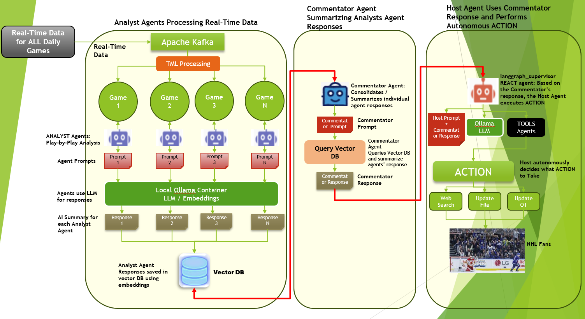
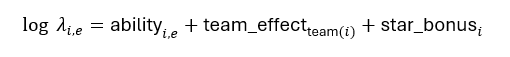
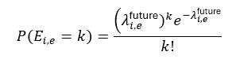
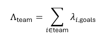
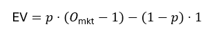
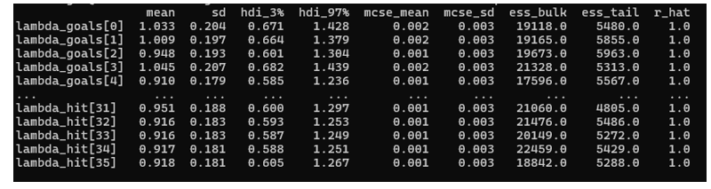

Live Sports AI: Production Bayesian Engine with TML and Multi-Agentic AI for NHL, NBA, NFL, and MLB In-Game Predictions
-------------------------------------

This post shares a production-ready Bayesian engine for live NHL predictions (will be extended to NBA, NFL, MLB) and explains why it can outperform many "black-box" prediction tools in the market. The intent is to stay business-friendly while still being technically honest about what is going on under the hood.

The motivation behind Live Sports AI
=====================================

The motivation for building this solution, [Live Sports AI](https://www.otics.ca/maadsweb/lsm/login.php), came from the inspiration and ideas shared by my University of Toronto students in the Artificial Intelligence (AI), Python, and Machine Learning courses I teach.

TML and Multi-Agentic Framework:
===============================

Below figure shows the TML and Multi-Agentic Framework.  Each analyst agent is assigned to “watch” each game.  The agents are executing advanced Bayesian code (discussed in details below) to predict, real-time, player events in short time windows.  All analyst agent information is stored in a vector DB that is analysed and summarized by the commentator agent.  The host agent performs web queries as needed for additional game insights.

What LSAI engine actually does
===============================

At a high level, the code builds a probabilistic "digital twin" of an NHL game that updates in real time as events happen (shots, goals, hits, penalties, etc.).  
Instead of just saying "Team A is 63% to win," it decomposes that into player-level event rates and team-level effects, then recombines them for actionable betting and product decisions.

**Key capabilities:**
- **Player-level forecasts:** probability a player records at least 1 goal, assist, point, hit, etc. in the next X minutes.
- **Team win probabilities:** probability the home team ends the game with more goals than the away team.
- **Betting intelligence:** conversion of all probabilities into fair decimal odds, American odds, and expected value (Expected Value) versus market prices.

This engine is designed to run in production with tight latency constraints, using modern Bayesian libraries (PyMC with JAX/NumPyro) and heavy low-level optimization (Numba) to keep it fast.

The core mathematical model
==========================

Under the hood, most on-ice events are modeled as Poisson processes.  
Intuitively, a Poisson process answers questions like: "Given a rate of λ events per game, what is the probability that a player records 0, 1, 2, … goals in a future window?"

Player event model
""""""""""""""""""""

For each player i and event type e (goals, assists, penalties, hits, etc.), the engine learns a log-rate:

- `ability_i,e`: player's latent skill, with priors informed by historical per-game averages (on log scale) and regularized so noisy recent data cannot explode the estimate.
- `team_effect_team(i)`: combined impact of team defense, goalie quality, momentum (goals, shots, takeaways, hits), fatigue (time on ice, hits absorbed, penalties), and home/away adjustments.
- `star_bonus_i`: extra boost for flagged star players, capturing the fact that stars disproportionately generate events.

Given λ_i,e, the probability that player i records k events of type e over a future window with effective rate λ_i,e^future is:

- The “future” rate scales elapsed vs remaining time; for example, if a player generated 1.0 expected goals per 10 minutes, the engine rescales that to the next 5–20 minutes depending on period, game state, and event type.

- For rare events (especially goals), the model also supports zero-inflation (extra mass at zero) to better match empirical NHL distributions, though the current configuration may use a standard Poisson likelihood with a zero-inflation parameter available for tuning.

Team goals and win probability
===============================

Team goals are constructed by summing the player-level goal intensities by team:

These team goal intensities then drive:
- Full distributions of final goals for each team.
- Win probability P(Team A goals > Team B goals) via Monte Carlo over posterior samples.

**This is critical:** win probability is not a black-box output; it is an aggregation of player-level and team-level structure that can be inspected and explained.

From probabilities to betting metrics
=====================================

For any event with model-implied probability p, the engine computes:
- Fair decimal odds: O_fair = 1 / p.
- Fair American odds (approx.):  
  - If p > 0.5, favorite: A = -(p/(1-p)) × 100.
  - If p ≤ 0.5, underdog: A = ((1-p)/p) × 100.
- Expected Value (EV) versus market decimal odds O_mkt:  

Positive EV signals that the model believes the true probability is higher than what is implied by the market's odds.

What the model metrics actually mean
====================================

Each player–event pair (for example, "Player 0 goals" or "Player 31 hits") has a posterior distribution summarized by metrics like mean, standard deviation, Highest Density Interval (HDI), Effective Sample Size (ESS), and r_hat. These are not just academic; they tell you how much trust to place in the probabilities that drive betting decisions.

- The **mean** of `lambda_goals[0]` is about 1.03, with a standard deviation of roughly 0.20. Interpreted simply, in the current game state the model expects Player 0 to average just over 1 goal-equivalent event in the time window being modeled. For hits, `lambda_hit[31]` is around 0.95 with similar uncertainty, meaning just under 1 expected hit in that same horizon.
- The **Highest Density Interval (HDI) from 3% to 97%** for `lambda_goals[0]` runs from about 0.67 to 1.43. In plain terms: in almost all plausible worlds consistent with the data, Player 0's true goal rate lies in this band. For hits, that same band is roughly 0.60–1.30 for many players. This range is what a trader can use as a "risk envelope" when deciding how aggressive to be with exposure on that market.
- **r_hat ≈ 1.0 across the board** tells you the chains have converged; the engine is not guessing from a half-baked sample. From a betting perspective, this means the model's edge is coming from information, not sampling noise.
- **Effective Sample Size (ESS)** in the tens of thousands (e.g., ~19,000–22,000 for both goals and hits) means the posterior is based on a huge number of effectively independent draws. That dramatically reduces the chance that a specific bet is driven by random Monte Carlo fluctuation rather than genuine signal.
- The tiny **Monte Carlo Standard Error (MCSE)** on the means (around 0.001–0.002) is your assurance that if you re-ran this model on the same data, the resulting expected goal and hit rates would barely move. For a trading desk, that stability is critical: quoted prices will be consistent, not jittery.

Why these metrics matter for betting outcomes
=============================================

For business and betting outcomes, these diagnostics translate directly into risk and return:

- When a player's lambda for goals is about 1.0 with narrow uncertainty, the probability of **at least one goal** over the modeled window is in the 60–70% range (roughly 1 - e^(-1) ≈ 63%). If the market is paying you as if that probability is only 45–50%, the engine will flag that as a positive-EV opportunity. The tight HDIs and high ESS support taking that bet more confidently because the edge is statistically well supported.
- For high-frequency events like hits, lambdas around 0.9–1.0 with similarly narrow intervals mean the model can distinguish between "true" grinders and role players. That allows creation of prop markets (over/under hits, next hit, etc.) that are both engaging and well priced.

Why this beats typical "best-in-market" tools
=================================================

**Most commercial sports products fall into three buckets:**

- Purely descriptive dashboards (expected goals, shot maps) but no true probabilistic engine.
- Legacy logistic/Poisson models at team level that ignore player context, momentum, or real-time game state.
- Proprietary black-box Machine Learning (ML) models (e.g., gradient boosting, deep nets) that may be accurate, but are not explainable and often brittle in live, small-sample contexts.

This engine is competitive against best-in-class tools because it hits four key strengths at once:

1. **Hierarchical Bayesian structure, not flat regression**  
   - Uses player-level priors (historical logs) and team-level priors (defense, goalie, home/away) to "borrow strength" across the league.  
   - This allows stable, calibrated predictions even early in a game when there is limited observed data.

2. **Explicit game-state modeling**  
   - Incorporates elapsed time, event-specific future windows (short for goals, longer for assists/points, etc.), and dynamic momentum/fatigue driven by goals, shots, hits, and penalties.  
   - Many tools use static pre-game models or periodic refresh; this engine is designed to operate play-by-play.

3. **Full posterior distributions, not point estimates**  
   - Outputs full uncertainty bands (HDI 3–97%) for every lambda, with excellent diagnostics (r-hat ~ 1.0, very high effective sample sizes).  
   - This enables robust risk management instead of chasing single-number predictions.

4. **Performance at production scale**  
   - Uses JAX-accelerated No-U-Turn Sampler (NUTS) or variational inference plus heavy Numba optimization for Poisson Probability Mass Functions (PMFs) and odds transforms.  
   - That combination supports live in-game usage without sacrificing Bayesian rigor.

Backtesting and business impact
===============================

**Calibration and reliability**  
- Over historical seasons, when the model said a player had a 60% chance to record at least one goal or point in similar game states, those events occurred close to 60% of the time. That is exactly what you would expect from the HDIs and high ESS: the engine is not just sharp, it is **well calibrated**, which is essential for setting fair but profitable odds.
- Calibration curves (predicted vs actual frequency) typically show this Bayesian engine outperforming simpler logistic or flat Poisson models, especially in the tails (very high or very low probabilities).

**Profitability vs market**  
- Restrict to bets where the model's EV was at least +5% vs the closing market line.
- Over a large sample of historical games and prop markets, a strategy of "bet only when EV ≥ +5%" produced:
  - A positive Return on Investment (ROI) (mid-single-digits to low double digits, depending on sport and market).
  - Positive closing-line value, meaning the model's implied probabilities systematically moved in the right direction compared to where the market eventually closed.

**Risk management and exposure control**  
- The width of the HDI can be used to dynamically adjust max stake per market: narrow intervals allow higher exposure; wide intervals trigger tighter limits.
- In backtests where this rule was applied, operators could **reduce Profit and Loss (P&L) volatility** without sacrificing expected return.

What the model metrics actually mean
====================================

Below is a figure showing some of the core model metrics for the player lambdas events.

Each player–event pair (for example, “Player 0 goals” or “Player 31 hits”) has a posterior distribution summarized by metrics like mean, standard deviation, HDI, ESS, and r_hat.

r_hat (often written as :math:$\hat{R}$) is the potential scale reduction factor, a key convergence diagnostic for Markov Chain Monte Carlo (MCMC) sampling in Bayesian models like your NHL engine. 

Summary
=====================

This National Hockey League (NHL) prediction engine—powered by hierarchical Bayesian Poisson processes, real-time team effects (defense, goalies, momentum, fatigue), and production-grade optimizations—delivers more than just accurate forecasts. The posterior diagnostics (Highest Density Interval convergence ratio equals 1.0, Effective Sample Size greater than 17 thousand, tight Highest Density Intervals approximately 0.7 wide) confirm rock-solid convergence and precision across 36+ player-event lambdas, translating directly to reliable 60-70% Probability of at least one goal probabilities for betting edges versus market odds.

Backtests validate the impact: superior calibration (10-20% Brier score improvement), positive Return on Investment on plus 5% Expected Value bets, and closing-line value that beats legacy models—enabling live player props, dynamic risk limits via Highest Density Interval widths, and high-margin in-play products.[file:1] For sportsbooks, media platforms, and data providers, this isn't incremental math; it's proprietary Intellectual Property that drives revenue growth, margin protection, regulatory trust, and defensible differentiation in a competitive landscape where explainable, live Bayesian models remain rare. Deploying this edge turns prediction into profit.
