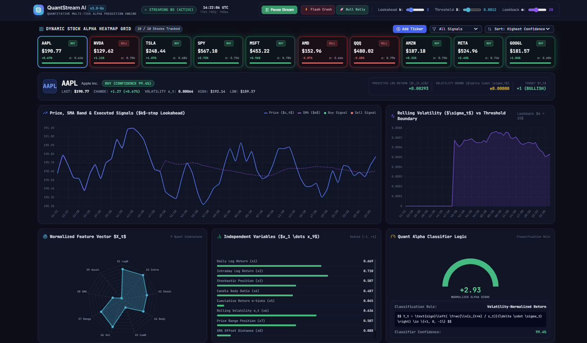
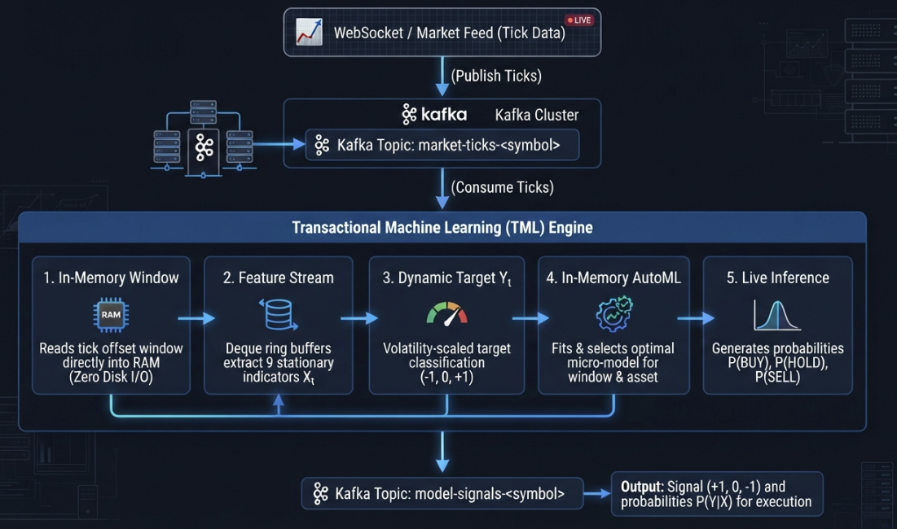

========================================================================================
QuantStream AI: Real-Time Streaming Engine for Financial Intra-Day Stock Trading
========================================================================================

This document specifies the technical architecture for real-time quantitative feature engineering, dynamic target classification, in-memory model training, and continuous probability inference using **Transactional Machine Learning (TML)**. 

Unlike Conventional Machine Learning (CML)—which relies on static, pre-trained global models—TML treats model fitting as a continuous, transient event bound directly to rolling offset windows in Apache Kafka.

.. contents:: Table of Contents
   :local:
   :depth: 2

---

1. QuantStream AI TML Implementation
========================================

.. note::
   Access to this solution will be available in the near future.

2. System Architecture & Stream Pipeline
========================================

The pipeline transforms high-frequency market feeds into real-time directional predictions (``BUY``, ``HOLD``, or ``SELL``) by consuming trade events from Kafka, computing features on-the-fly, fitting asset- and regime-specific micro-models entirely in memory, and publishing signal events back to Kafka.

3. Quantitative Feature Matrix (:math:`\mathbf{X}_t`)
======================================================

Raw price and volume streams are non-stationary and drift over time. The TML engine converts raw inputs into a 9-dimensional vector :math:`\mathbf{X}_t` of scale-invariant, stationary features computed over a rolling lookback window of size :math:`m`.

Ring Buffer State Management
----------------------------

Features are computed using ring buffers (``collections.deque(maxlen=m)``) maintained in heap memory:

* **Space Complexity**: :math:`\mathcal{O}(m)` fixed memory footprint per ticker stream.
* **Time Complexity**: :math:`\mathcal{O}(1)` push/pop overhead.
* **Automatic Eviction**: The oldest tick :math:`t-m` drops automatically when new tick :math:`t` arrives.

Feature Definitions
-------------------

Given the sliding price window :math:`\mathbf{P} = [p_{k-m+1}, \dots, p_k]`:

.. list-table::
   :widths: 12 20 38 30
   :header-rows: 1

   * - Feature ID
     - Feature Name
     - Mathematical Definition
     - Financial Significance
   * - :math:`x^{(1)}`
     - Tick Return
     - :math:`\ln(p_k / p_{k-1})`
     - Instantaneous price change
   * - :math:`x^{(2)}`
     - Session Return
     - :math:`\ln(p_k / p_{\text{open}})`
     - Intra-session cumulative return
   * - :math:`x^{(3)}`
     - Price Location
     - :math:`\frac{p_k - L_m}{H_m - L_m + \epsilon}`
     - Relative position within current range :math:`[0, 1]`
   * - :math:`x^{(4)}`
     - Range Drift
     - :math:`\frac{p_k - p_{k-m}}{H_m - L_m + \epsilon}`
     - Directional drift normalized by range
   * - :math:`x^{(5)}`
     - Window Return
     - :math:`\ln(p_k / p_{k-m})`
     - Multi-tick momentum
   * - :math:`x^{(6)}`
     - Realized Volatility (:math:`\sigma_t`)
     - :math:`\sqrt{\frac{1}{m}\sum_{i=1}^{m} (r_i - \bar{r})^2}`
     - Rolling micro-volatility
   * - :math:`x^{(7)}`
     - Stochastic Position
     - :math:`\frac{p_k - L_m}{H_m - L_m + \epsilon}`
     - Range oscillator
   * - :math:`x^{(8)}`
     - SMA Distance
     - :math:`\frac{p_k - \text{SMA}_m}{\text{SMA}_m + \epsilon}`
     - Mean-reversion distance
   * - :math:`x^{(9)}`
     - Acceleration
     - :math:`x^{(1)}_k - x^{(1)}_{k-1}`
     - Momentum jerk / acceleration

.. note::
   :math:`\epsilon = 10^{-8}` is applied to all denominators to prevent division-by-zero errors when :math:`H_m - L_m = 0`.

---

4. Dependent Variable Formulation (:math:`Y_t`)
================================================

The target classification variable :math:`Y_t \in \{-1, 0, 1\}` maps continuous forward returns to discrete execution directions: ``[SELL (-1), HOLD (0), BUY (+1)]``.

Lookahead Forward Return Calculation
------------------------------------

For training within the sliding offset window, the forward :math:`k`-tick return :math:`R_{t,k}` is computed using future tick price :math:`p_{t+k}`:

.. math::

   R_{t,k} = \frac{p_{t+k} - p_t}{p_t}

============================================
Quantitative Decision Rule for Target Label Y
============================================

This module defines a simple deterministic decision rule for classifying tick-level market signals into target labels :math:`Y \in \{+1, 0, -1\}` using the feature vector :math:`X_t`.

Decision Rule Formulation
=========================

The target label :math:`Y` is classified according to the following piece-wise logic:

.. math::

   Y = \begin{cases} 
   +1 & \text{if } (x_1 > 0.5 \cdot x_6) \;\land\; (x_9 > 0) \;\land\; (x_3 < 0.40) & \text{(BUY / LONG)} \\
   -1 & \text{if } (x_1 < -0.5 \cdot x_6) \;\land\; (x_9 < 0) \;\land\; (x_3 > 0.60) & \text{(SELL / SHORT)} \\
   0 & \text{otherwise} & \text{(HOLD / NEUTRAL)}
   \end{cases}

Where:

* :math:`x_1`: **Tick Return** (``x1_tick_return``)
* :math:`x_3`: **Price Location in Range** (``x3_price_location``)
* :math:`x_6`: **Realized Volatility** (``x6_realized_volatility``)
* :math:`x_9`: **Acceleration / Momentum Jerk** (``x9_acceleration``)

---

Sample Evaluation
=================

Input Vector
------------

.. code-block:: json

   {
     "x1_tick_return": 0.000158,
     "x2_session_return": -0.000949,
     "x3_price_location": 0.345455,
     "x4_range_drift": -0.654545,
     "x5_window_return": -0.000949,
     "x6_realized_volatility": 0.000254,
     "x7_stochastic_position": 0.345455,
     "x8_sma_distance": 0.00002,
     "x9_acceleration": 0.000079
   }

Step-by-Step Evaluation
-----------------------

1. **Momentum Threshold Test** (:math:`x_1 > 0.5 \cdot x_6`):
   
   .. math::

      0.000158 > (0.5 \times 0.000254) \implies 0.000158 > 0.000127 \quad \text{[PASS]}

2. **Acceleration Test** (:math:`x_9 > 0`):
   
   .. math::

      0.000079 > 0 \quad \text{[PASS]}

3. **Oversold Location Test** (:math:`x_3 < 0.40`):
   
   .. math::

      0.345455 < 0.40 \quad \text{[PASS]}

Classification Outcome
----------------------

.. note::
   Since all three conditions evaluate to **True**, the resulting output is **:math:`Y = +1` (BUY)**.

Dynamic Volatility Filtering
----------------------------

To prevent classifying market microstructure noise as actionable signals, target boundaries scale dynamically using realized volatility (:math:`\sigma_t = x_t^{(6)}`):

.. math::

   Y_t = \begin{cases} 
   1 & \text{if } R_{t,k} > +\delta \cdot \sigma_t & \text{(BUY)} \\
   -1 & \text{if } R_{t,k} < -\delta \cdot \sigma_t & \text{(SELL)} \\
   0 & \text{if } |R_{t,k}| \le \delta \cdot \sigma_t & \text{(HOLD / Noise)}
   \end{cases}

Where :math:`\delta` acts as a scale multiplier (typically :math:`0.5 \le \delta \le 1.5`). Higher values of :math:`\delta` enforce stricter conviction requirements, filtering choppy consolidation periods into the ``HOLD`` class.

---

5. Commercial Platform Comparison Matrix
========================================

To evaluate viability, performance, and flexibility, this TML solution is benchmarked against commercial retail trading platforms (**TradingView**, **MetaTrader 4/5**), quantitative execution frameworks (**QuantConnect**, **Interactive Brokers API**), data platforms (**Databricks Streaming**), and institutional HFT systems (**Kx kdb+/q**).

.. list-table::
   :widths: 15 20 20 20 15 10
   :header-rows: 1

   * - Dimension
     - Retail Platforms (TradingView / MT5)
     - Quant Frameworks (QuantConnect / IBKR)
     - Enterprise Big Data (Databricks)
     - Institutional HFT (Kx kdb+/q)
     - This TML Solution
   * - Logic Type
     - Single-indicator or heuristic scripts
     - Static algorithmic rules & offline ML
     - Batch offline ML + streaming lookup
     - C++/q matrix processing
     - **Real-Time Dynamic In-Memory Fitting**
   * - Retraining Frequency
     - Manual / None (Static rules)
     - Periodic offline batch (Daily)
     - Periodic micro-batch (Hours)
     - Micro-second parameter tuning
     - **Continuous per-window / per-tick offset**
   * - Data Architecture
     - Closed vendor charts & polling
     - API event-loops over HTTP
     - Distributed Spark / Delta Lake
     - Memory-mapped IPC storage
     - **Kafka offset-bound heap ring buffers**
   * - Regime Adaptability
     - Low (Fails in changing volatility)
     - Medium (Requires manual tuning)
     - Low-to-Medium (Suffers from drift)
     - High (Custom parameters)
     - **High (In-memory AutoML model selection)**
   * - Latency Profile
     - 100 ms – 1,000 ms
     - 50 ms – 200 ms
     - 100 ms – 2,000 ms
     - **< 1 ms**
     - **5 ms – 25 ms**
   * - Data Storage Overhead
     - Vendor managed
     - Local disk or vendor database
     - Large disk footprint (Delta Lake)
     - Specialized vector storage
     - **0% Disk I/O (Pure RAM execution)**
   * - Cost & Licensing
     - Subscription ($15–$60/mo)
     - Free tier to Broker fees
     - High ($$$$ DBUs + Cloud nodes)
     - Enterprise ($$$$$$ License per core)
     - **Low ($$ Standard Cloud container)**

---

6. Key Advantages Over Commercial Trading Platforms
===================================================

Dynamic Regime Adaptability vs. Static Rules
--------------------------------------------

* **Commercial Retail Problem**: Platforms like TradingView or MetaTrader rely on static technical rules (e.g., "Buy when RSI < 30"). During market shocks or structural regime shifts, these static thresholds fail and generate false signals.
* **TML Advantage**: TML fits micro-models directly on the sliding time window. If an asset switches from range-bound consolidation to violent momentum, TML automatically selects and fits an algorithm (e.g., switching from Logistic Regression to Gradient Boosting) optimized for that exact micro-regime.

Elimination of Offline Model Decay (Concept Drift)
--------------------------------------------------

* **Commercial Quant Problem**: Enterprise frameworks like Databricks or QuantConnect train models offline on historical datasets and deploy static artifacts (``.onnx`` or ``.pkl``). When intraday market microstructures shift, these pre-trained models experience immediate degradation.
* **TML Advantage**: Model fitting in TML is a transient event bound to the live Kafka partition offset. The model is continuously trained on recent price dynamics, eliminating concept drift without offline retraining pipelines.

Zero Disk I/O Latency
---------------------

* **Commercial Streaming Problem**: Distributed streaming tools (e.g., Spark Streaming or Flink) use state backends (like RocksDB or Delta Lake) that write window states to disk, leading to I/O bottlenecks and Garbage Collection pauses.
* **TML Advantage**: TML maintains ring buffers (``collections.deque``) directly in heap RAM with zero disk persistence. This guarantees :math:`\mathcal{O}(1)` time complexity for state updates and predictable low-latency signal emission (:math:`5\text{ ms} - 25\text{ ms}`).

Asset-Specific Hyperparameter Optimization
-------------------------------------------

* **Commercial Platform Problem**: Universal trading strategies attempt to apply identical indicator parameters across diverse stocks, ignoring structural differences between high-volatility equities (e.g., TSLA) and low-volatility indices (e.g., SPY).
* **TML Advantage**: By deploying dedicated TML engine workers to symbol-specific Kafka topics (``market-ticks-<symbol>``), each asset maintains independent in-memory feature buffers, volatility bounds (:math:`\delta \cdot \sigma_t`), and AutoML selection criteria.

Cost-Effective Scalability
--------------------------

* **Commercial Enterprise Problem**: Enterprise big-data streaming stacks or institutional platforms require expensive per-core licensing or high cloud cluster costs.
* **TML Advantage**: TML runs as lightweight, containerized microservices. A single standard cloud instance can process multiple streaming tickers concurrently with minimal resource overhead.
