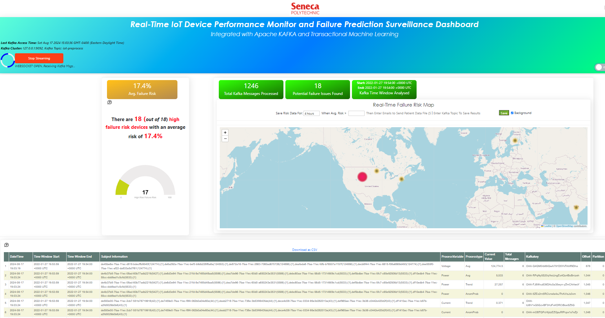

QUICK START: Run A TML Solution Right Now!
====================================

For users who want to quickly see a running solution now, just do the following.

.. note:: 

   You must have docker installed.

Run this docker command:

.. code-block::

   docker run -d -p 9005:9005 maadsdocker/seneca-iot-tml-kafka-amd64 

.. tip::
    Wait about 10 seconds...

Then, open up your favorite browser and enter this URL below:

.. code-block:: 
    
    http://localhost:9005/iot-failure-seneca.html?topic=iot-preprocess2,iot-preprocess&offset=-1&groupid=&rollbackoffset=500&topictype=prediction&append=0&secure=1

.. tip::
    PRESS THE RED "START STREAMING" button in the top-left...

You should see this Dashboard in your browser start to populate with real-time IOT data:

