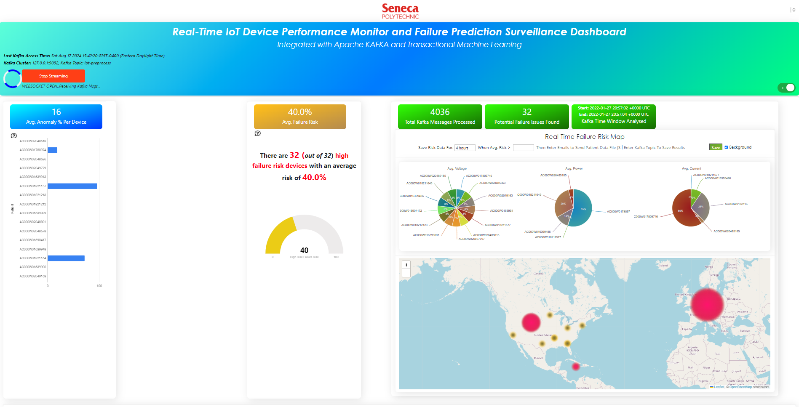
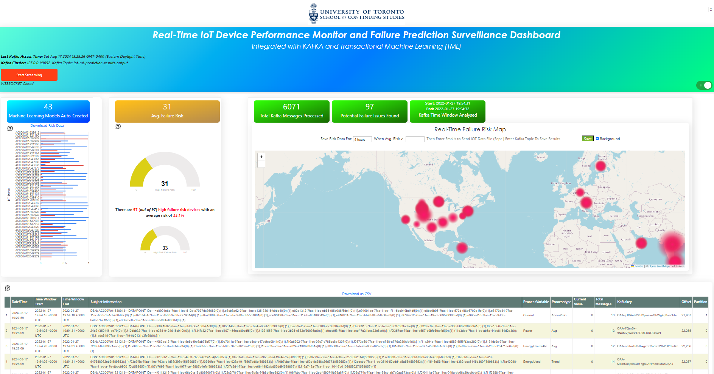

QUICK START: Run TWO TML Solutions Right Now!
====================================

.. important::
    The power of TML is not only in how it can process and perform machine learning at the entity level, in-memory, but the amazing real-time visualizations that 
    users can create with the TML output for faster, deeper, insights from real-time data streams.

QUICK START: TML Solution with Real-Time Entity Based Processing
-------------------------------------------------

For users who want to quickly see a running solution now, just do the following.

.. note:: 

   You must have docker installed.

Run this docker command:

.. code-block::

   docker run -d -p 9005:9005 maadsdocker/seneca-iot-tml-kafka-amd64 

.. tip::
    Wait about 10 seconds...

Then, open up your favorite browser and enter this URL below:

.. code-block:: 
    
    http://localhost:9005/iot-failure-seneca.html?topic=iot-preprocess2,iot-preprocess&offset=-1&groupid=&rollbackoffset=500&topictype=prediction&append=0&secure=1

.. tip::
    PRESS THE RED "START STREAMING" button in the top-left...

You should see this Dashboard in your browser start to populate with real-time preprocessed IOT data:

.. note::
   The above dashboard is processing real-time data and streaming it directly from your container to your browser using websockets.

.. tip::
    Hover over with your mouse on the map bubbles.  You can also download all the table data by clicking "Download as CSV".

QUICK START: Another TML Soluton with Real-Time Entity Based Processing AND Machine Learning
----------------------------------------------------------------------

Let's run another TML solution, but this time with machine learning models being created for each device entity.

Run this docker command:

.. code-block::

   docker run -d -p 9006:9006 maadsdocker/uoft-iot-tml-kafka-amd64

.. tip::
    Wait about 10 seconds...

Then, open up your favorite browser and enter this URL below:

.. code-block:: 
    
    https://localhost:9006/iot-failure-machinelearning-uoft.html?topic=iot-preprocess,iot-ml-prediction-results-output&offset=-1&groupid=&rollbackoffset=500&topictype=prediction&append=0&secure=1

.. tip::
    PRESS THE RED "START STREAMING" button in the top-left...

You should see this Dashboard in your browser start to populate with real-time entity based probability predictions of IOT device failures.  **The figure below shows 43 machine learning models created for 43 devices!**

.. tip::
    Press the TOGGLE button in the top-right of the dashboard.
