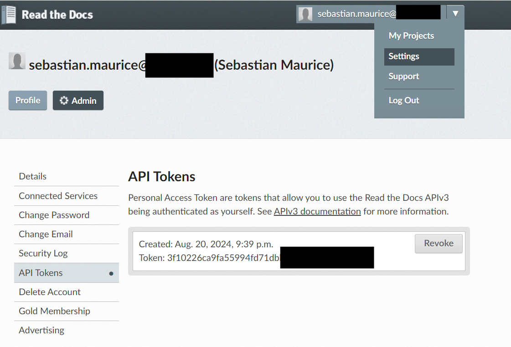

Set Up Readthedocs
======================

.. important::
   TSS automatically creates a TML solution documentation as part of your solution.  This is an important part of the process because it will give you instructions 
   on how to operate your solution as well as the parameters used in the DAGs. 

STEP 1: Create a Readthedocs Account 
^^^^^^^^^^^^^^^^^^^^^^^^^^^^^^^^^^

Create a free account at `Readthedocs <https://readthedocs.org/>`_

STEP 2: Generate API Token
^^^^^^^^^^^^^^^^^^^^^^^^^^^^^^^

Once account created, go to your Profile settings and generate API Token - see figure below

STEP 3: Add Token in TSS Docker Run Command
^^^^^^^^^^^^^^^^^^^^^^^^^

Copy the Token and paste it in the TSS docker run command. Refer to :ref:`TSS Docker Run Command`

        **--env READTHEDOCS=<Token>**
