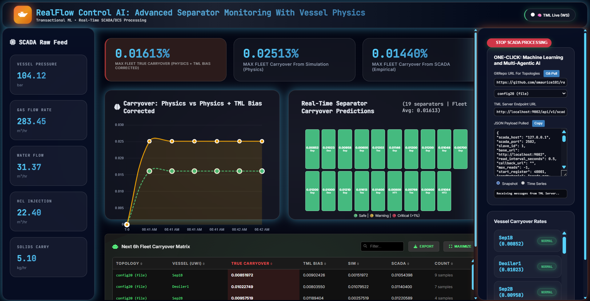

RealFlow Control AI: Sub-Millisecond Physics-TML Fusion
=========================================================

RealFlow Control AI** represents a paradigm shift in industrial process monitoring. It is the first production-ready framework to achieve **sub-millisecond carryover predictions** across 150-vessel fleets at SCADA clock rates.

By fusing **high-fidelity quadrature physics** with **Transactional Machine Learning (TML)**, RealFlow eliminates the "Latency-Trust Gap" inherent in traditional Digital Twins.

-----

Why RealFlow?
-------------

12,500x Computational Speedup
""""""""""""""""""""""""""""""""

Traditional CFD (Computational Fluid Dynamics) is too slow for real-time control. RealFlow delivers full transient multiphysics 12,500x faster than ANSYS Fluent baselines. While SCADA updates every 100ms, our TML Simulator completes a fleet calculation in **0.12ms (8,006 Hz)**.

The Global Bias Ledger
""""""""""""""""""""""""

RealFlow doesn't just predict; it learns. We isolate unmodeled physical entropy (like sensor drift or internal scaling) into a **Global Bias Ledger**. This ledger allows the system to identify "mathematical fingerprints" of failures and broadcast "immunization" data across the entire Kafka network.

Green AI Architecture
"""""""""""""""""""""""

High-performance intelligence shouldn't require a power plant.

  * **Low Memory:** Monitors 150 vessels on just **4 GB of RAM**.
  * **Edge Ready:** Runs on standard CPUs at **\<15 Watts**, eliminating the need for expensive GPU clusters.

-----

Core Methodology: The Fusion Framework
-----------------------------------------

RealFlow operates on a deterministic hybrid model. The "True Carryover" (:math:`\Gamma_{true}`) is the convergence of physical law and machine learning adaptation.

The Fusion Equation
""""""""""""""""""""""""

The system calculates the final state by solving:

.. math::

   \Gamma\_{true}(t) = \Psi(\vec{P}, \vec{F}, \Phi)*{phys} + \delta(\epsilon)*{TML}

Where:

  * :math:`\Psi_{phys}`: High-speed quadrature physics kernel.
  * :math:`\vec{P}, \vec{F}`: Live Pressure and Flow vectors from SCADA.
  * :math:`\delta(\epsilon)`: The TML Bias—a learned residual capturing real-world drift.

-----

Technical Deep Dive
------------------------

Sub-Millisecond Quadrature Physics
""""""""""""""""""""""""""""""""""""

To maintain speed without sacrificing accuracy, RealFlow utilizes **Numba JIT-compiled Gauss-Legendre Quadrature**. The droplet separation efficiency (:math:`\eta`) is integrated over the droplet size distribution:

.. math::

   \eta = \int_{D_{crit}}^{\infty} f(D) \cdot \exp\left(-\frac{18\mu H}{D^2(\rho_l - \rho_g)V_g}\right) dD

Self-Healing Gaussian Processes
--------------------------------

The TML layer utilizes a **Hierarchical Gaussian Process (HGP)** to minimize variance between the physical model and real-world outcomes. This allows the system to "self-heal" when sensors begin to drift.

-----

Dashboard Operations
----------------------------

1\. High-Level KPI Matrix

  * **Max Fleet True Carryover:** The corrected risk value (Physics + Bias).
  * **Max Fleet Sim Carryover:** The raw theoretical value.
  * **Max Fleet SCADA Carryover:** The empirical value from the DCS.

2\. Dynamic Telemetry Matrix

The dashboard features a searchable, sortable **Level 5 Diagnostic Table**.

  * **Dynamic Loading:** Ingests JSON payloads on-the-fly via WebSocket.
  * **Exportable Data:** One-click CSV export for high-precision audit trails.
  * **Sorting:** Instantly rank the fleet by "True Carryover" to identify at-risk assets.

3\. GitPull Topology Integration

RealFlow treats industrial hardware as code. Use the **Git Pull** interface to update vessel configurations (Topologies) via GitHub. The system re-compiles the physics threads in real-time without stopping the data stream.

-----

Level 5 Autonomous Control
---------------------------

RealFlow moves beyond monitoring into **Deterministic Control**. By calculating the **Control Action Probability (:math:`P_{act}`)**, the system can automatically adjust DCS setpoints via JSON-RPC:

.. math::

   P\_{act} = P(\\Gamma\_{true} \> \\Gamma\_{crit} \\mid \\text{Telemetry}\_{t-6h})

This allows for a fully closed-loop plant where the AI prevents carryover events 6 hours before they occur.

-----

To minimize the variance between the physical model and real-world outcomes, we apply:

.. math::

   \min \sum_{i=1}^{n} (\Gamma_{scada} - (\Psi_{phys} + \delta_{TML}))^2

Getting Started
-------------------

Contact Otics Advanced Analytics: info@otics.ca

To deploy RealFlow Control AI:

1.  **Pull Topology:** Connect your GitHub repo containing vessel `config.json` files.
2.  **Stream SCADA:** Point the dashboard to your TML/Kafka server endpoint.
3.  **Calibrate:** Monitor the green dashed "Bias" line in the trend chart to verify model convergence.

-----

*© 2026 Otics Advanced Analytics. Built for Level 5 Autonomous Operations.*
