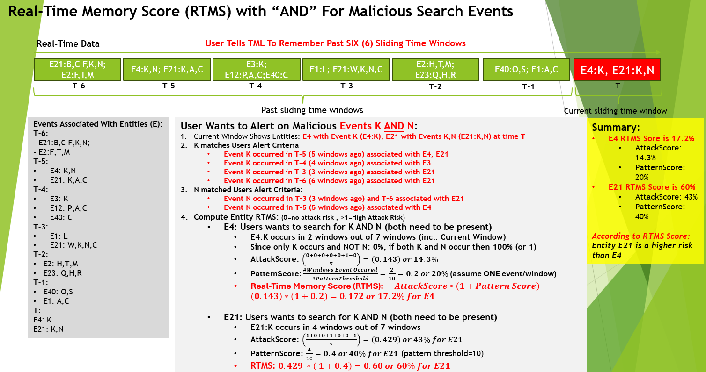
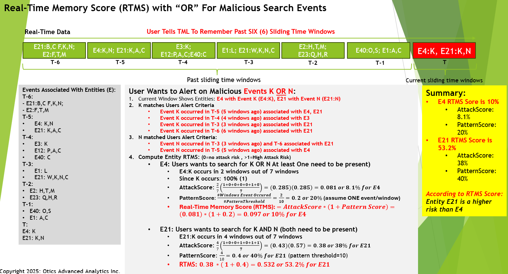

How TML Maintains Past Memory of Events Using Sliding Time Windows in Real-Time
============================================

.. tip::
   This capability is implemented in :ref:`STEP 4c: Preprocesing 3 Data: tml-system-step-4c-kafka-preprocess-dag`

.. note::
   While the Real-Time memory of sliding time windows (RTMS) is demonstrated for Cyber security, **it can be applied to any usecase in Retail, Finance, IoT, Energy, 
   Manufacturing etc..** Anytime you want to analyse TEXT files and determine if events have occured in the past and quantify their importance (or lack of 
   importance) then this is a powerful feature for you.  

   Also, if you want to **cross-reference TML machine learning output of every entity to text files** i.e. log files, and "remember" their behaviour then this 
   feature becomes very powerful for you. For example, you may be processing Entities in `Step 4 <https://tml.readthedocs.io/en/latest/tmlbuilds.html#step- 
   preprocesing-data-tml-system-step-4-kafka-preprocess-dag>`_ and then want to determine if an entity is showing up in the logs or whether it is hacking in to your 
   company using a slow and "occasional" attempt over time to EVADE detection algorithms, then RTMS can be very powerful to detect this complex behaviour.

Importance of Real-Time Data and Cyber Crime
---------------------------

* The growth of **real-time data** according to IDC Research **will reach 30% of global data in 2025 or roughly 90 ZB or 90 trillion gigabytes** mainly from IoT devices connected to the Internet

* This raises concerns and opportunities to process real-time data with Transactional Machine Learning (TML)

* The major concern with real-time streaming data from connected devices is the risk of Cybersecurity attacks

* **Cyber crime is expected to cost the global economy $10.7 Trillion in 2025 and this number is growing**

* This makes Cyber crime prevention and mitigation a Top Priority for global organizations regardless of size

* TML presents a powerful method of detecting, mitigating and preventing cyber attacks at the entity level by “remembering” past events in past sliding time windows and quantifies this by computing three scores:

   * **Attack Score (AS):** Quantifies the attack vector.  Higher number, more likely attack is occurring
  
   * **Pattern Score (PS):** Quantifies the pattern vector.  Higher number, more likely a pattern in the attack
  
   * **Real-Time Memory Score (RTMS):** Combines both the Attack and Pattern Scores for an OVERALL score

The Method
-------------------

#. User tells TML to keep a memory of past sliding time windows

#. User wants TML to search for malicious events from each entity (i.e. IP address, devices, etc..)

#. Malicious events are TEXT like: “authentication failures”, “unknown password”, “unknown users”

#. TML does a direct STRING search for these terms in the sliding time windows
  
   .. note::
      THIS METHOD DOES NOT NEED A VECTOR DB or PRIVATEGPT only TML Processing– this makes TML method very light weight and fast

#. The Data TML searches, in real-time, are text files that are most likely log files 

#. The Log files can be files on the file system that TML reads OR logs that are directly streamed to Kafka with LogStash, Splunk, etc..
   
   .. note:: 
      Note: This data does NOT have to be any specific format – it can be ANY text file streamed in raw form.

#. As TML process these data in sliding time windows (for details on sliding time window go here: :ref:`TML Performs Entity Level Machine Learning and Processing`) it is computing in real-time the following Scores:

   #. **AttackScore** is computing the occurrence of malicious events in past windows and how likely this is an attack

   #. **PatternScore** uses a pattern threshold set by the users (we use 10 for demo) it counts the occurrence of  events (that user is searching for) in past windows

   #. **RTMS Score** simply combines the Attack and Pattern scores for an overall score.  

.. note:: 
   NOTE: RTMS can exceed 1 because the pattern score can be greater than 1 i.e. events can exceed user pattern threshold.
   These score will obviously fluctuate in real-time time and alerts can be set up to trigger ALARMS of a cyber attack.

Past Memory Demonstration
-----------------------

Summary
----------

* This has shown how TML implements real-time memory using sliding time windows for every entity

* For every entity: It quantified this memory in Three (3) scores:
  
  * **AttackScore**
  * **PatternScore**
  * **Real-Time Memory Score**

.. important::
   The power of TML maintaining memory and computing the 3 scores is to capture **attacker behaviours that try to EVADE detection algorithms**.  While the AttackScore may not indicate an attack, it may be picked up as a pattern in the PatternScore.

* Within Cyber security context: The power of this method using sliding time windows is the ability to detect hacking attempts that are deliberate in evading “detection algorithms” from common industry tools

* TML approach and method is a fast, low cost, method of maintaining memory of events as they occur or have occurred in the past that may be “occasional” events and VERY HARD TO DETECT from other commercial tools

* The simplicity of maintaining and incorporating memory by TML for EVERY ENTITY- without the need to vector DB – makes it lightweight, fast, and able to run WITHOUT the need for GPU (only CPU is needed)

* As attackers get more sophisticated in evading commercial algorithms’ detection methods – TML memory offers a continuous awareness of events that are current and have occurred in the past and correlates and quantifies these in a Score for triggering alerts and alarms immediately
