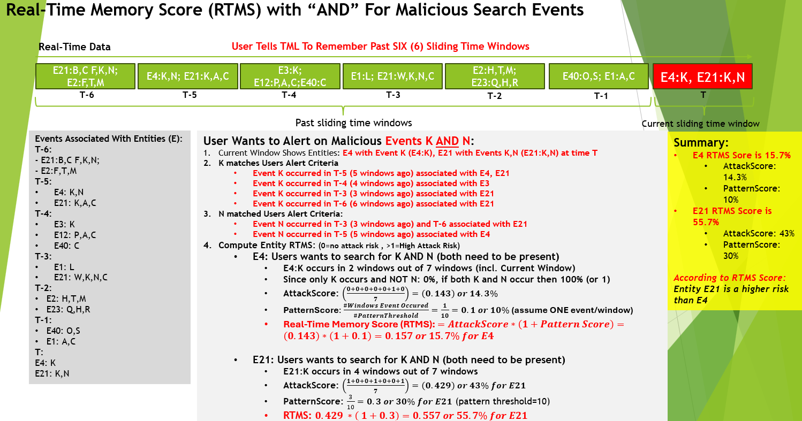

How TML Maintains Past Memory of Events Using Sliding Time Windows in Real-Time
============================================

.. tip::
   This capability is implemented in :ref:`STEP 4c: Preprocesing 3 Data: tml-system-step-4c-kafka-preprocess-dag`

.. note::
   While the Real-Time memory of sliding time windows (RTMS) is demonstrated for Cyber security, **it can be applied to any usecase in Retail, Finance, IoT, Energy, 
   Manufacturing etc..** Anytime you want to analyse TEXT files and determine if events have occured in the past and quantify their importance (or lack of 
   importance) then this is a powerful feature for you.  

   Also, if you want to **cross-reference TML machine learning output of every entity to text files** i.e. log files, and "remember" their behaviour then this 
   feature becomes very powerful for you. For example, you may be processing Entities in `Step 4 <https://tml.readthedocs.io/en/latest/tmlbuilds.html#step-4-preprocesing-data-tml-system-step-4-kafka-preprocess-dag>`_ and then want to determine if an entity is showing up in the logs or whether it is hacking in to your 
   company using a slow and "occasional" attempt over time to EVADE detection algorithms, then RTMS can be very powerful to detect this complex behaviour.

Importance of Real-Time Data and Cyber Crime
---------------------------

* The growth of **real-time data** according to IDC Research **will reach 30% of global data in 2025 or roughly 90 ZB or 90 trillion gigabytes** mainly from IoT devices connected to the Internet

* This raises concerns and opportunities to process real-time data with Transactional Machine Learning (TML)

* The major concern with real-time streaming data from connected devices is the risk of Cybersecurity attacks

* **Cyber crime is expected to cost the global economy $10.7 Trillion in 2025 and this number is growing**

* This makes Cyber crime prevention and mitigation a Top Priority for global organizations regardless of size

* TML presents a powerful method of detecting, mitigating and preventing cyber attacks at the entity level by “remembering” past events in past sliding time windows and quantifies this by computing three scores:

   * **Attack Score (AS):** Quantifies the attack vector.  Higher number, more likely attack is occurring
  
   * **Pattern Score (PS):** Quantifies the pattern vector.  Higher number, more likely a pattern in the attack
  
   * **Real-Time Memory Score (RTMS):** Combines both the Attack and Pattern Scores for an OVERALL score

The Method
-------------------

#. User tells TML to keep a memory of past sliding time windows

#. User wants TML to search for malicious events from each entity (i.e. IP address, devices, etc..)

#. Malicious events are TEXT like: “authentication failures”, “unknown password”, “unknown users”

#. TML does a direct STRING search for these terms in the sliding time windows
  
   .. note::
      THIS METHOD DOES NOT NEED A VECTOR DB or PRIVATEGPT only TML Processing– this makes TML method very light weight and fast

#. The Data TML searches, in real-time, are text files that are most likely log files 

#. The Log files can be files on the file system that TML reads OR logs that are directly streamed to Kafka with LogStash, Splunk, etc..
   
   .. note:: 
      Note: This data does NOT have to be any specific format – it can be ANY text file streamed in raw form.

#. As TML process these data in sliding time windows (for details on sliding time window go here: :ref:`TML Performs Entity Level Machine Learning and Processing`) it is computing in real-time the following Scores:

   #. **AttackScore** is computing the occurrence of malicious events in past windows and how likely this is an attack

   #. **PatternScore** uses a pattern threshold set by the users (we use 10 for demo) it counts the occurrence of  events (that user is searching for) in past windows

   #. **RTMS Score** simply combines the Attack and Pattern scores for an overall score.  

.. note:: 
   NOTE: RTMS can exceed 1 because the pattern score can be greater than 1 i.e. events can exceed user pattern threshold.
   These score will obviously fluctuate in real-time time and alerts can be set up to trigger ALARMS of a cyber attack.

High-Level Reference Architecture
-----------------------

.. important:: 

    **Some important points to note about the architecture below:**

    #. The TML RTMS solution can analyse ANY log file and AS MANY as you like
    #. You can use third-party tools like `LogStash <https://www.elastic.co/logstash>`_, `Splunk <https://www.splunk.com/>`_ etc.  to stream directly to Apache Kafka
    #. No format is needed for the log files - JUST STREAM IT TO KAFKA IN RAW FORM and tell TML in `Step 4c <https://tml.readthedocs.io/en/latest/tmlbuilds.html#step-4c-preprocesing-3-data-tml-system-step-4c-kafka-preprocess-dag>`_ what the Kafka Topic is in the **rtmsstream** JSON field.
    #.  You do NOT have to use Entities - you can immediately start analysing your log files for anomalies
    #. If you are using entities - start processing in `Step 4 <https://tml.readthedocs.io/en/latest/tmlbuilds.html#step-4-preprocesing-data-tml-system-step-4-kafka-preprocess-dag>`_ and connect the entities by specifying the topic you stored entities (in Step 4) to **raw_data_topic** in Step 4c.  Thats IT!
    #. Build as many TML RTMS solutions you want with the `TSS <https://tml.readthedocs.io/en/latest/docker.html#tml-solution-studio-tss-container>`_.

**Enjoy the POWER of TML RTMS solution - that integrates real-time ML/AI entity level predictions with text files (like log files) to protect your global organizations - UNLIKE ANY OTHER TECHNOLOGY IN THE MARKET.**

Past Memory Demonstration
-----------------------

.. important::
   **It is important to note the following about the Attack and Pattern scores:**

   * - **Pattern Score** will look for all occurences of search terms in each sliding time window.  Meaning there may be MULTIPLE occurencs of search terms in the SAME sliding time window.  This number can be greater than 1.

     * - **Pattern score** will check the number of windows GOING BACK as far as **RTMSMAXWINDOWS** parameter in `STEP 1 <https://tml.readthedocs.io/en/latest/tmlbuilds.html#step-1-get-tml-core-params-tml-system-step-1-getparams-dag>`_.  

     * - So, if this number is 1000, TML will check all 1000 sliding time windows for the occurence of the search terms.

   * - **Attack Score** ONLY checks if window CONTAINS AN OCCURENCE of the search term.  This number is either 1 or 0.  The attack score is GOING BACK as far as the **rememberpastwindows** parameter in `Step 4c <https://tml.readthedocs.io/en/latest/tmlbuilds.html#step-4c-preprocesing-3-data-tml-system-step-4c-kafka-preprocess-dag>`_.

.. figure:: rtms2.png
   :scale: 70%

TML Output of RTMS Scores
---------------

.. code-block:: JSON

      {
          "hyperprediction": "0.28",
          "Entity": "5.24",
          "Maintopic": "iot-preprocess",
          "Topicid": "topicid117_rtms-stream-mylogs",
          "Topic": "rtms-stream-mylogs",
          "Type": "External",
          "ProducerId": "RTMS",
          "TimeStamp": "2025-02-27 17:23:33",
          "Unixtime": 1740677013186772700,
          "kafkakey": "OAA-fOMleuaKxdS9iqZzL8uGxDMEIvcXUa",
          "Preprocesstype": "rtms",
          "UserSearchValues": "@authentication failure,192.168.--entity-- password failure ~ |unknown 192.168.--entity--",
          "SearchTextFound": "(TRUNCATED STRING EXCEEDS 3000)[Topic=rtms-stream-mylogs][MessageFound=many authentication failures for root preauth][UserSearch=failures][Partition=0 Offset=21410];[Topic=rtms-stream-mylogs][MessageFound=more authentication failures logname= uid=0 euid][UserSearch=failures][Partition=0 Offset=21416];[Topic=rtms-stream-mylogs][MessageFound=more authentication failures logname= uid=0 euid][UserSearch=failures][Partition=0 Offset=21417];[Topic=rtms-stream-mylogs][MessageFound=many authentication failures for root preauth][UserSearch=failures][Partition=0 Offset=21419];[Topic=rtms-stream-mylogs][MessageFound=more authentication failures logname= uid=0 euid][UserSearch=failures][Partition=0 Offset=21420];[Topic=rtms-stream-mylogs][MessageFound=more authentication failures logname= uid=0 euid][UserSearch=failures][Partition=0 Offset=21422];[Topic=rtms-stream-mylogs][MessageFound=many authentication failures for admin preauth][UserSearch=failures][Partition=0 Offset=21446];;[Topic=rtms-stream-mylogs][MessageFound=many authentication failures for root preauth][UserSearch=failures][Partition=0 Offset=21410];[Topic=rtms-stream-mylogs][MessageFound=more authentication failures logname= uid=0 euid][UserSearch=failures][Partition=0 Offset=21416];[Topic=rtms-stream-mylogs][MessageFound=more authentication failures logname= uid=0 euid][UserSearch=failures][Partition=0 Offset=21417];[Topic=rtms-stream-mylogs][MessageFound=many authentication failures for root preauth][UserSearch=failures][Partition=0 Offset=21419];[Topic=rtms-stream-mylogs][MessageFound=more authentication failures logname= uid=0 euid][UserSearch=failures][Partition=0 Offset=21420];[Topic=rtms-stream-mylogs][MessageFound=more authentication failures logname= uid=0 euid][UserSearch=failures][Partition=0 Offset=21422];[Topic=rtms-stream-mylogs][MessageFound=many authentication failures for admin preauth][UserSearch=failures][Partition=0 Offset=21446];;[Topic=rtms-stream-mylogs][MessageFound=many authentication failures for root preauth][UserSearch=failures][Partition=0 Offset=8038];[Topic=rtms-stream-mylogs][MessageFound=more authentication failures logname= uid=0 euid][UserSearch=failures][Partition=0 Offset=8044];[Topic=rtms-stream-mylogs][MessageFound=more authentication failures logname= uid=0 euid][UserSearch=failures][Partition=0 Offset=8045];[Topic=rtms-stream-mylogs][MessageFound=many authentication failures for root preauth][UserSearch=failures][Partition=0 Offset=8047];[Topic=rtms-stream-mylogs][MessageFound=more authentication failures logname= uid=0 euid][UserSearch=failures][Partition=0 Offset=8048];[Topic=rtms-stream-mylogs][MessageFound=more authentication failures logname= uid=0 euid][UserSearch=failures][Partition=0 Offset=8050];[Topic=rtms-stream-mylogs][MessageFound=many authentication failures for admin preauth][UserSearch=failures][Partition=0 Offset=8074];;[Topic=rtms-stream-mylogs][MessageFound=many authentication failures for root preauth][UserSearch=failures][Partition=0 Offset=8038];[Topic=rtms-stream",
          "FinalAttackScore": "0.08",
          "FinalPatternScore": "2.50",
          "ComputedAttackScore": "8.00",
          "ComputedPatternScore": "75.00",
          "RTMSSCORE": "0.28",
          "NumAttackWindowsFound": "8",
          "NumPatternWindowsFound": "75",
          "Filename": "/rawdata/rtms/rtms-stream-mylogs_117.txt",
          "TMLComment": "The RTMS score of 0.28 seems to show low activity or risk.  The AttackScore of 0.08 is less than PatternScore of 2.50,   which suggests likely no attack, but could be a pattern developing.  The number of sliding time windows that match occurences to your search terms for AttackScore is 0.08, the number of windows   searched for an occurence of a pattern is 75. TML will continue monitoring and these numbers may change over time.",
          "ActivityLevel": "Low",
          "RememberPastWindows": "100",
          "PatternThreshold": "30"
      }

Output Explanation
==========================

.. list-table::

   * - **Field**
     - **Explanation**
   * - hyperprediction
     - This is the RTMS Score
   * - Entity
     - This is the entity being analysed.  This can be 

       anything you want.
   * - Maintopic
     - This is the topic that holds the entity

       preprocessing from `Step 4 <https://tml.readthedocs.io/en/latest/tmlbuilds.html#step-4-preprocesing-data-tml-system-step-4-kafka-preprocess-dag>`_
   * - Topicid
     - TML gives entity an internal integer ID.
 
       This entity (192.168.5.24) has an internal

       ID of 17. The format is the:
   
       **topicid<internal entity number>_<name of RTMS topic searched>**
   * - Topic
     - The RTMS topic searched - containing TEXT
   * - Type
     - Internal label
   * - ProducerId
     - Internal label
   * - TimeStamp
     - The time results were generated.
   * - Unixtime
     - The Unixtime of TimeStamp
   * - kafkakey
     - Unique key for this JSON in Kafka.

       If you want to audit these results 

       these keys identify each message uniquely.
   * - Preprocesstype
     - Type is **rtms**
   * - UserSearchValues
     - These are the user search values. See tip below.
   * - SearchTextFound
     - This is list of text that was found in the 
 
       the Text files (log files) that contain your 

       search terms.  The list is truncated to 3000.
  
       But, this will give you a good indication of
 
       whats happening.
   * - FinalAttackScore
     - The Final attack score
   * - FinalPatternScore
     - The final pattern score
   * - ComputedAttackScore
     - This is the number of sliding time windows that contain
    
       the search terms.
   * - ComputedPatternScore
     - The number of sliding time windows that contain the search term.
   * - RTMSSCORE
     - The RTMS score.
   * - NumAttackWindowsSearched
     - The number of attack windows that contain the search
     
       terms.  This is upto **RememberPastWindows**
   * - NumPatternWindowsSearched
     - This the number of windows that contain the search terms.

       Note: This in not restricted to RememberPastWindows, but

       upto **RTMSMAXWINDOWS** in `Step 1 <https://tml.readthedocs.io/en/latest/tmlbuilds.html#step-1-get-tml-core-params-tml-system-step-1-getparams-dag>`_ 
    
       JSON field.
   * - Filename
     - This is a file of these results saved to:
     
       **/rawdata/rtms** folder in the container.
   * - TMLComment
     - This is the suggested auto-generated TML comment.
   * - ActivityLevel
     - Based on the RTMS score this is what TML suggests.
   
       You can ofcourse use your own judgement.
   * - RememberPastWindows
     - TML will remember the sliding windows upto
 
       this number.
   * - PatternThreshold
     - This is a user threshold to alert when a pattern

       is equal to or greater than this number.

.. tip:: 
   TML gives you are powerful capability to substiitute the **--entity--** placeholder with the **Entity** above. This makes it possible to search for each invidual entity in any log files.

.. note:: 
   If you DO NOT want to use entities simply set the **'raw_data_topic'** to an empty string ('') in `Step 4c <https://tml.readthedocs.io/en/latest/tmlbuilds.html#step-4c-preprocesing-3-data-tml-system-step-4c-kafka-preprocess-dag>`_.  This will force TML to search ONLY the TEXT file topics for your search terms.
   
TML RTMS vs AI RAG
------------

TML using real-time data is similar to `RAG <https://tml.readthedocs.io/en/latest/genai.html#tml-and-rag-a-powerful-combination>`_ but different in other ways.

.. list-table::

   * - **Attribute**
     - **TML RTMS**
     - **AI RAG**
   * - **Speed**
     - TML RTMS is much faster than RAG 

       because TML RTMS does NOT use vector DB.

       All TML RTMS processing is real-time.
     - AI RAG require vector DB for search. 

       Real-time is still difficult with RAG.
   * - **Prompting**
     - TML users direct text based search
     - With RAG you can use prompt
   * - **Combining ML and AI in Real-Time**
     - With TML you can combine TML output

       for each entity and cross-reference 

       with TEXT files
     - This is not currently possible with
       RAG       
   * - **Scalability**
     - TML RTMS scales with Kubernetes

       to process unlimited documents

       at a very low cost
     - Scaling RAG models is difficult

       and can be costly
   

Summary
----------

* This has shown how TML implements real-time memory using sliding time windows for every entity

* For every entity: It quantified this memory in Three (3) scores:
  
  * **AttackScore (AS)**
  * **PatternScore (PS)**
  * **Real-Time Memory Score (RTMS)**

.. important::
   The power of TML maintaining memory and computing the 3 scores is to capture **attacker behaviours that try to EVADE detection algorithms**.  While the AttackScore may not indicate an attack, it may be picked up as a pattern in the PatternScore.

* Within Cyber security context: The power of this method using sliding time windows is the ability to detect hacking attempts that are deliberate in evading “detection algorithms” from common industry tools

* TML approach and method is a fast, low cost, method of maintaining memory of events as they occur or have occurred in the past that may be “occasional” events and VERY HARD TO DETECT from other commercial tools

* The simplicity of maintaining and incorporating memory by TML for EVERY ENTITY- without the need to vector DB – makes it lightweight, fast, and able to run WITHOUT the need for GPU (only CPU is needed)

* As attackers get more sophisticated in evading commercial algorithms’ detection methods – TML memory offers a continuous awareness of events that are current and have occurred in the past and correlates and quantifies these in a Score for triggering alerts and alarms immediately
