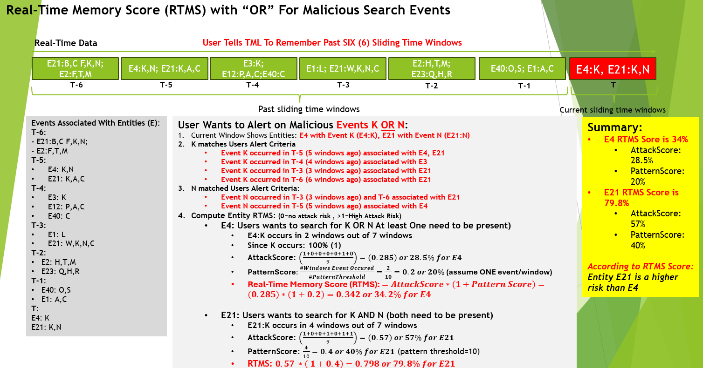
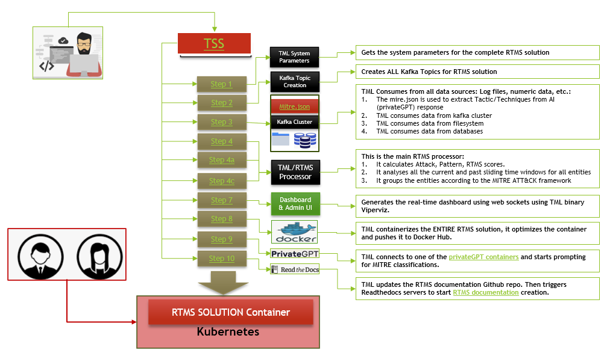

How TML Maintains Past Memory of Events Using Sliding Time Windows in Real-Time
============================================

.. tip::
   This capability is implemented in :ref:`STEP 4c: Preprocesing 3 Data: tml-system-step-4c-kafka-preprocess-dag`

.. note::
   While the Real-Time memory of sliding time windows (RTMS) is demonstrated for Cyber security, **it can be applied to any usecase in Retail, Finance, IoT, Energy, 
   Manufacturing etc..** Anytime you want to analyse TEXT files and determine if events have occured in the past and quantify their importance (or lack of 
   importance) then this is a powerful feature for you.  

   Also, if you want to **cross-reference TML machine learning output of every entity to text files** i.e. log files, and "remember" their behaviour then this 
   feature becomes very powerful for you. For example, you may be processing Entities in `Step 4 <https://tml.readthedocs.io/en/latest/tmlbuilds.html#step-4-preprocesing-data-tml-system-step-4-kafka-preprocess-dag>`_ and then want to determine if an entity is showing up in the logs or whether it is hacking in to your 
   company using a slow and "occasional" attempt over time to EVADE detection algorithms, then RTMS can be very powerful to detect this complex behaviour.

Importance of Real-Time Data and Cyber Crime
---------------------------

* The growth of **real-time data** according to IDC Research **will reach 30% of global data in 2025 or roughly 90 ZB or 90 trillion gigabytes** mainly from IoT devices connected to the Internet

* This raises concerns and opportunities to process real-time data with Transactional Machine Learning (TML)

* The major concern with real-time streaming data from connected devices is the risk of Cybersecurity attacks

* **Cyber crime is expected to cost the global economy $10.7 Trillion in 2025 and this number is growing**

* This makes Cyber crime prevention and mitigation a Top Priority for global organizations regardless of size

* TML presents a powerful method of detecting, mitigating and preventing cyber attacks at the entity level by “remembering” past events in past sliding time windows and quantifies this by computing three scores:

   * **Attack Score (AS):** Quantifies the attack vector.  Higher number, more likely attack is occurring
  
   * **Pattern Score (PS):** Quantifies the pattern vector.  Higher number, more likely a pattern in the attack
  
   * **Real-Time Memory Score (RTMS):** Combines both the Attack and Pattern Scores for an OVERALL score

The Method
-------------------

#. User tells TML to keep a memory of past sliding time windows

#. User wants TML to search for malicious events from each entity (i.e. IP address, devices, etc..)

#. Malicious events are TEXT like: “authentication failures”, “unknown password”, “unknown users”

#. TML does a direct STRING search for these terms in the sliding time windows
  
   .. note::
      THIS METHOD DOES NOT NEED A VECTOR DB or PRIVATEGPT only TML Processing– this makes TML method very light weight and fast

#. The Data TML searches, in real-time, are text files that are most likely log files 

#. The Log files can be files on the file system that TML reads OR logs that are directly streamed to Kafka with LogStash, Splunk, etc..
   
   .. note:: 
      Note: This data does NOT have to be any specific format – it can be ANY text file streamed in raw form.

#. As TML process these data in sliding time windows (for details on sliding time window go here: :ref:`TML Performs Entity Level Machine Learning and Processing`) it is computing in real-time the following Scores:

   #. **AttackScore** is computing the occurrence of malicious events in past windows and how likely this is an attack

   #. **PatternScore** uses a pattern threshold set by the users (we use 10 for demo) it counts the occurrence of  events (that user is searching for) in past windows

   #. **RTMS Score** simply combines the Attack and Pattern scores for an overall score.  

.. note:: 
   NOTE: RTMS can exceed 1 because the pattern score can be greater than 1 i.e. events can exceed user pattern threshold.
   These score will obviously fluctuate in real-time time and alerts can be set up to trigger ALARMS of a cyber attack.

High-Level Reference Architecture
-----------------------

.. important:: 

    **Some important points to note about the architecture below:**

    #. The TML RTMS solution can analyse ANY log file and AS MANY as you like
    #. You can use third-party tools like `LogStash <https://www.elastic.co/logstash>`_, `Splunk <https://www.splunk.com/>`_ etc.  to stream directly to Apache Kafka
    #. No format is needed for the log files - JUST STREAM IT TO KAFKA IN RAW FORM and tell TML in `Step 4c <https://tml.readthedocs.io/en/latest/tmlbuilds.html#step-4c-preprocesing-3-data-tml-system-step-4c-kafka-preprocess-dag>`_ what the Kafka Topic is in the **rtmsstream** JSON field.
    #.  You do NOT have to use Entities - you can immediately start analysing your log files for anomalies
    #. If you are using entities - start processing in `Step 4 <https://tml.readthedocs.io/en/latest/tmlbuilds.html#step-4-preprocesing-data-tml-system-step-4-kafka-preprocess-dag>`_ and connect the entities by specifying the topic you stored entities (in Step 4) to **raw_data_topic** in Step 4c.  Thats IT!
    #. Build as many TML RTMS solutions you want with the `TSS <https://tml.readthedocs.io/en/latest/docker.html#tml-solution-studio-tss-container>`_.

.. figure:: rtms3.png
   :scale: 70%

**Enjoy the POWER of TML RTMS solution - that integrates real-time ML/AI entity level predictions with text files (like log files) to protect your global organizations - UNLIKE ANY OTHER TECHNOLOGY IN THE MARKET.**

Past Memory Demonstration
-----------------------

.. important::
   **It is important to note the following about the Attack and Pattern scores:**

   * - **Pattern Score** will look for all occurrences of search terms in each sliding time window.  Meaning there may be MULTIPLE occurrences of search terms in the SAME sliding time window.  This number can be greater than 1.

     * - **Pattern score** will check the number of windows GOING BACK as far as **RTMSMAXWINDOWS** parameter in `STEP 1 <https://tml.readthedocs.io/en/latest/tmlbuilds.html#step-1-get-tml-core-params-tml-system-step-1-getparams-dag>`_.  

     * - So, if this number is 1000, TML will check all 1000 sliding time windows for the occurrence of the search terms.

     * - The **patternscorethreshold** can be set in `Step 4c <https://tml.readthedocs.io/en/latest/tmlbuilds.html#step-4c-preprocesing-3-data-tml-system-step-4c-kafka-preprocess-dag>`_.  This is the maximum occurrence of a pattern before raising an ALERT.  This means the **Pattern Score MAY BE GREATER THAN 1**.

   * - **Attack Score** ONLY checks if window CONTAINS AN OCCURENCE of the search term.  This number is either 1 or 0.  The attack score is GOING BACK as far as the **rememberpastwindows** parameter in `Step 4c <https://tml.readthedocs.io/en/latest/tmlbuilds.html#step-4c-preprocesing-3-data-tml-system-step-4c-kafka-preprocess-dag>`_.

   * - **User parameters:** `rememberpastwindows <https://tml.readthedocs.io/en/latest/tmlbuilds.html#step-4c-preprocesing-3-data-tml-system-step-4c-kafka-preprocess-dag>`_ and `RTMSMAXWINDOWS <https://tml.readthedocs.io/en/latest/tmlbuilds.html#step-1-get-tml-core-params-tml-system-step-1-getparams-dag>`_ are the core parameters that allows TML to **REMEMBER past events in real-time**.

.. figure:: rtms1.png
   :scale: 70%

TML Output of RTMS Scores
---------------

.. code-block:: JSON
            
      {
      	"hyperprediction": "0.00",
      	"Entity": "5.14",
      	"Maintopic": "iot-preprocess",
      	"Topicid": "topicid10_rtms-stream-mylogs",
      	"Topic": "rtms-stream-mylogs",
      	"Type": "External",
      	"ProducerId": "RTMS",
      	"TimeStamp": "2025-03-22 15:33:49",
      	"Unixtime": 1742657629034578889,
      	"kafkakey": "OAA-N1rvV8-f7VZLG0ZxwSJlqLDrrFmHs1",
      	"Preprocesstype": "rtms",
      	"SearchTextFound": [
      		"Message Found: m 84.102.20.2 () at Sun Jul 24 02:38:22 2005 Jul 24 02:38:23 combo ftpd16781: ANONYMOUS FTP LOGIN FROM 84.102.20.2  (anonymous) Jul 24 02:38:23 combo ftpd16782: ANONYMOUS FTP - using search term: anonymous ftp login. Date Found: 22 Mar 2025 15:33:37UTC",
      		"Message Found: MOUS FTP LOGIN FROM 84.102.20.2  (anonymous) Jul 24 02:38:23 combo ftpd16782: ANONYMOUS FTP LOGIN FROM 84.102.20.2  (anonymous) Jul 24 04:20:19 combo su(pam_unix)17283: - using search term: anonymous ftp login. Date Found: 22 Mar 2025 15:33:37UTC"
      	],
      	"FinalAttackScore": "0.00",
      	"FinalPatternScore": "0.07",
      	"RTMSSCORE": "0.00",
      	"NumAttackWindowsFound": "1",
      	"NumPatternWindowsFound": "2",
      	"Filename": "/rawdata/rtms2/rtms-stream-mylogs_10_anonymousftplogin.txt.log",
      	"TMLComment": "The RTMS score of 0.00 seems to show low activity or risk.  The AttackScore of 0.00 is less than PatternScore of 0.07, which suggests likely no attack, but could be a pattern developing.  The number of windows searched for an occurence of a pattern is 2. TML will continue monitoring and these numbers may change over time.",
      	"ActivityLevel": "Low",
      	"RememberPastWindows": "500",
      	"RTMSMAXWINDOWS": "1000",
      	"PatternThreshold": "30",
      	"SearchEntity": "ANONYMOUS FTP LOGIN;",
      	"PartitionOffsetFound": "0:9810;",
      	"Hash": "l8-ckFLfU4H5DveB9bSj7lThjws=",
      	"GithubRemoteUrl": "https://github.com/smaurice101/raspberrypitss/blob/main/tml-airflow/dags/tml-solutions/cybersecurityrtms-3f10/rtms2/rtms-stream-mylogs_10_anonymousftplogin.txt.log",
      	"rtmsfolder": "rtms2"
      }

Output Explanation
==========================

.. list-table::

   * - **Field**
     - **Explanation**
   * - hyperprediction
     - This is the RTMS Score
   * - Entity
     - This is the entity being analysed.  This can be 

       anything you want.
   * - GithubRemoteUrl
     - This is the GitHub Url for te RTMS solution output 
      
       specific to your TML solution.  All RTMS outputs are 

       logged to Github automatically AND to Kafka topic.

       The log files are important for testing and validation.

   * - Maintopic
     - This is the topic that holds the entity

       preprocessing from `Step 4 <https://tml.readthedocs.io/en/latest/tmlbuilds.html#step-4-preprocesing-data-tml-system-step-4-kafka-preprocess-dag>`_
   * - Topicid
     - TML gives entity an internal integer ID.
 
       This entity (192.168.5.24) has an internal

       ID of 17. The format is the:
   
       **topicid<internal entity number>_<name of RTMS topic searched>**
   * - Topic
     - The RTMS topic searched - containing TEXT
   * - Type
     - Internal label
   * - ProducerId
     - Internal label
   * - TimeStamp
     - The time results were generated.
   * - Unixtime
     - The Unixtime of TimeStamp
   * - kafkakey
     - Unique key for this JSON in Kafka.

       If you want to audit these results 

       these keys identify each message uniquely.
   * - Preprocesstype
     - Type is **rtms**
   * - UserSearchValues
     - These are the user search values. See tip below.
   * - SearchTextFound
     - This is list of text that was found in the 
 
       the Text files (log files) that contain your 

       search terms.  The list is truncated to 3000.
  
       But, this will give you a good indication of
 
       whats happening.
   * - FinalAttackScore
     - The Final attack score
   * - FinalPatternScore
     - The final pattern score
   * - hash
     - Unique internal message hash
   * - RTMSSCORE
     - The RTMS score.
   * - NumAttackWindowsSearched
     - The number of attack windows that contain the search
     
       terms.  This is upto **RememberPastWindows**
   * - NumPatternWindowsSearched
     - This the number of windows that contain the search terms.

       Note: This in not restricted to RememberPastWindows, but

       upto **RTMSMAXWINDOWS** in `Step 1 <https://tml.readthedocs.io/en/latest/tmlbuilds.html#step-1-get-tml-core-params-tml-system-step-1-getparams-dag>`_ 
    
       JSON field.
   * - Filename
     - This is a file of these results saved to:
     
       **/rawdata/rtms** folder in the container.
   * - TMLComment
     - This is the suggested auto-generated TML comment.
   * - ActivityLevel
     - Based on the RTMS score this is what TML suggests.
   
       You can ofcourse use your own judgement.
   * - RememberPastWindows
     - TML will remember the sliding windows upto
 
       this number.
   * - PatternThreshold
     - This is a user threshold to alert when a pattern

       is equal to or greater than this number.
   * - privateGPT_AI_response
     - This is the real-time response from the privateGPT container 

       running LLM models from Deepseek or Mistral AI.

       See `here <https://tml.readthedocs.io/en/latest/genai.html#privategpt-special-containers>`_ for details.
   * - prompt
     - The prompt provided by the user.
   * - context
     - The context provided by the user.
   * - pgptcontainer
     - The privateGPT container used from `here <https://tml.readthedocs.io/en/latest/genai.html#privategpt-special-containers>`_.
   * - pgpt_consumefrom
     - The kafka topic that Step 9 task will consume from.
   * - pgpt_data_topic
     - The kafka topic Step 9 task will output results to.
   * - contextwindowsize
     - The context window for the LLM.  This is basically

       the maximum number of words LLM will process.
   * - temperature
     - This is the LLM temperature parameter.  

       Close to 0, the LLM will be more conservative 
    
       in responses; close to 1, it will hallucinate.
   * - pgptrollbackoffset
     - The amount of offsets to rollback the **pgpt_consumefrom** topic.

.. tip:: 
   TML gives you are powerful capability to substiitute the **--entity--** placeholder with the **Entity** above. This makes it possible to search for each invidual entity in any log files.

.. note:: 
   If you DO NOT want to use entities simply set the **'raw_data_topic'** to an empty string ('') in `Step 4c <https://tml.readthedocs.io/en/latest/tmlbuilds.html#step-4c-preprocesing-3-data-tml-system-step-4c-kafka-preprocess-dag>`_.  This will force TML to search ONLY the TEXT file topics for your search terms.

How TML Accomodates Evolving Threats
-------------------------

To detect evolving or changing cyber threats, TML can apply new user search terms in real-time by reading a local file containing search terms.  For example, you can tell TML to read a file containing search terms that are updated every every 30 seconds, or every day, by user's internal process. TML can read this file, and update the search terms immediately to this list.  This allows users to auto-update the threats that TML search for in real-time.

To update the search terms in real-time - you need to update two fields in `Step 4c: <https://tml.readthedocs.io/en/latest/tmlbuilds.html#step-4c-preprocesing-3-data-tml-system-step-4c-kafka-preprocess-dag>`_

#.   **localsearchtermfolder**: 
     - Specify a folder of files containing search terms - each term must be on a new line
     - use comma to apply each folder to the rtmstream topic
     - Use @ =AND, | =OR to specify whether the terms in the file should be AND, OR

       For example, @mysearchfolder1,|mysearchfolder2, means all terms in mysearchfolder1 should be AND |mysearchfolder2, means all search terms should be OR'ed

       .. important::
          **The search folders must exist in the local folder mapped to the /rawdata folder**.  For example, if you specify mysearchfolder1, TML assumes the search files are in /rawdata/mysearchfolder1 (see `here for details <https://tml.readthedocs.io/en/latest/tmlbuilds.html#producing-data-using-a-local-file>`_).

#. **localsearchtermfolderinterval**:
   - This is the number of seconds between reading the localsearchtermfolder.  
   
      For example, if 30, the files will be read every 30 seconds - and searchterms will be updated

.. tip::
   You can use RegEX statements in the search terms.  This allows you to do build powerful RegEx expressions to filter log files.

   If using Regex expressions, you must prefix the expression by **rgx:**.  For example, **rgx:p([a-z]+)ch**

   Regex expressions should be the only statement between ~, this is important if your Regex has a comma.  

   With Regular expressions applied in real-time by TML RTMS, you have a MUCH WIDER search space to detect anomalous behaviours.

Regular Expressions Example
-------------------

**To check whether usernames DO NOT follow the proper format in the log files - you can use:**

.. code-block::

   ^[0-9A-Za-z]{6,16}$

* ^ indicates the start of a string, while $ indicates the end. Basically, this is ensuring that the entire string follows our rules, rather than only a subset of the string.
* [...] indicates a particular set of valid characters, otherwise called a character class; 0-9 allows numbers, A-Z allows uppercase letters, a-z allows lowercase. There are other indicators, and you can find a complete list in regex documentation.
* {6,16} indicates the allowed number of characters. If you just used {6}, you're testing for a length of exactly 6, while {6,} tests for minimum length.
* ^ denotes NOT or a negation of the results.  For example, any characters NOT satisfying **[0-9A-Za-z]{6,16}**

**To check whether passwords DO NOT follow the proper format (or any string) - you can use:**

.. code-block::

   ^(?=.*?[0-9])(?=.*?[A-Za-z]).{8,32}$

* (...) is a capture group. You can use them for capturing particular characters in specific orders.
* ?= is a positive lookahead. The search moves rightward through the string from the location in your regex you make this assertion in.
* . signifies any character is possible, while * means 'zero or more' of them.
* The extra question mark in ?=.*? makes the search lazy, which essentially means 'stop looking after the first time this requirement is met'.
* Translated into plain English, the first part of our statement ^(?=.*?[0-9]) means 'from the start of the string, find a number that is preceded by zero or more of any character'.
* Adding (?=.*?[A-Za-z]) means do the same for any letter, or 'from the start of the string, find a letter that is preceded by zero or more of any character'. This allows us to confirm the presence of a specified kind of character within the total set of what is allowed without regard to where it occurs in the string.
* The last part of our statement .{8,32}$ builds on our understanding of . usage. We don't want to limit what kinds of characters the actual password is allowed to be. In contrast, if limiting to letters and numbers only, you'd use [0-9A-Za-z]{8,32}$.

.. code-block::
   
   192\.168\.(224|225)\.\d{1,3}

* Values in yellow—192 and 168—are literal strings to be matched.
* Because the "." character is reserved in the regular expression language, to match a literal ".", you must escape it with a backslash . in your pattern definition.
* The 3rd octet needs to match either "224" or "225" and regex allows that with the "|" character. The OR pattern is bound in parentheses (). If there are more than two selections, | can be used to separate additional values: (224|225|230).
* The "\d" represents a single digit (0-9). In the rex command example, above, I used a "+" to represent one or more of the preceding pattern. In this case, I am going to be more specific. Placing "1,3" in curly braces {1,3}, represents between 1 and 3 digits, since it was preceded by a "\d". 

.. code-block::

   (?<pass>[^&]+)

* ?<pass> specifies the name of the field that the captured value will be assigned to. In this case, the field name is "pass". This snippet in the regular expression matches anything that is not an ampersand.
* The square brackets [^&]+ signify a class, meaning anything within them will be matched; the carat symbol (in the context of a class) means negation. So, we're matching any single character that is not an ampersand.
* The plus sign extends that single character to one or more matches; this ensures that the expression stops when it gets to an ampersand, which would denote another value in the form_data.
* The parenthesis () signifies a capture group, while the value captured inside is assigned to the field name.

.. code-block::

   4[0-9]{15}

* This describes a string pattern starting with the digit 4 and having 15 digits in total that can have values from 0 to 9.

.. code-block::

   4[0-9]{12}(?:[0-9]{3})?

* This is relevant for strings that begin with the digit 4 and have 12 more digits with possible values from 0 to 9. 
* After this sequence, a string can have or not have three more digits with values from 0 to 9. Thus, we can find not only credit card numbers with 16 digits but those with 13 digits as well.

.. code-block::

   \S+@\S+\.\S+

* A sequence of symbols without spaces before the @ symbol
* The @ symbol
* A sequence of symbols without spaces after the @ symbol
* A . symbol
* A sequence of symbols without spaces

.. code-block::

   (?:[a-z0-9!#$%&'*+\/=?^_`{|}~-]+(?:\.[a-z0-9!#$%&'*+\/=?^_`{|}~-]+)*|"(?:[\x01-\x08\x0b\x0c\x0e-\x1f\x21\x23-\x5b\x5d-\x7f]|\\[\x01-\x09\x0b\x0c\x0e- 
   \x7f])*")@(?:(?:[a-z0-9](?:[a-z0-9-]*[a-z0-9])?\.)+[a-z0-9](?:[a-z0-9-]*[a-z0-9])?|\[(?:(?:25[0-5]|2[0-4][0-9]|[01]?[0-9][0-9]?)\.){3}(?:25[0-5]|2[0-4][0-9]| 
   [01]?[0-9][0-9]?|[a-z0-9-]*[a-z0-9]:(?:[\x01-\x08\x0b\x0c\x0e-\x1f\x21-\x5a\x53-\x7f]|\\[\x01-\x09\x0b\x0c\x0e-\x7f])+)\])

**This regular expression is also relevant for strings that have an email address format but includes additional bypasses, cycles, and filters. Here’s a description of several constructions used in this RegEx:**

* (?:) — Makes a grouping that cannot be referenced
* [a-z] — Sets possible options for characters
* ? — Makes the expression optional
* \| — Sets alternation of two expressions on the left and right side of |
* \* — Means that an expression matches zero or more of the preceding character

.. code-block::

   (([0-9]{1,4})\)([ .-]?)([0-9]{1,4})([ .-]?)([0-9]{1,4})

* It describes a line in the (####)%####%#### format, where #### could be a sequence from one to four digits, and the % symbol stands for one of three possible separation symbols: space, dot/period, or hyphen.

.. code-block::

   [a|b|c|d|e|f|g|h|i|j|k|l|m|n|o|p|q|r|s|t|u|v|w|x|y|z]+-?[a|b|c|d|e|f|g|h|i|j|k|l|m|n|o|p|q|r|s|t|u|v|w|x|y|z]*

* A RegEx to search for matches with one of the symbols listed in square brackets and divided by the | symbol that represents an alternative for matching the part to the left and the part to the right of the | symbol. An alternative will include options from a to z.

A RegEx that points directly to a capture group:

.. code-block::

   \w+-?\w*

* RegEx examples that work with capture groups — mechanisms that allow you to highlight and save matching text for further use. When a RegEx matches the text, any content within a capture group is saved in temporary variables. You can use those variables later in code.

Link to a capture group (marked as \w):

.. code-block::

   \w+-?1*
 
* A RegEx that includes a link to capture group №1:

RegEx Cheat Sheets
--------------------

Here are RegEx cheat sheets that may help to write more advanced regular for powerful searching of text files.

.. tip::
   To test your RegEx you can use this onine tool: `regexr <https://regexr.com/>`_

.. figure:: regex.png
   :scale: 70%

.. figure:: regex2.png
   :scale: 70%

TML Real-Time Message Scoring (RTMS) vs AI RAG
------------

TML using real-time data is similar to `RAG <https://tml.readthedocs.io/en/latest/genai.html#tml-and-rag-a-powerful-combination>`_ but different in other ways.

.. list-table::

   * - **Attribute**
     - **TML RTMS**
     - **AI RAG**
   * - **Speed**
     - TML RTMS is much faster than RAG 

       because TML RTMS does NOT use vector DB.

       All TML RTMS processing is real-time.
     - AI RAG require vector DB for search. 

       Real-time is still difficult with RAG.
   * - **Prompting**
     - TML users direct text based search
     - With RAG you can use prompt
   * - **Combining ML and AI in Real-Time**
     - With TML you can combine TML output

       for each entity and cross-reference 

       with TEXT files
     - This is not currently possible with
       RAG       
   * - **Scalability**
     - TML RTMS scales with Kubernetes

       to process unlimited documents

       at a very low cost
     - Scaling RAG models is difficult

       and can be costly

How RTMS Integrates with MITRE ATT&CK Framework
----------------------------------------------

The `MITRE ATT&CK framework for the Entreprise, Mobile and ICS (Industrial Control Systems) <https://attack.mitre.org/>`_ is used by `80% of global enterprises <https://cltc.berkeley.edu/publication/mitre-attck/#:~:text=While%20some%20enterprises%20adopt%20other,respondents%20indicating%20they%20leverage%20both.>`_.  **TML/RTMS is fully integrated with MITRE ATT&CK framework for Entreprise, Mobile and ICS** level threat detection and classification for improved threat insights to help in further fortifying organizations' threat and security technologies and processes.

.. important::
   A key challenge by majority of organizations is the difficulty and inability to map events to specifc MITRE ATT&CK tactics and techniques.  Specifically, in a research report (`source <https://cltc.berkeley.edu/publication/mitre-attck/#:~:text=While%20some%20enterprises%20adopt%20other,respondents%20indicating%20they%20leverage%20both.>`_)

    **"about 45 percent of survey respondents said their greatest challenge is the framework’s inoperability with their security products and 43 percent said they 
    find it difficult to map event-specific data to tactics and techniques."**

   RTMS eliminates this challenge of mapping events to MITRE ATT&CK tactics and techniques by automating the classifications in real-time using our AI containers.

When RTMS searches logs for suspicious activity the messages it finds are sent to our `privateGPT AI container <https://tml.readthedocs.io/en/latest/genai.html#privategpt-special-containers>`_, the AI determines a mitigation plan, and MITRE ATT&CK classification of the messages.  The Attack, Pattern and RTMS scores are provided for the "grouped" MITRE ATT&CK tactics and techniques.  See figure below of Mitre tactics and techniques.

   

**The RTMS scoring and classification of messages, in accordance with MITRE ATT&CK framework, can offer organizations around the world invaluable insights into their organizations that can help them to:**

 - **determine gaps in deployed security solutions in their enterprise,** 
 -	**for security policy implementation**
 -	**for threat modeling**

TML/RTMS with MITRE ATT&CK integration is a truly unique and powerful technological approach, in real-time, to give organizations **faster identifications of developing threats, but also offering invaluable guidance to fortify their security processes and technologies** that aligns with a global standard like MITRE ATT&CK.

.. tip::
   The MITRE ATT&CK JSON used by RTMS for cross-referencing with AI output is `here <https://github.com/smaurice101/raspberrypi/blob/main/tml-airflow/data/mitre.json>`_

.. note::
   An example of this classification is `here <https://tml.readthedocs.io/en/latest/rtms.html#integrating-rtms-with-real-time-ai-using-privategpt-containers-and-mitre-att-ck-classification>`_.  Look at the last JSON fields:
  
   * **"tactic":** "Initial_Access",
   * **"technique":** "Phishing"

   **The above are MITRE ATT&CK tactic and technique, that are automatically classified by RTMS AI agent for all messages.**  RTMS further groups on these tactic and techniques to compute the **grouped ATTACK, PATTERN and RTMS scores**.  This is a powerful approach to further help organization's fortify their security processes and technologies to dramatically reduce the threat of cyber attacks.

Integrating RTMS with Real-Time AI Using PrivateGPT Containers and MITRE ATT&CK Classification
-----------------

Below is output from `Step 9 task <https://tml.readthedocs.io/en/latest/tmlbuilds.html#step-9-privategpt-and-qdrant-integration-tml-system-step-9-privategpt-qdrant-dag>`_, that takes messages in the "SearchTextFound", and send it to the `PrivateGPT special containers <https://github.com/smaurice101/readthedocs/blob/main/docs/source/genai.rst#privategpt-special-containers>`_

By using AI, users can prompt for any anomalies and resolutions suggested by AI.  This is all done in real-time using local privateGPT containers, that makes this integration 100% FREE, SECURE and SCALABLE. 

RTMS Grouped MITRE ATT&CK JSON
"""""""""""""""""""""""""""""""

RTMS automatically classified the messages in accordance with `MITRE ATT&CK classification matrix <https://attack.mitre.org/>`_:

 - **TACTIC**: Credential_Access-Initial_Access
 - **TECHNIQUE**: Brute_Force

.. code-block::

      {
      	"hyperprediction": "0.258",
      	"Topic": "rtms-pgpt-ai",
      	"Type": "External",
      	"ProducerId": "iotsolution",
      	"TimeStamp": "2025-04-02 16:33:07",
      	"Unixtime": 1743611587347966363,
      	"kafkakey": "OAA-0t2TfpR9ztCudMuj2vj00nSQiq4kVE",
      	"Preprocesstype": "Avg",
      	"PreprocessIdentifier": "Mitre ATTCK",
      	"Numberofmessages": 4,
      	"tactic": "Credential_Access-Initial_Access",
      	"technique": "Brute_Force",
      	"Maintype": "RTMSSCORE",
      	"Mainvalue": "0.258",
      	"Entity": "5.10,5.14,6.100",
      	"PartitionOffsetFound": "0:6092:0:6093:0:6094:0:6095:0:6096:0:6097:0:6098:0:6099:0:6100:0:6101:0:6102:0:6103:0:6104:0:6105:0:6106:0:6107:0:6108:0:6109:0:6110:0:6111:0:6112:0:6113:0:6114:0:6115:0:6116:0:6117:0:6118:0:6119:0:6120:0:6121:0:6122:0:6123:0:6124:0:6125:0:6126:0:6127:0:6128:0:6129:0:6130:0:6131:0:6132:0:6133:0:6134:0:6135:0:6136:0:6137:0:6138:0:6139:0:6140:0:6141:0:6142:0:6143:0:6144:0:6145:0:6146:0:6147:0:6148:0:6149:0:6150:0:6151:0:6152:0:6153:0:6154:0:6155:0:6156:0:6157:0:6158:0:6159:0:6160:0:6161:0:6162:0:6260:0:6261:0:6262:0:6263:0:6264:0:6266:0:6267:0:6268:0:6269:0:6270:0:6271:0:6272:0:6273:0:6274:0:6275:0:6276:0:6277:0:6278:0:6279:,0:7772:0:7777:0:7779:0:7780:0:7782:0:7784:0:7785:0:7786:0:7787:0:7788:0:7789:0:7790:0:7791:0:7792:0:7793:0:7802:0:7803:0:7805:0:7806:0:7807:0:7808:0:7810:0:7811:0:7812:0:7813:0:7814:0:7815:0:7816:0:7817:0:7818:0:7819:0:7820:0:7821:0:7822:0:7823:0:7824:0:7825:0:7826:0:7827:0:7828:0:7829:0:7830:0:7831:0:7832:0:7833:0:7834:0:7835:0:7836:0:7837:0:7838:0:7839:0:7840:0:7841:,0:7772:0:7773:0:7774:0:7775:0:7776:0:7777:0:7778:0:7779:0:7780:0:7781:0:7782:0:7783:0:7784:0:7785:0:7786:0:7787:0:7788:0:7789:0:7790:0:7791:0:7792:0:7793:0:7794:0:7795:0:7796:0:7797:0:7798:0:7799:0:7800:0:7801:0:7802:0:7803:0:7804:0:7805:0:7806:0:7807:0:7808:0:7809:0:7810:0:7811:0:7812:0:7813:0:7814:0:7815:0:7816:0:7817:0:7818:0:7819:0:7820:0:7821:0:7822:0:7823:0:7824:0:7825:0:7826:0:7827:0:7828:0:7829:0:7830:0:7831:0:7832:0:7833:0:7834:0:7835:0:7836:0:7837:0:7838:0:7839:0:7840:0:7841:0:7943:0:7944:0:7945:0:7946:0:7947:0:7949:0:7950:0:7951:0:7952:0:7953:0:7954:0:7955:0:7956:0:7957:0:7958:0:7959:0:7960:0:7961:0:7962:0:7965:0:7966:0:7967:0:7968:0:7971:0:7972:0:7973:0:7974:0:7975:0:7976:0:7977:0:7979:0:7980:0:7983:0:7984:0:7985:0:7986:0:7987:0:7991:0:7997:0:7998:0:7999:0:8000:0:8002:0:8003:0:8004:0:8007:0:8008:",
      	"NumAttackWindowsFound": "5,4,3",
      	"NumPatternWindowsFound": "988,367",
      	"SearchEntity": "|authentication failure:--entity-- password failure:,Failed password for root:",
      	"rtmsfolder": "rtms2",
      	"CurrentRTMSMAXWINDOW": "14,13,18,19",
      	"Maintopic": "rtms-pgpt-ai-mitre"
      }

**Note in the below JSON from RTMS:**
 #. **RTMS has found three IP addreses:** 5.10,5.14,6.100 (add prefix 192.168 in front of 5.10, 5.14, 6.100)
 #. These three entities are using a **Brute Force** attack
 #. The **Maintype=RTMSScore** and **Mainvalue=0.258** - this is the average score for the three entities. See `here <https://tml.readthedocs.io/en/latest/rtms.html#past-memory-demonstration>`_ from more details.
 #. The source Kafka topic that RTMS is consuming from is: **rtms-pgpt-ai**
 #. The sink Kafka topic that RTMS produces the results to is: **rtms-pgpt-ai-mitre**
 #. The messages that are found are in the **PartitionOffsetFound**
 #. The **hyperprediction**: "0.258" is the same as Mainvalue
 #. **NumAttackWindowsFound**: "5,4,3", are the number of sliding time windows RTMS is searching
 #. **NumPatternWindowsFound**: "988,367", are the number of occurences of the messages that match the search terms
 #. **SearchEntity**: "|authentication failure:--entity-- password failure:,Failed password for root:", these are the search terms
 #. **rtmsfolder**: "rtms2", this is a local folder as well as Github folder and Kafka topic, where results are saved
 #. **CurrentRTMSMAXWINDOW**: "14,13,18,19", this the current RTMS pattern window.

RTMS MITRE ATT&CK Dashboard
--------------------------

This is a simple out-of-the-box dashboard to give users a quick view in to RTMS output grouped entity classifications in accordance with ATT&CK.

RTMS Solution: Steps to Run It Yourself 
--------------------------

Below shows the RTMS solutions architecture.  We can now discuss in details how users and can build and run this RTMS solution.

.. note::
   The entire RTMS solution is built using the `TSS <https://tml.readthedocs.io/en/latest/docker.html>`_ using the solution dag:

    - `solution_preprocessing_ai_dag-cybersecurityrtms-3f10 <https://github.com/smaurice101/raspberrypitss/blob/main/tml-airflow/dags/tml-solutions/cybersecurityrtms-3f10/solution_template_processing_ai_dag-cybersecurityrtms-3f10.py>`_

.. tip:: 

   There are TWO ways to run this RTMS solution for yourself:

    #. Copy to your repo and run in your TSS environment.  To do this you MUST:
     - `Follow these Steps to copy projects from others repo <https://tml.readthedocs.io/en/latest/usercopy.html#you-want-to-copy-specific-tml-projects-from-another-users-git-repo>`_
     .. code-block:

          https://github.com/smaurice101/raspberrypitss,cybersecurityrtms-3f10

    #. Run the `RTMS Docker container <https://hub.docker.com/r/maadsdocker/cybersecurityrtms-3f10-ai-amd64>`_:  This is the **EASIEST** and FASTEST way for anyone to run this solution in test or production.  Note you can also scale this solution with Kubernetes - `all YAML scripts are auto generated for you here <https://cybersecurityrtms-3f10-ai.readthedocs.io/en/latest/kube.html#scaling-cybersecurityrtms-3f10-ai-with-kubernetes>`_.  
       - `Go here to het the Docker Run command for RTMS <https://cybersecurityrtms-3f10-ai.readthedocs.io/en/latest/operating.html#your-solution-docker-run-command>`_
       - **You MUST change the following environmental variables in the Docker Run Command:**
         #. Change **-\-\env GITUSERNAME=**<Enter Github Username> (For quick testing use: **tsstmldemo**)
         #. Change **-\-\env GITREPOURL=**<Enter Github Repo URL> (For quick testing use: **https://github.com/tsstmldemo/tsstmldemo**)
         #. Change **-v /your_localmachine/foldername:/rawdata:z** 
            - create a folder in your local machine and mapped it here.  For example, if you are in Linux, create a folder /rtms/rawdata, then the volume mapping is **-v /rtms/rawdata/foldername:/rawdata:z**
            - Create TWO folders and store your Log files in there: (Get sample log files from `here <https://github.com/smaurice101/raspberrypi/tree/main/tml-airflow/data>`_ if you like)
              - /rtms/rawdata/mylogs
              - /rtms/rawdata/mylogs2
            - Create TWO folders and store your search terms in there: (Get sample search files from `here <https://github.com/smaurice101/raspberrypi/blob/main/tml-airflow/data/searchdoc.txt>`_ if you like)
              - /rtms/rawdata/mysearchfile1
              - /rtms/rawdata/mysearchfile1
         #. Change **--env READTHEDOCS='<Enter Readthedocs token>'** ((For quick testing use: **'aefa71df39ad764ac2785b3167b77e8c1d7c553a'**)
           - This will create new solution documentation that can be found here: `https://cybersecurityrtms-aefa-ai.readthedocs.io/en/latest/ <https://cybersecurityrtms-aefa-ai.readthedocs.io/en/latest/>`_

Now that you know the basic setup to run the RTMS solution - just change it with your own files and folders...as you want!

RTMS Solution Architecture
-------------------------

Here is a description of the solution architecture:

.. list-table::

   * - **TSS Steps**
   * - **Description**
   * - `Step 1 <https://github.com/smaurice101/raspberrypitss/blob/main/tml-airflow/dags/tml-solutions/cybersecurityrtms-3f10/tml_system_step_1_getparams_dag-cybersecurityrtms-3f10.py>`_   
     - Gets all the RTMS TML system parameters and setups up the components of the entire solution.
   * - `Step 2 <https://github.com/smaurice101/raspberrypitss/blob/main/tml-airflow/dags/tml-solutions/cybersecurityrtms-3f10/tml_system_step_2_kafka_createtopic_dag-cybersecurityrtms-3f10.py>`_   
     - Creates all the Kafka topics needed for the solution to run.
   * - `Step 3 <https://github.com/smaurice101/raspberrypitss/blob/main/tml-airflow/dags/tml-solutions/cybersecurityrtms-3f10/tml_read_LOCALFILE_step_3_kafka_producetotopic_dag-cybersecurityrtms-3f10.py>`_   
     - TML Consumes from all data sources: Log files, numeric data, etc.:
       - The mire.json is used to extract Tactic/Techniques from AI (privateGPT) response
       - TML consumes data from kafka cluster
       - TML consumes data from filesystem
       - TML consumes data from databases
   * - `Step 4 <https://github.com/smaurice101/raspberrypitss/blob/main/tml-airflow/dags/tml-solutions/cybersecurityrtms-3f10/tml_system_step_4_kafka_preprocess_dag-cybersecurityrtms-3f10.py>`_   
     - **This is the main Entity processor:**
       - It processes entity data that is then by the RTMS Step 4c         
   * - `Step 4a <https://github.com/smaurice101/raspberrypitss/blob/main/tml-airflow/dags/tml-solutions/cybersecurityrtms-3f10/tml_system_step_4a_kafka_preprocess_dag-cybersecurityrtms-3f10.py>`_   
     - It groups the entities according to the MITRE ATT&CK framework
   * - `Step 4c <https://github.com/smaurice101/raspberrypitss/blob/main/tml-airflow/dags/tml-solutions/cybersecurityrtms-3f10/tml_system_step_4c_kafka_preprocess_dag-cybersecurityrtms-3f10.py>`_   
     - **This is the main RTMS processor:**
       - It calculates Attack, Pattern, RTMS scores
       - It analyses all the current and past sliding time windows for all entities
   * - `Step 7 <https://github.com/smaurice101/raspberrypitss/blob/main/tml-airflow/dags/tml-solutions/cybersecurityrtms-3f10/tml_system_step_7_kafka_visualization_dag-cybersecurityrtms-3f10.py>`_   
     - This generates the dashboard and connects to the `Viperviz binary <https://tml.readthedocs.io/en/latest/usage.html#tml-components-three-binaries>`_.
   * - `Step 8 <https://github.com/smaurice101/raspberrypitss/blob/main/tml-airflow/dags/tml-solutions/cybersecurityrtms-3f10/tml_system_step_8_deploy_solution_to_docker_dag-cybersecurityrtms-3f10.py>`_   
     - This step containerizes the entire RTMS solution, while optimizig it, and pushes it to `Docker hub <https://hub.docker.com/r/maadsdocker/cybersecurityrtms-3f10-ai-amd64>`_
   * - `Step 9 <https://github.com/smaurice101/raspberrypitss/blob/main/tml-airflow/dags/tml-solutions/cybersecurityrtms-3f10/tml_system_step_9_privategpt_qdrant_dag-cybersecurityrtms-3f10.py>`_   
     - This connects to the `privateGPT containers <https://tml.readthedocs.io/en/latest/genai.html#privategpt-special-containers>`_ and RTMS sends the filtered messages to privateGPT for MITRE ATT&CK classifications.  The mitre.json is used to extract the `MITRE classification <https://github.com/smaurice101/raspberrypi/blob/main/tml-airflow/data/mitre.json>`_ from the privateGPT responses.  **Note, the mitre.json should be saved in your local folder mapped to /rawdata**
   * - `Step 10 <https://github.com/smaurice101/raspberrypitss/blob/main/tml-airflow/dags/tml-solutions/cybersecurityrtms-3f10/tml_system_step_10_documentation_dag-cybersecurityrtms-3f10.py>`_   
     - This updates the RTMS documentation in the Github repo and triggers Readthedocs site to start generating the RTMS documentation. To find your documentation see `here <https://tml.readthedocs.io/en/latest/tmlbuilds.html#step-10-create-tml-solution-documentation-tml-system-step-10-documentation-dag>`_

Summary
----------

* This has shown how TML implements real-time memory using sliding time windows for every entity

* For every entity: It quantified this memory in Three (3) scores:
  
  * **AttackScore (AS)**
  * **PatternScore (PS)**
  * **Real-Time Memory Score (RTMS)**

.. important::
   The power of TML maintaining memory and computing the 3 scores is to capture **attacker behaviours that try to EVADE detection algorithms**.  While the AttackScore may not indicate an attack, it may be picked up as a pattern in the PatternScore.  

  Also, TML/RTMS solution will automatically classify (using AI) messages in accourdance with the `Mitre Att&ck framework matrix for the Enterprise <https://attack.mitre.org/>`_. 

  The Mitre Att&ck classifications could provide tremendous help for Enterprises to:
   - determine gaps in deployed security solutions in their enterprise,  
   - improve security policy implementation
   - improve threat modeling.

* Within Cyber security context: The power of this method using sliding time windows is the ability to detect hacking attempts that are deliberate in evading “detection algorithms” from common industry tools

* TML approach and method is a fast, low cost, method of maintaining memory of events as they occur or have occurred in the past that may be “occasional” events and VERY HARD TO DETECT from other commercial tools

* The simplicity of maintaining and incorporating memory by TML for EVERY ENTITY- without the need to vector DB – makes it lightweight, fast, and able to run WITHOUT the need for GPU (only CPU is needed)

* As attackers get more sophisticated in evading commercial algorithms’ detection methods – TML memory offers a continuous awareness of events that are current and have occurred in the past and correlates and quantifies these in a Score for triggering alerts and alarms immediately
