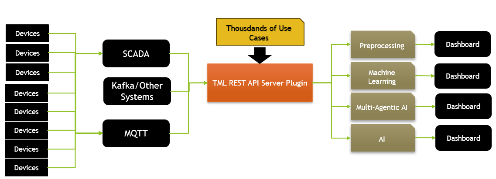
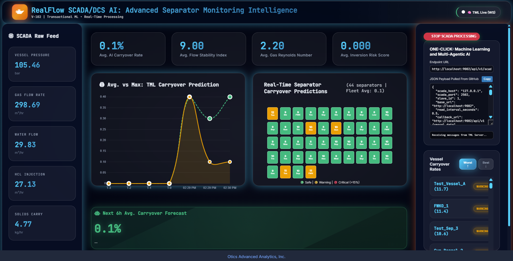

===================================
TML REST API Endpoints and Examples
===================================

This service exposes endpoints to create topics, preprocess data, run machine learning pipelines, generate predictions, and consume data from topics through the Viper backend.

TML Server Plugin Container
----------------------

Before you can use the TML Server Plugin you need to :ref:`RUN The TML Server Plugin Container`:

.. list-table::

   * - **TML Server Plugin Container**
   * - `Windows/Linux Users <https://hub.docker.com/r/maadsdocker/tml-server-v1-plugin-3f10-ml_agenticai_restapi-amd64>`_

Reference Architecture
----------------------

Below is a reference architecture of the powerful capabilities of controlling the TML Server remotely using a REST API

.. figure:: tmlpluginarch.png
   :scale: 70%

TML API Quick Reference
=========================

See `TML Endpoint Examples <https://tml.readthedocs.io/en/latest/tmlapi.html#tml-endpoint-example>`_

API For Kafka Topic Creation
-------------------------------

- ``POST /api/v1/createtopic`` - [`click <https://tml.readthedocs.io/en/latest/tmlapi.html#post-api-v1-createtopic>`_] Create Kafka topics (`topics`, `numpartitions`) → 200,400

API For Preprocessing / ML / Predictions
-------------------------------

- ``POST /api/v1/preprocess`` - [`click <https://tml.readthedocs.io/en/latest/tmlapi.html#post-api-v1-preprocess>`_] Data preprocessing (`step=4|4c`, `rawdatatopic`) → 200,400  
- ``POST /api/v1/ml`` - [`click <https://tml.readthedocs.io/en/latest/tmlapi.html#post-api-v1-ml>`_] Train ML models (`step=5`, `trainingdatafolder`) → 200,400
- ``POST /api/v1/predict`` - [`click <https://tml.readthedocs.io/en/latest/tmlapi.html#post-api-v1-predict>`_] Run predictions (`step=6`, `pathtoalgos`) → 200,400

API For AI and Agentic AI
-------------------------------

- ``POST /api/v1/ai`` - [`click <https://tml.readthedocs.io/en/latest/tmlapi.html#post-api-v1-ai>`_] Run LLM AI Analysis (`step=9`, `pgpt-model`) → 200,400
- ``POST /api/v1/agenticai`` - [`click <https://tml.readthedocs.io/en/latest/tmlapi.html#post-api-v1-agenticai>`_] Run Agentic AI Analysis (`step=9b`, `ollama-model`) → 200,400

API For Reading or Consuming Data From Kafka Topics
-------------------------------

- ``POST /api/v1/consume`` - [`click <https://tml.readthedocs.io/en/latest/tmlapi.html#post-api-v1-consume>`_] Consume messages (`topic`, `forwardurl`) → 200,400,500

API For Writing or Producing Raw Data to Kafka Topics
-------------------------------

- ``POST /api/v1/jsondataline`` - [`click <https://tml.readthedocs.io/en/latest/tmlapi.html#post-api-v1-jsondataline>`_] Send single JSON → 200
- ``POST /api/v1/jsondataarray`` - [`click <https://tml.readthedocs.io/en/latest/tmlapi.html#post-api-v1-jsondataarray>`_] Send JSON array → 200
- ``POST /api/v1/external_payload`` - [`click <https://tml.readthedocs.io/en/latest/tmlapi.html#post-api-v1-jsondataarray>`_] Send JSON array → 200

Industrial API For Ingesting Data From SCADA and MQTT
-----------------------------------------------------

See :ref:`TML Processing Using SCADA and MQTT`

- ``POST /api/v1/scada_modbus_read`` - [`click <https://tml.readthedocs.io/en/latest/tmlapi.html#post-api-v1-scada-modbus-read>`_] Directly connect to a SCADA/Modbus system and ingest real-time data → 200,400
  - See `SCADA Example <https://tml.readthedocs.io/en/latest/tmlapi.html#id17>`_
- ``POST /api/v1/mqtt_subscribe`` - [`click <https://tml.readthedocs.io/en/latest/tmlapi.html#post-api-v1-mqtt-subscribe>`_] Directly connect to a MQTT system and ingest real-time data  → 200,400
  - See `MQTT Example <https://tml.readthedocs.io/en/latest/tmlapi.html#id18>`_

API For System Maintenance
-------------------------------

- ``POST /api/v1/terminatewindow`` - [`click <https://tml.readthedocs.io/en/latest/tmlapi.html#post-api-v1-teminatewindow>`_] Send JSON array → 200
- ``POST /api/v1/health`` - [`click <https://tml.readthedocs.io/en/latest/tmlapi.html#post-api-v1-health>`_] Send JSON array → 200

RUN The TML Server Plugin Container
--------------------------------------

TML Server Plugin Build Documentation:
 - Click for `Documentation for the TML Server Plugin <https://tml-server-v1-plugin-3f10-ml-agenticai-restapi.readthedocs.io/en/latest/>`_

TML Client Build Documentation: (Recommended for users)
 - Click for `Documentation for the TML Client Plugin <https://tml-server-v1-plugin-aefa-ml-agenticai-restapi.readthedocs.io/en/latest/>`_

.. note:: 
   The only difference between the above two documentation sources is:

    - TML Server Plugin Build Documentation: is built by the TSS and has port assignments for TSS

    - TML Client Build Documentation: is auto-built when users run the TML Server Plugin and has port assignment specific for the client

To use the TML Endpoints you MUST run the `TML Server Plugin Container <https://hub.docker.com/r/maadsdocker/tml-server-v1-plugin-3f10-ml_agenticai_restapi-amd64>`_

.. code-block::

   docker run -d --net=host -p 5050:5050 -p 4040:4040 -p 6060:6060 -p 9002:9002 \
          --env TSS=0 \
          --env SOLUTIONNAME=tml-server-v1-plugin-3f10-ml_agenticai_restapi \
          --env SOLUTIONDAG=solution_preprocessing_ml_agenticai_restapi_dag-tml-server-v1-plugin-3f10 \
          --env GITUSERNAME=<Enter Github Username> \
          --env GITPASSWORD='<Enter Github Password>' \
          --env GITREPOURL=<Enter Github Repo URL> \
          --env SOLUTIONEXTERNALPORT=5050 \
          -v /var/run/docker.sock:/var/run/docker.sock:z  \
          -v /your_localmachine/foldername:/rawdata:z \
          --env CHIP=amd64 \
          --env SOLUTIONAIRFLOWPORT=4040  \
          --env SOLUTIONVIPERVIZPORT=6060 \
          --env DOCKERUSERNAME='' \
          --env CLIENTPORT=9002  \
          --env EXTERNALPORT=39399 \
          --env KAFKABROKERHOST=127.0.0.1:9092 \
          --env KAFKACLOUDUSERNAME='<Enter API key>' \
          --env KAFKACLOUDPASSWORD='<Enter API secret>' \
          --env SASLMECHANISM=PLAIN \
          --env VIPERVIZPORT=49689 \
          --env MQTTUSERNAME='' \
          --env MQTTPASSWORD='' \
          --env AIRFLOWPORT=9000  \
          --env READTHEDOCS='<Enter Readthedocs token>' \
          maadsdocker/tml-server-v1-plugin-3f10-ml_agenticai_restapi-amd64

Docker Run Parameters
----------------------

**Command Overview**
Launches TML Server v1 Plugin (Aefa ML REST API) with Kafka, Airflow, Viper integration.  For setting up tokens see `here for details <https://tml.readthedocs.io/en/latest/docker.html#tss-pre-requisites>`_.

**Docker Run Fields:**

* `-d` - Detached mode (background)
* `--net=host` - Host networking (REQUIRED for Kafka/Viper)  
* `-p 5050:5050` - External Port ↔ SOLUTIONEXTERNALPORT
* `-p 4040:4040` - Airflow DAGs/UI ↔ SOLUTIONAIRFLOWPORT
* `-p 6060:6060` - ViperViz dashboard ↔ SOLUTIONVIPERVIZPORT
* `-p 9002:9002` - REST API port ↔ CLIENTPORT

**Required Environment Variables:**

- GITUSERNAME=**<Enter Github Username>**
- GITPASSWORD=**'<Enter Github PAT>'** (quotes required)
- GITREPOURL=**<Enter Github Repo URL>**
- /your_localmachine/foldername:/rawdata:z **(data volume)**

**Optional/Cloud Config:**

- TSS=0 (disable telemetry)
- SOLUTIONNAME=tml-server-v1-plugin-aefa-ml_restapi
- KAFKABROKERHOST=127.0.0.1:9092 (local) or cloud
- KAFKACLOUDUSERNAME/API key (Confluent Cloud or AWS MSK)
- KAFKACLOUDPASSWORD/API Secret (Confluent Cloud or AWS MSK)
- READTHEDOCS='<REATHEDOCS token>'

**Architecture:**
- CHIP=amd64 (x86) or arm64

**Port Summary:**

- 5050: Solution External Port
- 4040: Airflow DAGs/UI
- 6060: ViperViz dashboard
- **9002: REST API endpoints - THIS IS THE PORT FOR YOUR REST API CALLS (Change as Needed)**

Each endpoint expects JSON input via POST requests.

.. important::

  **Base URL:** Will depend on the Port the TML Server is listening on i.e. port **9002**

POST /api/v1/createtopic
--------------------------

**Description:**
Create one or more topics in the Viper message broker.

**Request JSON Parameters:**

- ``topics`` *(string, required)* – Comma-separated list of topic names.
- ``numpartitions`` *(int, optional, default=3)* – Number of partitions for each topic.
- ``replication`` *(int, optional, default=1)* – Replication factor.
- ``description`` *(string, optional, default="user topic")* – Description of the topic.
- ``enabletls`` *(int, optional, default=1)* – Enable TLS (1 = on, 0 = off).

**Example Request:**

.. code-block:: json

    {
        "topics": "raw-data,processed-data",
        "numpartitions": 6,
        "replication": 2,
        "description": "Industrial IoT streams",
        "enabletls": 1
    }

**Example Response:**
- *200* – Topics created successfully (plain text).
- *400* – ``"Missing topics"``

**Example Request (Python - async):**

.. code-block:: python

    import aiohttp
    import asyncio

    async def create_topics():
        url = "http://localhost:5000/api/v1/createtopic"
        payload = {
            "topics": "raw-data,processed-data",
            "numpartitions": 6,
            "replication": 2,
            "description": "Industrial IoT streams"
        }
        
        async with aiohttp.ClientSession() as session:
            async with session.post(url, json=payload) as response:
                print(f"Status: {response.status}, Response: {await response.text()}")

    # Run the async function
    asyncio.run(create_topics())

**Example Request (JavaScript - async):**

.. code-block:: javascript

    async function createTopics() {
        const url = 'http://localhost:5000/api/v1/createtopic';
        const payload = {
            topics: 'raw-data,processed-data',
            numpartitions: 6,
            replication: 2,
            description: 'Industrial IoT streams'
        };

        try {
            const response = await fetch(url, {
                method: 'POST',
                headers: { 'Content-Type': 'application/json' },
                body: JSON.stringify(payload)
            });
            const data = await response.text();
            console.log('Success:', data);
        } catch (error) {
            console.error('Error:', error);
        }
    }

    createTopics();

**Example Request (React - async):**

.. code-block:: jsx

    import { useState } from 'react';

    function CreateTopic() {
        const [status, setStatus] = useState('');
        
        const handleSubmit = async (e) => {
            e.preventDefault();
            const payload = {
                topics: 'raw-data,processed-data',
                numpartitions: 6,
                replication: 2,
                description: 'Industrial IoT streams'
            };
            
            try {
                const response = await fetch('http://localhost:5000/api/v1/createtopic', {
                    method: 'POST',
                    headers: { 'Content-Type': 'application/json' },
                    body: JSON.stringify(payload)
                });
                setStatus(response.ok ? 'Topics created!' : 'Failed');
            } catch (error) {
                setStatus('Error: ' + error.message);
            }
        };

        return (
            <form onSubmit={handleSubmit}>
                <button type="submit">Create Topics</button>
                
{status}

            </form>
        );
    }

**Responses:**
- *200* – Topics created successfully.
- *400* – ``"Missing topics"``

POST /api/v1/preprocess
--------------------------

**Description:**
Trigger preprocessing steps for data streams. To learn different TML preprocessing types see here for details: `preprocessing types <https://tml.readthedocs.io/en/latest/tmlbuilds.html#preprocessing-types>`_
 
**Request JSON Parameters:**

- ``step`` *(string, required)* – Processing mode (`"4"`).
- ``rawdatatopic`` *(string, required)* – Source topic with raw data.

**For step = '4':**
- ``preprocessdatatopic``, ``preprocesstypes``, ``jsoncriteria``, ``rollbackoffset``, ``windowinstance`` *(optional)*

**Example Request (step=4):**

.. code-block:: json

    {
        "step": "4",
        "rawdatatopic": "raw-sensor-data",
        "preprocessdatatopic": "clean-sensor-data",
        "preprocesstypes": "normalize,filter",
        "jsoncriteria": "{\"min_value\": 0, \"max_value\": 1000}",
        "rollbackoffset": 500,
        "windowinstance": "sensor-batch-1"
    }

**Important Note on `jsoncriteria` Format:**

Refer to this `JSON Processing Section <https://tml.readthedocs.io/en/latest/jsonprocessing.html>`_.

Users must specify the Json paths in the Json criteria - so TML can extract the values from the keys.

.. important::
  All endpoints using `jsoncriteria` (primarily **POST /preprocess**) require this **multiline format**:

.. code-block:: json

    {
        "jsoncriteria": "uid=metadata.dsn,filter:allrecords~" +
                        "subtopics=metadata.property_name~" +
                        "values=datapoint.value~" +
                        "identifiers=metadata.display_name~" +
                        "datetime=datapoint.updated_at~" +
                        "msgid=datapoint.id~" +
                        "latlong=lat:long"
    }

**Example Response:**
- *200* – Preprocessing started (plain text).
- *400* – ``"Missing preprocess or invalid preprocess"``

**Example Request (Python - async) - Correct jsoncriteria:**

.. code-block:: python

    async def start_preprocessing():
        json_criteria = """uid=metadata.dsn,filter:allrecords~
         subtopics=metadata.property_name~
         values=datapoint.value~
         identifiers=metadata.display_name~
         datetime=datapoint.updated_at~
         msgid=datapoint.id~
         latlong=lat:long"""
        
        payload = {
            "step": "4",
            "rawdatatopic": "raw-sensor-data",
            "preprocessdatatopic": "clean-sensor-data",
            "preprocesstypes": "normalize,filter",
            "jsoncriteria": json_criteria,  # Multiline TML format
            "rollbackoffset": 500,
            "windowinstance": "sensor-batch-1"
        }
        
        async with aiohttp.ClientSession() as session:
            async with session.post("http://localhost:5000/api/v1/preprocess", json=payload) as response:
                print(await response.text())

**Example Request (JavaScript - async) - Correct jsoncriteria:**

.. code-block:: javascript

    async function preprocessData() {
        const jsonCriteria = `uid=metadata.dsn,filter:allrecords~\
        subtopics=metadata.property_name~\
        values=datapoint.value~\
        identifiers=metadata.display_name~\
        datetime=datapoint.updated_at~\
        msgid=datapoint.id~\
        latlong=lat:long`;
        
        const payload = {
            step: '4',
            rawdatatopic: 'raw-sensor-data',
            preprocessdatatopic: 'clean-sensor-data',
            preprocesstypes: 'normalize,filter',
            jsoncriteria: jsonCriteria,  // TML multiline format with ~
            rollbackoffset: 500,
            windowinstance: 'sensor-batch-1'
        };
        
        const response = await fetch('http://localhost:5000/api/v1/preprocess', {
            method: 'POST',
            headers: { 'Content-Type': 'application/json' },
            body: JSON.stringify(payload)
        });
        console.log(await response.text());
    }

**Example Request (React - async) - Correct jsoncriteria:**

.. code-block:: jsx

    function PreprocessStep4() {
        const [status, setStatus] = useState('');
        
        const handlePreprocess = async () => {
            const jsonCriteria = `uid=metadata.dsn,filter:allrecords~\
            subtopics=metadata.property_name~\
            values=datapoint.value~\
            identifiers=metadata.display_name~\
            datetime=datapoint.updated_at~\
            msgid=datapoint.id~\
            latlong=lat:long`;
            
            const payload = {
                step: '4',
                rawdatatopic: 'raw-sensor-data',
                preprocessdatatopic: 'clean-sensor-data',
                preprocesstypes: 'normalize,filter',
                jsoncriteria: jsonCriteria,
                rollbackoffset: 500,
                windowinstance: 'sensor-batch-1'
            };
            
            try {
                const response = await fetch('http://localhost:5000/api/v1/preprocess', {
                    method: 'POST',
                    headers: { 'Content-Type': 'application/json' },
                    body: JSON.stringify(payload)
                });
                setStatus(response.ok ? 'Preprocessing started' : 'Failed');
            } catch (error) {
                setStatus('Error: ' + error.message);
            }
        };

        return <button onClick={handlePreprocess}>Start Preprocessing</button>;
    }

**Key Requirements:**
- Uses `~\\` (tilde-backslash) field separators
- Multiline format preserved as single string
- Matches TML ReadTheDocs specification: `<https://tml.readthedocs.io/en/latest/jsonprocessing.html>`_
- **Invalid formats will fail preprocessing step 4**

POST /api/v1/ml
--------------------------

**Description:**
Train a machine learning model using preprocessed data.

**Request JSON Parameters (step='5'):**
- ``trainingdatafolder``, ``ml_data_topic``, ``preprocess_data_topic``
- ``islogistic``, ``dependentvariable``, ``independentvariables``, ``processlogic``
- ``rollbackoffsets``, ``windowinstance``

**Example Request:**

.. code-block:: json

    {
        "step": "5",
        "trainingdatafolder": "/data/training/2026Q1",
        "ml_data_topic": "ml-features",
        "preprocess_data_topic": "clean-sensor-data",
        "islogistic": 1,
        "dependentvariable": "equipment_failure",
        "independentvariables": "temp,vibration,pressure",
        "processlogic": "balance_classes=true",
        "rollbackoffsets": 100,
        "windowinstance": "ml-training-v1"
    }

**Example Response:**
- *200* – Training initiated.
- *400* – ``"Missing ml or invalid ml"``

**Example Request (Python - async):**

.. code-block:: python

    import aiohttp
    import asyncio

    async def train_ml_model():
        payload = {
            "step": "5",
            "trainingdatafolder": "/data/training/2026Q1",
            "ml_data_topic": "ml-features",
            "preprocess_data_topic": "clean-sensor-data",
            "islogistic": 1,
            "dependentvariable": "equipment_failure",
            "independentvariables": "temp,vibration,pressure",
            "processlogic": "balance_classes=true",
            "rollbackoffsets": 100,
            "windowinstance": "ml-training-v1"
        }
        
        async with aiohttp.ClientSession() as session:
            async with session.post("http://localhost:5000/api/v1/ml", json=payload) as response:
                print(f"Status: {response.status}, Response: {await response.text()}")

    asyncio.run(train_ml_model())

**Example Request (JavaScript - async):**

.. code-block:: javascript

    async function trainMLModel() {
        const payload = {
            step: '5',
            trainingdatafolder: '/data/training/2026Q1',
            ml_data_topic: 'ml-features',
            preprocess_data_topic: 'clean-sensor-data',
            islogistic: 1,
            dependentvariable: 'equipment_failure',
            independentvariables: 'temp,vibration,pressure',
            rollbackoffsets: 100
        };
        
        try {
            const response = await fetch('http://localhost:5000/api/v1/ml', {
                method: 'POST',
                headers: { 'Content-Type': 'application/json' },
                body: JSON.stringify(payload)
            });
            const data = await response.text();
            console.log('Training status:', data);
        } catch (error) {
            console.error('Training failed:', error);
        }
    }

    trainMLModel();

**Example Request (React - async):**

.. code-block:: jsx

    import { useState } from 'react';

    function TrainML() {
        const [status, setStatus] = useState('');
        const [loading, setLoading] = useState(false);
        
        const trainModel = async () => {
            setLoading(true);
            const payload = {
                step: '5',
                trainingdatafolder: '/data/training/2026Q1',
                ml_data_topic: 'ml-features',
                preprocess_data_topic: 'clean-sensor-data',
                islogistic: 1,
                dependentvariable: 'equipment_failure',
                independentvariables: 'temp,vibration,pressure',
                rollbackoffsets: 100
            };
            
            try {
                const response = await fetch('http://localhost:5000/api/v1/ml', {
                    method: 'POST',
                    headers: { 'Content-Type': 'application/json' },
                    body: JSON.stringify(payload)
                });
                setStatus(response.ok ? 'Training started!' : 'Training failed');
            } catch (error) {
                setStatus('Error: ' + error.message);
            } finally {
                setLoading(false);
            }
        };

        return (
            

                <button onClick={trainModel} disabled={loading}>
                    {loading ? 'Training...' : 'Train Model'}
                </button>
                
{status}

            

        );
    }

**Responses:**
- *200* – Training initiated.
- *400* – ``"Missing ml or invalid ml"``

POST /api/v1/predict
--------------------------

**Description:**
Run prediction using trained ML models and streaming data.

**Request JSON Parameters (step='6'):**
- ``pathtoalgos``, ``maxrows``, ``consumefrom``, ``inputdata``, ``streamstojoin``
- ``ml_prediction_topic``, ``preprocess_data_topic``, ``windowinstance``

**Example Request:**

.. code-block:: json

    {
        "step": "6",
        "pathtoalgos": "/models/equipment_failure_v1",
        "rollbackoffsets": 1000,
        "consumefrom": "live-sensor-stream",
        "inputdata": "{\"sensor_id\": \"SENSOR_123\"}",
        "streamstojoin": "metadata,alerts",
        "ml_prediction_topic": "failure_predictions",
        "preprocess_data_topic": "clean-sensor-data",
        "windowinstance": "prediction-stream-1"
    }

**Example Response:**
- *200* – Prediction started.
- *400* – ``"Missing ml or invalid prediction"``

**Description:**
Run prediction using trained ML models and streaming data.

**Example Request (Python - async):**

.. code-block:: python

    async def run_predictions():
        payload = {
            "step": "6",
            "pathtoalgos": "/models/equipment_failure_v1",
            "rollbackoffsets": 1000,
            "consumefrom": "live-sensor-stream",
            "inputdata": "{\"sensor_id\": \"SENSOR_123\"}",
            "streamstojoin": "metadata,alerts",
            "ml_prediction_topic": "failure_predictions",
            "preprocess_data_topic": "clean-sensor-data",
            "windowinstance": "prediction-stream-1"
        }
        
        async with aiohttp.ClientSession() as session:
            async with session.post("http://localhost:5000/api/v1/predict", json=payload) as response:
                print(f"Status: {response.status}, Response: {await response.text()}")

    asyncio.run(run_predictions())

**Example Request (JavaScript - async):**

.. code-block:: javascript

    async function runPredictions() {
        const payload = {
            step: '6',
            pathtoalgos: '/models/equipment_failure_v1',
            rollbackoffsets: 1000,
            consumefrom: 'live-sensor-stream',
            inputdata: '{"sensor_id": "SENSOR_123"}',
            streamstojoin: 'metadata,alerts',
            ml_prediction_topic: 'failure_predictions',
            preprocess_data_topic: 'clean-sensor-data'
        };
        
        try {
            const response = await fetch('http://localhost:5000/api/v1/predict', {
                method: 'POST',
                headers: { 'Content-Type': 'application/json' },
                body: JSON.stringify(payload)
            });
            const data = await response.text();
            console.log('Prediction status:', data);
        } catch (error) {
            console.error('Prediction failed:', error);
        }
    }

    runPredictions();

**Example Request (React - async):**

.. code-block:: jsx

    import { useState } from 'react';

    function Predict() {
        const [status, setStatus] = useState('');
        const [loading, setLoading] = useState(false);
        
        const runPrediction = async () => {
            setLoading(true);
            const payload = {
                step: '6',
                pathtoalgos: '/models/equipment_failure_v1',
                rollbackoffsets: 1000,
                consumefrom: 'live-sensor-stream',
                inputdata: '{"sensor_id": "SENSOR_123"}',
                streamstojoin: 'metadata,alerts',
                ml_prediction_topic: 'failure_predictions',
                preprocess_data_topic: 'clean-sensor-data'
            };
            
            try {
                const response = await fetch('http://localhost:5000/api/v1/predict', {
                    method: 'POST',
                    headers: { 'Content-Type': 'application/json' },
                    body: JSON.stringify(payload)
                });
                setStatus(response.ok ? 'Predictions started!' : 'Prediction failed');
            } catch (error) {
                setStatus('Error: ' + error.message);
            } finally {
                setLoading(false);
            }
        };

        return (
            

                <button onClick={runPrediction} disabled={loading}>
                    {loading ? 'Predicting...' : 'Run Predictions'}
                </button>
                
{status}

            

        );
    }

**Responses:**
- *200* – Prediction started.
- *400* – ``"Missing ml or invalid prediction"``

POST /api/v1/consume
--------------------------

**Description:**
Consume messages from a given topic and optionally forward results.

**Request JSON Parameters:**
- ``topic`` *(required)*, ``forwardurl`` *(optional)*, ``osdu`` *(optional)*
- ``rollbackoffset``, ``enabletls``, ``offset``, ``topicid``

**Example Request:**

.. code-block:: json

    {
        "topic": "failure_predictions",
        "forwardurl": "https://webhook1.example.com,https://webhook2.example.com",
        "rollbackoffsets": 50,
        "osdu": "false",
        "enabletls": 1
    }

**Example Response (osdu=false):**

.. code-block:: json

    {
        "status": "consumed",
        "topic": "failure_predictions",
        "messages": [{"offset": 123, "data": {...}}, {...}],
        "consumer_id": "tmlconsumerplugin"
    }

**Example Response (osdu=true + forwarding):**

.. code-block:: json

    {
        "kind": "tml",
        "id": "osdu:tml:consume:failure_predictions:1640995200",
        "data": {
            "Topic": "failure_predictions",
            "Messages": [...],
            "meta": {...}
        },
        "forward_statuses": [
            {"url": "https://webhook1.example.com", "status": 200, "success": true},
            {"url": "https://webhook2.example.com", "status": 200, "success": true}
        ]
    }

**Responses:**
- *200* – Consumed messages returned.
- *400* – Missing topic.
- *500* – Consumption failed.

**Example Request (Python - async):**

.. code-block:: python

    async def consume_data():
        payload = {
            "topic": "failure_predictions",
            "rollbackoffsets": 50,
            "osdu": "false"
        }
        
        async with aiohttp.ClientSession() as session:
            async with session.post("http://localhost:5000/api/v1/consume", json=payload) as response:
                data = await response.json()
                print(f"Consumed {len(data.get('messages', []))} messages")

    asyncio.run(consume_data())

**Example Request (JavaScript - async):**

.. code-block:: javascript

    async function consumeData() {
        const payload = {
            topic: 'failure_predictions',
            rollbackoffset: 50,
            osdu: 'false'
        };
        
        const response = await fetch('http://localhost:5000/api/v1/consume', {
            method: 'POST',
            headers: {'Content-Type': 'application/json'},
            body: JSON.stringify(payload)
        });
        const data = await response.json();
        console.log('Messages:', data.messages);
        return data;
    }

**Example Request (React - async):**

.. code-block:: jsx

    import { useState } from 'react';

    function ConsumeData() {
        const [messages, setMessages] = useState([]);
        const [loading, setLoading] = useState(false);
        
        const consumeTopic = async () => {
            setLoading(true);
            try {
                const response = await fetch('http://localhost:5000/api/v1/consume', {
                    method: 'POST',
                    headers: {'Content-Type': 'application/json'},
                    body: JSON.stringify({
                        topic: 'failure_predictions',
                        rollbackoffsets: 50,
                        osdu: 'false'
                    })
                });
                const data = await response.json();
                setMessages(data.messages || []);
            } catch (error) {
                console.error('Consume failed:', error);
            } finally {
                setLoading(false);
            }
        };

        return (
            

                <button onClick={consumeTopic} disabled={loading}>
                    {loading ? 'Consuming...' : 'Consume Latest'}
                </button>
                {messages.length > 0 && (
                    <pre>{JSON.stringify(messages, null, 2)}</pre>
                )}
            

        );
    }

POST /api/v1/jsondataline
--------------------------

**Description:**
Send a single JSON data object to a topic.

.. tip::

   If you want to send the data to a specific topic then just add a **sendtotopic** field in the json:

     "sendtotopic": "mynewtopic"

   Make sure the JSON is a valid JSON after this addtion.  TML will then route the new data to the 

   new topic: mynewtopic (or whatever name you choose)

**Example Request:**

.. code-block:: json

    {
        "timestamp": "2026-03-01T21:54:00Z",
        "sensor_id": "SENSOR_123",
        "temperature": 72.5,
        "vibration": 0.8
    }

**Example Response:**

.. code-block:: json

    "ok"

**Example Request (Python - async):**

.. code-block:: python

    async def send_sensor_data():
        payload = {
            "timestamp": "2026-03-01T22:24:00Z",
            "sensor_id": "SENSOR_123",
            "temperature": 72.5
        }
        
        async with aiohttp.ClientSession() as session:
            async with session.post("http://localhost:5000/api/v1/jsondataline", json=payload) as response:
                print(await response.text())

    asyncio.run(send_sensor_data())

**Example Request (JavaScript - async):**

.. code-block:: javascript

    async function sendSensorData() {
        const payload = {
            timestamp: '2026-03-01T22:24:00Z',
            sensor_id: 'SENSOR_123',
            temperature: 72.5
        };
        
        const response = await fetch('http://localhost:5000/api/v1/jsondataline', {
            method: 'POST',
            headers: {'Content-Type': 'application/json'},
            body: JSON.stringify(payload)
        });
        console.log('Sent:', await response.text());
    }

**Example Request (React - async):**

.. code-block:: jsx

    function SendDataLine() {
        const sendData = async () => {
            const payload = {
                timestamp: '2026-03-01T22:24:00Z',
                sensor_id: 'SENSOR_123',
                temperature: 72.5
            };
            
            const response = await fetch('http://localhost:5000/api/v1/jsondataline', {
                method: 'POST',
                headers: {'Content-Type': 'application/json'},
                body: JSON.stringify(payload)
            });
            console.log('Data sent');
        };

        return <button onClick={sendData}>Send Sensor Data</button>;
    }

POST /api/v1/jsondataarray
--------------------------

**Description:**
Send a JSON array of objects to a topic.

.. tip::

   If you want to send the data to a specific topic then just add a **sendtotopic** field in **EACH Json** in the json array:

     "sendtotopic": "mynewtopic"

   Make sure the JSON is a valid JSON after this addtion.  TML will then route the new data to the 

   new topic: mynewtopic (or whatever name you choose)

**Example Request:**

.. code-block:: json

    {
        "topic": "raw-sensor-data",
        [...]
    }

**Example body (array directly):**

.. code-block:: json

    [
        {
            "timestamp": "2026-03-01T21:54:00Z",
            "sensor_id": "SENSOR_123",
            "temperature": 72.5
        },
        {
            "timestamp": "2026-03-01T21:55:00Z", 
            "sensor_id": "SENSOR_124",
            "temperature": 73.2
        }
    ]

**Example Response:**

.. code-block:: json

    "ok"

**Example Request (Python - async):**

.. code-block:: python

    import aiohttp
    import asyncio
    import json

    async def send_batch_data():
        data_array = [
            {
                "timestamp": "2026-03-01T22:39:00Z",
                "sensor_id": "SENSOR_123",
                "temperature": 72.5,
                "vibration": 0.8
            },
            {
                "timestamp": "2026-03-01T22:39:05Z",
                "sensor_id": "SENSOR_124",
                "temperature": 73.2,
                "vibration": 1.2
            }
        ]
        
        async with aiohttp.ClientSession() as session:
            async with session.post(
                "http://localhost:5000/api/v1/jsondataarray",
                json=data_array  # Sends raw array directly
            ) as response:
                print(f"Status: {response.status}, Response: {await response.text()}")

    asyncio.run(send_batch_data())

**Example Request (JavaScript - async):**

.. code-block:: javascript

    async function sendBatchData() {
        const dataArray = [
            {
                timestamp: '2026-03-01T22:39:00Z',
                sensor_id: 'SENSOR_123',
                temperature: 72.5,
                vibration: 0.8
            },
            {
                timestamp: '2026-03-01T22:39:05Z',
                sensor_id: 'SENSOR_124',
                temperature: 73.2,
                vibration: 1.2
            }
        ];
        
        try {
            const response = await fetch('http://localhost:5000/api/v1/jsondataarray', {
                method: 'POST',
                headers: { 'Content-Type': 'application/json' },
                body: JSON.stringify(dataArray)  // Raw array as JSON
            });
            console.log('Batch sent:', await response.text());
        } catch (error) {
            console.error('Batch send failed:', error);
        }
    }

    sendBatchData();

**Example Request (React - async):**

.. code-block:: jsx

    import { useState } from 'react';

    function SendDataArray() {
        const [status, setStatus] = useState('');
        const [loading, setLoading] = useState(false);
        
        const dataArray = [
            {
                timestamp: '2026-03-01T22:39:00Z',
                sensor_id: 'SENSOR_123',
                temperature: 72.5,
                vibration: 0.8
            },
            {
                timestamp: '2026-03-01T22:39:05Z',
                sensor_id: 'SENSOR_124',
                temperature: 73.2,
                vibration: 1.2
            }
        ];
        
        const sendBatch = async () => {
            setLoading(true);
            try {
                const response = await fetch('http://localhost:5000/api/v1/jsondataarray', {
                    method: 'POST',
                    headers: { 'Content-Type': 'application/json' },
                    body: JSON.stringify(dataArray)  // Direct array submission
                });
                setStatus(response.ok ? 'Batch sent successfully!' : 'Failed');
            } catch (error) {
                setStatus('Error: ' + error.message);
            } finally {
                setLoading(false);
            }
        };

        return (
            

                <button onClick={sendBatch} disabled={loading}>
                    {loading ? 'Sending batch...' : `Send ${dataArray.length} records`}
                </button>
                
{status}

            

        );
    }

**Important Notes:**
- **Request body must be a raw JSON array** `[{...}, {...}]` (not `{data: [...]}`)
- Endpoint iterates through array and calls `readdata()` for each item
- All items share the same `topic` (specified in code, not payload)

**Response:** ``"ok"`` (200)

POST /api/v1/external_payload
------------------------------

**Description:**
External applications can send a JSON to this API.  TML will write the JSON to a Kafka topic for processing.

**Request JSON Parameters:**

- Valid JSON - this JSON must include the following two fields in the JSON:
 - sendtotopic - This is the topic you want TML to store the JSON
 - base_url - This is the url that TML server plugin is listening on i.e. http://localhost:9002

**Response:** ``"ok"`` (200) or Error

POST /api/v1/terminatewindow
--------------------------

**Description:**
Terminate a window instance: If you have too many windows processing data this could cause memory issues - this API helps you terminate unneeded windows.

**Request JSON Parameters:**

- ``step`` *(int, optional)* – 4, 5, or 6
- ``windowname`` *(string, required)* – Windowname to terminate - or use: all, all windows will terminate and you start refesh.

**Example Request:**

.. code-block:: json

    {
        "step": 4,
        "windowname": 'all',
    }

**Example Response:**
- *200* – Topics created successfully (plain text).
- *400* – ``"Missing topics"``

**Example Request (Python - async):**

.. code-block:: python

    import aiohttp
    import asyncio

    async def terminatewindow():
        url = "http://localhost:5000/api/v1/terminatewindow"
        payload = {
            "step": 4,
            "windowname": 'all'
        }
        
        async with aiohttp.ClientSession() as session:
            async with session.post(url, json=payload) as response:
                print(f"Status: {response.status}, Response: {await response.text()}")

    # Run the async function
    asyncio.run(terminatewindow())

**Example Request (JavaScript - async):**

.. code-block:: javascript

    async function terminatewindow() {
        const url = 'http://localhost:5000/api/v1/terminatewindow';
        const payload = {
            "step": 4,
            "windowname": 'all'
        };

        try {
            const response = await fetch(url, {
                method: 'POST',
                headers: { 'Content-Type': 'application/json' },
                body: JSON.stringify(payload)
            });
            const data = await response.text();
            console.log('Success:', data);
        } catch (error) {
            console.error('Error:', error);
        }
    }

    terminatewindow();

**Example Request (React - async):**

.. code-block:: jsx

    const TerminateWindow = () => {  // ← Proper component
      const [status, setStatus] = useState('');
    
      const handleSubmit = async (e) => {
        e.preventDefault();
        const payload = {
            "step": 4,
            "windowname": 'all'  // 'all' = kill plugin_* tmux windows
        };
        
        try {
            const response = await fetch('http://localhost:5000/api/v1/terminatewindow', {
                method: 'POST',
                headers: { 'Content-Type': 'application/json' },
                body: JSON.stringify(payload)
            });
            
            if (response.ok) {
                const result = await response.json();  // ✅ Get response data
                setStatus('Windows terminated!');
            } else {
                const error = await response.text();
                setStatus(`Failed: ${error}`);
            }
          } catch (error) {
            setStatus('Network error: ' + error.message);
          }
      };

      return (
        <form onSubmit={handleSubmit}>
            <button type="submit">Terminate Window</button>
            
{status}

        </form>
      );
   };

   export default TerminateWindow;  // ✅ Export

**Responses:**
- *200* – Topics created successfully.
- *400* – ``"Missing topics"``

POST /api/v1/health
--------------------------

**Description:**
Get a health check on the sessions running in the TML server plugin.

**Example Request (Python - async):**

.. code-block:: python

    import aiohttp
    import asyncio

    async def health():
        url = "http://localhost:5000/api/v1/health"
        
        async with aiohttp.ClientSession() as session:
            async with session.post(url) as response:
                print(f"Status: {response.status}, Response: {await response.text()}")

    # Run the async function
    asyncio.run(health())

**Example Request (JavaScript - async):**

.. code-block:: javascript

    async health() {
        const url = 'http://localhost:5000/api/v1/health';

        try {
            const response = await fetch(url, {
                method: 'POST',
                headers: { 'Content-Type': 'application/json' },
            });
            const data = await response.text();
            console.log('Success:', data);
        } catch (error) {
            console.error('Error:', error);
        }
    }

    health();

**Example Request (React - async):**

.. code-block:: jsx

    import { useState } from 'react';

    function health() {
        const [status, setStatus] = useState('');
        
        const handleSubmit = async (e) => {
            e.preventDefault();
            
            try {
                const response = await fetch('http://localhost:5000/api/v1/health', {
                    method: 'POST',
                    headers: { 'Content-Type': 'application/json' },
                });
                setStatus(response.ok ? 'health ok!' : 'Failed');
            } catch (error) {
                setStatus('Error: ' + error.message);
            }
        };

        return (
            <form onSubmit={handleSubmit}>
                <button type="submit">Health Check</button>
                
{status}

            </form>
        );
    }

**Responses:**
- *200* – Health successful.
- *400* – ``"Health failed"``

POST /api/v1/ai
--------------------------

**Description:**
Run powerful AI analysis on data streams.  This allows users to use LLM to automate workflows in real-time.

**Request JSON Parameters:**

- ``step``  *(string, required)* – This step is 9.
- ``vectordimension``  *(string, optional)*.
- ``contextwindowsize`` *(string, optional)*.
- ``vectorsearchtype`` *(string, optional)*.
- ``temperature`` *(string, optional)*.
- ``docfolderingestinterval`` *(string, optional)*.
- ``docfolder`` *(string, optional)*.
- ``vectordbcollectionname`` *(string, optional)*.
- ``hyperbatch`` *(string, optional)*.
- ``keyprocesstype`` *(string, optional)*.
- ``keyattribute`` *(string, optional)*.
- ``context`` *(string, required)*.
- ``prompt``  *(string, required)*.
- ``pgptport``  *(string, required)*.
- ``pgpthost``  *(string, required)*.
- ``pgpt_data_topic``  *(string, required)*.
- ``consumefrom``  *(string, required)*.
- ``rollbackoffset``  *(string, required)*.
- ``pgptcontainername``  *(string, required)*.
- ``windowinstance``  *(string, optional)*.

**Example Request:**

See `Dag 9 configurations here <https://tml.readthedocs.io/en/latest/tmlbuilds.html#step-9-privategpt-and-qdrant-integration-tml-system-step-9-privategpt-qdrant-dag>`_.

.. code-block:: json

    payload = {
        "step": step,
        "vectordimension": vectordimension, # dimension of the embedding
        "contextwindowsize": contextwindowsize, # context window size for LLM
        "vectorsearchtype": vectorsearchtype, # RAG vector search type
        "temperature": temperature, # LLM temperature setting 
        "docfolderingestinterval": docfolderingestinterval, # how how to reload documents in vector DB
        "docfolder": docfolder, # you can place your documents in /rawdata folder i.e. /rawdata/mylogs 
        "vectordbcollectionname": vectordbcollectionname, 
        "hyperbatch": hyperbatch, # set to 1 or 0 - if 0 TML sends line by line to Pgpt or in batch all of the data in consumefrom topic 
        "keyprocesstype": keyprocesstype, # anomprob, max, min, etc any TML processtypes
        "keyattribute": keyattribute, # any attribute in the data you are processing: Power, Voltage, Current
        "context": context, # prompt context
        "prompt": prompt, # the prompt
        "pgptport": pgptport, # pgpt container port
        "pgpthost": pgpthost, # pgpt container host
        "pgpt_data_topic": pgpt_data_topic,  # topic that tml/pgpt will store its responses
        "consumefrom": consumefrom, # topic tml/pgpt will consume data and apply the prompt
        "rollbackoffset": rollbackoffset,  # how much data pgpt to process 
        "pgptcontainername": pgptcontainername, # pgpt container name
        "windowinstance": windowinstance # window instance
    }

**Example Request (Python - async):**

.. code-block:: python

   async def run_ai(API_ENDPOINT,step,vectordimension,contextwindowsize,vectorsearchtype,temperature,docfolderingestinterval,docfolder,vectordbcollectionname,
          hyperbatch,keyprocesstype,keyattribute,context,prompt,pgptport,pgpthost,pgpt_data_topic,consumefrom,rollbackoffset,pgptcontainername,windowinstance):
   
       payload = {
           "step": step,
           "vectordimension": vectordimension, # dimension of the embedding
           "contextwindowsize": contextwindowsize, # context window size for LLM
           "vectorsearchtype": vectorsearchtype, # RAG vector search type
           "temperature": temperature, # LLM temperature setting 
           "docfolderingestinterval": docfolderingestinterval, # how how to reload documents in vector DB
           "docfolder": docfolder, # you can place your documents in /rawdata folder i.e. /rawdata/mylogs 
           "vectordbcollectionname": vectordbcollectionname, 
           "hyperbatch": hyperbatch, # set to 1 or 0 - if 0 TML sends line by line to Pgpt or in batch all of the data in consumefrom topic 
           "keyprocesstype": keyprocesstype, # anomprob, max, min, etc any TML processtypes
           "keyattribute": keyattribute, # any attribute in the data you are processing: Power, Voltage, Current
           "context": context, # prompt context
           "prompt": prompt, # the prompt
           "pgptport": pgptport, # pgpt container port
           "pgpthost": pgpthost, # pgpt container host
           "pgpt_data_topic": pgpt_data_topic,  # topic that tml/pgpt will store its responses
           "consumefrom": consumefrom, # topic tml/pgpt will consume data and apply the prompt
           "rollbackoffset": rollbackoffset,  # how much data pgpt to process 
           "pgptcontainername": pgptcontainername, # pgpt container name
           "windowinstance": windowinstance # window instance
       }
   
       payload=json.dumps(payload, indent=2)
       payload=json.loads(payload)
       async with aiohttp.ClientSession() as session:
           async with session.post(API_ENDPOINT, json=payload) as response:
               print(f"Status: {response.status}, Response: {await response.text()}")

**Example Request (Javascript - async):**

.. code-block::

   async function runAi(
     API_ENDPOINT,
     step,
     vectordimension,
     contextwindowsize,
     vectorsearchtype,
     temperature,
     docfolderingestinterval,
     docfolder,
     vectordbcollectionname,
     hyperbatch,
     keyprocesstype,
     keyattribute,
     context,
     prompt,
     pgptport,
     pgpthost,
     pgpt_data_topic,
     consumefrom,
     rollbackoffset,
     pgptcontainername,
     windowinstance
   ) {
     const payload = {
       step,
       vectordimension,
       contextwindowsize,
       vectorsearchtype,
       temperature,
       docfolderingestinterval,
       docfolder,
       vectordbcollectionname,
       hyperbatch,
       keyprocesstype,
       keyattribute,
       context,
       prompt,
       pgptport,
       pgpthost,
       pgpt_data_topic,
       consumefrom,
       rollbackoffset,
       pgptcontainername,
       windowinstance,
     };
   
     // Optional: allow override, else use default
     API_ENDPOINT = API_ENDPOINT || "http://localhost:5000/api/v1/ai";
   
     try {
       const response = await fetch(API_ENDPOINT, {
         method: "POST",
         headers: {
           "Content-Type": "application/json",
         },
         body: JSON.stringify(payload),
       });
   
       const responseText = await response.text();
       console.log(`Status: ${response.status}, Response: ${responseText}`);
   
       if (!response.ok) {
         throw new Error(`HTTP ${response.status}: ${responseText}`);
       }
   
       return JSON.parse(responseText);
     } catch (error) {
       console.error("AI request failed:", error);
       throw error;
     }
   }

**Example Request (React - async):**

.. code-block::

   import { useState, useCallback } from 'react';
   
   export function useAI() {
     const [loading, setLoading] = useState(false);
     const [error, setError] = useState(null);
     const [data, setData] = useState(null);
   
     const runAi = useCallback(async (
       endpoint,  // renamed for clarity
       step, 
       vectordimension, 
       contextwindowsize, 
       vectorsearchtype, 
       temperature,  
       docfolderingestinterval, 
       docfolder,  
       vectordbcollectionname, 
       hyperbatch,  
       keyprocesstype, 
       keyattribute, 
       context, 
       prompt, 
       pgptport, 
       pgpthost, 
       pgpt_data_topic,  
       consumefrom, 
       rollbackoffset,  
       pgptcontainername, 
       windowinstance 
     ) => {
       setLoading(true);
       setError(null);
       
       try {
         const payload = {
           step, vectordimension, contextwindowsize, vectorsearchtype, 
           temperature, docfolderingestinterval, docfolder, 
           vectordbcollectionname, hyperbatch, keyprocesstype, 
           keyattribute, context, prompt, pgptport, pgpthost, 
           pgpt_data_topic, consumefrom, rollbackoffset, 
           pgptcontainername, windowinstance 
         };
   
         // Use passed endpoint or default
         const API_ENDPOINT = endpoint || "http://localhost:5000/api/v1/ai";
   
         const response = await fetch(API_ENDPOINT, {
           method: 'POST',
           headers: { 'Content-Type': 'application/json' },
           body: JSON.stringify(payload)
         });
   
         if (!response.ok) {
           const responseText = await response.text();
           throw new Error(`HTTP ${response.status}: ${responseText}`);
         }
   
         const result = await response.json();  // Better than text() + parse()
         setData(result);
         return result;
       } catch (err) {
         setError(err.message);
         throw err;
       } finally {
         setLoading(false);
       }
     }, []);  // Empty deps OK since no external state used inside
   
     return { runAi, loading, error, data };
   }

**Example Response:**
- *200* – AI created and initiated (plain text).
- *400* – ``"Missing or invalid request"``

POST /api/v1/agenticai
--------------------------

**Description:**
Run powerful agentic AI analysis on data streams.  This allows users to use agents to automate workflows in real-time.

**Request JSON Parameters:**

- ``step`` *(string, required)* – This step is 9b.
- ``rollbackoffsets`` *(int, required, default=10)* – how far to rollback the datastream
- ``ollama-model`` *(string, required, default="phi3:3.8b,phi3:3.8b,llama3.2:3b")* – The LLM models to use for individual agents, team lead agent and supervisor agent
- ``vectordbpath`` *(string, required, default='/rawdata/vectordb')* – This the path to store the vector DB
- ``temperature`` *(string, required, dfeault="0.1")* – The temperature setting for the LLMs
- ``vectordbcollectionname`` *(string, required, default="tml-llm-model")* – The name of the vector collection
- ``ollamacontainername`` *(string, required, default='maadsdocker/tml-privategpt-with-gpu-nvidia-amd64-llama3-tools')* – The Ollama container to use. For CPU use: maadsdocker/tml-privategpt-with-cpu-amd64-llama3-tools
- ``embedding`` *(string, required, default="nomic-embed-text")* – The embedding model to use for LLM
- ``agents_topic_prompt`` *(string, required)* – See `Dag 9b <https://tml.readthedocs.io/en/latest/tmlbuilds.html#step-9b-dag-core-parameter-explanation>`_ details 
- ``teamlead_topic`` *(string, required, default="team-lead-responses")* – The topic that stores team lead responses
- ``teamleadprompt`` *(string, required)* – See `Dag 9b <https://tml.readthedocs.io/en/latest/tmlbuilds.html#step-9b-dag-core-parameter-explanation>`_ details 
- ``supervisor_topic`` *(string, required, default="supervisor-responses")* – Topic that stores supervisor topic
- ``supervisorprompt`` *(string, required)* – See `Dag 9b <https://tml.readthedocs.io/en/latest/tmlbuilds.html#step-9b-dag-core-parameter-explanation>`_ details
- ``agenttoolfunctions`` *(string, required)* – See `agenttools details <https://tml.readthedocs.io/en/latest/tmlbuilds.html#step-9b-agents-tools>`_
- ``agent_team_supervisor_topic`` *(string, required, default="all-agents-responses")* – Stores all of the responses from the agents
- ``contextwindow`` *(string, required, default="4096")* – The size of the LLM context window
- ``localmodelsfolder`` *(string, required, default="/rawdata/ollama")* – Local folder for the LLM models.
- ``agenttopic`` *(string, required, default="agent-responses")* – This topic stores the individual agents' responses
- ``windowinstance`` *(string, required, default="default")* – The name of the window instance that runs Dag 9b

**Example Request:**

See `Dag 9b configurations here <https://tml.readthedocs.io/en/latest/tmlbuilds.html#example-of-9b-configuration-parameters>`_.

.. code-block:: json

    payload = {
        "step": step,
        "rollbackoffsets": rollbackoffsets,
        "ollama-model": ollamamodel,
        "vectordbpath": vectordbpath,
        "temperature": temperature,
        "vectordbcollectionname": vectordbcollectionname,
        "ollamacontainername": ollamacontainername,
        "embedding": embedding,
        "agents_topic_prompt": agents_topic_prompt,
        "teamlead_topic": teamlead_topic,
        "teamleadprompt": teamleadprompt,
        "supervisor_topic": supervisor_topic,
        "supervisorprompt": supervisorprompt,
        "agenttoolfunctions": agenttoolfunctions,
        "agent_team_supervisor_topic": agent_team_supervisor_topic,
        "contextwindow": contextwindow,
        "localmodelsfolder": localmodelsfolder,
        "agenttopic": agenttopic,
        "windowinstance": windowinstance
    }

**Example Request (Python - async):**

.. code-block:: python

   async def run_agenticai(API_ENDPOINT, step, rollbackoffsets, ollamamodel, vectordbpath, temperature, vectordbcollectionname, ollamacontainername, embedding,      agents_topic_prompt, teamlead_topic, teamleadprompt, supervisor_topic, supervisorprompt, agenttoolfunctions, agent_team_supervisor_topic, contextwindow, 
   localmodelsfolder, agenttopic, windowinstance):
  
      payload = {
          "step": step,
          "rollbackoffsets": rollbackoffsets,
          "ollama-model": ollamamodel,
          "vectordbpath": vectordbpath,
          "temperature": temperature,
          "vectordbcollectionname": vectordbcollectionname,
          "ollamacontainername": ollamacontainername,
          "embedding": embedding,
          "agents_topic_prompt": agents_topic_prompt,
          "teamlead_topic": teamlead_topic,
          "teamleadprompt": teamleadprompt,
          "supervisor_topic": supervisor_topic,
          "supervisorprompt": supervisorprompt,
          "agenttoolfunctions": agenttoolfunctions,
          "agent_team_supervisor_topic": agent_team_supervisor_topic,
          "contextwindow": contextwindow,
          "localmodelsfolder": localmodelsfolder,
          "agenttopic": agenttopic,
          "windowinstance": windowinstance
      }
      API_ENDPOINT="http://localhost:5000/api/v1/agenticai"
      payload=json.dumps(payload, indent=2)
      payload=json.loads(payload)
      async with aiohttp.ClientSession() as session:
          async with session.post(API_ENDPOINT, json=payload) as response:
              print(f"Status: {response.status}, Response: {await response.text()}")

**Example Request (Javascript - async):**

.. code-block::

   async function runAgenticai(
     API_ENDPOINT, 
     step, 
     rollbackoffsets, 
     ollamamodel, 
     vectordbpath, 
     temperature, 
     vectordbcollectionname, 
     ollamacontainername, 
     embedding, 
     agents_topic_prompt, 
     teamlead_topic, 
     teamleadprompt, 
     supervisor_topic, 
     supervisorprompt, 
     agenttoolfunctions, 
     agent_team_supervisor_topic, 
     contextwindow, 
     localmodelsfolder, 
     agenttopic, 
     windowinstance
   ) {
     const payload = {
       step,
       rollbackoffsets,
       ollamamodel,           // Simplified - no need for "ollama-model"
       vectordbpath,
       temperature,
       vectordbcollectionname,
       ollamacontainername,
       embedding,
       agents_topic_prompt,
       teamlead_topic,
       teamleadprompt,
       supervisor_topic,
       supervisorprompt,
       agenttoolfunctions,
       agent_team_supervisor_topic,
       contextwindow,
       localmodelsfolder,
       agenttopic,
       windowinstance
     };
   
     // Respect passed endpoint or use default
     const url = API_ENDPOINT || "http://localhost:5000/api/v1/agenticai";
   
     try {
       const response = await fetch(url, {
         method: 'POST',
         headers: {
           'Content-Type': 'application/json',
         },
         body: JSON.stringify(payload)
       });
   
       if (!response.ok) {
         const responseText = await response.text();
         throw new Error(`HTTP ${response.status}: ${responseText}`);
       }
       
       return await response.json();  // Cleaner than text() + parse()
     } catch (error) {
       console.error('Agentic AI request failed:', error);
       throw error;
     }
   }

**Example Request (React - async):**

.. code-block::

   import { useState, useCallback } from 'react';
   
   export function useAgenticAI() {
     const [loading, setLoading] = useState(false);
     const [error, setError] = useState(null);
     const [data, setData] = useState(null);
   
     const runAgenticai = useCallback(async (
       endpoint,           // renamed to avoid confusion
       step, 
       rollbackoffsets, 
       ollamamodel, 
       vectordbpath, 
       temperature, 
       vectordbcollectionname, 
       ollamacontainername, 
       embedding, 
       agents_topic_prompt, 
       teamlead_topic, 
       teamleadprompt, 
       supervisor_topic, 
       supervisorprompt, 
       agenttoolfunctions, 
       agent_team_supervisor_topic, 
       contextwindow, 
       localmodelsfolder, 
       agenttopic, 
       windowinstance
     ) => {
       setLoading(true);
       setError(null);
       
       try {
         const payload = {
           step,
           rollbackoffsets,
           'ollama-model': ollamamodel,      // consistent quoting
           vectordbpath,
           temperature,
           vectordbcollectionname,
           ollamacontainername,
           embedding,
           'agents_topic_prompt': agents_topic_prompt,
           'teamlead_topic': teamlead_topic,
           teamleadprompt,
           'supervisor_topic': supervisor_topic,
           supervisorprompt,
           agenttoolfunctions,
           'agent_team_supervisor_topic': agent_team_supervisor_topic,
           contextwindow,
           localmodelsfolder,
           agenttopic,
           windowinstance
         };
   
         const url = endpoint || "http://localhost:5000/api/v1/agenticai";  // ✅ FIXED
   
         const response = await fetch(url, {
           method: 'POST',
           headers: { 'Content-Type': 'application/json' },
           body: JSON.stringify(payload)
         });
   
         if (!response.ok) {
           const responseText = await response.text();
           throw new Error(`HTTP ${response.status}: ${responseText}`);
         }
   
         const result = await response.json();  // ✅ Cleaner
         setData(result);
         return result;
       } catch (err) {
         setError(err.message);
         throw err;
       } finally {
         setLoading(false);
       }
     }, []);
   
     return { runAgenticai, loading, error, data };
   }

**Example Response:**
- *200* – Agents created and initiated (plain text).
- *400* – ``"Missing or invalid request"``

POST /api/v1/scada_modbus_read
-------------------------------

**Description:**
Directly connect to a SCADA/modbus system and extract or ingest real-time data and perform advanced processing, machine learning and AI:  **No PI Historian is needed.**  This is a very powerful way to perform low-cost, highly advanced processing in a matter of seconds.

**Request JSON Parameters:**

- ``scada_host`` *(string, required)* - Host of the SCADA system
- ``scada_port`` *(int, required)* - Port of the SCADA system
- ``slave_id`` *(int, required default=1)* - Slave ID of the SCADA system
- ``read_interval_seconds`` *(int, required default=2)* - Interval in seconds to read SCADA
- ``callback_url`` *(string, required)* - This is your callback url - TML will re-route and POST the output to this url. Separate multipe URL with comma
- ``max_reads``  *(int, leave as is default=-1)* 
- ``start_register``: 40001 *(string, required default=40001)* - This is the start of the register for the field data being captured.
- ``sendtotopic`` *(string, optional)* - This is the Kafka topic the SCADA data will be written to for TML processing.  Change to any name.
- ``createvariables`` *(string, optional)*  - This allows users to perform mathematical calculations on the SCADA variables that can be used in machine learning and AI.
- ``fields`` *(array of string, required)* - This is an array of strings to extract from the SCADA registers.  Based on the **start_register** value TML will start reading the field values from start_register.
- ``scaling`` *(dict, required)* - This is the scaling for the fields.

**Example Request (Python - async):**

.. code-block::

    import httpx
    import asyncio
    import json
    
    url = "http://localhost:9002/api/v1/scada_modbus_read"    
    
    async def read_modbus():
        # Load payload.json
        with open("payload.json", "r") as f:
            payload = json.load(f)
    
        headers = {
            "Content-Type": "application/json",
        }
    
        async with httpx.AsyncClient() as client:
            response = await client.post(url, json=payload, headers=headers)
    
        print("Status:", response.status_code)
        print("Response body:", response.text)
    
    
    # Run it
    if __name__ == "__main__":
        asyncio.run(read_modbus())

**Example Request (Javascript - async):**

.. code-block::

    import fetch from "node-fetch";  // or use native fetch on newer Node
    
    const url = "http://localhost:9002/api/v1/scada_modbus_read";
    
    // Load payload.json (or hard‑code if you prefer)
    const fs = require("fs");
    
    async function readModbus() {
      const payload = JSON.parse(fs.readFileSync("payload.json", "utf-8"));
    
      const res = await fetch(url, {
        method: "POST",
        headers: {
          "Content-Type": "application/json",
        },
        body: JSON.stringify(payload),
      });
    
      const text = await res.text();
      console.log("Status:", res.status);
      console.log("Response body:", text);
    }
    
    // Run
    (async () => {
      await readModbus();
    })();

**Example Request (React - async):**

.. code-block::

    import React, { useState } from "react";
    
    const ModbusReader = () => {
      const [response, setResponse] = useState("");
      const [isLoading, setIsLoading] = useState(false);
    
      // Example payload (or load it how you prefer)
      const {
          "scada_host": "127.0.0.1",
          "scada_port": 2502,
          "slave_id": 1,
          "read_interval_seconds": 2,
          "callback_url":"http://localhost:9002/api/v1/vessel_data",
          "max_reads": 10,
          "start_register": 40001,
          "sendtotopic": "scada-raw-data",
          "createvariables": "carryover=(waterFlowRate + hclFlowRate + solidFlowRate) / gasFlowRate * 100,gas_reynolds= gasFlowRate * gasDensity / (gasViscosity * operatingPressure), water_reynolds= waterFlowRate * waterDensity / (waterViscosity * operatingPressure), reynolds_ratio= gas_reynolds / water_reynolds, stokes_number=(waterDensity-gasDensity) * waterViscosity / operatingPressure**2, inversion_risk= waterFlowRate/gasFlowRate - phseInversionCriticalWaterCut, emulsion_ratio= waterSurfaceTension / hclWaterSurfaceTension, density_ratio= waterDensity / gasDensity, flow_stability= reynolds_ratio * density_ratio",
          "fields": ["vesselIndex","operatingPressure","operatingTemperature","gasFlowRate","gasDensity","gasCompressabilityFactor","gasViscosity","hclFlowRate","hclDensity","hclViscosity","hclSurfaceTension","waterFlowRate","waterDensity","waterViscosity","waterSurfaceTension","hclWaterSurfaceTension","phseInversionCriticalWaterCut","solidFlowRate","solidDensity"],
          "scaling": {"vesselIndex":1,"operatingPressure":100,"operatingTemperature":100,"gasFlowRate":100,"gasDensity":1000,"gasCompressabilityFactor":1000,"gasViscosity":1000000000,"hclFlowRate":100,"hclDensity":1,"hclViscosity":1000000,"hclSurfaceTension":100000,"waterFlowRate":1000,"waterDensity":10,"waterViscosity":1000000,"waterSurfaceTension":100000,"hclWaterSurfaceTension":100000,"phseInversionCriticalWaterCut":1000,"solidFlowRate":100,"solidDensity":10}
        };
    
      const submitRequest = async () => {
        setIsLoading(true);
        try {
          const res = await fetch("http://localhost:9002/api/v1/scada_modbus_read", {
            method: "POST",
            headers: {
              "Content-Type": "application/json",
            },
            body: JSON.stringify(payload),
          });
    
          const text = await res.text();
          setResponse(`Status: ${res.status}\n\nBody:\n${text}`);
        } catch (err) {
          setResponse(`Error: ${err.message}`);
        }
        setIsLoading(false);
      };
    
      return (
        

          <h2>SCADA Modbus Read</h2>
          <button onClick={submitRequest} disabled={isLoading}>
            {isLoading ? "Reading..." : "Read Modbus"}
          </button>
          <pre style={{ marginTop: "1rem" }}>{response}</pre>
        

      );
    };
    
    export default ModbusReader;

**Example Response:**
- *200* – SCADA connected and read started.
- *400* – ``"Missing or invalid request"``

POST /api/v1/mqtt_subscribe
-----------------------------

**Description:**
Directly connect to a MQTT system and extract or ingest real-time data and perform advanced processing, machine learning and AI. This is a very powerful way to perform low-cost, highly advanced processing in a matter of seconds.

**Request JSON Parameters:**

- ``mqtt_broker``  *(string, required)* - Broker of the MQTT cluster 
- ``mqtt_subscribe_topic``  *(string, required)* - The topic in the MQTT cluster to subscribe to and read the data
- ``mqtt_port``  *(int, required default=8883)* - Port of the MQTT system
- ``sendtotopic``  *(string, optional)* - This is the Kafka topic to write the MQTT data to, and perform processing, machine learning, and AI
- ``mqtt_enabletls``  *(string, required default="1")* - Security level of the MQTT system.

**Example Request (Python - async):**

.. code-block::

    import httpx
    import asyncio
    import json
    
    url = "http://localhost:9002/api/v1/mqtt_subscribe"
    
    async def mqtt_subscribe():
        with open("payload.json", "r") as f:
            payload = json.load(f)
    
        headers = {
            "Content-Type": "application/json",
        }
    
        async with httpx.AsyncClient() as client:
            response = await client.post(url, json=payload, headers=headers)
    
        print("Status:", response.status_code)
        print("Response body:", response.text)
    
    
    if __name__ == "__main__":
        asyncio.run(mqtt_subscribe())

**Example Request (Javascript - async):**

.. code-block::

    import fetch from "node-fetch";  // or use native fetch on newer Node
    
    const url = "http://localhost:9002/api/v1/mqtt_subscribe";
    
    const fs = require("fs");
    
    async function mqttSubscribe() {
      const payload = JSON.parse(fs.readFileSync("payload.json", "utf-8"));
    
      const res = await fetch(url, {
        method: "POST",
        headers: {
          "Content-Type": "application/json",
        },
        body: JSON.stringify(payload),
      });
    
      const text = await res.text();
      console.log("Status:", res.status);
      console.log("Response body:", text);
    }
    
    // Run
    (async () => {
      await mqttSubscribe();
    })();

**Example Request (React - async):**

.. code-block::

    import React, { useState } from "react";
    
    const MqttSubscribe = () => {
      const [response, setResponse] = useState("");
      const [isLoading, setIsLoading] = useState(false);
    
      // Example payload (or load from file / input)
      const {
          "mqtt_broker": "08b9fcbd4d00421daa25c0ee4a44b494.s1.eu.hivemq.cloud", 
          "mqtt_subscribe_topic": "tml/iot", 
          "mqtt_port": 8883,
          "sendtotopic": "mqtt-raw-data", 
          "mqtt_enabletls": "1"
        };
    
      const subscribe = async () => {
        setIsLoading(true);
        try {
          const res = await fetch("http://localhost:9002/api/v1/mqtt_subscribe", {
            method: "POST",
            headers: {
              "Content-Type": "application/json",
            },
            body: JSON.stringify(payload),
          });
    
          const text = await res.text();
          setResponse(`Status: ${res.status}\n\nBody:\n${text}`);
        } catch (err) {
          setResponse(`Error: ${err.message}`);
        }
        setIsLoading(false);
      };
    
      return (
        

          <h2>MQTT Subscribe</h2>
          <button onClick={subscribe} disabled={isLoading}>
            {isLoading ? "Subscribing..." : "Subscribe"}
          </button>
          <pre style={{ marginTop: "1rem" }}>{response}</pre>
        

      );
    };
    
    export default MqttSubscribe;

**Example Response:**
- *200* – MQTT subscribed to topic.
- *400* – ``"Missing or invalid request"``

TML Endpoint Example
========================

This section shows you how easy and powerful it is to remotely control TML server plugin using REST API from anywhere.

We will demonstrate how simple it is to use the TML Server Plugin.  

STEP 1: Run the TML Server Plugin Container
-------------------------------------------

Pull and Run the TML server plugin: :ref:`TML Server Plugin Container Docker Run`

.. note::
   
    These Demo credentials (i.e. Github) are used by other people.  They are meant for quick testing.  You should use your own credentials for:

     - GITUSERNAME
     - GITPASSWORD (This is a Git Token - Leave empty for Demo accounts)
     - GITREPOURL
     - READTHEDOCS (https://about.readthedocs.com/)

    For more details see here: `TSS Pre-requsites <https://tml.readthedocs.io/en/latest/docker.html#tss-pre-requisites>`_

Below is a Docker Run with DEMO Credentials:

.. code-block::

   docker run -d --net=host -p 5050:5050 -p 4040:4040 -p 6060:6060 -p 9002:9002 \
          --env TSS=0 \
          --env SOLUTIONNAME=tml-server-v1-plugin-3f10-ml_agenticai_restapi \
          --env SOLUTIONDAG=solution_preprocessing_ml_agenticai_restapi_dag-tml-server-v1-plugin-3f10 \
          --env GITUSERNAME=tsstmldemo \
          --env GITPASSWORD= \
          --env GITREPOURL=https://github.com/tsstmldemo/tsstmldemo \
          --env SOLUTIONEXTERNALPORT=5050 \
          -v /var/run/docker.sock:/var/run/docker.sock:z  \
          -v /your_localmachine/foldername:/rawdata:z \
          --env CHIP=amd64 \
          --env SOLUTIONAIRFLOWPORT=4040  \
          --env SOLUTIONVIPERVIZPORT=6060 \
          --env DOCKERUSERNAME='' \
          --env CLIENTPORT=9002  \
          --env EXTERNALPORT=39399 \
          --env KAFKABROKERHOST=127.0.0.1:9092 \
          --env KAFKACLOUDUSERNAME='<Enter API key>' \
          --env KAFKACLOUDPASSWORD='<Enter API secret>' \
          --env SASLMECHANISM=PLAIN \
          --env VIPERVIZPORT=49689 \
          --env MQTTUSERNAME='' \
          --env MQTTPASSWORD='' \
          --env AIRFLOWPORT=9000  \
          --env READTHEDOCS='aefa71df39ad764ac2785b3167b77e8c1d7c553a' \
          maadsdocker/tml-server-v1-plugin-3f10-ml_agenticai_restapi-amd64

STEP 2: Download IoT Demo Data
-------

.. note::

   We are just reading a file to demo the APIs - **you DO NOT need to store data in a file then send to TML** - you can use the API to directly send data from devices to TML server.

Download IoT Data from `Github <https://github.com/smaurice101/raspberrypi/blob/main/tml-airflow/data/IoTData.zip>`_

Unzip and save it to a local folder.

Step 3: Send some data to the TML Server Line by Line
-----------------------------------------

Copy and Paste this code in Python and Run it.

.. code-block:: python

    import requests
    import sys
    from datetime import datetime
    import time
    import json
    from concurrent.futures import ThreadPoolExecutor
    
    sys.dont_write_bytecode = True
    
    rest_port = "9001"
    httpaddr = "http:"
    apiroute = "jsondataline"
    
    API_ENDPOINT = f"{httpaddr}//localhost:{rest_port}/api/v1/{apiroute}"
    
    MAX_WORKERS = 5  # Reduced from 8
    LOOP_DELAY = 0.001
    
    sendtotopic="iot-raw-data" # this is the Kafka topic name where raw data is stored
    
    session = requests.Session()
    session.headers.update({'Content-Type': 'application/json'})
    
    def send_tml_line(raw_line,sendtotopic=""):
        """Send single enriched JSON line - TIMEOUT SAFE."""
        processed = raw_line.strip().replace(";", " ")
        if not processed:
            return False
            
        try:
            # Parse + add sendtotopic
            base_obj = json.loads(processed)
            if sendtotopic != "":
              base_obj["sendtotopic"] = sendtotopic
            
            # Longer timeout + shorter connect timeout
            r = session.post(API_ENDPOINT, json=base_obj, timeout=(2, 5))  # (connect, read)
            return r.status_code == 200
        except:
            return False
    
    def readdatafile(inputfile):
        print("🚀 LINE-BY-LINE ULTRA-PRODUCER Started:", datetime.now())
        line_count = 0
        
        while True:
            try:
                with open(inputfile, 'r') as f:
                    for raw_line in f:
                        line_count += 1
                        
                        # 🔥 FIRE-AND-FORGET (No blocking timeout)
                        with ThreadPoolExecutor(max_workers=MAX_WORKERS) as executor:
                            executor.submit(send_tml_line, raw_line)  # NO .result()!
                        
                        if line_count % 100 == 0:
                            print(f"📊 Sent {line_count} lines")
                        
                        time.sleep(LOOP_DELAY)
                    
                    print(f"🔄 EOF - Restarted ({line_count} total)")
                    line_count = 0
                    time.sleep(0.05)
                    
            except FileNotFoundError:
                print("❌ IoTData.txt missing")
                time.sleep(1)
            except KeyboardInterrupt:
                print(f"\n🛑 Stopped at {line_count} lines")
                break
    
    if __name__ == '__main__':
        readdatafile("IoTData.txt")

.. important::

     To route your RAW DATA to a specific kafka topic add JSON field **"sendtotopic"** to each JSON:  You can use any topic name - for example we use **iot-raw-data**

     .. code-block::  
        
        base_obj["sendtotopic"] = sendtotopic

     .. code-block:: python

          def send_tml_line(raw_line,sendtotopic=""):
              """Send single enriched JSON line - TIMEOUT SAFE."""
              processed = raw_line.strip().replace(";", " ")
              if not processed:
                  return False
                  
              try:
                  # Parse + add sendtotopic
                  base_obj = json.loads(processed)
                  if sendtotopic != "":
                    base_obj["sendtotopic"] = sendtotopic
                  
                  # Longer timeout + shorter connect timeout
                  r = session.post(API_ENDPOINT, json=base_obj, timeout=(2, 5))  # (connect, read)
                  return r.status_code == 200
              except:
                  return False

Step 3b: Send some data to the TML Server in Batch
-----------------------------------------

.. code-block::

    import requests
    from concurrent.futures import ThreadPoolExecutor
    import sys
    from datetime import datetime
    import time
    import json
    
    sys.dont_write_bytecode = True
    
    rest_port = "9001"
    httpaddr = "http:"
    apiroute = "jsondataarray"  
    API_ENDPOINT = f"{httpaddr}//localhost:{rest_port}/api/v1/{apiroute}"
    
    BATCH_SIZE = 50
    MAX_WORKERS = 3
    LOOP_DELAY = 0.001
    
    sendtotopic = "iot-raw-data"
    
    session = requests.Session()
    session.headers.update({'Content-Type': 'application/json'})
    
    def send_tml_batch(raw_lines,sendtotopic=""):
        """🚀 Add sendtotopic INSIDE each JSON object."""
        jdata = []
        for line in raw_lines:
            processed = line.strip().replace(";", " ")
            if not processed:
                continue
                
            try:
                # Parse EXISTING JSON object from IoTData.txt
                base_obj = json.loads(processed)
                
                # ✅ ADD sendtotopic DIRECTLY to root object
                if sendtotopic != "":
                  base_obj["sendtotopic"] = sendtotopic
                
                jdata.append(base_obj)  # Now perfect for your server!
                
            except json.JSONDecodeError:
                # Fallback for malformed lines
                jdata.append({"data": processed, "sendtotopic": "iot-raw-data"})
        
        print(f"🚀 Sending {len(jdata)} enriched objects")
        
        try:
            r = session.post(API_ENDPOINT, json=jdata, timeout=10)
            print(f"Status {r.status_code}: {r.text}")
            return r.text
        except Exception as e:
            print(f"Error: {e}")
            return None
    
    def readdatafile(inputfile):
        print("🚀 ULTRA-FAST Producer Started:", datetime.now())
        
        while True:
            try:
                with open(inputfile, 'r') as f:
                    batch = []
                    for raw_line in f:
                        batch.append(raw_line)
                        
                        if len(batch) >= BATCH_SIZE:
                            send_tml_batch(batch)
                            batch = []
                            time.sleep(LOOP_DELAY)
                    
                    if batch:
                        send_tml_batch(batch,sendtotopic)
                    
                    print("🔄 EOF - Restarting...")
                    time.sleep(0.5)
            except FileNotFoundError:
                print("❌ IoTData.txt missing")
                time.sleep(1)
            except Exception as e:
                print(f"Error: {e}")
                time.sleep(0.1)
    
    if __name__ == '__main__':
        readdatafile("IoTData.txt")
    

Step 4: Visualize The Output in a Dashboard
-----------------------------------------

If you have everything running you should: 
`Click to see the Dashboard <http://localhost:6060/iot-failure-machinelearning-plugin.html?topic=iot-preprocess,iot-ml-prediction-results-output&offset=-1&groupid=&rollbackoffset=400&topictype=prediction&append=0&secure=1>`_

TML Endpoint Examples
-----------------------

Now that you are streaming the data to TML Server Plugin - you can connect to it and stream more data.

Copy and paste this code locally and run it.

.. code-block:: python

      import requests
      import sys
      from datetime import datetime
      import time
      import json
      
      import aiohttp
      import asyncio
      
      rest_port = "9001"  # <<< ***** Change Port to match the Server Rest_PORT
      httpaddr = "http:" # << Change to https or http
      
      #----------------- TERMINATE WINDOW ENDPOINT ------------------------------
      async def terminatewindow(API_ENDPOINT,step=0,windowname='all'):
          url = API_ENDPOINT
          payload = {
              "step": step,
              "windowname": windowname
          }
      
          async with aiohttp.ClientSession() as session:
              async with session.post(url, json=payload) as response:
                  print(f"Status: {response.status}, Response: {await response.text()}")
      
      #----------------- CREATETOPIC ENDPOINT ------------------------------
      async def create_topics(API_ENDPOINT,mytopic):
          url = API_ENDPOINT
          payload = {
              "topics": mytopic,
              "numpartitions": 3, # number of partitions n topic
              "replication": 1, # replication factor must be 1 for local kafka and > 1 for cloud kafka
              "description": "Industrial IoT streams"
          }
      
          async with aiohttp.ClientSession() as session:
              async with session.post(url, json=payload) as response:
                  print(f"Status: {response.status}, Response: {await response.text()}")
      
      #----------------- PREPROCESS ENDPOINT ------------------------------
      async def start_preprocessing(API_ENDPOINT,rawdatatopic,preprocesstopic,preprocesstypes,jsoncriteria,rollbackoffsets,windowinstance='default'):
      
          payload = {
              "step": "4",
              "rawdatatopic": rawdatatopic, # raw data containing the JSON you want to process: This is the JSON in POST /jsondataline or POST /jsondataarray
              "preprocessdatatopic": preprocesstopic, # Kafka Topic you want to store the Preprocessed data in
              "preprocesstypes": preprocesstypes, # The preprocesstypes you want to apply to the raw data
              "rollbackoffsets": rollbackoffsets,
              "jsoncriteria": jsoncriteria,  # Json criteria that are the "Json paths" you want to extract from the json and process
              "windowinstance": windowinstance # This willl create a new window instance in the TML server where these data will be processed
                                                 # This allows users to "Process multiple data streams simultaneiously"
          }
      
          async with aiohttp.ClientSession() as session:
              async with session.post(API_ENDPOINT, json=payload) as response:
                  print(await response.text())
      
      
      #----------------- MACHINE LEARNING ENDPOINT ------------------------------
      
      async def train_ml_model(API_ENDPOINT,step,trainingdatafolder,ml_data_topic,preprocess_data_topic,islogistic,dependentvariable,
                               independentvariables,processlogic,rollbackoffsets,windowinstance):
          payload = {
              "step": step,
              "trainingdatafolder": trainingdatafolder,
              "ml_data_topic": ml_data_topic,
              "preprocess_data_topic": preprocess_data_topic,
              "islogistic": islogistic,
              "dependentvariable": dependentvariable,
              "independentvariables": independentvariables,
              "processlogic": processlogic,
              "rollbackoffsets": rollbackoffsets,
              "windowinstance": windowinstance
          }
      
          async with aiohttp.ClientSession() as session:
              async with session.post(API_ENDPOINT, json=payload) as response:
                  print(f"Status: {response.status}, Response: {await response.text()}")
      
      #----------------- PREDICTION ENDPOINT ------------------------------
      
      async def run_predictions(API_ENDPOINT,step,algofolder,rollbackoffsets,consumefrom,inputdata,streamstojoin,ml_prediction_topic,preprocess_data_topic,windowinstance):
          payload = {
              "step": step,
              "pathtoalgos": algofolder,
              "rollbackoffsets": rollbackoffsets,
              "consumefrom": consumefrom,
              "inputdata": inputdata,
              "streamstojoin": streamstojoin,
              "ml_prediction_topic": ml_prediction_topic,
              "preprocess_data_topic": preprocess_data_topic,
              "windowinstance": windowinstance
          }
      
          async with aiohttp.ClientSession() as session:
              async with session.post(API_ENDPOINT, json=payload) as response:
                  print(f"Status: {response.status}, Response: {await response.text()}")
      
      
      #----------------- AI ENDPOINT ------------------------------
      
      async def run_ai(API_ENDPOINT,step,vectordimension,contextwindowsize,vectorsearchtype,temperature,docfolderingestinterval,docfolder,vectordbcollectionname,
                         hyperbatch,keyprocesstype,keyattribute,context,prompt,pgptport,pgpthost,pgpt_data_topic,consumefrom,rollbackoffset,pgptcontainername,windowinstance):
      
          payload = {
              "step": step,
              "vectordimension": vectordimension, # dimension of the embedding
              "contextwindowsize": contextwindowsize, # context window size for LLM
              "vectorsearchtype": vectorsearchtype, # RAG vector search type
              "temperature": temperature, # LLM temperature setting
              "docfolderingestinterval": docfolderingestinterval, # how how to reload documents in vector DB
              "docfolder": docfolder, # you can place your documents in /rawdata folder i.e. /rawdata/mylogs
              "vectordbcollectionname": vectordbcollectionname,
              "hyperbatch": hyperbatch, # set to 1 or 0 - if 0 TML sends line by line to Pgpt or in batch all of the data in consumefrom topic
              "keyprocesstype": keyprocesstype, # anomprob, max, min, etc any TML processtypes
              "keyattribute": keyattribute, # any attribute in the data you are processing: Power, Voltage, Current
              "context": context, # prompt context
              "prompt": prompt, # the prompt
              "pgptport": pgptport, # pgpt container port
              "pgpthost": pgpthost, # pgpt container host
              "pgpt_data_topic": pgpt_data_topic,  # topic that tml/pgpt will store its responses
              "consumefrom": consumefrom, # topic tml/pgpt will consume data and apply the prompt
              "rollbackoffset": rollbackoffset,  # how much data pgpt to process
              "pgptcontainername": pgptcontainername, # pgpt container name
              "windowinstance": windowinstance # window instance
          }
      
          payload=json.dumps(payload, indent=2)
          payload=json.loads(payload)
          async with aiohttp.ClientSession() as session:
              async with session.post(API_ENDPOINT, json=payload) as response:
                  print(f"Status: {response.status}, Response: {await response.text()}")
      
      #----------------- AGENTIC AI ENDPOINT ------------------------------
      
      async def run_agenticai(API_ENDPOINT,step,rollbackoffsets,ollamamodel,vectordbpath,temperature,vectordbcollectionname,ollamacontainername,embedding,agents_topic_prompt,teamlead_topic,
            teamleadprompt,supervisor_topic,supervisorprompt,agenttoolfunctions,agent_team_supervisor_topic,contextwindow,localmodelsfolder,agenttopic,windowinstance):
      
          payload = {
              "step": step,
              "rollbackoffsets": rollbackoffsets,
              "ollama-model": ollamamodel,
              "vectordbpath": vectordbpath,
              "temperature": temperature,
              "vectordbcollectionname": vectordbcollectionname,
              "ollamacontainername": ollamacontainername,
              "embedding": embedding,
              "agents_topic_prompt": agents_topic_prompt,
              "teamlead_topic": teamlead_topic,
              "teamleadprompt": teamleadprompt,
              "supervisor_topic": supervisor_topic,
              "supervisorprompt": supervisorprompt,
              "agenttoolfunctions": agenttoolfunctions,
              "agent_team_supervisor_topic": agent_team_supervisor_topic,
              "contextwindow": contextwindow,
              "localmodelsfolder": localmodelsfolder,
              "agenttopic": agenttopic,
              "windowinstance": windowinstance
          }
      
          payload=json.dumps(payload, indent=2)
          payload=json.loads(payload)
          async with aiohttp.ClientSession() as session:
              async with session.post(API_ENDPOINT, json=payload) as response:
                  print(f"Status: {response.status}, Response: {await response.text()}")
      
      #----------------- CONSUME DATA ENDPOINT ------------------------------
      
      async def consume_data(API_ENDPOINT,topic,rollbackoffsets,kind,legal,forwardurls,osdu="true"):
          payload = {
              "topic": topic,
              "rollbackoffsets": rollbackoffsets,
              "osdu": osdu,
              "kind": kind,
              "legal": legal,
              "forwardurls": forwardurls
          }
      
          async with aiohttp.ClientSession() as session:
              async with session.post(API_ENDPOINT, json=payload) as response:
                  data = await response.json()
                  print(json.dumps(data))
                  #print(f"Consumed {len(data.get('messages', []))} messages")
      
      #----------------- HEALTH ENDPOINT ------------------------------
      async def health(API_ENDPOINT):
      
      
          async with aiohttp.ClientSession() as session:
              async with session.post(API_ENDPOINT) as response:
                  data = await response.json()
                  print(json.dumps(data))
      
      #############################################################################################################
      
      #                          CALL ENDPOINTS
      #------------------------------------------------------------------------------------------------------------
      
      #----------------- CALL TERMINATE ENDPOINT-----------------------------------------------------------------
      print("** CALLING TERMINATE ENDPOINT **")
      apiroute = "terminatewindow"
      API_ENDPOINT = "{}//localhost:{}/api/v1/{}".format(httpaddr,rest_port,apiroute)
      asyncio.run(terminatewindow(API_ENDPOINT,0,'all'))
      
      print("=====================================================")
      #----------------- CALL CREATETOPIC ENDPOINT-----------------------------------------------------------------
      print("** CALLING CREATETOPIC ENDPOINT **")
      
      apiroute = "createtopic"
      API_ENDPOINT = "{}//localhost:{}/api/v1/{}".format(httpaddr,rest_port,apiroute)
      topics="mytopic,mytopic2,all-agents-responses,ai-responses"  # change to any topic name
      asyncio.run(create_topics(API_ENDPOINT,topics))
      
      print("=====================================================")
      
      #----------------- CALL PREPROCESS --------------------------------------------------------------------------
      print("** CALLING PREPROCESS ENDPOINT **")
      
      apiroute = "preprocess"
      API_ENDPOINT = "{}//localhost:{}/api/v1/{}".format(httpaddr,rest_port,apiroute)
      
      # For details on JSON processing see here: https://tml.readthedocs.io/en/latest/jsonprocessing.html
      json_criteria = """uid=metadata.dsn,filter:allrecords~\
      subtopics=metadata.property_name~\
      values=datapoint.value~\
      identifiers=metadata.display_name~\
      datetime=datapoint.updated_at~\
      msgid=datapoint.id~\
      latlong=lat:long"""
      
      rawdatatopic="iot-raw-data", # raw data containing the JSON you want to process: This is the JSON in POST /jsondataline or POST /jsondataarray
      preprocessdatatopic="iot-preprocess", # Kafka Topic you want to store the Preprocessed data in
      # For details on processing type see here: https://tml.readthedocs.io/en/latest/tmlbuilds.html#preprocessing-types
      preprocesstypes="anomprob,skeweness" # The preprocesstypes you want to apply to the raw data
      jsoncriteria=json_criteria,  # Json criteria that are the "Json paths" you want to extract from the json and process
      windowinstance="preprocess"#"preprocess-sensor" # This willl create a new window instance in the TML server where these data will be processed or choose 'default'
      rollbackoffsets=500
      
      asyncio.run(start_preprocessing(API_ENDPOINT,rawdatatopic,preprocessdatatopic,preprocesstypes,jsoncriteria,rollbackoffsets,windowinstance))
      
      print("=====================================================")
      
      #----------------- CALL MACHINE LEARNING --------------------------------------------------------------------------
      print("** CALLING MACHINE LEARNING ENDPOINT **")
      
      apiroute = "ml"
      API_ENDPOINT = "{}//localhost:{}/api/v1/{}".format(httpaddr,rest_port,apiroute)
      
      trainingdatafolder = "iotlogistic-model"
      ml_data_topic = "ml-data"
      preprocess_data_topic = "iot-preprocess"
      islogistic = 1
      dependentvariable = "failure"
      independentvariables = "Power_preprocessed_AnomProb"
      processlogic = "classification_name=failure_prob:Power_preprocessed_AnomProb=55,n"
      rollbackoffsets = 500
      windowinstance = "machinelearning"#"machine-learning"
      step=5
      asyncio.run(train_ml_model(API_ENDPOINT,step,trainingdatafolder,ml_data_topic,preprocess_data_topic,islogistic,dependentvariable,
                               independentvariables,processlogic,rollbackoffsets,windowinstance))
      
      print("=====================================================")
      
      #----------------- CALL PREDICTIONS --------------------------------------------------------------------------
      print("** CALLING PREDICTIONS ENDPOINT **")
      
      apiroute = "predict"
      API_ENDPOINT = "{}//localhost:{}/api/v1/{}".format(httpaddr,rest_port,apiroute)
      step=6
      algofolder="iotlogistic-model"
      rollbackoffsets=50
      consumefrom="ml-data"
      inputdata=""
      streamstojoin="Power_preprocessed_AnomProb"
      ml_prediction_topic="iot-ml-prediction-results-output"
      preprocess_data_topic="iot-preprocess"
      windowinstance="prediction"#"prediction-window"
      
      asyncio.run(run_predictions(API_ENDPOINT,step,algofolder,rollbackoffsets,consumefrom,inputdata,streamstojoin,ml_prediction_topic,preprocess_data_topic,windowinstance))
      
      print("=====================================================")
      
      #----------------- CALL AI --------------------------------------------------------------------------
      print("** CALLING AI ENDPOINT **")
      
      apiroute = "ai"
      API_ENDPOINT = "{}//localhost:{}/api/v1/{}".format(httpaddr,rest_port,apiroute)
      
      step="9"
      vectordimension = '768'
      contextwindowsize= '4096' #agent - team lead - supervisor
      vectorsearchtype= 'Manhattan'
      temperature= '0.1'
      docfolderingestinterval= '900'
      docfolder= ''
      vectordbcollectionname= 'tml-pgpt'
      hyperbatch= '0'
      keyprocesstype= ''
      keyattribute= 'hyperprediction'
      context= ''
      prompt= ''
      pgptport= '8001'
      pgpthost= 'http://127.0.0.1'
      pgpt_data_topic = 'ai-responses'
      consumefrom = '' # add topic to consume from
      rollbackoffset = '1'
      pgptcontainername = 'maadsdocker/tml-privategpt-with-gpu-nvidia-amd64-v2'
      windowinstance = 'ai'
      
      asyncio.run(run_ai(API_ENDPOINT,step,vectordimension,contextwindowsize,vectorsearchtype,temperature,docfolderingestinterval,docfolder,vectordbcollectionname,
                         hyperbatch,keyprocesstype,keyattribute,context,prompt,pgptport,pgpthost,pgpt_data_topic,consumefrom,rollbackoffset,pgptcontainername,windowinstance))
      
      
      print("=====================================================")
      
      #----------------- CALL AGENTIC AI --------------------------------------------------------------------------
      print("** CALLING AGENTIC AI ENDPOINT **")
      
      apiroute = "agenticai"
      API_ENDPOINT = "{}//localhost:{}/api/v1/{}".format(httpaddr,rest_port,apiroute)
      
      step="9b"
      rollbackoffsets=10
      ollamamodel= "phi3:3.8b,phi3:3.8b,llama3.2:3b" #agent - team lead - supervisor
      vectordbpath= '/rawdata/vectordb'
      temperature= '0.1'
      vectordbcollectionname= 'tml-llm-model'
      ollamacontainername= 'maadsdocker/tml-privategpt-with-gpu-nvidia-amd64-llama3-tools'
      embedding= 'nomic-embed-text'
      agents_topic_prompt= """
              iot-preprocess<<-You are a precise data analysis assistant. Your task is to point out any anomalies or interesting insights that could help improve the performance and functioning of
              IoT device.  The json data are from IOT devices.  the hp field shows the data that are processed for the process variable (pv), using the process types (pt) like:
              avg or average, or trend analysis, or anomprob (i.e. anomaly probability) etc.  The device being processed is in the uid field of the json.
               here is the json data:
      
                <<data>>
      
               INSTRUCTIONS:
               1. Examine each number in the json array
               2. Provide a brief analysis of the results
      
               FORMAT YOUR RESPONSE:
               - Filtered results: [list the qualifying numbers with their "uid" fields]
               - Count of qualifying numbers: [number]
               - Analysis: [brief explanation of what the filter revealed]
      
               Be precise and concise in your response.->>
              iot-ml-prediction-results-output<<-You are a precise data analysis assistant. Your task is to filter and analyze numeric data based on specified criteria.
      
              TASK: Filter numbers from the given json array using the threshold: greater than 90
      
              Input JSON arrary:
      
                   <<data>>
      
               INSTRUCTIONS:
               1. Examine each number in the json array
               2. Apply the filter condition: number > 90
               3. Return only numbers that meet the criteria with their "uid" fields
               4. If no numbers meet the criteria, explicitly state this
               5. Provide a brief analysis of the results
      
               FORMAT YOUR RESPONSE:
               - Filtered results: [list the qualifying numbers with their "uid" fields]
               - Count of qualifying numbers: [number]
               - Analysis: [brief explanation of what the filter revealed]
      
               Be precise and concise in your response.
      """
      
      teamlead_topic= 'team-lead-responses'
      teamleadprompt= """
               Analyze the dataset containing IoT device monitoring records managed by individual agents.
               Review all data fields to determine whether there are any issues or major concerns requiring urgent attention.
      
               Focus on the following criteria:
               1. Each record contains a unique device identifier stored in the field "uid".
               2. Examine the failure probability for each device stored in the hp field.
               3. Categorize the probabilities as follows:
                - Low: 0% to 50%
                - Medium: 51% to 75%
                - High: 76% to 89%
                - Urgent: 90% to 100%
      
              Tasks:
              - Identify and highlight devices (by their "uid") that have **urgent failure probabilities** (≥ 90%).
              - For each flagged device, provide details and reasoning on why it may require immediate investigation.
              - Only include devices that meet the urgent threshold. Do not report on low, medium, or high categories unless relevant for context.
              - State clearly whether the identified issue is *urgent*.
              - Do not use or generate any code; perform a reasoning-based analysis directly from the provided data.
      """
      supervisor_topic= 'supervisor-responses'
      supervisorprompt= """
              You are a team supervisor analyzing operational device data and recommending whether an alert email should be send.
              You manage a send email expert and a average expert.
              For send email, use send_email agent.
              For average, use average agent.
      
             INSTRUCTIONS:
             1.Analyze the Team Lead assessment and determine the proper action:
             - If devices are marked urgent or failure probabilities exceed 90%, select "send_email".
             - If no urgent devices are found or probabilities remain below thresholds, then no action is needed.
      """
      agenttoolfunctions= """
              send_email<<-send_email<<- You are an email-sending agent. Use smtp parameters to send emails when there is an anomaly in the data, make sure to
                           indicate the device name in the mainuid field. do not write a smtp script, actually send the email using the SMTP parameters
                           smtp_server='{}'
                           smtp_port={}
                           username='{}'
                           password='{}'
                           sender='{}'
                           recipient='{}'
                           subject=''
                           body=''->>
              average<<-average<<-You are an average agent.  Take average of the device failure probabilities.
      """
      agent_team_supervisor_topic= 'all-agents-responses'
      contextwindow = '4096'
      localmodelsfolder = '/rawdata/ollama'
      agenttopic = 'agent-responses'
      windowinstance="agenticai"
      
      asyncio.run(run_agenticai(API_ENDPOINT,step,rollbackoffsets,ollamamodel,vectordbpath,temperature,vectordbcollectionname,ollamacontainername,embedding,agents_topic_prompt,teamlead_topic,
            teamleadprompt,supervisor_topic,supervisorprompt,agenttoolfunctions,agent_team_supervisor_topic,contextwindow,localmodelsfolder,agenttopic,windowinstance))
      
      print("=====================================================")
      
      #----------------- CALL CONSUME --------------------------------------------------------------------------
      print("** CALLING CONSUME ENDPOINT **")
      
      apiroute = "consume"
      API_ENDPOINT = "{}//localhost:{}/api/v1/{}".format(httpaddr,rest_port,apiroute)
      topic="iot-ml-prediction-results-output"
      rollbackoffsets=2
      kind="tml-kind"
      legal="tml-legal"
      forwardurls="" # add forward urls separate multiple by comma
      osdu="true"
      asyncio.run(consume_data(API_ENDPOINT,topic,rollbackoffsets,kind,legal,forwardurls,osdu))
      
      print("=====================================================")
      
      #----------------- CALL HEALTH --------------------------------------------------------------------------
      print("** CALLING HEALTH ENDPOINT **")
      
      apiroute = "health"
      API_ENDPOINT = "{}//localhost:{}/api/v1/{}".format(httpaddr,rest_port,apiroute)
      
      asyncio.run(health(API_ENDPOINT))
      print("=====================================================")

Output Results
---------------

Your output should look something similar to this

.. figure:: endpointoutput.png
   :scale: 70%

Visualization Of ML Models and Agentic AI Agents
---------------------------------------

**If your solution is properly working then you should see:**

- `Agent AI Dashboard <http://localhost:6060/iot-failure-machinelearning-agenticai.html?topic=all-agents-responses,iot-preprocess,iot-ml-prediction-results-output&offset=-1&groupid=&rollbackoffset=100&topictype=prediction&append=0&secure=1>`_

Pre-requisites:
---------------

1. Make sure you are streaming data first by running the `script above <https://tml.readthedocs.io/en/latest/tmlapi.html#step-3-send-some-data-to-the-tml-server>`_

2. Execute the `TML endpoints <https://tml.readthedocs.io/en/latest/tmlapi.html#tml-endpoint-examples>`_

.. figure:: agentdash.png
   :scale: 70%

TML Processing Using SCADA and MQTT
----------------------------------

SCADA plus MQTT feeding into TML gives you a full-stack, real-time decision engine: SCADA/Modbus or RTUs provide high‑fidelity process signals, MQTT distributes them efficiently, and TML turns every message into entity-level ML decisions at scale.

What TML Adds On Top of SCADA/MQTT
-------------------------------

- SCADA and MQTT move data; TML turns that data into continuous predictions and actions.

- SCADA/Modbus gives structured, time‑synchronous tags (pressure, level, dp, flows) at 1–2 s cadence, which TML ingests as feature vectors per vessel or equipment entity.

- TML uses streaming AutoML to learn one or many models per entity, updating as new SCADA/MQTT messages arrive, so accuracy holds across turndown and regime changes without manual retraining.

- Because TML is containerized with Kafka and Airflow, you get a deployable “ML appliance” that you drop beside SCADA and immediately expose via REST, MQTT, or websockets.

SCADA Example
------------------

Follow this STEPS if you want to test this SCADA solution.  The example shows:

1. Run a SCADA simulator
2. Write SCADA data to the simulator
3. Use the TML API to read the SCADA data and process
4. Advanced: Once you have the SCADA read by TML - you can perform processing, machine learning, AI, Agentic AI by using the TML appropriate APIs

.. important::

   - You must have the TML Server Plugin running: :ref:`TML Server Plugin Container`
   - Install Python Library: **pip install pyModbusTCP==0.3.0**

Step 1: Run the SCADA Simulator
--------------------------------------------

.. code-block::

    from pyModbusTCP.server import ModbusServer, DataBank
    
    #pip install pyModbusTCP==0.3.0
    
    # 19 registers: 40001–40019
    INIT_REGS = [
        0,      # vesselIndex
        1000,   # operatingPressure
        7500,   # operatingTemperature
        45000,  # gasFlowRate
        1200,   # gasDensity
        950,    # gasCompressabilityFactor
        15,     # gasViscosity
        1200,   # hclFlowRate
        1100,   # hclDensity
        500,    # hclViscosity
        60000,  # hclSurfaceTension
        200000, # waterFlowRate
        100,    # waterDensity
        100000, # waterViscosity
        72800,  # waterSurfaceTension
        35000,  # hclWaterSurfaceTension
        300,    # phseInversionCriticalWaterCut
        500,    # solidFlowRate
        1500,   # solidDensity
    ]
    
    if __name__ == "__main__":
        # Create server
        server = ModbusServer(
            host="0.0.0.0",
            port=2502,
            no_block=True,
        )
    
        # Initialize holding registers 40001–40019 (addresses 0–18)
        server.data_bank.set_holding_registers(0, INIT_REGS)
    
        print("Starting Modbus TCP simulator at 0.0.0.0:2502 (40001–40019)")
        server.start()
    
        # Dummy loop: slowly change some values
        import time
        from random import uniform
    
        while True:
            # Oscillate pressure
            pressure = int(uniform(1000, 1500))
            server.data_bank.set_holding_registers(1, [pressure])
    
            # Oscillate temperature
            temp = int(uniform(7000, 9000))
            server.data_bank.set_holding_registers(2, [temp])
    
            time.sleep(2.0)

Step 2: Write Data to the SCADA Simulator
--------------------------------------------

.. note:: 

   As you will notice the code below - you can also simulate BREACHES: 

    - # ======== BREACH CONFIG (TUNE HERE) ========
    - # Expected number of breaches per simulated day (across the whole system)
    - BREACHES_PER_DAY = 150.0          # e.g. 1 breach/day; set to 0.1 for ~1 every 10 days
    - CYCLE_SECONDS    = 1.0          # main loop sleep interval
    - BREACH_DURATION  = 60.0         # seconds a breach stays active (e.g. 60s = 1 min)

.. code-block::

    #!/usr/bin/env python3
    """
    🚀 ULTRA-FAST 50-VESSEL SCADA SIMULATOR (20Hz) - 100% FIXED
    Modbus TCP → Kafka → TML → WebSocket Dashboard Pipeline
    """
    
    import time
    from random import uniform, choice
    from pyModbusTCP.client import ModbusClient
    import datetime
    import csv
    import os
    import threading
    import json
    
    # ========== CONFIG ==========
    config = {"host": "127.0.0.1", "port": 2502, "unit_id": 1}
    client = ModbusClient(**config, auto_open=True, auto_close=False, timeout=0.01)
    
    CYCLE_SECONDS = 0.001          # ⚡ 20Hz
    BREACHES_PER_DAY = 150.0
    BREACH_DURATION = 30.0
    
    # ========== FIXED VESSEL CONFIGS - ALL 50 VESSELS ✅ ==========
    VESSEL_CONFIGS = [
        None,  # 0 unused - index 0
        ((50,150), (20,150)), ((50,150), (20,150)), ((50,150), (20,150)), ((50,150), (20,150)),  # 1-4
        ((50,150), (20,150)), ((50,150), (20,150)), ((50,150), (20,150)), ((50,150), (20,150)),  # 5-8
        ((50,150), (20,150)), ((50,150), (20,150)), ((60,120), (60,140)), ((60,120), (60,140)),  # 9-12
        ((60,120), (60,140)), ((50,150), (20,150)), ((50,150), (20,150)), ((50,150), (20,150)),  # 13-16
        ((50,150), (20,150)), ((50,150), (20,150)), ((50,150), (20,150)), ((50,150), (20,150)),  # 17-20
        ((50,150), (20,150)), ((50,150), (20,150)), ((50,150), (20,150)), ((50,150), (20,150)),  # 21-24
        ((50,150), (20,150)), ((50,150), (20,150)), ((50,150), (20,150)), ((50,150), (20,150)),  # 25-28
        ((50,150), (20,150)), ((50,150), (20,150)), ((50,150), (20,150)), ((50,150), (20,150)),  # 29-32
        ((50,150), (20,150)), ((50,150), (20,150)), ((50,150), (20,150)), ((50,150), (20,150)),  # 33-36
        ((120,200),(80,160)), ((120,200),(80,160)), ((120,200),(80,160)), ((30,80),(40,100)),   # 37-40
        ((30,80),(40,100)), ((50,150),(20,150)), ((50,150),(20,150)), ((50,150),(20,150)),     # 41-44
        ((80,140),(40,80)), ((80,140),(40,80)), ((70,130),(30,70)), ((70,130),(30,70)),       # 45-48 HP/LP
        ((90,160),(50,90)), ((100,180),(60,100))                                              # 49-50 MP/Stock
    ]
    
    VESSEL_NAMES = {
        1: "Sep1A", 2: "Sep1B", 3: "Sep2A", 4: "Sep2B", 5: "Sep3A", 6: "Sep3B",
        7: "Sep4A", 8: "Sep4B", 9: "Sep5A", 10: "Sep5B", 11: "Sep6A", 12: "Sep6B",
        13: "Deoiler1", 14: "Deoiler2", 15: "Deoiler3", 16: "TestSep1", 17: "TestSep2",
        18: "TestSep3", 19: "HT1", 20: "HT2", 21: "GB1", 22: "GB2", 23: "GB3",
        24: "FWKO1", 25: "FWKO2", 26: "FWKO3", 27: "Tr1A", 28: "Tr1B", 29: "Tr2A",
        30: "Tr2B", 31: "Slop1", 32: "Slop2", 33: "Wash1", 34: "Wash2", 35: "PW1",
        36: "PW2", 37: "PW3", 38: "GS1", 39: "GS2", 40: "GS3", 41: "TestA", 42: "TestB",
        43: "TestC", 44: "HP1", 45: "HP2", 46: "LP1", 47: "LP2", 48: "MP1", 49: "MP2", 50: "Stock"
    }
    
    CSV_FIELDS = ['timestamp', 'vesselIndex', 'vesselName', 'operatingPressure', 'operatingTemperature', 
                  'gasFlowRate', 'gasDensity', 'gasCompressabilityFactor', 'gasViscosity', 'hclFlowRate',
                  'hclDensity', 'hclViscosity', 'hclSurfaceTension', 'waterFlowRate', 'waterDensity',
                  'waterViscosity', 'waterSurfaceTension', 'hclWaterSurfaceTension', 'phseInversionCriticalWaterCut',
                  'solidFlowRate', 'solidDensity']
    
    # ========== THREAD-SAFE STATE ==========
    breach_lock = threading.Lock()
    BREACH_ACTIVE = False
    breach_vessel_ids = set()
    breach_start_time = 0
    BREACH_PATTERN = None
    csv_queue = []
    csv_lock = threading.Lock()
    
    def clamp(v): 
        return max(0, min(int(v), 65535))
    
    def init_csv():
        if not os.path.exists('scada_history.csv'):
            with open('scada_history.csv', 'w', newline='') as f:
                writer = csv.DictWriter(f, fieldnames=CSV_FIELDS)
                writer.writeheader()
    
    def csv_worker():
        init_csv()
        while True:
            time.sleep(0.1)
            with csv_lock:
                if csv_queue:
                    rows = csv_queue[:]
                    csv_queue.clear()
                    with open('scada_history.csv', 'a', newline='') as f:
                        writer = csv.DictWriter(f, fieldnames=CSV_FIELDS)
                        writer.writerows(rows)
    
    def update_breach_state():
        global BREACH_ACTIVE, breach_start_time, breach_vessel_ids, BREACH_PATTERN
        prob_per_cycle = (BREACHES_PER_DAY / 86400.0) * CYCLE_SECONDS
        
        with breach_lock:
            if BREACH_ACTIVE and (time.time() - breach_start_time > BREACH_DURATION):
                BREACH_ACTIVE = False
                breach_vessel_ids.clear()
            elif not BREACH_ACTIVE and uniform(0, 1) < prob_per_cycle:
                BREACH_ACTIVE = True
                breach_start_time = time.time()
                breach_vessel_ids = {choice(range(1,51))}
                BREACH_PATTERN = choice(["pressure_spike", "temp_extreme", "flow_anomaly", "negative", "zero", "noise"])
            return BREACH_ACTIVE
    
    def generate_vessel_data_fast(vessel_id):
        """⚡ FIXED - Direct array access, NO None values"""
        #p_range, t_range = VESSEL_CONFIGS[vessel_id]  # ✅ All 50 have values
        if vessel_id >= len(VESSEL_CONFIGS):
            print(f"⚠️ Vessel {vessel_id} config missing - using default")
            p_range, t_range = ((50,150), (20,150))  # Fallback
        else:
            p_range, t_range = VESSEL_CONFIGS[vessel_id]    
        
        # Ultra-fast unrolled generation
        p = uniform(*p_range)
        t = uniform(*t_range)
        gfr = uniform(0,650)
        gden = uniform(0.5,2)
        gzfac = uniform(0.8,1)
        gvsc = uniform(1e-5,2e-5)*1e9
        hfr = uniform(0,50)
        hden = uniform(1000,1500)
        hvsc = uniform(0.5e-3,1e-3)*1e6
        hst = uniform(40e-3,70e-3)*1e5
        wfr = uniform(0,65)
        wden = uniform(990,1010)
        wvsc = uniform(0.8e-3,1.2e-3)*1e6
        wst = uniform(70e-3,74e-3)*1e5
        hwst = uniform(30e-3,40e-3)*1e5
        picwc = uniform(0.2,0.5)*1000
        sfr = uniform(0,10)
        sden = uniform(1000,2500)/10
        
        data = {
            "vesselIndex": vessel_id, 
            "vesselName": VESSEL_NAMES[vessel_id],
            "operatingPressure": p, 
            "operatingTemperature": t,
            "gasFlowRate": gfr, 
            "gasDensity": gden, 
            "gasCompressabilityFactor": gzfac,
            "gasViscosity": gvsc,
            "hclFlowRate": hfr, 
            "hclDensity": hden, 
            "hclViscosity": hvsc,
            "hclSurfaceTension": hst,
            "waterFlowRate": wfr, 
            "waterDensity": wden, 
            "waterViscosity": wvsc,
            "waterSurfaceTension": wst, 
            "hclWaterSurfaceTension": hwst,
            "phseInversionCriticalWaterCut": picwc, 
            "solidFlowRate": sfr, 
            "solidDensity": sden
        }
        
        # Breach simulation
        if update_breach_state() and vessel_id in breach_vessel_ids:
            pat = BREACH_PATTERN
            if pat == "pressure_spike": 
                data["operatingPressure"] *= uniform(3,10)
            elif pat == "temp_extreme": 
                data["operatingTemperature"] = uniform(500,1000) if uniform(0,1)>0.5 else uniform(-50,0)
            elif pat == "flow_anomaly":
                for k in ("gasFlowRate","hclFlowRate","waterFlowRate","solidFlowRate"): 
                    data[k] = uniform(0,data[k]*50)
            elif pat == "negative":
                for k in data:
                    if k != "vesselIndex": data[k] = -uniform(100,10000)
            elif pat == "zero":
                for k in data:
                    if k != "vesselIndex": data[k] = 0
            elif pat == "noise":
                for k in data:
                    if k != "vesselIndex": data[k] = uniform(-1000,1000)
    
    #    print(json.dumps(data))
        return data
    
    def scale_to_registers_fast(data):
        """Scale to match current JSON 'scaling' factors."""
        return [
            clamp(data["vesselIndex"]),                   # ×1
            clamp(data["operatingPressure"]),             # ×1
            clamp(data["operatingTemperature"]),          # ×1
            clamp(data["gasFlowRate"]),                   # ×1
            clamp(data["gasDensity"]),                    # ×1
            clamp(data["gasCompressabilityFactor"] * 1000),  # ×1000 (scale=1000)
            clamp(data["gasViscosity"] * 1000),              # ×1000 (scale=1000)
            clamp(data["hclFlowRate"]),                   # ×1
            clamp(data["hclDensity"]),                    # ×1
            clamp(data["hclViscosity"]),                  # ×1
            clamp(data["hclSurfaceTension"]),             # ×1
            clamp(data["waterFlowRate"]),                 # ×1
            clamp(data["waterDensity"]),                  # ×1
            clamp(data["waterViscosity"]),                # ×1
            clamp(data["waterSurfaceTension"]),           # ×1
            clamp(data["hclWaterSurfaceTension"]),        # ×1
            clamp(data["phseInversionCriticalWaterCut"]), # ×1 for now
            clamp(data["solidFlowRate"]),                 # ×1
            clamp(data["solidDensity"]),                  # ×1
        ]
    
    
    # ========== STARTUP ==========
    csv_thread = threading.Thread(target=csv_worker, daemon=True)
    csv_thread.start()
    
    if not client.open():
        print("❌ ERROR: Cannot connect to SCADA")
        exit(1)
    
    print("🚀 ULTRA-FAST 50-VESSEL SCADA SIM (20Hz) - Production Mode")
    print("📡 40001-40019 | 1200 writes/min | Ctrl+C to stop")
    
    entry_count = 0
    last_print = time.time()
    start_time = time.time()
    
    try:
        while True:
            vessel_id = choice(range(1,51))
            data = generate_vessel_data_fast(vessel_id)
            regs = scale_to_registers_fast(data)
    
            #print("=======data=======")
            #print(json.dumps(data))
            #print("=======registers=======")
            #print(json.dumps(regs))
     
            if client.write_multiple_registers(0, regs):
                entry_count += 1
                
                # Async CSV (non-blocking)
                row = {'timestamp': datetime.datetime.now().isoformat()}
                row.update({k: data[k] for k in CSV_FIELDS[1:]})
                with csv_lock:
                    csv_queue.append(row)
                
                # Live stats
                if entry_count % 100 == 0:
                    elapsed = time.time() - last_print
                    if elapsed > 1:
                        rate = 100 / elapsed
                        breach_status = "🚨 BREACH" if BREACH_ACTIVE else "✅ Normal"
                        print(f"⚡ #{entry_count:6d} | {rate:6.1f}Hz | {data['vesselName']:8} | "
                              f"P={data['operatingPressure']:6.1f} | {breach_status}")
                        last_print = time.time()
            else:
                print("⚠️ WRITE FAILED - retrying...")
            
            time.sleep(CYCLE_SECONDS)
    
    except KeyboardInterrupt:
        total_time = time.time() - start_time
        rate = entry_count / total_time if total_time > 0 else 0
        breach_status = "🚨 ACTIVE" if BREACH_ACTIVE else "✅ Cleared"
        print(f"\n⏹️ Stopped: {entry_count:,} writes | {rate:5.1f}Hz avg")
        print(f"📊 scada_history.csv: {len(csv_queue)} queued | Breach: {breach_status}")
    
    finally:
        client.close()
        print("🔌 SCADA disconnected")

Step 3: Read the Data in SCADA
--------------------------------------------

**Payload: You can save this in a payload.json file**

.. important::

    Enter a callback_url of your chossing to receive data from TML:

     - "callback_url":"http://localhost:9002/api/v1/vessel_data",
     - "sendtotopic": "scada-raw-data", # Data will also be written to Kafka topic **scada-raw-data** you can to machine learning on this topic

.. code-block::

    {
      "scada_host": "127.0.0.1",
      "scada_port": 2502,
      "slave_id": 1,
      "base_url": "http://localhost:9002",
      "read_interval_seconds": 0.5,
      "callback_url": "http://localhost:9002/api/v1/vessel_data",
      "max_reads": -1,
      "start_register": 40001,
      "sendtotopic": "scada-raw-data",
    	"createvariables":"Pg  = operatingPressure,Qg  = gasFlowRate,Qw  = waterFlowRate,Qh  = hclFlowRate,Qs  = solidFlowRate,rhog = gasDensity,rhow = waterDensity,mug  = gasViscosity,muw  = waterViscosity,sw   = waterSurfaceTension,sow  = hclWaterSurfaceTension,picwc = phseInversionCriticalWaterCut/1000.0,Zg    = gasCompressabilityFactor/1000.0,raw_co = (Qw + Qh + Qs) / ((Qw + Qh + Qs) + Qg + 1e-6),carryover = 15.0 * (raw_co ** 0.3),gas_reynolds = (Qg * rhog) / (mug + 1e-6),water_reynolds = (Qw * rhow) / (muw + 1e-6),reynolds_ratio = gas_reynolds / (water_reynolds + 1e-6),stokes_number = (rhow - rhog) * muw / ((Pg + 1e-6)*(Pg + 1e-6)),inversion_risk = (Qw / (Qg + 1e-6)) - picwc,emulsion_ratio = sw / (sow + 1e-6),density_ratio = rhow / (rhog + 1e-6),flow_stability = density_ratio",
      "fields": [
        "vesselIndex",
        "operatingPressure",
        "operatingTemperature",
        "gasFlowRate",
        "gasDensity",
        "gasCompressabilityFactor",
        "gasViscosity",
        "hclFlowRate",
        "hclDensity",
        "hclViscosity",
        "hclSurfaceTension",
        "waterFlowRate",
        "waterDensity",
        "waterViscosity",
        "waterSurfaceTension",
        "hclWaterSurfaceTension",
        "phseInversionCriticalWaterCut",
        "solidFlowRate",
        "solidDensity"
      ],
      "scaling": {
        "vesselIndex": 1,
        "operatingPressure": 1,
        "operatingTemperature": 1,
        "gasFlowRate": 1,
        "gasDensity": 1,
        "gasCompressabilityFactor": 1000,
        "gasViscosity": 1000,
        "hclFlowRate": 1,
        "hclDensity": 1,
        "hclViscosity": 1,
        "hclSurfaceTension": 1,
        "waterFlowRate": 1,
        "waterDensity": 1,
        "waterViscosity": 1,
        "waterSurfaceTension": 1,
        "hclWaterSurfaceTension": 1,
        "phseInversionCriticalWaterCut": 1,
        "solidFlowRate": 1,
        "solidDensity": 1
      },
      "vessel_names": {
        "1": "Separator 1A",
        "2": "Separator 1B",
        "3": "Separator 2A",
        "4": "Separator 2B",
        "5": "Separator 3A",
        "6": "Separator 3B",
        "7": "Separator 4A",
        "8": "Separator 4B",
        "9": "Separator 5A",
        "10": "Separator 5B",
        "11": "Separator 6A",
        "12": "Separator 6B",
        "13": "Deoiler V1",
        "14": "Deoiler V2",
        "15": "Deoiler V3",
        "16": "Test Sep 1",
        "17": "Test Sep 2",
        "18": "Test Sep 3",
        "19": "Heater Treater 1",
        "20": "Heater Treater 2",
        "21": "Gun Barrel 1",
        "22": "Gun Barrel 2",
        "23": "Gun Barrel 3",
        "24": "FWKO 1",
        "25": "FWKO 2",
        "26": "FWKO 3",
        "27": "Treaters 1A",
        "28": "Treaters 1B",
        "29": "Treaters 2A",
        "30": "Treaters 2B",
        "31": "Slop Tank 1",
        "32": "Slop Tank 2",
        "33": "Wash Tank 1",
        "34": "Wash Tank 2",
        "35": "Produced Water 1",
        "36": "Produced Water 2",
        "37": "Produced Water 3",
        "38": "Gas Scrubber 1",
        "39": "Gas Scrubber 2",
        "40": "Gas Scrubber 3",
        "41": "Test Vessel A",
        "42": "Test Vessel B",
        "43": "Test Vessel C",
        "44": "High Pressure 1",
        "45": "High Pressure 2",
        "46": "Low Pressure 1",
        "47": "Low Pressure 2",
        "48": "Medium Pressure 1",
        "49": "Medium Pressure 2",
        "50": "Stock Tank"
      },
      "preprocessing": {
        "step": "4",
        "jsoncriteria": "uid=data.WellUWI,filter:allrecords~subtopics=data.SeparatorMetrics.RawFields.carryover,data.SeparatorMetrics.RawFields.stokes_number,data.SeparatorMetrics.RawFields.density_ratio,data.SeparatorMetrics.RawFields.emulsion_ratio,data.SeparatorMetrics.RawFields.inversion_risk,data.SeparatorMetrics.RawFields.phseInversionCriticalWaterCut,data.SeparatorMetrics.RawFields.gasFlowRate,data.SeparatorMetrics.RawFields.waterFlowRate,data.SeparatorMetrics.RawFields.operatingPressure~values=data.SeparatorMetrics.RawFields.carryover,data.SeparatorMetrics.RawFields.stokes_number,data.SeparatorMetrics.RawFields.density_ratio,data.SeparatorMetrics.RawFields.emulsion_ratio,data.SeparatorMetrics.RawFields.inversion_risk,data.SeparatorMetrics.RawFields.phseInversionCriticalWaterCut,data.SeparatorMetrics.RawFields.gasFlowRate,data.SeparatorMetrics.RawFields.waterFlowRate,data.SeparatorMetrics.RawFields.operatingPressure~identifiers=data.SeparatorMetrics.RawFields.carryover,data.SeparatorMetrics.RawFields.stokes_number,data.SeparatorMetrics.RawFields.density_ratio,data.SeparatorMetrics.RawFields.emulsion_ratio,data.SeparatorMetrics.RawFields.inversion_risk,data.SeparatorMetrics.RawFields.phseInversionCriticalWaterCut,data.SeparatorMetrics.RawFields.gasFlowRate,data.SeparatorMetrics.RawFields.waterFlowRate,data.SeparatorMetrics.RawFields.operatingPressure~datetime=data.AcquisitionTime~msgid=data.Source~latlong=",
        "rawdatatopic": "scada-raw-data",
        "preprocessdatatopic": "scada-preprocess-data",
        "preprocesstypes": "raw,trend,avg,variance",
        "windowinstance": "scada-preprocess",
        "rollbackoffsets": "300"
      },
       "machinelearning": { 
       "step": "5",
       "trainingdatafolder": "scada-ml-models",
       "ml_data_topic": "scada-ml-data",
       "preprocess_data_topic": "scada-preprocess-data",
       "rollbackoffsets": 500,
       "islogistic": 0,
       "dependentvariable": "data.SeparatorMetrics.RawFields.carryover_preprocessed_Raw",
       "independentvariables": "data.SeparatorMetrics.RawFields.stokes_number_preprocessed_Raw,data.SeparatorMetrics.RawFields.density_ratio_preprocessed_Raw,data.SeparatorMetrics.RawFields.emulsion_ratio_preprocessed_Raw,data.SeparatorMetrics.RawFields.inversion_risk_preprocessed_Raw,data.SeparatorMetrics.RawFields.phseInversionCriticalWaterCut_preprocessed_Raw,data.SeparatorMetrics.RawFields.gasFlowRate_preprocessed_Trend,data.SeparatorMetrics.RawFields.waterFlowRate_preprocessed_Trend,data.SeparatorMetrics.RawFields.operatingPressure_preprocessed_Trend",
    		"windowinstance": "scada-ml"
    	  },	
      "predictions": {
    	"step": "6",
    	"pathtoalgos": "scada-ml-models",
    	"rollbackoffsets": 500,
    	"consumefrom": "scada-ml-data",
    	"inputdata": "",
    	"streamstojoin": "data.SeparatorMetrics.RawFields.stokes_number_preprocessed_Raw,data.SeparatorMetrics.RawFields.density_ratio_preprocessed_Raw,data.SeparatorMetrics.RawFields.emulsion_ratio_preprocessed_Raw,data.SeparatorMetrics.RawFields.inversion_risk_preprocessed_Raw,data.SeparatorMetrics.RawFields.phseInversionCriticalWaterCut_preprocessed_Raw,data.SeparatorMetrics.RawFields.gasFlowRate_preprocessed_Trend,data.SeparatorMetrics.RawFields.waterFlowRate_preprocessed_Trend,data.SeparatorMetrics.RawFields.operatingPressure_preprocessed_Trend",
    	"ml_prediction_topic": "scada-ml-prediction-results-output",
    	"preprocess_data_topic": "scada-preprocess-data",
    	"windowinstance": "scada-prediction"
    },
    	"agenticai": {"step":"9b"},
    	"ai": {"step":"9"}
    }

Send a cURL to TML to Read From SCADA
--------------------------------

.. code-block::

    sudo curl -X POST http://localhost:9002/api/v1/scada_modbus_read -H "Content-Type: application/json" -d @payload.json

Or use the above Python, Javascript, or React code.

.. note::

   You can also use POST /api/v1/consume to consume data from the Kafka topics.

Step 4: Output JSON
--------------------------------------------

The output JSON will be a `OSDU <https://osduforum.org/>`_ compatible JSON:

.. code-block::

    {
    	"kind": "dataset--data:opendes:dataset--Well:1.0",
    	"acl": {
    		"viewers": [
    			"data.default.viewers@[default]"
    		],
    		"owners": [
    			"data.default.owners@[default]"
    		]
    	},
    	"legal": {
    		"legaltags": [
    			"data.default.legaltag@[default]"
    		],
    		"otherRelevantDataCountries": [
    			"US",
    			"CA"
    		],
    		"hostingCountry": "US"
    	},
    	"data": {
    		"ID": "vessel-7-1774450798",
    		"Source": "SCADA:127.0.0.1:2502",
    		"AcquisitionTime": "2026-03-25T14:59:58.274380Z",
    		"WellUWI": "Separator_4A",
    		"SeparatorMetrics": {
    			"read_interval_seconds": 0.5,
    			"scada_host": "127.0.0.1",
    			"max_reads": -1,
    			"slave_id": 1,
    			"scada_port": 2502,
    			"sendtotopic": "scada-raw-data",
    			"scaling": {
    				"vesselIndex": 1,
    				"operatingPressure": 100,
    				"operatingTemperature": 100,
    				"gasFlowRate": 100,
    				"gasDensity": 1000,
    				"gasCompressabilityFactor": 1000,
    				"gasViscosity": 1000000000,
    				"hclFlowRate": 100,
    				"hclDensity": 1,
    				"hclViscosity": 1000000,
    				"hclSurfaceTension": 100000,
    				"waterFlowRate": 1000,
    				"waterDensity": 10,
    				"waterViscosity": 1000000,
    				"waterSurfaceTension": 100000,
    				"hclWaterSurfaceTension": 100000,
    				"phseInversionCriticalWaterCut": 1000,
    				"solidFlowRate": 100,
    				"solidDensity": 10
    			},
    			"agenticai": {
    				"step": "9b"
    			},
    			"vessel_names": {
    				"1": "Separator 1A",
    				"2": "Separator 1B",
    				"3": "Separator 2A",
    				"4": "Separator 2B",
    				"5": "Separator 3A",
    				"6": "Separator 3B",
    				"7": "Separator 4A",
    				"8": "Separator 4B",
    				"9": "Separator 5A",
    				"10": "Separator 5B",
    				"11": "Separator 6A",
    				"12": "Separator 6B",
    				"13": "Deoiler V1",
    				"14": "Deoiler V2",
    				"15": "Deoiler V3",
    				"16": "Test Sep 1",
    				"17": "Test Sep 2",
    				"18": "Test Sep 3",
    				"19": "Heater Treater 1",
    				"20": "Heater Treater 2",
    				"21": "Gun Barrel 1",
    				"22": "Gun Barrel 2",
    				"23": "Gun Barrel 3",
    				"24": "FWKO 1",
    				"25": "FWKO 2",
    				"26": "FWKO 3",
    				"27": "Treaters 1A",
    				"28": "Treaters 1B",
    				"29": "Treaters 2A",
    				"30": "Treaters 2B",
    				"31": "Slop Tank 1",
    				"32": "Slop Tank 2",
    				"33": "Wash Tank 1",
    				"34": "Wash Tank 2",
    				"35": "Produced Water 1",
    				"36": "Produced Water 2",
    				"37": "Produced Water 3",
    				"38": "Gas Scrubber 1",
    				"39": "Gas Scrubber 2",
    				"40": "Gas Scrubber 3",
    				"41": "Test Vessel A",
    				"42": "Test Vessel B",
    				"43": "Test Vessel C",
    				"44": "High Pressure 1",
    				"45": "High Pressure 2",
    				"46": "Low Pressure 1",
    				"47": "Low Pressure 2",
    				"48": "Medium Pressure 1",
    				"49": "Medium Pressure 2",
    				"50": "Stock Tank"
    			},
    			"createvariables": "Pg = operatingPressure/100.0,Qg = gasFlowRate/100.0,Qw = waterFlowRate/1000.0,Qh = hclFlowRate/100.0,Qs = solidFlowRate/100.0,rhog = gasDensity/1000.0,rhow =waterDensity/10.0,mug = gasViscosity/1000000000.0,muw = waterViscosity/1000000.0,sw = waterSurfaceTension/100000.0,sow = hclWaterSurfaceTension/100000.0, picwc = phseInversionCriticalWaterCut/1000.0,carryover = 100.0 * (Qw + Qh + Qs) / ((Qw + Qh + Qs) + Qg + 1e-6),gas_reynolds = (Qg * rhog) / (mug * (Pg + 1e-6)),water_reynolds = (Qw * rhow) / (muw * (Pg + 1e-6)),reynolds_ratio = gas_reynolds / (water_reynolds + 1e-6),stokes_number = (rhow - rhog) * muw / ((Pg + 1e-6)*(Pg + 1e-6)),inversion_risk = (Qw / (Qg + 1e-6)) - picwc,emulsion_ratio = sw / (sow + 1e-6),density_ratio = rhow / (rhog + 1e-6),flow_stability = reynolds_ratio * density_ratio",
    			"ai": {
    				"step": "9"
    			},
    			"preprocessing": {
    				"step": "4",
    				"jsoncriteria": "uid=data.WellUWI,filter:allrecords~subtopics=data.SeparatorMetrics.RawFields.carryover,data.SeparatorMetrics.RawFields.stokes_number,data.SeparatorMetrics.RawFields.density_ratio,data.SeparatorMetrics.RawFields.emulsion_ratio,data.SeparatorMetrics.RawFields.inversion_risk,data.SeparatorMetrics.RawFields.phseInversionCriticalWaterCut,data.SeparatorMetrics.RawFields.gasFlowRate,data.SeparatorMetrics.RawFields.waterFlowRate,data.SeparatorMetrics.RawFields.operatingPressure~values=data.SeparatorMetrics.RawFields.carryover,data.SeparatorMetrics.RawFields.stokes_number,data.SeparatorMetrics.RawFields.density_ratio,data.SeparatorMetrics.RawFields.emulsion_ratio,data.SeparatorMetrics.RawFields.inversion_risk,data.SeparatorMetrics.RawFields.phseInversionCriticalWaterCut,data.SeparatorMetrics.RawFields.gasFlowRate,data.SeparatorMetrics.RawFields.waterFlowRate,data.SeparatorMetrics.RawFields.operatingPressure~identifiers=data.SeparatorMetrics.RawFields.carryover,data.SeparatorMetrics.RawFields.stokes_number,data.SeparatorMetrics.RawFields.density_ratio,data.SeparatorMetrics.RawFields.emulsion_ratio,data.SeparatorMetrics.RawFields.inversion_risk,data.SeparatorMetrics.RawFields.phseInversionCriticalWaterCut,data.SeparatorMetrics.RawFields.gasFlowRate,data.SeparatorMetrics.RawFields.waterFlowRate,data.SeparatorMetrics.RawFields.operatingPressure~datetime=data.AcquisitionTime~msgid=data.Source~latlong=",
    				"rawdatatopic": "scada-raw-data",
    				"preprocessdatatopic": "scada-preprocess-data",
    				"preprocesstypes": "raw,trend,avg,variance",
    				"windowinstance": "scada-preprocess",
    				"rollbackoffsets": "300"
    			},
    			"fields": [
    				"vesselIndex",
    				"operatingPressure",
    				"operatingTemperature",
    				"gasFlowRate",
    				"gasDensity",
    				"gasCompressabilityFactor",
    				"gasViscosity",
    				"hclFlowRate",
    				"hclDensity",
    				"hclViscosity",
    				"hclSurfaceTension",
    				"waterFlowRate",
    				"waterDensity",
    				"waterViscosity",
    				"waterSurfaceTension",
    				"hclWaterSurfaceTension",
    				"phseInversionCriticalWaterCut",
    				"solidFlowRate",
    				"solidDensity"
    			],
    			"callback_url": "http://localhost:9001/api/v1/vessel_data",
    			"predictions": {
    				"step": "6",
    				"pathtoalgos": "scada-ml-models",
    				"rollbackoffsets": 500,
    				"consumefrom": "scada-ml-data",
    				"inputdata": "",
    				"streamstojoin": "data.SeparatorMetrics.RawFields.stokes_number_preprocessed_Raw,data.SeparatorMetrics.RawFields.density_ratio_preprocessed_Raw,data.SeparatorMetrics.RawFields.emulsion_ratio_preprocessed_Raw,data.SeparatorMetrics.RawFields.inversion_risk_preprocessed_Raw,data.SeparatorMetrics.RawFields.phseInversionCriticalWaterCut_preprocessed_Raw,data.SeparatorMetrics.RawFields.gasFlowRate_preprocessed_Trend,data.SeparatorMetrics.RawFields.waterFlowRate_preprocessed_Trend,data.SeparatorMetrics.RawFields.operatingPressure_preprocessed_Trend",
    				"ml_prediction_topic": "scada-ml-prediction-results-output",
    				"preprocess_data_topic": "scada-preprocess-data",
    				"windowinstance": "scada-prediction"
    			},
    			"machinelearning": {
    				"step": "5",
    				"trainingdatafolder": "scada-ml-models",
    				"ml_data_topic": "scada-ml-data",
    				"preprocess_data_topic": "scada-preprocess-data",
    				"rollbackoffsets": 500,
    				"islogistic": 0,
    				"dependentvariable": "data.SeparatorMetrics.RawFields.carryover_preprocessed_Raw",
    				"independentvariables": "data.SeparatorMetrics.RawFields.stokes_number_preprocessed_Raw,data.SeparatorMetrics.RawFields.density_ratio_preprocessed_Raw,data.SeparatorMetrics.RawFields.emulsion_ratio_preprocessed_Raw,data.SeparatorMetrics.RawFields.inversion_risk_preprocessed_Raw,data.SeparatorMetrics.RawFields.phseInversionCriticalWaterCut_preprocessed_Raw,data.SeparatorMetrics.RawFields.gasFlowRate_preprocessed_Trend,data.SeparatorMetrics.RawFields.waterFlowRate_preprocessed_Trend,data.SeparatorMetrics.RawFields.operatingPressure_preprocessed_Trend",
    				"windowinstance": "scada-ml"
    			},
    			"RawFields": {
    				"vesselIndex": 7.0,
    				"operatingPressure": 765.0,
    				"operatingTemperature": 1017.0,
    				"gasFlowRate": 1348.0,
    				"gasDensity": 320.0,
    				"gasCompressabilityFactor": 743.0,
    				"gasViscosity": 30.0,
    				"hclFlowRate": 806.0,
    				"hclDensity": 1005.0,
    				"hclViscosity": 2.0,
    				"hclSurfaceTension": 113.0,
    				"waterFlowRate": 58.0,
    				"waterDensity": 6988.0,
    				"waterViscosity": 6605.0,
    				"waterSurfaceTension": 6651.0,
    				"hclWaterSurfaceTension": 2.0,
    				"phseInversionCriticalWaterCut": 2855.0,
    				"solidFlowRate": 0,
    				"solidDensity": 167.0,
    				"emulsion_ratio": 0.664967,
    				"water_reynolds": 8021229.747275,
    				"rhow": 69.88,
    				"Qg": 0.1348,
    				"sow": 0.0,
    				"Pg": 0.0765,
    				"picwc": 0.002855,
    				"reynolds_ratio": 2343206.416254,
    				"muw": 0.0,
    				"gas_reynolds": 18795397010060.875,
    				"inversion_risk": -0.002425,
    				"rhog": 0.00032,
    				"sw": 0.000001,
    				"Qs": 0.0,
    				"Qw": 0.000058,
    				"mug": 0.0,
    				"carryover": 37.435429,
    				"flow_stability": 510103627314.0051,
    				"density_ratio": 217694.70405,
    				"Qh": 0.0806,
    				"stokes_number": 0.000079
    			},
    			"ComputedAnalytics": {
    				"emulsion_ratio": 0.6649670065986802,
    				"water_reynolds": 8021229.747275078,
    				"rhow": 69.88,
    				"Qg": 0.1348,
    				"sow": 2e-10,
    				"Pg": 0.0765,
    				"picwc": 0.002855,
    				"reynolds_ratio": 2343206.416253516,
    				"muw": 6.6049999999999994e-9,
    				"gas_reynolds": 18795397010060.875,
    				"inversion_risk": -0.002424736129553935,
    				"rhog": 0.00032,
    				"sw": 6.651e-7,
    				"Qs": 0.0,
    				"Qw": 0.000058,
    				"mug": 2.9999999999999994e-17,
    				"carryover": 37.43542855021141,
    				"flow_stability": 510103627314.0051,
    				"density_ratio": 217694.70404984418,
    				"Qh": 0.0806,
    				"stokes_number": 0.00007886594383898956
    			},
    			"meta": {
    				"dataType": "OilAndGas:SeparatorRealtime",
    				"version": "1.0",
    				"computedAt": "2026-03-25T14:59:58.274380Z",
    				"scalingApplied": true,
    				"numTotalFields": 40,
    				"numRawFields": 19,
    				"numComputedVars": 21,
    				"computedVarList": [
    					"emulsion_ratio",
    					"water_reynolds",
    					"rhow",
    					"Qg",
    					"sow",
    					"Pg",
    					"picwc",
    					"reynolds_ratio",
    					"muw",
    					"gas_reynolds",
    					"inversion_risk",
    					"rhog",
    					"sw",
    					"Qs",
    					"Qw",
    					"mug",
    					"carryover",
    					"flow_stability",
    					"density_ratio",
    					"Qh",
    					"stokes_number"
    				],
    				"precision": {
    					"RawFields": "3 decimal places",
    					"ComputedAnalytics": "full precision"
    				}
    			}
    		}
    	},
    	"meta": {
    		"dataType": "OilAndGas:SeparatorRealtime",
    		"formatVersion": "1.0.0",
    		"osdVersion": "1.0.0",
    		"creationTime": "2026-03-25T14:59:58.274380Z",
    		"modificationTime": "2026-03-25T14:59:58.274380Z",
    		"domain": {
    			"type": "WellProduction",
    			"subType": "SeparatorAnalytics"
    		}
    	}
    }
SCADA Separator Intelligence Dashboard
----------------------------------

If your solution is running - then try to see if you can run this dashboard:

.. note::

   - To run this dashboard you need to copy the dashboard html file found here: `Dashboard HTML <https://github.com/smaurice101/raspberrypi/blob/main/tml-airflow/dashboard/tml-carryover.html>`_

   - You need a Local Webserver - install `XAMPP <https://www.apachefriends.org/download.html>`_ then run the dashboard.

   If it works - it should look the dashboard below.

.. code-block::

    http://localhost/oilgas/tml-carryover.html?vipervizport=6060&topic=scada-raw-data,scada-ml-prediction-results-output

MQTT Example
-------------

Below shows how to connect to MQTT and process going in to a MQTT cluster.

.. important::

   - You will need an account on HiveMQ: `https://www.hivemq.com/agent/ <https://www.hivemq.com/agent/>`_

   - You can setup a FREE cluster.  See here for steps: `https://tml.readthedocs.io/en/latest/hive.html <https://tml.readthedocs.io/en/latest/hive.html>`_

   - You will need to install Python library: **pip install paho-mqtt**

   - Download the data file: `IoTData.zip <https://github.com/smaurice101/raspberrypi/blob/main/tml-airflow/data/IoTData.zip>`_

     - Extract the IoTData.txt and place it in the SAME folder as the script below.

Step 1: Subscribe to the MQTT Topic
--------------------------------------------

This is the topic the devices are writing data to in the MQTT cluster.  In our example this topic is in: 'mqtt_subscribe_topic': 'tml/iot',

.. important::

   When you run the TML server container you **MUST** specify:

   - \-\-env MQTTUSERNAME='<Enter username>'
   - \-\-env MQTTPASSWORD=<Enter password>

**MQTT payload: you can save to mqttpayload.json** 

.. code-block::

    {
    	"mqtt_broker": "08b9fcbd4d00421daa25c0ee4a44b494.s1.eu.hivemq.cloud",
    	"mqtt_subscribe_topic": "tml/iot",
    	"mqtt_port": 8883,
    	"sendtotopic": "mqtt-raw-data",
    	"mqtt_enabletls": "1",
        "base_url": "http://localhost:9001",	
    	"preprocessing": {
    		"step": "4"
    	},
    	"machinelearning": {
    		"step": "5"
    	},
    	"predictions": {
    		"step": "6"
    	},
    	"agenticai": {
    		"step": "9b"
    	},
    	"ai": {
    		"step": "9"
    	}
    }
    
**Send the payload to the TML Server:**

Send a cURL to TML to Read From MQTT:
------------------------------------

.. code-block::

   sudo curl -X POST http://localhost:9002/api/v1/mqtt_subscribe -H "Content-Type: application/json" -d @mqttpayload.json

Step 2: Stream Data to the MQTT Cluster
--------------------------------------------

**Run this client code:**

.. code-block::

    import paho.mqtt.client as paho
    from paho import mqtt
    import time
    import sys
    from datetime import datetime
    
    default_args = {
        'mqtt_broker': '<Enter MQTT broker>',
        'mqtt_port': '8883',
        'mqtt_subscribe_topic': 'tml/iot',
        'mqtt_enabletls': '1',
    }
    
    sys.dont_write_bytecode = True
    
    def on_connect(client, userdata, flags, rc, properties=None):
        """rc=0 = SUCCESS"""
        print(f"MQTT CONNACK: rc={rc}")
        if rc == 0:
            print("✅ Connected successfully")
            client.connected_flag = True
            client.subscribe(default_args['mqtt_subscribe_topic'], qos=1)
        else:
            print(f"❌ Connection failed - rc={rc}")
            client.connected_flag = False
    
    def mqttconnection():
        username = "<Enter your MQTT username>"
        password = "<Enter your MQTT password>"
        
        client = paho.Client(paho.CallbackAPIVersion.VERSION2)
        client.connected_flag = False  # Reset flag
        
        mqttBroker = default_args['mqtt_broker']
        mqttport = int(default_args['mqtt_port'])
        
        # ✅ CRITICAL: Set callback BEFORE connect
        client.on_connect = on_connect
        
        # TLS + Auth
        client.tls_set(tls_version=mqtt.client.ssl.PROTOCOL_TLS)
        client.username_pw_set(username, password)
        
        print("Connecting...")
        client.connect(mqttBroker, mqttport)
        
        # ✅ WAIT FOR CALLBACK - don't subscribe immediately
        timeout = 10
        start_time = time.time()
        while not client.connected_flag and (time.time() - start_time) < timeout:
            time.sleep(0.1)
            client.loop(timeout=0.1)  # Process network
        
        if client.connected_flag:
            print("✅ Connection confirmed - starting loop")
            return client
        else:
            print("❌ Connection timeout")
            return None
    
    def publishtomqttbroker(client, line):
        try:
            result = client.publish(
                topic=default_args['mqtt_subscribe_topic'], 
                payload=line, 
                qos=0, 
                retain=False
            )
            print(f"Published: {result.rc}")
        except Exception as e:
            print("Publish ERROR:", e)
    
    def readdatafile(client, inputfile):
        try:
            file1 = open(inputfile, 'r')
            print("Data producing started:", datetime.now())
        except Exception as e:
            print("ERROR opening file:", e)
            return
        
        k = 0
        while client and client.connected_flag:
            line = file1.readline().strip()
            if not line:
                file1.seek(0)
                continue
            print(line)        
            publishtomqttbroker(client, line)
            time.sleep(.5)
        
        file1.close()
    
    # ✅ FIXED MAIN
    if __name__ == "__main__":
        client = mqttconnection()
        if client:
            inputfile = "IoTData.txt"
            readdatafile(client, inputfile)
            client.loop_forever()  # Keep alive
        else:
            print("Cannot start - MQTT connection failed")

Step 3: TML Process Data
-----------------------------

All MQTT data is going into the Kafka topic: **sendtotopic**

Step 4: Perform Machine Learning/AI/Agentic AI
--------------------------------------------

You can now simply apply the usual TML APIs for machine learning, AI, Agentic AI

