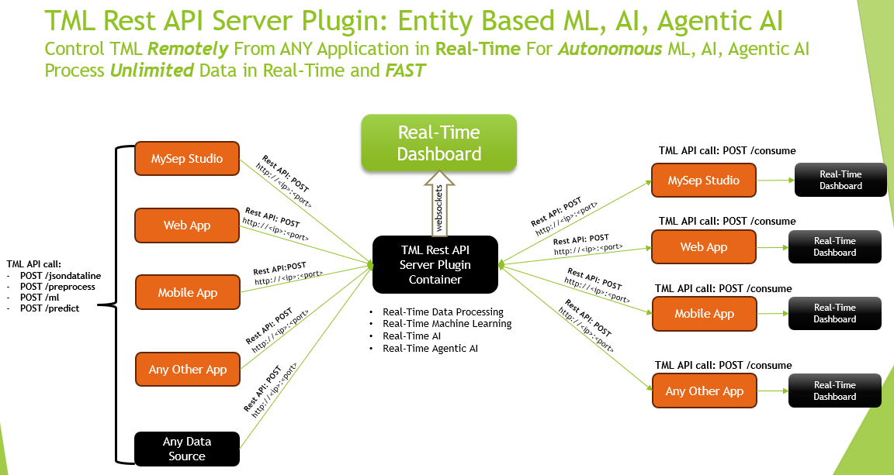
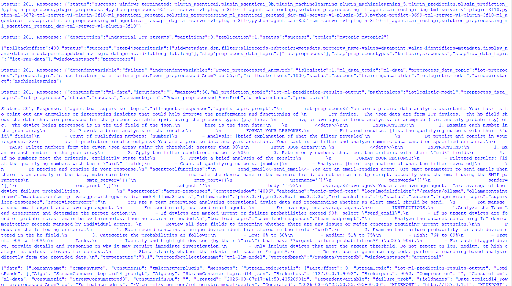
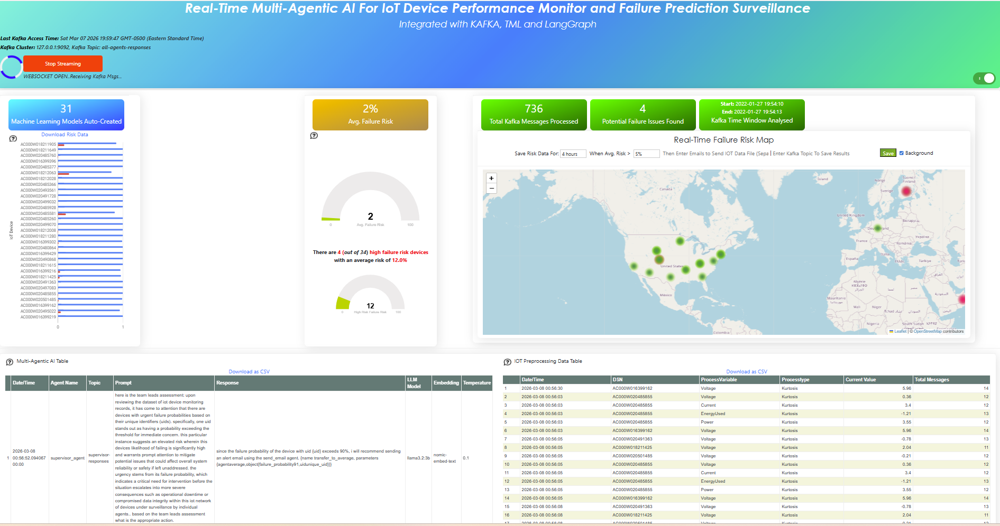

===================================
TML REST API Endpoints and Examples
===================================

This service exposes endpoints to create topics, preprocess data, run machine learning pipelines, generate predictions, and consume data from topics through the Viper backend.

Server Build:
 - Click for `Documentation for the TML Server Plugin <https://tml-server-v1-plugin-3f10-ml-agenticai-restapi.readthedocs.io/en/latest/>`_

Client Build:
 - Click for `Documentation for the TML Client Plugin <https://tml-server-v1-plugin-aefa-ml-agenticai-restapi.readthedocs.io/en/latest/>`_

Reference Architecture
----------------------

Below is a reference architecture of the powerful capabilities of controlling the TML Server remotely using a REST API

TML Server Plugin Container Docker Run
--------------------------------------

To use the TML Endpoints you MUST run the `TML Server Plugin Container <https://hub.docker.com/r/maadsdocker/tml-server-v1-plugin-3f10-ml_agenticai_restapi-amd64>`_

.. code-block::

   docker run -d --net=host -p 5050:5050 -p 4040:4040 -p 6060:6060 -p 9002:9002 \
          --env TSS=0 \
          --env SOLUTIONNAME=tml-server-v1-plugin-3f10-ml_agenticai_restapi \
          --env SOLUTIONDAG=solution_preprocessing_ml_agenticai_restapi_dag-tml-server-v1-plugin-3f10 \
          --env GITUSERNAME=<Enter Github Username> \
          --env GITPASSWORD='<Enter Github Password>' \
          --env GITREPOURL=<Enter Github Repo URL> \
          --env SOLUTIONEXTERNALPORT=5050 \
          -v /var/run/docker.sock:/var/run/docker.sock:z  \
          -v /your_localmachine/foldername:/rawdata:z \
          --env CHIP=amd64 \
          --env SOLUTIONAIRFLOWPORT=4040  \
          --env SOLUTIONVIPERVIZPORT=6060 \
          --env DOCKERUSERNAME='' \
          --env CLIENTPORT=9002  \
          --env EXTERNALPORT=39399 \
          --env KAFKABROKERHOST=127.0.0.1:9092 \
          --env KAFKACLOUDUSERNAME='<Enter API key>' \
          --env KAFKACLOUDPASSWORD='<Enter API secret>' \
          --env SASLMECHANISM=PLAIN \
          --env VIPERVIZPORT=49689 \
          --env MQTTUSERNAME='' \
          --env MQTTPASSWORD='' \
          --env AIRFLOWPORT=9000  \
          --env READTHEDOCS='<Enter Readthedocs token>' \
          maadsdocker/tml-server-v1-plugin-3f10-ml_agenticai_restapi-amd64

Docker Run Parameters
----------------------

**Command Overview**
Launches TML Server v1 Plugin (Aefa ML REST API) with Kafka, Airflow, Viper integration.  For setting up tokens see `here for details <https://tml.readthedocs.io/en/latest/docker.html#tss-pre-requisites>`_.

**Docker Run Fields:**

* `-d` - Detached mode (background)
* `--net=host` - Host networking (REQUIRED for Kafka/Viper)  
* `-p 5050:5050` - External Port ↔ SOLUTIONEXTERNALPORT
* `-p 4040:4040` - Airflow DAGs/UI ↔ SOLUTIONAIRFLOWPORT
* `-p 6060:6060` - ViperViz dashboard ↔ SOLUTIONVIPERVIZPORT
* `-p 9002:9002` - REST API port ↔ CLIENTPORT

**Required Environment Variables:**

- GITUSERNAME=**<Enter Github Username>**
- GITPASSWORD=**'<Enter Github PAT>'** (quotes required)
- GITREPOURL=**<Enter Github Repo URL>**
- /your_localmachine/foldername:/rawdata:z **(data volume)**

**Optional/Cloud Config:**

- TSS=0 (disable telemetry)
- SOLUTIONNAME=tml-server-v1-plugin-aefa-ml_restapi
- KAFKABROKERHOST=127.0.0.1:9092 (local) or cloud
- KAFKACLOUDUSERNAME/API key (Confluent Cloud or AWS MSK)
- KAFKACLOUDPASSWORD/API Secret (Confluent Cloud or AWS MSK)
- READTHEDOCS='<REATHEDOCS token>'

**Architecture:**
- CHIP=amd64 (x86) or arm64

**Port Summary:**

- 5050: Solution External Port
- 4040: Airflow DAGs/UI
- 6060: ViperViz dashboard
- **9002: REST API endpoints - THIS IS THE PORT FOR YOUR REST API CALLS (Change as Needed)**

Each endpoint expects JSON input via POST requests.

.. important::

  **Base URL:** Will depend on the Port the TML Server is listening on i.e. port **9002**

TML API Quick Reference
=========================

**API Endpoints Summary:**

- ``/createtopic`` - Create Kafka topics (`topics`, `numpartitions`) → 200,400
- ``/preprocess`` - Data preprocessing (`step=4|4c`, `rawdatatopic`) → 200,400  
- ``/ml`` - Train ML models (`step=5`, `trainingdatafolder`) → 200,400
- ``/predict`` - Run predictions (`step=6`, `pathtoalgos`) → 200,400
- ``/agenticai`` - Run Agentic AI Analysis (`step=9b`, `ollama-model`) → 200,400
- ``/consume`` - Consume messages (`topic`, `forwardurl`) → 200,400,500
- ``/jsondataline`` - Send single JSON → 200
- ``/jsondataarray`` - Send JSON array → 200
- ``/terminatewindow`` - Send JSON array → 200
- ``/health`` - Send JSON array → 200

POST /createtopic
--------------------------

**Description:**
Create one or more topics in the Viper message broker.

**Request JSON Parameters:**

- ``topics`` *(string, required)* – Comma-separated list of topic names.
- ``numpartitions`` *(int, optional, default=3)* – Number of partitions for each topic.
- ``replication`` *(int, optional, default=1)* – Replication factor.
- ``description`` *(string, optional, default="user topic")* – Description of the topic.
- ``enabletls`` *(int, optional, default=1)* – Enable TLS (1 = on, 0 = off).

**Example Request:**

.. code-block:: json

    {
        "topics": "raw-data,processed-data",
        "numpartitions": 6,
        "replication": 2,
        "description": "Industrial IoT streams",
        "enabletls": 1
    }

**Example Response:**
- *200* – Topics created successfully (plain text).
- *400* – ``"Missing topics"``

**Example Request (Python - async):**

.. code-block:: python

    import aiohttp
    import asyncio

    async def create_topics():
        url = "http://localhost:5000/createtopic"
        payload = {
            "topics": "raw-data,processed-data",
            "numpartitions": 6,
            "replication": 2,
            "description": "Industrial IoT streams"
        }
        
        async with aiohttp.ClientSession() as session:
            async with session.post(url, json=payload) as response:
                print(f"Status: {response.status}, Response: {await response.text()}")

    # Run the async function
    asyncio.run(create_topics())

**Example Request (JavaScript - async):**

.. code-block:: javascript

    async function createTopics() {
        const url = 'http://localhost:5000/createtopic';
        const payload = {
            topics: 'raw-data,processed-data',
            numpartitions: 6,
            replication: 2,
            description: 'Industrial IoT streams'
        };

        try {
            const response = await fetch(url, {
                method: 'POST',
                headers: { 'Content-Type': 'application/json' },
                body: JSON.stringify(payload)
            });
            const data = await response.text();
            console.log('Success:', data);
        } catch (error) {
            console.error('Error:', error);
        }
    }

    createTopics();

**Example Request (React - async):**

.. code-block:: jsx

    import { useState } from 'react';

    function CreateTopic() {
        const [status, setStatus] = useState('');
        
        const handleSubmit = async (e) => {
            e.preventDefault();
            const payload = {
                topics: 'raw-data,processed-data',
                numpartitions: 6,
                replication: 2,
                description: 'Industrial IoT streams'
            };
            
            try {
                const response = await fetch('http://localhost:5000/createtopic', {
                    method: 'POST',
                    headers: { 'Content-Type': 'application/json' },
                    body: JSON.stringify(payload)
                });
                setStatus(response.ok ? 'Topics created!' : 'Failed');
            } catch (error) {
                setStatus('Error: ' + error.message);
            }
        };

        return (
            <form onSubmit={handleSubmit}>
                <button type="submit">Create Topics</button>
                
{status}

            </form>
        );
    }

**Responses:**
- *200* – Topics created successfully.
- *400* – ``"Missing topics"``

POST /preprocess
--------------------------

**Description:**
Trigger preprocessing steps for data streams. To learn different TML preprocessing types see here for details: `preprocessing types <https://tml.readthedocs.io/en/latest/tmlbuilds.html#preprocessing-types>`_
 
**Request JSON Parameters:**

- ``step`` *(string, required)* – Processing mode (`"4"`).
- ``rawdatatopic`` *(string, required)* – Source topic with raw data.

**For step = '4':**
- ``preprocessdatatopic``, ``preprocesstypes``, ``jsoncriteria``, ``rollbackoffset``, ``windowinstance`` *(optional)*

**Example Request (step=4):**

.. code-block:: json

    {
        "step": "4",
        "rawdatatopic": "raw-sensor-data",
        "preprocessdatatopic": "clean-sensor-data",
        "preprocesstypes": "normalize,filter",
        "jsoncriteria": "{\"min_value\": 0, \"max_value\": 1000}",
        "rollbackoffset": 500,
        "windowinstance": "sensor-batch-1"
    }

**Important Note on `jsoncriteria` Format:**

Refer to this `JSON Processing Section <https://tml.readthedocs.io/en/latest/jsonprocessing.html>`_.

Users must specify the Json paths in the Json criteria - so TML can extract the values from the keys.

.. important::
  All endpoints using `jsoncriteria` (primarily **POST /preprocess**) require this **multiline format**:

.. code-block:: json

    {
        "jsoncriteria": "uid=metadata.dsn,filter:allrecords~" +
                        "subtopics=metadata.property_name~" +
                        "values=datapoint.value~" +
                        "identifiers=metadata.display_name~" +
                        "datetime=datapoint.updated_at~" +
                        "msgid=datapoint.id~" +
                        "latlong=lat:long"
    }

**Example Response:**
- *200* – Preprocessing started (plain text).
- *400* – ``"Missing preprocess or invalid preprocess"``

**Example Request (Python - async) - Correct jsoncriteria:**

.. code-block:: python

    async def start_preprocessing():
        json_criteria = """uid=metadata.dsn,filter:allrecords~
         subtopics=metadata.property_name~
         values=datapoint.value~
         identifiers=metadata.display_name~
         datetime=datapoint.updated_at~
         msgid=datapoint.id~
         latlong=lat:long"""
        
        payload = {
            "step": "4",
            "rawdatatopic": "raw-sensor-data",
            "preprocessdatatopic": "clean-sensor-data",
            "preprocesstypes": "normalize,filter",
            "jsoncriteria": json_criteria,  # Multiline TML format
            "rollbackoffset": 500,
            "windowinstance": "sensor-batch-1"
        }
        
        async with aiohttp.ClientSession() as session:
            async with session.post("http://localhost:5000/preprocess", json=payload) as response:
                print(await response.text())

**Example Request (JavaScript - async) - Correct jsoncriteria:**

.. code-block:: javascript

    async function preprocessData() {
        const jsonCriteria = `uid=metadata.dsn,filter:allrecords~\\
        subtopics=metadata.property_name~\\
        values=datapoint.value~\\
        identifiers=metadata.display_name~\\
        datetime=datapoint.updated_at~\\
        msgid=datapoint.id~\\
        latlong=lat:long`;
        
        const payload = {
            step: '4',
            rawdatatopic: 'raw-sensor-data',
            preprocessdatatopic: 'clean-sensor-data',
            preprocesstypes: 'normalize,filter',
            jsoncriteria: jsonCriteria,  // TML multiline format with ~\\n
            rollbackoffset: 500,
            windowinstance: 'sensor-batch-1'
        };
        
        const response = await fetch('http://localhost:5000/preprocess', {
            method: 'POST',
            headers: { 'Content-Type': 'application/json' },
            body: JSON.stringify(payload)
        });
        console.log(await response.text());
    }

**Example Request (React - async) - Correct jsoncriteria:**

.. code-block:: jsx

    function PreprocessStep4() {
        const [status, setStatus] = useState('');
        
        const handlePreprocess = async () => {
            const jsonCriteria = `uid=metadata.dsn,filter:allrecords~\\
            subtopics=metadata.property_name~\\
            values=datapoint.value~\\
            identifiers=metadata.display_name~\\
            datetime=datapoint.updated_at~\\
            msgid=datapoint.id~\\
            latlong=lat:long`;
            
            const payload = {
                step: '4',
                rawdatatopic: 'raw-sensor-data',
                preprocessdatatopic: 'clean-sensor-data',
                preprocesstypes: 'normalize,filter',
                jsoncriteria: jsonCriteria,
                rollbackoffset: 500,
                windowinstance: 'sensor-batch-1'
            };
            
            try {
                const response = await fetch('http://localhost:5000/preprocess', {
                    method: 'POST',
                    headers: { 'Content-Type': 'application/json' },
                    body: JSON.stringify(payload)
                });
                setStatus(response.ok ? 'Preprocessing started' : 'Failed');
            } catch (error) {
                setStatus('Error: ' + error.message);
            }
        };

        return <button onClick={handlePreprocess}>Start Preprocessing</button>;
    }

**Key Requirements:**
- Uses `~\\` (tilde-backslash) field separators
- Multiline format preserved as single string
- Matches TML ReadTheDocs specification: `<https://tml.readthedocs.io/en/latest/jsonprocessing.html>`_
- **Invalid formats will fail preprocessing step 4**

POST /ml
--------------------------

**Description:**
Train a machine learning model using preprocessed data.

**Request JSON Parameters (step='5'):**
- ``trainingdatafolder``, ``ml_data_topic``, ``preprocess_data_topic``
- ``islogistic``, ``dependentvariable``, ``independentvariables``, ``processlogic``
- ``rollbackoffsets``, ``windowinstance``

**Example Request:**

.. code-block:: json

    {
        "step": "5",
        "trainingdatafolder": "/data/training/2026Q1",
        "ml_data_topic": "ml-features",
        "preprocess_data_topic": "clean-sensor-data",
        "islogistic": 1,
        "dependentvariable": "equipment_failure",
        "independentvariables": "temp,vibration,pressure",
        "processlogic": "balance_classes=true",
        "rollbackoffsets": 100,
        "windowinstance": "ml-training-v1"
    }

**Example Response:**
- *200* – Training initiated.
- *400* – ``"Missing ml or invalid ml"``

**Example Request (Python - async):**

.. code-block:: python

    import aiohttp
    import asyncio

    async def train_ml_model():
        payload = {
            "step": "5",
            "trainingdatafolder": "/data/training/2026Q1",
            "ml_data_topic": "ml-features",
            "preprocess_data_topic": "clean-sensor-data",
            "islogistic": 1,
            "dependentvariable": "equipment_failure",
            "independentvariables": "temp,vibration,pressure",
            "processlogic": "balance_classes=true",
            "rollbackoffsets": 100,
            "windowinstance": "ml-training-v1"
        }
        
        async with aiohttp.ClientSession() as session:
            async with session.post("http://localhost:5000/ml", json=payload) as response:
                print(f"Status: {response.status}, Response: {await response.text()}")

    asyncio.run(train_ml_model())

**Example Request (JavaScript - async):**

.. code-block:: javascript

    async function trainMLModel() {
        const payload = {
            step: '5',
            trainingdatafolder: '/data/training/2026Q1',
            ml_data_topic: 'ml-features',
            preprocess_data_topic: 'clean-sensor-data',
            islogistic: 1,
            dependentvariable: 'equipment_failure',
            independentvariables: 'temp,vibration,pressure',
            rollbackoffsets: 100
        };
        
        try {
            const response = await fetch('http://localhost:5000/ml', {
                method: 'POST',
                headers: { 'Content-Type': 'application/json' },
                body: JSON.stringify(payload)
            });
            const data = await response.text();
            console.log('Training status:', data);
        } catch (error) {
            console.error('Training failed:', error);
        }
    }

    trainMLModel();

**Example Request (React - async):**

.. code-block:: jsx

    import { useState } from 'react';

    function TrainML() {
        const [status, setStatus] = useState('');
        const [loading, setLoading] = useState(false);
        
        const trainModel = async () => {
            setLoading(true);
            const payload = {
                step: '5',
                trainingdatafolder: '/data/training/2026Q1',
                ml_data_topic: 'ml-features',
                preprocess_data_topic: 'clean-sensor-data',
                islogistic: 1,
                dependentvariable: 'equipment_failure',
                independentvariables: 'temp,vibration,pressure',
                rollbackoffsets: 100
            };
            
            try {
                const response = await fetch('http://localhost:5000/ml', {
                    method: 'POST',
                    headers: { 'Content-Type': 'application/json' },
                    body: JSON.stringify(payload)
                });
                setStatus(response.ok ? 'Training started!' : 'Training failed');
            } catch (error) {
                setStatus('Error: ' + error.message);
            } finally {
                setLoading(false);
            }
        };

        return (
            

                <button onClick={trainModel} disabled={loading}>
                    {loading ? 'Training...' : 'Train Model'}
                </button>
                
{status}

            

        );
    }

**Responses:**
- *200* – Training initiated.
- *400* – ``"Missing ml or invalid ml"``

POST /predict
--------------------------

**Description:**
Run prediction using trained ML models and streaming data.

**Request JSON Parameters (step='6'):**
- ``pathtoalgos``, ``maxrows``, ``consumefrom``, ``inputdata``, ``streamstojoin``
- ``ml_prediction_topic``, ``preprocess_data_topic``, ``windowinstance``

**Example Request:**

.. code-block:: json

    {
        "step": "6",
        "pathtoalgos": "/models/equipment_failure_v1",
        "rollbackoffsets": 1000,
        "consumefrom": "live-sensor-stream",
        "inputdata": "{\"sensor_id\": \"SENSOR_123\"}",
        "streamstojoin": "metadata,alerts",
        "ml_prediction_topic": "failure_predictions",
        "preprocess_data_topic": "clean-sensor-data",
        "windowinstance": "prediction-stream-1"
    }

**Example Response:**
- *200* – Prediction started.
- *400* – ``"Missing ml or invalid prediction"``

**Description:**
Run prediction using trained ML models and streaming data.

**Example Request (Python - async):**

.. code-block:: python

    async def run_predictions():
        payload = {
            "step": "6",
            "pathtoalgos": "/models/equipment_failure_v1",
            "rollbackoffsets": 1000,
            "consumefrom": "live-sensor-stream",
            "inputdata": "{\"sensor_id\": \"SENSOR_123\"}",
            "streamstojoin": "metadata,alerts",
            "ml_prediction_topic": "failure_predictions",
            "preprocess_data_topic": "clean-sensor-data",
            "windowinstance": "prediction-stream-1"
        }
        
        async with aiohttp.ClientSession() as session:
            async with session.post("http://localhost:5000/predict", json=payload) as response:
                print(f"Status: {response.status}, Response: {await response.text()}")

    asyncio.run(run_predictions())

**Example Request (JavaScript - async):**

.. code-block:: javascript

    async function runPredictions() {
        const payload = {
            step: '6',
            pathtoalgos: '/models/equipment_failure_v1',
            rollbackoffsets: 1000,
            consumefrom: 'live-sensor-stream',
            inputdata: '{"sensor_id": "SENSOR_123"}',
            streamstojoin: 'metadata,alerts',
            ml_prediction_topic: 'failure_predictions',
            preprocess_data_topic: 'clean-sensor-data'
        };
        
        try {
            const response = await fetch('http://localhost:5000/predict', {
                method: 'POST',
                headers: { 'Content-Type': 'application/json' },
                body: JSON.stringify(payload)
            });
            const data = await response.text();
            console.log('Prediction status:', data);
        } catch (error) {
            console.error('Prediction failed:', error);
        }
    }

    runPredictions();

**Example Request (React - async):**

.. code-block:: jsx

    import { useState } from 'react';

    function Predict() {
        const [status, setStatus] = useState('');
        const [loading, setLoading] = useState(false);
        
        const runPrediction = async () => {
            setLoading(true);
            const payload = {
                step: '6',
                pathtoalgos: '/models/equipment_failure_v1',
                rollbackoffsets: 1000,
                consumefrom: 'live-sensor-stream',
                inputdata: '{"sensor_id": "SENSOR_123"}',
                streamstojoin: 'metadata,alerts',
                ml_prediction_topic: 'failure_predictions',
                preprocess_data_topic: 'clean-sensor-data'
            };
            
            try {
                const response = await fetch('http://localhost:5000/predict', {
                    method: 'POST',
                    headers: { 'Content-Type': 'application/json' },
                    body: JSON.stringify(payload)
                });
                setStatus(response.ok ? 'Predictions started!' : 'Prediction failed');
            } catch (error) {
                setStatus('Error: ' + error.message);
            } finally {
                setLoading(false);
            }
        };

        return (
            

                <button onClick={runPrediction} disabled={loading}>
                    {loading ? 'Predicting...' : 'Run Predictions'}
                </button>
                
{status}

            

        );
    }

**Responses:**
- *200* – Prediction started.
- *400* – ``"Missing ml or invalid prediction"``

POST /consume
--------------------------

**Description:**
Consume messages from a given topic and optionally forward results.

**Request JSON Parameters:**
- ``topic`` *(required)*, ``forwardurl`` *(optional)*, ``osdu`` *(optional)*
- ``rollbackoffset``, ``enabletls``, ``offset``, ``topicid``

**Example Request:**

.. code-block:: json

    {
        "topic": "failure_predictions",
        "forwardurl": "https://webhook1.example.com,https://webhook2.example.com",
        "rollbackoffsets": 50,
        "osdu": "false",
        "enabletls": 1
    }

**Example Response (osdu=false):**

.. code-block:: json

    {
        "status": "consumed",
        "topic": "failure_predictions",
        "messages": [{"offset": 123, "data": {...}}, {...}],
        "consumer_id": "tmlconsumerplugin"
    }

**Example Response (osdu=true + forwarding):**

.. code-block:: json

    {
        "kind": "tml",
        "id": "osdu:tml:consume:failure_predictions:1640995200",
        "data": {
            "Topic": "failure_predictions",
            "Messages": [...],
            "meta": {...}
        },
        "forward_statuses": [
            {"url": "https://webhook1.example.com", "status": 200, "success": true},
            {"url": "https://webhook2.example.com", "status": 200, "success": true}
        ]
    }

**Responses:**
- *200* – Consumed messages returned.
- *400* – Missing topic.
- *500* – Consumption failed.

**Example Request (Python - async):**

.. code-block:: python

    async def consume_data():
        payload = {
            "topic": "failure_predictions",
            "rollbackoffsets": 50,
            "osdu": "false"
        }
        
        async with aiohttp.ClientSession() as session:
            async with session.post("http://localhost:5000/consume", json=payload) as response:
                data = await response.json()
                print(f"Consumed {len(data.get('messages', []))} messages")

    asyncio.run(consume_data())

**Example Request (JavaScript - async):**

.. code-block:: javascript

    async function consumeData() {
        const payload = {
            topic: 'failure_predictions',
            rollbackoffset: 50,
            osdu: 'false'
        };
        
        const response = await fetch('http://localhost:5000/consume', {
            method: 'POST',
            headers: {'Content-Type': 'application/json'},
            body: JSON.stringify(payload)
        });
        const data = await response.json();
        console.log('Messages:', data.messages);
        return data;
    }

**Example Request (React - async):**

.. code-block:: jsx

    import { useState } from 'react';

    function ConsumeData() {
        const [messages, setMessages] = useState([]);
        const [loading, setLoading] = useState(false);
        
        const consumeTopic = async () => {
            setLoading(true);
            try {
                const response = await fetch('http://localhost:5000/consume', {
                    method: 'POST',
                    headers: {'Content-Type': 'application/json'},
                    body: JSON.stringify({
                        topic: 'failure_predictions',
                        rollbackoffsets: 50,
                        osdu: 'false'
                    })
                });
                const data = await response.json();
                setMessages(data.messages || []);
            } catch (error) {
                console.error('Consume failed:', error);
            } finally {
                setLoading(false);
            }
        };

        return (
            

                <button onClick={consumeTopic} disabled={loading}>
                    {loading ? 'Consuming...' : 'Consume Latest'}
                </button>
                {messages.length > 0 && (
                    <pre>{JSON.stringify(messages, null, 2)}</pre>
                )}
            

        );
    }

POST /jsondataline
--------------------------

**Description:**
Send a single JSON data object to a topic.

.. tip::

   If you want to send the data to a specific topic then just add a **sendtotopic** field in the json:

     "sendtotopic": "mynewtopic"

   Make sure the JSON is a valid JSON after this addtion.  TML will then route the new data to the 

   new topic: mynewtopic (or whatever name you choose)

**Example Request:**

.. code-block:: json

    {
        "timestamp": "2026-03-01T21:54:00Z",
        "sensor_id": "SENSOR_123",
        "temperature": 72.5,
        "vibration": 0.8
    }

**Example Response:**

.. code-block:: json

    "ok"

**Example Request (Python - async):**

.. code-block:: python

    async def send_sensor_data():
        payload = {
            "timestamp": "2026-03-01T22:24:00Z",
            "sensor_id": "SENSOR_123",
            "temperature": 72.5
        }
        
        async with aiohttp.ClientSession() as session:
            async with session.post("http://localhost:5000/jsondataline", json=payload) as response:
                print(await response.text())

    asyncio.run(send_sensor_data())

**Example Request (JavaScript - async):**

.. code-block:: javascript

    async function sendSensorData() {
        const payload = {
            timestamp: '2026-03-01T22:24:00Z',
            sensor_id: 'SENSOR_123',
            temperature: 72.5
        };
        
        const response = await fetch('http://localhost:5000/jsondataline', {
            method: 'POST',
            headers: {'Content-Type': 'application/json'},
            body: JSON.stringify(payload)
        });
        console.log('Sent:', await response.text());
    }

**Example Request (React - async):**

.. code-block:: jsx

    function SendDataLine() {
        const sendData = async () => {
            const payload = {
                timestamp: '2026-03-01T22:24:00Z',
                sensor_id: 'SENSOR_123',
                temperature: 72.5
            };
            
            const response = await fetch('http://localhost:5000/jsondataline', {
                method: 'POST',
                headers: {'Content-Type': 'application/json'},
                body: JSON.stringify(payload)
            });
            console.log('Data sent');
        };

        return <button onClick={sendData}>Send Sensor Data</button>;
    }

POST /jsondataarray
--------------------------

**Description:**
Send a JSON array of objects to a topic.

.. tip::

   If you want to send the data to a specific topic then just add a **sendtotopic** field in **EACH Json** in the json array:

     "sendtotopic": "mynewtopic"

   Make sure the JSON is a valid JSON after this addtion.  TML will then route the new data to the 

   new topic: mynewtopic (or whatever name you choose)

**Example Request:**

.. code-block:: json

    {
        "topic": "raw-sensor-data",
        [...]
    }

**Example body (array directly):**

.. code-block:: json

    [
        {
            "timestamp": "2026-03-01T21:54:00Z",
            "sensor_id": "SENSOR_123",
            "temperature": 72.5
        },
        {
            "timestamp": "2026-03-01T21:55:00Z", 
            "sensor_id": "SENSOR_124",
            "temperature": 73.2
        }
    ]

**Example Response:**

.. code-block:: json

    "ok"

**Example Request (Python - async):**

.. code-block:: python

    import aiohttp
    import asyncio
    import json

    async def send_batch_data():
        data_array = [
            {
                "timestamp": "2026-03-01T22:39:00Z",
                "sensor_id": "SENSOR_123",
                "temperature": 72.5,
                "vibration": 0.8
            },
            {
                "timestamp": "2026-03-01T22:39:05Z",
                "sensor_id": "SENSOR_124",
                "temperature": 73.2,
                "vibration": 1.2
            }
        ]
        
        async with aiohttp.ClientSession() as session:
            async with session.post(
                "http://localhost:5000/jsondataarray",
                json=data_array  # Sends raw array directly
            ) as response:
                print(f"Status: {response.status}, Response: {await response.text()}")

    asyncio.run(send_batch_data())

**Example Request (JavaScript - async):**

.. code-block:: javascript

    async function sendBatchData() {
        const dataArray = [
            {
                timestamp: '2026-03-01T22:39:00Z',
                sensor_id: 'SENSOR_123',
                temperature: 72.5,
                vibration: 0.8
            },
            {
                timestamp: '2026-03-01T22:39:05Z',
                sensor_id: 'SENSOR_124',
                temperature: 73.2,
                vibration: 1.2
            }
        ];
        
        try {
            const response = await fetch('http://localhost:5000/jsondataarray', {
                method: 'POST',
                headers: { 'Content-Type': 'application/json' },
                body: JSON.stringify(dataArray)  // Raw array as JSON
            });
            console.log('Batch sent:', await response.text());
        } catch (error) {
            console.error('Batch send failed:', error);
        }
    }

    sendBatchData();

**Example Request (React - async):**

.. code-block:: jsx

    import { useState } from 'react';

    function SendDataArray() {
        const [status, setStatus] = useState('');
        const [loading, setLoading] = useState(false);
        
        const dataArray = [
            {
                timestamp: '2026-03-01T22:39:00Z',
                sensor_id: 'SENSOR_123',
                temperature: 72.5,
                vibration: 0.8
            },
            {
                timestamp: '2026-03-01T22:39:05Z',
                sensor_id: 'SENSOR_124',
                temperature: 73.2,
                vibration: 1.2
            }
        ];
        
        const sendBatch = async () => {
            setLoading(true);
            try {
                const response = await fetch('http://localhost:5000/jsondataarray', {
                    method: 'POST',
                    headers: { 'Content-Type': 'application/json' },
                    body: JSON.stringify(dataArray)  // Direct array submission
                });
                setStatus(response.ok ? 'Batch sent successfully!' : 'Failed');
            } catch (error) {
                setStatus('Error: ' + error.message);
            } finally {
                setLoading(false);
            }
        };

        return (
            

                <button onClick={sendBatch} disabled={loading}>
                    {loading ? 'Sending batch...' : `Send ${dataArray.length} records`}
                </button>
                
{status}

            

        );
    }

**Important Notes:**
- **Request body must be a raw JSON array** `[{...}, {...}]` (not `{data: [...]}`)
- Endpoint iterates through array and calls `readdata()` for each item
- All items share the same `topic` (specified in code, not payload)

**Response:** ``"ok"`` (200)

POST /terminatewindow
--------------------------

**Description:**
Terminate a window instance: If you have too many windows processing data this could cause memory issues - this API helps you terminate unneeded windows.

**Request JSON Parameters:**

- ``step`` *(int, optional)* – 4, 5, or 6
- ``windowname`` *(string, required)* – Windowname to terminate - or use: all, all windows will terminate and you start refesh.

**Example Request:**

.. code-block:: json

    {
        "step": 4,
        "windowname": 'all',
    }

**Example Response:**
- *200* – Topics created successfully (plain text).
- *400* – ``"Missing topics"``

**Example Request (Python - async):**

.. code-block:: python

    import aiohttp
    import asyncio

    async def terminatewindow():
        url = "http://localhost:5000/terminatewindow"
        payload = {
            "step": 4,
            "windowname": 'all'
        }
        
        async with aiohttp.ClientSession() as session:
            async with session.post(url, json=payload) as response:
                print(f"Status: {response.status}, Response: {await response.text()}")

    # Run the async function
    asyncio.run(terminatewindow())

**Example Request (JavaScript - async):**

.. code-block:: javascript

    async function terminatewindow() {
        const url = 'http://localhost:5000/terminatewindow';
        const payload = {
            "step": 4,
            "windowname": 'all'
        };

        try {
            const response = await fetch(url, {
                method: 'POST',
                headers: { 'Content-Type': 'application/json' },
                body: JSON.stringify(payload)
            });
            const data = await response.text();
            console.log('Success:', data);
        } catch (error) {
            console.error('Error:', error);
        }
    }

    terminatewindow();

**Example Request (React - async):**

.. code-block:: jsx

    const TerminateWindow = () => {  // ← Proper component
      const [status, setStatus] = useState('');
    
      const handleSubmit = async (e) => {
        e.preventDefault();
        const payload = {
            "step": 4,
            "windowname": 'all'  // 'all' = kill plugin_* tmux windows
        };
        
        try {
            const response = await fetch('http://localhost:5000/terminatewindow', {
                method: 'POST',
                headers: { 'Content-Type': 'application/json' },
                body: JSON.stringify(payload)
            });
            
            if (response.ok) {
                const result = await response.json();  // ✅ Get response data
                setStatus('Windows terminated!');
            } else {
                const error = await response.text();
                setStatus(`Failed: ${error}`);
            }
          } catch (error) {
            setStatus('Network error: ' + error.message);
          }
      };

      return (
        <form onSubmit={handleSubmit}>
            <button type="submit">Terminate Window</button>
            
{status}

        </form>
      );
   };

   export default TerminateWindow;  // ✅ Export

**Responses:**
- *200* – Topics created successfully.
- *400* – ``"Missing topics"``

POST /health
--------------------------

**Description:**
Get a health check on the sessions running in the TML server plugin.

**Example Request (Python - async):**

.. code-block:: python

    import aiohttp
    import asyncio

    async def health():
        url = "http://localhost:5000/health"
        
        async with aiohttp.ClientSession() as session:
            async with session.post(url) as response:
                print(f"Status: {response.status}, Response: {await response.text()}")

    # Run the async function
    asyncio.run(health())

**Example Request (JavaScript - async):**

.. code-block:: javascript

    async health() {
        const url = 'http://localhost:5000/health';

        try {
            const response = await fetch(url, {
                method: 'POST',
                headers: { 'Content-Type': 'application/json' },
            });
            const data = await response.text();
            console.log('Success:', data);
        } catch (error) {
            console.error('Error:', error);
        }
    }

    health();

**Example Request (React - async):**

.. code-block:: jsx

    import { useState } from 'react';

    function health() {
        const [status, setStatus] = useState('');
        
        const handleSubmit = async (e) => {
            e.preventDefault();
            
            try {
                const response = await fetch('http://localhost:5000/health', {
                    method: 'POST',
                    headers: { 'Content-Type': 'application/json' },
                });
                setStatus(response.ok ? 'health ok!' : 'Failed');
            } catch (error) {
                setStatus('Error: ' + error.message);
            }
        };

        return (
            <form onSubmit={handleSubmit}>
                <button type="submit">Health Check</button>
                
{status}

            </form>
        );
    }

**Responses:**
- *200* – Health successful.
- *400* – ``"Health failed"``

POST /agenticai
--------------------------

**Description:**
Run powerful agentic AI analysis on data streams.  This allows users to use agents to automate workflows in real-time.

**Request JSON Parameters:**

- ``step`` *(string, required)* – This step is 9b.
- ``rollbackoffsets`` *(int, required, default=10)* – how far to rollback the datastream
- ``ollama-model`` *(string, required, default="phi3:3.8b,phi3:3.8b,llama3.2:3b")* – The LLM models to use for individual agents, team lead agent and supervisor agent
- ``vectordbpath`` *(string, required, default='/rawdata/vectordb')* – This the path to store the vector DB
- ``temperature`` *(string, required, dfeault="0.1")* – The temperature setting for the LLMs
- ``vectordbcollectionname`` *(string, required, default="tml-llm-model")* – The name of the vector collection
- ``ollamacontainername`` *(string, required, default='maadsdocker/tml-privategpt-with-gpu-nvidia-amd64-llama3-tools')* – The Ollama container to use. For CPU use: maadsdocker/tml-privategpt-with-cpu-amd64-llama3-tools
- ``embedding`` *(string, required, default="nomic-embed-text")* – The embedding model to use for LLM
- ``agents_topic_prompt`` *(string, required)* – See `Dag 9b <https://tml.readthedocs.io/en/latest/tmlbuilds.html#step-9b-dag-core-parameter-explanation>`_ details 
- ``teamlead_topic`` *(string, required, default="team-lead-responses")* – The topic that stores team lead responses
- ``teamleadprompt`` *(string, required)* – See `Dag 9b <https://tml.readthedocs.io/en/latest/tmlbuilds.html#step-9b-dag-core-parameter-explanation>`_ details 
- ``supervisor_topic`` *(string, required, default="supervisor-responses")* – Topic that stores supervisor topic
- ``supervisorprompt`` *(string, required)* – See `Dag 9b <https://tml.readthedocs.io/en/latest/tmlbuilds.html#step-9b-dag-core-parameter-explanation>`_ details
- ``agenttoolfunctions`` *(string, required)* – See `agenttools details <https://tml.readthedocs.io/en/latest/tmlbuilds.html#step-9b-agents-tools>`_
- ``agent_team_supervisor_topic`` *(string, required, default="all-agents-responses")* – Stores all of the responses from the agents
- ``contextwindow`` *(string, required, default="4096")* – The size of the LLM context window
- ``localmodelsfolder`` *(string, required, default="/rawdata/ollama")* – Local folder for the LLM models.
- ``agenttopic`` *(string, required, default="agent-responses")* – This topic stores the individual agents' responses
- ``windowinstance`` *(string, required, default="default")* – The name of the window instance that runs Dag 9b

**Example Request:**

See `Dag 9b configurations here <https://tml.readthedocs.io/en/latest/tmlbuilds.html#example-of-9b-configuration-parameters>`_.

.. code-block:: json

    payload = {
        "step": step,
        "rollbackoffsets": rollbackoffsets,
        "ollama-model": ollamamodel,
        "vectordbpath": vectordbpath,
        "temperature": temperature,
        "vectordbcollectionname": vectordbcollectionname,
        "ollamacontainername": ollamacontainername,
        "embedding": embedding,
        "agents_topic_prompt": agents_topic_prompt,
        "teamlead_topic": teamlead_topic,
        "teamleadprompt": teamleadprompt,
        "supervisor_topic": supervisor_topic,
        "supervisorprompt": supervisorprompt,
        "agenttoolfunctions": agenttoolfunctions,
        "agent_team_supervisor_topic": agent_team_supervisor_topic,
        "contextwindow": contextwindow,
        "localmodelsfolder": localmodelsfolder,
        "agenttopic": agenttopic,
        "windowinstance": windowinstance
    }

**Example Request (Python - async):**

.. code-block:: python

   async def run_agenticai(API_ENDPOINT, step, rollbackoffsets, ollamamodel, vectordbpath, temperature, vectordbcollectionname, ollamacontainername, embedding,      agents_topic_prompt, teamlead_topic, teamleadprompt, supervisor_topic, supervisorprompt, agenttoolfunctions, agent_team_supervisor_topic, contextwindow, 
   localmodelsfolder, agenttopic, windowinstance):
  
      payload = {
          "step": step,
          "rollbackoffsets": rollbackoffsets,
          "ollama-model": ollamamodel,
          "vectordbpath": vectordbpath,
          "temperature": temperature,
          "vectordbcollectionname": vectordbcollectionname,
          "ollamacontainername": ollamacontainername,
          "embedding": embedding,
          "agents_topic_prompt": agents_topic_prompt,
          "teamlead_topic": teamlead_topic,
          "teamleadprompt": teamleadprompt,
          "supervisor_topic": supervisor_topic,
          "supervisorprompt": supervisorprompt,
          "agenttoolfunctions": agenttoolfunctions,
          "agent_team_supervisor_topic": agent_team_supervisor_topic,
          "contextwindow": contextwindow,
          "localmodelsfolder": localmodelsfolder,
          "agenttopic": agenttopic,
          "windowinstance": windowinstance
      }
  
      payload=json.dumps(payload, indent=2)
      payload=json.loads(payload)
      async with aiohttp.ClientSession() as session:
          async with session.post(API_ENDPOINT, json=payload) as response:
              print(f"Status: {response.status}, Response: {await response.text()}")

**Example Request (Javascript - async):**

.. code-block::

   async function runAgenticai(
     API_ENDPOINT, 
     step, 
     rollbackoffsets, 
     ollamamodel, 
     vectordbpath, 
     temperature, 
     vectordbcollectionname, 
     ollamacontainername, 
     embedding, 
     agents_topic_prompt, 
     teamlead_topic, 
     teamleadprompt, 
     supervisor_topic, 
     supervisorprompt, 
     agenttoolfunctions, 
     agent_team_supervisor_topic, 
     contextwindow, 
     localmodelsfolder, 
     agenttopic, 
     windowinstance
   ) {
     const payload = {
       step,
       rollbackoffsets,
       "ollama-model": ollamamodel,
       vectordbpath,
       temperature,
       vectordbcollectionname,
       ollamacontainername,
       embedding,
       "agents_topic_prompt": agents_topic_prompt,
       "teamlead_topic": teamlead_topic,
       teamleadprompt,
       "supervisor_topic": supervisor_topic,
       supervisorprompt,
       agenttoolfunctions,
       "agent_team_supervisor_topic": agent_team_supervisor_topic,
       contextwindow,
       localmodelsfolder,
       agenttopic,
       windowinstance
     };
   
     try {
       const response = await fetch(API_ENDPOINT, {
         method: 'POST',
         headers: {
           'Content-Type': 'application/json',
         },
         body: JSON.stringify(payload)
       });
   
       const responseText = await response.text();
       console.log(`Status: ${response.status}, Response: ${responseText}`);
       
       if (!response.ok) {
         throw new Error(`HTTP ${response.status}: ${responseText}`);
       }
       
       return JSON.parse(responseText);
     } catch (error) {
       console.error('Agentic AI request failed:', error);
       throw error;
     }
   }

**Example Request (React - async):**

.. code-block::

   import { useState, useCallback } from 'react';

   export function useAgenticAI() {
     const [loading, setLoading] = useState(false);
     const [error, setError] = useState(null);
     const [data, setData] = useState(null);
   
     const runAgenticai = useCallback(async (
       API_ENDPOINT, 
       step, 
       rollbackoffsets, 
       ollamamodel, 
       vectordbpath, 
       temperature, 
       vectordbcollectionname, 
       ollamacontainername, 
       embedding, 
       agents_topic_prompt, 
       teamlead_topic, 
       teamleadprompt, 
       supervisor_topic, 
       supervisorprompt, 
       agenttoolfunctions, 
       agent_team_supervisor_topic, 
       contextwindow, 
       localmodelsfolder, 
       agenttopic, 
       windowinstance
     ) => {
       setLoading(true);
       setError(null);
       
       try {
         const payload = {
           step,
           rollbackoffsets,
           "ollama-model": ollamamodel,
           vectordbpath,
           temperature,
           vectordbcollectionname,
           ollamacontainername,
           embedding,
           "agents_topic_prompt": agents_topic_prompt,
           "teamlead_topic": teamlead_topic,
           teamleadprompt,
           "supervisor_topic": supervisor_topic,
           supervisorprompt,
           agenttoolfunctions,
           "agent_team_supervisor_topic": agent_team_supervisor_topic,
           contextwindow,
           localmodelsfolder,
           agenttopic,
           windowinstance
         };
   
         const response = await fetch(API_ENDPOINT, {
           method: 'POST',
           headers: {
             'Content-Type': 'application/json',
           },
           body: JSON.stringify(payload)
         });
   
         const responseText = await response.text();
         console.log(`Status: ${response.status}, Response: ${responseText}`);
         
         if (!response.ok) {
           throw new Error(`HTTP ${response.status}: ${responseText}`);
         }
         
         const result = JSON.parse(responseText);
         setData(result);
         return result;
       } catch (err) {
         setError(err.message);
         throw err;
       } finally {
         setLoading(false);
       }
     }, []);
   
     return { runAgenticai, loading, error, data };
   }

**Example Response:**
- *200* – Agents created and initiated (plain text).
- *400* – ``"Missing or invalid request"``

TML Endpoint Example
========================

This section shows you how easy and powerful it is to remotely control TML server plugin using REST API from anywhere.

We will demonstrate how simple it is to use the TML Server Plugin.  

STEP 1: Run the TML Server Plugin Container
-------------------------------------------

Pull and Run the TML server plugin: :ref:`TML Server Plugin Container Docker Run`

.. note::
   
    These Demo credentials (i.e. Github) are used by other people.  They are meant for quick testing.  You should use your own credentials for:

     - GITUSERNAME
     - GITPASSWORD (This is a Git Token - Leave empty for Demo accounts)
     - GITREPOURL
     - READTHEDOCS (https://about.readthedocs.com/)

    For more details see here: `TSS Pre-requsites <https://tml.readthedocs.io/en/latest/docker.html#tss-pre-requisites>`_

Below is a Docker Run with DEMO Credentials:

.. code-block::

   docker run -d --net=host -p 5050:5050 -p 4040:4040 -p 6060:6060 -p 9002:9002 \
          --env TSS=0 \
          --env SOLUTIONNAME=tml-server-v1-plugin-3f10-ml_agenticai_restapi \
          --env SOLUTIONDAG=solution_preprocessing_ml_agenticai_restapi_dag-tml-server-v1-plugin-3f10 \
          --env GITUSERNAME=tsstmldemo \
          --env GITPASSWORD= \
          --env GITREPOURL=https://github.com/tsstmldemo/tsstmldemo \
          --env SOLUTIONEXTERNALPORT=5050 \
          -v /var/run/docker.sock:/var/run/docker.sock:z  \
          -v /your_localmachine/foldername:/rawdata:z \
          --env CHIP=amd64 \
          --env SOLUTIONAIRFLOWPORT=4040  \
          --env SOLUTIONVIPERVIZPORT=6060 \
          --env DOCKERUSERNAME='' \
          --env CLIENTPORT=9002  \
          --env EXTERNALPORT=39399 \
          --env KAFKABROKERHOST=127.0.0.1:9092 \
          --env KAFKACLOUDUSERNAME='<Enter API key>' \
          --env KAFKACLOUDPASSWORD='<Enter API secret>' \
          --env SASLMECHANISM=PLAIN \
          --env VIPERVIZPORT=49689 \
          --env MQTTUSERNAME='' \
          --env MQTTPASSWORD='' \
          --env AIRFLOWPORT=9000  \
          --env READTHEDOCS='aefa71df39ad764ac2785b3167b77e8c1d7c553a' \
          maadsdocker/tml-server-v1-plugin-3f10-ml_agenticai_restapi-amd64

STEP 2: Download IoT Demo Data
-------

Download IoT Data from `Github <https://github.com/smaurice101/raspberrypi/blob/main/tml-airflow/data/IoTData.zip>`_

Unzip and save it to a local folder.

Step 3: Send some data to the TML Server
-----------------------------------------

Copy and Paste this code in Python and Run it.

.. code-block:: python

      import requests
      import sys
      from datetime import datetime
      import time
      import json
      
      sys.dont_write_bytecode = True
       
      # defining the api-endpoint
      rest_port = "9002"  # <<< ***** Change Port to match the Server Rest_PORT
      httpaddr = "http:" # << Change to https or http
      
      # Modify the apiroute: jsondataline, or jsondataarray
      # 1. jsondataline: You can send One Json message at a time
      # 1. jsondatarray: You can send a Json array 
      
      apiroute = "jsondataline"
      
      # USE THIS ENDPOINT IF TML RUNNING IN DOCKER CONTAINER
      # DOCKER CONTAINER ENDPOINT
      API_ENDPOINT = "{}//localhost:{}/{}".format(httpaddr,rest_port,apiroute)
      
      # USE THIS ENDPOINT IF TML RUNNING IN KUBERNETES
      # KUBERNETES ENDPOINT
      #API_ENDPOINT = "{}//tml.tss/ext/{}".format(httpaddr,apiroute)
       
      def send_tml_data(data): 
        # data to be sent to api
        headers = {'Content-type': 'application/json'}
        print("========================")
        print(f"API_ENDPOINT TO TML SERVER: {API_ENDPOINT}\n")
        data=data.strip()
        #data = data[:-1] + ',"sendtotopic": "iot-raw-data22"}'
        print(f"POST data to TML Server:\n\n{data}")
        r = requests.post(url=API_ENDPOINT, data=data, headers=headers)
      
        # extracting response text
        return r.text
          
      
      def readdatafile(inputfile):
      
        ##############################################################
        # NOTE: You can send any "EXTERNAL" data through this API
        # It is reading a localfile as an example
        ############################################################
        
        try:
          file1 = open(inputfile, 'r')
          print("Data Producing to Kafka Started:",datetime.now())
        except Exception as e:
          print("ERROR: Something went wrong ",e)  
          return
        k = 0
        while True:
          line = file1.readline()
          line = line.replace(";", " ")
          # add lat/long/identifier
          k = k + 1
          try:
            if line == "":
              #break
              file1.seek(0)
              k=0
              print("Reached End of File - Restarting")
              print("Read End:",datetime.now())
              continue
            ret = send_tml_data(line)
            print(f"\nTML Server Response: {ret}\n")
            # change time to speed up or slow down data   
            time.sleep(.1)
          except Exception as e:
            print(e)
            time.sleep(0.1)
            pass
          
      def start():
            inputfile = "IoTData.txt"
            readdatafile(inputfile)
              
      if __name__ == '__main__':
          start()

Step 4: Visualize The Output in a Dashboard
-----------------------------------------

If you have everything running you should: 
`Click to see the Dashboard <http://localhost:6060/iot-failure-machinelearning-plugin.html?topic=iot-preprocess,iot-ml-prediction-results-output&offset=-1&groupid=&rollbackoffset=400&topictype=prediction&append=0&secure=1>`_

TML Endpoint Examples
-----------------------

Now that you are streaming the data to TML Server Plugin - you can connect to it and stream more data.

Copy and paste this code locally and run it.

.. code-block:: python

   import requests
   import sys
   from datetime import datetime
   import time
   import json
   
   import aiohttp
   import asyncio
   
   rest_port = "9001"  # <<< ***** Change Port to match the Server Rest_PORT
   httpaddr = "http:" # << Change to https or http
   
   #----------------- TERMINATE WINDOW ENDPOINT ------------------------------
   async def terminatewindow(API_ENDPOINT,step=0,windowname='all'):
       url = API_ENDPOINT
       payload = {
           "step": step,
           "windowname": windowname
       }
   
       async with aiohttp.ClientSession() as session:
           async with session.post(url, json=payload) as response:
               print(f"Status: {response.status}, Response: {await response.text()}")
   
   #----------------- CREATETOPIC ENDPOINT ------------------------------
   async def create_topics(API_ENDPOINT,mytopic):
       url = API_ENDPOINT
       payload = {
           "topics": mytopic,
           "numpartitions": 3, # number of partitions n topic
           "replication": 1, # replication factor must be 1 for local kafka and > 1 for cloud kafka
           "description": "Industrial IoT streams"
       }
   
       async with aiohttp.ClientSession() as session:
           async with session.post(url, json=payload) as response:
               print(f"Status: {response.status}, Response: {await response.text()}")
   
   #----------------- PREPROCESS ENDPOINT ------------------------------
   async def start_preprocessing(API_ENDPOINT,rawdatatopic,preprocesstopic,preprocesstypes,jsoncriteria,rollbackoffsets,windowinstance='default'):
   
       payload = {
           "step": "4",
           "rawdatatopic": rawdatatopic, # raw data containing the JSON you want to process: This is the JSON in POST /jsondataline or POST /jsondataarray
           "preprocessdatatopic": preprocesstopic, # Kafka Topic you want to store the Preprocessed data in 
           "preprocesstypes": preprocesstypes, # The preprocesstypes you want to apply to the raw data
           "rollbackoffsets": rollbackoffsets,
           "jsoncriteria": jsoncriteria,  # Json criteria that are the "Json paths" you want to extract from the json and process
           "windowinstance": windowinstance # This willl create a new window instance in the TML server where these data will be processed
                                              # This allows users to "Process multiple data streams simultaneiously"   
       }
   
       async with aiohttp.ClientSession() as session:
           async with session.post(API_ENDPOINT, json=payload) as response:
               print(await response.text())
   
   
   #----------------- MACHINE LEARNING ENDPOINT ------------------------------
   
   async def train_ml_model(API_ENDPOINT,step,trainingdatafolder,ml_data_topic,preprocess_data_topic,islogistic,dependentvariable,
                            independentvariables,processlogic,rollbackoffsets,windowinstance):
       payload = {
           "step": step,
           "trainingdatafolder": trainingdatafolder,
           "ml_data_topic": ml_data_topic,
           "preprocess_data_topic": preprocess_data_topic,
           "islogistic": islogistic,
           "dependentvariable": dependentvariable,
           "independentvariables": independentvariables,
           "processlogic": processlogic,
           "rollbackoffsets": rollbackoffsets,
           "windowinstance": windowinstance
       }
   
       async with aiohttp.ClientSession() as session:
           async with session.post(API_ENDPOINT, json=payload) as response:
               print(f"Status: {response.status}, Response: {await response.text()}")
   
   #----------------- PREDICTION ENDPOINT ------------------------------
   
   async def run_predictions(API_ENDPOINT,step,algofolder,rollbackoffsets,consumefrom,inputdata,streamstojoin,ml_prediction_topic,preprocess_data_topic,windowinstance):
       payload = {
           "step": step,
           "pathtoalgos": algofolder,
           "rollbackoffsets": rollbackoffsets,
           "consumefrom": consumefrom,
           "inputdata": inputdata,
           "streamstojoin": streamstojoin,
           "ml_prediction_topic": ml_prediction_topic,
           "preprocess_data_topic": preprocess_data_topic,
           "windowinstance": windowinstance
       }
   
       async with aiohttp.ClientSession() as session:
           async with session.post(API_ENDPOINT, json=payload) as response:
               print(f"Status: {response.status}, Response: {await response.text()}")
   
   #----------------- AGENTIC AI ENDPOINT ------------------------------
   
   async def run_agenticai(API_ENDPOINT,step,rollbackoffsets,ollamamodel,vectordbpath,temperature,vectordbcollectionname,ollamacontainername,embedding,agents_topic_prompt,teamlead_topic,
         teamleadprompt,supervisor_topic,supervisorprompt,agenttoolfunctions,agent_team_supervisor_topic,contextwindow,localmodelsfolder,agenttopic,windowinstance):
   
       payload = {
           "step": step,
           "rollbackoffsets": rollbackoffsets,
           "ollama-model": ollamamodel,
           "vectordbpath": vectordbpath,
           "temperature": temperature,
           "vectordbcollectionname": vectordbcollectionname,
           "ollamacontainername": ollamacontainername,
           "embedding": embedding,
           "agents_topic_prompt": agents_topic_prompt,
           "teamlead_topic": teamlead_topic,
           "teamleadprompt": teamleadprompt,
           "supervisor_topic": supervisor_topic,
           "supervisorprompt": supervisorprompt,
           "agenttoolfunctions": agenttoolfunctions,
           "agent_team_supervisor_topic": agent_team_supervisor_topic,
           "contextwindow": contextwindow,
           "localmodelsfolder": localmodelsfolder,
           "agenttopic": agenttopic,
           "windowinstance": windowinstance
       }
   
       payload=json.dumps(payload, indent=2)
       payload=json.loads(payload)
       async with aiohttp.ClientSession() as session:
           async with session.post(API_ENDPOINT, json=payload) as response:
               print(f"Status: {response.status}, Response: {await response.text()}")
   
   #----------------- CONSUME DATA ENDPOINT ------------------------------
   
   async def consume_data(API_ENDPOINT,topic,rollbackoffsets,kind,legal,forwardurls,osdu="true"):
       payload = {
           "topic": topic,
           "rollbackoffsets": rollbackoffsets,
           "osdu": osdu,
           "kind": kind,
           "legal": legal,
           "forwardurls": forwardurls
       }
   
       async with aiohttp.ClientSession() as session:
           async with session.post(API_ENDPOINT, json=payload) as response:
               data = await response.json()
               print(json.dumps(data))
               #print(f"Consumed {len(data.get('messages', []))} messages")
   
   #----------------- HEALTH ENDPOINT ------------------------------
   async def health(API_ENDPOINT):
   
   
       async with aiohttp.ClientSession() as session:
           async with session.post(API_ENDPOINT) as response:
               data = await response.json()
               print(json.dumps(data))
   
   #############################################################################################################
   
   #                          CALL ENDPOINTS
   #------------------------------------------------------------------------------------------------------------
   
   #----------------- CALL TERMINATE ENDPOINT-----------------------------------------------------------------
   apiroute = "terminatewindow"
   API_ENDPOINT = "{}//localhost:{}/{}".format(httpaddr,rest_port,apiroute)
   asyncio.run(terminatewindow(API_ENDPOINT,0,'all'))
   
   #----------------- CALL CREATETOPIC ENDPOINT-----------------------------------------------------------------
   apiroute = "createtopic"
   API_ENDPOINT = "{}//localhost:{}/{}".format(httpaddr,rest_port,apiroute)
   topics="mytopic,mytopic2"  # change to any topic name
   asyncio.run(create_topics(API_ENDPOINT,topics))
   
   #----------------- CALL PREPROCESS --------------------------------------------------------------------------
   apiroute = "preprocess"
   API_ENDPOINT = "{}//localhost:{}/{}".format(httpaddr,rest_port,apiroute)
   
   # For details on JSON processing see here: https://tml.readthedocs.io/en/latest/jsonprocessing.html
   json_criteria = """uid=metadata.dsn,filter:allrecords~\
   subtopics=metadata.property_name~\
   values=datapoint.value~\
   identifiers=metadata.display_name~\
   datetime=datapoint.updated_at~\
   msgid=datapoint.id~\
   latlong=lat:long"""
   
   rawdatatopic="iot-raw-data", # raw data containing the JSON you want to process: This is the JSON in POST /jsondataline or POST /jsondataarray
   preprocessdatatopic="iot-preprocess", # Kafka Topic you want to store the Preprocessed data in 
   # For details on processing type see here: https://tml.readthedocs.io/en/latest/tmlbuilds.html#preprocessing-types
   preprocesstypes="kurtosis,skeweness" # The preprocesstypes you want to apply to the raw data
   jsoncriteria=json_criteria,  # Json criteria that are the "Json paths" you want to extract from the json and process
   windowinstance="preprocess"#"preprocess-sensor" # This willl create a new window instance in the TML server where these data will be processed or choose 'default'
   rollbackoffsets=500
   
   asyncio.run(start_preprocessing(API_ENDPOINT,rawdatatopic,preprocessdatatopic,preprocesstypes,jsoncriteria,rollbackoffsets,windowinstance))
   
   #----------------- CALL MACHINE LEARNING --------------------------------------------------------------------------
   apiroute = "ml"
   API_ENDPOINT = "{}//localhost:{}/{}".format(httpaddr,rest_port,apiroute)
   
   trainingdatafolder = "iotlogistic-model"
   ml_data_topic = "ml-data"  
   preprocess_data_topic = "iot-preprocess"
   islogistic = 1
   dependentvariable = "failure" 
   independentvariables = "Power_preprocessed_AnomProb"
   processlogic = "classification_name=failure_prob:Power_preprocessed_AnomProb=55,n"
   rollbackoffsets = 1000
   windowinstance = "machinelearning"#"machine-learning"
   step=5
   asyncio.run(train_ml_model(API_ENDPOINT,step,trainingdatafolder,ml_data_topic,preprocess_data_topic,islogistic,dependentvariable,
                            independentvariables,processlogic,rollbackoffsets,windowinstance))
   
   #----------------- CALL PREDICTIONS --------------------------------------------------------------------------
   apiroute = "predict"
   API_ENDPOINT = "{}//localhost:{}/{}".format(httpaddr,rest_port,apiroute)
   step=6
   algofolder="iotlogistic-model"
   rollbackoffsets=50
   consumefrom="ml-data"
   inputdata=""
   streamstojoin="Power_preprocessed_AnomProb"
   ml_prediction_topic="iot-ml-prediction-results-output"
   preprocess_data_topic="iot-preprocess"
   windowinstance="prediction"#"prediction-window"
   
   asyncio.run(run_predictions(API_ENDPOINT,step,algofolder,rollbackoffsets,consumefrom,inputdata,streamstojoin,ml_prediction_topic,preprocess_data_topic,windowinstance))
   
   #----------------- CALL AGENTIC AI --------------------------------------------------------------------------
   apiroute = "agenticai"
   API_ENDPOINT = "{}//localhost:{}/{}".format(httpaddr,rest_port,apiroute)
   step="9b"      
   rollbackoffsets=10  
   ollamamodel= "phi3:3.8b,phi3:3.8b,llama3.2:3b" #agent - team lead - supervisor
   vectordbpath= '/rawdata/vectordb'
   temperature= '0.1'
   vectordbcollectionname= 'tml-llm-model'
   ollamacontainername= 'maadsdocker/tml-privategpt-with-gpu-nvidia-amd64-llama3-tools'
   embedding= 'nomic-embed-text'
   agents_topic_prompt= """
           iot-preprocess<<-You are a precise data analysis assistant. Your task is to point out any anomalies or interesting insights that could help improve the performance and functioning of 
           IoT device.  The json data are from IOT devices.  the hp field shows the data that are processed for the process variable (pv), using the process types (pt) like: 
           avg or average, or trend analysis, or anomprob (i.e. anomaly probability) etc.  The device being processed is in the uid field of the json.
            here is the json data:
       
             <<data>>
   
            INSTRUCTIONS:
            1. Examine each number in the json array
            2. Provide a brief analysis of the results
            
            FORMAT YOUR RESPONSE:
            - Filtered results: [list the qualifying numbers with their "uid" fields]
            - Count of qualifying numbers: [number]
            - Analysis: [brief explanation of what the filter revealed]
            
            Be precise and concise in your response.->>
           iot-ml-prediction-results-output<<-You are a precise data analysis assistant. Your task is to filter and analyze numeric data based on specified criteria.
   
           TASK: Filter numbers from the given json array using the threshold: greater than 90
   
           Input JSON arrary:
    
                <<data>>
   
            INSTRUCTIONS:
            1. Examine each number in the json array
            2. Apply the filter condition: number > 90
            3. Return only numbers that meet the criteria with their "uid" fields
            4. If no numbers meet the criteria, explicitly state this
            5. Provide a brief analysis of the results
            
            FORMAT YOUR RESPONSE:
            - Filtered results: [list the qualifying numbers with their "uid" fields]
            - Count of qualifying numbers: [number]
            - Analysis: [brief explanation of what the filter revealed]
            
            Be precise and concise in your response.
   """
   
   teamlead_topic= 'team-lead-responses'
   teamleadprompt= """
            Analyze the dataset containing IoT device monitoring records managed by individual agents. 
            Review all data fields to determine whether there are any issues or major concerns requiring urgent attention.
   
            Focus on the following criteria:
            1. Each record contains a unique device identifier stored in the field "uid".
            2. Examine the failure probability for each device stored in the hp field.
            3. Categorize the probabilities as follows:
             - Low: 0% to 50%
             - Medium: 51% to 75%
             - High: 76% to 89%
             - Urgent: 90% to 100%
   
           Tasks:
           - Identify and highlight devices (by their "uid") that have **urgent failure probabilities** (≥ 90%).
           - For each flagged device, provide details and reasoning on why it may require immediate investigation.
           - Only include devices that meet the urgent threshold. Do not report on low, medium, or high categories unless relevant for context.
           - State clearly whether the identified issue is *urgent*.
           - Do not use or generate any code; perform a reasoning-based analysis directly from the provided data.
   """
   supervisor_topic= 'supervisor-responses'
   supervisorprompt= """
           You are a team supervisor analyzing operational device data and recommending whether an alert email should be send.  
           You manage a send email expert and a average expert. 
           For send email, use send_email agent. 
           For average, use average agent.
   
          INSTRUCTIONS:
          1.Analyze the Team Lead assessment and determine the proper action:
          - If devices are marked urgent or failure probabilities exceed 90%, select "send_email".
          - If no urgent devices are found or probabilities remain below thresholds, then no action is needed.
   """
   agenttoolfunctions= """
           send_email<<-send_email<<- You are an email-sending agent. Use smtp parameters to send emails when there is an anomaly in the data, make sure to
                        indicate the device name in the mainuid field. do not write a smtp script, actually send the email using the SMTP parameters
                        smtp_server='{}'
                        smtp_port={}
                        username='{}'
                        password='{}'
                        sender='{}'
                        recipient='{}'
                        subject=''
                        body=''->>
           average<<-average<<-You are an average agent.  Take average of the device failure probabilities.             
   """
   agent_team_supervisor_topic= 'all-agents-responses'
   contextwindow = '4096'
   localmodelsfolder = '/rawdata/ollama'
   agenttopic = 'agent-responses'
   windowinstance="agenticai"
   
   asyncio.run(run_agenticai(API_ENDPOINT,step,rollbackoffsets,ollamamodel,vectordbpath,temperature,vectordbcollectionname,ollamacontainername,embedding,agents_topic_prompt,teamlead_topic,
         teamleadprompt,supervisor_topic,supervisorprompt,agenttoolfunctions,agent_team_supervisor_topic,contextwindow,localmodelsfolder,agenttopic,windowinstance))
   
   
   #----------------- CALL CONSUME --------------------------------------------------------------------------
   apiroute = "consume"
   API_ENDPOINT = "{}//localhost:{}/{}".format(httpaddr,rest_port,apiroute)
   topic="iot-ml-prediction-results-output"
   rollbackoffsets=2
   kind="tml-kind"
   legal="tml-legal"
   forwardurls="" # add forward urls separate multiple by comma
   osdu="true"
   asyncio.run(consume_data(API_ENDPOINT,topic,rollbackoffsets,kind,legal,forwardurls,osdu))
   
   #----------------- CALL HEALTH --------------------------------------------------------------------------
   apiroute = "health"
   API_ENDPOINT = "{}//localhost:{}/{}".format(httpaddr,rest_port,apiroute)
   
   asyncio.run(health(API_ENDPOINT))

Output Results
---------------

Your output should look something similar to this

Visualization Of ML and Agentic AI Agents
---------------------------------------

**If your solution is properly working then you should see:**

1. `Agent AI Dashboard <http://localhost:6060/iot-failure-machinelearning-agenticai.html?topic=all-agents-responses,iot-preprocess,iot-ml-prediction-results-output&offset=-1&groupid=&rollbackoffset=100&topictype=prediction&append=0&secure=1>`_

Pre-requisites:
^^^^^^^^^^^^^^^^^^^^

1. Make sure you are streaming data first by running the `script above <https://tml.readthedocs.io/en/latest/tmlapi.html#step-3-send-some-data-to-the-tml-server>`_

2. Execute the `TML endpoints <https://tml.readthedocs.io/en/latest/tmlapi.html#tml-endpoint-examples>`_

