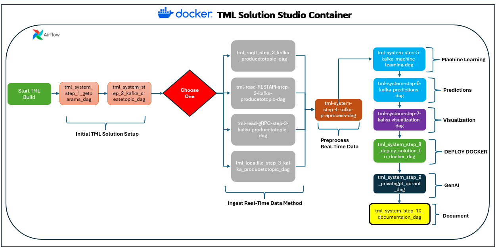
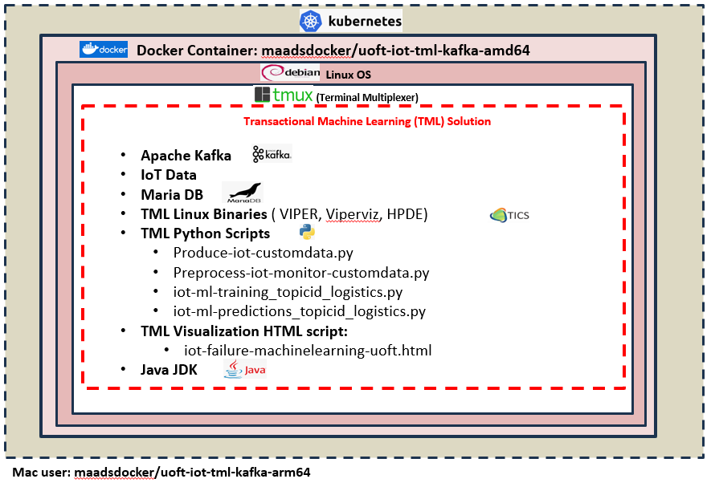

TML Solution Building 
======================

Why Do I Need TML?
----------------

TML is the world's only technology that can perform entity based machine learning, in-memory, on real-time data integrated with Apache Kafka.  Any where you need to process real-time data - you NEED TML.  It can be used in any industry globally.

.. important::
   **TML offers several advantages over conventional Stream Processing:**

   1. Stream Processing from AWS Kinesis, or Spark Streaming - Do Not perform in-memory entity based machine learning or processing of real-time data.  TML Does.

   2. Stream Processing technologies are very expensive. Because TML is comprised of 3 binaries they can be operated like microservices with very little cost 
   overhead (if any) due to in-memory processing of real-time data - this means no external databases are needed for machine learning reducing storage, compute 
   and network transfer costs.

   3. Stream processing solutions still use SQL to process data.  TML uses JSON processing, in-memory, which is faster, cheaper and easier to manage.

   4. Performing machine learning with Streaming processing is difficult, costly, and does not perform entity based machine learning.  TML performs in-memory 
   machine learning at the entity level for each device that is producing real-time data, this makes it very effective to learn each individual device behaviours 
   and predict future behaviours more accurately.

   5. Stream Processing technologies still require lots of code.  TML solutions are low-code or no-code using the TML Solution Studio (TSS).  The TSS uses DAGs 
   that allows users to quickly configure their TML solutions, and automatically deploy it with Docker, automatically generate the documentations for the 
   solution, and commit code to Github repos.  

   6. TML is integrated with GenAI using PrivateGPT and Qdrant vector DB.  This integration makes it the first solution that provides fast AI integrated with 
   real-time data processing and machine learning at the entity level.

   7.  To ingest data from devices TML offers pre-built client python code. Users can easily using gRPC, REST API, MQTT to ingest data directly from devices and 
   stream it to Kafka. Refer to :ref:`STEP 3: Produce to Kafka Topics` for more details.  

Where Is TML Used?
----------------

.. note::
   TML is used by companies and people around the world to process real-time data.  Because TML is free for students and researchers, it is used by thousands of 
   students in Universities and Colleges around the world as official part of the curriculum courses in IoT, Cybersecurity, Machine Learning, Data Science, and 
   Big Data Management courses.

Can I Run TML Binaries in Standalone?
------------------------------------

.. note::
    Yes, the :ref:`TML Solution Components` can be run as standalone.  If you want to learn more please view the Youtube:
    
    1. `TML Crash Course Part 1: <https://youtu.be/yh-qUe5KnaA>`_
    
    2. `TML Crash Course Part 2: <https://youtu.be/ol_BcXgoFVU>`_
    
    3. `TML Crash Course Part 3: <https://youtu.be/u5mcX1xRsvk>`_
    
    4. `TML Crash Course Part 4: <https://youtu.be/jSFDgOKdnbE>`_

TML Solutions Can Be Built In 10 Steps Using Pre-Written DAGs (Directed Acyclic Graphs)
----------------------------------------------------------

Users simply make configuration changes to the DAGs and build the solution.  TML Studio will even automatically containerize your complete solution, and auto generate online documentation.

Where Do I Start?
----------

.. attention::
   **START HERE**: The fastest way to build TML solutions with your real-time data is to use the :ref:`TML Solution Studio (TSS) Container`

Pre-Written 10 Apache Airflow DAGs To Speed Up TML Solution Builds
-------------------

The TML solution process with DAGS (explained in detail below).  **The entire TML solution build process is highly efficient; advanced, scalable, real-time TML solutions can be built in few hours with GenAI integrations!**

DAG Solution Process Explanation
^^^^^^^^^^^^^^^^^^^^^^^^^^

.. note::
    The above process shows Ten (10) DAGs that are used to build advanced, scalable, real-time TML solutions with little to no-code - just configurations to the 
    DAGs.  

    1. Build Process starts with setting up system parameters for **Initial TML Solution Setup**.  Users simply need to provide configuration information in the 
       following DAG:  

       :ref:`STEP 1: Get TML Core Params: tml_system_step_1_getparams_dag`

    2. The next step is to create all your **topics** in Kafka - these topic will store all your input and output data.  This is done in:

       :ref:`STEP 2: Create Kafka Topics: tml_system_step_2_kafka_createtopic_dag`
    
    **Your initial TML setup is complete.**

    Next, you want to start generating and producing data to the topics you creating and choose an **Ingest Real-Time Data Method**.  TML provides you with FOUR 
    (4) methods to stream your own data from any device.  This is done in the following DAGS - you need to CHOOSE ONE method: 

    3. :ref:`STEP 3: Produce to Kafka Topics`

    3a.  MQTT: :ref:`STEP 3a: Produce Data Using MQTT: tml-read-MQTT-step-3-kafka-producetotopic-dag.py`

    3b.  REST API: :ref:`STEP 3b: Produce Data Using RESTAPI: tml-read-RESTAPI-step-3-kafka-producetotopic-dag.py`
    
    3c.  gRPC: :ref:`STEP 3c: Produce Data Using gRPC: tml-read-gRPC-step-3-kafka-producetotopic-dag.py` 
    
    3d.  Local File: :ref:`STEP 3d: Produce Data Using LOCALFILE: tml-read-LOCALFILE-step-3-kafka-producetotopic-dag.py` 

    You are also provided CLIENT files for REST API and gRPC - these clients connect to the SERVERS in 3b and 3c:

    3b.i: :ref:`STEP 3b.i: REST API CLIENT`

    3c.i: :ref:`STEP 3c.i: gRPC API CLIENT`

    You are also provided with an MQTT method - if you are using a MQTT broker for machine to machine communication.

    After you have chosen an ingest data method and producing data, you are ready to **Preprocess Real-Time Data** - the next DAG performs this function:

    4. :ref:`STEP 4: Preprocesing Data: tml-system-step-4-kafka-preprocess-dag.py` - Preprocessing is a very quick way to start generating insights from your real-time in few minutes.  All 
       preprocessing is done **in-memory and no external databases are needed, only Kafka**.  After you have preprocessed your data, you can use this 
       preprocessed data for **machine learning** - the next DAG performs this function.

    5. :ref:`STEP 5: Entity Based Machine Learning : tml-system-step-5-kafka-machine-learning-dag.py` - this is another powerful DAG automatically starts building entity based machine learning models for 
        your real-time data.  Note, TML will continuously build ML models are new data streams in.  All machine learning is done **in-memory and no external 
        databases are needed, only Kafka**.  As these models are trained on your real-time data - the next 
        DAG performs predictions.
    
    6. :ref:`STEP 6: Entity Based Predictions: tml-system-step-6-kafka-predictions-dag` - These predictions get automatically generated in parallel to machine learning training process in DAG 5.  
        As predictions are being generated, you can stream these predictions to a real-time dashboard - the next DAG performs this function.

    7. :ref:`STEP 7: Real-Time Visualization: tml-system-step-7-kafka-visualization-dag` - The visualization data are streamed directly from the TML solution container over websockets to the 
       client browser, this eliminates any need for third-party visualization software.  Now, that you have built the **ENTIRE TML SOLUTION END-END** you are 
       ready to deploy it to Docker - the next DAG performs this function.

    8. :ref:`STEP 8: Deploy TML Solution to Docker : tml-system-step-8-deploy-solution-to-docker-dag.py` - The TML docker container is automatically built for you and pushed to Docker Hub.  If you have 
       chosen to integrate GPT into you solution - you can initiate the PrivateGPT and Qdrant containers - the next DAG performs this function.

    9. :ref:`STEP 9: PrivateGPT and Qdrant Integration: tml-system-step-9-privategpt_qdrant-dag.py` - The TML docker container is automatically built for you and pushed to Docker Hub.  Lastly, you can now 
        automatically document the entire solution - the next DAG performs this function.

    10. :ref:`STEP 10: Create TML Solution Documentation: tml-system-step-10-documentation-dag.py`.  

    **YOU ARE DONE!  You just build an advanced, scalable, end-end real-time solution and deployed it to Docker, integrated with AI and with online 
    documentation.**  
    ENJOY!

DAGs (Directed Acyclic Graphs) are a powerful and easy way to build powerful (real-time) TML solutions quickly.  Users are provided with the following DAGs:

.. note::
   
   The numbers in the DAGs indicate solution process step.  For example, step 2 is dependent on step 1.

DAG Table
^^^^^^^^^^^^^^^^^^

.. list-table::
   :widths: 20 50

   * - **DAG Name**
     - **Description**
   * - tml_system_step_1_getparams_dag
     - This DAG will get the core TML connection and tokens needed for operations.
   * - tml_system_step_2_kafka_createtopic_dag
     - This DAG will create all the necessary topics in Kafka (on-prem or Cloud) for your TML solution. 
   * - tml-read-MQTT-step-3-kafka-producetotopic-dag.py
     - This DAG is an MQTT server and will listen for a connection from a client.  You use this if your TML solution ingests data from MQTT system like HiveMQ and 
       stream it to Kafka.
   * - tml-read-LOCALFILE-step-3-kafka-producetotopic-dag.py
     - This DAG will read a local CSV file for data and stream it to Kafka.
   * - tml-read-gRPC-step-3-kafka-producetotopic-dag
     - This DAG is an gRPC server and will listen for a connection from a gRPC client.  You use this if your TML solution ingests data from devices and you want to 
       leverage a gRPC connection and stream the data to Kafka.
   * - tml-read-RESTAPI-step-3-kafka-producetotopic-dag
     - This DAG is an RESTAPI server and will listen for a connection from a REST client.  You use this if your TML solution ingests data from devices and you want 
       to leverage a rest connection and stream the data to Kafka.
   * - tml-system-step-4-kafka-preprocess-dag
     - This DAG perform entity level preprocessing on the real-time data.  There are over 35 different preprocessing types in TML. 
   * - tml-system-step-5-kafka-machine-learning-dag
     - This DAG perform entity level machine learning on the real-time data.
   * - tml-system-step-6-kafka-predictions-dag
     - This DAG performs predictions using the trained algorithms for every entity.
   * - tml-system-step-7-kafka-visualization-dag
     - This DAG streams the output to a real-time dashboard.
   * - tml_system_step_8_deploy_solution_to_docker_dag
     - This DAG automatically deploys the entire TML solution to Docker container - and pushes it to Dockerhub.
   * - tml_system_step_9_privategpt_qdrant_dag
     - This DAG configures your solution to access the privateGPT and Qdrant containers.
   * - tml_system_step_10_documentation_dag
     - This DAG will automatically create the documentation for your solution on readthedocs.io.

STEP 1: Get TML Core Params: tml_system_step_1_getparams_dag
^^^^^^^^^^^^^^^^^^^^

Below is the complete definition of the **tml_system_step_1_getparams_dag**.  Users only need to configure the code highlighted in the **USER CHOSEN PARAMETERS**.

.. code-block:: PYTHON
   :emphasize-lines: 10,11,12,13,14,15,16,17,18,19
 
   from airflow import DAG
   from airflow.operators.python import PythonOperator
   from airflow.operators.bash import BashOperator
   import datetime
   from airflow.decorators import dag, task
   import os 
   import sys
   import maadstml  

   sys.dont_write_bytecode = True
   ######################################################USER CHOSEN PARAMETERS ###########################################################
   default_args = {
   'owner': 'Sebastian Maurice',  # <<< ******** change as needed 
   'start_date': datetime.datetime (2024, 6, 29),
   'brokerhost' : '127.0.0.1',  # <<<<***************** THIS WILL ACCESS LOCAL KAFKA - YOU CAN CHANGE TO CLOUD KAFKA HOST
   'brokerport' : '9092',     # <<<<***************** LOCAL AND CLOUD KAFKA listen on PORT 9092
   'cloudusername' : '',  # <<<< --------FOR KAFKA CLOUD UPDATE WITH API KEY  - OTHERWISE LEAVE BLANK
   'cloudpassword' : '',  # <<<< --------FOR KAFKA CLOUD UPDATE WITH API SECRET - OTHERWISE LEAVE BLANK   
   'retries': 1,
   }  
   ############################################################### DO NOT MODIFY BELOW ####################################################
   # Instantiate your DAG
   @dag(dag_id="tml_system_step_1_getparams_dag", default_args=default_args, tags=["tml-system-step-1-getparams"], schedule=None, 
    start_date=datetime.datetime(2022, 3, 4), catchup=False)
   def tmlparams():
      # Define tasks
    basedir = "/"
    viperconfigfile=basedir + "/Viper-produce/viper.env"
  
    def updateviperenv():
    # update ALL
      filepaths = ['/Viper-produce/viper.env','/Viper-preprocess/viper.env','/Viper-preprocess2/viper.env','/Viper-ml/viper.env','/Viperviz/viper.env']
      for mainfile in filepaths:
          with open(mainfile, 'r', encoding='utf-8') as file: 
            data = file.readlines() 
          r=0 
          for d in data:
             if 'KAFKA_CONNECT_BOOTSTRAP_SERVERS' in d: 
               data[r] = "KAFKA_CONNECT_BOOTSTRAP_SERVERS={}:{}".format(default_args['brokerhost'],default_args['brokerport'])
             if 'CLOUD_USERNAME' in d: 
               data[r] = "CLOUD_USERNAME={}".format(default_args['cloudusername'])
             if 'CLOUD_PASSWORD' in d: 
               data[r] = "CLOUD_PASSWORD={}".format(default_args['cloudpassword'])
                  
             r += 1
          with open(mainfile, 'w', encoding='utf-8') as file: 
            file.writelines(data)
  
    @task(task_id="getparams")
    def getparams(args):
       VIPERHOST=""
       VIPERPORT=""
       HTTPADDR="http://"
       HPDEHOST=""
       HPDEPORT=""
       VIPERTOKEN = ""
      
       with open(basedir + "/Viper-produce/admin.tok", "r") as f:
          VIPERTOKEN=f.read()
  
       if VIPERHOST=="":
          with open(basedir + '/Viper-produce/viper.txt', 'r') as f:
            output = f.read()
            VIPERHOST = HTTPADDR + output.split(",")[0]
            VIPERPORT = output.split(",")[1]
          with open('/Hpde/hpde.txt', 'r') as f:
            output = f.read()
            HPDEHOST = HTTPADDR + output.split(",")[0]
            HPDEPORT = output.split(",")[1]
  
       ti.xcom_push(key='VIPERTOKEN',value=VIPERTOKEN)
       ti.xcom_push(key='VIPERHOST',value=VIPERHOST)
       ti.xcom_push(key='VIPERPORT',value=VIPERPORT)
       ti.xcom_push(key='HTTPADDR',value=HTTPADDR)
       ti.xcom_push(key='HPDEHOST',value=HPDEHOST)
       ti.xcom_push(key='HPDEPORT',value=HPDEPORT)
               
       updateviperenv()
             
    tmlsystemparams=getparams(default_args)
      
   dag = tmlparams()

STEP 2: Create Kafka Topics: tml_system_step_2_kafka_createtopic_dag
^^^^^^^^^^^^^^^^^^^^^^^

Below is the complete definition of the **tml_system_step_2_kafka_createtopic_dag** that creates all the topics for your solution.  Users only need to configure the code highlighted in the **USER CHOSEN PARAMETERS**.

.. code-block:: PYTHON
   :emphasize-lines: 12,13,14,15,16,17,18,19,20,21,22,23,24,25,26,27,28,29,30,31,32

   from airflow import DAG
   from airflow.operators.python import PythonOperator
   from airflow.operators.bash import BashOperator

   from datetime import datetime
   from airflow.decorators import dag, task
   import maadstml 
   import sys
   
   sys.dont_write_bytecode = True
   ######################################## USER CHOOSEN PARAMETERS ################################################################################
   default_args = {
    'owner' : 'Sebastian Maurice', # <<< ********** You change as needed
    'companyname': 'Otics',  # <<< ********** You change as needed
     'myname' : 'Sebastian',  # <<< ********** You change as needed
     'myemail' : 'Sebastian.Maurice',  # <<< ********** You change as needed
     'mylocation' : 'Toronto',  # <<< ********** You change as needed
     'replication' : 1,  # <<< ********** You change as needed (For Cloud Kafka this is MUST be >= 3
     'numpartitions': 1,  # <<< ********** You change as needed
     'enabletls': 1,  # <<< ********** You change as needed
     'brokerhost' : '',  # <<< ********** You change as needed
     'brokerport' : -999,  # <<< ********** You change as needed
     'microserviceid' : '',  # <<< ********** You change as needed
     'raw_data_topic' : 'iot-raw-data', # Separate multiple topics with comma <<< ********** You change topic names as needed
     'preprocess_data_topic' : 'iot-preprocess-data,iot-preprocess2-data', # Separate multiple topics with comma <<< ********** You change topic names as needed
     'ml_data_topic' : 'ml-data', # Separate multiple topics with comma <<< ********** You change topic names as needed
     'prediction_data_topic' : 'prediction-data', # Separate multiple topics with comma <<< ********** You change topic names as needed
     'description' : 'Topics to store iot data',  # <<< **** You modify as needed
     'start_date': datetime (2024, 6, 29), # <<< **** You modify as needed
     'retries': 1,    # <<< **** You modify as needed
   } 
   ############################################################### DO NOT MODIFY BELOW #######################################################################
   
   # Instantiate your DAG
   @dag(dag_id="tml_system_step_2_kafka_createtopic_dag", default_args=default_args, tags=["tml-system-step-2-kafka-createtopic"], schedule=None,catchup=False)
   def startkafkasetup():
     @task(task_id="setupkafkatopics")
     def setupkafkatopic(args):
        # Set personal data
         companyname=args['companyname']
         myname=args['myname']
         myemail=args['myemail']
         mylocation=args['mylocation']
   
         # Replication factor for Kafka redundancy
         replication=args['replication']
         # Number of partitions for joined topic
         numpartitions=args['numpartitions']
         # Enable SSL/TLS communication with Kafka
         enabletls=args['enabletls']
         # If brokerhost is empty then this function will use the brokerhost address in your
         # VIPER.ENV in the field 'KAFKA_CONNECT_BOOTSTRAP_SERVERS'
         brokerhost=args['brokerhost']
         # If this is -999 then this function uses the port address for Kafka in VIPER.ENV in the
         # field 'KAFKA_CONNECT_BOOTSTRAP_SERVERS'
         brokerport=args['brokerport']
         # If you are using a reverse proxy to reach VIPER then you can put it here - otherwise if
         # empty then no reverse proxy is being used
         microserviceid=args['microserviceid']
           
         VIPERTOKEN = ti.xcom_pull(dag_id='tml_system_step_1_getparams_dag',task_ids='getparams',key="VIPERTOKEN")
         VIPERHOST = ti.xcom_pull(dag_id='tml_system_step_1_getparams_dag',task_ids='getparams',key="VIPERHOST")
         VIPERPORT = ti.xcom_pull(dag_id='tml_system_step_1_getparams_dag',task_ids='getparams',key="VIPERPORT")
   
         #############################################################################################################
         #                         CREATE TOPIC TO STORE TRAINED PARAMS FROM ALGORITHM  
         
         topickeys = ['raw_data_topic','preprocess_data_topic','ml_data_topic','prediction_data_topic'] 
       
         for k in topickeys:
           producetotopic=args[k]
           description=args['description']
       
           topicsarr = producetotopic.split(",")
         
           for topic in topicsarr:  
             result=maadstml.vipercreatetopic(VIPERTOKEN,VIPERHOST,VIPERPORT,topic,companyname,
                                        myname,myemail,mylocation,description,enabletls,
                                        brokerhost,brokerport,numpartitions,replication,
                                        microserviceid='')
             print("Result=",result)
   
         setupkafkatopic(default_args)
         
         
   dag = startkafkasetup()

STEP 3: Produce to Kafka Topics
^^^^^^^^^^^^^^^^^^^^^^^^^^

.. attention::

   You must CHOOSE how you want to ingest data and produce to a Kafka topic.  

   **TML solution provides 4 (FOUR) ways to ingest data and produce to a topic: MQTT, gRPC, RESTAPI, LOCALFILE.**  The following DAGs in the table are SERVER 
   files.  These server files wait for connections from the client files. For further convenience, client files are provides to access the server DAGs below.

.. list-table::

   * - **Data Ingest DAG Name**
     - **Client File Name**
     - **Description**
   * - tml-read-MQTT-step-3-kafka-producetotopic-dag.py
     - An **on_message(client, userdata, msg)** event is triggered by the MQTT broker.  This DAGs will automatically handle the on_message event
       and produce the data to Kafka.
     - This DAG is an MQTT server and will listen for a connection from a client.  
       You use this if your TML solution ingests data from MQTT system like HiveMQ and 
       stream it to Kafka.
   * - tml-read-LOCALFILE-step-3-kafka-producetotopic-dag.py
     - You can process a localfile and stream the data to kafka.  See the `IoTSolution DAG <https://github.com/smaurice101/raspberrypi/blob/main/tml-airflow/dags/tml-iotsolution-step-3-kafka-producetotopic-dag.py>`_
     - This DAG will read a local CSV file for data and stream it to Kafka.
   * - tml-read-gRPC-step-3-kafka-producetotopic-dag
     - Here is the gRPC client: `tml-read-gRPC-step-3-kafka-producetotopic-dag <https://github.com/smaurice101/raspberrypi/blob/main/tml-airflow/dags/tml-client- 
       gRPC-step-3-kafka-producetotopic.py>`_
       NOTE: For this client you will also need: `tml_grpc_pb2_grpc <https://github.com/smaurice101/raspberrypi/blob/main/tml- 
       airflow/dags/tml_grpc_pb2_grpc.py>`_, and `tml_grpc_pb2 <https://github.com/smaurice101/raspberrypi/blob/main/tml-airflow/dags/tml_grpc_pb2.py>`_
     - This DAG is an gRPC server and will listen for a connection from a gRPC client.  You use this if your TML 
       solution ingests data from devices and you want to 
       leverage a gRPC connection and stream the data to Kafka.
   * - tml-read-RESTAPI-step-3-kafka-producetotopic-dag
     - Here is the RESTAPI client: `tml-client-RESTAPI-step-3-kafka-producetotopic.py <https://github.com/smaurice101/raspberrypi/blob/main/tml-airflow/dags/tml- 
       client-RESTAPI-step-3-kafka-producetotopic.py>`_
     - This DAG is an RESTAPI server and will listen for a connection from a REST client.  You use this if your TML 
       solution ingests data from devices and you want 
       to leverage a rest connection and stream the data to Kafka.
   
STEP 3a: Produce Data Using MQTT: tml-read-MQTT-step-3-kafka-producetotopic-dag.py
""""""""""""""""""""""""""" 	

.. code-block:: PYTHON
   :emphasize-lines: 16,17,18,19,20,21,22,23,24,25,26,27,28,29,30

   from airflow import DAG
   from airflow.operators.python import PythonOperator
   from airflow.operators.bash import BashOperator
   from datetime import datetime
   from airflow.decorators import dag, task
   import paho.mqtt.client as paho
   from paho import mqtt
   import sys
   import maadstml   

   sys.dont_write_bytecode = True
   ##################################################  MQTT SERVER #####################################
   # This is a MQTT server that will handle connections from a client.  It will handle connections
   # from an MQTT client for on_message, on_connect, and on_subscribe
   
   ######################################## USER CHOOSEN PARAMETERS ########################################
   default_args = {
     'owner' : 'Sebastian Maurice',  # <<< **** You modify as needed
     'enabletls': 1,   # <<< #**** 1=connections are TLS encrypted
     'microserviceid' : '', # **** leave as is
     'producerid' : 'iotsolution',  # <<< **** You modify as needed
     'topics' : 'iot-raw-data', # ******* This is one of the topic you created in SYSTEM STEP 2
     'identifier' : 'TML solution',  # <<< **** You modify as needed
     'mqtt_broker' : '', # <<<****** Enter MQTT broker i.e. test.mosquitto.org
     'mqtt_port' : '', # <<<******** Enter MQTT port i.e. 1883    
     'mqtt_subscribe_topic' : '', # <<<******** enter name of MQTT to subscribe to i.e. encyclopedia/#  
     'delay' : 7000, # << ******* 7000 millisecond maximum delay for VIPER to wait for Kafka to return confirmation message is received and written to topic
     'topicid' : -999, # <<< ********* do not modify      
     'start_date': datetime (2024, 6, 29), # <<< **** You modify as needed
     'retries': 1,  # <<< **** You modify as needed  
   }
   ######################################## DO NOT MODIFY BELOW #############################################
   
   # Instantiate your DAG
   @dag(dag_id="tml_mqtt_step_3_kafka_producetotopic_dag", default_args=default_args, tags=["tml-mqtt-step-3-kafka-producetotopic"], schedule=None,catchup=False)
   def startproducingtotopic():
     # This sets the lat/longs for the IoT devices so it can be map
     VIPERTOKEN=""
     VIPERHOST=""
     VIPERPORT=""
       
     # setting callbacks for different events to see if it works, print the message etc.
     def on_connect(client, userdata, flags, rc, properties=None):
       print("CONNACK received with code %s." % rc)
   
     # print which topic was subscribed to
     def on_subscribe(client, userdata, mid, granted_qos, properties=None):
       print("Subscribed: " + str(mid) + " " + str(granted_qos))
   
     data = ''
     def on_message(client, userdata, msg):
       global data
       data=json.loads(msg.payload.decode("utf-8"))
       print(msg.payload.decode("utf-8"))
       readdata(data)
       
     @task(task_id="mqttserverconnect")
     def mqttserverconnect():
        client = paho.Client(paho.CallbackAPIVersion.VERSION2)
        mqttBroker = default_args['mqtt_broker'] 
        mqttport = default_args['mqtt_port']
        client.connect(mqttBroker,mqttport)
       
        if client:
          client.on_subscribe = on_subscribe
          client.on_message = on_message
          client.subscribe(args['mqtt_subscribe_topic'], qos=1)            
          client.on_connect = on_connect
       
          client.loop_start()
       
     def producetokafka(value, tmlid, identifier,producerid,maintopic,substream,args):
        inputbuf=value     
        topicid=args['topicid']
     
        # Add a 7000 millisecond maximum delay for VIPER to wait for Kafka to return confirmation message is received and written to topic 
        delay=args['delay']
        enabletls = args['enabletls']
        identifier = args['identifier']
   
        try:
           result=maadstml.viperproducetotopic(VIPERTOKEN,VIPERHOST,VIPERPORT,maintopic,producerid,enabletls,delay,'','', '',0,inputbuf,substream,
                                               topicid,identifier)
        except Exception as e:
           print("ERROR:",e)
   
     @task(task_id="gettmlsystemsparams")         
     def gettmlsystemsparams(rc):
       VIPERTOKEN = ti.xcom_pull(dag_id='tml_system_step_1_getparams_dag',task_ids='getparams',key="VIPERTOKEN")
       VIPERHOST = ti.xcom_pull(dag_id='tml_system_step_1_getparams_dag',task_ids='getparams',key="VIPERHOST")
       VIPERPORT = ti.xcom_pull(dag_id='tml_system_step_1_getparams_dag',task_ids='getparams',key="VIPERPORT")
       
       return [VIPERTOKEN,VIPERHOST,VIPERPORT]
           
     def readdata(valuedata):
         # MAin Kafka topic to store the real-time data
         maintopic = default_args['topics']
         producerid = default_args['producerid']
         try:
             producetokafka(valuedata.strip(), "", "",producerid,maintopic,"",default_args)
             # change time to speed up or slow down data   
             #time.sleep(0.15)
         except Exception as e:
             print(e)  
             pass  
         
     gettmlsystemsparams(mqttserverconnect())
       
   dag = startproducingtotopic()

.. note:: 
   **There is no MQTT client because MQTT is machine to machine communication**, which means if a machine is writing to an MQTT broker, the above DAG 
   automatically 
   gets an **on_message(client, userdata, msg)** event and streams the data to Kafka.   This is a powerful way to use TML with MQTT to process real-time data 
   instantly.
   
STEP 3b: Produce Data Using RESTAPI: tml-read-RESTAPI-step-3-kafka-producetotopic-dag.py
"""""""""""""""""""""""""""""""""""""""" 	

.. code-block:: PYTHON
   :emphasize-lines: 19,20,21,22,23,24,25,26,27,28,29,30,31

   import maadstml
   from airflow import DAG
   from airflow.operators.python import PythonOperator
   from airflow.operators.bash import BashOperator
   import json
   from datetime import datetime
   from airflow.decorators import dag, task
   from flask import Flask
   import sys
   
   sys.dont_write_bytecode = True
   ##################################################  REST API SERVER #####################################
   # This is a REST API server that will handle connections from a client
   # There are two endpoints you can use to stream data to this server:
   # 1. jsondataline -  You can POST a single JSONs from your client app. Your json will be streamed to Kafka topic.
   # 2. jsondataarray -  You can POST JSON arrays from your client app. Your json will be streamed to Kafka topic.
   
   ######################################## USER CHOOSEN PARAMETERS ########################################
   default_args = {
     'owner' : 'Sebastian Maurice', # <<< **** You modify as needed   
     'enabletls': 1, # <<< **** 1=Connection is TLS encrypted
     'microserviceid' : '', # <<< **** Leave as is
     'producerid' : 'iotsolution',  # <<< **** You modify as needed   
     'topics' : 'iot-raw-data', # *************** This is one of the topic you created in SYSTEM STEP 2
     'identifier' : 'TML solution',  # <<< **** You modify as needed   
     'rest_port' : 9001,  # <<< ***** replace replace with port number i.e. this is listening on port 9000 
     'delay' : 7000, # << ******* 7000 millisecond maximum delay for VIPER to wait for Kafka to return confirmation message is received and written to topic
     'topicid' : -999, # <<< ********* do not modify          
     'start_date': datetime (2024, 6, 29), # <<< **** You modify as needed   
     'retries': 1, # <<< **** You modify as needed   
   }
   ######################################## DO NOT MODIFY BELOW #############################################
   
   # Instantiate your DAG
   @dag(dag_id="tml-read-RESTAPI-step-3-kafka-producetotopic-dag", default_args=default_args, tags=["tml-read-RESTAPI-step-3-kafka-producetotopic-dag"], schedule=None,catchup=False)
   def startproducingtotopic():
     # This sets the lat/longs for the IoT devices so it can be map
     VIPERTOKEN=""
     VIPERHOST=""
     VIPERPORT=""
       
   
     def producetokafka(value, tmlid, identifier,producerid,maintopic,substream,args):
        inputbuf=value     
        topicid=args['topicid']
     
        # Add a 7000 millisecond maximum delay for VIPER to wait for Kafka to return confirmation message is received and written to topic 
        delay=args['delay']
        enabletls = args['enabletls']
        identifier = args['identifier']
   
        try:
           result=maadstml.viperproducetotopic(VIPERTOKEN,VIPERHOST,VIPERPORT,maintopic,producerid,enabletls,delay,'','', '',0,inputbuf,substream,
                                               topicid,identifier)
        except Exception as e:
           print("ERROR:",e)
   
     @task(task_id="gettmlsystemsparams")         
     def gettmlsystemsparams():
       VIPERTOKEN = ti.xcom_pull(dag_id='tml_system_step_1_getparams_dag',task_ids='getparams',key="VIPERTOKEN")
       VIPERHOST = ti.xcom_pull(dag_id='tml_system_step_1_getparams_dag',task_ids='getparams',key="VIPERHOST")
       VIPERPORT = ti.xcom_pull(dag_id='tml_system_step_1_getparams_dag',task_ids='getparams',key="VIPERPORT")
   
       if VIPERHOST != "":
           app = Flask(__name__)
           app.run(port=default_args['rest_port'])
   
           @app.route('/jsondataline', methods=['POST'])
           def storejsondataline():
             jdata = request.get_json()
             readdata(jdata)
   
           @app.route('/jsondataarray', methods=['POST'])
           def storejsondataarray():    
             jdata = request.get_json()
             json_array = json.load(jdata)
             for item in json_array: 
                readdata(item)
           
   
        #return [VIPERTOKEN,VIPERHOST,VIPERPORT]
           
     def readdata(valuedata):
         args = default_args    
   
         # MAin Kafka topic to store the real-time data
         maintopic = args['topics']
         producerid = args['producerid']
         try:
             producetokafka(valuedata.strip(), "", "",producerid,maintopic,"",args)
             # change time to speed up or slow down data   
             #time.sleep(0.15)
         except Exception as e:
             print(e)  
             pass  
     
     gettmlsystemsparams()   
   
   dag = startproducingtotopic()

STEP 3b.i: REST API CLIENT
"""""""""""""""""""""""""""""""""""""""" 	

`tml-client-RESTAPI-step-3-kafka-producetotopic.py <https://github.com/smaurice101/raspberrypi/blob/main/tml-airflow/dags/tml-client-RESTAPI-step-3-kafka-producetotopic.py>`_

.. code-block:: PYTHON
   :emphasize-lines: 7,13,15,17,25,29

    import requests
    import sys
    
    sys.dont_write_bytecode = True
     
    # defining the api-endpoint
    rest_port = "9001"  # <<< ***** Change Port to match the Server Rest_PORT
    
    # Modify the apiroute: jsondataline, or jsondataarray
    # 1. jsondataline: You can send One Json message at a time
    # 2. jsondatarray: You can send a Json array 
    
    apiroute = "jsondataline"
    
    API_ENDPOINT = "http://localhost:{}/{}".format(rest_port,apiroute)
     
    def send_tml_data(data): 
      # data to be sent to api
     
      # sending post request and saving response as response object
      r = requests.post(url=API_ENDPOINT, data=data)
     
      # extracting response text
      return r.text
        
    def start():
        
          ######### Modify datajson as you need ##############  
          try:  
            datajson = {"Type": "data1 data 2", "Value": "value 1"}   # << ** This json would normal come from some device, or you read from a file   
            ret = send_tml_data(datajson)
            print(ret)  
          except Exception as e:
            print("ERROR: ",e) 
            
    if __name__ == '__main__':
        start()

STEP 3b.i: REST API CLIENT: Explanation
""""""""""""""""""""""""""""

The REST API client runs outside the TML solution container.  The client api gives you the capability of connecting to your internal systems or devices and stream the data directly to the TML server producer.  The TML server producer receives data from REST API client and produces the data to Kafka.

.. important:: 
   The REST API client runs outside the TML solution container.  This is a very simple and convenient way to stream any type of json data from any device in your 
   environment.

.. list-table::

   * - **Client Core Variables**
     - **Explanation**
   * - rest_port
     - This is the same rest_port Json field in :ref:`STEP 3b: Produce Data Using RESTAPI: tml-read-RESTAPI-step-3-kafka-producetotopic-dag.py`
   * - apiroute
     - This indicates how you are sending your Json message.   You have two options: 

       1. jsondataline: You can send One Json message at a time in each Api call
       2. jsondatarray: You can send a Json array in each Api call

       Note: Your Json must be a valid Json.  Just store your json in **datajson** 
   * - API_ENDPOINT 
     - API_ENDPOINT = "http://localhost:{}/{}".format(rest_port,apiroute)

       This connects to the endpoint defined in :ref:`STEP 3b: Produce Data Using RESTAPI: tml-read-RESTAPI-step-3-kafka-producetotopic-dag.py`    
   * - start()
     - This function starts the process.

       Note: You can simply modify this function as you wish repeatly to stream your data.
   * - send_tml_data(data)
     - This is the main function that streams your data to :ref:`STEP 3b: Produce Data Using RESTAPI: tml-read-RESTAPI-step-3-kafka-producetotopic-dag.py`

STEP 3c: Produce Data Using gRPC: tml-read-gRPC-step-3-kafka-producetotopic-dag.py
""""""""""""""""""""""""""""""""""""""""" 	

.. code-block:: PYTHON
   :emphasize-lines: 22,23,24,25,26,27,28,29,30,31,32,33,34

   import maadstml
   from airflow import DAG
   from airflow.operators.python import PythonOperator
   from airflow.operators.bash import BashOperator
   from datetime import datetime
   from airflow.decorators import dag, task
   import grpc
   from concurrent import futures
   import time
   import tml_grpc_pb2_grpc as pb2_grpc
   import tml_grpc_pb2 as pb2
   import sys
   
   sys.dont_write_bytecode = True
   ##################################################  gRPC SERVER ###############################################
   # This is a gRPCserver that will handle connections from a client
   # There are two endpoints you can use to stream data to this server:
   # 1. jsondataline -  You can POST a single JSONs from your client app. Your json will be streamed to Kafka topic.
   # 2. jsondataarray -  You can POST JSON arrays from your client app. Your json will be streamed to Kafka topic.
   
   ######################################## USER CHOOSEN PARAMETERS ########################################
   default_args = {
     'owner' : 'Sebastian Maurice',    
     'enabletls': 1,
     'microserviceid' : '',
     'producerid' : 'iotsolution',  
     'topics' : 'iot-raw-data', # *************** This is one of the topic you created in SYSTEM STEP 2
     'identifier' : 'TML solution',  
     'gRPC_Port' : 9001,  # <<< ***** replace with gRPC port i.e. this gRPC server listening on port 9001 
     'delay' : 7000, # << ******* 7000 millisecond maximum delay for VIPER to wait for Kafka to return confirmation message is received and written to topic
     'topicid' : -999, # <<< ********* do not modify          
     'start_date': datetime (2024, 6, 29),
     'retries': 1,
   }   
   ######################################## DO NOT MODIFY BELOW #############################################
   
   # Instantiate your DAG
   @dag(dag_id="tml-read-gRPC-step-3-kafka-producetotopic-dag", default_args=default_args, tags=["tml-read-gRPC-step-3-kafka-producetotopic-dag"], schedule=None,catchup=False)
   def startproducingtotopic():
     # This sets the lat/longs for the IoT devices so it can be map
     VIPERTOKEN=""
     VIPERHOST=""
     VIPERPORT=""
   
     class TmlprotoService(pb2_grpc.TmlprotoServicer):
   
       def __init__(self, *args, **kwargs):
           pass
   
       def GetServerResponse(self, request, context):
   
           # get the string from the incoming request
           message = request.message
           readata(message)
           #result = f'Hello I am up and running received "{message}" message from you'
           #result = {'message': result, 'received': True}
   
           #return pb2.MessageResponse(**result)
       
     @task(task_id="serve")  
     def serve():
       server = grpc.server(futures.ThreadPoolExecutor(max_workers=10))
       pb2_grpc.add_UnaryServicer_to_server(UnaryService(), server)
       server.add_insecure_port("[::]:{}".format(default_args['gRPC_Port']))
       server.start()
       server.wait_for_termination()
       
     def producetokafka(value, tmlid, identifier,producerid,maintopic,substream,args):
        inputbuf=value     
        topicid=args['topicid']
     
        # Add a 7000 millisecond maximum delay for VIPER to wait for Kafka to return confirmation message is received and written to topic 
        delay=args['delay']
        enabletls = args['enabletls']
        identifier = args['identifier']
   
        try:
           result=maadstml.viperproducetotopic(VIPERTOKEN,VIPERHOST,VIPERPORT,maintopic,producerid,enabletls,delay,'','', '',0,inputbuf,substream,
                                               topicid,identifier)
        except Exception as e:
           print("ERROR:",e)
   
     @task(task_id="gettmlsystemsparams")         
     def gettmlsystemsparams():
       VIPERTOKEN = ti.xcom_pull(dag_id='tml_system_step_1_getparams_dag',task_ids='getparams',key="VIPERTOKEN")
       VIPERHOST = ti.xcom_pull(dag_id='tml_system_step_1_getparams_dag',task_ids='getparams',key="VIPERHOST")
       VIPERPORT = ti.xcom_pull(dag_id='tml_system_step_1_getparams_dag',task_ids='getparams',key="VIPERPORT")
       
       return [VIPERTOKEN,VIPERHOST,VIPERPORT]
           
             
     def readdata(valuedata):
         args = default_args
         # MAin Kafka topic to store the real-time data
         maintopic = args['topics']
         producerid = args['producerid']
       
         try:
             producetokafka(valuedata.strip(), "", "",producerid,maintopic,"",args)
             # change time to speed up or slow down data   
             time.sleep(0.15)
         except Exception as e:
             print(e)  
             pass  
     
       
     serve()
   
   dag = startproducingtotopic()

STEP 3c.i: gRPC API CLIENT
"""""""""""""""""""""""""""""""""""""""" 	

: `tml-client-gRPC-step-3-kafka-producetotopic.py <https://github.com/smaurice101/raspberrypi/blob/main/tml-airflow/dags/tml-client-gRPC-step-3-kafka-producetotopic.py>`_

.. code-block:: PYTHON
   :emphasize-lines: 2,3,14,15,28,35
  
    import grpc
    import tml_grpc_pb2_grpc as pb2_grpc
    import tml_grpc_pb2 as pb2
    import sys
    
    sys.dont_write_bytecode = True
    
    class TmlgrpcClient(object):
        """
        Client for gRPC functionality
        """
    
        def __init__(self):
            self.host = 'localhost'
            self.server_port = 9001 # <<<<*********** Change to gRPC server port
    
            # instantiate a channel
            self.channel = grpc.insecure_channel(
                '{}:{}'.format(self.host, self.server_port))
    
            # bind the client and the server
            self.stub = pb2_grpc.TmlprotoStub(self.channel)
    
        def get_url(self, message):
            """
            Client function to call the rpc for GetServerResponse
            """
            message = pb2.Message(message=message)
            print(f'{message}')
            return self.stub.GetServerResponse(message)
        
    if __name__ == '__main__':
        try:
          client = TmlgrpcClient()
          result = client.get_url(message="PUT YOUR DATA HERE")
          print(f'{result}')
        except Exception as e:
          print("ERROR: ",e)

STEP 3c.i: gRPC API CLIENT: Explanation
""""""""""""""""""""""""""""

The gRPC API client runs outside the TML solution container.  The client api gives you the capability of connecting to your internal systems or devices and stream the data directly to the TML server producer.  The TML server producer receives data from gRPC API client and produces the data to Kafka.

.. important:: 
   The gRPC API client runs outside the TML solution container.  This is a very simple and convenient way to stream any type of json data from any device in your 
   environment.

.. list-table::

   * - **Client Core Variables**
     - **Explanation**
   * - gRPC imports
     - You will need the gRPC imports:

         1. `tml_grpc_pb2_grpc <https://github.com/smaurice101/raspberrypi/blob/main/tml-airflow/dags/tml_grpc_pb2_grpc.py>`_ as pb2_grpc
         2. `tml_grpc_pb2 <https://github.com/smaurice101/raspberrypi/blob/main/tml-airflow/dags/tml_grpc_pb2.py>`_ as pb2
         3. `tml_grpc.proto <https://github.com/smaurice101/raspberrypi/blob/main/tml-airflow/dags/tml_grpc.proto>`_

       Simply download and place these files in the same folder as your gRPC client.
   * - connection parameters
     - You need to set:
      
       1. self.host = 'localhost'
       2. self.server_port = 9001 # This the gRPC_port in :ref:`STEP 3c: Produce Data Using gRPC: tml-read-gRPC-step-3-kafka-producetotopic-dag.py`
   * - message
     - You put your Json message here:  **client.get_url(message="PUT YOUR DATA HERE")**

STEP 3d: Produce Data Using LOCALFILE: tml-read-LOCALFILE-step-3-kafka-producetotopic-dag.py
"""""""""""""""""""""""""""""""""""""""""" 	

.. code-block:: PYTHON
   :emphasize-lines: 10,11,12,13,14,15,16,17,18,19,20,21,22,23

   from airflow import DAG
   from airflow.operators.python import PythonOperator
   from airflow.operators.bash import BashOperator
   from datetime import datetime
   from airflow.decorators import dag, task
   import sys
   import maadstml   

   sys.dont_write_bytecode = True
   ######################################## USER CHOOSEN PARAMETERS ########################################
   default_args = {
     'owner' : 'Sebastian Maurice',    
     'enabletls': 1,
     'microserviceid' : '',
     'producerid' : 'iotsolution',  
     'topics' : 'iot-raw-data', # *************** This is one of the topic you created in SYSTEM STEP 2
     'identifier' : 'TML solution',  
     'inputfile' : '/rawdata/?',  # <<< ***** replace ?  to input file name to read. NOTE this data file should be JSON messages per line and stored in the HOST folder mapped to /rawdata folder 
     'delay' : 7000, # << ******* 7000 millisecond maximum delay for VIPER to wait for Kafka to return confirmation message is received and written to topic
     'topicid' : -999, # <<< ********* do not modify  
     'start_date': datetime (2024, 6, 29),
     'retries': 1,
   }  
   ######################################## DO NOT MODIFY BELOW #############################################
   
   # Instantiate your DAG
   @dag(dag_id="tml_localfile_step_3_kafka_producetotopic_dag", default_args=default_args, tags=["tml-localfile-step-3-kafka-producetotopic"], schedule=None,catchup=False)
   def startproducingtotopic():
     # This sets the lat/longs for the IoT devices so it can be map
     VIPERTOKEN=""
     VIPERHOST=""
     VIPERPORT=""
       
     
     def producetokafka(value, tmlid, identifier,producerid,maintopic,substream,args):
        inputbuf=value     
        topicid=args['topicid']
     
        # Add a 7000 millisecond maximum delay for VIPER to wait for Kafka to return confirmation message is received and written to topic 
        delay = args['delay']
        enabletls = args['enabletls']
        identifier = args['identifier']
   
        try:
           result=maadstml.viperproducetotopic(VIPERTOKEN,VIPERHOST,VIPERPORT,maintopic,producerid,enabletls,delay,'','', '',0,inputbuf,substream,
                                               topicid,identifier)
        except Exception as e:
           print("ERROR:",e)
   
     @task(task_id="gettmlsystemsparams")         
     def gettmlsystemsparams():
       VIPERTOKEN = ti.xcom_pull(dag_id='tml_system_step_1_getparams_dag',task_ids='getparams',key="VIPERTOKEN")
       VIPERHOST = ti.xcom_pull(dag_id='tml_system_step_1_getparams_dag',task_ids='getparams',key="VIPERHOST")
       VIPERPORT = ti.xcom_pull(dag_id='tml_system_step_1_getparams_dag',task_ids='getparams',key="VIPERPORT")
       
       return [VIPERTOKEN,VIPERHOST,VIPERPORT]
           
     @task(task_id="readdata")        
     def readdata(params):
         args = default_args    
         basedir = '/'  
         inputfile=basedir + args['inputfile']
   
         # MAin Kafka topic to store the real-time data
         maintopic = args['topics']
         producerid = args['producerid']
       
         k=0
   
         file1 = open(inputfile, 'r')
         print("Data Producing to Kafka Started:",datetime.datetime.now())
   
         while True:
           line = file1.readline()
           line = line.replace(";", " ")
           # add lat/long/identifier
           k = k + 1
           try:
             if not line or line == "":
               #break
               file1.seek(0)
               k=0
               print("Reached End of File - Restarting")
               print("Read End:",datetime.datetime.now())
               continue
   
             producetokafka(line.strip(), "", "",producerid,maintopic,"",args)
             # change time to speed up or slow down data   
             #time.sleep(0.15)
           except Exception as e:
             print(e)  
             pass  
     
         file1.close()
       
     readdata(gettmlsystemsparams())
       
   dag = startproducingtotopic()

Producing Data Using a Local File
"""""""""""""""""""""""""""""""""""

.. important:: 
    If you are producing data by reading from a local file, you must ensure that when you run the :ref:`TSS Docker Run Command` that you map a volume on your 
    host system to the **rawdata** folder in the container.  For example, you need add 1. to the docker run command:

     1. **-v <path to a local folder on your machine>:/rawdata**

       For example, your TSS Docker Run should look similar to this - replace **/your_localmachine/foldername** with actual name:

        docker run -d --net="host"

        --env MAINHOST=127.0.0.1
        
        --env AIRFLOWPORT=9000
        
        -v /var/run/docker.sock:/var/run/docker.sock:z
        
        **-v /your_localmachine/foldername:/rawdata:z**
        
        --env GITREPOURL=https://github.com/smaurice101/raspberrypi.git
        
        --env  GITUSERNAME=<your git username>
        
        --env GITPASSWORD=<Personal Access Token>
        
        --env DOCKERUSERNAME=<your Dockerhub account>
        
        --env DOCKERPASSWORD=<password>
        
        maadsdocker/tml-solution-studio-with-airflow

     Then, 

     2. Add the filename of the file you want to read by updating the **'inputfile' : '/rawdata/?'** in 
        :ref:`STEP 3d: Produce Data Using LOCALFILE: tml-read-LOCALFILE-step-3-kafka-producetotopic-dag.py`

STEP 4: Preprocesing Data: tml-system-step-4-kafka-preprocess-dag.py
^^^^^^^^^^^^^^^^^^^^^^^^^^^^^^^^^

Preprocessing Types
"""""""""""""""""""""

TML preprocesses real-time data for every entity along each sliding time window.  This is quick and powerful way to accelerate insights from real-time data with very little effort.  TML provide over 35 different preprocessing types:

.. list-table::

   * - **Preprocessing Type**
     - **Description**
   * - anomprob
     - This will determine the probability that there is an anomaly for each entity in the sliding time windows
   * - anomprobx-y
     - where X and Y are numbers or "n", if "n" means examine all anomalies for recurring patterns. 
       This will find the anomalies in the data - ignoring set patterns. They allow you to check if the anomaly
       in the streams are truly anomalies and not some pattern. For example, if a IoT device shuts off and turns on again routinely, 
       this may be picked up as an anomaly when in fact it is normal behaviour. So, to ignore these cases, if ANOMPROB2-5, tells Viper, 
       check anomaly with patterns of 2-5 peaks. If the stream has two classes and these two classes are like 0 and 1000, and show a pattern, 
       then they should not be considered an anomaly. Meaning, class=0, is the device shutting down, class=1000 is the device turning back on. 
       If ANOMPROB3-10, Viper will check for patterns of classes 3 to 10 to see if they recur routinely. This is very helpful to reduce false 
       positives and false negatives.
   * - autocorr
     - This will determine the autocorrelation in the data for each entity in the sliding time windows
   * - avg
     - This will determine the average value for each entity in the sliding time windows
   * - avgtimediff
     - This will determine the average time in seconds between the first and last timestamp for each entity in sliding windows; time should be in this 
       layout:2006-01-02T15:04:05.
   * - consistency
     - This will check if the data all have consistent data types. Returns 1 for consistent data types, 0 otherwise for each entity in sliding windows
   * - count
     - This will count the number of numeric data points in the sliding time windows for each entity
   * - countstr
     - This will count the number of string values in the sliding time windows for each entity
   * - cv
     - This will determine the coefficient of variation average of the median and the midhinge for each entity in sliding windows
   * - dataage_[UTC offset]_[timetype]
     - dataage can be used to check the last update time of the data in the data stream from current local time. You can specify the UTC offset to adjust the 
       current time to match the timezone of the data stream. You can specify timetype as millisecond, second, minute, hour, day. For example, if 
       dataage_1_minute, then this processtype will compare the last timestamp in the data stream, to the local UTC time offset +1 and compute the time difference 
       between the data stream timestamp and current local time and return the difference in minutes. This is a very powerful processtype for data quality and 
       data assurance programs for any number of data streams.
   * - diff
     - This will find the difference between the highest and lowest points in the sliding time windows for each entity
   * - diffmargin
     - This will find the percentage difference between the highest and lowest points in the sliding time windows for each entity
   * - entropy
     - This will determine the entropy in the data for each entity in the sliding time windows; will compute the amount of information in the data stream.
   * - geodiff
     - This will determine the distance in kilimetres between two latitude and longitude points for each entity in sliding windows 
   * - gm (geometric mean)
     - This will determine the geometric mean for each entity in sliding windows
   * - hm (harmonic mean)
     - This will determine the harmonic mean for each entity in sliding windows
   * - iqr
     - This will compute the interquartile range between Q1 and Q3 for each entity in sliding windows
   * - kurtosis
     - This will determine the kurtosis for each entity in sliding windows
   * - mad
     - This will determine the mean absolute deviation for each entity in sliding windows
   * - max
     - This will determine the maximum value for each entity in the sliding time windows
   * - median
     - This will find the median of the numeric points in the sliding time windows for each entity
   * - meanci95
     - returns a 95% confidence interval: mean, low, high for each entity in sliding windows.
   * - meanci99
     - returns a 99% confidence interval: mean, low, high for each entity in sliding windows.
   * - midhinge
     - This will determine the average of the first and third quartiles for each entity in sliding windows
   * - min
     - This will determine the minimum value for each entity in the sliding time windows
   * - outliers
     - This will find the outliers of the numeric points in the sliding time windows for each entity
   * - outliersx-y
     - where X and Y are numbers or "n", if "n" means examine all outliers for recurring patterns. 
       This will find the outliers in the data - ignoring set patterns. They allow you to check if the outlier
       in the streams are truly outliers and not some pattern. For example, if a IoT device shuts off and turns on again routinely, 
       this may be picked up as an outlier when in fact it is normal behaviour. So, to ignore these cases, if OUTLIER2-5, tells Viper, 
       check outliers with patterns of 2-5 peaks. If the stream has two classes and these two classes are like 0 and 1000, and show a pattern, 
       then they should not be considered an outlier. Meaning, class=0, is the device shutting down, class=1000 is the device turning back on. 
       If OUTLIER3-10, Viper will check for patterns of classes 3 to 10 to see if they recur routinely. This is very helpful to reduce false 
       positives and false negatives.
   * - raw
     - Will not process data stream for each entity in sliding windows.
   * - skewness
     - This will determine the skewness for each entity in sliding windows
   * - spikedetect
     - This will determine if there are any spikes in the data using the zscore, using lag = 5, threshold = 3.5 (standard deviation), influence = 0.5,  for each 
       entity in sliding 
       windows
   * - sum
     - This will find the sum of the numeric points in the sliding time windows for each entity
   * - timediff
     - This will determine, in seconds, the time difference between the first and last timestamp for each entity in sliding windows; time should be in this 
       layout:2006-01-02T15:04:05.
   * - trend
     - This will determine the trend value for each entity in the sliding time windows.  If the trend value is less than zero then
       data in the sliding time window is decreasing, if trend value is greater than zero then it is increasing.
   * - trimean
     - This will determine the average of the median and the midhinge for each entity in sliding windows
   * - unique
     - This will determine if there are unique numeric values in the data for each entity in sliding windows. Returns 1 if no data duplication (unique), 0 
       otherwise.
   * - uniquestr
     - This will determine if there are unique string values in the data for each entity in sliding windows. Checks string data for duplication. Returns 1 if no 
       data duplication (unique), 0 otherwise. 
   * - variance
     - This will find the variane of the numeric points in the sliding time windows for each entity
   * - varied
     - This will determine if there is variation in the data in the sliding time windows for each entity.  

.. code-block:: PYTHON
   :emphasize-lines: 10,11,12,13,14,15,16,17,18,19,20,21,22,23,24,25,26,27,28,29,30,31,32,33,34,35,36,37,38,39,40

   from airflow import DAG
   from airflow.operators.python import PythonOperator
   from airflow.operators.bash import BashOperator   
   from datetime import datetime
   from airflow.decorators import dag, task
   import sys
   import maadstml   

   sys.dont_write_bytecode = True
   ######################################## USER CHOOSEN PARAMETERS ########################################
   default_args = {
     'owner' : 'Sebastian Maurice',  # <<< *** Change as needed      
     'enabletls': 1, # <<< *** 1=connection is encrypted, 0=no encryption
     'microserviceid' : '',  # <<< *** leave blank
     'producerid' : 'iotsolution',   # <<< *** Change as needed   
     'raw_data_topic' : 'iot-raw-data', # *************** CONSUME DATA - This is one of the topic you created in SYSTEM STEP 2
     'preprocess_data_topic' : 'iot-preprocess-data', # **** PRODUCE PREPROCESS DATA TO THIS TOPIC - This is one of the topic you created in SYSTEM STEP 2
     'maxrows' : 500, # <<< ********** Number of offsets to rollback the data stream -i.e. rollback stream by 500 offsets
     'offset' : -1, # <<< Rollback from the end of the data streams  
     'brokerhost' : '',   # <<< *** Change as needed   
     'brokerport' : -999,  # <<< *** Change as needed   
     'preprocessconditions' : '', # <<< *** Change as needed   
     'delay' : 70, # Add a 70 millisecond maximum delay for VIPER to wait for Kafka to return confirmation message is received and written to topic     
     'array' : 0, # do not modify
     'saveasarray' : 1, # do not modify
     'topicid' : -999, # do not modify
     'rawdataoutput' : 1, # <<< 1 to output raw data used in the preprocessing, 0 do not output
     'asynctimeout' : 120, # <<< 120 seconds for connection timeout - Change as needed
     'timedelay' : 0, # <<< connection delay
     'tmlfilepath' : '', # leave blank
     'usemysql' : 1, # do not modify
     'streamstojoin' : '', # leave blank
     'identifier' : 'IoT device performance and failures', # <<< ** Change as needed
     'preprocesstypes' : 'anomprob,trend,avg', # <<< **** MAIN PREPROCESS TYPES CHANGE AS NEEDED REFER TO PREPROCESS TYPES TABLE
     'pathtotmlattrs' : '', # Leave blank         
     'jsoncriteria' : '', # <<< **** Specify your json criteria  refer to JSON PROCESSING section
     'identifier' : 'TML solution',   # <<< *** Change as needed   
     'start_date': datetime (2024, 6, 29),  # <<< *** Change as needed   
     'retries': 1,  # <<< *** Change as needed         
   }
   ######################################## DO NOT MODIFY BELOW #############################################
   
   # Instantiate your DAG
   @dag(dag_id="tml-system-step-4-kafka-preprocess-dag", default_args=default_args, tags=["tml-system-step-4-kafka-preprocess-dag"], schedule=None,catchup=False)
   def startprocessing():
     # This sets the lat/longs for the IoT devices so it can be map
     VIPERTOKEN=""
     VIPERHOST=""
     VIPERPORT=""
       
     @task(task_id="processtransactiondata")
     def processtransactiondata():
   
        preprocesstopic = default_args['preprocess_data_topic']
        maintopic =  default_args['raw_data_topic']  
        mainproducerid = default_args['producerid']     
                   
        VIPERTOKEN = ti.xcom_pull(dag_id='tml_system_step_1_getparams_dag',task_ids='getparams',key="VIPERTOKEN")
        VIPERHOST = ti.xcom_pull(dag_id='tml_system_step_1_getparams_dag',task_ids='getparams',key="VIPERHOST")
        VIPERPORT = ti.xcom_pull(dag_id='tml_system_step_1_getparams_dag',task_ids='getparams',key="VIPERPORT")
           
    #############################################################################################################
         #                                    PREPROCESS DATA STREAMS
   
         # Roll back each data stream by 10 percent - change this to a larger number if you want more data
         # For supervised machine learning you need a minimum of 30 data points in each stream
        maxrows=default_args['maxrows']
           
         # Go to the last offset of each stream: If lastoffset=500, then this function will rollback the 
         # streams to offset=500-50=450
        offset=default_args['offset']
         # Max wait time for Kafka to response on milliseconds - you can increase this number if
         #maintopic to produce the preprocess data to
        topic=maintopic
         # producerid of the topic
        producerid=mainproducerid
         # use the host in Viper.env file
        brokerhost=default_args['brokerhost']
         # use the port in Viper.env file
        brokerport=default_args['brokerport']
         #if load balancing enter the microsericeid to route the HTTP to a specific machine
        microserviceid=default_args['microserviceid']
   
     
         # You can preprocess with the following functions: MAX, MIN, SUM, AVG, COUNT, DIFF,OUTLIERS
         # here we will take max values of the arcturus-humidity, we will Diff arcturus-temperature, and average arcturus-Light_Intensity
         # NOTE: The number of process logic functions MUST match the streams - the operations will be applied in the same order
   #
        preprocessconditions=default_args['preprocessconditions']
            
        # Add a 7000 millisecond maximum delay for VIPER to wait for Kafka to return confirmation message is received and written to topic 
        delay=default_args['delay']
        # USE TLS encryption when sending to Kafka Cloud (GCP/AWS/Azure)
        enabletls=default_args['enabletls']
        array=default_args['array']
        saveasarray=default_args['saveasarray']
        topicid=default_args['topicid']
       
        rawdataoutput=default_args['rawdataoutput']
        asynctimeout=default_args['asynctimeout']
        timedelay=default_args['timedelay']
   
        jsoncriteria = default_args['jsoncriteria']
           
        tmlfilepath=default_args['tmlfilepath']
        usemysql=default_args['usemysql']
   
        streamstojoin=default_args['streamstojoin']
        identifier = default_args['identifier']
   
        # if dataage - use:dataage_utcoffset_timetype
        preprocesstypes=default_args['preprocesstypes']
   
        pathtotmlattrs=default_args['pathtotmlattrs']       
        try: 
           result=maadstml.viperpreprocesscustomjson(VIPERTOKEN, VIPERHOST, VIPERPORT, topic, producerid, offset, jsoncriteria, rawdataoutput, maxrows,enabletls, 
                 delay, brokerhost, brokerport, microserviceid, topicid, streamstojoin, preprocesstypes, preprocessconditions, identifier,                                         preprocesstopic, array,saveasarray, timedelay, asynctimeout, usemysql, tmlfilepath, pathtotmlattrs)
           return result
        except Exception as e:
           print(e)
           return e

     while True:
       processtransactiondata()
       
   dag = startprocessing()

Preprocessed Variable Naming Standard
"""""""""""""""""""""""""""""

.. important::
   When a raw variable is processed, TML renames this raw in this standard: 

   **[Variable Name]_processed_[Process Type]**

   For example, say you want to perform an 
   **AnomProb** on the variable **Voltage**.  The new preprocessed variable name will be: **Voltage_preprocessed_AnomProb**

   If you want to take the **min** of Voltage, then the new preprocessed variable name will be: **Voltage_preprocessed_Min**

   This standard naming will be very important when you want to perform machine learning on the "preproccesed" variable. 

Preprocessed Sample JSON Output
"""""""""""""""""""""""""""""

.. code-block:: JSON
   
   {
    "hyperprediction": "0.980",
    "Maintopic": "iot-preprocess2",
    "Topic": "topicid287_Current_preprocessed_AnomProb_preprocessed_Avg",
    "Type": "External",
    "ProducerId": "ProducerId-OAA--s0Ee-sqUX8QqLfdtivZSKRHoMShBe",
    "TimeStamp": "2024-08-15 19:49:24",
    "Unixtime": 1723751364617162000,
    "kafkakey": "OAA-tFTP8Ym6BHy-bnw2X5XdSUoUSOjns7",
    "Preprocesstype": "Avg",
    "WindowStartTime": "2024-08-15 19:49:08.36546688 +0000 UTC",
    "WindowEndTime": "2024-08-15 19:49:21.600164096 +0000 UTC",
    "WindowStartUnixTime": "1723751348365466880",
    "WindowEndUnixTime": "1723751361600164096",
    "Conditions": "",
    "Identifier": "Current~Current-(mA)~iot-preprocess~uid:metadata.dsn,subtopic:metadata.property_name 
     (Current), value:datapoint.value, identifier:metadata.display_name,datetime:datapoint.updated_at,:allrecords, Joinedidentifiers: 
     ~oem:n/a~lat:n/a~long:n/a~location:n/a~identifier:n/a,IoT device performance and failures~Msgsjoined=dd4dfbbc-7fb3-11ec-e36d- 
     28c9ca7b5376(145,34.04893,-111.09373,Current,n/a,n/a,{}); dd781c12-7fb3-11ec-fa99-012971124b46(0,34.04893,-111.09373,Current,n/a,n/a,{});dd94c90c-7fb3-11ec- 
     727b-6d558b1c7fe4(0,34.04893,-111.09373,Current,n/a,n/a,{}); ddb6f676-7fb3-11ec-5c48-b5377c00ff05(0,34.04893,-111.09373,Current,n/a,n/a,{});dde3be22-7fb3- 
     11ec-4c2e-f10dea945ccd(0,34.04893,-111.09373,Current,n/a,n/a,{}); ddf6a5e6-7fb3-11ec-c25b-509766b7a301(0,34.04893,-111.09373,Current,n/a,n/a,{});de11b6d8- 
     7fb3-11ec-77c8-a93cc4b538b6(0,34.04893,-111.09373,Current,n/a,n/a,{}); de2850f0-7fb3-11ec-5b6a-ac3b205641e0(0,34.04893,-111.09373,Current,n/a,n/a, 
     {});de405510-7fb3-11ec-bba7-9b0ce93d49d2(0,34.04893,-111.09373,Current,n/a,n/a,{}); de4ee062-7fb3-11ec-3252- 
     7c7e46faf86b(0,34.04893,-111.09373,Current,n/a,n/a,{})~latlong=~mainuid=AC000W020496398",
     "PreprocessIdentifier": "IoT Data preprocess",
     "Numberofmessages": 6,
     "Offset": 27041,
     "Consumerid": "StreamConsumer",
     "Generated": "2024-08-15T19:49:55.619+00:00",
     "Partition": 0
     }

Preprocessed Sample JSON Output: Explanations
""""""""""""""""""""""""""""""

.. important::
   
   It will be important to carefully study these fields for the visualization or for other downstream analysis.

.. list-table::

   * - **JSON Field**
     - **Description** 
   * - hyperprediction
     - This contains the preprocced value for the **Preprocesstype: Avg**.  In this case, the value is 0.980
   * - Maintopic
     - This is the topic being consumed: iot-preprocess2
   * - Topic
     - This is the topic name for the preprocessed variable.  For example, topicid287_Current_preprocessed_AnomProb_preprocessed_Avg, means entity id 287 was 
        processed (this number 287 is an internal number associated with device serial number: **AC000W020496398**)
   * - Type
     - This is an internal parameter
   * - ProducerId
     - This is an internal parameter: ProducerId-OAA--s0Ee-sqUX8QqLfdtivZSKRHoMShBe
   * - TimeStamp
     - This is the UTC timestamp of the calculation creation: 2024-08-15 19:49:24
   * - Unixtime
     - This is the Unixtime of the calculation: 1723751364617162000
   * - kafkakey
     - This is the TML Kafka key that identifies it came from TML: OAA-tFTP8Ym6BHy-bnw2X5XdSUoUSOjns7
   * - Preprocesstype
     - This is the preprocessed type used: Avg
   * - WindowStartTime
     - This is the start of the sliding time window: 2024-08-15 19:49:08.36546688 +0000 UTC
   * - WindowEndTime
     - This is the end of the sliding time window: 2024-08-15 19:49:21.600164096 +0000 UTC
   * - WindowStartUnixTime
     - This is the start of the sliding time window in Unix time: 1723751348365466880
   * - WindowEndUnixTime
     - This is end of the sliding time window in Unix time: 1723751361600164096
   * - Conditions
     - This contains any preprocessed conditions
   * - Identifier
     - This will store all the data using in the Avg calculation of Current variable. It is delimited by "~".  If you parse the "Msgsjoined" field
       you can get the RAW data: dd4dfbbc-7fb3-11ec-e36d-28c9ca7b5376(145,34.04893,-111.09373,Current,n/a,n/a,{}), the first alphanumeric: dd4dfbbc-7fb3-11ec- 
       e36d-28c9ca7b5376 is the msgis, the second number 145 is the current value used in the calculation, then latitude (34.04893) and logitude (-111.09373), 
       the variable being processed (Current), and any additional information.

       Another important field is **mainuid=AC000W020496398**, mainuid is the entity identifier in the UID field of the Json criteria (:ref:`JSON PROCESSING`).  
       
       **In summary, TML processed (took average of) 6 messages from this one device (with DSN=AC000W020496398) for the Current stream, in the sliding time window 
       starting at: 2024-08-15 19:49:08, and ending at: 2024-08-15 19:49:21**
       
       "Current~Current-(mA)~iot-preprocess~uid:metadata.dsn,subtopic:metadata.property_name 
       (Current), value:datapoint.value, identifier:metadata.display_name,datetime:datapoint.updated_at,:allrecords, Joinedidentifiers: 
       ~oem:n/a~lat:n/a~long:n/a~location:n/a~identifier:n/a,IoT device performance and failures~Msgsjoined=dd4dfbbc-7fb3-11ec-e36d- 
       28c9ca7b5376(145,34.04893,-111.09373,Current,n/a,n/a,{}); dd781c12-7fb3-11ec-fa99-012971124b46(0,34.04893,-111.09373,Current,n/a,n/a,{});dd94c90c-7fb3- 
       11ec-727b-6d558b1c7fe4(0,34.04893,-111.09373,Current,n/a,n/a,{}); ddb6f676-7fb3-11ec-5c48-b5377c00ff05(0,34.04893,-111.09373,Current,n/a,n/a, 
       {});dde3be22- 
       7fb3-11ec-4c2e-f10dea945ccd(0,34.04893,-111.09373,Current,n/a,n/a,{}); ddf6a5e6-7fb3-11ec-c25b-509766b7a301(0,34.04893,-111.09373,Current,n/a,n/a, 
       {});de11b6d8-7fb3-11ec-77c8-a93cc4b538b6(0,34.04893,-111.09373,Current,n/a,n/a,{}); de2850f0-7fb3-11ec-5b6a- 
       ac3b205641e0(0,34.04893,-111.09373,Current,n/a,n/a, 
       {});de405510-7fb3-11ec-bba7-9b0ce93d49d2(0,34.04893,-111.09373,Current,n/a,n/a,{}); de4ee062-7fb3-11ec-3252- 
       7c7e46faf86b(0,34.04893,-111.09373,Current,n/a,n/a,{})~latlong=~mainuid=AC000W020496398",
   * - PreprocessIdentifier
     - This is the preprocess identifier: IoT Data preprocess
   * - Numberofmessages
     - This is the number of messages used in the Avg calculation: 6
   * -  Offset
     - This is the Kafka Offset where this message is stored: 27041
   * - Consumerid
     - This is the id of the consumer: StreamConsumer
   * - Generated
     - This is the time stamp when this message was consumed: 2024-08-15T19:49:55.619+00:00
   * - Partition
     - This is the Kafka partition this message was stored in: 0

STEP 5: Entity Based Machine Learning : tml-system-step-5-kafka-machine-learning-dag.py
^^^^^^^^^^^^^^^^^^^^^^^^^^^^^^^^^^^^^^^^^^^

Entity Based Machine Learning By TML
""""""""""""""""""""""""""""""""

Another powerful feature of TML is performing machine learning at the entity level.  See :ref:`TML Performs Entity Level Machine Learning and Processing` for refresher.  For example, if TML is processing real-time data from 1 million IoT devices, it can create 1 million individual machine learnig models for each device.  TML uses the following ML algorithms:

.. list-table::

   * - **Algorithm**
     - **Description**   
   * - Logistic Regression
     - Performs classification regression and predicts probabilities
   * - Linear Regression
     - Performs linear regression using OLS algorithm
   * - Gradient Boosting
     - Gradient boosting for non-linear real-time data
   * - Ridge Regression
     - Ridge Regression for non-linear real-time data
   * - Neural networks
     - Neural networks non-linear real-time data

.. code-block:: PYTHON
   :emphasize-lines: 10,11,12,13,14,15,16,17,18,19,20,21,22,23,24,25,26,27,28,29,30,31,32,33,34,35,36,37,38,39,40,41,42,43,44,45,46

    from airflow import DAG
    from airflow.operators.python import PythonOperator
    from airflow.operators.bash import BashOperator
    
    from datetime import datetime
    from airflow.decorators import dag, task
    import sys
    import maadstml

    sys.dont_write_bytecode = True
    ######################################## USER CHOOSEN PARAMETERS ########################################
    default_args = {
      'myname' : 'Sebastian Maurice',   # <<< *** Change as needed      
      'enabletls': 1,   # <<< *** 1=connection is encrypted, 0=no encryption
      'microserviceid' : '', # <<< *** leave blank
      'producerid' : 'iotsolution',    # <<< *** Change as needed   
      'preprocess_data_topic' : 'iot-preprocess-data', # << *** topic/data to use for training datasets - You created this in STEP 2
      'ml_data_topic' : 'ml-data', # topic to store the trained algorithms  - You created this in STEP 2
      'identifier' : 'TML solution',    # <<< *** Change as needed   
      'companyname' : 'Your company', # <<< *** Change as needed      
      'myemail' : 'Your email', # <<< *** Change as needed      
      'mylocation' : 'Your location', # <<< *** Change as needed      
      'brokerhost' : '', # <<< *** Change as needed      
      'brokerport' : -999, # <<< *** Change as needed      
      'deploy' : 1, # <<< *** do not modofy
      'modelruns': 100, # <<< *** Change as needed      
      'offset' : -1, # <<< *** Do not modify
      'islogistic' : 0,  # <<< *** Change as needed, 1=logistic, 0=not logistic
      'networktimeout' : 600, # <<< *** Change as needed      
      'modelsearchtuner' : 90, # <<< *This parameter will attempt to fine tune the model search space - A number close to 100 means you will have fewer models but their predictive quality will be higher.      
      'dependentvariable' : '', # <<< *** Change as needed, 
      'independentvariables': '', # <<< *** Change as needed, 
      'rollbackoffsets' : 500, # <<< *** Change as needed, 
      'consumeridtrainingdata2': '', # leave blank
      'partition_training' : '',  # leave blank
      'consumefrom' : '',  # leave blank
      'topicid' : -1,  # leave as is
      'fullpathtotrainingdata' : '/Viper-tml/viperlogs/<choose foldername>',  #  # <<< *** Change as needed - add name for foldername that stores the training datasets
      'processlogic' : '',  # <<< *** Change as needed, i.e. classification_name=failure_prob:Voltage_preprocessed_AnomProb=55,n:Current_preprocessed_AnomProb=55,n
      'array' : 0,  # leave as is
      'transformtype' : '', # Sets the model to: log-lin,lin-log,log-log
      'sendcoefto' : '',  # you can send coefficients to another topic for further processing -- MUST BE SET IN STEP 2
      'coeftoprocess' : '', # indicate the index of the coefficients to process i.e. 0,1,2 For example, for a 3 estimated parameters 0=constant, 1,2 are the other estmated paramters
      'coefsubtopicnames' : '',  # Give the coefficients a name: constant,elasticity,elasticity2    
      'start_date': datetime (2024, 6, 29),   # <<< *** Change as needed   
      'retries': 1,   # <<< *** Change as needed   
    }
    ######################################## DO NOT MODIFY BELOW #############################################
    
    # Instantiate your DAG
    @dag(dag_id="tml-system-step-5-kafka-machine-learning-dag", default_args=default_args, tags=["tml-system-step-5-kafka-machine-learning-dag"], schedule=None,catchup=False)
    def startmachinelearning():
      # This sets the lat/longs for the IoT devices so it can be map
      VIPERTOKEN=""
      VIPERHOST=""
      VIPERPORT=""
      HPDEHOST = ''    
      HPDEPORT = ''
    
      maintopic =  default_args['preprocess_data_topic']  
      mainproducerid = default_args['producerid']     
                                
      @task(task_id="performSupervisedMachineLearning")  
      def performSupervisedMachineLearning(maintopic):
          VIPERTOKEN = ti.xcom_pull(dag_id='tml_system_step_1_getparams_dag',task_ids='getparams',key="VIPERTOKEN")
          VIPERHOST = ti.xcom_pull(dag_id='tml_system_step_1_getparams_dag',task_ids='getparams',key="VIPERHOST")
          VIPERPORT = ti.xcom_pull(dag_id='tml_system_step_1_getparams_dag',task_ids='getparams',key="VIPERPORT")
          HPDEHOST = ti.xcom_pull(dag_id='tml_system_step_1_getparams_dag',task_ids='getparams',key="HPDEHOST")
          HPDEPORT = ti.xcom_pull(dag_id='tml_system_step_1_getparams_dag',task_ids='getparams',key="HPDEPORT")

          # Set personal data
          companyname=default_args['companyname']
          myname=default_args['myname']
          myemail=default_args['myemail']
          mylocation=default_args['mylocation']
    
          # Enable SSL/TLS communication with Kafka
          enabletls=default_args['enabletls']
          # If brokerhost is empty then this function will use the brokerhost address in your
          # VIPER.ENV in the field 'KAFKA_CONNECT_BOOTSTRAP_SERVERS'
          brokerhost=default_args['brokerhost']
          # If this is -999 then this function uses the port address for Kafka in VIPER.ENV in the
          # field 'KAFKA_CONNECT_BOOTSTRAP_SERVERS'
          brokerport=default_args['brokerport']
          # If you are using a reverse proxy to reach VIPER then you can put it here - otherwise if
          # empty then no reverse proxy is being used
          microserviceid=default_args['microserviceid']
    
          #############################################################################################################
          #                         VIPER CALLS HPDE TO PERFORM REAL_TIME MACHINE LEARNING ON TRAINING DATA 
          # deploy the algorithm to ./deploy folder - otherwise it will be in ./models folder
          deploy=default_args['deploy']
          # number of models runs to find the best algorithm
          modelruns=default_args['modelruns']
          # Go to the last offset of the partition in partition_training variable
          offset=default_args['offset']
          # If 0, this is not a logistic model where dependent variable is discreet
          islogistic=default_args['islogistic']
          # set network timeout for communication between VIPER and HPDE in seconds
          # increase this number if you timeout
          networktimeout=default_args['networktimeout']
    
          # This parameter will attempt to fine tune the model search space - a number close to 0 means you will have lots of
          # models but their quality may be low.  A number close to 100 means you will have fewer models but their predictive
          # quality will be higher.
          modelsearchtuner=default_args['modelsearchtuner']
    
          #this is the dependent variable
          dependentvariable=default_args['dependentvariable']
          # Assign the independentvariable streams
          independentvariables=default_args['independentvariables'] #"Voltage_preprocessed_AnomProb,Current_preprocessed_AnomProb"
                
          rollbackoffsets=default_args['rollbackoffsets']
          consumeridtrainingdata2=default_args['consumeridtrainingdata2']
          partition_training=default_args['partition_training']
          producerid=default_args['producerid']
          consumefrom=default_args['consumefrom']
    
          topicid=default_args['mylocation']      
          fullpathtotrainingdata=default_args['fullpathtotrainingdata']
    
         # These are the conditions that sets the dependent variable to a 1 - if condition not met it will be 0
          processlogic=default_args['processlogic'] #'classification_name=failure_prob:Voltage_preprocessed_AnomProb=55,n:Current_preprocessed_AnomProb=55,n'
          
          identifier=default_args['identifier']
    
          producetotopic = default_args['ml_data_topic']
            
          array=default_args['array']
          transformtype=default_args['transformtype'] # Sets the model to: log-lin,lin-log,log-log
          sendcoefto=default_args['sendcoefto']  # you can send coefficients to another topic for further processing
          coeftoprocess=default_args['coeftoprocess']  # indicate the index of the coefficients to process i.e. 0,1,2
          coefsubtopicnames=default_args['coefsubtopicnames']  # Give the coefficients a name: constant,elasticity,elasticity2
    
         # Call HPDE to train the model
          result=maadstml.viperhpdetraining(VIPERTOKEN,VIPERHOST,VIPERPORT,consumefrom,producetotopic,
                                          companyname,consumeridtrainingdata2,producerid, HPDEHOST,
                                          viperconfigfile,enabletls,partition_training,
                                          deploy,modelruns,modelsearchtuner,HPDEPORT,offset,islogistic,
                                          brokerhost,brokerport,networktimeout,microserviceid,topicid,maintopic,
                                          independentvariables,dependentvariable,rollbackoffsets,fullpathtotrainingdata,processlogic,identifier)    
      while True:
        performSupervisedMachineLearning(maintopic)
    
    dag = startmachinelearning()

Additional Details on Machine Learning 
"""""""""""""""""""""""""""""""""""""

Entity based machine learning is a core function of TML.  This section discusses some of key defaul_args in the **tml-system-step-5-kafka-machine-learning-dag.py**.  These are as follows.

.. important:: 
   TML generates training algorithms and stores them on disk in the **./models** or **./deploy** folder, and in the Kafka topic specified in the 
   **ml_data_topic** default_args json key.  TML accesses these trained algorithms, for predictions, automatically for each entity specified by topicid.  
   **Everything is managed by the TML binary: Viper** 

   **TML manages the topicid, which represents individual entities in MariaDB.**  Note, a topicid is uniquely associated with a primary identifier for the device 
   or entity like its Device Serial Number (DSN).  So as data streams from all devices, there must be a json key that indicates a DSN from these devices.  TML 
   binary Viper, aggregates data for each DSN and process the data for each device in every sliding time window.

   **TML generates trained algorithms for each sliding time window.**  This means, as new real-time data is captured in the sliding time windows, TML re-runs 
   algorithms for this sliding time window to see if there is a better algorithm using the MAPE measure.  
   - If the MAPE in the previous sliding time window is 
   higher than the MAPE on the next windows, the older algorithm will be used in the next window, otherwise TML overwrites the older algorithm with the newer, 
   better, algorithm.  NOTE: TML is generating brand new algorithms for sliding windows, it is NOT simply updating the estimated parameters for ONE algorithm, as 
   is common in convetional approaches.

   All algorithm are Json serialized files that are less than 1K in size. This makes it very efficient to store millions of algorithms on disk without consuming 
   much storage.

   **All training and predictions happen in parallel using different instances of the Viper binary.**

Here are the **core parameters** in the above dag 5:

.. list-table::

   * - **Step 5 DAG parameter**
     - **Explanation**
   * - modelruns
     - This instructs HPDE to try to find the best trained algorithms out of many.  For example, if modelruns=100, it will iterate over 100 models before it 
       finds the best model out of these 100 models.  It will perform hyperparameter tuning as well.
   * - islogistic
     - TML can do classification and regression. If islogistic=1, then TML assumes the dependent variable is a binary variable with value 1 or 0, otherwise if 
       islogistic=0, then it assumes the dependent variable is continuous.
   * - modelsearchtuner
     - This parameter will attempt to fine tune the model search space - A number close to 100 means you will have fewer models but their predictive quality will 
       be higher.      
   * - dependentvariable
     - You specify the json path of the dependent variable in your Json message. Refer to :ref:`Json Path Example`.  If using preprocessed variables refer to 
       :ref:`Preprocessed Variable Naming Standard`
   * - independentvariables
     - You must specify the independent variables (separate multiple variables by a comma).  Refer to the :ref:`Json Path Example`.  If using preprocessed 
       variables refer to :ref:`Preprocessed Variable Naming Standard`
   * - topicid
     - The topicid is an internal directive for TML.  If set to -1, it tell the TML Viper binary to process Json by their unique indentifier.  Usually, leaving 
       this at -1 is fine.
   * - fullpathtotrainingdata
     - You must specify the full path to where the training dataset will be store on disk.  The formation for the path is /Viper-ml/viperlogs/<choose 
       **foldername**>, where you specify the **foldername**.
   * - processlogic
     - This is the processlogic needed for the dependent variable if you are estimating a logistic model.  Specifically, if the conditions in your logic are 
       TRUE, the dependent variable will be set to 1, otherwise it will be 0.  For example,  **classification_name = 
       failure_prob:Voltage_preprocessed_AnomProb=55,n:Current_preprocessed_AnomProb=55,n** means, if the preprocessed variable Voltage_preprocessed_AnomProb is 
       greater than 55, and Current_preprocessed_AnomProb is greater than 55, then set dependent variable failure_prob to 1, otherwise set it to 0.

       if you want less than 55, then use **classification_name = failure_prob:Voltage_preprocessed_AnomProb=-n,55:Current_preprocessed_AnomProb=-n,55**

       Note: **classification_name** must be specified, the name of the dependent variable **failure_prob** can be changed to any name you want.

       Performing real-time logistic regression is a very powerful way to perform probability predictions on real-time data generated by devices.
   * - transformtype
     - You can specify transformation of your machine learning model by specifying: log-lin, lin-log, log-log

       **log-lin:** take log of the dependent variable, and leave the independent variable as is.

       **lin-log:** leave the dependent variable as is, but take log of the independent variables.

       **log-log:** take log of the dependent variable, and take log of the independent variables.
   * - sendcoefto
     - You can send the coefficients for each trained model to another Kafka topic. This topic MUST BE SET IN STEP 2.
   * - coeftoprocess
     - You can specify which coeffients to process i.e. 0,1,2 For example, for 3 estimator parameters 0=constant, 1,2 are the other estmated paramters
   * - coefsubtopicnames
     - You can give names to the coefficients in your model: constant, elasticity, elasticity2    

Machine Learning Trained Model Sample JSON Output
"""""""""""""""""""""""""""""""""""""

Below is the JSON output after TML binary: HPDE has performed machine learning using the eal-time data streams.

.. code-block:: JSON

    {
    	"Algokey": "StreamConsumer_topicid59_json",
    	"Algo": "StreamConsumer_topicid59_jsonlgt",
    	"Forecastaccuracy": 0.747,
    	"DependentVariable": "failure_prob",
    	"Filename": "/Viper-tml/viperlogs/iotlogistic/StreamConsumer_topicid59.csv",
    	"Fieldnames": "Date,topicid59_Voltage_preprocessed_AnomProb,topicid59_Current_preprocessed_AnomProb",
    	"TestResultsFile": "/Viper-tml/viperlogs/iotlogistic/StreamConsumer_topicid59_json_predictions.csv",
    	"Deployed": 1,
    	"DeployedTo": "Local Machine Deploy Folder",
    	"Created": "2024-08-15T22:05:55.692145224Z",
    	"Fullpathtomodels": "/Viper-tml/viperlogs/iotlogistic",
    	"Identifier": "Voltage~Line-Voltage-(mV)~iot-preprocess~uid:metadata.dsn,subtopic:metadata.property_name (Voltage),value:datapoint.value,identifier:metadata.display_name,datetime:datapoint.updated_at,:allrecords,Joinedidentifiers:~oem:n/a~lat:n/a~long:n/a~location:n/a~identifier:n/a,IoT device performance and failures~Msgsjoined=e951b524-7faa-11ec-4107-b4937c8d3c24(120743,51.16569,10.45153,Voltage,n/a,n/a,{});e9870b70-7faa-11ec-7911-7438f38e028a(120929,51.16569,10.45153,Voltage,n/a,n/a,{});e9b56d62-7faa-11ec-d0c0-c3d1d2b8ba2b(120824,51.16569,10.45153,Voltage,n/a,n/a,{})~latlong=~mainuid=AC000W018740175",
    	"AccuracyThreshold": 0.51,
    	"Minmax": "27.774:82.392,27.592:82.013",
    	"MachineLearningAlgorithm": "Logistic Regression",
    	"ParameterEstimates": "-2.8284930,0.8076427,2.7328265",
    	"HasConstantTerm": 1,
    	"Topicid": 59,
    	"ConsumeridFrom": "StreamConsumer",
    	"Producerid": "StreamProducer",
    	"ConsumingFrom": "/Viper-tml/viperlogs/iotlogistic/trainingdata_topicid59_.json",
    	"ProduceTo": "iot-trained-params-input",
    	"Companyname": "OTICS Advanced Analytics",
    	"BrokerhostPort": "127.0.0.1:9092",
    	"Islogistic": 1,
    	"HPDEHOST": "172.18.0.2:44269",
    	"HPDEMACHINENAME": "329e7b30d9b8",
    	"Modelruns": 100,
    	"ModelSearchTuner": 90,
    	"TrainingData_Partition": -1,
    	"Transformtype": "",
    	"Sendcoefto": "",
    	"Coeftoprocess": "",
    	"Coefsubtopicnames": "",
    	"BytesWritten": 1912,
    	"kafkakey": "OAA-KK6EoesoB8KX8mkL17D5y5ejN-N7Le",
    	"Numberofmessages": 239,
    	"Partition": 0,
    	"Offset": 59
    }

Machine Learning Trained Model Sample JSON Output: Explanations
""""""""""""""""""""""""""""""""

.. list-table::

   * - **JSON Field**
     - **Description**
   * - Algokey
     - This is the Algoirithm key:  StreamConsumer_topicid59_json
   * - Algo
     - This is the physical algorithm on disk: StreamConsumer_topicid59_jsonlgt
   * - Forecastaccuracy
     - This is the forecast accuracy using MAPE: 0.747,
   * - DependentVariable
     - This is the computed discreet dependent variable: failure_prob
   * - Filename
     - File name of the training dataset: /Viper-tml/viperlogs/iotlogistic/StreamConsumer_topicid59.csv

       The above path is in the Docker container.  You can volume this path to save it on your host machine.
   * - Fieldnames
     - These are the independent variables: Date,topicid59_Voltage_preprocessed_AnomProb,topicid59_Current_preprocessed_AnomProb
   * - TestResultsFile
     - A results of the predictions using the test dataset is saved here: /Viper-tml/viperlogs/iotlogistic/StreamConsumer_topicid59_json_predictions.csv
   * - Deployed
     - Model is deployed to the ./deploy folder if its 1
   * - DeployedTo
     - It is deployed to: Local Machine Deploy Folder",
   * - Created
     - The time the trained algorithm was generated: 2024-08-15T22:05:55.692145224Z
   * - Fullpathtomodels
     - The full path to the model: /Viper-tml/viperlogs/iotlogistic, the ./models and ./deploy folder are relative to this path
   * - Identifier
     - Additional information about the data
       Voltage~Line-Voltage-(mV)~iot-preprocess~uid:metadata.dsn,subtopic:metadata.property_name 
       (Voltage), value:datapoint.value, identifier:metadata.display_name,datetime:datapoint.updated_at, 
       :allrecords,Joinedidentifiers:~oem:n/a~lat:n/a~long:n/a~location:n/a~identifier:n/a,IoT device performance and failures~Msgsjoined=e951b524-7faa-11ec- 
        4107-b4937c8d3c24(120743, 51.16569,10.45153,Voltage,n/a,n/a,{});e9870b70-7faa-11ec-7911-7438f38e028a(120929,51.16569,10.45153,Voltage,n/a,n/a, 
        {});e9b56d62-7faa-11ec-d0c0-c3d1d2b8ba2b(120824,51.16569,10.45153,Voltage,n/a,n/a,{})~latlong=~mainuid=AC000W018740175",
   * - 	AccuracyThreshold
     - Accuracy threshold for any must be greater than: 0.51 (or 51%)
   * - Minmax
     - The normalization of the variables: 27.774:82.392,27.592:82.013
   * - MachineLearningAlgorithm
     - The machine learning algorithm used: Logistic Regression
   * - ParameterEstimates
     - The parameter estimates: -2.8284930,0.8076427,2.7328265
   * - HasConstantTerm
     - Indicates if it has a constant term: 1 - means it does
   * - Topicid
     - Internal topicid associated with the uid: 59
   * -	ConsumeridFrom
     - The consumerid: StreamConsumer
   * - Producerid
     - The producerid: StreamProducer
   * - ConsumingFrom
     - The physical training dataset file in the container: /Viper-tml/viperlogs/iotlogistic/trainingdata_topicid59_.json
   * - ProduceTo
     - Topic where the estimated parameters are saved:: iot-trained-params-input
   * - Companyname
     - Your company name: OTICS Advanced Analytics
   * - BrokerhostPort
     - Kafka brokerhostport: 127.0.0.1:9092 - using On-Premise Kafka
   * - Islogistic
     - Indicates if the model is logistic: 1 - means it is
   * - HPDEHOST
     - Address where HPDE is listening for a connection from Viper: 172.18.0.2:44269
   * - HPDEMACHINENAME
     - Machine name where the HPDE binary is running: 329e7b30d9b8
   * - Modelruns
     - Number of models to iterate through before stopping: 100
   * - ModelSearchTuner
     - Hyper parameter tuner: 90 - closer to 100 means higher quality models
   * - TrainingData_Partition
     - Ignored
   * - Transformtype
     - This is the log-lin, lin-log, log-log transformations if any
   * - Sendcoefto
     - You can send the estimated coefficients to a topic
   * - Coeftoprocess
     - The coeffienct index to process
   * - Coefsubtopicnames
     - The names of the coefficients
   * - BytesWritten
     - The size of this json: 1912
   * - kafkakey
     - The TML kafka key: OAA-KK6EoesoB8KX8mkL17D5y5ejN-N7Le
   * - Numberofmessages
     - The number of rows in the training dataset: 239
   * - Partition
     - The partition where this json is store in kafka: 0
   * - Offset
     - The offset of this json in Kafka: 59

STEP 6: Entity Based Predictions: tml-system-step-6-kafka-predictions-dag
^^^^^^^^^^^^^^^^^^^^^^^^^^^^^^^^^^^^^^^

.. code-block:: PYTHON
   :emphasize-lines: 10,11,12,13,14,15,16,17,18,19,20,21,22,23,24,25,26,27,28,29,30,31,32,33,34,35,36,37,38,39,40,41

    import maadstml
    from airflow import DAG
    from airflow.operators.python import PythonOperator
    from airflow.operators.bash import BashOperator    
    from datetime import datetime
    from airflow.decorators import dag, task
    import sys
    
    sys.dont_write_bytecode = True
    ######################################## USER CHOOSEN PARAMETERS ########################################
    default_args = {
      'myname' : 'Sebastian Maurice',   # <<< *** Change as needed      
      'enabletls': 1,   # <<< *** 1=connection is encrypted, 0=no encryption
      'microserviceid' : '', # <<< *** leave blank
      'producerid' : 'iotsolution',    # <<< *** Change as needed   
      'preprocess_data_topic' : 'iot-preprocess-data', # << *** data for the independent variables - You created this in STEP 2
      'ml_prediction_topic' : 'iot-ml-prediction-results-output', # topic to store the predictions - You created this in STEP 2
      'description' : 'TML solution',    # <<< *** Change as needed   
      'companyname' : 'Your company', # <<< *** Change as needed      
      'myemail' : 'Your email', # <<< *** Change as needed      
      'mylocation' : 'Your location', # <<< *** Change as needed      
      'brokerhost' : '', # <<< *** Change as needed      
      'brokerport' : -999, # <<< *** Change as needed      
      'streamstojoin' : 'Voltage_preprocessed_AnomProb,Current_preprocessed_AnomProb', # << ** These are the streams in the preprocess_data_topic for these independent variables
      'inputdata' : '', # << ** You can specify independent variables manually - rather than consuming from the preprocess_data_topic stream
      'consumefrom' : '', # << This is ml_data_topic in STEP 5 that contains the estimated parameters
      'mainalgokey' : '', # << This is the Algokey in the Machine Learning JSON output see: Machine Learning Sample JSON Output below
      'offset' : -1, # << ** input data will start from the end of the preprocess_data_topic and rollback maxrows
      'delay' : 60, # << network delay parameter 
      'usedeploy' : '', # << 1=use algorithms in ./deploy folder, 0=use ./models folder
      'networktimeout' : 6000, # << additional network parameter 
      'maxrows' : '',  # << ** the number of offsets to rollback - For example, if 50, you will get 50 predictions continuously 
      'produceridhyperprediction' : '',  # << leave blank
      'consumeridtraininedparams' : '',  # << leave blank
      'groupid' : '',  # << leave blank
      'topicid' : -1,   # << leave as is
      'pathtoalgos' : '', # << this is specified in fullpathtotrainingdata in STEP 5
      'array' : 0, # 0=do not save as array, 1=save as array    
      'start_date': datetime (2024, 6, 29),    # <<< *** Change as needed   
      'retries': 1,   # <<< *** Change as needed       
    }
    ######################################## DO NOT MODIFY BELOW #############################################
    
    # Instantiate your DAG
    @dag(dag_id="tml-system-step-6-kafka-predictions-dag", default_args=default_args, tags=["tml-system-step-6-kafka-predictions-dag"], schedule=None,catchup=False)
    def startpredictions():
      # This sets the lat/longs for the IoT devices so it can be map
      VIPERTOKEN=""
      VIPERHOST=""
      VIPERPORT=""
      HPDEHOST=''
      HPDEPORT=''
    
      # Set Global variable for Viper confifuration file - change the folder path for your computer
      viperconfigfile="/Viper-predict/viper.env"
    
      mainproducerid = default_args['producerid']     
      maintopic=default_args['preprocess_data_topic']
      predictiontopic=default_args['ml_prediction_topic']
                    
      VIPERTOKEN = ti.xcom_pull(dag_id='tml_system_step_1_getparams_dag',task_ids='getparams',key="VIPERTOKEN")
      VIPERHOST = ti.xcom_pull(dag_id='tml_system_step_1_getparams_dag',task_ids='getparams',key="VIPERHOST")
      VIPERPORT = ti.xcom_pull(dag_id='tml_system_step_1_getparams_dag',task_ids='getparams',key="VIPERPORT")
    
      HPDEHOST = ti.xcom_pull(dag_id='tml_system_step_1_getparams_dag',task_ids='getparams',key="HPDEHOST")
      HPDEPORT = ti.xcom_pull(dag_id='tml_system_step_1_getparams_dag',task_ids='getparams',key="HPDEPORT")
    
      @task(task_id="performPredictions")  
      def performPrediction(maintopic):
    
          # Set personal data
          companyname=default_args['companyname']
          myname=default_args['myname']
          myemail=default_args['myemail']
          mylocation=default_args['mylocation']
    
          # Enable SSL/TLS communication with Kafka
          enabletls=default_args['enabletls']
          # If brokerhost is empty then this function will use the brokerhost address in your
          # VIPER.ENV in the field 'KAFKA_CONNECT_BOOTSTRAP_SERVERS'
          brokerhost=default_args['brokerhost']
          # If this is -999 then this function uses the port address for Kafka in VIPER.ENV in the
          # field 'KAFKA_CONNECT_BOOTSTRAP_SERVERS'
          brokerport=default_args['brokerport']
          # If you are using a reverse proxy to reach VIPER then you can put it here - otherwise if
          # empty then no reverse proxy is being used
          microserviceid=default_args['microserviceid']
    
          description=default_args['description']
          
          # Note these are the same streams or independent variables that are in the machine learning python file
          streamstojoin=default_args['streamstojoin']  #"Voltage_preprocessed_AnomProb,Current_preprocessed_AnomProb"
    
          #############################################################################################################
          #                                     START HYPER-PREDICTIONS FROM ESTIMATED PARAMETERS
          # Use the topic created from function viperproducetotopicstream for new data for 
          # independent variables
          inputdata=default_args['inputdata']
    
          # Consume from holds the algorithms
          consumefrom=default_args['consumefrom'] #"iot-trained-params-input"
          
          # if you know the algorithm key put it here - this will speed up the prediction
          mainalgokey=default_args['mainalgokey']
          # Offset=-1 means go to the last offset of hpdetraining_partition
          offset=default_args['offset'] #-1
          # wait 60 seconds for Kafka - if exceeded then VIPER will backout
          delay=default_args['delay']
          # use the deployed algorithm - must exist in ./deploy folder
          usedeploy=default_args['usedeploy']
          # Network timeout
          networktimeout=default_args['networktimeout']
          # maxrows - this is percentage to rollback stream
          maxrows=default_args['maxrows']
          #Start predicting with new data streams
          produceridhyperprediction=default_args['produceridhyperprediction']
          consumeridtraininedparams=default_args['consumeridtraininedparams']
          groupid=default_args['groupid']
          topicid=default_args['topicid']  # -1 to predict for current topicids in the stream
    
          # Path where the trained algorithms are stored in the machine learning python file
          pathtoalgos=default_args['pathtoalgos'] #'/Viper-tml/viperlogs/iotlogistic'
          array=default_args['array']
          
          result6=maadstml.viperhpdepredict(VIPERTOKEN,VIPERHOST,VIPERPORT,consumefrom,producetotopic,
                                         companyname,consumeridtraininedparams,
                                         produceridhyperprediction, HPDEHOST,inputdata,maxrows,mainalgokey,
                                         -1,offset,enabletls,delay,HPDEPORT,
                                         brokerhost,brokerport,networktimeout,usedeploy,microserviceid,
                                         topicid,maintopic,streamstojoin,array,pathtoalgos)
    
      while True:
        performPrediction(maintopic)      
    
    
    dag = startpredictions()

Here are the **core parameters** in the above dag 6:

.. list-table::

   * - **Step 6 DAG parameter**
     - **Explanation**
   * - preprocess_data_topic
     - This is the topic that contain the data for the independent variables.  Note: this is NOT different from conventional BATCH machine learning, where you 
       train a model on batch data, and then you use new values for the independent variables for prediction of the dependent variable.  In the real-time case, 
       we are streaming values for the independent variables contained in this topic.
   * - ml_prediction_topic
     - This topic will contain the predictions. The predictions can then be used for visualization in STEP 7.
   * - description
     - You can provide a description for your solution here.  
   * - streamstojoin 
     - This is where you specify the independent variables for your predctions.  Specifically, if you are preprocessing, the "new" preprocessed variables will be 
       given a standard naming convention - see :ref:`Preprocessed Variable Naming Standard` for details.  For example, if you used preprocessed variables 
       Voltage and Current in your model, and used AnomProb (see :ref:`Preprocessing Types`), then the names for the preprocessed Voltage and Current streams 
       will be: Voltage_preprocessed_AnomProb, Current_preprocessed_AnomProb.
   * - inputdata
     - You can also manually enter the values for the independent variables in this variable.  Specifically, if you do NOT want to join streams for the 
       independent variables, buy use different values then enter them here.  Note: You can either use streamstojoin or inputdata, not BOTH.  The data in the 
       inputdata field MUST be in the exact position of your model.  For example, if your model is y = a + b, then inputdata=a_value,b_value, not 
       inputdata=b_value,a_value, since the estimated coefficients will be for a and b, in this precise position.
   * - consumefrom
     - This is the topic from STEP 5 (ml_data_topic) that contains the trained algorithm with the estimated parameters.  You need these estimated parameters for 
       the predictions.  This is exactly the same as in conventional machine learning.
   * - mainalgokey
     - This is the **AlgoKey** generated by TML - it is a unique key identifying the algorithm for the entities.
   * - offset
     - This determines where to start consuming the data from the stream.  For example, if offset=-1, then consumption of the data will start from the latest 
       data in the stream variables specified in streamstojoin.  The amount of data to consume is determined by the maxrows parameter.
   * - maxrows
     - This determines the number of offsets to rollback the stream.  For example, if maxrows=50, and the last offset is 1000, then Viper will start consuming 
       data from starting offset 1000-50=950, upto the last offset of 1000. 
   * - delay
     - This is a network delay parameter, that accomodates from any delays in Kafka (if any)
   * - networktimeout
     - This variable accounts for any connection latency from Python  
   * - usedeploy
     - When algorithms are trained they put in the ./models or ./deploy folder.  If usedeploy=1, then trained algorithms will be read from the ./deploy folder, 
       otherwise models from ./models will be used.
   * - topicid
     - This is an internal parameter that TML uses to keep track of entity ids.  Setting this to -1 tells Viper to process individual entities.
   * - pathtoalgos
     - This is the same path you specified in the key fullpathtotrainingdata in STEP 5.  This is the location of the training datasets and algorithms.   This is 
       also important if you wanted to keep track of training datasets for auditing and governance.

Machine Learning Prediction Sample JSON Output
"""""""""""""""""""""""""""""""""""""

.. code-block:: JSON

   {
    "Hyperprediction": 0.347,
    "Probability1": 0.347,
    "Probability0": 0.653,
    "Algokey": "StreamConsumer_topicid1370_json",
    "Algo": "StreamConsumer_topicid1370_jsonlgt",
    "Usedeploy": 1,
    "Created": "2022-10-29T18:24:27.5145458-04:00",
    "Inputdata": "0.000,0.000,0.000,122022.000,0.000,0.000",
    "Fieldnames": 
    "Date, topicid1370_Voltage_preprocessed_AnomProb, topicid1370_Current_preprocessed_AnomProb, topicid1370_Power_preprocessed_Trend, 
      topicid1370_Voltage_preprocessed_Avg, topicid1370_Current_preprocessed_Avg,topicid1370_Power_preprocessed_Avg",
    "Topicid": 1370,
    "Fullpathtomodels": "c:/maads/golang/go/bin/viperlogs/iotlogistic/deploy",
    "Identifier": "Power~Power-(mW)~iot-preprocess~uid:metadata.dsn,subtopic:metadata.property_name ( 
      (Power), value:datapoint.value, identifier:metadata.display_name, datetime:datapoint.updated_at,:allrecords, 
      Joinedidentifiers:~oem:n/a~lat:n/a~long:n/a~location:n/a~identifier:n/a,IoT device performance and failures~Msgsjoined=7c54e7d8-7fab-11ec-1a0b- 
      b4bd125d9af1(0);7ce0b024-7fab-11ec-9ac5-3ffbb1c36dfe(0);7ca71d1e-7fab-11ec-223f-87fb225a1c75(0);7cfe6880-7fab-11ec-ea23-17d1132d4605(0);7c7fdd12-7fab-11ec- 
      41f5-50aa3db0fe21(0);7cc487c8-7fab-11ec-408e-149982099613(0)~latlong=46.151241,14.995463~mainuid=AC000W020486693",
    "Islogistic": "1",
    "Compression": "GZIP",
    "Produceto": "iot-ml-prediction-results-output",
    "Kafkacluster": "pkc-6ojv2.us-west4.gcp.confluent.cloud:9092",
    "Minmax": "35.487:104.175,35.144:103.602,0.000:0.000,0.000:0.000,0.000:0.000,0.000:0.000",
    "MachineLearningAlgorithm": "Logistic Regression",
    "ParameterEstimates": "-0.6322068,0.0000000,0.0000000,0.0000000,0.0000000,0.0000000,0.0000000",
    "HasConstantTerm": "1"
   }

.. tip::
   
   It will be important to carefully study these fields for the visualization or for other downstream analysis.

Here is the table explaining the fields in the prediction JSON.

.. list-table::

   * - **JSON Field**
     - **Description** 
   * - Hyperprediction
     - This contains the probability prediction of failure for the device: mainuid=AC000W020486693

       A value of 0.347 means this device has a 34.7% chance of failure.
   * - Probability1
     - Probability of Class 1: Failure: 0.347
   * - Probability0
     - Probability of Class 0: No Failure: 0.653
   * - Algokey
     - Internal algorithm key identifying this algorithm for this device: StreamConsumer_topicid1370_json, internal ID 1370 is mapped to device ID AC000W020486693
   * - Algo
     - The algorithm used: StreamConsumer_topicid1370_jsonlgt, lgt is logitic
   * - Usedeploy
     - Determines which folder to grab the algorithm: 1, means use the ./deploy folder
   * - Created
     - Create time for this prediction in UTC: 2022-10-29T18:24:27.5145458-04:00
   * - Inputdata
     - Inputdata used in the model: 0.000,0.000,0.000,122022.000,0.000,0.000 - These are the independent variables
   * - Fieldnames
     - These are the independent variable streams used in the model: Date, topicid1370_Voltage_preprocessed_AnomProb, topicid1370_Current_preprocessed_AnomProb, 
       topicid1370_Power_preprocessed_Trend, topicid1370_Voltage_preprocessed_Avg, topicid1370_Current_preprocessed_Avg,topicid1370_Power_preprocessed_Avg
   * - Topicid
     - The topicid associated with this device id: 1370
   * - Fullpathtomodels
     - This is the full path to trained algorithm: c:/maads/golang/go/bin/viperlogs/iotlogistic/deploy
   * - Identifier
     - This contains additional information about the json criteria used.

       Power~Power-(mW)~iot-preprocess~uid:metadata.dsn,subtopic:metadata.property_name ( 
       (Power), value:datapoint.value, identifier:metadata.display_name, datetime:datapoint.updated_at,:allrecords, 
       Joinedidentifiers:~oem:n/a~lat:n/a~long:n/a~location:n/a~identifier:n/a,IoT device performance and failures~Msgsjoined=7c54e7d8-7fab-11ec-1a0b- 
       b4bd125d9af1(0);7ce0b024-7fab-11ec-9ac5-3ffbb1c36dfe(0);7ca71d1e-7fab-11ec-223f-87fb225a1c75(0);7cfe6880-7fab-11ec-ea23-17d1132d4605(0);7c7fdd12-7fab- 
       11ec- 
       41f5-50aa3db0fe21(0);7cc487c8-7fab-11ec-408e-149982099613(0)~latlong=46.151241,14.995463~mainuid=AC000W020486693
   * - Islogistic
     - This is a logistic if the value is: 1
   * - Compression
     - Compression used in the data storage: GZIP
   * - Produceto
     - The topic the predictions are produced to: iot-ml-prediction-results-output
   * - Kafkacluster
     - This is the Kafka cluster used: pkc-6ojv2.us-west4.gcp.confluent.cloud:9092
   * - Minmax
     - All values of the independent variable streams are transformed using minmax - here are the values for each independent variable (Fieldnames): 
       35.487:104.175,35.144:103.602,0.000:0.000,0.000:0.000,0.000:0.000,0.000:0.000
   * - MachineLearningAlgorithm
     - The name of the machine learning algorithm: Logistic Regression
   * - ParameterEstimates
     - The parameter estimates from the trained model: -0.6322068,0.0000000,0.0000000,0.0000000,0.0000000,0.0000000,0.0000000
   * - HasConstantTerm
     - Indicates if the model has a constant term: 1 - indicates it does.

STEP 7: Real-Time Visualization: tml-system-step-7-kafka-visualization-dag
^^^^^^^^^^^^^^^^^^^^^^^^^^^^^^^^^^^^^^

Fields to visualize can be determined from :ref:`Preprocessed Sample JSON Output` and :ref:`Machine Learning Prediction Sample JSON Output`
and :ref:`Machine Learning Trained Model Sample JSON Output`.

.. code-block:: PYTHON
   :emphasize-lines: 10,11,12,13,14,15,16,17,18,19,20,21,22

    from airflow import DAG
    from airflow.operators.python import PythonOperator
    from airflow.operators.bash import BashOperator    
    from datetime import datetime
    from airflow.decorators import dag, task
    import sys
    import subprocess
    
    sys.dont_write_bytecode = True
    ######################################## USER CHOOSEN PARAMETERS ########################################
    default_args = {
      'topic' : 'iot-preprocess',    # <<< *** Separate multiple topics by a comma - Viperviz will stream data from these topics to your browser
      'secure': 1,   # <<< *** 1=connection is encrypted, 0=no encryption
      'vipervizport' : 9005,   # <<< *** Port where viperviz is listening
      'offset' : -1,    # <<< *** -1 indicates to read from the last offset always
      'append' : 0,   # << ** Do not append new data in the browser
      'chip' : 'amd64', # << ** windows/linux=amd64, MAC/linux=arm64   
      'rollbackoffset' : 500, # *** Rollback the data stream by rollbackoffset. If 500, then Viperviz wll grab all of the data from the last offset - 500
      'start_date': datetime (2024, 6, 29),   # <<< *** Change as needed   
      'retries': 1,   # <<< *** Change as needed           
    }
    
    ######################################## DO NOT MODIFY BELOW #############################################
    
    # Instantiate your DAG
    @dag(dag_id="tml-system-step-7-kafka-visualization-dag", default_args=default_args, tags=["tml-system-step-7-kafka-visualization-dag"], schedule=None,catchup=False)
    def startstreaming():    
        
      chip = default_args['chip']
      vipervizport = default_args['vipervizport']
    
      @task(task_id="startstreamingengine")  
      def startstreamingengine():
         
            # start the viperviz on Vipervizport
            # START Visualization Viperviz 
            subprocess.run(["tmux", "new", "-d", "-s", "visualization-viperviz"])
            subprocess.run(["tmux", "send-keys", "-t", "visualization-viperviz", "'cd /Viperviz'", "ENTER"])
            subprocess.run(["tmux", "send-keys", "-t", "visualization-viperviz", "'/Viperviz/viperviz-linux-{} 0.0.0.0 {}'".format(chip,vipervizport), "ENTER"])  
    
      startstreamingengine()      
            
    dag = startstreaming()

Visualization DAG Parameter Explanation
""""""""""""""""""""""""""""""""""""""

.. list-table::

   * - **DAG Parameter**
     - **Explanation**
   * - topic
     - This is the topic that Viperviz will consume from.  For example, Viperviz will automatically connect into this topic: iot-preprocess, and start streaming to your browser. If you want to consume from multiple topics, you can specify topic: iot-preprocess,iot-preprocess2,iot-preprocess3
   * - secure
     - If set to 1, then connection is tLS secure, if 0 it is not.
   * - vipervizport
     - This is the port you want the Viperviz binary to listen on.  For example, if 9005, Viperviz will listen on Port 9005
   * - offset
     - Indicate where in the stream to consume from.  If -1, latest data is consumed.
   * - append
     - If 0, data will not accumulate in your dashboard, if 1 it will accumulate.
   * - chip
     - Viperviz can run on Windows/Mac/Linux.  Use 'amd64' for Windows/Linux, use 'arm64' for Mac/Linux   
   * - rollbackoffset
     - This indicates the number of offsets to rollack from the latest (or end of the stream). If 500, then Viperviz wll grab all of the data from the last 
       offset - 500

STEP 8: Deploy TML Solution to Docker : tml-system-step-8-deploy-solution-to-docker-dag.py
^^^^^^^^^^^^^^^^^^^^^^^^^^^^^^^^^^^^^^

STEP 9: PrivateGPT and Qdrant Integration: tml-system-step-9-privategpt_qdrant-dag.py
^^^^^^^^^^^^^^^^^^^^^^^^^^^^^^^^^^^^^^

STEP 10: Create TML Solution Documentation: tml-system-step-10-documentation-dag.py
^^^^^^^^^^^^^^^^^^^^^^^^^^^^^^^^^^^^^^

Example TML Solution Container Reference Architecture
-----------------------------------------------

The above image shows a typical TML solution container

.. attention::

   * Every TML solution runs in a Docker container
   * Linux is installed in the container
   * `TMUX (terminal multiplexer) <https://github.com/tmux/tmux/wiki>`_ is used to structure TML solution components in their own task windows to make it easier 
     to maintain and operationalize TML solutions
   * Apache Kafka is installed (Cloud Kafka can easily be used)
   * maria db is used as a configuration database for TML solutions
   * specific solution python scripts are installed and run the TML solution
   * TML dashboard code (html/javascript) runs in the container
   * java is installed
