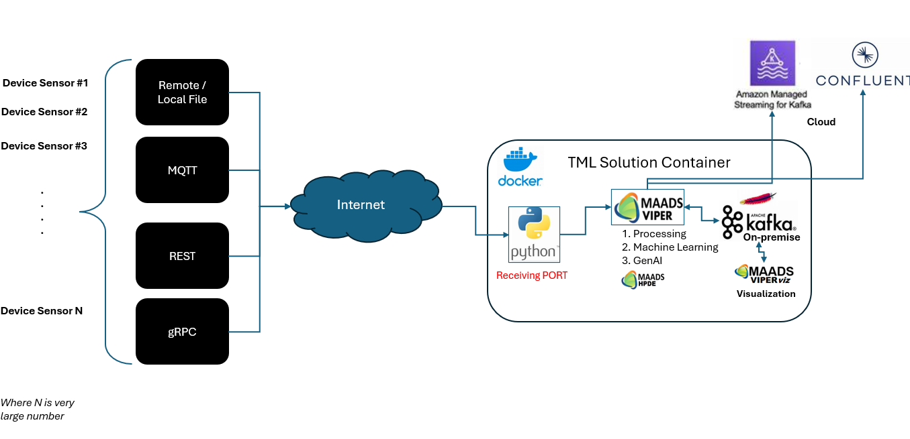
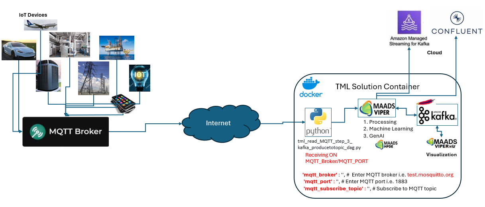
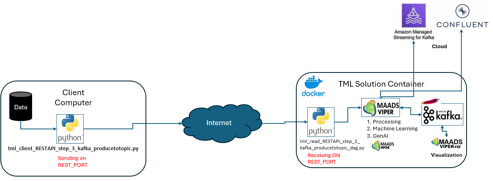
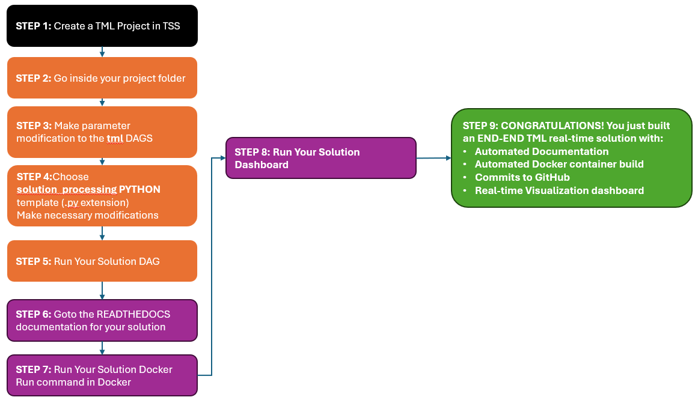
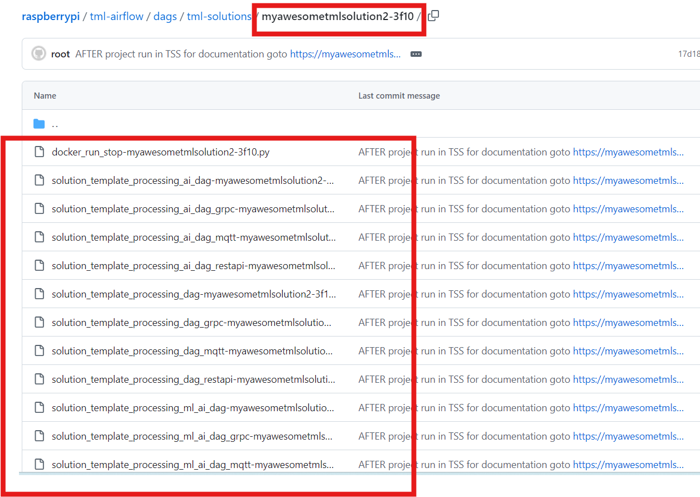

TML Solution Building 
======================

Why Do I Need TML?
----------------

TML is the world's only technology that can perform entity based machine learning, in-memory, on real-time data integrated with Apache Kafka.  Any where you need to process real-time data - you NEED TML.  It can be used in any industry globally.

.. important::
   **TML offers several advantages over conventional Stream Processing: In addition to being:**

     - the FASTEST and EASIEST way to build advanced, scalable, secure, and cost-effective, real-time solutions, with GenAI, for the Enterprise, 

     - in roughly TWO (2) minutes with

       - automated documentation, 

       - automated docker builds and,

       - automated code commits to Github 

       - with tight integration with Apache Airflow and Apache Kafka

   **More Reasons:**

   1. Stream Processing from AWS Kinesis, or Spark Streaming - Do Not perform in-memory entity based machine learning or processing of real-time data.  TML Does.

   2. Stream Processing technologies are very expensive. Because TML is comprised of 3 binaries they can be operated like microservices with very little cost 
   overhead (if any) due to in-memory processing of real-time data - this means no external databases are needed for machine learning reducing storage, compute 
   and network transfer costs.

   3. Stream processing solutions still use SQL to process data.  TML uses JSON processing, in-memory, which is faster, cheaper and easier to manage.

   4. Performing machine learning with Streaming processing is difficult, costly, and does not perform entity based machine learning.  TML performs in-memory 
   machine learning at the entity level for each device that is producing real-time data, this makes it very effective to learn each individual device behaviours 
   and predict future behaviours more accurately.

   5. Stream Processing technologies still require lots of code.  TML solutions are low-code or no-code using the TML Solution Studio (TSS).  The TSS uses DAGs 
   that allows users to quickly configure their TML solutions, and automatically deploy it with Docker, automatically generate the documentations for the 
   solution, and commit code to Github repos.  

   6. TML is integrated with GenAI using PrivateGPT and Qdrant vector DB.  This integration makes it the first solution that provides fast AI integrated with 
   real-time data processing and machine learning at the entity level.

   7.  To ingest data from devices TML offers pre-built client python code. Users can easily using gRPC, REST API, MQTT to ingest data directly from devices and 
   stream it to Kafka. Refer to :ref:`STEP 3: Produce to Kafka Topics` for more details.  

Where Is TML Used?
----------------

.. note::
   TML is used by companies and people around the world to process real-time data.  Because TML is free for students and researchers, it is used by thousands of 
   students in Universities and Colleges around the world as official part of the curriculum courses in IoT, Cybersecurity, Machine Learning, Data Science, and 
   Big Data Management courses.

TML Solutions Can Be Built In 10 Steps Using Pre-Written DAGs (Directed Acyclic Graphs)
----------------------------------------------------------

Users simply make configuration changes to the DAGs and build the solution.  TML Studio will even automatically containerize your complete solution, and auto generate online documentation.

Where Do I Start?
----------

.. attention::
   **START HERE**: The fastest way to build TML solutions with your real-time data is to use the :ref:`TML Solution Studio (TSS) Container`

Pre-Written 10 Apache Airflow DAGs To Speed Up TML Solution Builds
-------------------

The TML solution process with DAGS (explained in detail below).  **The entire TML solution build process is highly efficient; advanced, scalable, real-time TML solutions can be built in few hours with GenAI integrations!**

DAG Solution Process Explanation
^^^^^^^^^^^^^^^^^^^^^^^^^^

.. note::
    The above process shows Ten (10) DAGs that are used to build advanced, scalable, real-time TML solutions with little to no-code - just configurations to the 
    DAGs.  

    1. Build Process starts with setting up system parameters for **Initial TML Solution Setup**.  Users simply need to provide configuration information in the 
       following DAG:  

       :ref:`STEP 1: Get TML Core Params: tml_system_step_1_getparams_dag`

    2. The next step is to create all your **topics** in Kafka - these topic will store all your input and output data.  This is done in:

       :ref:`STEP 2: Create Kafka Topics: tml_system_step_2_kafka_createtopic_dag`
    
    **Your initial TML setup is complete.**

    Next, you want to start generating and producing data to the topics you creating and choose an **Ingest Real-Time Data Method**.  TML provides you with FOUR 
    (4) methods to stream your own data from any device.  This is done in the following DAGS - you need to CHOOSE ONE method: 

    3. :ref:`STEP 3: Produce to Kafka Topics`

    3a.  MQTT: :ref:`STEP 3a: Produce Data Using MQTT: tml-read-MQTT-step-3-kafka-producetotopic-dag`

    3b.  REST API: :ref:`STEP 3b: Produce Data Using RESTAPI: tml-read-RESTAPI-step-3-kafka-producetotopic-dag`
    
    3c.  gRPC: :ref:`STEP 3c: Produce Data Using gRPC: tml-read-gRPC-step-3-kafka-producetotopic-dag` 
    
    3d.  Local File: :ref:`STEP 3d: Produce Data Using LOCALFILE: tml-read-LOCALFILE-step-3-kafka-producetotopic-dag` 

    You are also provided CLIENT files for REST API and gRPC - these clients connect to the SERVERS in 3b and 3c:

    3a.i: :ref:`STEP 3a.i: MQTT CLIENT`

    3b.i: :ref:`STEP 3b.i: REST API CLIENT`

    3c.i: :ref:`STEP 3c.i: gRPC API CLIENT`

    You are also provided with an MQTT method - if you are using a MQTT broker for machine to machine communication.

    After you have chosen an ingest data method and producing data, you are ready to **Preprocess Real-Time Data** - the next DAG performs this function:

    4. :ref:`STEP 4: Preprocesing Data: tml-system-step-4-kafka-preprocess-dag` - Preprocessing is a very quick way to start generating insights from your real-time in few minutes.  All 
       preprocessing is done **in-memory and no external databases are needed, only Kafka**.  After you have preprocessed your data, you can use this 
       preprocessed data for **machine learning** - the next DAG performs this function.
    
    4b. :ref:`STEP 4b: Preprocesing 2 Data: tml-system-step-4b-kafka-preprocess-dag` - This second preprocessing step is an important step that uses the preprocessed data for additional processing in machine learning.  In the conventional machine learning sense, **STEP 4 is like "feature engineering"** and STEP 4b is using the engineered features for a much deeper understanding of the data streaming variables.  

    5. :ref:`STEP 5: Entity Based Machine Learning : tml-system-step-5-kafka-machine-learning-dag` - this is another powerful DAG automatically starts building entity based machine learning models for 
        your real-time data.  Note, TML will continuously build ML models are new data streams in.  All machine learning is done **in-memory and no external 
        databases are needed, only Kafka**.  As these models are trained on your real-time data - the next 
        DAG performs predictions.
    
    6. :ref:`STEP 6: Entity Based Predictions: tml-system-step-6-kafka-predictions-dag` - These predictions get automatically generated in parallel to machine learning training process in DAG 5.  
        As predictions are being generated, you can stream these predictions to a real-time dashboard - the next DAG performs this function.

    7. :ref:`STEP 7: Real-Time Visualization: tml-system-step-7-kafka-visualization-dag` - The visualization data are streamed directly from the TML solution container over websockets to the 
       client browser, this eliminates any need for third-party visualization software.  Now, that you have built the **ENTIRE TML SOLUTION END-END** you are 
       ready to deploy it to Docker - the next DAG performs this function.

    8. :ref:`STEP 8: Deploy TML Solution to Docker : tml-system-step-8-deploy-solution-to-docker-dag` - The TML docker container is automatically built for you and pushed to Docker Hub.  If you have 
       chosen to integrate GPT into you solution - you can initiate the PrivateGPT and Qdrant containers - the next DAG performs this function.

    9. :ref:`STEP 9: PrivateGPT and Qdrant Integration: tml-system-step-9-privategpt_qdrant-dag` - This DAG integrates your real-time solution seamlessly with 
       GenAI using the privateGPT container see :ref:`TML and Generative AI`.  

    10. :ref:`STEP 10: Create TML Solution Documentation: tml-system-step-10-documentation-dag`.  

    **YOU ARE DONE!  You just build an advanced, scalable, end-end real-time solution and deployed it to Docker, integrated with AI and with online 
    documentation.**  
    ENJOY!

DAGs (Directed Acyclic Graphs) are a powerful and easy way to build powerful (real-time) TML solutions quickly.  Users are provided with the following DAGs:

.. note::
   
   The numbers in the DAGs indicate solution process step.  For example, step 2 is dependent on step 1.

DAG Table
^^^^^^^^^^^^^^^^^^

.. list-table::
   :widths: 20

   * - **DAG Name**
   * - :ref:`STEP 1: Get TML Core Params: tml_system_step_1_getparams_dag`

       **Description:** This DAG will get the core TML connection and 

       tokens needed for operations.
   * - :ref:`STEP 2: Create Kafka Topics: tml_system_step_2_kafka_createtopic_dag`

       **Description:** This DAG will create all the necessary 

       topics in Kafka (on-prem or Cloud) for 

       your TML solution. 
   * - :ref:`STEP 3a: Produce Data Using MQTT: tml-read-MQTT-step-3-kafka-producetotopic-dag`
        
       **Description:** This DAG is an MQTT server and will listen 

       for a connection from a client.  You use 

       this if your TML solution ingests data 

       from MQTT system like HiveMQ and 

       stream it to Kafka.
   * - :ref:`STEP 3d: Produce Data Using LOCALFILE: tml-read-LOCALFILE-step-3-kafka-producetotopic-dag`

       **Description:** This DAG will read a local CSV file for 

       data and stream it to Kafka.
   * - :ref:`STEP 3c: Produce Data Using gRPC: tml-read-gRPC-step-3-kafka-producetotopic-dag`
        
       **Description:** This DAG is an gRPC server and will 

       listen for a connection from a gRPC client.  

       You use this if your TML solution ingests data 
 
       from devices and you want to 
 
       leverage a gRPC connection and stream the 
 
       data to Kafka.
   * - :ref:`STEP 3b: Produce Data Using RESTAPI: tml-read-RESTAPI-step-3-kafka-producetotopic-dag`
     
       **Description:** This DAG is an RESTAPI server and will listen 
    
       for a connection from a REST client.  

       You use this if your TML solution ingests 

       data from devices and you want 

       to leverage a rest connection and stream the 

       data to Kafka.
   * - :ref:`STEP 4: Preprocesing Data: tml-system-step-4-kafka-preprocess-dag`
        
       Description: This DAG perform entity level preprocessing on 

       the real-time data.  There are over 

       35 different preprocessing types in TML. 
   * - :ref:`STEP 4b: Preprocesing 2 Data: tml-system-step-4b-kafka-preprocess-dag`
        
       Description: This DAG perform entity level preprocessing on the featured

       engineered variables in STEP 4. The processed variables are named

       in a standard way following the procedure here :ref:`Preprocessed Variable Naming Standard`
   * - :ref:`STEP 5: Entity Based Machine Learning : tml-system-step-5-kafka-machine-learning-dag`
      
       **Description:** This DAG perform entity level machine 

       learning on the real-time data.
   * - :ref:`STEP 6: Entity Based Predictions: tml-system-step-6-kafka-predictions-dag`
      
       **Description:** This DAG performs predictions using the 

       trained algorithms for every entity.
   * - :ref:`STEP 7: Real-Time Visualization: tml-system-step-7-kafka-visualization-dag`

       **Description:** This DAG streams the output to a 

       real-time dashboard.
   * - :ref:`STEP 8: Deploy TML Solution to Docker : tml-system-step-8-deploy-solution-to-docker-dag`
      
       **Description:** This DAG automatically deploys the entire 

       TML solution to Docker container - and pushes 

       it to Dockerhub.
   * - :ref:`STEP 9: PrivateGPT and Qdrant Integration: tml-system-step-9-privategpt_qdrant-dag`
     
       **Description:** This DAG integrates your real-time solution seamlessly with 

       GenAI using the privateGPT container see :ref:`TML and Generative AI`.  

       This is a very powerful, secure, and low-cost way of harnessing the power of 

       AI for fast AI analysis of your streaming data.  No data is sent outside 

       your network, the privateGPT container runs locally.
   * - :ref:`STEP 10: Create TML Solution Documentation: tml-system-step-10-documentation-dag`
      
       **Description:** This DAG will automatically create 

       the documentation for your solution 

       on readthedocs.io.

STEP 1: Get TML Core Params: tml_system_step_1_getparams_dag
^^^^^^^^^^^^^^^^^^^^

Below is the complete definition of the **tml_system_step_1_getparams_dag**.  Users only need to configure the code highlighted in the **USER CHOSEN PARAMETERS**.

.. tip:: 
   For details on the parameters below refer to :ref:`MAADS-VIPER Environmental Variable Configuration (Viper.env)`

   Watch the YouTube video on dag configurations: `YouTube video <https://youtu.be/N2ghgJuZAiU>`_

.. code-block:: PYTHON
   :emphasize-lines: 16,17,18,19,20,21,22,23,24,25,26,27,28,29,30,31,32,33,34,35,36,37,
                     38,39,40,41,42,43,44,45,46,47,48,49,50,51,52,53,54,55,56,57,58,59,60,61,62,63,64,65,
                     66,67,68,69,70,71 
     
    from airflow import DAG
    from airflow.operators.python import PythonOperator
    from airflow.operators.bash import BashOperator
    from datetime import datetime
    from airflow.decorators import dag, task
    import os 
    import sys
    import tsslogging
    import time 
    import subprocess
    import shutil
    import glob
    
    sys.dont_write_bytecode = True
    ######################################################USER CHOSEN PARAMETERS ###########################################################
    default_args = {
     'owner': 'Sebastian Maurice',  # <<< ******** change as needed 
     'brokerhost' : '127.0.0.1',  # <<<<***************** THIS WILL ACCESS LOCAL KAFKA - YOU CAN CHANGE TO CLOUD KAFKA HOST
     'brokerport' : '9092',     # <<<<***************** LOCAL AND CLOUD KAFKA listen on PORT 9092
     'cloudusername' : '',  # <<<< --THIS WILL BE UPDATED FOR YOU IF USING KAFKA CLOUD WITH API KEY  - LEAVE BLANK
     'cloudpassword' : '',  # <<<< --THIS WILL BE UPDATED FOR YOU IF USING KAFKA CLOUD WITH API SECRET - LEAVE BLANK   
     'solutionname': '_mysolution_',   # <<< *** DO NOT MODIFY - THIS WILL BE AUTOMATICALLY UPDATED
     'solutiontitle': 'My Solution Title', # <<< *** Provide a descriptive title for your solution
     'solutionairflowport' : '-1', # << If -1, TSS will choose a free port randonly, or set this to a fixed number
     'solutionexternalport' : '-1', # << If -1, TSS will choose a free port randonly, or set this to a fixed number
     'solutionvipervizport' : '-1', # << If -1, TSS will choose a free port randonly, or set this to a fixed number   
     'description': 'This is an awesome real-time solution built by TSS',   # <<< *** Provide a description of your solution
     'HTTPADDR' : 'https://',
     'COMPANYNAME' : 'My company',       
     'WRITELASTCOMMIT' : '0',   ## <<<<<<<<< ******************** FOR DETAILS ON BELOW PARAMETER SEE: https://tml.readthedocs.io/en/latest/viper.html
     'NOWINDOWOVERLAP' : '0',
     'NUMWINDOWSFORDUPLICATECHECK' : '5',
     'DATARETENTIONINMINUTES' : '30',
     'USEHTTP' : '0',
     'ONPREM' : '0',
     'WRITETOVIPERDB' : '0',
     'VIPERDEBUG' : '2',
     'MAXOPENREQUESTS' : '10',
     'LOGSTREAMTOPIC' : 'viperlogs',
     'LOGSTREAMTOPICPARTITIONS' : '1',
     'LOGSTREAMTOPICREPLICATIONFACTOR' : '3',
     'LOGSENDTOEMAILS' : '',
     'LOGSENDTOEMAILSSUBJECT' : '[VIPER]',
     'LOGSENDTOEMAILFOOTER' : 'This e-mail is auto-generated by Transactional Machine Learning (TML) Technology Binaries: Viper, HPDE or Viperviz.  For more information please contact your TML Administrator.  Or, e-mail info@otics.ca for any questions or concerns regarding this e-mail. If you received this e-mail in error please delete it and inform your TML Admin or e-mail info@otics.ca, website: https://www.otics.ca.  Thank you for using TML Data Stream Processing and Real-Time Transactional Machine Learning technologies.',
     'LOGSENDINTERVALMINUTES' : '500',
     'LOGSENDINTERVALONLYERROR' : '1',
     'MAXTRAININGROWS' : '300',
     'MAXPREDICTIONROWS' : '50',
     'MAXPREPROCESSMESSAGES' : '5000',
     'MAXPERCMESSAGES' : '5000',
     'MAXCONSUMEMESSAGES' : '5000',
     'MAXVIPERVIZROLLBACKOFFSET' : '',
     'MAXVIPERVIZCONNECTIONS' : '10',
     'MAXURLQUERYSTRINGBYTES' : '10000',
     'MYSQLMAXLIFETIMEMINUTES' : '4',
     'MYSQLMAXCONN' : '4',
     'MYSQLMAXIDLE' : '10',
     'SASLMECHANISM' : 'PLAIN',
     'MINFORECASTACCURACY' : '55',
     'COMPRESSIONTYPE' : 'gzip',
     'MAILSERVER' : '', #i.e.  smtp.broadband.rogers.com,
     'MAILPORT' : '', #i.e. 465,
     'FROMADDR' : '',
     'SMTP_USERNAME' : '',
     'SMTP_PASSWORD' : '',
     'SMTP_SSLTLS' : 'true',
     'SSL_CLIENT_CERT_FILE' : 'client.cer.pem',
     'SSL_CLIENT_KEY_FILE' : 'client.key.pem', 
     'SSL_SERVER_CERT_FILE' : 'server.cer.pem',  
     'KUBERNETES' : '0',
    }
    
    ############################################################### DO NOT MODIFY BELOW ####################################################
    # Instantiate your DAG
    @dag(dag_id="tml_system_step_1_getparams_dag", default_args=default_args, tags=["tml_system_step_1_getparams_dag"], schedule=None, catchup=False)
    def tmlparams():
        # Define tasks
        def empty():
            pass
    dag = tmlparams()
    
        
    def reinitbinaries(sname):  
        pywindowfiles=glob.glob("/tmux/pythonwindows_*") 
        
        for f in pywindowfiles: 
            try:
              with open(f, 'r', encoding='utf-8') as file: 
                data = file.readlines() 
                for d in data:          
                  if d != "":             
                    d=d.rstrip()            
                    v=subprocess.call(["tmux", "kill-window", "-t", "{}".format(d)])   
              os.remove(f)        
            except Exception as e:
             print("ERROR=",e)   
             pass
    
        vizwindowfiles=glob.glob("/tmux/vipervizwindows_*") 
        
        for f in vizwindowfiles: 
            try:
              with open(f, 'r', encoding='utf-8') as file: 
                 data = file.readlines()  
                 for d in data:
                     d=d.rstrip()
                     dsw = d.split(",")[0]             
                     dsp = d.split(",")[1]
                     if dsw != "":  
                       subprocess.call(["tmux", "kill-window", "-t", "{}".format(dsw)])        
                       v=subprocess.call(["kill", "-9", "$(lsof -i:{} -t)".format(dsp)])
                       time.sleep(1) 
              os.remove(f)                    
            except Exception as e:
             pass
           
        # copy folders
        shutil.copytree("/tss_readthedocs", "/{}".format(sname),dirs_exist_ok=True)
        
            
    def updateviperenv():
        # update ALL
        os.environ['tssbuild']="0"
        os.environ['tssdoc']="0"
    
        cloudusername = ""
        cloudpassword = ""
        
        if 'KAFKACLOUDUSERNAME' in os.environ:
              cloudusername = os.environ['KAFKACLOUDUSERNAME']
        if 'KAFKACLOUDPASSWORD' in os.environ:
              cloudpassword = os.environ['KAFKACLOUDPASSWORD']
    
        if '127.0.0.1' in default_args['brokerhost']:
          cloudusername = ""
          cloudpassword = ""
            
        filepaths = ['/Viper-produce/viper.env','/Viper-preprocess/viper.env','/Viper-preprocess-pgpt/viper.env','/Viper-preprocess2/viper.env','/Viper-ml/viper.env','/Viper-predict/viper.env','/Viperviz/viper.env']
        for mainfile in filepaths:
         with open(mainfile, 'r', encoding='utf-8') as file: 
           data = file.readlines() 
         r=0 
         for d in data:  
           if d[0] == '#':
              r += 1  
              continue 
            
           if 'KAFKA_CONNECT_BOOTSTRAP_SERVERS' in d: 
             if default_args['brokerport'] == '':
               data[r] = "KAFKA_CONNECT_BOOTSTRAP_SERVERS={}\n".format(default_args['brokerhost'])    
             else:       
               data[r] = "KAFKA_CONNECT_BOOTSTRAP_SERVERS={}:{}\n".format(default_args['brokerhost'],default_args['brokerport'])
           if 'CLOUD_USERNAME' in d: 
             data[r] = "CLOUD_USERNAME={}\n".format(cloudusername)
           if 'CLOUD_PASSWORD' in d: 
             data[r] = "CLOUD_PASSWORD={}\n".format(cloudpassword)                
           if 'WRITELASTCOMMIT' in d: 
             data[r] = "WRITELASTCOMMIT={}\n".format(default_args['WRITELASTCOMMIT'])
           if 'NOWINDOWOVERLAP' in d: 
             data[r] = "NOWINDOWOVERLAP={}\n".format(default_args['NOWINDOWOVERLAP'])
           if 'NUMWINDOWSFORDUPLICATECHECK' in d: 
             data[r] = "NUMWINDOWSFORDUPLICATECHECK={}\n".format(default_args['NUMWINDOWSFORDUPLICATECHECK'])
           if 'USEHTTP' in d: 
             data[r] = "USEHTTP={}\n".format(default_args['USEHTTP'])
           if 'ONPREM' in d: 
             data[r] = "ONPREM={}\n".format(default_args['ONPREM'])
           if 'WRITETOVIPERDB' in d: 
             data[r] = "WRITETOVIPERDB={}\n".format(default_args['WRITETOVIPERDB'])
           if 'VIPERDEBUG' in d: 
             data[r] = "VIPERDEBUG={}\n".format(default_args['VIPERDEBUG'])
           if 'MAXOPENREQUESTS' in d: 
             data[r] = "MAXOPENREQUESTS={}\n".format(default_args['MAXOPENREQUESTS'])
           if 'LOGSTREAMTOPIC' in d: 
             data[r] = "LOGSTREAMTOPIC={}\n".format(default_args['LOGSTREAMTOPIC'])
           if 'LOGSTREAMTOPICPARTITIONS' in d: 
             data[r] = "LOGSTREAMTOPICPARTITIONS={}\n".format(default_args['LOGSTREAMTOPICPARTITIONS'])
           if 'LOGSTREAMTOPICREPLICATIONFACTOR' in d: 
             data[r] = "LOGSTREAMTOPICREPLICATIONFACTOR={}\n".format(default_args['LOGSTREAMTOPICREPLICATIONFACTOR'])
           if 'LOGSENDTOEMAILS' in d: 
             data[r] = "LOGSENDTOEMAILS={}\n".format(default_args['LOGSENDTOEMAILS'])
           if 'LOGSENDTOEMAILSSUBJECT' in d: 
             data[r] = "LOGSENDTOEMAILSSUBJECT={}\n".format(default_args['LOGSENDTOEMAILSSUBJECT'])
           if 'LOGSENDTOEMAILFOOTER' in d: 
             data[r] = "LOGSENDTOEMAILFOOTER={}\n".format(default_args['LOGSENDTOEMAILFOOTER'])
           if 'LOGSENDINTERVALMINUTES' in d: 
             data[r] = "LOGSENDINTERVALMINUTES={}\n".format(default_args['LOGSENDINTERVALMINUTES'])
           if 'LOGSENDINTERVALONLYERROR' in d: 
             data[r] = "LOGSENDINTERVALONLYERROR={}\n".format(default_args['LOGSENDINTERVALONLYERROR'])
           if 'MAXTRAININGROWS' in d: 
             data[r] = "MAXTRAININGROWS={}\n".format(default_args['MAXTRAININGROWS'])
           if 'MAXPREDICTIONROWS' in d: 
             data[r] = "MAXPREDICTIONROWS={}\n".format(default_args['MAXPREDICTIONROWS'])
           if 'MAXPREPROCESSMESSAGES' in d: 
             data[r] = "MAXPREPROCESSMESSAGES={}\n".format(default_args['MAXPREPROCESSMESSAGES'])
           if 'MAXPERCMESSAGES' in d: 
             data[r] = "MAXPERCMESSAGES={}\n".format(default_args['MAXPERCMESSAGES'])
           if 'MAXCONSUMEMESSAGES' in d: 
             data[r] = "MAXCONSUMEMESSAGES={}\n".format(default_args['MAXCONSUMEMESSAGES'])
           if 'MAXVIPERVIZROLLBACKOFFSET' in d: 
             data[r] = "MAXVIPERVIZROLLBACKOFFSET={}\n".format(default_args['MAXVIPERVIZROLLBACKOFFSET'])
           if 'MAXVIPERVIZCONNECTIONS' in d: 
             data[r] = "MAXVIPERVIZCONNECTIONS={}\n".format(default_args['MAXVIPERVIZCONNECTIONS'])
           if 'MAXURLQUERYSTRINGBYTES' in d: 
             data[r] = "MAXURLQUERYSTRINGBYTES={}\n".format(default_args['MAXURLQUERYSTRINGBYTES'])
           if 'MYSQLMAXLIFETIMEMINUTES' in d: 
             data[r] = "MYSQLMAXLIFETIMEMINUTES={}\n".format(default_args['MYSQLMAXLIFETIMEMINUTES'])
           if 'MYSQLMAXCONN' in d: 
             data[r] = "MYSQLMAXCONN={}\n".format(default_args['MYSQLMAXCONN'])
           if 'MYSQLMAXIDLE' in d: 
             data[r] = "MYSQLMAXIDLE={}\n".format(default_args['MYSQLMAXIDLE'])
           if 'SASLMECHANISM' in d: 
             data[r] = "SASLMECHANISM={}\n".format(default_args['SASLMECHANISM'])
           if 'MINFORECASTACCURACY' in d: 
             data[r] = "MINFORECASTACCURACY={}\n".format(default_args['MINFORECASTACCURACY'])
           if 'COMPRESSIONTYPE' in d: 
             data[r] = "COMPRESSIONTYPE={}\n".format(default_args['COMPRESSIONTYPE'])
           if 'MAILSERVER' in d: 
             data[r] = "MAILSERVER={}\n".format(default_args['MAILSERVER'])
           if 'MAILPORT' in d: 
             data[r] = "MAILPORT={}\n".format(default_args['MAILPORT'])
           if 'FROMADDR' in d: 
             data[r] = "FROMADDR={}\n".format(default_args['FROMADDR'])
           if 'SMTP_USERNAME' in d: 
             data[r] = "SMTP_USERNAME={}\n".format(default_args['SMTP_USERNAME'])
           if 'SMTP_PASSWORD' in d: 
             data[r] = "SMTP_PASSWORD={}\n".format(default_args['SMTP_PASSWORD'])
           if 'SMTP_SSLTLS' in d: 
             data[r] = "SMTP_SSLTLS={}\n".format(default_args['SMTP_SSLTLS'])
           if 'SSL_CLIENT_CERT_FILE' in d: 
             data[r] = "SSL_CLIENT_CERT_FILE={}\n".format(default_args['SSL_CLIENT_CERT_FILE'])
           if 'SSL_CLIENT_KEY_FILE' in d: 
             data[r] = "SSL_CLIENT_KEY_FILE={}\n".format(default_args['SSL_CLIENT_KEY_FILE'])
           if 'SSL_SERVER_CERT_FILE' in d: 
             data[r] = "SSL_SERVER_CERT_FILE={}\n".format(default_args['SSL_SERVER_CERT_FILE'])                
           if 'KUBERNETES' in d: 
             data[r] = "KUBERNETES={}\n".format(default_args['KUBERNETES'])                
           if 'COMPANYNAME' in d: 
             data[r] = "COMPANYNAME={}\n".format(default_args['COMPANYNAME'])                
    
           r += 1
         with open(mainfile, 'w', encoding='utf-8') as file: 
          file.writelines(data)
    
        subprocess.call("/tmux/starttml.sh", shell=True)
        time.sleep(3)
    
    def getparams(**context):
      args = default_args    
      VIPERHOST = ""
      VIPERPORT = ""
      HTTPADDR = args['HTTPADDR']
      HPDEHOST = ""
      HPDEPORT = ""
      VIPERTOKEN = ""
      HPDEHOSTPREDICT = ""
      HPDEPORTPREDICT = ""
    
      sname = args['solutionname']    
      desc = args['description']        
      stitle = args['solutiontitle']    
      
      brokerhost = args['brokerhost']   
      brokerport = args['brokerport'] 
      reinitbinaries(sname)
      updateviperenv()
    
      with open("/Viper-produce/admin.tok", "r") as f:
        VIPERTOKEN=f.read()
    
      if VIPERHOST=="":
        with open('/Viper-produce/viper.txt', 'r') as f:
          output = f.read()
          VIPERHOST = output.split(",")[0]
          VIPERPORT = output.split(",")[1]
        with open('/Viper-preprocess/viper.txt', 'r') as f:
          output = f.read()
          VIPERHOSTPREPROCESS = output.split(",")[0]
          VIPERPORTPREPROCESS = output.split(",")[1]    
        with open('/Viper-preprocess2/viper.txt', 'r') as f:
          output = f.read()
          VIPERHOSTPREPROCESS2 = output.split(",")[0]
          VIPERPORTPREPROCESS2 = output.split(",")[1]        
        with open('/Viper-preprocess-pgpt/viper.txt', 'r') as f:
          output = f.read()
          VIPERHOSTPREPROCESSPGPT = output.split(",")[0]
          VIPERPORTPREPROCESSPGPT = output.split(",")[1]        
        with open('/Viper-ml/viper.txt', 'r') as f:
          output = f.read()
          VIPERHOSTML = output.split(",")[0]
          VIPERPORTML = output.split(",")[1]    
        with open('/Viper-predict/viper.txt', 'r') as f:
          output = f.read()
          VIPERHOSTPREDICT = output.split(",")[0]
          VIPERPORTPREDICT = output.split(",")[1]    
        with open('/Hpde/hpde.txt', 'r') as f:
          output = f.read()
          HPDEHOST = output.split(",")[0]
          HPDEPORT = output.split(",")[1]
        with open('/Hpde-predict/hpde.txt', 'r') as f:
          output = f.read()
          HPDEHOSTPREDICT = output.split(",")[0]
          HPDEPORTPREDICT = output.split(",")[1]
    
      
      if 'CHIP' in os.environ:
         chip = os.environ['CHIP']
         chip = chip.lower()   
      else:   
          chip = 'amd64'
           
      if 'VIPERVIZPORT' in os.environ:
          if os.environ['VIPERVIZPORT'] != '' and os.environ['VIPERVIZPORT'] != '-1':
               vipervizport = int(os.environ['VIPERVIZPORT'])
          else:
               vipervizport=tsslogging.getfreeport()
      else:
               vipervizport=tsslogging.getfreeport()
            
      if default_args['solutionairflowport'] != '-1':
               solutionairflowport = int(default_args['solutionairflowport'])
      else:
               solutionairflowport=tsslogging.getfreeport()
    
      if default_args['solutionexternalport'] != '-1':
               solutionexternalport = int(default_args['solutionexternalport'])
      else:
               solutionexternalport=tsslogging.getfreeport()
            
      if default_args['solutionvipervizport'] != '-1':
              solutionvipervizport = int(default_args['solutionvipervizport'])
      else:
               solutionvipervizport=tsslogging.getfreeport()
    
      if 'AIRFLOWPORT' in  os.environ:
          airflowport = os.environ['AIRFLOWPORT']
      else:
          airflowport = tsslogging.getfreeport()
    
      externalport=VIPERPORT          
      if 'EXTERNALPORT' in  os.environ:
          if os.environ['EXTERNALPORT'] != "-1":  
            externalport = os.environ['EXTERNALPORT']
            
      tss = os.environ['TSS']          
      sd = context['dag'].dag_id 
      task_instance = context['task_instance']
        
      if tss == "1":  
        task_instance.xcom_push(key="{}_SOLUTIONEXTERNALPORT".format(sname),value="_{}".format(solutionexternalport)) 
        task_instance.xcom_push(key="{}_SOLUTIONVIPERVIZPORT".format(sname),value="_{}".format(solutionvipervizport))  
        task_instance.xcom_push(key="{}_SOLUTIONAIRFLOWPORT".format(sname),value="_{}".format(solutionairflowport)) 
      else:
        task_instance.xcom_push(key="{}_SOLUTIONEXTERNALPORT".format(sname),value="_{}".format(os.environ['SOLUTIONEXTERNALPORT'])) 
        task_instance.xcom_push(key="{}_SOLUTIONVIPERVIZPORT".format(sname),value="_{}".format(os.environ['SOLUTIONVIPERVIZPORT']))  
        task_instance.xcom_push(key="{}_SOLUTIONAIRFLOWPORT".format(sname),value="_{}".format(os.environ['SOLUTIONAIRFLOWPORT'])) 
        
    
      if 'MQTTUSERNAME' in os.environ:
        task_instance.xcom_push(key="{}_MQTTUSERNAME".format(sname),value=os.environ['MQTTUSERNAME'])
      else:
        task_instance.xcom_push(key="{}_MQTTUSERNAME".format(sname),value="")
    
      if 'MQTTPASSWORD' in os.environ:
        task_instance.xcom_push(key="{}_MQTTPASSWORD".format(sname),value=os.environ['MQTTPASSWORD'])
      else:
        task_instance.xcom_push(key="{}_MQTTPASSWORD".format(sname),value="")
    
      if 'KAFKACLOUDUSERNAME' in os.environ:
        task_instance.xcom_push(key="{}_KAFKACLOUDUSERNAME".format(sname),value=os.environ['KAFKACLOUDUSERNAME'])
      else:
        task_instance.xcom_push(key="{}_KAFKACLOUDUSERNAME".format(sname),value="")
    
      if 'KAFKACLOUDPASSWORD' in os.environ:
        task_instance.xcom_push(key="{}_KAFKACLOUDPASSWORD".format(sname),value=os.environ['KAFKACLOUDPASSWORD'])
      else:
        task_instance.xcom_push(key="{}_KAFKACLOUDPASSWORD".format(sname),value="")
        
      task_instance.xcom_push(key="{}_TSS".format(sname),value="_{}".format(tss))  
        
      task_instance.xcom_push(key="{}_EXTERNALPORT".format(sname),value="_{}".format(externalport)) 
      task_instance.xcom_push(key="{}_AIRFLOWPORT".format(sname),value="_{}".format(airflowport)) 
      
      task_instance.xcom_push(key="{}_VIPERVIZPORT".format(sname),value="_{}".format(vipervizport))  
      task_instance.xcom_push(key="{}_VIPERTOKEN".format(sname),value=VIPERTOKEN)
      task_instance.xcom_push(key="{}_VIPERHOST".format(sname),value=VIPERHOST)
      task_instance.xcom_push(key="{}_VIPERPORT".format(sname),value="_{}".format(VIPERPORT))
      task_instance.xcom_push(key="{}_VIPERHOSTPRODUCE".format(sname),value=VIPERHOST)
      task_instance.xcom_push(key="{}_VIPERPORTPRODUCE".format(sname),value="_{}".format(VIPERPORT))
      task_instance.xcom_push(key="{}_VIPERHOSTPREPROCESS".format(sname),value=VIPERHOSTPREPROCESS)
      task_instance.xcom_push(key="{}_VIPERPORTPREPROCESS".format(sname),value="_{}".format(VIPERPORTPREPROCESS))
      task_instance.xcom_push(key="{}_VIPERHOSTPREPROCESS2".format(sname),value=VIPERHOSTPREPROCESS2)
      task_instance.xcom_push(key="{}_VIPERPORTPREPROCESS2".format(sname),value="_{}".format(VIPERPORTPREPROCESS2))
    
      task_instance.xcom_push(key="{}_VIPERHOSTPREPROCESSPGPT".format(sname),value=VIPERHOSTPREPROCESSPGPT)
      task_instance.xcom_push(key="{}_VIPERPORTPREPROCESSPGPT".format(sname),value="_{}".format(VIPERPORTPREPROCESSPGPT))
        
      task_instance.xcom_push(key="{}_VIPERHOSTML".format(sname),value=VIPERHOSTML)
      task_instance.xcom_push(key="{}_VIPERPORTML".format(sname),value="_{}".format(VIPERPORTML))
      task_instance.xcom_push(key="{}_VIPERHOSTPREDICT".format(sname),value=VIPERHOSTPREDICT)
      task_instance.xcom_push(key="{}_VIPERPORTPREDICT".format(sname),value="_{}".format(VIPERPORTPREDICT))
      task_instance.xcom_push(key="{}_HTTPADDR".format(sname),value=HTTPADDR)
      task_instance.xcom_push(key="{}_HPDEHOST".format(sname),value=HPDEHOST)
      task_instance.xcom_push(key="{}_HPDEPORT".format(sname),value="_{}".format(HPDEPORT))
      task_instance.xcom_push(key="{}_HPDEHOSTPREDICT".format(sname),value=HPDEHOSTPREDICT)
      task_instance.xcom_push(key="{}_HPDEPORTPREDICT".format(sname),value="_{}".format(HPDEPORTPREDICT))
      task_instance.xcom_push(key="{}_solutionname".format(sd),value=sname)
      task_instance.xcom_push(key="{}_solutiondescription".format(sname),value=desc)
      task_instance.xcom_push(key="{}_solutiontitle".format(sname),value=stitle)
    
      task_instance.xcom_push(key="{}_containername".format(sname),value='')
      task_instance.xcom_push(key="{}_brokerhost".format(sname),value=brokerhost)
      task_instance.xcom_push(key="{}_brokerport".format(sname),value="_{}".format(brokerport))
      task_instance.xcom_push(key="{}_chip".format(sname),value=chip)

DAG STEP 1: Parameter Explanation
"""""""""""""""""""""""""""""

.. list-table::

    * - **Json Key**
      - **Description**
    * - owner
      - Change as needed. 
    * -  start_date
      - Date of solution creation
    * - brokerhost
      - This is the IP address for Kafka.  

        If Kafka is running on localhost then 

        use '127.0.0.1' or add Kafka Cloud 

        cluster address.  Note, if using multiple brokers, 

        you can separate them by a comma, and set brokerport 

        as empty.
    * - brokerport
      - The default port for Kafka on-premise 

        or in the cloud is '9092'
    * - cloudusername
      - If you are running Kafka on-premise 

        on 127.0.0.1 - then this should be left 

        blank.  If you are using Kafka Cloud 

        then this is the **API KEY**
    * - cloudpassword
      - If you are running Kafka on-premise on 

        127.0.0.1 - then this should be left blank.  

        If you are using Kafka Cloud then this 

        is the **API SECRET**

    * - solutionairflowport
      - This is your solution airflow port.  If -1, TSS will choose 

        a free port randomly, or set this to a fixed number to prevent

        the port from changing.
    
    * - solutionexternalport
      - This is an external port that you WILL need to stream external 

        data to your TML solution when using:

        You will need this port in the `REST <https://tml.readthedocs.io/en/latest/tmlbuilds.html#step-3b-i-rest-api-client>`_, and `gRPC 
        <https://tml.readthedocs.io/en/latest/tmlbuilds.html#step-3c-i-grpc-api-client>`_ clients.

        If -1, TSS will choose a free port 

        randomly, or set this to a fixed number to prevent the port 

        from changing.
    
    * - solutionvipervizport
      - This is your solution dashboard port.  If -1, TSS will choose 

        a free port randomly, or set this to a fixed number to prevent 

        port from changing.

    * - ingestdatamethod
      - You must choose how you will ingest your data.

        Choose ONE Method from: 

         1. localfile
     
         2. mqtt

         3. rest

         4. grpc     
    * - solutionname
      - DO NOT MODIFY THIS WILL BE AUTOMATICALLY UPDATED when you create your solution.  Refer to :ref:`Lets Start Building a TML Solution`
    * - solutiontitle
      - Provide a descriptive title for your solution
    * - description
      - Describe your solution in one-line.
    * - retries
      - Change are neede, i.e. 1 is usually fine.

STEP 2: Create Kafka Topics: tml_system_step_2_kafka_createtopic_dag
^^^^^^^^^^^^^^^^^^^^^^^

Below is the complete definition of the **tml_system_step_2_kafka_createtopic_dag** that creates all the topics for your solution.  Users only need to configure the code highlighted in the **USER CHOSEN PARAMETERS**.

.. tip::
   Watch the YouTube video for Step 2 dag configurations. `YouTube Video <https://youtu.be/h9HL_xarNgw>`_

.. code-block:: PYTHON
   :emphasize-lines: 15,16,17,18,19,20,21,22,23,24,25,26,27,28,29,30,31,32,33

    from airflow import DAG
    from airflow.operators.python import PythonOperator
    from airflow.operators.bash import BashOperator
    from datetime import datetime
    from airflow.decorators import dag, task
    import maadstml 
    import sys
    import tsslogging
    import os
    import subprocess
    
    sys.dont_write_bytecode = True
    
    ######################################## USER CHOOSEN PARAMETERS ########################################
    default_args = {
     'owner' : 'Sebastian Maurice', # <<< ********** You change as needed
     'companyname': 'Otics',  # <<< ********** You change as needed
      'myname' : 'Sebastian',  # <<< ********** You change as needed
      'myemail' : 'Sebastian.Maurice',  # <<< ********** You change as needed
      'mylocation' : 'Toronto',  # <<< ********** You change as needed
      'replication' : '1',  # <<< ********** You change as needed
      'numpartitions': '1',  # <<< ********** You change as needed
      'enabletls': '1',  # <<< ********** You change as needed
      'brokerhost' : '',  # <<< ********** Leave as is
      'brokerport' : '-999',  # <<< ********** Leave as is
      'microserviceid' : '',  # <<< ********** You change as needed
      'raw_data_topic' : 'iot-raw-data', # Separate multiple topics with comma <<< ********** You change topic names as needed
      'preprocess_data_topic' : 'iot-preprocess,iot-preprocess2', # Separate multiple topics with comma <<< ********** You change topic names as needed
      'ml_data_topic' : 'ml-data', # Separate multiple topics with comma <<< ********** You change topic names as needed
      'prediction_data_topic' : 'prediction-data', # Separate multiple topics with comma <<< ********** You change topic names as needed
      'pgpt_data_topic' : 'cisco-network-privategpt',  #  PrivateGPT will produce responses to this topic - change as  needed
      'description' : 'Topics to store iot data',      
    }
    
    ######################################## DO NOT MODIFY BELOW #############################################
    
    # Instantiate your DAG
    @dag(dag_id="tml_system_step_2_kafka_createtopic_dag", default_args=default_args, tags=["tml_system_step_2_kafka_createtopic_dag"], start_date=datetime(2023, 1, 1), schedule=None,catchup=False)
    def startkafkasetup():
        def empty():
            pass
    dag = startkafkasetup()
    
    def deletetopics(topic):
        
        buf = "/Kafka/kafka_2.13-3.0.0/bin/kafka-topics.sh --bootstrap-server localhost:9092 --topic {} --delete".format(topic)
        res=subprocess.call(buf, shell=True)
        print(buf)
        print("Result=",res)
        
        repo=tsslogging.getrepo()    
        tsslogging.tsslogit("Deleting topic {} in {}".format(topic,os.path.basename(__file__)), "INFO" )                     
        tsslogging.git_push("/{}".format(repo),"Entry from {}".format(os.path.basename(__file__)),"origin")  
        
    def setupkafkatopics(**context):
     # Set personal data
      args = default_args
      companyname=args['companyname']
      myname=args['myname']
      myemail=args['myemail']
      mylocation=args['mylocation']
      description=args['description']  
    
      # Replication factor for Kafka redundancy
      replication=int(args['replication'])
      # Number of partitions for joined topic
      numpartitions=int(args['numpartitions'])
      # Enable SSL/TLS communication with Kafka
      enabletls=int(args['enabletls'])
      # If brokerhost is empty then this function will use the brokerhost address in your
      brokerhost=args['brokerhost']
      # If this is -999 then this function uses the port address for Kafka in VIPER.ENV in the
      # field 'KAFKA_CONNECT_BOOTSTRAP_SERVERS'
      brokerport=int(args['brokerport'])
      # If you are using a reverse proxy to reach VIPER then you can put it here - otherwise if
      # empty then no reverse proxy is being used
      microserviceid=args['microserviceid']
    
      raw_data_topic=args['raw_data_topic']
      preprocess_data_topic=args['preprocess_data_topic']
      ml_data_topic=args['ml_data_topic']
      prediction_data_topic=args['prediction_data_topic']
      
      sd = context['dag'].dag_id
      sname=context['ti'].xcom_pull(task_ids='step_1_solution_task_getparams',key="{}_solutionname".format(sd))
    
      VIPERTOKEN = context['ti'].xcom_pull(task_ids='step_1_solution_task_getparams',key="{}_VIPERTOKEN".format(sname))
      VIPERHOST = context['ti'].xcom_pull(task_ids='step_1_solution_task_getparams',key="{}_VIPERHOSTPRODUCE".format(sname))
      VIPERPORT = context['ti'].xcom_pull(task_ids='step_1_solution_task_getparams',key="{}_VIPERPORTPRODUCE".format(sname))
      mainbroker = context['ti'].xcom_pull(task_ids='step_1_solution_task_getparams',key="{}_brokerhost".format(sname))
      HTTPADDR = context['ti'].xcom_pull(task_ids='step_1_solution_task_getparams',key="{}_HTTPADDR".format(sname))
    
      ti = context['task_instance'] 
      ti.xcom_push(key="{}_companyname".format(sname), value=companyname)
      ti.xcom_push(key="{}_myname".format(sname), value=myname)
      ti.xcom_push(key="{}_myemail".format(sname), value=myemail)
      ti.xcom_push(key="{}_mylocation".format(sname), value=mylocation)
      ti.xcom_push(key="{}_replication".format(sname), value="_{}".format(replication))
      ti.xcom_push(key="{}_numpartitions".format(sname), value="_{}".format(numpartitions))
      ti.xcom_push(key="{}_enabletls".format(sname), value="_{}".format(enabletls))
      ti.xcom_push(key="{}_microserviceid".format(sname), value=microserviceid)
      ti.xcom_push(key="{}_raw_data_topic".format(sname), value=raw_data_topic)
      ti.xcom_push(key="{}_preprocess_data_topic".format(sname), value=preprocess_data_topic)
      ti.xcom_push(key="{}_ml_data_topic".format(sname), value=ml_data_topic)
      ti.xcom_push(key="{}_prediction_data_topic".format(sname), value=prediction_data_topic)
      
    
    
      #############################################################################################################
      #                         CREATE TOPIC TO STORE TRAINED PARAMS FROM ALGORITHM  
    
      topickeys = ['raw_data_topic','preprocess_data_topic','ml_data_topic','prediction_data_topic','pgpt_data_topic'] 
      VIPERHOSTMAIN = "{}{}".format(HTTPADDR,VIPERHOST)    
    
      for k in topickeys:
        producetotopic=args[k]
        description=args['description']
    
        topicsarr = producetotopic.split(",")
        for topic in topicsarr:  
            if topic != '' and "127.0.0.1" in mainbroker:
              try:  
                deletetopics(topic)
              except Exception as e:
                print("ERROR: ",e)
                continue 
    
        if '127.0.0.1' in mainbroker:
            replication=1
                
        for topic in topicsarr:  
          if topic == '':
              continue
          print("Creating topic=",topic)  
          try:
            result=maadstml.vipercreatetopic(VIPERTOKEN,VIPERHOSTMAIN,VIPERPORT[1:],topic,companyname,
                                     myname,myemail,mylocation,description,enabletls,
                                     brokerhost,brokerport,numpartitions,replication,
                                     microserviceid='')
          except Exception as e:
           repo=tsslogging.getrepo()    
           tsslogging.tsslogit("Cannot create topic {} in {} - {}".format(topic,os.path.basename(__file__),e), "ERROR" )                     
           tsslogging.git_push("/{}".format(repo),"Entry from {}".format(os.path.basename(__file__)),"origin")  
            
          print("Result=",result)

DAG STEP 2: Parameter Explanation
""""""""""""""""""""""""""""""

.. list-table::

    * - owner
      - Change as needed
    * - companyname
      - Change as needed
    * - myname
      - Change as needed
    * - myemail
      - Change as needed
    * - mylocation
      - Change as needed
    * - replication
      - If using on-premise Kafka at address 127.0.0.1 

        then this should be 1.

        If using Kafka Cloud - then this 

        MUST a minimum of 3
    * - numpartitions
      - Specific partition for topics -  

        usually mimimum 3 partitions is fine
    * - enabletls
      - Set to 1 for TLS encryption, 0 for no encryption
    * - brokerhost
      - The setting in Step 1 is fine
    * - brokerport
      - The setting in Step 1 is fine
    * - microserviceid
      - If you are using a microservice in a 
 
        load balancer i.e. NGINX you can specify 

        the route here
    * - raw_data_topic
      - This is the data your solution 

        will produce raw data to - 

        see :ref:`STEP 3: Produce to Kafka Topics`
    * - preprocess_data_topic
      - This is where all the preprocess 

        data will be stored - separate 

        multiple topics with a comma
    * - ml_data_topic
      - This is where the ML estimated paramters 

        are stored.
    * - prediction_data_topic
      - This is where all the predictions 

        will be stored.
    * - description
      - Description for the topics.
    * - start_date
      - Solution start date
    * - retries
      - DAG retries, i.e. 1 is usually fine

STEP 3: Produce to Kafka Topics
^^^^^^^^^^^^^^^^^^^^^^^^^^

.. important::

   You must CHOOSE how you want to ingest data and produce to a Kafka topic.  

   **TML solution provides 4 (FOUR) ways to ingest data and produce to a topic: MQTT, gRPC, RESTAPI, LOCALFILE.**  The following DAGs in the table are SERVER 
   files.  These server files wait for connections from the client files. For further convenience, client files are provides to access the server DAGs below.

.. tip::
   The client examples for LOCALFILE, REST, MQTT, gRPC the data file can be download from Github:

   `<https://github.com/smaurice101/raspberrypi/tree/main/tml-airflow/data>`_ 

   Also, watch this youtube video that describes the four ingeston methods: `YouTube <https://youtu.be/o0Xk8pHV4nw>`_

Four Ways to Ingest Data Into Your TML Solution Container
"""""""""""""""""""""""""""""""""""""""

.. list-table::

   * - **Data Ingest DAG Name**
     - **Client File Name**
     - **Description**
   * - `tml-read-MQTT-step-3-kafka-producetotopic-dag <https://github.com/smaurice101/raspberrypi/blob/main/tml-airflow/dags/tml_read_MQTT_step_3_kafka_producetotopic_dag.py>`_
     - An **on_message(client, userdata, msg)** event 

       is triggered by the MQTT broker.  This DAGs 

       will automatically handle the on_message event

       and produce the data to Kafka.
     - This DAG is an MQTT server and will 
        
       listen for a connection from a client.  

       You use this if your TML solution 

       ingests data from MQTT system like HiveMQ and 

       stream it to Kafka.
   * - `tml-read-LOCALFILE-step-3-kafka-producetotopic-dag <https://github.com/smaurice101/raspberrypi/blob/main/tml-airflow/dags/tml_read_LOCALFILE_step_3_kafka_producetotopic_dag.py>`_
     - You can process a localfile and stream the 

       data to kafka.

     - This DAG will read a local CSV file 

       for data and stream it to Kafka.
   * - `tml-read-gRPC-step-3-kafka-producetotopic-dag <https://github.com/smaurice101/raspberrypi/blob/main/tml-airflow/dags/tml_read_gRPC_step_3_kafka_producetotopic_dag.py>`_
     - NOTE: For this client you will also 
 
       need: `tml_grpc_pb2_grpc <https://github.com/smaurice101/raspberrypi/blob/main/tml- 
       airflow/dags/tml_grpc_pb2_grpc.py>`_, 

       and `tml_grpc_pb2 <https://github.com/smaurice101/raspberrypi/blob/main/tml-airflow/dags/tml_grpc_pb2.py>`_
     - This DAG is an gRPC server and will 

       listen for a connection from 

       a gRPC client.  You use this if your TML 

       solution ingests data from devices and you want to 

       leverage a gRPC connection and stream the data to Kafka.
   * - `tml-read-RESTAPI-step-3-kafka-producetotopic-dag <https://github.com/smaurice101/raspberrypi/blob/main/tml-airflow/dags/tml_read_RESTAPI_step_3_kafka_producetotopic_dag.py>`_
     - This is one of the most popular APIs.
     - This DAG is an RESTAPI server and will 

       listen for a connection from a 

       REST client.  You use this if your TML 

       solution ingests data from devices and you want 

       to leverage a rest connection and stream 

       the data to Kafka.
   
STEP 3a: Produce Data Using MQTT: tml-read-MQTT-step-3-kafka-producetotopic-dag
""""""""""""""""""""""""""" 	

.. code-block:: PYTHON
   :emphasize-lines: 26,27,28,29,30,31,32,33,34,35,36,37,38,39

    from airflow import DAG
    from airflow.operators.python import PythonOperator
    from airflow.operators.bash import BashOperator
    from datetime import datetime
    from airflow.decorators import dag, task
    import paho.mqtt.client as paho
    from paho import mqtt
    import sys
    import maadstml
    import tsslogging
    import os
    import subprocess
    import time
    import random
    import json
    
    sys.dont_write_bytecode = True
    ##################################################  MQTT SERVER #####################################
    # This is a MQTT server that will handle connections from a client.  It will handle connections
    # from an MQTT client for on_message, on_connect, and on_subscribe
    
    # If Connecting to HiveMQ cluster you will need USERNAME/PASSWORD and mqtt_enabletls = 1
    # USERNAME/PASSWORD should be set in your DOCKER RUN command of the TSS container
    
    ######################################## USER CHOOSEN PARAMETERS ########################################
    default_args = {
      'owner' : 'Sebastian Maurice',    
      'enabletls': '1',
      'microserviceid' : '',
      'producerid' : 'iotsolution',  
      'topics' : 'iot-raw-data', # *************** This is one of the topic you created in SYSTEM STEP 2
      'identifier' : 'TML solution',  
      'mqtt_broker' : '', # <<<****** Enter MQTT broker i.e. test.mosquitto.org
      'mqtt_port' : '', # <<<******** Enter MQTT port i.e. 1883, 8883    (for HiveMQ cluster)
      'mqtt_subscribe_topic' : '', # <<<******** enter name of MQTT to subscribe to i.e. tml/iot  
      'mqtt_enabletls': '0', # set 1=TLS, 0=no TLSS  
      'delay' : '7000', # << ******* 7000 millisecond maximum delay for VIPER to wait for Kafka to return confirmation message is received and written to topic
      'topicid' : '-999', # <<< ********* do not modify      
    }
    
    ######################################## DO NOT MODIFY BELOW #############################################
    
    # Instantiate your DAG
    @dag(dag_id="tml_mqtt_step_3_kafka_producetotopic_dag", default_args=default_args, tags=["tml_mqtt_step_3_kafka_producetotopic_dag"], schedule=None,catchup=False)
    def startproducingtotopic():
      def empty():
        pass
    dag = startproducingtotopic()
        
    # This sets the lat/longs for the IoT devices so it can be map
    VIPERTOKEN=""
    VIPERHOST=""
    VIPERPORT=""
    HTTPADDR=""  
    VIPERHOSTFROM=""
        
    # setting callbacks for different events to see if it works, print the message etc.
    def on_connect(client, userdata, flags, rc, properties=None):
      print("CONNACK received with code %s." % rc)
    
    # print which topic was subscribed to
    def on_subscribe(client, userdata, mid, granted_qos, properties=None):
      print("Subscribed: " + str(mid) + " " + str(granted_qos))
    
    def on_message(client, userdata, msg):
      data=json.loads(msg.payload.decode("utf-8"))
      datad = json.dumps(data)
      readdata(datad)
    
    def mqttserverconnect():
    
     repo = tsslogging.getrepo()
     tsslogging.tsslogit("MQTT producing DAG in {}".format(os.path.basename(__file__)), "INFO" )                     
     tsslogging.git_push("/{}".format(repo),"Entry from {}".format(os.path.basename(__file__)),"origin")        
    
     username = ""    
     password = ""   
     if 'MQTTUSERNAME' in os.environ:
           username = os.environ['MQTTUSERNAME']  
     if 'MQTTPASSWORD' in os.environ:
           password = os.environ['MQTTPASSWORD']  
     
     try: 
       client = paho.Client(paho.CallbackAPIVersion.VERSION2)
       mqttBroker = default_args['mqtt_broker'] 
       mqttport = int(default_args['mqtt_port'])
       if default_args['mqtt_enabletls'] == "1":
         client.tls_set(tls_version=mqtt.client.ssl.PROTOCOL_TLS)
         client.username_pw_set(username, password)
     except Exception as e:       
       tsslogging.tsslogit("ERROR: Cannot connect to MQTT broker in {} - {}".format(os.path.basename(__file__),e), "ERROR" )                     
       tsslogging.git_push("/{}".format(repo),"Entry from {}".format(os.path.basename(__file__)),"origin")        
       print("ERROR: Cannot connect to MQTT broker") 
       return 
    
     client.connect(mqttBroker,mqttport)
    
     if client:
       print("Connected")   
       client.on_subscribe = on_subscribe
       client.on_message = on_message
       client.subscribe(default_args['mqtt_subscribe_topic'], qos=1)            
       client.on_connect = on_connect
       client.loop_forever()
     else:   
        print("Cannot Connect")   
        tsslogging.tsslogit("CANNOT Connect to MQTT Broker in {}".format(os.path.basename(__file__)), "ERROR" )                     
        tsslogging.git_push("/{}".format(repo),"Entry from {}".format(os.path.basename(__file__)),"origin")        
        
    
    def producetokafka(value, tmlid, identifier,producerid,maintopic,substream,args):
     inputbuf=value     
     topicid=int(args['topicid'])
    
     # Add a 7000 millisecond maximum delay for VIPER to wait for Kafka to return confirmation message is received and written to topic 
     delay=int(args['delay'])
     enabletls = int(args['enabletls'])
     identifier = args['identifier']
    
     try:
        result=maadstml.viperproducetotopic(VIPERTOKEN,VIPERHOST,VIPERPORT,maintopic,producerid,enabletls,delay,'','', '',0,inputbuf,substream,
                                            topicid,identifier)
     except Exception as e:
        print("ERROR:",e)
    
        
    def readdata(valuedata):
      # MAin Kafka topic to store the real-time data
      maintopic = default_args['topics']
      producerid = default_args['producerid']
      try:
          producetokafka(valuedata, "", "",producerid,maintopic,"",default_args)
          # change time to speed up or slow down data   
          #time.sleep(0.15)
      except Exception as e:
          print(e)  
          pass  
    
    def windowname(wtype,sname,dagname):
        randomNumber = random.randrange(10, 9999)
        wn = "python-{}-{}-{},{}".format(wtype,randomNumber,sname,dagname)
        with open("/tmux/pythonwindows_{}.txt".format(sname), 'a', encoding='utf-8') as file: 
          file.writelines("{}\n".format(wn))
        
        return wn
    
    def startproducing(**context):
           global VIPERTOKEN
           global VIPERHOST
           global VIPERPORT
           global HTTPADDR
           global VIPERHOSTFROM
    
           sd = context['dag'].dag_id
           sname=context['ti'].xcom_pull(task_ids='step_1_solution_task_getparams',key="{}_solutionname".format(sd))
    
           VIPERTOKEN = context['ti'].xcom_pull(task_ids='step_1_solution_task_getparams',key="{}_VIPERTOKEN".format(sname))
           VIPERHOST = context['ti'].xcom_pull(task_ids='step_1_solution_task_getparams',key="{}_VIPERHOSTPRODUCE".format(sname))
           VIPERPORT = context['ti'].xcom_pull(task_ids='step_1_solution_task_getparams',key="{}_VIPERPORTPRODUCE".format(sname))
           HTTPADDR = context['ti'].xcom_pull(task_ids='step_1_solution_task_getparams',key="{}_HTTPADDR".format(sname))
    
           hs,VIPERHOSTFROM=tsslogging.getip(VIPERHOST)     
           ti = context['task_instance']
           ti.xcom_push(key="{}_PRODUCETYPE".format(sname),value='MQTT')
           ti.xcom_push(key="{}_TOPIC".format(sname),value=default_args['topics'])
           buf = default_args['mqtt_broker'] + ":" + default_args['mqtt_port']   
           ti.xcom_push(key="{}_CLIENTPORT".format(sname),value="_{}".format(default_args['mqtt_port']))
           buf="MQTT Subscription Topic: " + default_args['mqtt_subscribe_topic']   
           ti.xcom_push(key="{}_IDENTIFIER".format(sname),value=buf)
           ti.xcom_push(key="{}_FROMHOST".format(sname),value="{},{}".format(hs,VIPERHOSTFROM))
           ti.xcom_push(key="{}_TOHOST".format(sname),value=VIPERHOST)
    
           ti.xcom_push(key="{}_TSSCLIENTPORT".format(sname),value="_{}".format(default_args['mqtt_port']))
           ti.xcom_push(key="{}_TMLCLIENTPORT".format(sname),value="_{}".format(default_args['mqtt_port']))
    
           ti.xcom_push(key="{}_PORT".format(sname),value=VIPERPORT)
           ti.xcom_push(key="{}_HTTPADDR".format(sname),value=HTTPADDR)
           sd = context['dag'].dag_id
           sname=context['ti'].xcom_pull(task_ids='step_1_solution_task_getparams',key="{}_solutionname".format(sd))
            
           chip = context['ti'].xcom_pull(task_ids='step_1_solution_task_getparams',key="{}_chip".format(sname))          
           repo=tsslogging.getrepo() 
           if sname != '_mysolution_':
            fullpath="/{}/tml-airflow/dags/tml-solutions/{}/{}".format(repo,sname,os.path.basename(__file__))  
           else:
             fullpath="/{}/tml-airflow/dags/{}".format(repo,os.path.basename(__file__))  
                
           wn = windowname('produce',sname,sd)      
           subprocess.run(["tmux", "new", "-d", "-s", "{}".format(wn)])
           subprocess.run(["tmux", "send-keys", "-t", "{}".format(wn), "cd /Viper-produce", "ENTER"])
           subprocess.run(["tmux", "send-keys", "-t", "{}".format(wn), "python {} 1 {} {}{} {}".format(fullpath,VIPERTOKEN,HTTPADDR,VIPERHOSTFROM,VIPERPORT[1:]), "ENTER"])        
            
    if __name__ == '__main__':
        
        if len(sys.argv) > 1:
           if sys.argv[1] == "1":          
             VIPERTOKEN = sys.argv[2]
             VIPERHOST = sys.argv[3] 
             VIPERPORT = sys.argv[4]                  
            
             mqttserverconnect()

.. note:: 
   **There is no MQTT client because MQTT is machine to machine communication**, which means if a machine is writing to an MQTT broker, the above DAG 
   automatically 
   gets an **on_message(client, userdata, msg)** event and streams the data to Kafka.   This is a powerful way to use TML with MQTT to process real-time data 
   instantly.

DAG STEP 3a: Parameter Explantion
""""""""""""""""""""""""""""""""""

.. list-table::

    * - **Json Key**
      - **Explanation**
    * - owner
      - Change as needed
    * - enabletls
      - Set to 1 for TLS encryption, 0 no encryption
    * - microserviceid
      - Enter route is using a load balancer i.e. NGINX
    * - producerid
      - Enter a name i.e. 'iotsolution'
    * - topics
      - The topic to store the raw data. You created 
 
        in SYSTEM STEP 2
    * - identifier
      - Some identifier for the data i.e.  

        'TML solution data'
    * - mqtt_broker
      - Enter the address of the mqtt broker 

        i.e. test.mosquitto.org
    * - mqtt_port
      - Enter MQTT port i.e. 1883    
    * - mqtt_subscribe_topic
      - Enter name of MQTT topic to 

        subscribe to i.e. tml/iot
    * - mqtt_enabletls
      - You can set to 1 to enable TLS or 0 no TLS. 

        If you are using a HiveMQ cluster or some other MQTT cloud cluster, 

        this is usually set to 1.  If you are using a cloud cluster,

        a USERNAME/PASSWORD is also usually needed.  

        Set the MQTTUSERNAME and MQTTPASSWORD on the Docker RUN command

        of your TSS container: :ref:`TSS Docker Run Command`
    * - delay
      - Maximum delay for VIPER to wait for 

        Kafka to return confirmation message 

        is received and written to topic
    * - topicid
      - Leave at -999      
    * - start_date
      - Solution start date
    * - retries
      - DAG retries 

STEP 3a.i: MQTT CLIENT 
"""""""""""""""""

`tml_client_MQTT_step_3_kafka_producetotopic.py <https://github.com/smaurice101/raspberrypi/blob/main/tml-airflow/dags/tml_client_MQTT_step_3_kafka_producetotopic.py>`_

.. code-block:: PYTHON
   :emphasize-lines: 1,7,8,9,10,11,12

    import paho.mqtt.client as paho
    from paho import mqtt
    import time
    import sys
    from datetime import datetime
    
    default_args = {
      'mqtt_broker' : 'b526253c5560459da5337e561c142369.s1.eu.hivemq.cloud', # <<<****** Enter MQTT broker i.e. test.mosquitto.org
      'mqtt_port' : '8883', # <<<******** Enter MQTT port i.e. 1883    
      'mqtt_subscribe_topic' : 'tml/iot', # <<<******** enter name of MQTT to subscribe to i.e. encyclopedia/#
      'mqtt_enabletls' : '1', # << Enable TLS if connecting to a cloud cluster like HiveMQ
    }
    
    
    sys.dont_write_bytecode = True
    ##################################################  MQTT SERVER #####################################
    # This is a MQTT server that will handle connections from a client.  It will handle connections
    # from an MQTT client for on_message, on_connect, and on_subscribe
    
    ######################################## USER CHOOSEN PARAMETERS ########################################
    
    
    def mqttconnection():
         username="<Enter MQTT username>"
         password="<Enter MQTT password>"
    
         client = paho.Client(paho.CallbackAPIVersion.VERSION2)
         mqttBroker = default_args['mqtt_broker'] 
         mqttport = int(default_args['mqtt_port'])
         client.tls_set(tls_version=mqtt.client.ssl.PROTOCOL_TLS)
         client.username_pw_set(username, password)     
         client.connect(mqttBroker,mqttport)
    
         client.subscribe(default_args['mqtt_subscribe_topic'], qos=1)
         return client
    
    def publishtomqttbroker(client,line):
     
         client.publish(topic=default_args['mqtt_subscribe_topic'], payload=line, qos=1, retain=False)
         client.loop()
    
    def readdatafile(client,inputfile):
    
      ##############################################################
      # NOTE: You can send any "EXTERNAL" data through this API
      # It is reading a localfile as an example
      ############################################################
      
      try:
        file1 = open(inputfile, 'r')
        print("Data Producing to Kafka Started:",datetime.now())
      except Exception as e:
        print("ERROR: Something went wrong ",e)  
        return
      k = 0
      while True:
        line = file1.readline()
        line = line.replace(";", " ")
        print("line=",line)
        # add lat/long/identifier
        k = k + 1
        try:
          if line == "":
            #break
            file1.seek(0)
            k=0
            print("Reached End of File - Restarting")
            print("Read End:",datetime.now())
            continue
          publishtomqttbroker(client,line)
          # change time to speed up or slow down data   
          time.sleep(.15)
        except Exception as e:
          print(e)
          time.sleep(.15)
          pass
    
    client=mqttconnection()
    inputfile = "IoTDatasample.txt"
    readdatafile(client,inputfile)

MQTT Reference Architecture
""""""""""""""""""""""""""""""

If using HiveMQ cluster:

STEP 3b: Produce Data Using RESTAPI: tml-read-RESTAPI-step-3-kafka-producetotopic-dag
"""""""""""""""""""""""""""""""""""""""" 	

.. code-block:: PYTHON
   :emphasize-lines: 25,26,27,28,29,30,31,32,33,34,35,36

    import maadstml
    from airflow import DAG
    from airflow.operators.python import PythonOperator
    from airflow.operators.bash import BashOperator
    import json
    from datetime import datetime
    from airflow.decorators import dag, task
    from flask import Flask, request, jsonify
    from gevent.pywsgi import WSGIServer
    import sys
    import tsslogging
    import os
    import subprocess
    import time
    import random
    
    sys.dont_write_bytecode = True
    ##################################################  REST API SERVER #####################################
    # This is a REST API server that will handle connections from a client
    # There are two endpoints you can use to stream data to this server:
    # 1. jsondataline -  You can POST a single JSONs from your client app. Your json will be streamed to Kafka topic.
    # 2. jsondataarray -  You can POST JSON arrays from your client app. Your json will be streamed to Kafka topic.
    
    
    ######################################## USER CHOOSEN PARAMETERS ########################################
    default_args = {
      'owner' : 'Sebastian Maurice',    
      'enabletls': '1',
      'microserviceid' : '',
      'producerid' : 'iotsolution',  
      'topics' : 'iot-raw-data', # *************** This is one of the topic you created in SYSTEM STEP 2
      'identifier' : 'TML solution',  
      'tss_rest_port' : '9001',  # <<< ***** replace with port number i.e. this is listening on port 9000 
      'rest_port' : '9002',  # <<< *****  replace with port number i.e. this is listening on port 9000     
      'delay' : '7000', # << ******* 7000 millisecond maximum delay for VIPER to wait for Kafka to return confirmation message is received and written to topic
      'topicid' : '-999', # <<< ********* do not modify              
    }
    
    ######################################## DO NOT MODIFY BELOW #############################################
    
    # Instantiate your DAG
    @dag(dag_id="tml_read_RESTAPI_step_3_kafka_producetotopic_dag", default_args=default_args, tags=["tml_read_RESTAPI_step_3_kafka_producetotopic_dag"],schedule=None,catchup=False)
    def startproducingtotopic():
       def empty():
         pass
        
    dag = startproducingtotopic()
    
    def producetokafka(value, tmlid, identifier,producerid,maintopic,substream,args,VIPERTOKEN, VIPERHOST, VIPERPORT):
         inputbuf=value     
         topicid=int(args['topicid'])
      
         # Add a 7000 millisecond maximum delay for VIPER to wait for Kafka to return confirmation message is received and written to topic 
         delay=int(args['delay'])
         enabletls = int(args['enabletls'])
         identifier = args['identifier']
            
         try:
            result=maadstml.viperproducetotopic(VIPERTOKEN,VIPERHOST,VIPERPORT,maintopic,producerid,enabletls,delay,'','', '',0,inputbuf,substream,
                                                topicid,identifier)
         except Exception as e:
            print("ERROR:",e)
    
    def gettmlsystemsparams():
        repo=tsslogging.getrepo()  
        tsslogging.tsslogit("RESTAPI producing DAG in {}".format(os.path.basename(__file__)), "INFO" )                     
        tsslogging.git_push("/{}".format(repo),"Entry from {}".format(os.path.basename(__file__)),"origin")            
            
        if VIPERHOST != "":
            app = Flask(__name__)
                     
            app.config['VIPERTOKEN'] = os.environ['VIPERTOKEN']
            app.config['VIPERHOST'] = os.environ['VIPERHOST']
            app.config['VIPERPORT'] = os.environ['VIPERPORT']
                    
                   
            @app.route(rule='/jsondataline', methods=['POST'])
            def storejsondataline():
              jdata = request.get_json()
              readdata(jdata,app.config['VIPERTOKEN'],app.config['VIPERHOST'],app.config['VIPERPORT'])
              return "ok"
        
            @app.route(rule='/jsondataarray', methods=['POST'])
            def storejsondataarray():    
              jdata = request.get_json()
              json_array = json.load(jdata)
              for item in json_array: 
                 readdata(item,app.config['VIPERTOKEN'],app.config['VIPERHOST'],app.config['VIPERPORT'])
              return "ok"      
            
            #app.run(port=default_args['rest_port']) # for dev
            if os.environ['TSS']=="0": 
              try:  
                http_server = WSGIServer(('', int(default_args['rest_port'])), app)
              except Exception as e:
               tsslogging.tsslogit("ERROR: Cannot connect to WSGIServer in {}".format(os.path.basename(__file__)), "ERROR" )                     
               tsslogging.git_push("/{}".format(repo),"Entry from {} - {}".format(os.path.basename(__file__),e),"origin")        
               print("ERROR: Cannot connect to  WSGIServer") 
               return             
            else:
              try:  
                http_server = WSGIServer(('', int(default_args['tss_rest_port'])), app)
              except Exception as e:
               tsslogging.tsslogit("ERROR: Cannot connect to WSGIServer in {}".format(os.path.basename(__file__)), "ERROR" )                     
               tsslogging.git_push("/{}".format(repo),"Entry from {} - {}".format(os.path.basename(__file__),e),"origin")        
               print("ERROR: Cannot connect to  WSGIServer") 
               return             
                
            
            http_server.serve_forever()        
    
         #return [VIPERTOKEN,VIPERHOST,VIPERPORT]
            
    def readdata(valuedata,VIPERTOKEN, VIPERHOST, VIPERPORT):
          args = default_args    
    
          # MAin Kafka topic to store the real-time data
          maintopic = args['topics']
          producerid = args['producerid']
          try:
              producetokafka(valuedata, "", "",producerid,maintopic,"",args,VIPERTOKEN, VIPERHOST, VIPERPORT)
              # change time to speed up or slow down data   
              #time.sleep(0.15)
          except Exception as e:
              print(e)  
              pass  
    
    def windowname(wtype,sname,dagname):
        randomNumber = random.randrange(10, 9999)
        wn = "python-{}-{}-{},{}".format(wtype,randomNumber,sname,dagname)
        with open("/tmux/pythonwindows_{}.txt".format(sname), 'a', encoding='utf-8') as file: 
          file.writelines("{}\n".format(wn))
        
        return wn
    
    def startproducing(**context):
           sd = context['dag'].dag_id
           sname=context['ti'].xcom_pull(task_ids='step_1_solution_task_getparams',key="{}_solutionname".format(sd))
           VIPERTOKEN = context['ti'].xcom_pull(task_ids='step_1_solution_task_getparams',key="{}_VIPERTOKEN".format(sname))
           VIPERHOST = context['ti'].xcom_pull(task_ids='step_1_solution_task_getparams',key="{}_VIPERHOSTPRODUCE".format(sname))
           VIPERPORT = context['ti'].xcom_pull(task_ids='step_1_solution_task_getparams',key="{}_VIPERPORTPRODUCE".format(sname))
           HTTPADDR = context['ti'].xcom_pull(task_ids='step_1_solution_task_getparams',key="{}_HTTPADDR".format(sname))
    
            
           chip = context['ti'].xcom_pull(task_ids='step_1_solution_task_getparams',key="{}_chip".format(sname)) 
           
           repo=tsslogging.getrepo() 
           if sname != '_mysolution_':
            fullpath="/{}/tml-airflow/dags/tml-solutions/{}/{}".format(repo,sname,os.path.basename(__file__))  
           else:
             fullpath="/{}/tml-airflow/dags/{}".format(repo,os.path.basename(__file__))  
                
           hs,VIPERHOSTFROM=tsslogging.getip(VIPERHOST)     
           ti = context['task_instance']
           ti.xcom_push(key="{}_PRODUCETYPE".format(sname),value='REST')
           ti.xcom_push(key="{}_TOPIC".format(sname),value=default_args['topics'])
           if os.environ['TSS']=="0": 
             ti.xcom_push(key="{}_CLIENTPORT".format(sname),value="_{}".format(default_args['rest_port']))
           else:
             ti.xcom_push(key="{}_CLIENTPORT".format(sname),value="_{}".format(default_args['tss_rest_port']))
    
           ti.xcom_push(key="{}_TSSCLIENTPORT".format(sname),value="_{}".format(default_args['tss_rest_port']))  
           ti.xcom_push(key="{}_TMLCLIENTPORT".format(sname),value="_{}".format(default_args['rest_port']))  
                
           ti.xcom_push(key="{}_IDENTIFIER".format(sname),value=default_args['identifier'])
           ti.xcom_push(key="{}_FROMHOST".format(sname),value="{},{}".format(hs,VIPERHOSTFROM))
           ti.xcom_push(key="{}_TOHOST".format(sname),value=VIPERHOST)
        
           ti.xcom_push(key="{}_PORT".format(sname),value=VIPERPORT)
           ti.xcom_push(key="{}_HTTPADDR".format(sname),value=HTTPADDR)
        
           wn = windowname('produce',sname,sd)      
           subprocess.run(["tmux", "new", "-d", "-s", "{}".format(wn)])
           subprocess.run(["tmux", "send-keys", "-t", "{}".format(wn), "cd /Viper-produce", "ENTER"])
           subprocess.run(["tmux", "send-keys", "-t", "{}".format(wn), "python {} 1 {} {}{} {}".format(fullpath,VIPERTOKEN,HTTPADDR,VIPERHOSTFROM,VIPERPORT[1:]), "ENTER"])        
            
    if __name__ == '__main__':
        
        if len(sys.argv) > 1:
           if sys.argv[1] == "1":          
             VIPERTOKEN = sys.argv[2]
             VIPERHOST = sys.argv[3] 
             VIPERPORT = sys.argv[4]
             os.environ['VIPERTOKEN']=VIPERTOKEN
             os.environ['VIPERHOST']=VIPERHOST
             os.environ['VIPERPORT']=VIPERPORT
            
             gettmlsystemsparams()

STEP 3b: Parameter Explanation
""""""""""""""""""""""""""""""

.. list-table::

   * - **Parameter**
     - **Explanation**
   * - owner 
     - Specify owner for Dag    
   * - enabletls 
     - Set to 1, for encrytion, 0 no encryption
   * - microserviceid
     - If using load balancer set this to the microservice id or else leave blank
   * - producerid
     - Specifies an identifier name i.e. iotsolution'
   * - topics
     - Specify name of topic to store data into - 
 
       Note: This is the raw_data_topic in STEP 2 Dag
   * - identifier
     - Specify some identifying name for solution i.e. TML solution  
   * - tss_rest_port
     - This is the port for TSS dev testing.  

       You can point your REST API client (rest_port) 
 
       to match this port.
   * - rest_port
     - This is the TML solution port. 
 
       Point your client rest_port to here 

       when running the TML in its own container.

       The tss_rest_port and rest_port are 

       different numbers but they perform the 

       same use: tss is for DEV, rest is container.
   * - delay
     - System delay parameter when VIPER streams to Kafka.
   * - topicid
     - Monitors all device entities.  Leave at -999

STEP 3b.i: REST API CLIENT
"""""""""""""""""""""""""""""""""""""""" 	

`tml-client-RESTAPI-step-3-kafka-producetotopic.py <https://github.com/smaurice101/raspberrypi/blob/main/tml-airflow/dags/tml_client_RESTAPI_step_3_kafka_producetotopic.py>`_

.. code-block:: PYTHON

    import requests
    import sys
    from datetime import datetime
    import time
    import json
    
    sys.dont_write_bytecode = True
     
    # defining the api-endpoint
    rest_port = "9001"  # <<< ***** Change Port to match the Server Rest_PORT
    httpaddr = "http:" # << Change to https or http
    
    # Modify the apiroute: jsondataline, or jsondataarray
    # 1. jsondataline: You can send One Json message at a time
    # 1. jsondatarray: You can send a Json array 
    
    apiroute = "jsondataline"
    
    API_ENDPOINT = "{}//localhost:{}/{}".format(httpaddr,rest_port,apiroute)
     
    def send_tml_data(data): 
      # data to be sent to api
      headers = {'Content-type': 'application/json'}
      r = requests.post(url=API_ENDPOINT, data=json.dumps(data), headers=headers)
    
      # extracting response text
      return r.text
        
    
    def readdatafile(inputfile):
    
      ##############################################################
      # NOTE: You can send any "EXTERNAL" data through this API
      # It is reading a localfile as an example
      ############################################################
      
      try:
        file1 = open(inputfile, 'r')
        print("Data Producing to Kafka Started:",datetime.now())
      except Exception as e:
        print("ERROR: Something went wrong ",e)  
        return
      k = 0
      while True:
        line = file1.readline()
        line = line.replace(";", " ")
        print("line=",line)
        # add lat/long/identifier
        k = k + 1
        try:
          if line == "":
            #break
            file1.seek(0)
            k=0
            print("Reached End of File - Restarting")
            print("Read End:",datetime.now())
            continue
          ret = send_tml_data(line)
          print(ret)
          # change time to speed up or slow down data   
          time.sleep(.5)
        except Exception as e:
          print(e)
          time.sleep(0.5)
          pass
        
    def start():
          inputfile = "IoTDatasample.txt"
          readdatafile(inputfile)
            
    if __name__ == '__main__':
        start()

STEP 3b.i: REST API CLIENT: Explanation
""""""""""""""""""""""""""""

The REST API client runs outside the TML solution container.  The client api gives you the capability of connecting to your internal systems or devices and stream the data directly to the TML server producer.  The TML server producer receives data from REST API client and produces the data to Kafka.

.. important:: 
   The REST API client runs outside the TML solution container.  This is a very simple and convenient way to stream any type of json data from any device in your 
   environment.

.. list-table::

   * - **Client Core Variables**
     - **Explanation**
   * - rest_port
     - This is the same rest_port Json field 

       in 

       :ref:`STEP 3b: Produce Data Using RESTAPI: tml-read-RESTAPI-step-3-kafka-producetotopic-dag`
   * - apiroute
     - This indicates how you are sending your 

       Json message.   You have two options: 

       1. jsondataline: You can send One Json 

          message at a time in each Api call

       2. jsondatarray: You can send a 

          Json array in each Api call

       Note: Your Json must be a valid Json.  Just store your json in **datajson** 
   * - API_ENDPOINT 
     - API_ENDPOINT = "http://localhost:{}/{}".format(rest_port,apiroute)

       This connects to the endpoint defined 

       in :ref:`STEP 3b: Produce Data Using RESTAPI: tml-read-RESTAPI-step-3-kafka-producetotopic-dag`    
   * - httpaddr
     - This adds the http prefix.
   * - readdatafile(inputfile)
     - This function is only for demo purposes.  **You can send any data you want using this API.**
   * - start()
     - This function starts the process.

       Note: You can simply modify this 

       function as you wish repeatly to 

       stream your data.
   * - send_tml_data(data)
     - This is the main function that streams 

       your data to 

       :ref:`STEP 3b: Produce Data Using RESTAPI: tml-read-RESTAPI-step-3-kafka-producetotopic-dag`

REST API Reference Architecture
""""""""""""""""""""""""""""""

STEP 3c: Produce Data Using gRPC: tml-read-gRPC-step-3-kafka-producetotopic-dag
""""""""""""""""""""""""""""""""""""""""" 	

.. code-block:: PYTHON
   :emphasize-lines: 26,27,28,29,30,31,32,33,34,35,36,37

    import maadstml
    from airflow import DAG
    from airflow.operators.python import PythonOperator
    from airflow.operators.bash import BashOperator
    from datetime import datetime
    from airflow.decorators import dag, task
    import grpc
    from concurrent import futures
    import time
    import tml_grpc_pb2_grpc as pb2_grpc
    import tml_grpc_pb2 as pb2
    import tsslogging
    import sys
    import os
    import subprocess
    import random
    
    sys.dont_write_bytecode = True
    ##################################################  gRPC SERVER ###############################################
    # This is a gRPCserver that will handle connections from a client
    # There are two endpoints you can use to stream data to this server:
    # 1. jsondataline -  You can POST a single JSONs from your client app. Your json will be streamed to Kafka topic.
    # 2. jsondataarray -  You can POST JSON arrays from your client app. Your json will be streamed to Kafka topic.
    
    ######################################## USER CHOOSEN PARAMETERS ########################################
    default_args = {
      'owner' : 'Sebastian Maurice', # <<< *** Change as needed
      'enabletls': '1', # <<< *** 1=connection is encrypted, 0=no encryption
      'microserviceid' : '', # <<< ***** leave blank
      'producerid' : 'iotsolution',  # <<< *** Change as needed
      'topics' : 'iot-raw-data', # *************** This is one of the topic you created in SYSTEM STEP 2
      'identifier' : 'TML solution',  # <<< *** Change as needed
      'tss_gRPC_Port' : '9001',  # <<< ***** replace with gRPC port i.e. this gRPC server listening on port 9001
      'gRPC_Port' : '9002',  # <<< ***** replace with gRPC port i.e. this gRPC server listening on port 9001
      'delay' : '7000', # << ******* 7000 millisecond maximum delay for VIPER to wait for Kafka to return confirmation message is received and written to topic
      'topicid' : '-999', # <<< ********* do not modify
    }
    
    ######################################## DO NOT MODIFY BELOW #############################################
    
    # Instantiate your DAG
    @dag(dag_id="tml_read_gRPC_step_3_kafka_producetotopic_dag", default_args=default_args, tags=["tml_read_gRPC_step_3_kafka_producetotopic_dag"], schedule=None,catchup=False)
    def startproducingtotopic():
      # This sets the lat/longs for the IoT devices so it can be map
      def empty():
          pass
    
    dag = startproducingtotopic()
    
    VIPERTOKEN=""
    VIPERHOST=""
    VIPERPORT=""
    HTTPADDR=""
    VIPERHOSTFROM=""
    
    class TmlprotoService(pb2_grpc.TmlprotoServicer):
    
      def __init__(self, *args, **kwargs):
        pass
    
      def GetServerResponse(self, request, context):
        maintopic = default_args['topics']
        producerid = default_args['producerid']
    
        message = request.message
        try:
          inputbuf=f"{message}"
          print("inputbuf=",inputbuf)
    
          topicid=default_args['topicid']
    
         # Add a 7000 millisecond maximum delay for VIPER to wait for Kafka to return confirmation message is received and written to topi> delay=int(args['delay'])
          enabletls = int(default_args['enabletls'])
          identifier = default_args['identifier']
          delay = int(default_args['delay'])
          try:
            result=maadstml.viperproducetotopic(VIPERTOKEN,VIPERHOST,VIPERPORT,maintopic,producerid,enabletls,delay,'','', '',0,inputbuf,'',
                                                topicid,identifier)
          except Exception as e:
            print("ERROR:",e)
        except Exception as e:
         pass
    
    
    def serve():
        repo=tsslogging.getrepo()
        tsslogging.tsslogit("gRPC producing DAG in {}".format(os.path.basename(__file__)), "INFO" )
        tsslogging.git_push("/{}".format(repo),"Entry from {}".format(os.path.basename(__file__)),"origin")
    
        try:
            server = grpc.server(futures.ThreadPoolExecutor(max_workers=10))
            pb2_grpc.add_TmlprotoServicer_to_server(TmlprotoService(), server)
            if os.environ['TSS']=="0":
              server.add_insecure_port("[::]:{}".format(default_args['gRPC_Port']))
            else:
              server.add_insecure_port("[::]:{}".format(default_args['tss_gRPC_Port']))
        except Exception as e:
               tsslogging.tsslogit("ERROR: Cannot connect to gRPC server in {} - {}".format(os.path.basename(__file__),e), "ERROR" )                     
               tsslogging.git_push("/{}".format(repo),"Entry from {}".format(os.path.basename(__file__)),"origin")        
               print("ERROR: Cannot connect to gRPC server in") 
               return             
            
        server.start()
        server.wait_for_termination()
    
    
    def windowname(wtype,sname,dagname):
        randomNumber = random.randrange(10, 9999)
        wn = "python-{}-{}-{},{}".format(wtype,randomNumber,sname,dagname)
        with open("/tmux/pythonwindows_{}.txt".format(sname), 'a', encoding='utf-8') as file:
          file.writelines("{}\n".format(wn))
    
        return wn
    
    def startproducing(**context):
           global VIPERTOKEN
           global VIPERHOST
           global VIPERPORT
           global HTTPADDR
           global VIPERHOSTFROM
    
           sd = context['dag'].dag_id
           sname=context['ti'].xcom_pull(task_ids='step_1_solution_task_getparams',key="{}_solutionname".format(sd))
    
           VIPERTOKEN = context['ti'].xcom_pull(task_ids='step_1_solution_task_getparams',key="{}_VIPERTOKEN".format(sname))
           VIPERHOST = context['ti'].xcom_pull(task_ids='step_1_solution_task_getparams',key="{}_VIPERHOSTPRODUCE".format(sname))
           VIPERPORT = context['ti'].xcom_pull(task_ids='step_1_solution_task_getparams',key="{}_VIPERPORTPRODUCE".format(sname))
           HTTPADDR = context['ti'].xcom_pull(task_ids='step_1_solution_task_getparams',key="{}_HTTPADDR".format(sname))
    
           chip = context['ti'].xcom_pull(task_ids='step_1_solution_task_getparams',key="{}_chip".format(sname))
           repo=tsslogging.getrepo()
    
           if sname != '_mysolution_':
            fullpath="/{}/tml-airflow/dags/tml-solutions/{}/{}".format(repo,sname,os.path.basename(__file__))
           else:
             fullpath="/{}/tml-airflow/dags/{}".format(repo,os.path.basename(__file__))
    
           hs,VIPERHOSTFROM=tsslogging.getip(VIPERHOST)
           ti = context['task_instance']
           ti.xcom_push(key="{}_PRODUCETYPE".format(sname),value='gRPC')
           ti.xcom_push(key="{}_TOPIC".format(sname),value=default_args['topics'])
    
           if os.environ['TSS']=="0":
            ti.xcom_push(key="{}_CLIENTPORT".format(sname),value="_{}".format(default_args['gRPC_Port']))
           else:
            ti.xcom_push(key="{}_CLIENTPORT".format(sname),value="_{}".format(default_args['tss_gRPC_Port']))
    
           ti.xcom_push(key="{}_TSSCLIENTPORT".format(sname),value="_{}".format(default_args['tss_gRPC_Port']))
           ti.xcom_push(key="{}_TMLCLIENTPORT".format(sname),value="_{}".format(default_args['gRPC_Port']))
    
           ti.xcom_push(key="{}_IDENTIFIER".format(sname),value=default_args['identifier'])
    
           ti.xcom_push(key="{}_FROMHOST".format(sname),value="{},{}".format(hs,VIPERHOSTFROM))
           ti.xcom_push(key="{}_TOHOST".format(sname),value=VIPERHOST)
    
           ti.xcom_push(key="{}_PORT".format(sname),value=VIPERPORT)
           ti.xcom_push(key="{}_HTTPADDR".format(sname),value=HTTPADDR)
    
           wn = windowname('produce',sname,sd)
           subprocess.run(["tmux", "new", "-d", "-s", "{}".format(wn)])
           subprocess.run(["tmux", "send-keys", "-t", "{}".format(wn), "cd /Viper-produce", "ENTER"])
           subprocess.run(["tmux", "send-keys", "-t", "{}".format(wn), "python {} 1 {} {}{} {}".format(fullpath,VIPERTOKEN,HTTPADDR,VIPERHOSTFROM,VIPERPORT[1:]), "ENTER"])
    
    if __name__ == '__main__':
    
        if len(sys.argv) > 1:
           if sys.argv[1] == "1":
             VIPERTOKEN = sys.argv[2]
             VIPERHOST = sys.argv[3]
             VIPERPORT = sys.argv[4]
             serve()

STEP 3c: Parameter Explanation
""""""""""""""""""""""""""""""

.. list-table::

   * - **Parameter**
     - **Explanation**
   * - owner 
     - Specify owner for Dag    
   * - enabletls 
     - Set to 1, for encrytion, 0 no encryption
   * - microserviceid
     - If using load balancer set this to the microservice id or else leave blank
   * - producerid
     - Specifies an identifier name i.e. iotsolution'
   * - topics
     - Specify name of topic to store data into - 
 
       Note: This is the raw_data_topic in STEP 2 Dag
   * - identifier
     - Specify some identifying name for solution i.e. TML solution  
   * - tss_gRPC_port
     - This is the port for TSS dev testing.  

       You can point your gRPC API client (self.server_port) 
 
       to match this port.
   * - gRPC_port
     - This is the TML solution port. 
 
       Point your client rest_port to here 

       when running the TML in its own container.

       The tss_gRPC_port and gRPC_port are 

       different numbers but they perform the 

       same use: tss is for DEV, rest is container.
   * - delay
     - System delay parameter when VIPER streams to Kafka.
   * - topicid
     - Monitors all device entities.  Leave at -999

STEP 3c.i: gRPC API CLIENT
"""""""""""""""""""""""""""""""""""""""" 	

`tml_client_gRPC_step_3_kafka_producetotopic.py <https://github.com/smaurice101/raspberrypi/blob/main/tml-airflow/dags/tml_client_gRPC_step_3_kafka_producetotopic.py>`_

.. code-block:: PYTHON
   :emphasize-lines: 27,28,29,30,31

    import grpc
    import tml_grpc_pb2_grpc as pb2_grpc
    import tml_grpc_pb2 as pb2
    import sys
    from datetime import datetime
    import time
    
    sys.dont_write_bytecode = True
    
    class TmlgrpcClient(object):
        """
        Client for gRPC functionality
        """
    
        def __init__(self):
            self.host = 'localhost'
            self.server_port = 9002 # <<<<*********** Change to gRPC server port
    
            # instantiate a channel
            self.channel = grpc.insecure_channel(
                '{}:{}'.format(self.host, self.server_port))
    
            # bind the client and the server
            self.stub = pb2_grpc.TmlprotoStub(self.channel)
    
        def sendtotmlgrpcserver(self, message):
            """
            Client function to call the rpc for GetServerResponse
            """
            message = pb2.Message(message=message)
            print(f'{message}')
            return self.stub.GetServerResponse(message)
    
        def readdata(self, inputfile):
            
          ##############################################################
          # NOTE: You can send any "EXTERNAL" data through this API
          # It is reading a localfile as an example
          ############################################################
          
          try:
            file1 = open(inputfile, 'r')
            print("Data Producing to Kafka Started:",datetime.now())
          except Exception as e:
            print("ERROR: Something went wrong ",e)  
            return
          k = 0
          while True:
            line = file1.readline()
            line = line.replace(";", " ")
            print("line2=",line)
            # add lat/long/identifier
            k = k + 1
            try:
              if line == "":
                #break
                file1.seek(0)
                k=0
                print("Reached End of File - Restarting")
                print("Read End:",datetime.now())
                continue
              ret = self.sendtotmlgrpcserver(line)
              print(ret)
              # change time to speed up or slow down data   
              time.sleep(.5)
            except Exception as e:
              print(e)
              time.sleep(.5)
              pass
    
    
    if __name__ == '__main__':
        try:
          client = TmlgrpcClient()
          inputfile = "IoTDatasample.txt"
          result = client.readdata(inputfile)
          print(f'{result}')
        except Exception as e:
          print("ERROR: ",e)

STEP 3c.i: gRPC API CLIENT: Explanation
""""""""""""""""""""""""""""

The gRPC API client runs outside the TML solution container.  The client api gives you the capability of connecting to your internal systems or devices and stream the data directly to the TML server producer.  The TML server producer receives data from gRPC API client and produces the data to Kafka.

.. important:: 
   The gRPC API client runs outside the TML solution container.  This is a very simple and convenient way to stream any type of json data from any device in your 
   environment.

.. list-table::

   * - **Client Core Variables**
     - **Explanation**
   * - gRPC imports
     - You will need the gRPC imports:

         1. `tml_grpc_pb2_grpc <https://github.com/smaurice101/raspberrypi/blob/main/tml-airflow/dags/tml_grpc_pb2_grpc.py>`_ as pb2_grpc

         2. `tml_grpc_pb2 <https://github.com/smaurice101/raspberrypi/blob/main/tml-airflow/dags/tml_grpc_pb2.py>`_ as pb2

         3. `tml_grpc.proto <https://github.com/smaurice101/raspberrypi/blob/main/tml-airflow/dags/tml_grpc.proto>`_

       Simply download and place these 
 
       files in the same folder as your 

       gRPC client.
   * - connection parameters
     - You need to set:
      
       1. self.host = 'localhost'

       2. self.server_port = 9001 

       This the gRPC_port in 

       :ref:`STEP 3c: Produce Data Using gRPC: tml-read-gRPC-step-3-kafka-producetotopic-dag`
   * - sendtotmlgrpcserver(self, message)
     - You put your Json message here in **message**

       You can send any JSON message using this gRPC client to the gRPC TML server.

gRPC Reference Architecture
"""""""""""""""""""""""""""""""

STEP 3d: Produce Data Using LOCALFILE: tml-read-LOCALFILE-step-3-kafka-producetotopic-dag
"""""""""""""""""""""""""""""""""""""""""" 	

.. code-block:: PYTHON
   :emphasize-lines: 17,18,19,20,21,22,23,24,25,26,27,28

    from airflow import DAG
    from airflow.operators.python import PythonOperator
    from airflow.operators.bash import BashOperator
    from datetime import datetime
    from airflow.decorators import dag, task
    import sys
    import maadstml
    import tsslogging
    import os
    import subprocess
    import json 
    import time
    import random 
    
    sys.dont_write_bytecode = True
    ######################################## USER CHOOSEN PARAMETERS ########################################
    default_args = {
      'owner' : 'Sebastian Maurice', # <<< *** Change as needed   
      'enabletls': '1', # <<< *** 1=connection is encrypted, 0=no encryption
      'microserviceid' : '', # <<< *** leave blank
      'producerid' : 'iotsolution',   # <<< *** Change as needed   
      'topics' : 'iot-raw-data', # *************** This is one of the topic you created in SYSTEM STEP 2
      'identifier' : 'TML solution',   # <<< *** Change as needed   
      'inputfile' : '/rawdata/IoTData.txt',  # <<< ***** replace ?  to input file name to read. NOTE this data file should be JSON messages per line and stored in the HOST folder mapped to /rawdata folder 
      'delay' : '7000', # << ******* 7000 millisecond maximum delay for VIPER to wait for Kafka to return confirmation message is received and written to topic
      'topicid' : '-999', # <<< ********* do not modify  
      'sleep' : 0.15, # << Control how fast data streams - if 0 - the data will stream as fast as possible - BUT this may cause connecion reset by peer 
    }
    
    ######################################## DO NOT MODIFY BELOW #############################################
    
    # Instantiate your DAG
    @dag(dag_id="tml_localfile_step_3_kafka_producetotopic_dag", default_args=default_args, tags=["tml_localfile_step_3_kafka_producetotopic_dag"], start_date=datetime(2023, 1, 1),  schedule=None,catchup=False)
    def startproducingtotopic():
      def empty():
        pass
    dag = startproducingtotopic()
    
    # This sets the lat/longs for the IoT devices so it can be map
    VIPERTOKEN=""
    VIPERHOST=""
    VIPERPORT=""
      
      
    def producetokafka(value, tmlid, identifier,producerid,maintopic,substream,args):
     inputbuf=value     
     topicid=int(args['topicid'])
    
     # Add a 7000 millisecond maximum delay for VIPER to wait for Kafka to return confirmation message is received and written to topic 
     delay = int(args['delay'])
     enabletls = int(args['enabletls'])
     identifier = args['identifier']
    
     try:
        result=maadstml.viperproducetotopic(VIPERTOKEN,VIPERHOST,VIPERPORT,maintopic,producerid,enabletls,delay,'','', '',0,inputbuf,substream,
                                            topicid,identifier)
     except Exception as e:
        print("ERROR:",e)
    
    def readdata():
    
      repo = tsslogging.getrepo()
      tsslogging.tsslogit("Localfile producing DAG in {}".format(os.path.basename(__file__)), "INFO" )                     
      tsslogging.git_push("/{}".format(repo),"Entry from {}".format(os.path.basename(__file__)),"origin")        
    
      args = default_args  
      inputfile=args['inputfile']
    
      # MAin Kafka topic to store the real-time data
      maintopic = args['topics']
      producerid = args['producerid']
    
      k=0
      try:
        file1 = open(inputfile, 'r')
        print("Data Producing to Kafka Started:",datetime.now())
      except Exception as e:
        tsslogging.tsslogit("Localfile producing DAG in {}".format(os.path.basename(__file__)), "INFO" )                     
        tsslogging.git_push("/{}".format(repo),"Entry from {}".format(os.path.basename(__file__)),"origin")        
        return
    
      while True:
        line = file1.readline()
        line = line.replace(";", " ")
        print("line=",line)
        # add lat/long/identifier
        k = k + 1
        try:
          if line == "":
            #break
            file1.seek(0)
            k=0
            print("Reached End of File - Restarting")
            print("Read End:",datetime.now())
            continue
          producetokafka(line.strip(), "", "",producerid,maintopic,"",args)
          # change time to speed up or slow down data   
          time.sleep(args['sleep'])
        except Exception as e:
          print(e)  
          pass  
    
      file1.close()
    
    def windowname(wtype,sname,dagname):
        randomNumber = random.randrange(10, 9999)
        wn = "python-{}-{}-{},{}".format(wtype,randomNumber,sname,dagname)
        with open("/tmux/pythonwindows_{}.txt".format(sname), 'a', encoding='utf-8') as file: 
          file.writelines("{}\n".format(wn))
        
        return wn
    
    def startproducing(**context):
    
      sd = context['dag'].dag_id
    
      sname=context['ti'].xcom_pull(task_ids='step_1_solution_task_getparams',key="{}_solutionname".format(sd))
      VIPERTOKEN = context['ti'].xcom_pull(task_ids='step_1_solution_task_getparams',key="{}_VIPERTOKEN".format(sname))
      VIPERHOST = context['ti'].xcom_pull(task_ids='step_1_solution_task_getparams',key="{}_VIPERHOSTPRODUCE".format(sname))
      VIPERPORT = context['ti'].xcom_pull(task_ids='step_1_solution_task_getparams',key="{}_VIPERPORTPRODUCE".format(sname))
      HTTPADDR = context['ti'].xcom_pull(task_ids='step_1_solution_task_getparams',key="{}_HTTPADDR".format(sname))
    
      VIPERHOSTFROM=tsslogging.getip(VIPERHOST)     
      ti = context['task_instance']
      ti.xcom_push(key="{}_PRODUCETYPE".format(sname),value='LOCALFILE')
      ti.xcom_push(key="{}_TOPIC".format(sname),value=default_args['topics'])
      ti.xcom_push(key="{}_CLIENTPORT".format(sname),value="")
      ti.xcom_push(key="{}_IDENTIFIER".format(sname),value="{},{}".format(default_args['identifier'],default_args['inputfile']))
    
      ti.xcom_push(key="{}_FROMHOST".format(sname),value=VIPERHOSTFROM)
      ti.xcom_push(key="{}_TOHOST".format(sname),value=VIPERHOST)
    
      ti.xcom_push(key="{}_TSSCLIENTPORT".format(sname),value="")
      ti.xcom_push(key="{}_TMLCLIENTPORT".format(sname),value="")
        
      ti.xcom_push(key="{}_PORT".format(sname),value=VIPERPORT)
      ti.xcom_push(key="{}_HTTPADDR".format(sname),value=HTTPADDR)
            
      chip = context['ti'].xcom_pull(task_ids='step_1_solution_task_getparams',key="{}_chip".format(sname))   
    
      repo=tsslogging.getrepo() 
    
      if sname != '_mysolution_':
         fullpath="/{}/tml-airflow/dags/tml-solutions/{}/{}".format(repo,sname,os.path.basename(__file__))  
      else:
         fullpath="/{}/tml-airflow/dags/{}".format(repo,os.path.basename(__file__))  
        
      wn = windowname('produce',sname,sd)  
      subprocess.run(["tmux", "new", "-d", "-s", "{}".format(wn)])
      subprocess.run(["tmux", "send-keys", "-t", "{}".format(wn), "cd /Viper-produce", "ENTER"])
      subprocess.run(["tmux", "send-keys", "-t", "{}".format(wn), "python {} 1 {} {}{} {} ".format(fullpath,VIPERTOKEN,HTTPADDR,VIPERHOST,VIPERPORT[1:]), "ENTER"])        
            
    if __name__ == '__main__':
        
        if len(sys.argv) > 1:
           if sys.argv[1] == "1":  
             VIPERTOKEN = sys.argv[2]
             VIPERHOST = sys.argv[3] 
             VIPERPORT = sys.argv[4]          
             readdata()

Producing Data Using a Local File
"""""""""""""""""""""""""""""""""""

.. important:: 
    If you are producing data by reading from a local file, you must ensure that when you run the :ref:`TSS Docker Run Command` that you map a volume on your 
    host system to the **rawdata** folder in the container.  For example, you need add 1. to the docker run command:

     1. **-v <path to a local folder on your machine>:/rawdata**

       For example, your TSS Docker Run should look similar to this - replace **/your_localmachine/foldername** with actual name:

        docker run -d --net="host"

        --env MAINHOST=127.0.0.1
        
        --env AIRFLOWPORT=9000
        
        -v /var/run/docker.sock:/var/run/docker.sock:z
        
        **-v /your_localmachine/foldername:/rawdata:z**
        
        --env GITREPOURL=https://github.com/smaurice101/raspberrypi.git
        
        --env  GITUSERNAME=<your git username>
        
        --env GITPASSWORD=<Personal Access Token>
        
        --env DOCKERUSERNAME=<your Dockerhub account>
        
        --env DOCKERPASSWORD=<password>
        
        maadsdocker/tml-solution-studio-with-airflow

     Then, 

     2. Add the filename of the file you want to read by updating the **'inputfile' : '/rawdata/?'** in 
        :ref:`STEP 3d: Produce Data Using LOCALFILE: tml-read-LOCALFILE-step-3-kafka-producetotopic-dag`

Local File Reference Architecture
""""""""""""""""""""""""""""""

.. figure:: localfileimg.png
   :scale: 70%

STEP 4: Preprocesing Data: tml-system-step-4-kafka-preprocess-dag
^^^^^^^^^^^^^^^^^^^^^^^^^^^^^^^^^

Preprocessing Types
"""""""""""""""""""""

TML preprocesses real-time data for every entity along each sliding time window.  This is quick and powerful way to accelerate insights from real-time data with very little effort.  TML provide over 35 different preprocessing types:

.. tip::
   Watch the YouTube on how to configure the parameters in this dag.  `YouTube Video <https://youtu.be/mLvi__oNyCA>`_

.. list-table::

   * - **Preprocessing Type**
     - **Description**
   * - anomprob
     - This will determine the probability 

       that there is an anomaly for each 

       entity in the sliding time windows
   * - anomprobx-y
     - where X and Y are numbers or "n", 

       if "n" means examine all anomalies for recurring 

       patterns. 
       
       This will find the anomalies in the data 

       - ignoring set patterns. They allow you to check 
 
       if the anomaly

       in the streams are truly anomalies 

       and not some pattern. For example, 

       if a IoT device shuts off and turns 

       on again routinely, 
       
       this may be picked up as an anomaly 

       when in fact it is normal behaviour. 

       So, to ignore these cases, 

       if ANOMPROB2-5, tells Viper, 

       check anomaly with patterns of 2-5 peaks. 

       If the stream has two classes and these 

       two classes are like 0 and 1000, and show 

       a pattern, 
       
       then they should not be considered 

       an anomaly. Meaning, class=0, is the 

       device shutting down, class=1000 

       is the device turning back on. 

       If ANOMPROB3-10, Viper will check for 

       patterns of classes 3 to 10 to see if 

       they recur routinely. This is very helpful 

       to reduce false 

       positives and false negatives.
   * - autocorr
     - This will determine the autocorrelation 

       in the data for each entity in the 

       sliding time windows
   * - avg
     - This will determine the average 

       value for each entity in the sliding 

       time windows
   * - avgtimediff
     - This will determine the average time 

       in seconds between the first and last 

       timestamp for each entity in sliding windows; 

       time should be in this 

       layout:2006-01-02T15:04:05.
   * - consistency
     - This will check if the data all have 

       consistent data types. Returns 1 for 

       consistent data types, 0 otherwise for 

       each entity in sliding windows
   * - count
     - This will count the number of numeric 

       data points in the sliding time 

       windows for each entity
   * - countstr
     - This will count the number of string 

       values in the sliding time windows for 

       each entity
   * - cv
     - This will determine the coefficient of 

       variation average of the median and 

       the midhinge for each entity in sliding 

       windows
   * - dataage_[UTC offset]_[timetype]
     - dataage can be used to check the 

       last update time of the data in 

       the data stream from current local 

       time. You can specify the UTC offset 

       to adjust the 

       current time to match the timezone of 

       the data stream. You can specify timetype 

       as millisecond, second, minute, hour, day. 

       For example, if 

       dataage_1_minute, then this processtype 

       will compare the last timestamp in the data 

       stream, to the local UTC time offset +1 and 

       compute the time difference 

       between the data stream timestamp and 

       current local time and return the difference 

       in minutes. This is a very powerful processtype 

       for data quality and 

       data assurance programs for any number of 

       data streams.
   * - diff
     - This will find the difference between 

       the highest and lowest points in 

       the sliding time windows for each entity
   * - diffmargin
     - This will find the percentage difference 
 
       between the highest and lowest points 

       in the sliding time windows for each entity
   * - entropy
     - This will determine the entropy in the 

       data for each entity in the sliding 
 
       time windows; will compute the amount 

       of information in the data stream.
   * - geodiff
     - This will determine the distance 

       in kilimetres between two latitude 

       and longitude points for each entity 

       in sliding windows 
   * - gm (geometric mean)
     - This will determine the geometric 

       mean for each entity in sliding windows
   * - hm (harmonic mean)
     - This will determine the harmonic 

       mean for each entity in sliding windows
   * - iqr
     - This will compute the interquartile 

       range between Q1 and Q3 for each 

       entity in sliding windows
   * - kurtosis
     - This will determine the kurtosis 

       for each entity in sliding windows
   * - mad
     - This will determine the mean absolute 

       deviation for each entity in sliding windows
   * - max
     - This will determine the maximum 

       value for each entity in the sliding 

       time windows
   * - median
     - This will find the median of 

       the numeric points in the sliding 

       time windows for each entity
   * - meanci95
     - returns a 95% confidence interval: 

       mean, low, high for each entity in 

       sliding windows.
   * - meanci99
     - returns a 99% confidence interval: 

       mean, low, high for each entity in 

       sliding windows.
   * - midhinge
     - This will determine the average 

       of the first and third quartiles 

       for each entity in sliding windows
   * - min
     - This will determine the minimum 

       value for each entity in the sliding 

       time windows
   * - outliers
     - This will find the outliers of the 

       numeric points in the sliding time 

       windows for each entity
   * - outliersx-y
     - where X and Y are numbers or "n", 

       if "n" means examine all outliers for 

       recurring patterns. 

       This will find the outliers in the data 

       - ignoring set patterns. They allow you to check 

       if the outlier

       in the streams are truly outliers and not 
 
       some pattern. For example, if a IoT device 

       shuts off and turns on again routinely, 

       this may be picked up as an outlier when 

       in fact it is normal behaviour. So, to 

       ignore these cases, if OUTLIER2-5, tells Viper, 

       check outliers with patterns of 2-5 peaks. 

       If the stream has two classes and these two 

       classes are like 0 and 1000, and show a pattern, 

       then they should not be considered an outlier. 

       Meaning, class=0, is the device shutting down, 

       class=1000 is the device turning back on. 

       If OUTLIER3-10, Viper will check for patterns 

       of classes 3 to 10 to see if they recur routinely. 

       This is very helpful to reduce false 

       positives and false negatives.
   * - raw
     - Will not process data stream for 

       each entity in sliding windows.
   * - skewness
     - This will determine the skewness 

       for each entity in sliding windows
   * - spikedetect
     - This will determine if there are any 

       spikes in the data using the zscore, 

       using lag = 5, threshold = 3.5 

       (standard deviation), influence = 0.5,  

       for each 

       entity in sliding windows
   * - sum
     - This will find the sum of the numeric 

       points in the sliding time windows 

       for each entity
   * - timediff
     - This will determine, in seconds, 

       the time difference between the 

       first and last timestamp for each 

       entity in sliding windows; time should 

       be in this 

       layout:2006-01-02T15:04:05.
   * - trend
     - This will determine the trend 

       value for each entity in the sliding 

       time windows.  If the trend value is 

       less than zero then

       data in the sliding time window is decreasing, 

       if trend value is greater than zero then 

       it is increasing.
   * - trimean
     - This will determine the average of 

       the median and the midhinge for each 

       entity in sliding windows
   * - unique
     - This will determine if there are unique 

       numeric values in the data for each 

       entity in sliding windows. Returns 1 

       if no data duplication (unique), 0 

       otherwise.
   * - uniquestr
     - This will determine if there are 

       unique string values in the data 

       for each entity in sliding windows. 

       Checks string data for duplication. 

       Returns 1 if no 

       data duplication (unique), 0 otherwise. 
   * - variance
     - This will find the variane of the 

       numeric points in the sliding time 

       windows for each entity
   * - varied
     - This will determine if there is variation 

       in the data in the sliding time windows 

       for each entity.  

.. code-block:: PYTHON
   :emphasize-lines: 17,18,19,20,21,22,23,24,25,26,27,28,29,30,31,32,33,34,35,36,37,38,39,40,
                     41,42,43,44,45,46,47,48,49,50

    from airflow import DAG
    from airflow.operators.python import PythonOperator
    from airflow.operators.bash import BashOperator
    
    from datetime import datetime
    from airflow.decorators import dag, task
    import sys
    import maadstml
    import tsslogging
    import os
    import subprocess
    import time
    import random
    
    sys.dont_write_bytecode = True
    ######################################## USER CHOOSEN PARAMETERS ########################################
    default_args = {
      'owner' : 'Sebastian Maurice',  # <<< *** Change as needed      
      'enabletls': '1', # <<< *** 1=connection is encrypted, 0=no encryption
      'microserviceid' : '',  # <<< *** leave blank
      'producerid' : 'iotsolution',   # <<< *** Change as needed   
      'raw_data_topic' : 'iot-raw-data', # *************** INCLUDE ONLY ONE TOPIC - This is one of the topic you created in SYSTEM STEP 2
      'preprocess_data_topic' : 'iot-preprocess', # *************** INCLUDE ONLY ONE TOPIC - This is one of the topic you created in SYSTEM STEP 2
      'maxrows' : '800', # <<< ********** Number of offsets to rollback the data stream -i.e. rollback stream by 500 offsets
      'offset' : '-1', # <<< Rollback from the end of the data streams  
      'brokerhost' : '',   # <<< *** Leave as is
      'brokerport' : '-999',  # <<< *** Leave as is   
      'preprocessconditions' : '', ## <<< Leave blank      
      'delay' : '70', # Add a 70 millisecond maximum delay for VIPER to wait for Kafka to return confirmation message is received and written to topic     
      'array' : '0', # do not modify
      'saveasarray' : '1', # do not modify
      'topicid' : '-999', # do not modify
      'rawdataoutput' : '1', # <<< 1 to output raw data used in the preprocessing, 0 do not output
      'asynctimeout' : '120', # <<< 120 seconds for connection timeout 
      'timedelay' : '0', # <<< connection delay
      'tmlfilepath' : '', # leave blank
      'usemysql' : '1', # do not modify
      'streamstojoin' : '', # leave blank
      'identifier' : 'IoT device performance and failures', # <<< ** Change as needed
      'preprocesstypes' : 'anomprob,trend,avg', # <<< **** MAIN PREPROCESS TYPES CHNAGE AS NEEDED refer to https://tml-readthedocs.readthedocs.io/en/latest/
      'pathtotmlattrs' : 'oem=n/a,lat=n/a,long=n/a,location=n/a,identifier=n/a', # Change as needed     
      'jsoncriteria' : 'uid=metadata.dsn,filter:allrecords~\
    subtopics=metadata.property_name~\
    values=datapoint.value~\
    identifiers=metadata.display_name~\
    datetime=datapoint.updated_at~\
    msgid=datapoint.id~\
    latlong=lat:long', # <<< **** Specify your json criteria. Here is an example of a multiline json --  refer to https://tml-readthedocs.readthedocs.io/en/latest/
      'identifier' : 'TML solution',   # <<< *** Change as needed   
    }
    
    ######################################## DO NOT MODIFY BELOW #############################################
    
    # Instantiate your DAG
    @dag(dag_id="tml_system_step_4_kafka_preprocess_dag", default_args=default_args, tags=["tml_system_step_4_kafka_preprocess_dag"], start_date=datetime(2023, 1, 1),schedule=None,catchup=False)
    def startprocessing():
      def empty():
         pass
    dag = startprocessing()
    
    VIPERTOKEN=""
    VIPERHOST=""
    VIPERPORT=""
    HTTPADDR=""
    
    def processtransactiondata():
     global VIPERTOKEN
     global VIPERHOST
     global VIPERPORT   
     global HTTPADDR
     preprocesstopic = default_args['preprocess_data_topic']
     maintopic =  default_args['raw_data_topic']  
     mainproducerid = default_args['producerid']     
      
    #############################################################################################################
      #                                    PREPROCESS DATA STREAMS
    
    
      # Roll back each data stream by 10 percent - change this to a larger number if you want more data
      # For supervised machine learning you need a minimum of 30 data points in each stream
     maxrows=int(default_args['maxrows'])
    
      # Go to the last offset of each stream: If lastoffset=500, then this function will rollback the 
      # streams to offset=500-50=450
     offset=int(default_args['offset'])
      # Max wait time for Kafka to response on milliseconds - you can increase this number if
      #maintopic to produce the preprocess data to
     topic=maintopic
      # producerid of the topic
     producerid=mainproducerid
      # use the host in Viper.env file
     brokerhost=default_args['brokerhost']
      # use the port in Viper.env file
     brokerport=int(default_args['brokerport'])
      #if load balancing enter the microsericeid to route the HTTP to a specific machine
     microserviceid=default_args['microserviceid']
    
    
      # You can preprocess with the following functions: MAX, MIN, SUM, AVG, COUNT, DIFF,OUTLIERS
      # here we will take max values of the arcturus-humidity, we will Diff arcturus-temperature, and average arcturus-Light_Intensity
      # NOTE: The number of process logic functions MUST match the streams - the operations will be applied in the same order
    #
     preprocessconditions=default_args['preprocessconditions']
    
     # Add a 7000 millisecond maximum delay for VIPER to wait for Kafka to return confirmation message is received and written to topic 
     delay=int(default_args['delay'])
     # USE TLS encryption when sending to Kafka Cloud (GCP/AWS/Azure)
     enabletls=int(default_args['enabletls'])
     array=int(default_args['array'])
     saveasarray=int(default_args['saveasarray'])
     topicid=int(default_args['topicid'])
    
     rawdataoutput=int(default_args['rawdataoutput'])
     asynctimeout=int(default_args['asynctimeout'])
     timedelay=int(default_args['timedelay'])
    
     jsoncriteria = default_args['jsoncriteria']
    
     tmlfilepath=default_args['tmlfilepath']
     usemysql=int(default_args['usemysql'])
    
     streamstojoin=default_args['streamstojoin']
     identifier = default_args['identifier']
    
     # if dataage - use:dataage_utcoffset_timetype
     preprocesstypes=default_args['preprocesstypes']
    
     pathtotmlattrs=default_args['pathtotmlattrs']       
     raw_data_topic = default_args['raw_data_topic']  
     preprocess_data_topic = default_args['preprocess_data_topic']  
        
     try:
        result=maadstml.viperpreprocesscustomjson(VIPERTOKEN,VIPERHOST,VIPERPORT,topic,producerid,offset,jsoncriteria,rawdataoutput,maxrows,enabletls,delay,brokerhost,
                                          brokerport,microserviceid,topicid,streamstojoin,preprocesstypes,preprocessconditions,identifier,
                                          preprocesstopic,array,saveasarray,timedelay,asynctimeout,usemysql,tmlfilepath,pathtotmlattrs)
        #print(result)
        return result
     except Exception as e:
        print(e)
        return e
    
    def windowname(wtype,sname,dagname):
        randomNumber = random.randrange(10, 9999)
        wn = "python-{}-{}-{},{}".format(wtype,randomNumber,sname,dagname)
        with open("/tmux/pythonwindows_{}.txt".format(sname), 'a', encoding='utf-8') as file: 
          file.writelines("{}\n".format(wn))
        
        return wn
    
    def dopreprocessing(**context):
           sd = context['dag'].dag_id
           sname=context['ti'].xcom_pull(task_ids='step_1_solution_task_getparams',key="{}_solutionname".format(sd))
           
           VIPERTOKEN = context['ti'].xcom_pull(task_ids='step_1_solution_task_getparams',key="{}_VIPERTOKEN".format(sname))
           VIPERHOST = context['ti'].xcom_pull(task_ids='step_1_solution_task_getparams',key="{}_VIPERHOSTPREPROCESS".format(sname))
           VIPERPORT = context['ti'].xcom_pull(task_ids='step_1_solution_task_getparams',key="{}_VIPERPORTPREPROCESS".format(sname))
           HTTPADDR = context['ti'].xcom_pull(task_ids='step_1_solution_task_getparams',key="{}_HTTPADDR".format(sname))
    
           chip = context['ti'].xcom_pull(task_ids='step_1_solution_task_getparams',key="{}_chip".format(sname)) 
                    
           ti = context['task_instance']    
           ti.xcom_push(key="{}_raw_data_topic".format(sname), value=default_args['raw_data_topic'])
           ti.xcom_push(key="{}_preprocess_data_topic".format(sname), value=default_args['preprocess_data_topic'])
           ti.xcom_push(key="{}_preprocessconditions".format(sname), value=default_args['preprocessconditions'])
           ti.xcom_push(key="{}_delay".format(sname), value="_{}".format(default_args['delay']))
           ti.xcom_push(key="{}_array".format(sname), value="_{}".format(default_args['array']))
           ti.xcom_push(key="{}_saveasarray".format(sname), value="_{}".format(default_args['saveasarray']))
           ti.xcom_push(key="{}_topicid".format(sname), value="_{}".format(default_args['topicid']))
           ti.xcom_push(key="{}_rawdataoutput".format(sname), value="_{}".format(default_args['rawdataoutput']))
           ti.xcom_push(key="{}_asynctimeout".format(sname), value="_{}".format(default_args['asynctimeout']))
           ti.xcom_push(key="{}_timedelay".format(sname), value="_{}".format(default_args['timedelay']))
           ti.xcom_push(key="{}_usemysql".format(sname), value="_{}".format(default_args['usemysql']))
           ti.xcom_push(key="{}_preprocesstypes".format(sname), value=default_args['preprocesstypes'])
           ti.xcom_push(key="{}_pathtotmlattrs".format(sname), value=default_args['pathtotmlattrs'])
           ti.xcom_push(key="{}_identifier".format(sname), value=default_args['identifier'])
           ti.xcom_push(key="{}_jsoncriteria".format(sname), value=default_args['jsoncriteria'])
            
           repo=tsslogging.getrepo() 
           if sname != '_mysolution_':
            fullpath="/{}/tml-airflow/dags/tml-solutions/{}/{}".format(repo,sname,os.path.basename(__file__))  
           else:
             fullpath="/{}/tml-airflow/dags/{}".format(repo,os.path.basename(__file__))  
                
           wn = windowname('preprocess',sname,sd)     
           subprocess.run(["tmux", "new", "-d", "-s", "{}".format(wn)])
           subprocess.run(["tmux", "send-keys", "-t", "{}".format(wn), "cd /Viper-preprocess", "ENTER"])
           subprocess.run(["tmux", "send-keys", "-t", "{}".format(wn), "python {} 1 {} {}{} {}".format(fullpath,VIPERTOKEN,HTTPADDR,VIPERHOST,VIPERPORT[1:]), "ENTER"])        
    
    if __name__ == '__main__':
        if len(sys.argv) > 1:
           if sys.argv[1] == "1": 
            repo=tsslogging.getrepo()
            try:            
              tsslogging.tsslogit("Preprocessing DAG in {}".format(os.path.basename(__file__)), "INFO" )                     
              tsslogging.git_push("/{}".format(repo),"Entry from {}".format(os.path.basename(__file__)),"origin")    
            except Exception as e:
                #git push -f origin main
                os.chdir("/{}".format(repo))
                subprocess.call("git push -f origin main", shell=True)
            
            VIPERTOKEN = sys.argv[2]
            VIPERHOST = sys.argv[3] 
            VIPERPORT = sys.argv[4]                  
    
            while True:
              try: 
                processtransactiondata()
                time.sleep(1)
              except Exception as e:     
               tsslogging.tsslogit("Preprocessing DAG in {} {}".format(os.path.basename(__file__),e), "ERROR" )                     
               tsslogging.git_push("/{}".format(repo),"Entry from {}".format(os.path.basename(__file__)),"origin")    
               break

Preprocessed Variable Naming Standard
"""""""""""""""""""""""""""""

.. important::
   When a raw variable is processed, TML renames this raw in this standard: 

   **[Variable Name]_processed_[Process Type]**

   For example, say you want to perform an 
   **AnomProb** on the variable **Voltage**.  The new preprocessed variable name will be: **Voltage_preprocessed_AnomProb**

   If you want to take the **min** of Voltage, then the new preprocessed variable name will be: **Voltage_preprocessed_Min**

   This standard naming will be very important when you want to perform machine learning on the "preproccesed" variable. 

Preprocessed Sample JSON Output
"""""""""""""""""""""""""""""

.. code-block:: JSON
   
   {
    "hyperprediction": "0.980",
    "Maintopic": "iot-preprocess2",
    "Topic": "topicid287_Current_preprocessed_AnomProb_preprocessed_Avg",
    "Type": "External",
    "ProducerId": "ProducerId-OAA--s0Ee-sqUX8QqLfdtivZSKRHoMShBe",
    "TimeStamp": "2024-08-15 19:49:24",
    "Unixtime": 1723751364617162000,
    "kafkakey": "OAA-tFTP8Ym6BHy-bnw2X5XdSUoUSOjns7",
    "Preprocesstype": "Avg",
    "WindowStartTime": "2024-08-15 19:49:08.36546688 +0000 UTC",
    "WindowEndTime": "2024-08-15 19:49:21.600164096 +0000 UTC",
    "WindowStartUnixTime": "1723751348365466880",
    "WindowEndUnixTime": "1723751361600164096",
    "Conditions": "",
    "Identifier": "Current~Current-(mA)~iot-preprocess~uid:metadata.dsn,subtopic:metadata.property_name 
     (Current), value:datapoint.value, identifier:metadata.display_name,datetime:datapoint.updated_at,:allrecords, Joinedidentifiers: 
     ~oem:n/a~lat:n/a~long:n/a~location:n/a~identifier:n/a,IoT device performance and failures~Msgsjoined=dd4dfbbc-7fb3-11ec-e36d- 
     28c9ca7b5376(145,34.04893,-111.09373,Current,n/a,n/a,{}); dd781c12-7fb3-11ec-fa99-012971124b46(0,34.04893,-111.09373,Current,n/a,n/a,{});dd94c90c-7fb3-11ec- 
     727b-6d558b1c7fe4(0,34.04893,-111.09373,Current,n/a,n/a,{}); ddb6f676-7fb3-11ec-5c48-b5377c00ff05(0,34.04893,-111.09373,Current,n/a,n/a,{});dde3be22-7fb3- 
     11ec-4c2e-f10dea945ccd(0,34.04893,-111.09373,Current,n/a,n/a,{}); ddf6a5e6-7fb3-11ec-c25b-509766b7a301(0,34.04893,-111.09373,Current,n/a,n/a,{});de11b6d8- 
     7fb3-11ec-77c8-a93cc4b538b6(0,34.04893,-111.09373,Current,n/a,n/a,{}); de2850f0-7fb3-11ec-5b6a-ac3b205641e0(0,34.04893,-111.09373,Current,n/a,n/a, 
     {});de405510-7fb3-11ec-bba7-9b0ce93d49d2(0,34.04893,-111.09373,Current,n/a,n/a,{}); de4ee062-7fb3-11ec-3252- 
     7c7e46faf86b(0,34.04893,-111.09373,Current,n/a,n/a,{})~latlong=~mainuid=AC000W020496398",
     "PreprocessIdentifier": "IoT Data preprocess",
     "Numberofmessages": 6,
     "Offset": 27041,
     "Consumerid": "StreamConsumer",
     "Generated": "2024-08-15T19:49:55.619+00:00",
     "Partition": 0
     }

Preprocessed Sample JSON Output: Explanations
""""""""""""""""""""""""""""""

.. important::
   
   It will be important to carefully study these fields for the visualization or for other downstream analysis.

.. list-table::

   * - **JSON Field**
     - **Description** 
   * - hyperprediction
     - This contains the preprocced value for 
 
       the **Preprocesstype: Avg**.  In this case, 

       the value is 0.980
   * - Maintopic
     - This is the topic being consumed: 

       iot-preprocess2
   * - Topic
     - This is the topic name for the preprocessed 

       variable.  

       For example, topicid287_Current_preprocessed_AnomProb_preprocessed_Avg, 

       means entity id 287 was 

       processed (this number 287 is an internal 

       number associated with device serial 

       number: **AC000W020496398**)
   * - Type
     - This is an internal parameter
   * - ProducerId
     - This is an internal parameter: 

       ProducerId-OAA--s0Ee-sqUX8QqLfdtivZSKRHoMShBe
   * - TimeStamp
     - This is the UTC timestamp of the 

       calculation creation: 2024-08-15 19:49:24
   * - Unixtime
     - This is the Unixtime of the 

       calculation: 1723751364617162000
   * - kafkakey
     - This is the TML Kafka key that 

       identifies it came from 

       TML: OAA-tFTP8Ym6BHy-bnw2X5XdSUoUSOjns7
   * - Preprocesstype
     - This is the preprocessed type used: Avg
   * - WindowStartTime
     - This is the start of the sliding time 

       window: 2024-08-15 19:49:08.36546688 +0000 UTC
   * - WindowEndTime
     - This is the end of the sliding time 

       window: 2024-08-15 19:49:21.600164096 +0000 UTC
   * - WindowStartUnixTime
     - This is the start of the sliding time 

       window in Unix time: 1723751348365466880
   * - WindowEndUnixTime
     - This is end of the sliding time window 

       in Unix time: 1723751361600164096
   * - Conditions
     - This contains any preprocessed conditions
   * - Identifier
     - This will store all the data using in the 

       Avg calculation of Current variable. 

       It is delimited by "~".  If you parse the 
 
       "Msgsjoined" field

       you can get the RAW data: dd4dfbbc-7fb3-11ec-e36d-28c9ca7b5376(145,34.04893,
 
       -111.09373,Current,n/a,n/a,{}), the first alphanumeric: 

       dd4dfbbc-7fb3-11ec- 

       e36d-28c9ca7b5376 is the msgis, the second 

       number 145 is the current value used in 

       the calculation, then latitude (34.04893) 

       and logitude (-111.09373), 

       the variable being processed (Current), 

       and any additional information.

       Another important field is **mainuid=AC000W020496398**, 

       mainuid is the entity identifier in the UID 

       field of the Json criteria (:ref:`JSON PROCESSING`).  
       
       **In summary, TML processed (took average of) 

       6 messages from this one device (with DSN=AC000W020496398) 

       for the Current stream, in the sliding time window 

       starting at: 2024-08-15 19:49:08, and ending at: 

       2024-08-15 19:49:21**
       
       "Current~Current-(mA)~iot-preprocess~uid:metadata.dsn,

       subtopic:metadata.property_name 

       (Current), value:datapoint.value, 

       identifier:metadata.display_name,datetime:datapoint.updated_at,

       :allrecords, Joinedidentifiers: 

       ~oem:n/a~lat:n/a~long:n/a~location:n/a~identifier:n/a,

       IoT device performance and failures~

       Msgsjoined=dd4dfbbc-7fb3-11ec-e36d- 

       28c9ca7b5376(145,34.04893,-111.09373,Current,n/a,n/a,{}); 

       dd781c12-7fb3-11ec-fa99-012971124b46(0,34.04893,

       -111.09373,Current,n/a,n/a,{});dd94c90c-7fb3- 

       11ec-727b-6d558b1c7fe4(0,34.04893,-111.09373,

       Current,n/a,n/a,{}); ddb6f676-7fb3-11ec-5c48-

       b5377c00ff05(0,34.04893,-111.09373,Current,n/a,n/a, 

       {});dde3be22- 

       7fb3-11ec-4c2e-f10dea945ccd(0,34.04893,-111.09373,

       Current,n/a,n/a,{}); ddf6a5e6-7fb3-11ec-c25b-

       509766b7a301(0,34.04893,-111.09373,Current,n/a,n/a, 

       {});de11b6d8-7fb3-11ec-77c8-a93cc4b538b6(0,34.04893,

       -111.09373,Current,n/a,n/a,{}); de2850f0-7fb3-11ec-5b6a- 

       ac3b205641e0(0,34.04893,-111.09373,Current,n/a,n/a, 

       {});de405510-7fb3-11ec-bba7-9b0ce93d49d2(0,34.04893,

       -111.09373,Current,n/a,n/a,{}); de4ee062-7fb3-11ec-3252- 

       7c7e46faf86b(0,34.04893,-111.09373,Current,

       n/a,n/a,{})~latlong=~mainuid=AC000W020496398",
   * - PreprocessIdentifier
     - This is the preprocess identifier: 

       IoT Data preprocess
   * - Numberofmessages
     - This is the number of messages 

       used in the Avg calculation: 6
   * - Offset
     - This is the Kafka Offset where 

       this message is stored: 27041
   * - Consumerid
     - This is the id of the consumer: StreamConsumer
   * - Generated
     - This is the time stamp when this 

       message was consumed: 2024-08-15T19:49:55.619+00:00
   * - Partition
     - This is the Kafka partition this 

       message was stored in: 0

STEP 4b: Preprocesing 2 Data: tml-system-step-4b-kafka-preprocess-dag
^^^^^^^^^^^^^^^^^^^^^^^^^^^^^^^^^^^^^

.. code-block:: PYTHON
   :emphasize-lines: 17,18,19,20,21,22,23,24,25,26,27,28,29,30,31,32,33,34,35,36

    from airflow import DAG
    from airflow.operators.python import PythonOperator
    from airflow.operators.bash import BashOperator
    
    from datetime import datetime
    from airflow.decorators import dag, task
    import sys
    import maadstml
    import tsslogging
    import os
    import subprocess
    import time
    import random
    
    sys.dont_write_bytecode = True
    ######################################## USER CHOOSEN PARAMETERS ########################################
    default_args = {
      'owner' : 'Sebastian Maurice',  # <<< *** Change as needed      
      'enabletls': '1', # <<< *** 1=connection is encrypted, 0=no encryption
      'microserviceid' : '',  # <<< *** leave blank
      'producerid' : 'iotsolution',   # <<< *** Change as needed   
      'raw_data_topic' : 'iot-preprocess', # *************** INCLUDE ONLY ONE TOPIC - This is one of the topic you created in SYSTEM STEP 2
      'preprocess_data_topic' : 'iot-preprocess2', # *************** INCLUDE ONLY ONE TOPIC - This is one of the topic you created in SYSTEM STEP 2
      'maxrows' : '800', # <<< ********** Number of offsets to rollback the data stream -i.e. rollback stream by 500 offsets
      'offset' : '-1', # <<< Rollback from the end of the data streams  
      'brokerhost' : '',   # <<< *** Leave as is
      'brokerport' : '-999',  # <<< *** Leave as is   
      'preprocessconditions' : '', ## <<< Leave blank      
      'delay' : '70', # Add a 70 millisecond maximum delay for VIPER to wait for Kafka to return confirmation message is received and written to topic     
      'array' : '0', # do not modify
      'saveasarray' : '1', # do not modify
      'topicid' : '-1', # do not modify
      'rawdataoutput' : '1', # <<< 1 to output raw data used in the preprocessing, 0 do not output
      'asynctimeout' : '120', # <<< 120 seconds for connection timeout 
      'timedelay' : '0', # <<< connection delay
      'tmlfilepath' : '', # leave blank
      'usemysql' : '1', # do not modify
      'streamstojoin' : 'Voltage_preprocessed_AnomProb,Current_preprocessed_AnomProb', # Change as needed - THESE VARIABLES ARE CREATED BY TML IN tml_system_step_4_kafka_preprocess2_dag.py
      'identifier' : 'IoT device performance and failures', # <<< ** Change as needed - THIS IS TAKING AVG of variables in streamstojoin
      'preprocesstypes' : 'avg,avg', # <<< **** MAIN PREPROCESS TYPES CHNAGE AS NEEDED refer to https://tml-readthedocs.readthedocs.io/en/latest/
      'pathtotmlattrs' : 'oem=n/a,lat=n/a,long=n/a,location=n/a,identifier=n/a', # Change as needed     
      'jsoncriteria' : '', # <<< **** Specify your json criteria. Here is an example of a multiline json --  refer to https://tml-readthedocs.readthedocs.io/en/latest/
      'identifier' : 'TML solution',   # <<< *** Change as needed   
    }
    
    ######################################## DO NOT MODIFY BELOW #############################################
    
    # Instantiate your DAG
    @dag(dag_id="tml_system_step_4b_kafka_preprocess_dag", default_args=default_args, tags=["tml_system_step_4b_kafka_preprocess_dag"], start_date=datetime(2023, 1, 1),schedule=None,catchup=False)
    def startprocessing():
      def empty():
         pass
    dag = startprocessing()
    
    VIPERTOKEN=""
    VIPERHOST=""
    VIPERPORT=""
    HTTPADDR=""
    
    def processtransactiondata():
             global VIPERTOKEN
             global VIPERHOST
             global VIPERPORT   
             global HTTPADDR
             preprocesstopic = default_args['preprocess_data_topic']
             maintopic =  default_args['raw_data_topic']  
             mainproducerid = default_args['producerid']     
    
            #############################################################################################################
              #                                    PREPROCESS DATA STREAMS
    
    
              # Roll back each data stream by 10 percent - change this to a larger number if you want more data
              # For supervised machine learning you need a minimum of 30 data points in each stream
             maxrows=int(default_args['maxrows'])
    
              # Go to the last offset of each stream: If lastoffset=500, then this function will rollback the 
              # streams to offset=500-50=450
             offset=int(default_args['offset'])
              # Max wait time for Kafka to response on milliseconds - you can increase this number if
              #maintopic to produce the preprocess data to
             topic=maintopic
              # producerid of the topic
             producerid=mainproducerid
              # use the host in Viper.env file
             brokerhost=default_args['brokerhost']
              # use the port in Viper.env file
             brokerport=int(default_args['brokerport'])
              #if load balancing enter the microsericeid to route the HTTP to a specific machine
             microserviceid=default_args['microserviceid']
    
    
              # You can preprocess with the following functions: MAX, MIN, SUM, AVG, COUNT, DIFF,OUTLIERS
              # here we will take max values of the arcturus-humidity, we will Diff arcturus-temperature, and average arcturus-Light_Intensity
              # NOTE: The number of process logic functions MUST match the streams - the operations will be applied in the same order
            #
             preprocessconditions=default_args['preprocessconditions']
    
             # Add a 7000 millisecond maximum delay for VIPER to wait for Kafka to return confirmation message is received and written to topic 
             delay=int(default_args['delay'])
             # USE TLS encryption when sending to Kafka Cloud (GCP/AWS/Azure)
             enabletls=int(default_args['enabletls'])
             array=int(default_args['array'])
             saveasarray=int(default_args['saveasarray'])
             topicid=int(default_args['topicid'])
    
             rawdataoutput=int(default_args['rawdataoutput'])
             asynctimeout=int(default_args['asynctimeout'])
             timedelay=int(default_args['timedelay'])
    
             jsoncriteria = default_args['jsoncriteria']
    
             tmlfilepath=default_args['tmlfilepath']
             usemysql=int(default_args['usemysql'])
    
             streamstojoin=default_args['streamstojoin']
             identifier = default_args['identifier']
    
             # if dataage - use:dataage_utcoffset_timetype
             preprocesstypes=default_args['preprocesstypes']
    
             pathtotmlattrs=default_args['pathtotmlattrs']       
             raw_data_topic = default_args['raw_data_topic']  
             preprocess_data_topic = default_args['preprocess_data_topic']  
    
             try:
                    result=maadstml.viperpreprocessproducetotopicstream(VIPERTOKEN,VIPERHOST,VIPERPORT,topic,producerid,offset,maxrows,enabletls,delay,brokerhost,
                                                      brokerport,microserviceid,topicid,streamstojoin,preprocesstypes,preprocessconditions,identifier,preprocesstopic)
                    #print(result)
             except Exception as e:
                    print("ERROR:",e)
    
            
    def windowname(wtype,sname,dagname):
        randomNumber = random.randrange(10, 9999)
        wn = "python-{}-{}-{},{}".format(wtype,randomNumber,sname,dagname)
        with open("/tmux/pythonwindows_{}.txt".format(sname), 'a', encoding='utf-8') as file: 
          file.writelines("{}\n".format(wn))
        
        return wn
    
    def dopreprocessing(**context):
           sd = context['dag'].dag_id
           sname=context['ti'].xcom_pull(task_ids='step_1_solution_task_getparams',key="{}_solutionname".format(sd))
           
           VIPERTOKEN = context['ti'].xcom_pull(task_ids='step_1_solution_task_getparams',key="{}_VIPERTOKEN".format(sname))
           VIPERHOST = context['ti'].xcom_pull(task_ids='step_1_solution_task_getparams',key="{}_VIPERHOSTPREPROCESS2".format(sname))
           VIPERPORT = context['ti'].xcom_pull(task_ids='step_1_solution_task_getparams',key="{}_VIPERPORTPREPROCESS2".format(sname))
           HTTPADDR = context['ti'].xcom_pull(task_ids='step_1_solution_task_getparams',key="{}_HTTPADDR".format(sname))
    
           chip = context['ti'].xcom_pull(task_ids='step_1_solution_task_getparams',key="{}_chip".format(sname)) 
                    
           ti = context['task_instance']    
           ti.xcom_push(key="{}_raw_data_topic".format(sname), value=default_args['raw_data_topic'])
           ti.xcom_push(key="{}_preprocess_data_topic".format(sname), value=default_args['preprocess_data_topic'])
           ti.xcom_push(key="{}_preprocessconditions".format(sname), value=default_args['preprocessconditions'])
           ti.xcom_push(key="{}_delay".format(sname), value="_{}".format(default_args['delay']))
           ti.xcom_push(key="{}_array".format(sname), value="_{}".format(default_args['array']))
           ti.xcom_push(key="{}_saveasarray".format(sname), value="_{}".format(default_args['saveasarray']))
           ti.xcom_push(key="{}_topicid".format(sname), value="_{}".format(default_args['topicid']))
           ti.xcom_push(key="{}_rawdataoutput".format(sname), value="_{}".format(default_args['rawdataoutput']))
           ti.xcom_push(key="{}_asynctimeout".format(sname), value="_{}".format(default_args['asynctimeout']))
           ti.xcom_push(key="{}_timedelay".format(sname), value="_{}".format(default_args['timedelay']))
           ti.xcom_push(key="{}_usemysql".format(sname), value="_{}".format(default_args['usemysql']))
           ti.xcom_push(key="{}_preprocesstypes".format(sname), value=default_args['preprocesstypes'])
           ti.xcom_push(key="{}_pathtotmlattrs".format(sname), value=default_args['pathtotmlattrs'])
           ti.xcom_push(key="{}_identifier".format(sname), value=default_args['identifier'])
           ti.xcom_push(key="{}_jsoncriteria".format(sname), value=default_args['jsoncriteria'])
            
           repo=tsslogging.getrepo() 
           if sname != '_mysolution_':
            fullpath="/{}/tml-airflow/dags/tml-solutions/{}/{}".format(repo,sname,os.path.basename(__file__))  
           else:
             fullpath="/{}/tml-airflow/dags/{}".format(repo,os.path.basename(__file__))  
                
           wn = windowname('preprocess2',sname,sd)     
           subprocess.run(["tmux", "new", "-d", "-s", "{}".format(wn)])
           subprocess.run(["tmux", "send-keys", "-t", "{}".format(wn), "cd /Viper-preprocess2", "ENTER"])
           subprocess.run(["tmux", "send-keys", "-t", "{}".format(wn), "python {} 1 {} {}{} {}".format(fullpath,VIPERTOKEN,HTTPADDR,VIPERHOST,VIPERPORT[1:]), "ENTER"])        
    
    if __name__ == '__main__':
        if len(sys.argv) > 1:
           if sys.argv[1] == "1": 
            repo=tsslogging.getrepo()
            try:            
              tsslogging.tsslogit("Preprocessing2 DAG in {}".format(os.path.basename(__file__)), "INFO" )                     
              tsslogging.git_push("/{}".format(repo),"Entry from {}".format(os.path.basename(__file__)),"origin")    
            except Exception as e:
                #git push -f origin main
                os.chdir("/{}".format(repo))
                subprocess.call("git push -f origin main", shell=True)
            
            VIPERTOKEN = sys.argv[2]
            VIPERHOST = sys.argv[3] 
            VIPERPORT = sys.argv[4]                  
    
            while True:
              try: 
                processtransactiondata()
                time.sleep(1)
              except Exception as e:     
               tsslogging.tsslogit("Preprocessing2 DAG in {} {}".format(os.path.basename(__file__),e), "ERROR" )                     
               tsslogging.git_push("/{}".format(repo),"Entry from {}".format(os.path.basename(__file__)),"origin")    
               break

STEP 5: Entity Based Machine Learning : tml-system-step-5-kafka-machine-learning-dag
^^^^^^^^^^^^^^^^^^^^^^^^^^^^^^^^^^^^^^^^^^^

Entity Based Machine Learning By TML
""""""""""""""""""""""""""""""""

Another powerful feature of TML is performing machine learning at the entity level.  See :ref:`TML Performs Entity Level Machine Learning and Processing` for refresher.  For example, if TML is processing real-time data from 1 million IoT devices, it can create 1 million individual machine learnig models for each device.  TML uses the following ML algorithms:

.. list-table::

   * - **Algorithm**
     - **Description**   
   * - Logistic Regression
     - Performs classification regression 

       and predicts probabilities
   * - Linear Regression
     - Performs linear regression using 

       OLS algorithm
   * - Gradient Boosting
     - Gradient boosting for non-linear real-time data
   * - Ridge Regression
     - Ridge Regression for non-linear real-time data
   * - Neural networks
     - Neural networks non-linear real-time data

.. code-block:: PYTHON
   :emphasize-lines: 17,18,19,20,21,22,23,24,25,26,27,28,29,30,31,32,33,34,35,36,37,38,39,40,41,42,43,44,45,46,
                     47,48,49,50,51,52

    from airflow import DAG
    from airflow.operators.python import PythonOperator
    from airflow.operators.bash import BashOperator
    
    from datetime import datetime
    from airflow.decorators import dag, task
    import sys
    import maadstml
    import tsslogging
    import os
    import subprocess
    import time
    import random
    
    sys.dont_write_bytecode = True
    ######################################## USER CHOOSEN PARAMETERS ########################################
    default_args = {
      'myname' : 'Sebastian Maurice',   # <<< *** Change as needed      
      'enabletls': '1',   # <<< *** 1=connection is encrypted, 0=no encryption
      'microserviceid' : '', # <<< *** leave blank
      'producerid' : 'iotsolution',    # <<< *** Change as needed   
      'preprocess_data_topic' : 'iot-preprocess', # << *** topic/data to use for training datasets - You created this in STEP 2
      'ml_data_topic' : 'ml-data', # topic to store the trained algorithms  - You created this in STEP 2
      'identifier' : 'TML solution',    # <<< *** Change as needed   
      'companyname' : 'Your company', # <<< *** Change as needed      
      'myemail' : 'Your email', # <<< *** Change as needed      
      'mylocation' : 'Your location', # <<< *** Change as needed      
      'brokerhost' : '', # <<< *** Leave as is   
      'brokerport' : '-999', # <<< *** Leave as is
      'deploy' : '1', # <<< *** do not modofy
      'modelruns': '100', # <<< *** Change as needed      
      'offset' : '-1', # <<< *** Do not modify
      'islogistic' : '0',  # <<< *** Change as needed, 1=logistic, 0=not logistic
      'networktimeout' : '600', # <<< *** Change as needed      
      'modelsearchtuner' : '90', # <<< *This parameter will attempt to fine tune the model search space - A number close to 100 means you will have fewer models but their predictive quality will be higher.      
      'dependentvariable' : '', # <<< *** Change as needed, 
      'independentvariables': '', # <<< *** Change as needed, 
      'rollbackoffsets' : '500', # <<< *** Change as needed, 
      'consumeridtrainingdata2': '', # leave blank
      'partition_training' : '',  # leave blank
      'consumefrom' : '',  # leave blank
      'topicid' : '-1',  # leave as is
      'fullpathtotrainingdata' : '/Viper-ml/viperlogs/<choose foldername>',  #  # <<< *** Change as needed - add name for foldername that stores the training datasets
      'processlogic' : '',  # <<< *** Change as needed, i.e. classification_name=failure_prob:Voltage_preprocessed_AnomProb=55,n:Current_preprocessed_AnomProb=55,n
      'array' : '0',  # leave as is
      'transformtype' : '', # Sets the model to: log-lin,lin-log,log-log
      'sendcoefto' : '',  # you can send coefficients to another topic for further processing -- MUST BE SET IN STEP 2
      'coeftoprocess' : '', # indicate the index of the coefficients to process i.e. 0,1,2 For example, for a 3 estimated parameters 0=constant, 1,2 are the other estmated paramters
      'coefsubtopicnames' : '',  # Give the coefficients a name: constant,elasticity,elasticity2    
      'viperconfigfile' : '/Viper-ml/viper.env', # Do not modify
      'HPDEADDR' : 'http://'
    }
    
    ######################################## DO NOT MODIFY BELOW #############################################
    
    # Instantiate your DAG
    @dag(dag_id="tml_system_step_5_kafka_machine_learning_dag", default_args=default_args, tags=["tml_system_step_5_kafka_machine_learning_dag"], schedule=None,catchup=False)
    def startmachinelearning():
      def empty():
          pass
    dag = startmachinelearning()
    
    # This sets the lat/longs for the IoT devices so it can be map
    VIPERTOKEN=""
    VIPERHOST=""
    VIPERPORT=""
    HPDEHOST = ''    
    HPDEPORT = ''
    HTTPADDR=""
    maintopic =  default_args['preprocess_data_topic']  
    mainproducerid = default_args['producerid']                     
            
    def performSupervisedMachineLearning():
                
          viperconfigfile = default_args['viperconfigfile']
          # Set personal data
          companyname=default_args['companyname']
          myname=default_args['myname']
          myemail=default_args['myemail']
          mylocation=default_args['mylocation']
    
          # Enable SSL/TLS communication with Kafka
          enabletls=int(default_args['enabletls'])
          # If brokerhost is empty then this function will use the brokerhost address in your
          # VIPER.ENV in the field 'KAFKA_CONNECT_BOOTSTRAP_SERVERS'
          brokerhost=default_args['brokerhost']
          # If this is -999 then this function uses the port address for Kafka in VIPER.ENV in the
          # field 'KAFKA_CONNECT_BOOTSTRAP_SERVERS'
          brokerport=int(default_args['brokerport'])
          # If you are using a reverse proxy to reach VIPER then you can put it here - otherwise if
          # empty then no reverse proxy is being used
          microserviceid=default_args['microserviceid']
    
          #############################################################################################################
          #                         VIPER CALLS HPDE TO PERFORM REAL_TIME MACHINE LEARNING ON TRAINING DATA 
    
    
          # deploy the algorithm to ./deploy folder - otherwise it will be in ./models folder
          deploy=int(default_args['deploy'])
          # number of models runs to find the best algorithm
          modelruns=int(default_args['modelruns'])
          # Go to the last offset of the partition in partition_training variable
          offset=int(default_args['offset'])
          # If 0, this is not a logistic model where dependent variable is discreet
          islogistic=int(default_args['islogistic'])
          # set network timeout for communication between VIPER and HPDE in seconds
          # increase this number if you timeout
          networktimeout=int(default_args['networktimeout'])
    
          # This parameter will attempt to fine tune the model search space - a number close to 0 means you will have lots of
          # models but their quality may be low.  A number close to 100 means you will have fewer models but their predictive
          # quality will be higher.
          modelsearchtuner=int(default_args['modelsearchtuner'])
    
          #this is the dependent variable
          dependentvariable=default_args['dependentvariable']
          # Assign the independentvariable streams
          independentvariables=default_args['independentvariables'] #"Voltage_preprocessed_AnomProb,Current_preprocessed_AnomProb"
                
          rollbackoffsets=int(default_args['rollbackoffsets'])
          consumeridtrainingdata2=default_args['consumeridtrainingdata2']
          partition_training=default_args['partition_training']
          producerid=default_args['producerid']
          consumefrom=default_args['consumefrom']
    
          topicid=int(default_args['topicid'])      
          fullpathtotrainingdata=default_args['fullpathtotrainingdata']
    
         # These are the conditions that sets the dependent variable to a 1 - if condition not met it will be 0
          processlogic=default_args['processlogic'] #'classification_name=failure_prob:Voltage_preprocessed_AnomProb=55,n:Current_preprocessed_AnomProb=55,n'
          
          identifier=default_args['identifier']
    
          producetotopic = default_args['ml_data_topic']
            
          array=int(default_args['array'])
          transformtype=default_args['transformtype'] # Sets the model to: log-lin,lin-log,log-log
          sendcoefto=default_args['sendcoefto']  # you can send coefficients to another topic for further processing
          coeftoprocess=default_args['coeftoprocess']  # indicate the index of the coefficients to process i.e. 0,1,2
          coefsubtopicnames=default_args['coefsubtopicnames']  # Give the coefficients a name: constant,elasticity,elasticity2
    
        
         # Call HPDE to train the model
          result=maadstml.viperhpdetraining(VIPERTOKEN,VIPERHOST,VIPERPORT,consumefrom,producetotopic,
                                          companyname,consumeridtrainingdata2,producerid, HPDEHOST,
                                          viperconfigfile,enabletls,partition_training,
                                          deploy,modelruns,modelsearchtuner,HPDEPORT,offset,islogistic,
                                          brokerhost,brokerport,networktimeout,microserviceid,topicid,maintopic,
                                          independentvariables,dependentvariable,rollbackoffsets,fullpathtotrainingdata,processlogic,identifier)    
     
    
    def windowname(wtype,sname,dagname):
        randomNumber = random.randrange(10, 9999)
        wn = "python-{}-{}-{},{}".format(wtype,randomNumber,sname,dagname)
        with open("/tmux/pythonwindows_{}.txt".format(sname), 'a', encoding='utf-8') as file: 
          file.writelines("{}\n".format(wn))
        
        return wn
    
    def startml(**context):
           sd = context['dag'].dag_id
           sname=context['ti'].xcom_pull(task_ids='step_1_solution_task_getparams',key="{}_solutionname".format(sd))
           
           VIPERTOKEN = context['ti'].xcom_pull(task_ids='step_1_solution_task_getparams',key="{}_VIPERTOKEN".format(sname))
           VIPERHOST = context['ti'].xcom_pull(task_ids='step_1_solution_task_getparams',key="{}_VIPERHOSTML".format(sname))
           VIPERPORT = context['ti'].xcom_pull(task_ids='step_1_solution_task_getparams',key="{}_VIPERPORTML".format(sname))
           HTTPADDR = context['ti'].xcom_pull(task_ids='step_1_solution_task_getparams',key="{}_HTTPADDR".format(sname))
           HPDEADDR = default_args['HPDEADDR']
        
           HPDEHOST = context['ti'].xcom_pull(task_ids='step_1_solution_task_getparams',key="{}_HPDEHOST".format(sname))
           HPDEPORT = context['ti'].xcom_pull(task_ids='step_1_solution_task_getparams',key="{}_HPDEPORT".format(sname))
           chip = context['ti'].xcom_pull(task_ids='step_1_solution_task_getparams',key="{}_chip".format(sname)) 
            
           ti = context['task_instance']
           ti.xcom_push(key="{}_preprocess_data_topic".format(sname), value=default_args['preprocess_data_topic'])
           ti.xcom_push(key="{}_ml_data_topic".format(sname), value=default_args['ml_data_topic'])
           ti.xcom_push(key="{}_modelruns".format(sname), value="_{}".format(default_args['modelruns']))
           ti.xcom_push(key="{}_offset".format(sname), value="_{}".format(default_args['offset']))
           ti.xcom_push(key="{}_islogistic".format(sname), value="_{}".format(default_args['islogistic']))
           ti.xcom_push(key="{}_networktimeout".format(sname), value="_{}".format(default_args['networktimeout']))
           ti.xcom_push(key="{}_modelsearchtuner".format(sname), value="_{}".format(default_args['modelsearchtuner']))
           ti.xcom_push(key="{}_dependentvariable".format(sname), value=default_args['dependentvariable'])
           ti.xcom_push(key="{}_independentvariables".format(sname), value=default_args['independentvariables'])
           ti.xcom_push(key="{}_rollbackoffsets".format(sname), value="_{}".format(default_args['rollbackoffsets']))
           ti.xcom_push(key="{}_topicid".format(sname), value="_{}".format(default_args['topicid']))
           ti.xcom_push(key="{}_consumefrom".format(sname), value=default_args['consumefrom'])
           ti.xcom_push(key="{}_fullpathtotrainingdata".format(sname), value=default_args['fullpathtotrainingdata'])
           ti.xcom_push(key="{}_transformtype".format(sname), value=default_args['transformtype'])
           ti.xcom_push(key="{}_sendcoefto".format(sname), value=default_args['sendcoefto'])
           ti.xcom_push(key="{}_coeftoprocess".format(sname), value=default_args['coeftoprocess'])
           ti.xcom_push(key="{}_coefsubtopicnames".format(sname), value=default_args['coefsubtopicnames'])
           ti.xcom_push(key="{}_HPDEADDR".format(sname), value=HPDEADDR)
           ti.xcom_push(key="{}_processlogic".format(sname), value=default_args['processlogic'])
    
    
           repo=tsslogging.getrepo() 
           if sname != '_mysolution_':
            fullpath="/{}/tml-airflow/dags/tml-solutions/{}/{}".format(repo,sname,os.path.basename(__file__))  
           else:
             fullpath="/{}/tml-airflow/dags/{}".format(repo,os.path.basename(__file__))  
                
           wn = windowname('ml',sname,sd)     
           subprocess.run(["tmux", "new", "-d", "-s", "{}".format(wn)])
           subprocess.run(["tmux", "send-keys", "-t", "{}".format(wn), "cd /Viper-ml", "ENTER"])
           subprocess.run(["tmux", "send-keys", "-t", "{}".format(wn), "python {} 1 {} {}{} {} {}{} {}".format(fullpath,VIPERTOKEN, HTTPADDR, VIPERHOST, VIPERPORT[1:], HPDEADDR, HPDEHOST, HPDEPORT[1:]), "ENTER"])        
    
    if __name__ == '__main__':
        if len(sys.argv) > 1:
           if sys.argv[1] == "1":          
            repo=tsslogging.getrepo()
            try:
              tsslogging.tsslogit("Machine Learning DAG in {}".format(os.path.basename(__file__)), "INFO" )                     
              tsslogging.git_push("/{}".format(repo),"Entry from {}".format(os.path.basename(__file__)),"origin")    
            except Exception as e:
                #git push -f origin main
                os.chdir("/{}".format(repo))
                subprocess.call("git push -f origin main", shell=True)
                
            VIPERTOKEN = sys.argv[2]
            VIPERHOST = sys.argv[3]
            VIPERPORT = sys.argv[4]
            HPDEHOST = sys.argv[5]
            HPDEPORT = sys.argv[6]
            
        
            while True:
             try:     
              performSupervisedMachineLearning()
              time.sleep(1)
             except Exception as e:
              tsslogging.tsslogit("Machine Learning DAG in {} {}".format(os.path.basename(__file__),e), "ERROR" )                     
              tsslogging.git_push("/{}".format(repo),"Entry from {}".format(os.path.basename(__file__)),"origin")    
              break

Additional Details on Machine Learning 
"""""""""""""""""""""""""""""""""""""

Entity based machine learning is a core function of TML.  This section discusses some of key defaul_args in the **tml-system-step-5-kafka-machine-learning-dag**.  These are as follows.

.. important:: 
   TML generates training algorithms and stores them on disk in the **./models** or **./deploy** folder, and in the Kafka topic specified in the 
   **ml_data_topic** default_args json key.  TML accesses these trained algorithms, for predictions, automatically for each entity specified by topicid.  
   **Everything is managed by the TML binary: Viper** 

   **TML manages the topicid, which represents individual entities in MariaDB.**  Note, a topicid is uniquely associated with a primary identifier for the device 
   or entity like its Device Serial Number (DSN).  So as data streams from all devices, there must be a json key that indicates a DSN from these devices.  TML 
   binary Viper, aggregates data for each DSN and process the data for each device in every sliding time window.

   **TML generates trained algorithms for each sliding time window.**  This means, as new real-time data is captured in the sliding time windows, TML re-runs 
   algorithms for this sliding time window to see if there is a better algorithm using the MAPE measure.  
   - If the MAPE in the previous sliding time window is 
   higher than the MAPE on the next windows, the older algorithm will be used in the next window, otherwise TML overwrites the older algorithm with the newer, 
   better, algorithm.  NOTE: TML is generating brand new algorithms for sliding windows, it is NOT simply updating the estimated parameters for ONE algorithm, as 
   is common in convetional approaches.

   All algorithm are Json serialized files that are less than 1K in size. This makes it very efficient to store millions of algorithms on disk without consuming 
   much storage.

   **All training and predictions happen in parallel using different instances of the Viper binary.**

Here are the **core parameters** in the above dag 5:

.. list-table::

   * - **Step 5 DAG parameter**
     - **Explanation**
   * - modelruns
     - This instructs HPDE to try to find the best 

       trained algorithms out of many.  For example, 

       if modelruns=100, it will iterate over 100 models 

       before it 

       finds the best model out of these 100 models.  

       It will perform hyperparameter tuning as well.
   * - islogistic
     - TML can do classification and regression. 

       If islogistic=1, then TML assumes the 

       dependent variable is a binary variable with 

       value 1 or 0, otherwise if 

       islogistic=0, then it assumes the dependent 

       variable is continuous.
   * - modelsearchtuner
     - This parameter will attempt to fine tune the 

       model search space - A number close to 100 means 

       you will have fewer models but their predictive 

       quality will 

       be higher.      
   * - dependentvariable
     - You specify the json path of the dependent 

       variable in your Json message. 

       Refer to :ref:`Json Path Example`.  If using 

       preprocessed variables refer to 

       :ref:`Preprocessed Variable Naming Standard`
   * - independentvariables
     - You must specify the independent variables 

       (separate multiple variables by a comma).  

       Refer to the :ref:`Json Path Example`.  If 

       using preprocessed 

       variables refer to :ref:`Preprocessed Variable Naming Standard`
   * - topicid
     - The topicid is an internal directive 

       for TML.  If set to -1, it tell the 

       TML Viper binary to process Json 

       by their unique indentifier.  Usually, 

       leaving 

       this at -1 is fine.
   * - fullpathtotrainingdata
     - You must specify the full path to where 

       the training dataset will be store on 

       disk.  The formation for the path 

       is /Viper-ml/viperlogs/<choose 

       **foldername**>, where you specify the 

       **foldername**.
   * - processlogic
     - This is the processlogic needed for 

       the dependent variable if you are 

       estimating a logistic model.  

       Specifically, if the conditions in 

       your logic are 

       TRUE, the dependent variable will 

       be set to 1, otherwise it will be 0.  

       For example,  **classification_name = 

       failure_prob:Voltage_preprocessed_AnomProb=55,

       n:Current_preprocessed_AnomProb=55,n** 

       means, if the preprocessed variable 

       Voltage_preprocessed_AnomProb is 

       greater than 55, and Current_preprocessed_AnomProb 

       is greater than 55, then set dependent variable 

       failure_prob to 1, otherwise set it to 0.

       if you want less than 55, then use **classification_name = 

       failure_prob:

       Voltage_preprocessed_AnomProb=-n,55:

       Current_preprocessed_AnomProb=-n,55**

       Note: **classification_name** must be 

       specified, the name of the dependent variable 

       **failure_prob** can be changed to any name you want.

       Performing real-time logistic regression is 

       a very powerful way to perform probability 

       predictions on real-time data generated by devices.
   * - transformtype
     - You can specify transformation of 

       your machine learning model by 

       specifying: log-lin, lin-log, log-log

       **log-lin:** take log of the dependent 

       variable, and leave the independent 

       variable as is.

       **lin-log:** leave the dependent variable 

       as is, but take log of the independent variables.

       **log-log:** take log of the dependent variable, 

       and take log of the independent variables.
   * - sendcoefto
     - You can send the coefficients for each 

       trained model to another Kafka topic. 

       This topic MUST BE SET IN STEP 2.
   * - coeftoprocess
     - You can specify which coeffients to process 

       i.e. 0,1,2 For example, for 3 estimator parameters 

       0=constant, 1,2 are the other estmated paramters
   * - coefsubtopicnames
     - You can give names to the coefficients in 

       your model: constant, elasticity, elasticity2    

Machine Learning Trained Model Sample JSON Output
"""""""""""""""""""""""""""""""""""""

Below is the JSON output after TML binary: HPDE has performed machine learning using the eal-time data streams.

.. code-block:: JSON

    {
    	"Algokey": "StreamConsumer_topicid59_json",
    	"Algo": "StreamConsumer_topicid59_jsonlgt",
    	"Forecastaccuracy": 0.747,
    	"DependentVariable": "failure_prob",
    	"Filename": "/Viper-tml/viperlogs/iotlogistic/StreamConsumer_topicid59.csv",
    	"Fieldnames": "Date,topicid59_Voltage_preprocessed_AnomProb,topicid59_Current_preprocessed_AnomProb",
    	"TestResultsFile": "/Viper-tml/viperlogs/iotlogistic/StreamConsumer_topicid59_json_predictions.csv",
    	"Deployed": 1,
    	"DeployedTo": "Local Machine Deploy Folder",
    	"Created": "2024-08-15T22:05:55.692145224Z",
    	"Fullpathtomodels": "/Viper-tml/viperlogs/iotlogistic",
    	"Identifier": "Voltage~Line-Voltage-(mV)~iot-preprocess~uid:metadata.dsn,subtopic:metadata.property_name (Voltage),value:datapoint.value,identifier:metadata.display_name,datetime:datapoint.updated_at,:allrecords,Joinedidentifiers:~oem:n/a~lat:n/a~long:n/a~location:n/a~identifier:n/a,IoT device performance and failures~Msgsjoined=e951b524-7faa-11ec-4107-b4937c8d3c24(120743,51.16569,10.45153,Voltage,n/a,n/a,{});e9870b70-7faa-11ec-7911-7438f38e028a(120929,51.16569,10.45153,Voltage,n/a,n/a,{});e9b56d62-7faa-11ec-d0c0-c3d1d2b8ba2b(120824,51.16569,10.45153,Voltage,n/a,n/a,{})~latlong=~mainuid=AC000W018740175",
    	"AccuracyThreshold": 0.51,
    	"Minmax": "27.774:82.392,27.592:82.013",
    	"MachineLearningAlgorithm": "Logistic Regression",
    	"ParameterEstimates": "-2.8284930,0.8076427,2.7328265",
    	"HasConstantTerm": 1,
    	"Topicid": 59,
    	"ConsumeridFrom": "StreamConsumer",
    	"Producerid": "StreamProducer",
    	"ConsumingFrom": "/Viper-tml/viperlogs/iotlogistic/trainingdata_topicid59_.json",
    	"ProduceTo": "iot-trained-params-input",
    	"Companyname": "OTICS Advanced Analytics",
    	"BrokerhostPort": "127.0.0.1:9092",
    	"Islogistic": 1,
    	"HPDEHOST": "172.18.0.2:44269",
    	"HPDEMACHINENAME": "329e7b30d9b8",
    	"Modelruns": 100,
    	"ModelSearchTuner": 90,
    	"TrainingData_Partition": -1,
    	"Transformtype": "",
    	"Sendcoefto": "",
    	"Coeftoprocess": "",
    	"Coefsubtopicnames": "",
    	"BytesWritten": 1912,
    	"kafkakey": "OAA-KK6EoesoB8KX8mkL17D5y5ejN-N7Le",
    	"Numberofmessages": 239,
    	"Partition": 0,
    	"Offset": 59
    }

Machine Learning Trained Model Sample JSON Output: Explanations
""""""""""""""""""""""""""""""""

.. list-table::

   * - **JSON Field**
     - **Description**
   * - Algokey
     - This is the Algoirithm key:  

       StreamConsumer_topicid59_json
   * - Algo
     - This is the physical algorithm on 

       disk: StreamConsumer_topicid59_jsonlgt
   * - Forecastaccuracy
     - This is the forecast accuracy using MAPE: 0.747,
   * - DependentVariable
     - This is the computed discreet dependent variable: 

       failure_prob
   * - Filename
     - File name of the training dataset: 

       /Viper-tml/viperlogs/iotlogistic/StreamConsumer_topicid59.csv

       The above path is in the Docker container.  

       You can volume this path to save it on your 

       host machine.
   * - Fieldnames
     - These are the independent variables: Date,

       topicid59_Voltage_preprocessed_AnomProb,

       topicid59_Current_preprocessed_AnomProb
   * - TestResultsFile
     - A results of the predictions using the 

       test dataset is saved here: 

       /Viper-tml/viperlogs/iotlogistic/StreamConsumer_topicid59_json_predictions.csv
   * - Deployed
     - Model is deployed to the ./deploy folder if its 1
   * - DeployedTo
     - It is deployed to: Local Machine Deploy Folder",
   * - Created
     - The time the trained algorithm was generated: 

       2024-08-15T22:05:55.692145224Z
   * - Fullpathtomodels
     - The full path to the model: 

       /Viper-tml/viperlogs/iotlogistic, 

       the ./models and ./deploy folder are 

       relative to this path
   * - Identifier
     - Additional information about the data

       Voltage~Line-Voltage-(mV)~iot-preprocess~uid:metadata.dsn,

       subtopic:metadata.property_name 

       (Voltage), value:datapoint.value, 

       identifier:metadata.display_name,datetime:datapoint.updated_at, 

       :allrecords,Joinedidentifiers:~oem:n/a~lat:n/a~long:n/a
 
       ~location:n/a~identifier:n/a,IoT device performance 

       and failures~Msgsjoined=e951b524-7faa-11ec- 

       4107-b4937c8d3c24(120743, 51.16569,10.45153,Voltage,

       n/a,n/a,{});e9870b70-7faa-11ec-7911-7438f38e028a(120929,

       51.16569,10.45153,Voltage,n/a,n/a, 

       {});e9b56d62-7faa-11ec-d0c0-c3d1d2b8ba2b(120824,51.16569,

       10.45153,Voltage,n/a,n/a,{})~

       latlong=~mainuid=AC000W018740175",
   * - AccuracyThreshold
     - Accuracy threshold for any must 

       be greater than: 0.51 (or 51%)
   * - Minmax
     - The normalization of the 

       variables: 27.774:82.392,27.592:82.013
   * - MachineLearningAlgorithm
     - The machine learning algorithm used: 

       Logistic Regression
   * - ParameterEstimates
     - The parameter estimates: -2.8284930,0.8076427,
 
       2.7328265
   * - HasConstantTerm
     - Indicates if it has a constant term: 

       1 - means it does
   * - Topicid
     - Internal topicid associated with the uid: 59
   * -	ConsumeridFrom
     - The consumerid: StreamConsumer
   * - Producerid
     - The producerid: StreamProducer
   * - ConsumingFrom
     - The physical training dataset file 

       in the container: 

       /Viper-tml/viperlogs/iotlogistic/trainingdata_topicid59_.json
   * - ProduceTo
     - Topic where the estimated parameters are 

       saved:iot-trained-params-input
   * - Companyname
     - Your company name
   * - BrokerhostPort
     - Kafka brokerhostport: 127.0.0.1:9092 

       using On-Premise Kafka
   * - Islogistic
     - Indicates if the model is 

       logistic: 1 - means it is
   * - HPDEHOST
     - Address where HPDE is listening 

       for a connection from Viper: 

       172.18.0.2:44269
   * - HPDEMACHINENAME
     - Machine name where the HPDE binary 

       is running: 329e7b30d9b8
   * - Modelruns
     - Number of models to iterate through 

       before stopping: 100
   * - ModelSearchTuner
     - Hyper parameter tuner: 90 - closer 

       to 100 means higher quality models
   * - TrainingData_Partition
     - Ignored
   * - Transformtype
     - This is the log-lin, lin-log, 

       log-log transformations if any
   * - Sendcoefto
     - You can send the estimated 

       coefficients to a topic
   * - Coeftoprocess
     - The coeffienct index to process
   * - Coefsubtopicnames
     - The names of the coefficients
   * - BytesWritten
     - The size of this json: 1912
   * - kafkakey
     - The TML kafka key: 

       OAA-KK6EoesoB8KX8mkL17D5y5ejN-N7Le
   * - Numberofmessages
     - The number of rows in the training 

       dataset: 239
   * - Partition
     - The partition where this json 

       is store in kafka: 0
   * - Offset
     - The offset of this json in Kafka: 59

STEP 6: Entity Based Predictions: tml-system-step-6-kafka-predictions-dag
^^^^^^^^^^^^^^^^^^^^^^^^^^^^^^^^^^^^^^^

.. code-block:: PYTHON
   :emphasize-lines: 17,18,19,20,21,22,23,24,25,26,27,28,29,30,31,32,33,34,35,36,37,38,39,40,41,
                     42,43,44,45,46,47 

    import maadstml
    from airflow import DAG
    from airflow.operators.python import PythonOperator
    from airflow.operators.bash import BashOperator
    
    from datetime import datetime
    from airflow.decorators import dag, task
    import sys
    import tsslogging
    import os
    import subprocess
    import random
    import time
    
    sys.dont_write_bytecode = True
    ######################################## USER CHOOSEN PARAMETERS ########################################
    default_args = {
      'myname' : 'Sebastian Maurice',   # <<< *** Change as needed      
      'enabletls': '1',   # <<< *** 1=connection is encrypted, 0=no encryption
      'microserviceid' : '', # <<< *** leave blank
      'producerid' : 'iotsolution',    # <<< *** Change as needed   
      'preprocess_data_topic' : 'iot-preprocess-data', # << *** data for the independent variables - You created this in STEP 2
      'ml_prediction_topic' : 'iot-ml-prediction-results-output', # topic to store the predictions - You created this in STEP 2
      'description' : 'TML solution',    # <<< *** Change as needed   
      'companyname' : 'Your company', # <<< *** Change as needed      
      'myemail' : 'Your email', # <<< *** Change as needed      
      'mylocation' : 'Your location', # <<< *** Change as needed      
      'brokerhost' : '', # <<< *** Leave as is 
      'brokerport' : '-999', # <<< *** Leave as is
      'streamstojoin' : 'Voltage_preprocessed_AnomProb,Current_preprocessed_AnomProb', # << ** These are the streams in the preprocess_data_topic for these independent variables
      'inputdata' : '', # << ** You can specify independent variables manually - rather than consuming from the preprocess_data_topic stream
      'consumefrom' : '', # << This is ml_data_topic in STEP 5 that contains the estimated parameters
      'mainalgokey' : '', # leave blank
      'offset' : '-1', # << ** input data will start from the end of the preprocess_data_topic and rollback maxrows
      'delay' : '60', # << network delay parameter 
      'usedeploy' : '1', # << 1=use algorithms in ./deploy folder, 0=use ./models folder
      'networktimeout' : '6000', # << additional network parameter 
      'maxrows' : '50',  # << ** the number of offsets to rollback - For example, if 50, you will get 50 predictions continuously 
      'produceridhyperprediction' : '',  # << leave blank
      'consumeridtraininedparams' : '',  # << leave blank
      'groupid' : '',  # << leave blank
      'topicid' : '-1',   # << leave as is
      'pathtoalgos' : '', # << this is specified in fullpathtotrainingdata in STEP 5
      'array' : '0', # 0=do not save as array, 1=save as array   
      'HPDEADDR' : 'http://' # Do not modify
    }
    ######################################## DO NOT MODIFY BELOW #############################################
    
    # Instantiate your DAG
    @dag(dag_id="tml_system_step_6_kafka_predictions_dag", default_args=default_args, tags=["tml_system_step_6_kafka_predictions_dag"], schedule=None,catchup=False)
    def startpredictions():
      def empty():
         pass
    dag = startpredictions()
    
    VIPERTOKEN=""
    VIPERHOST=""
    VIPERPORT=""
    HPDEHOSTPREDICT=''
    HPDEPORTPREDICT=''
    HTTPADDR=""    
    
    # Set Global variable for Viper confifuration file - change the folder path for your computer
    viperconfigfile="/Viper-predict/viper.env"
    
    mainproducerid = default_args['producerid']     
    maintopic=default_args['preprocess_data_topic']
    predictiontopic=default_args['ml_prediction_topic']
    
    
    def performPrediction():
    
            
          # Set personal data
          companyname=default_args['companyname']
          myname=default_args['myname']
          myemail=default_args['myemail']
          mylocation=default_args['mylocation']
    
          # Enable SSL/TLS communication with Kafka
          enabletls=int(default_args['enabletls'])
          # If brokerhost is empty then this function will use the brokerhost address in your
          # VIPER.ENV in the field 'KAFKA_CONNECT_BOOTSTRAP_SERVERS'
          brokerhost=default_args['brokerhost']
          # If this is -999 then this function uses the port address for Kafka in VIPER.ENV in the
          # field 'KAFKA_CONNECT_BOOTSTRAP_SERVERS'
          brokerport=int(default_args['brokerport'])
          # If you are using a reverse proxy to reach VIPER then you can put it here - otherwise if
          # empty then no reverse proxy is being used
          microserviceid=default_args['microserviceid']
    
          description=default_args['description']
          
          # Note these are the same streams or independent variables that are in the machine learning python file
          streamstojoin=default_args['streamstojoin']  #"Voltage_preprocessed_AnomProb,Current_preprocessed_AnomProb"
    
          #############################################################################################################
          #                                     START HYPER-PREDICTIONS FROM ESTIMATED PARAMETERS
          # Use the topic created from function viperproducetotopicstream for new data for 
          # independent variables
          inputdata=default_args['inputdata']
    
          # Consume from holds the algorithms
          consumefrom=default_args['consumefrom'] #"iot-trained-params-input"
          
          # if you know the algorithm key put it here - this will speed up the prediction
          mainalgokey=default_args['mainalgokey']
          # Offset=-1 means go to the last offset of hpdetraining_partition
          offset=int(default_args['offset']) #-1
          # wait 60 seconds for Kafka - if exceeded then VIPER will backout
          delay=int(default_args['delay'])
          # use the deployed algorithm - must exist in ./deploy folder
          usedeploy=int(default_args['usedeploy'])
          # Network timeout
          networktimeout=int(default_args['networktimeout'])
          # maxrows - this is percentage to rollback stream
          maxrows=int(default_args['maxrows'])
          #Start predicting with new data streams
          produceridhyperprediction=default_args['produceridhyperprediction']
          consumeridtraininedparams=default_args['consumeridtraininedparams']
          groupid=default_args['groupid']
          topicid=int(default_args['topicid'])  # -1 to predict for current topicids in the stream
    
          # Path where the trained algorithms are stored in the machine learning python file
          pathtoalgos=default_args['pathtoalgos'] #'/Viper-tml/viperlogs/iotlogistic'
          array=int(default_args['array'])
          ml_prediction_topic = default_args['ml_prediction_topic']    
        
          result6=maadstml.viperhpdepredict(VIPERTOKEN,VIPERHOST,VIPERPORT,consumefrom,ml_prediction_topic,
                                         companyname,consumeridtraininedparams,
                                         produceridhyperprediction, HPDEHOSTPREDICT,inputdata,maxrows,mainalgokey,
                                         -1,offset,enabletls,delay,HPDEPORTPREDICT,
                                         brokerhost,brokerport,networktimeout,usedeploy,microserviceid,
                                         topicid,maintopic,streamstojoin,array,pathtoalgos)
    
    
    
    def windowname(wtype,sname,dagname):
        randomNumber = random.randrange(10, 9999)
        wn = "python-{}-{}-{},{}".format(wtype,randomNumber,sname,dagname)
        with open("/tmux/pythonwindows_{}.txt".format(sname), 'a', encoding='utf-8') as file: 
          file.writelines("{}\n".format(wn))
        
        return wn
    
    def startpredictions(**context):
        
           sd = context['dag'].dag_id
           sname=context['ti'].xcom_pull(task_ids='step_1_solution_task_getparams',key="{}_solutionname".format(sd))
           
           VIPERTOKEN = context['ti'].xcom_pull(task_ids='step_1_solution_task_getparams',key="{}_VIPERTOKEN".format(sname))
           VIPERHOST = context['ti'].xcom_pull(task_ids='step_1_solution_task_getparams',key="{}_VIPERHOSTPREDICT".format(sname))
           VIPERPORT = context['ti'].xcom_pull(task_ids='step_1_solution_task_getparams',key="{}_VIPERPORTPREDICT".format(sname))
           HTTPADDR = context['ti'].xcom_pull(task_ids='step_1_solution_task_getparams',key="{}_HTTPADDR".format(sname))
           HPDEADDR = default_args['HPDEADDR']
    
           HPDEHOSTPREDICT = context['ti'].xcom_pull(task_ids='step_1_solution_task_getparams',key="{}_HPDEHOSTPREDICT".format(sname))
           HPDEPORTPREDICT = context['ti'].xcom_pull(task_ids='step_1_solution_task_getparams',key="{}_HPDEPORTPREDICT".format(sname))
            
           chip = context['ti'].xcom_pull(task_ids='step_1_solution_task_getparams',key="{}_chip".format(sname)) 
           ti = context['task_instance']
           ti.xcom_push(key="{}_preprocess_data_topic".format(sname),value=default_args['preprocess_data_topic'])
           ti.xcom_push(key="{}_ml_prediction_topic".format(sname),value=default_args['ml_prediction_topic'])
           ti.xcom_push(key="{}_streamstojoin".format(sname),value=default_args['streamstojoin'])
           ti.xcom_push(key="{}_inputdata".format(sname),value=default_args['inputdata'])
           ti.xcom_push(key="{}_consumefrom".format(sname),value=default_args['consumefrom'])
           ti.xcom_push(key="{}_offset".format(sname),value="_{}".format(default_args['offset']))
           ti.xcom_push(key="{}_delay".format(sname),value="_{}".format(default_args['delay']))
           ti.xcom_push(key="{}_usedeploy".format(sname),value="_{}".format(default_args['usedeploy']))
           ti.xcom_push(key="{}_networktimeout".format(sname),value="_{}".format(default_args['networktimeout']))
           ti.xcom_push(key="{}_maxrows".format(sname),value="_{}".format(default_args['maxrows']))
           ti.xcom_push(key="{}_topicid".format(sname),value="_{}".format(default_args['topicid']))
           ti.xcom_push(key="{}_pathtoalgos".format(sname),value=default_args['pathtoalgos'])
           ti.xcom_push(key="{}_HPDEADDR".format(sname), value=HPDEADDR)
        
           repo=tsslogging.getrepo() 
           if sname != '_mysolution_':
            fullpath="/{}/tml-airflow/dags/tml-solutions/{}/{}".format(repo,sname,os.path.basename(__file__))  
           else:
             fullpath="/{}/tml-airflow/dags/{}".format(repo,os.path.basename(__file__))  
                
           wn = windowname('predict',sname,sd)     
           subprocess.run(["tmux", "new", "-d", "-s", "{}".format(wn)])
           subprocess.run(["tmux", "send-keys", "-t", "{}".format(wn), "cd /Viper-predict", "ENTER"])
           subprocess.run(["tmux", "send-keys", "-t", "{}".format(wn), "python {} 1 {} {}{} {} {}{} {}".format(fullpath,VIPERTOKEN,HTTPADDR,VIPERHOST,VIPERPORT[1:],HPDEADDR,HPDEHOSTPREDICT,HPDEPORTPREDICT[1:]), "ENTER"])        
    
    if __name__ == '__main__':
        if len(sys.argv) > 1:
           if sys.argv[1] == "1":          
             repo=tsslogging.getrepo()
             try:   
               tsslogging.tsslogit("Predictions DAG in {}".format(os.path.basename(__file__)), "INFO" )                     
               tsslogging.git_push("/{}".format(repo),"Entry from {}".format(os.path.basename(__file__)),"origin")            
             except Exception as e:
                #git push -f origin main
                os.chdir("/{}".format(repo))
                subprocess.call("git push -f origin main", shell=True)
        
             VIPERTOKEN=sys.argv[2]
             VIPERHOST=sys.argv[3]
             VIPERPORT=sys.argv[4]
             HPDEHOSTPREDICT=sys.argv[5]
             HPDEPORTPREDICT=sys.argv[6]    
            
             while True:
              try:              
                performPrediction()      
                time.sleep(1)
              except Exception as e:
                tsslogging.tsslogit("Predictions DAG in {} {}".format(os.path.basename(__file__),e), "ERROR" )                     
                tsslogging.git_push("/{}".format(repo),"Entry from {}".format(os.path.basename(__file__)),"origin")
                break

Here are the **core parameters** in the above dag 6:

.. list-table::

   * - **Step 6 DAG parameter**
     - **Explanation**
   * - preprocess_data_topic
     - This is the topic that contain the data 

       for the independent variables.  Note: this 

       is NOT different from conventional BATCH machine 

       learning, where you 

       train a model on batch data, and then you use 

       new values for the independent variables 

       for prediction of the dependent variable.  

       In the real-time case, 

       we are streaming values for the 

       independent variables contained in this topic.
   * - ml_prediction_topic
     - This topic will contain the predictions. 

       The predictions can then be used for 

       visualization in STEP 7.
   * - description
     - You can provide a description for your 

       solution here.  
   * - streamstojoin 
     - This is where you specify the independent 

       variables for your predctions.  Specifically, 

       if you are preprocessing, the "new" 

       preprocessed variables will be 
       given a standard naming convention - 

       see :ref:`Preprocessed Variable Naming Standard` 

       for details.  For example, if you used preprocessed 

       variables 

       Voltage and Current in your model, and used 

       AnomProb (see :ref:`Preprocessing Types`), then the 

       names for the preprocessed Voltage and Current streams 

       will be: Voltage_preprocessed_AnomProb, 

       Current_preprocessed_AnomProb.
   * - inputdata
     - You can also manually enter the values for 

       the independent variables in this variable.  

       Specifically, if you do NOT want to join streams 

       for the 

       independent variables, buy use different 

       values then enter them here.  Note: You can either 

       use streamstojoin or inputdata, not BOTH.  The data in the 

       inputdata field MUST be in the exact position 

       of your model.  For example, if your model 

       is y = a + b, then inputdata=a_value,b_value, not 

       inputdata=b_value,a_value, since the estimated 

       coefficients will be for a and b, in this 

       precise position.
   * - consumefrom
     - This is the topic from STEP 5 (ml_data_topic) 

       that contains the trained algorithm with the 

       estimated parameters.  You need these estimated 

       parameters for 

       the predictions.  This is exactly the same 

       as in conventional machine learning.
   * - mainalgokey
     - This is the **AlgoKey** generated by TML 

       it is a unique key identifying the algorithm 

       for the entities.
   * - offset
     - This determines where to start consuming 

       the data from the stream.  For example, if offset=-1, 

       then consumption of the data will start from the latest 

       data in the stream variables specified in streamstojoin.  

       The amount of data to consume is determined by the 

       maxrows parameter.
   * - maxrows
     - This determines the number of offsets to 

       rollback the stream.  For example, if maxrows=50, 

       and the last offset is 1000, then Viper will 

       start consuming 

       data from starting offset 1000-50=950, 

       upto the last offset of 1000. 
   * - delay
     - This is a network delay parameter, that 

       accomodates from any delays in Kafka (if any)
   * - networktimeout
     - This variable accounts for any connection 

       latency from Python  
   * - usedeploy
     - When algorithms are trained they put in 

       the ./models or ./deploy folder.  If usedeploy=1, 

       then trained algorithms will be read from the 

       ./deploy folder, 

       otherwise models from ./models will be used.
   * - topicid
     - This is an internal parameter that TML 

       uses to keep track of entity ids.  Setting 

       this to -1 tells Viper to process individual 

       entities.
   * - pathtoalgos
     - This is the same path you specified in the 

       key fullpathtotrainingdata in STEP 5.  

       This is the location of the training 

       datasets and algorithms.   This is 

       also important if you wanted to keep track 

       of training datasets for auditing and governance.

Machine Learning Prediction Sample JSON Output
"""""""""""""""""""""""""""""""""""""

.. code-block:: JSON

   {
    "Hyperprediction": 0.347,
    "Probability1": 0.347,
    "Probability0": 0.653,
    "Algokey": "StreamConsumer_topicid1370_json",
    "Algo": "StreamConsumer_topicid1370_jsonlgt",
    "Usedeploy": 1,
    "Created": "2022-10-29T18:24:27.5145458-04:00",
    "Inputdata": "0.000,0.000,0.000,122022.000,0.000,0.000",
    "Fieldnames": 
    "Date, topicid1370_Voltage_preprocessed_AnomProb, topicid1370_Current_preprocessed_AnomProb, topicid1370_Power_preprocessed_Trend, 
      topicid1370_Voltage_preprocessed_Avg, topicid1370_Current_preprocessed_Avg,topicid1370_Power_preprocessed_Avg",
    "Topicid": 1370,
    "Fullpathtomodels": "c:/maads/golang/go/bin/viperlogs/iotlogistic/deploy",
    "Identifier": "Power~Power-(mW)~iot-preprocess~uid:metadata.dsn,subtopic:metadata.property_name ( 
      (Power), value:datapoint.value, identifier:metadata.display_name, datetime:datapoint.updated_at,:allrecords, 
      Joinedidentifiers:~oem:n/a~lat:n/a~long:n/a~location:n/a~identifier:n/a,IoT device performance and failures~Msgsjoined=7c54e7d8-7fab-11ec-1a0b- 
      b4bd125d9af1(0);7ce0b024-7fab-11ec-9ac5-3ffbb1c36dfe(0);7ca71d1e-7fab-11ec-223f-87fb225a1c75(0);7cfe6880-7fab-11ec-ea23-17d1132d4605(0);7c7fdd12-7fab-11ec- 
      41f5-50aa3db0fe21(0);7cc487c8-7fab-11ec-408e-149982099613(0)~latlong=46.151241,14.995463~mainuid=AC000W020486693",
    "Islogistic": "1",
    "Compression": "GZIP",
    "Produceto": "iot-ml-prediction-results-output",
    "Kafkacluster": "pkc-6ojv2.us-west4.gcp.confluent.cloud:9092",
    "Minmax": "35.487:104.175,35.144:103.602,0.000:0.000,0.000:0.000,0.000:0.000,0.000:0.000",
    "MachineLearningAlgorithm": "Logistic Regression",
    "ParameterEstimates": "-0.6322068,0.0000000,0.0000000,0.0000000,0.0000000,0.0000000,0.0000000",
    "HasConstantTerm": "1"
   }

.. tip::
   
   It will be important to carefully study these fields for the visualization or for other downstream analysis.

Here is the table explaining the fields in the prediction JSON.

.. list-table::

   * - **JSON Field**
     - **Description** 
   * - Hyperprediction
     - This contains the probability prediction of 

       failure for the device: mainuid=AC000W020486693

       A value of 0.347 means this device has a 

       34.7% chance of failure.
   * - Probability1
     - Probability of Class 1: Failure: 0.347
   * - Probability0
     - Probability of Class 0: No Failure: 0.653
   * - Algokey
     - Internal algorithm key identifying this 

       algorithm for this device: StreamConsumer_topicid1370_json, 

       internal ID 1370 is mapped to 

       device ID AC000W020486693
   * - Algo
     - The algorithm used: StreamConsumer_topicid1370_jsonlgt, 

       lgt is logitic
   * - Usedeploy
     - Determines which folder to grab the 

       algorithm: 1, means use the ./deploy folder
   * - Created
     - Create time for this prediction 

       in UTC: 2022-10-29T18:24:27.5145458-04:00
   * - Inputdata
     - Inputdata used in the model: 0.000,0.000,0.000,

       122022.000,0.000,0.000 - These are the independent variables
   * - Fieldnames
     - These are the independent variable streams used 

       in the model: Date, topicid1370_Voltage_preprocessed_AnomProb, 

       topicid1370_Current_preprocessed_AnomProb, 

       topicid1370_Power_preprocessed_Trend, 

       topicid1370_Voltage_preprocessed_Avg, 

       topicid1370_Current_preprocessed_Avg,

       topicid1370_Power_preprocessed_Avg
   * - Topicid
     - The topicid associated with this device id: 1370
   * - Fullpathtomodels
     - This is the full path to trained algorithm: 

       c:/maads/golang/go/bin/viperlogs/iotlogistic/deploy
   * - Identifier
     - This contains additional information 

       about the json criteria used.

       Power~Power-(mW)~iot-preprocess~uid:metadata.dsn,

       subtopic:metadata.property_name ( 

       (Power), value:datapoint.value, identifier:

       metadata.display_name, datetime:datapoint.updated_at,:allrecords, 

       Joinedidentifiers:~oem:n/a~lat:n/a~long:n/a~location:n/a~

       identifier:n/a,IoT device performance and failures~

       Msgsjoined=7c54e7d8-7fab-11ec-1a0b- 

       b4bd125d9af1(0);7ce0b024-7fab-11ec-9ac5-3ffbb1c36dfe(0);

       7ca71d1e-7fab-11ec-223f-87fb225a1c75(0);

       7cfe6880-7fab-11ec-ea23-17d1132d4605(0);7c7fdd12-7fab- 

       11ec- 

       41f5-50aa3db0fe21(0);7cc487c8-7fab-11ec-408e-149982099613(0)~

       latlong=46.151241,14.995463~mainuid=AC000W020486693
   * - Islogistic
     - This is a logistic if the value is: 1
   * - Compression
     - Compression used in the data storage: GZIP
   * - Produceto
     - The topic the predictions are produced 

       to: iot-ml-prediction-results-output
   * - Kafkacluster
     - This is the Kafka cluster used: 

       pkc-6ojv2.us-west4.gcp.confluent.cloud:9092
   * - Minmax
     - All values of the independent variable 

       streams are transformed using minmax - 

       here are the values for each independent variable (Fieldnames): 

       35.487:104.175,35.144:103.602,0.000:0.000,

       0.000:0.000,0.000:0.000,0.000:0.000
   * - MachineLearningAlgorithm
     - The name of the machine learning algorithm: 

       Logistic Regression
   * - ParameterEstimates
     - The parameter estimates from the trained model: 

       -0.6322068,0.0000000,0.0000000,0.0000000,

       0.0000000,0.0000000,0.0000000
   * - HasConstantTerm
     - Indicates if the model has a constant 

       term: 1 - indicates it does.

STEP 7: Real-Time Visualization: tml-system-step-7-kafka-visualization-dag
^^^^^^^^^^^^^^^^^^^^^^^^^^^^^^^^^^^^^^

Fields to visualize can be determined from :ref:`Preprocessed Sample JSON Output` and :ref:`Machine Learning Prediction Sample JSON Output`
and :ref:`Machine Learning Trained Model Sample JSON Output`.

.. code-block:: PYTHON
   :emphasize-lines: 17,18,19,20,21,22,23,24

    from airflow import DAG
    from airflow.operators.python import PythonOperator
    from airflow.operators.bash import BashOperator
    
    from datetime import datetime
    from airflow.decorators import dag, task
    import sys
    import subprocess
    import tsslogging
    import os
    import time
    import random
    
    sys.dont_write_bytecode = True
    ######################################## USER CHOOSEN PARAMETERS ########################################
    default_args = {
      'topic' : 'iot-preprocess,iot-preprocess2',    # <<< *** Separate multiple topics by a comma - Viperviz will stream data from these topics to your browser
      'dashboardhtml': 'dashboard.html', # <<< *** name of your dashboard html file  try: iot-failure-seneca.html
      'secure': '1',   # <<< *** 1=connection is encrypted, 0=no encryption
      'offset' : '-1',    # <<< *** -1 indicates to read from the last offset always
      'append' : '0',   # << ** Do not append new data in the browser
      'rollbackoffset' : '400', # *************** Rollback the data stream by rollbackoffset.  For example, if 500, then Viperviz wll grab all of the data from the last offset - 500
    }
    
    ######################################## DO NOT MODIFY BELOW #############################################
    
    # Instantiate your DAG
    @dag(dag_id="tml_system_step_7_kafka_visualization_dag", default_args=default_args, tags=["tml_system_step_7_kafka_visualization_dag"], schedule=None,catchup=False)
    def startstreaming():    
      def empty():
          pass
    dag = startstreaming()
    
    def windowname(wtype,vipervizport,sname,dagname):
        randomNumber = random.randrange(10, 9999)
        wn = "viperviz-{}-{}-{}={}".format(wtype,randomNumber,sname,dagname)
        with open("/tmux/vipervizwindows_{}.txt".format(sname), 'a', encoding='utf-8') as file: 
          file.writelines("{},{}\n".format(wn,vipervizport))
        
        return wn
    
    def startstreamingengine(**context):
            repo=tsslogging.getrepo()  
            tsslogging.locallogs("INFO", "STEP 7: Visualization started")
            try:
              tsslogging.tsslogit("Visualization DAG in {}".format(os.path.basename(__file__)), "INFO" )                     
              tsslogging.git_push("/{}".format(repo),"Entry from {}".format(os.path.basename(__file__)),"origin")    
            except Exception as e:
                #git push -f origin main
                os.chdir("/{}".format(repo))
                subprocess.call("git push -f origin main", shell=True)
        
            sd = context['dag'].dag_id
            sname=context['ti'].xcom_pull(task_ids='step_1_solution_task_getparams',key="{}_solutionname".format(sd))
            chip = context['ti'].xcom_pull(task_ids='step_1_solution_task_getparams',key="{}_chip".format(sname)) 
            vipervizport = context['ti'].xcom_pull(task_ids='step_1_solution_task_getparams',key="{}_VIPERVIZPORT".format(sname)) 
            solutionvipervizport = context['ti'].xcom_pull(task_ids='step_1_solution_task_getparams',key="{}_SOLUTIONVIPERVIZPORT".format(sname)) 
            tss = context['ti'].xcom_pull(task_ids='step_1_solution_task_getparams',key="{}_TSS".format(sname)) 
        
            topic = default_args['topic']
            secure = default_args['secure']
            offset = default_args['offset']
            append = default_args['append']
            rollbackoffset = default_args['rollbackoffset']
            dashboardhtml = default_args['dashboardhtml']
                    
            ti = context['task_instance']
            ti.xcom_push(key="{}_topic".format(sname),value=topic)
            ti.xcom_push(key="{}_dashboardhtml".format(sname),value=dashboardhtml)        
            ti.xcom_push(key="{}_secure".format(sname),value="_{}".format(secure))
            ti.xcom_push(key="{}_offset".format(sname),value="_{}".format(offset))
            ti.xcom_push(key="{}_append".format(sname),value="_{}".format(append))
            ti.xcom_push(key="{}_chip".format(sname),value=chip)
            ti.xcom_push(key="{}_rollbackoffset".format(sname),value="_{}".format(rollbackoffset))
        
            # start the viperviz on Vipervizport
            # STEP 5: START Visualization Viperviz 
            vizgood=0
            for i in range(5):
              wn = windowname('visual',vipervizport,sname,sd)
              subprocess.run(["tmux", "new", "-d", "-s", "{}".format(wn)])
              subprocess.run(["tmux", "send-keys", "-t", "{}".format(wn), "cd /Viperviz", "ENTER"])
              mainport=0 
              if tss[1:] == "1":
                subprocess.run(["tmux", "send-keys", "-t", "{}".format(wn), "/Viperviz/viperviz-linux-{} 0.0.0.0 {}".format(chip,vipervizport[1:]), "ENTER"])            
                mainport=int(vipervizport[1:])
              else:    
                subprocess.run(["tmux", "send-keys", "-t", "{}".format(wn), "/Viperviz/viperviz-linux-{} 0.0.0.0 {}".format(chip,solutionvipervizport[1:]), "ENTER"])
                mainport=int(solutionvipervizport[1:])
    
              time.sleep(5)   
              if tsslogging.testvizconnection(mainport)==1:
                tsslogging.locallogs("INFO", "STEP 7: /Viperviz/viperviz-linux-{} 0.0.0.0 {}".format(chip,mainport))            
                vizgood=1
                break
              else:
                 if i < 4:
                   subprocess.call(["tmux", "kill-window", "-t", "{}".format(wn)])        
                   subprocess.call(["kill", "-9", "$(lsof -i:{} -t)".format(mainport)])
                 tsslogging.locallogs("WARN", "STEP 7: Cannot make a connection to Viperviz on port {}.  Going to try again...".format(mainport))
                                        
            if vizgood==0:  
              tsslogging.locallogs("ERROR", "STEP 7: Network issue.  Cannot make a connection to Viperviz on port {}".format(mainport))

Visualization DAG Parameter Explanation
""""""""""""""""""""""""""""""""""""""

.. list-table::

   * - **DAG Parameter**
     - **Explanation**
   * - topic
     - This is the topic that Viperviz will consume from.  

       For example, Viperviz will automatically connect 

       into this topic: iot-preprocess, and start streaming 

       to your browser. If you want to consume from 

       multiple topics, you can specify topic: iot-preprocess,

       iot-preprocess2,iot-preprocess3
   * - secure
     - If set to 1, then connection is 

       TLS secure, if 0 it is not.
   * - vipervizport
     - This is the port you want the Viperviz 

       binary to listen on.  For example, if 9005, 

       Viperviz will listen on Port 9005
   * - offset
     - Indicate where in the stream to consume from.  

       If -1, latest data is consumed.
   * - append
     - If 0, data will not accumulate in your 

       dashboard, if 1 it will accumulate.
   * - chip
     - Viperviz can run on Windows/Mac/Linux.  

       Use 'amd64' for Windows/Linux,

       use 'arm64' for Mac/Linux   
   * - rollbackoffset
     - This indicates the number of offsets to 

       rollack from the latest (or end of the stream). 

       If 500, then Viperviz wll grab all of the 

       data from the last

       offset - 500

STEP 8: Deploy TML Solution to Docker : tml-system-step-8-deploy-solution-to-docker-dag
^^^^^^^^^^^^^^^^^^^^^^^^^^^^^^^^^^^^^^

.. code-block:: PYTHON

    from airflow import DAG
    from airflow.operators.python import PythonOperator
    from airflow.operators.bash import BashOperator
    from datetime import datetime
    from airflow.decorators import dag, task
    import os 
    import subprocess
    import tsslogging
    import git
    import time
    import sys
    
    sys.dont_write_bytecode = True
    
    ############################################################### DO NOT MODIFY BELOW ####################################################
    # Instantiate your DAG
    @dag(dag_id="tml_system_step_8_deploy_solution_to_docker_dag", tags=["tml_system_step_8_deploy_solution_to_docker_dag"], schedule=None,  catchup=False)
    def starttmldeploymentprocess():
        # Define tasks
        def empty():
            pass
    dag = starttmldeploymentprocess()
        
    
    def doparse(fname,farr):
          data = ''
          with open(fname, 'r', encoding='utf-8') as file: 
            data = file.readlines() 
            r=0
            for d in data:        
                for f in farr:
                    fs = f.split(";")
                    if fs[0] in d:
                        data[r] = d.replace(fs[0],fs[1])
                r += 1  
          with open(fname, 'w', encoding='utf-8') as file: 
            file.writelines(data)
            
    def dockerit(**context):
         if 'tssbuild' in os.environ:
            if os.environ['tssbuild']=="1":
                return        
         try:
         
           sd = context['dag'].dag_id
           sname=context['ti'].xcom_pull(task_ids='step_1_solution_task_getparams',key="{}_solutionname".format(sd))
            
           repo=tsslogging.getrepo()    
           tsslogging.tsslogit("Docker DAG in {}".format(os.path.basename(__file__)), "INFO" )                     
           tsslogging.git_push("/{}".format(repo),"Entry from {}".format(os.path.basename(__file__)),"origin")            
           
           chip = context['ti'].xcom_pull(task_ids='step_1_solution_task_getparams',key="{}_chip".format(sname))         
           cname = os.environ['DOCKERUSERNAME']  + "/{}-{}".format(sname,chip)          
          
           print("Containername=",cname)
           tsslogging.locallogs("INFO", "STEP 8: Starting docker push for: {}".format(cname))
                
           ti = context['task_instance']
           ti.xcom_push(key="{}_containername".format(sname),value=cname)
           ti.xcom_push(key="{}_solution_dag_to_trigger".format(sname), value=sd)
            
           scid = tsslogging.getrepo('/tmux/cidname.txt')
           cid = os.environ['SCID']
      
           key = "trigger-{}".format(sname)
           os.environ[key] = sd
           if os.environ['TSS'] == "1": 
             print("[INFO] docker commit {} {}".format(cid,cname))  
             subprocess.call("docker rmi -f $(docker images --filter 'dangling=true' -q --no-trunc)", shell=True)
             cbuf="docker commit {} {}".format(cid,cname)
             v=subprocess.call("docker commit {} {}".format(cid,cname), shell=True)
             time.sleep(20)    
             if v != 0:   
               tsslogging.locallogs("WARN", "STEP 8: There seems to be an issue creating the container.  Here is the commit command: {} - message={}.  Container may NOT pushed.".format(cbuf,v)) 
             else:
               tsslogging.locallogs("INFO", "STEP 8: Docker Container created.  Will push it now.  Here is the commit command: {} - message={}".format(cbuf,v))         
               
             v=subprocess.call("docker push {}".format(cname), shell=True)  
             time.sleep(30)               
             if v != 0:   
                  tsslogging.locallogs("WARN", "STEP 8: There seems to an issue pushing to Docker.  Here is the command: docker push {} - message={}".format(cname,v)) 
             else:                   
                  tsslogging.locallogs("INFO", "STEP 8: Successfully ran Docker push: docker push {} - message={}".format(cname,v)) 
               
           os.environ['tssbuild']="1"
        
           doparse("/{}/tml-airflow/dags/tml-solutions/{}/docker_run_stop-{}.py".format(repo,sname,sname), ["--solution-name--;{}".format(sname)])
           doparse("/{}/tml-airflow/dags/tml-solutions/{}/docker_run_stop-{}.py".format(repo,sname,sname), ["--solution-dag--;{}".format(sd)])
        
         except Exception as e:
            print("[ERROR] Step 8: ",e)
            tsslogging.locallogs("ERROR", "STEP 8: Deploying to Docker in {}: {}".format(os.path.basename(__file__),e))
            tsslogging.tsslogit("Deploying to Docker in {}: {}".format(os.path.basename(__file__),e), "ERROR" )             
            tsslogging.git_push("/{}".format(repo),"Entry from {}".format(os.path.basename(__file__)),"origin")
   
STEP 9: PrivateGPT and Qdrant Integration: tml-system-step-9-privategpt_qdrant-dag
^^^^^^^^^^^^^^^^^^^^^^^^^^^^^^^^^^^^^^

.. tip::
   Watch the `YouTube video <https://youtu.be/dGzsqx8MtIY>`_ to learn how to configure the key paramaters in the Step 9 dag.

.. code-block:: PYTHON
   :emphasize-lines: 17,18,19,20,21,22,23,24,25,26,27,28,29,30,31,32,33,34,35,36,
                     37,38,39,40,41,42,43,44,45,46,47,48,49,50

    from airflow.operators.python import PythonOperator
    from airflow.operators.bash import BashOperator
    from datetime import datetime
    from airflow.decorators import dag, task
    import os
    import tsslogging
    import sys
    import time
    import maadstml
    import subprocess
    import random
    import json
    
    sys.dont_write_bytecode = True
    
    ######################################################USER CHOSEN PARAMETERS ###########################################################
    default_args = {
     'owner': 'Sebastian Maurice',   # <<< *** Change as needed
     'pgptcontainername' : 'maadsdocker/tml-privategpt-with-gpu-nvidia-amd64', #'maadsdocker/tml-privategpt-no-gpu-amd64',  # enter a valid container https://hub.docker.com/r/maadsdocker/tml-privategpt-no-gpu-amd64
     'rollbackoffset' : '2',  # <<< *** Change as needed
     'offset' : '-1', # leave as is
     'enabletls' : '1', # change as needed
     'brokerhost' : '', # <<< *** Leave as is
     'brokerport' : '-999', # <<< *** Leave as is
     'microserviceid' : '',  # change as needed
     'topicid' : '-999', # leave as is
     'delay' : '100', # change as needed
     'companyname' : 'otics',  # <<< *** Change as needed
     'consumerid' : 'streamtopic',  # <<< *** Leave as is
     'consumefrom' : 'iot-preprocess',    # <<< *** Change as needed
     'pgpt_data_topic' : 'cisco-network-privategpt',
     'producerid' : 'private-gpt',   # <<< *** Leave as is
     'identifier' : 'This is analysing TML output with privategpt',
     'pgpthost': 'http://127.0.0.1', # PrivateGPT container listening on this host
     'pgptport' : '8001', # PrivateGPT listening on this port
     'preprocesstype' : '', # Leave as is 
     'partition' : '-1', # Leave as is 
     'prompt': 'Do the device data show any malfunction or defects?', # Enter your prompt here
     'context' : 'This is IoT data from devices. The data are \
    anomaly probabilities for each IoT device. If voltage or current \
    probabilities are low, it is likely the device is not working properly.', # what is this data about? Provide context to PrivateGPT
     'jsonkeytogather' : 'hyperprediction', # enter key you want to gather data from to analyse with PrivateGpt i.e. Identifier or hyperprediction
     'keyattribute' : 'Voltage,current', # change as needed  
     'keyprocesstype' : 'anomprob',  # change as needed
     'hyperbatch' : '0', # Set to 1 if you want to batch all of the hyperpredictions and sent to chatgpt, set to 0, if you want to send it one by one   
     'vectordbcollectionname' : 'tml', # change as needed
     'concurrency' : '1', # change as needed Leave at 1
     'CUDA_VISIBLE_DEVICES' : '0' # change as needed
    }
    
    ############################################################### DO NOT MODIFY BELOW ####################################################
    # Instantiate your DAG
    @dag(dag_id="tml_system_step_9_privategpt_qdrant_dag", default_args=default_args, tags=["tml_system_step_9_privategpt_qdrant_dag"], schedule=None,  catchup=False)
    def startaiprocess():
        # Define tasks
        def empty():
            pass
    dag = startaiprocess()
    
    VIPERTOKEN=""
    VIPERHOST=""
    VIPERPORT=""
    HTTPADDR=""
    maintopic =  default_args['consumefrom']
    mainproducerid = default_args['producerid']
    
    def stopcontainers():
    
       subprocess.call("docker image ls > gptfiles.txt", shell=True)
       with open('gptfiles.txt', 'r', encoding='utf-8') as file:
            data = file.readlines()
            r=0
            for d in data:
              darr = d.split(" ")
              if '-privategpt-' in darr[0]:
                buf="docker stop $(docker ps -q --filter ancestor={} )".format(darr[0])
                print(buf)
                subprocess.call(buf, shell=True)
    
    def startpgptcontainer():
          collection = default_args['vectordbcollectionname']
          concurrency = default_args['concurrency']
          pgptcontainername = default_args['pgptcontainername']
          pgptport = int(default_args['pgptport'])
          cuda = int(default_args['CUDA_VISIBLE_DEVICES'])
          stopcontainers()
    #      buf="docker stop $(docker ps -q --filter ancestor={} )".format(pgptcontainername)
     #     subprocess.call(buf, shell=True)
          time.sleep(4)
          buf = "docker run -d -p {}:{} --net=host --gpus all --env PORT={} --env GPU=1 --env COLLECTION={} --env WEB_CONCURRENCY={} --env CUDA_VISIBLE_DEVICES={} {}".format(pgptport,pgptport,pgptport,collection,concurrency,cuda,pgptcontainername)
          subprocess.call(buf, shell=True)
    
    def qdrantcontainer():
    
        if int(default_args['concurrency']) > 1:
          buf="docker stop $(docker ps -q --filter ancestor=qdrant/qdrant )"
          subprocess.call(buf, shell=True)
          time.sleep(4)
          buf = "docker run -d -p 6333:6333 -v $(pwd)/qdrant_storage:/qdrant/storage:z qdrant/qdrant"
          subprocess.call(buf, shell=True)
    
    def pgptchat(prompt,context,docfilter,port,includesources,ip,endpoint):
    
      response=maadstml.pgptchat(prompt,context,docfilter,port,includesources,ip,endpoint)
      return response
    
    def producegpttokafka(value,maintopic):
         inputbuf=value
         topicid=int(default_args['topicid'])
         producerid=default_args['producerid']
         identifier = default_args['identifier']
    
         # Add a 7000 millisecond maximum delay for VIPER to wait for Kafka to return confirmation message is received and written to topic
         delay=default_args['delay']
         enabletls=default_args['enabletls']
    
         try:
            result=maadstml.viperproducetotopic(VIPERTOKEN,VIPERHOST,VIPERPORT,maintopic,producerid,enabletls,delay,'','', '',0,inputbuf,'',
                                                topicid,identifier)
            print(result)
         except Exception as e:
            print("ERROR:",e)
    
    def consumetopicdata():
    
          maintopic = default_args['consumefrom']
          rollbackoffsets = int(default_args['rollbackoffset'])
          enabletls = int(default_args['enabletls'])
          consumerid=default_args['consumerid']
          companyname=default_args['companyname']
          offset = int(default_args['offset'])
          brokerhost = default_args['brokerhost']
          brokerport = int(default_args['brokerport'])
          microserviceid = default_args['microserviceid']
          topicid = default_args['topicid']
          preprocesstype = default_args['preprocesstype']
          delay = int(default_args['delay'])
          partition = int(default_args['partition'])
    
          result=maadstml.viperconsumefromtopic(VIPERTOKEN,VIPERHOST,VIPERPORT,maintopic,
                      consumerid,companyname,partition,enabletls,delay,
                      offset, brokerhost,brokerport,microserviceid,
                      topicid,rollbackoffsets,preprocesstype)
    
    #      print(result)
          return result
    
    def gatherdataforprivategpt(result):
    
       privategptmessage = []
       prompt = default_args['prompt']
       context = default_args['context']
       jsonkeytogather = default_args['jsonkeytogather']
       attribute = default_args['keyattribute']
       processtype = default_args['keyprocesstype']
    
       res=json.loads(result,strict='False')
       message = ""
    
       if jsonkeytogather == '':
         tsslogging.tsslogit("PrivateGPT DAG jsonkeytogather is empty in {} {}".format(os.path.basename(__file__),e), "ERROR" )
         tsslogging.git_push("/{}".format(repo),"Entry from {}".format(os.path.basename(__file__)),"origin")
         return
    
       for r in res['StreamTopicDetails']['TopicReads']:
           if jsonkeytogather == 'Identifier':
             identarr=r['Identifier'].split("~")
             try:
               #print(r['Identifier'], " attribute=",attribute)
               attribute = attribute.lower()
               aar = attribute.split(",")
               isin=any(x in r['Identifier'].lower() for x in aar)
               if isin:
                 found=0
                 for d in r['RawData']:              
                    found=1
                    message = message  + str(d) + ', '
                 if found:
                   message = "{}.  Data: {}. {}".format(context,message,prompt)
                   privategptmessage.append([message,identarr[0]])
                 message = ""
             except Excepption as e:
               tsslogging.tsslogit("PrivateGPT DAG in {} {}".format(os.path.basename(__file__),e), "ERROR" )
               tsslogging.git_push("/{}".format(repo),"Entry from {}".format(os.path.basename(__file__)),"origin")
    #           break
           else:
             isin1 = False
             isin2 = False
             found=0
             message = ""   
             identarr=r['Identifier'].split("~")   
             if processtype != '' and attribute != '':
               processtype = processtype.lower()
               ptypearr = processtype.split(",")
               isin1=any(x in r['Preprocesstype'].lower() for x in ptypearr)
    
               attribute = attribute.lower()
               aar = attribute.split(",")
               isin2=any(x in r['Identifier'].lower() for x in aar)
    
               if isin1 and isin2:
                 buf = r[jsonkeytogather]
                 if buf != '':
                   found=1
                   message = message  + "{} (Identifier={})".format(buf,identarr[0]) + ', '
             elif processtype != '' and attribute == '':
               processtype = processtype.lower()
               ptypearr = processtype.split(",")
               isin1=any(x in r['Preprocesstype'].lower() for x in ptypearr)
               if isin1:
                 buf = r[jsonkeytogather]
                 if buf != '':
                   found=1
                   message = message  + "{} (Identifier={})".format(buf,identarr[0]) + ', '
             elif processtype == '' and attribute != '':
               attribute = attribute.lower()
               aar = attribute.split(",")
               isin2=any(x in r['Identifier'].lower() for x in aar)
               if isin2:
                 buf = r[jsonkeytogather]
                 if buf != '':
                   found=1
                   message = message  + "{} (Identifier={})".format(buf,identarr[0]) + ', '
             else:
               buf = r[jsonkeytogather]
               if buf != '':
                 found=1
                 message = message  + "{} (Identifier={})".format(buf,identarr[0]) + ', '
             
             if found and default_args['hyperbatch']=="0":
                  message = "{}.  Data: {}.  {}".format(context,message,prompt)
                  privategptmessage.append([message,identarr[0]])
    
                    
       if jsonkeytogather != 'Identifier' and found and default_args['hyperbatch']=="1":
         message = "{}.  Data: {}.  {}".format(context,message,prompt)
         privategptmessage.append(message)
    
    
    #   print("privategptmessage=",privategptmessage)
       return privategptmessage
    
    
    def sendtoprivategpt(maindata):
    
       counter = 0   
       pgptendpoint="/v1/completions"
       
       maintopic = default_args['pgpt_data_topic']
       mainip = default_args['pgpthost']
       mainport = default_args['pgptport']
    
       for mess in maindata:
            if default_args['jsonkeytogather']=='Identifier' or default_args['hyperbatch']=="0":
               m = mess[0]
               m1 = mess[1]
            else:
               m = mess
               m1 = default_args['keyattribute']
                
            response=pgptchat(m,False,"",mainport,False,mainip,pgptendpoint)
            # Produce data to Kafka
            response = response[:-1] + "," + "\"prompt\":\"" + m + "\",\"identifier\":\"" + m1 + "\"}"
            print("PGPT response=",response)
            if 'ERROR:' not in response:         
              response = response.replace('\\"',"'").replace('\n',' ')  
              producegpttokafka(response,maintopic)
              time.sleep(1)
            else:
              counter += 1
              time.sleep(1)
              if counter > 60:                
                 startpgptcontainer()
                 qdrantcontainer()
                 counter = 0 
                 tsslogging.tsslogit("PrivateGPT Step 9 DAG PrivateGPT Container restarting in {} {}".format(os.path.basename(__file__),response), "WARN" )
                 tsslogging.git_push("/{}".format(repo),"Entry from {}".format(os.path.basename(__file__)),"origin")                    
                    
    
    def windowname(wtype,sname,dagname):
        randomNumber = random.randrange(10, 9999)
        wn = "python-{}-{}-{},{}".format(wtype,randomNumber,sname,dagname)
        with open("/tmux/pythonwindows_{}.txt".format(sname), 'a', encoding='utf-8') as file:
          file.writelines("{}\n".format(wn))
    
        return wn
    
    def startprivategpt(**context):
           sd = context['dag'].dag_id
           sname=context['ti'].xcom_pull(task_ids='step_1_solution_task_getparams',key="{}_solutionname".format(sd))
    
           VIPERTOKEN = context['ti'].xcom_pull(task_ids='step_1_solution_task_getparams',key="{}_VIPERTOKEN".format(sname))
           VIPERHOST = context['ti'].xcom_pull(task_ids='step_1_solution_task_getparams',key="{}_VIPERHOSTPREPROCESSPGPT".format(sname))
           VIPERPORT = context['ti'].xcom_pull(task_ids='step_1_solution_task_getparams',key="{}_VIPERPORTPREPROCESSPGPT".format(sname))
           HTTPADDR = context['ti'].xcom_pull(task_ids='step_1_solution_task_getparams',key="{}_HTTPADDR".format(sname))
    
           ti = context['task_instance']
           ti.xcom_push(key="{}_consumefrom".format(sname), value=default_args['consumefrom'])
           ti.xcom_push(key="{}_pgpt_data_topic".format(sname), value=default_args['pgpt_data_topic'])
           ti.xcom_push(key="{}_pgptcontainername".format(sname), value=default_args['pgptcontainername'])
           ti.xcom_push(key="{}_offset".format(sname), value="_{}".format(default_args['offset']))
           ti.xcom_push(key="{}_rollbackoffset".format(sname), value="_{}".format(default_args['rollbackoffset']))
    
           ti.xcom_push(key="{}_topicid".format(sname), value="_{}".format(default_args['topicid']))
           ti.xcom_push(key="{}_enabletls".format(sname), value="_{}".format(default_args['enabletls']))
           ti.xcom_push(key="{}_partition".format(sname), value="_{}".format(default_args['partition']))
    
           ti.xcom_push(key="{}_prompt".format(sname), value=default_args['prompt'])
           ti.xcom_push(key="{}_context".format(sname), value=default_args['context'])
           ti.xcom_push(key="{}_jsonkeytogather".format(sname), value=default_args['jsonkeytogather'])
           ti.xcom_push(key="{}_keyattribute".format(sname), value=default_args['keyattribute'])
           ti.xcom_push(key="{}_keyprocesstype".format(sname), value=default_args['keyprocesstype'])
            
           ti.xcom_push(key="{}_vectordbcollectionname".format(sname), value=default_args['vectordbcollectionname'])
    
           ti.xcom_push(key="{}_concurrency".format(sname), value="_{}".format(default_args['concurrency']))
           ti.xcom_push(key="{}_cuda".format(sname), value="_{}".format(default_args['CUDA_VISIBLE_DEVICES']))
           ti.xcom_push(key="{}_pgpthost".format(sname), value=default_args['pgpthost'])
           ti.xcom_push(key="{}_pgptport".format(sname), value="_{}".format(default_args['pgptport']))
           ti.xcom_push(key="{}_hyperbatch".format(sname), value="_{}".format(default_args['hyperbatch']))
    
           repo=tsslogging.getrepo()
           if sname != '_mysolution_':
            fullpath="/{}/tml-airflow/dags/tml-solutions/{}/{}".format(repo,sname,os.path.basename(__file__))
           else:
             fullpath="/{}/tml-airflow/dags/{}".format(repo,os.path.basename(__file__))
    
           wn = windowname('ai',sname,sd)
           subprocess.run(["tmux", "new", "-d", "-s", "{}".format(wn)])
           subprocess.run(["tmux", "send-keys", "-t", "{}".format(wn), "cd /Viper-preprocess-pgpt", "ENTER"])
           subprocess.run(["tmux", "send-keys", "-t", "{}".format(wn), "python {} 1 {} {}{} {}".format(fullpath,VIPERTOKEN, HTTPADDR, VIPERHOST, VIPERPORT[1:]), "ENTER"])
    
    if __name__ == '__main__':
        if len(sys.argv) > 1:
           if sys.argv[1] == "1":
            repo=tsslogging.getrepo()
            try:
              tsslogging.tsslogit("PrivateGPT Step 9 DAG in {}".format(os.path.basename(__file__)), "INFO" )
              tsslogging.git_push("/{}".format(repo),"Entry from {}".format(os.path.basename(__file__)),"origin")
            except Exception as e:
                #git push -f origin main
                os.chdir("/{}".format(repo))
                subprocess.call("git push -f origin main", shell=True)
    
            VIPERTOKEN = sys.argv[2]
            VIPERHOST = sys.argv[3]
            VIPERPORT = sys.argv[4]
    
            startpgptcontainer()
            qdrantcontainer()
            time.sleep(10)  # wait for containers to start
    
            while True:
             try:
                 # Get preprocessed data from Kafka
                 result = consumetopicdata()
    
                 # Format the preprocessed data for PrivateGPT
                 maindata = gatherdataforprivategpt(result)
    
                 # Send the data to PrivateGPT and produce to Kafka
                 if len(maindata) > 0:
                  sendtoprivategpt(maindata)                      
                 time.sleep(2)
             except Exception as e:
              tsslogging.tsslogit("PrivateGPT Step 9 DAG in {} {}".format(os.path.basename(__file__),e), "ERROR" )
              tsslogging.git_push("/{}".format(repo),"Entry from {}".format(os.path.basename(__file__)),"origin")
              break

STEP 9 DAG Core Parameter Explanation
"""""""""""""""""""""""""""""""""""""

.. list-table::

   * - **Step 9 DAG parameter**
     - **Explanation**
   * - pgptcontainername
     - Enter the privateGPT container to use.  For example:

       - maadsdocker/tml-privategpt-with-gpu-nvidia-amd64

       - maadsdocker/tml-privategpt-no-gpu-amd64

       Containers can be found in `Docker Hub under MAADSDOCKER account name <https://hub.docker.com/r/maadsdocker>`_
   * - rollbackoffset
     - Choose rollback offset 
   * - offset
     - Choose offset - usually leave at -1
   * - enabletls
     - Set to 1 for TLS encryption, or 0 no encryption.
   * - consumefrom
     - Enter the topic to consume from
   * - pgpt_data_topic
     - This is the topic that will store the privateGPT responses.
   * - pgpthost
     - This is the host where privateGPT is running i.e. http://127.0.0.1
   * - pgptport
     - This is the port provateGPT is listening on i.e. 8001
   * - prompt
     - This the prompt for privateGPT. For example, 
  
       Do the device data show any malfunction or defects?
   * - context
     - Provide the context for the data. For example, 

       This is IoT data from devices. The data are anomaly probabilities 

       for each IoT device. If voltage or current probabilities are low, 

       it is likely the device is not working properly.
   * - hyperbatch
     - Set to 1, if you want to sen privateGPT batch grouping 

       of hyperpredictions.  Or set to 1, if you want to send privateGPT

       one result of the hyperpredictions at a time.  For example,

       if doing anomaly predictions on each IoT device, set hyperbatch to 0

       and TML will send individyual hyperpredictions to privateGPT, or 

       in a batch.
   * - jsonkeytogather
     - This is the JSON key to use to gather the data for privateGPT.

       Normally, you two options (only ONE value can be specified):
  
       1. **hyperprediction**: TML will store predictions and other outcomes 

          in this variable.

       2. **Identifier**: TML will store additional output details here.
   * - keyattribute
     - This is the attiribute you are analysing with TML i.e. Voltage,current
   * - keyprocesstype
     - This is the type of processing you are doing on the keyattribute 

       i.e. anomprob, avg, trend etc.  See :ref:`Preprocessing Types` for 

       a complete list. 
   * - vectordbcollectionname
     - This is the name of the collection on Qdrant Vector DB
   * - concurrency
     - The number of instances of privateGPT to run i.e. 2
   * - CUDA_VISIBLE_DEVICES
     - If you have NVIDIA GPU enter the location here i.e. 0

privateGPT Processing Explantion
"""""""""""""""""""""""""""""""""""

Consider the following JSON. This JSON is the output from :ref:`STEP 4: Preprocesing Data: tml-system-step-4-kafka-preprocess-dag`

.. code-block:: JSON
      
    		{
    			"hyperprediction": "120714.692",
    			"Maintopic": "iot-preprocess",
    			"Topic": "topicid155_Voltage_preprocessed_Avg",
    			"Type": "External",
    			"ProducerId": "customjson",
    			"TimeStamp": "2024-09-13 17:04:36",
    			"Unixtime": 1726247076213196638,
    			"kafkakey": "OAA-Tvw04fZB3lr7bDehMDMAmK1ug2p0jw",
    			"Preprocesstype": "Avg",
    			"WindowStartTime": "2022-01-27 19:55:07 +0000 UTC",
    			"WindowEndTime": "2022-01-27 19:55:09 +0000 UTC",
    			"WindowStartUnixTime": "1643313307000000000",
    			"WindowEndUnixTime": "1643313309000000000",
    			"Conditions": "",
    			"Identifier": "Voltage~Line-Voltage-(mV)~iot-preprocess~uid:metadata.dsn,subtopic:metadata.property_name (Voltage),value:datapoint.value,identifier:metadata.display_name,datetime:datapoint.updated_at,:allrecords,Joinedidentifiers:~oem:n/a~lat:n/a~long:n/a~location:n/a~identifier:n/a,TML solution~Msgsjoined=06d99238-7fab-11ec-16dd-04357e6ea60c(120609,41.60322,-73.08775,Voltage,n/a,n/a,{});06f7a066-7fab-11ec-b57e-c6fecac720c2(120456,41.60322,-73.08775,Voltage,n/a,n/a,{});071a7abe-7fab-11ec-d105-4ccdd61deb1a(120609,41.60322,-73.08775,Voltage,n/a,n/a,{});0733212c-7fab-11ec-d162-80400f9d10d6(120609,41.60322,-73.08775,Voltage,n/a,n/a,{});0758c90e-7fab-11ec-24d3-2c9b20193b60(120609,41.60322,-73.08775,Voltage,n/a,n/a,{});0780e5a6-7fab-11ec-4416-1bf4bf386653(120812,41.60322,-73.08775,Voltage,n/a,n/a,{});07a1965c-7fab-11ec-ab45-fb68b835cee7(120712,41.60322,-73.08775,Voltage,n/a,n/a,{});07b56970-7fab-11ec-2762-03c9c43b6eac(120812,41.60322,-73.08775,Voltage,n/a,n/a,{});07ce4558-7fab-11ec-f91b-bce1f12d0bdc(120712,41.60322,-73.08775,Voltage,n/a,n/a,{});07ea1986-7fab-11ec-3b6d-d650f04215e1(120812,41.60322,-73.08775,Voltage,n/a,n/a,{});08014156-7fab-11ec-924c-3d9a32b7def1(120915,41.60322,-73.08775,Voltage,n/a,n/a,{});08197cd0-7fab-11ec-5c87-5902076c89be(120812,41.60322,-73.08775,Voltage,n/a,n/a,{});083c9760-7fab-11ec-f6e0-05d9b27e71d5(120812,41.60322,-73.08775,Voltage,n/a,n/a,{})~latlong=~mainuid=AC000W017810194",
    			"PreprocessIdentifier": "",
    			"Numberofmessages": 13,
    			"RawData": [
    				120609,
    				120456,
    				120812,
    				120712,
    				120915
    			],
    			"MsgIdData": [
    				"06d99238-7fab-11ec-16dd-04357e6ea60c(120609):{1}",
    				"06f7a066-7fab-11ec-b57e-c6fecac720c2(120456):{1}",
    				"071a7abe-7fab-11ec-d105-4ccdd61deb1a(120609):{1}",
    				"0733212c-7fab-11ec-d162-80400f9d10d6(120609):{1}",
    				"0758c90e-7fab-11ec-24d3-2c9b20193b60(120609):{1}",
    				"0780e5a6-7fab-11ec-4416-1bf4bf386653(120812):{1}",
    				"07a1965c-7fab-11ec-ab45-fb68b835cee7(120712):{1}",
    				"07b56970-7fab-11ec-2762-03c9c43b6eac(120812):{1}",
    				"07ce4558-7fab-11ec-f91b-bce1f12d0bdc(120712):{1}",
    				"07ea1986-7fab-11ec-3b6d-d650f04215e1(120812):{1}",
    				"08014156-7fab-11ec-924c-3d9a32b7def1(120915):{1}",
    				"08197cd0-7fab-11ec-5c87-5902076c89be(120812):{1}",
    				"083c9760-7fab-11ec-f6e0-05d9b27e71d5(120812):{1}"
    			],
    			"Offset": 524247,
    			"Consumerid": "StreamConsumer",
    			"Generated": "2024-09-13T17:04:37.459+00:00",
    			"Partition": 0
    		}

.. important::    
   It is important to note the format of this JSON as follows.

   1. **hyperprediction** - all TML output is stored in this variable.  This could be the name of the value of **jsonkeytogather**.  The Step 9 DAG, will gather all the data from this key and ask privateGPT the question in your **prompt**.

   2. **Identifier** - Additional details are put in this key.  Specifically, the data used in the analysis is stored in the **RawData** JSON array, that can also be gathered and presented to privateGPT for prompting.

   Now, 
    
   **keyattribute** is the variable you are processing.  This is seen in the **"Topic": "topicid155_Voltage_preprocessed_Avg"**, here TML is taking Average of voltage from the devices.   Clearly, you can specify any name for key attribute you are processing.

   **keyprocesstype** is the type of processing you are doing, as listed in :ref:`Preprocessing Types`.  This is seen in the **"Preprocesstype": "Avg",**, here TML is taking Average of voltage from the devices.   Clearly, you can specify any name for key processing type from the processing types table.

.. tip::
   You can separate multiple **keyattribute**, and **keyprocesstype** with a comma.

   This way of using processed data with privateGPT for further analysis, offers a tremendously powerful way to leverage GenAI technology with real-time data streams at no cost: since all API calls are done to the privateGPT container that is running locally.  Also, no data are sent outside your environment, this further makes this solution very secure giving you 100% data control. 

STEP 10: Create TML Solution Documentation: tml-system-step-10-documentation-dag
^^^^^^^^^^^^^^^^^^^^^^^^^^^^^^^^^^^^^^

.. note::
    TSS will automatically generate documentation for your solution at `READTHEDOCS <https://readthedocs.org/>`_. Each TML solution you create will have its own 
    documentation that will detail the solution parameters in the DAGs.  This is another unique and powerful feature of the TSS.  This enables you to share your 
    documentation with others - almost instantly!

.. tip::
   The TSS will develop the base documentation for your solution.  

   Note. Your documentation URL will be: https://<Your Solution Name>.readthedocs.io

         **Your Solution Name** is the name you chose here: :ref:`STEP 3. Type the name of your project`

   Watch the YouTube to see how to configure this Dag: `YouTube Video <https://youtu.be/iue3ljO_bBU>`_ 

.. code-block:: PYTHON
   :emphasize-lines: 18,19,20,21,22,23,24

    from airflow import DAG
    from airflow.operators.python import PythonOperator
    from airflow.operators.bash import BashOperator
    from datetime import datetime
    from airflow.decorators import dag, task
    import os 
    import sys
    import requests
    import json
    import subprocess
    import tsslogging
    import shutil
    from git import Repo
    import time
    sys.dont_write_bytecode = True
    
    ######################################################USER CHOSEN PARAMETERS ###########################################################
    default_args = {    
     'conf_project' : 'Transactional Machine Learning (TML)',
     'conf_copyright' : '2024, Otics Advanced Analytics, Incorporated - For Support email support@otics.ca',
     'conf_author' : 'Sebastian Maurice',
     'conf_release' : '0.1',
     'conf_version' : '0.1.0'
    }
    
    ############################################################### DO NOT MODIFY BELOW ####################################################
    # Instantiate your DAG
    @dag(dag_id="tml_system_step_10_documentation_dag", default_args=default_args, tags=["tml_system_step_10_documentation_dag"], schedule=None,  catchup=False)
    def startdocumentation():
        # Define tasks
        def empty():
            pass
    dag = startdocumentation()
    
    def triggerbuild(sname):
    
            URL = "https://readthedocs.org/api/v3/projects/{}/versions/latest/builds/".format(sname)
            TOKEN = os.environ['READTHEDOCS']
            HEADERS = {'Authorization': f'token {TOKEN}'}
            response = requests.post(URL, headers=HEADERS)
            print(response.json())
    
    def updatebranch(sname,branch):
        
            URL = "https://readthedocs.org/api/v3/projects/{}/".format(sname)
            TOKEN = os.environ['READTHEDOCS']
            HEADERS = {'Authorization': f'token {TOKEN}'}
            data={
                "name": "{}".format(sname),
                "repository": {
                    "url": "https://github.com/{}/{}".format(os.environ['GITUSERNAME'],sname),
                    "type": "git"
                },
                "default_branch": "{}".format(branch),
                "homepage": "http://template.readthedocs.io/",
                "programming_language": "py",
                "language": "en",
                "privacy_level": "public",
                "external_builds_privacy_level": "public",
                "tags": [
                    "automation",
                    "sphinx"
                ]
            }
            response = requests.patch(
                URL,
                json=data,
                headers=HEADERS,
            )
        
    def doparse(fname,farr):
          data = ''
          with open(fname, 'r', encoding='utf-8') as file: 
            data = file.readlines() 
            r=0
            for d in data:        
                for f in farr:
                    fs = f.split(";")
                    if fs[0] in d:
                        data[r] = d.replace(fs[0],fs[1])
                r += 1  
          with open(fname, 'w', encoding='utf-8') as file: 
            file.writelines(data)
        
    def generatedoc(**context):    
        
        if 'tssdoc' in os.environ:
            if os.environ['tssdoc']=="1":
                return
        tsslogging.locallogs("INFO", "STEP 10: Started to build the documentation")
        
        sd = context['dag'].dag_id
        sname=context['ti'].xcom_pull(task_ids='step_1_solution_task_getparams',key="{}_solutionname".format(sd))
    
        
        producinghost = context['ti'].xcom_pull(task_ids='step_1_solution_task_getparams',key="{}_VIPERHOSTPRODCE".format(sname))
        producingport = context['ti'].xcom_pull(task_ids='step_1_solution_task_getparams',key="{}_VIPERPORTPRODUCE".format(sname))
        preprocesshost = context['ti'].xcom_pull(task_ids='step_1_solution_task_getparams',key="{}_VIPERHOSTPREPROCESS".format(sname))
        preprocessport = context['ti'].xcom_pull(task_ids='step_1_solution_task_getparams',key="{}_VIPERPORTPREPROCESS".format(sname))
        preprocesshost2 = context['ti'].xcom_pull(task_ids='step_1_solution_task_getparams',key="{}_VIPERHOSTPREPROCESS2".format(sname))
        preprocessport2 = context['ti'].xcom_pull(task_ids='step_1_solution_task_getparams',key="{}_VIPERPORTPREPROCESS2".format(sname))
    
        mlhost = context['ti'].xcom_pull(task_ids='step_1_solution_task_getparams',key="{}_VIPERHOSTML".format(sname))
        mlport = context['ti'].xcom_pull(task_ids='step_1_solution_task_getparams',key="{}_VIPERPORTML".format(sname))
        predictionhost = context['ti'].xcom_pull(task_ids='step_1_solution_task_getparams',key="{}_VIPERHOSTPREDICT".format(sname))
        predictionport = context['ti'].xcom_pull(task_ids='step_1_solution_task_getparams',key="{}_VIPERHOSTPREDICT".format(sname))
        dashboardhtml = context['ti'].xcom_pull(task_ids='step_1_solution_task_getparams',key="{}_dashboardhtml".format(sname))
        vipervizport = context['ti'].xcom_pull(task_ids='step_1_solution_task_getparams',key="{}_VIPERVIZPORT".format(sname))
        solutionvipervizport = context['ti'].xcom_pull(task_ids='step_1_solution_task_getparams',key="{}_SOLUTIONVIPERVIZPORT".format(sname))
        airflowport = context['ti'].xcom_pull(task_ids='step_1_solution_task_getparams',key="{}_AIRFLOWPORT".format(sname))
        mqttusername = context['ti'].xcom_pull(task_ids='step_1_solution_task_getparams',key="{}_MQTTUSERNAME".format(sname))
        kafkacloudusername = context['ti'].xcom_pull(task_ids='step_1_solution_task_getparams',key="{}_KAFKACLOUDUSERNAME".format(sname))
        
        externalport = context['ti'].xcom_pull(task_ids='step_1_solution_task_getparams',key="{}_EXTERNALPORT".format(sname))
        solutionexternalport = context['ti'].xcom_pull(task_ids='step_1_solution_task_getparams',key="{}_SOLUTIONEXTERNALPORT".format(sname))
        
        solutionairflowport = context['ti'].xcom_pull(task_ids='step_1_solution_task_getparams',key="{}_SOLUTIONAIRFLOWPORT".format(sname))
        
        hpdehost = context['ti'].xcom_pull(task_ids='step_1_solution_task_getparams',key="{}_HPDEHOST".format(sname))
        hpdeport = context['ti'].xcom_pull(task_ids='step_1_solution_task_getparams',key="{}_HPDEPORT".format(sname))
    
        hpdepredicthost = context['ti'].xcom_pull(task_ids='step_1_solution_task_getparams',key="{}_HPDEHOSTPREDICT".format(sname))
        hpdepredictport = context['ti'].xcom_pull(task_ids='step_1_solution_task_getparams',key="{}_HPDEPORTPREDICT".format(sname))
        
        subprocess.call(["sed", "-i", "-e",  "s/--project--/{}/g".format(default_args['conf_project']), "/{}/docs/source/conf.py".format(sname)])
        subprocess.call(["sed", "-i", "-e",  "s/--copyright--/{}/g".format(default_args['conf_copyright']), "/{}/docs/source/conf.py".format(sname)])
        subprocess.call(["sed", "-i", "-e",  "s/--author--/{}/g".format(default_args['conf_author']), "/{}/docs/source/conf.py".format(sname)])
        subprocess.call(["sed", "-i", "-e",  "s/--release--/{}/g".format(default_args['conf_release']), "/{}/docs/source/conf.py".format(sname)])
        subprocess.call(["sed", "-i", "-e",  "s/--version--/{}/g".format(default_args['conf_version']), "/{}/docs/source/conf.py".format(sname)])
        
        stitle = context['ti'].xcom_pull(task_ids='step_1_solution_task_getparams',key="{}_solutiontitle".format(sname))
        sdesc = context['ti'].xcom_pull(task_ids='step_1_solution_task_getparams',key="{}_solutiondescription".format(sname))
        brokerhost = context['ti'].xcom_pull(task_ids='step_1_solution_task_getparams',key="{}_brokerhost".format(sname))
        brokerport = context['ti'].xcom_pull(task_ids='step_1_solution_task_getparams',key="{}_brokerport".format(sname))
        cloudusername = context['ti'].xcom_pull(task_ids='step_1_solution_task_getparams',key="{}_cloudusername".format(sname))
        cloudpassword = context['ti'].xcom_pull(task_ids='step_1_solution_task_getparams',key="{}_cloudpassword".format(sname))
    
        subprocess.call(["sed", "-i", "-e",  "s/--solutionname--/{}/g".format(sname), "/{}/docs/source/index.rst".format(sname)])
        subprocess.call(["sed", "-i", "-e",  "s/--solutiontitle--/{}/g".format(stitle), "/{}/docs/source/index.rst".format(sname)])
        subprocess.call(["sed", "-i", "-e",  "s/--solutiondescription--/{}/g".format(sdesc), "/{}/docs/source/index.rst".format(sname)])
    
        subprocess.call(["sed", "-i", "-e",  "s/--solutionname--/{}/g".format(sname), "/{}/docs/source/details.rst".format(sname)])
        subprocess.call(["sed", "-i", "-e",  "s/--sname--/{}/g".format(sname), "/{}/docs/source/details.rst".format(sname)])
        subprocess.call(["sed", "-i", "-e",  "s/--stitle--/{}/g".format(stitle), "/{}/docs/source/details.rst".format(sname)])
        subprocess.call(["sed", "-i", "-e",  "s/--sdesc--/{}/g".format(sdesc), "/{}/docs/source/details.rst".format(sname)])
        subprocess.call(["sed", "-i", "-e",  "s/--brokerhost--/{}/g".format(brokerhost), "/{}/docs/source/details.rst".format(sname)])
        subprocess.call(["sed", "-i", "-e",  "s/--brokerport--/{}/g".format(brokerport[1:]), "/{}/docs/source/details.rst".format(sname)])
        subprocess.call(["sed", "-i", "-e",  "s/--cloudusername--/{}/g".format(cloudusername), "/{}/docs/source/details.rst".format(sname)])
    
        subprocess.call(["sed", "-i", "-e",  "s/--solutiontitle--/{}/g".format(stitle), "/{}/docs/source/details.rst".format(sname)])
        subprocess.call(["sed", "-i", "-e",  "s/--solutiondescription--/{}/g".format(sdesc), "/{}/docs/source/details.rst".format(sname)])
    
        
        companyname = context['ti'].xcom_pull(task_ids='step_2_solution_task_createtopic',key="{}_companyname".format(sname))
        myname = context['ti'].xcom_pull(task_ids='step_2_solution_task_createtopic',key="{}_myname".format(sname))
        myemail = context['ti'].xcom_pull(task_ids='step_2_solution_task_createtopic',key="{}_myemail".format(sname))
        mylocation = context['ti'].xcom_pull(task_ids='step_2_solution_task_createtopic',key="{}_mylocation".format(sname))
        replication = context['ti'].xcom_pull(task_ids='step_2_solution_task_createtopic',key="{}_replication".format(sname))
        numpartitions = context['ti'].xcom_pull(task_ids='step_2_solution_task_createtopic',key="{}_numpartitions".format(sname))
        enabletls = context['ti'].xcom_pull(task_ids='step_2_solution_task_createtopic',key="{}_enabletls".format(sname))
        microserviceid = context['ti'].xcom_pull(task_ids='step_2_solution_task_createtopic',key="{}_microserviceid".format(sname))
        raw_data_topic = context['ti'].xcom_pull(task_ids='step_2_solution_task_createtopic',key="{}_raw_data_topic".format(sname))
        preprocess_data_topic = context['ti'].xcom_pull(task_ids='step_2_solution_task_createtopic',key="{}_preprocess_data_topic".format(sname))
        ml_data_topic = context['ti'].xcom_pull(task_ids='step_2_solution_task_createtopic',key="{}_ml_data_topic".format(sname))
        prediction_data_topic = context['ti'].xcom_pull(task_ids='step_2_solution_task_createtopic',key="{}_prediction_data_topic".format(sname))
    
        subprocess.call(["sed", "-i", "-e",  "s/--companyname--/{}/g".format(companyname), "/{}/docs/source/details.rst".format(sname)])
        subprocess.call(["sed", "-i", "-e",  "s/--myname--/{}/g".format(myname), "/{}/docs/source/details.rst".format(sname)])
        subprocess.call(["sed", "-i", "-e",  "s/--myemail--/{}/g".format(myemail), "/{}/docs/source/details.rst".format(sname)])
        subprocess.call(["sed", "-i", "-e",  "s/--mylocation--/{}/g".format(mylocation), "/{}/docs/source/details.rst".format(sname)])
        subprocess.call(["sed", "-i", "-e",  "s/--replication--/{}/g".format(replication[1:]), "/{}/docs/source/details.rst".format(sname)])
        subprocess.call(["sed", "-i", "-e",  "s/--numpartitions--/{}/g".format(numpartitions[1:]), "/{}/docs/source/details.rst".format(sname)])
        subprocess.call(["sed", "-i", "-e",  "s/--enabletls--/{}/g".format(enabletls[1:]), "/{}/docs/source/details.rst".format(sname)])
        subprocess.call(["sed", "-i", "-e",  "s/--microserviceid--/{}/g".format(microserviceid), "/{}/docs/source/details.rst".format(sname)])
        subprocess.call(["sed", "-i", "-e",  "s/--raw_data_topic--/{}/g".format(raw_data_topic), "/{}/docs/source/details.rst".format(sname)])
        subprocess.call(["sed", "-i", "-e",  "s/--preprocess_data_topic--/{}/g".format(preprocess_data_topic), "/{}/docs/source/details.rst".format(sname)])
        subprocess.call(["sed", "-i", "-e",  "s/--ml_data_topic--/{}/g".format(ml_data_topic), "/{}/docs/source/details.rst".format(sname)])
        subprocess.call(["sed", "-i", "-e",  "s/--prediction_data_topic--/{}/g".format(prediction_data_topic), "/{}/docs/source/details.rst".format(sname)])
        
        PRODUCETYPE = ""  
        TOPIC = ""
        PORT = ""
        IDENTIFIER = ""
        HTTPADDR = ""
        FROMHOST = ""
        TOHOST = ""    
        CLIENTPORT = ""
        
        PRODUCETYPE = context['ti'].xcom_pull(task_ids='step_3_solution_task_producetotopic',key="{}_PRODUCETYPE".format(sname))
        TOPIC = context['ti'].xcom_pull(task_ids='step_3_solution_task_producetotopic',key="{}_TOPIC".format(sname))
        PORT = context['ti'].xcom_pull(task_ids='step_3_solution_task_producetotopic',key="{}_PORT".format(sname))
        IDENTIFIER = context['ti'].xcom_pull(task_ids='step_3_solution_task_producetotopic',key="{}_IDENTIFIER".format(sname))
        HTTPADDR = context['ti'].xcom_pull(task_ids='step_3_solution_task_producetotopic',key="{}_HTTPADDR".format(sname))  
        FROMHOST = context['ti'].xcom_pull(task_ids='step_3_solution_task_producetotopic',key="{}_FROMHOST".format(sname))  
        TOHOST = context['ti'].xcom_pull(task_ids='step_3_solution_task_producetotopic',key="{}_TOHOST".format(sname))  
        
        CLIENTPORT = context['ti'].xcom_pull(task_ids='step_3_solution_task_producetotopic',key="{}_CLIENTPORT".format(sname))              
        TSSCLIENTPORT = context['ti'].xcom_pull(task_ids='step_3_solution_task_producetotopic',key="{}_TSSCLIENTPORT".format(sname))              
        TMLCLIENTPORT = context['ti'].xcom_pull(task_ids='step_3_solution_task_producetotopic',key="{}_TMLCLIENTPORT".format(sname))              
    
        subprocess.call(["sed", "-i", "-e",  "s/--PRODUCETYPE--/{}/g".format(PRODUCETYPE), "/{}/docs/source/details.rst".format(sname)])
        subprocess.call(["sed", "-i", "-e",  "s/--TOPIC--/{}/g".format(TOPIC), "/{}/docs/source/details.rst".format(sname)])
        doparse("/{}/docs/source/details.rst".format(sname), ["--PORT--;{}".format(PORT[1:])])
        doparse("/{}/docs/source/details.rst".format(sname), ["--HTTPADDR--;{}".format(HTTPADDR)])
        doparse("/{}/docs/source/details.rst".format(sname), ["--FROMHOST--;{}".format(FROMHOST)])
        doparse("/{}/docs/source/details.rst".format(sname), ["--TOHOST--;{}".format(TOHOST)])
    
        doparse("/{}/docs/source/details.rst".format(sname), ["--datetime--;{}".format(datetime.now().strftime('%Y-%m-%d %H:%M:%S'))])
        doparse("/{}/docs/source/index.rst".format(sname), ["--datetime--;{}".format(datetime.now().strftime('%Y-%m-%d %H:%M:%S'))])
        doparse("/{}/docs/source/operating.rst".format(sname), ["--datetime--;{}".format(datetime.now().strftime('%Y-%m-%d %H:%M:%S'))])
        doparse("/{}/docs/source/logs.rst".format(sname), ["--datetime--;{}".format(datetime.now().strftime('%Y-%m-%d %H:%M:%S'))])
        
        if len(CLIENTPORT) > 1:
          doparse("/{}/docs/source/details.rst".format(sname), ["--CLIENTPORT--;{}".format(CLIENTPORT[1:])])
          doparse("/{}/docs/source/details.rst".format(sname), ["--TSSCLIENTPORT--;{}".format(TSSCLIENTPORT[1:])])
          doparse("/{}/docs/source/details.rst".format(sname), ["--TMLCLIENTPORT--;{}".format(TMLCLIENTPORT[1:])])
        else:
          doparse("/{}/docs/source/details.rst".format(sname), ["--CLIENTPORT--;Not Applicable"])
          doparse("/{}/docs/source/details.rst".format(sname), ["--TSSCLIENTPORT--;Not Applicable"])
          doparse("/{}/docs/source/details.rst".format(sname), ["--TMLCLIENTPORT--;Not Applicable"])
        
        doparse("/{}/docs/source/details.rst".format(sname), ["--IDENTIFIER--;{}".format(IDENTIFIER)])
        
        subprocess.call(["sed", "-i", "-e",  "s/--ingestdatamethod--/{}/g".format(PRODUCETYPE), "/{}/docs/source/details.rst".format(sname)])
                
        raw_data_topic = context['ti'].xcom_pull(task_ids='step_4_solution_task_preprocess',key="{}_raw_data_topic".format(sname))
        preprocess_data_topic = context['ti'].xcom_pull(task_ids='step_4_solution_task_preprocess',key="{}_preprocess_data_topic".format(sname))    
        preprocessconditions = context['ti'].xcom_pull(task_ids='step_4_solution_task_preprocess',key="{}_preprocessconditions".format(sname))
        delay = context['ti'].xcom_pull(task_ids='step_4_solution_task_preprocess',key="{}_delay".format(sname))
        array = context['ti'].xcom_pull(task_ids='step_4_solution_task_preprocess',key="{}_array".format(sname))
        saveasarray = context['ti'].xcom_pull(task_ids='step_4_solution_task_preprocess',key="{}_saveasarray".format(sname))
        topicid = context['ti'].xcom_pull(task_ids='step_4_solution_task_preprocess',key="{}_topicid".format(sname))
        rawdataoutput = context['ti'].xcom_pull(task_ids='step_4_solution_task_preprocess',key="{}_rawdataoutput".format(sname))
        asynctimeout = context['ti'].xcom_pull(task_ids='step_4_solution_task_preprocess',key="{}_asynctimeout".format(sname))
        timedelay = context['ti'].xcom_pull(task_ids='step_4_solution_task_preprocess',key="{}_timedelay".format(sname))
        usemysql = context['ti'].xcom_pull(task_ids='step_4_solution_task_preprocess',key="{}_usemysql".format(sname))
        preprocesstypes = context['ti'].xcom_pull(task_ids='step_4_solution_task_preprocess',key="{}_preprocesstypes".format(sname))
        pathtotmlattrs = context['ti'].xcom_pull(task_ids='step_4_solution_task_preprocess',key="{}_pathtotmlattrs".format(sname))
        identifier = context['ti'].xcom_pull(task_ids='step_4_solution_task_preprocess',key="{}_identifier".format(sname))
        jsoncriteria = context['ti'].xcom_pull(task_ids='step_4_solution_task_preprocess',key="{}_jsoncriteria".format(sname))
    
        if preprocess_data_topic:
            subprocess.call(["sed", "-i", "-e",  "s/--raw_data_topic--/{}/g".format(raw_data_topic), "/{}/docs/source/details.rst".format(sname)])
            subprocess.call(["sed", "-i", "-e",  "s/--preprocess_data_topic--/{}/g".format(preprocess_data_topic), "/{}/docs/source/details.rst".format(sname)])
            subprocess.call(["sed", "-i", "-e",  "s/--preprocessconditions--/{}/g".format(preprocessconditions), "/{}/docs/source/details.rst".format(sname)])
            subprocess.call(["sed", "-i", "-e",  "s/--delay--/{}/g".format(delay[1:]), "/{}/docs/source/details.rst".format(sname)])
            subprocess.call(["sed", "-i", "-e",  "s/--array--/{}/g".format(array[1:]), "/{}/docs/source/details.rst".format(sname)])
            subprocess.call(["sed", "-i", "-e",  "s/--saveasarray--/{}/g".format(saveasarray[1:]), "/{}/docs/source/details.rst".format(sname)])
            subprocess.call(["sed", "-i", "-e",  "s/--topicid--/{}/g".format(topicid[1:]), "/{}/docs/source/details.rst".format(sname)])
            subprocess.call(["sed", "-i", "-e",  "s/--rawdataoutput--/{}/g".format(rawdataoutput[1:]), "/{}/docs/source/details.rst".format(sname)])
            subprocess.call(["sed", "-i", "-e",  "s/--asynctimeout--/{}/g".format(asynctimeout[1:]), "/{}/docs/source/details.rst".format(sname)])
            subprocess.call(["sed", "-i", "-e",  "s/--timedelay--/{}/g".format(timedelay[1:]), "/{}/docs/source/details.rst".format(sname)])
            subprocess.call(["sed", "-i", "-e",  "s/--preprocesstypes--/{}/g".format(preprocesstypes), "/{}/docs/source/details.rst".format(sname)])
            subprocess.call(["sed", "-i", "-e",  "s/--pathtotmlattrs--/{}/g".format(pathtotmlattrs), "/{}/docs/source/details.rst".format(sname)])
            subprocess.call(["sed", "-i", "-e",  "s/--identifier--/{}/g".format(identifier), "/{}/docs/source/details.rst".format(sname)])
            subprocess.call(["sed", "-i", "-e",  "s/--jsoncriteria--/{}/g".format(jsoncriteria), "/{}/docs/source/details.rst".format(sname)])
    
        raw_data_topic = context['ti'].xcom_pull(task_ids='step_4b_solution_task_preprocess',key="{}_raw_data_topic".format(sname))
        preprocess_data_topic = context['ti'].xcom_pull(task_ids='step_4b_solution_task_preprocess',key="{}_preprocess_data_topic".format(sname))    
        preprocessconditions = context['ti'].xcom_pull(task_ids='step_4b_solution_task_preprocess',key="{}_preprocessconditions".format(sname))
        delay = context['ti'].xcom_pull(task_ids='step_4b_solution_task_preprocess',key="{}_delay".format(sname))
        array = context['ti'].xcom_pull(task_ids='step_4b_solution_task_preprocess',key="{}_array".format(sname))
        saveasarray = context['ti'].xcom_pull(task_ids='step_4b_solution_task_preprocess',key="{}_saveasarray".format(sname))
        topicid = context['ti'].xcom_pull(task_ids='step_4b_solution_task_preprocess',key="{}_topicid".format(sname))
        rawdataoutput = context['ti'].xcom_pull(task_ids='step_4b_solution_task_preprocess',key="{}_rawdataoutput".format(sname))
        asynctimeout = context['ti'].xcom_pull(task_ids='step_4b_solution_task_preprocess',key="{}_asynctimeout".format(sname))
        timedelay = context['ti'].xcom_pull(task_ids='step_4b_solution_task_preprocess',key="{}_timedelay".format(sname))
        usemysql = context['ti'].xcom_pull(task_ids='step_4b_solution_task_preprocess',key="{}_usemysql".format(sname))
        preprocesstypes = context['ti'].xcom_pull(task_ids='step_4b_solution_task_preprocess',key="{}_preprocesstypes".format(sname))
        pathtotmlattrs = context['ti'].xcom_pull(task_ids='step_4b_solution_task_preprocess',key="{}_pathtotmlattrs".format(sname))
        identifier = context['ti'].xcom_pull(task_ids='step_4b_solution_task_preprocess',key="{}_identifier".format(sname))
        jsoncriteria = context['ti'].xcom_pull(task_ids='step_4b_solution_task_preprocess',key="{}_jsoncriteria".format(sname))
    
        if preprocess_data_topic:
            subprocess.call(["sed", "-i", "-e",  "s/--raw_data_topic2--/{}/g".format(raw_data_topic), "/{}/docs/source/details.rst".format(sname)])
            subprocess.call(["sed", "-i", "-e",  "s/--preprocess_data_topic2--/{}/g".format(preprocess_data_topic), "/{}/docs/source/details.rst".format(sname)])
            subprocess.call(["sed", "-i", "-e",  "s/--preprocessconditions2--/{}/g".format(preprocessconditions), "/{}/docs/source/details.rst".format(sname)])
            subprocess.call(["sed", "-i", "-e",  "s/--delay2--/{}/g".format(delay[1:]), "/{}/docs/source/details.rst".format(sname)])
            subprocess.call(["sed", "-i", "-e",  "s/--array2--/{}/g".format(array[1:]), "/{}/docs/source/details.rst".format(sname)])
            subprocess.call(["sed", "-i", "-e",  "s/--saveasarray2--/{}/g".format(saveasarray[1:]), "/{}/docs/source/details.rst".format(sname)])
            subprocess.call(["sed", "-i", "-e",  "s/--topicid2--/{}/g".format(topicid[1:]), "/{}/docs/source/details.rst".format(sname)])
            subprocess.call(["sed", "-i", "-e",  "s/--rawdataoutput2--/{}/g".format(rawdataoutput[1:]), "/{}/docs/source/details.rst".format(sname)])
            subprocess.call(["sed", "-i", "-e",  "s/--asynctimeout2--/{}/g".format(asynctimeout[1:]), "/{}/docs/source/details.rst".format(sname)])
            subprocess.call(["sed", "-i", "-e",  "s/--timedelay2--/{}/g".format(timedelay[1:]), "/{}/docs/source/details.rst".format(sname)])
            subprocess.call(["sed", "-i", "-e",  "s/--preprocesstypes2--/{}/g".format(preprocesstypes), "/{}/docs/source/details.rst".format(sname)])
            subprocess.call(["sed", "-i", "-e",  "s/--pathtotmlattrs2--/{}/g".format(pathtotmlattrs), "/{}/docs/source/details.rst".format(sname)])
            subprocess.call(["sed", "-i", "-e",  "s/--identifier2--/{}/g".format(identifier), "/{}/docs/source/details.rst".format(sname)])
            subprocess.call(["sed", "-i", "-e",  "s/--jsoncriteria2--/{}/g".format(jsoncriteria), "/{}/docs/source/details.rst".format(sname)])
            
        preprocess_data_topic = context['ti'].xcom_pull(task_ids='step_5_solution_task_ml',key="{}_preprocess_data_topic".format(sname))
        ml_data_topic = context['ti'].xcom_pull(task_ids='step_5_solution_task_ml',key="{}_ml_data_topic".format(sname))
        modelruns = context['ti'].xcom_pull(task_ids='step_5_solution_task_ml',key="{}_modelruns".format(sname))
        offset = context['ti'].xcom_pull(task_ids='step_5_solution_task_ml',key="{}_offset".format(sname))
        islogistic = context['ti'].xcom_pull(task_ids='step_5_solution_task_ml',key="{}_islogistic".format(sname))
        networktimeout = context['ti'].xcom_pull(task_ids='step_5_solution_task_ml',key="{}_networktimeout".format(sname))
        modelsearchtuner = context['ti'].xcom_pull(task_ids='step_5_solution_task_ml',key="{}_modelsearchtuner".format(sname))
        dependentvariable = context['ti'].xcom_pull(task_ids='step_5_solution_task_ml',key="{}_dependentvariable".format(sname))
        independentvariables = context['ti'].xcom_pull(task_ids='step_5_solution_task_ml',key="{}_independentvariables".format(sname))
        rollbackoffsets = context['ti'].xcom_pull(task_ids='step_5_solution_task_ml',key="{}_rollbackoffsets".format(sname))
        topicid = context['ti'].xcom_pull(task_ids='step_5_solution_task_ml',key="{}_topicid".format(sname))
        consumefrom = context['ti'].xcom_pull(task_ids='step_5_solution_task_ml',key="{}_consumefrom".format(sname))
        fullpathtotrainingdata = context['ti'].xcom_pull(task_ids='step_5_solution_task_ml',key="{}_fullpathtotrainingdata".format(sname))
        transformtype = context['ti'].xcom_pull(task_ids='step_5_solution_task_ml',key="{}_transformtype".format(sname))
        sendcoefto = context['ti'].xcom_pull(task_ids='step_5_solution_task_ml',key="{}_sendcoefto".format(sname))
        coeftoprocess = context['ti'].xcom_pull(task_ids='step_5_solution_task_ml',key="{}_coeftoprocess".format(sname))
        coefsubtopicnames = context['ti'].xcom_pull(task_ids='step_5_solution_task_ml',key="{}_coefsubtopicnames".format(sname))
        processlogic = context['ti'].xcom_pull(task_ids='step_5_solution_task_ml',key="{}_processlogic".format(sname))
    
        if modelruns: 
            subprocess.call(["sed", "-i", "-e",  "s/--preprocess_data_topic--/{}/g".format(preprocess_data_topic), "/{}/docs/source/details.rst".format(sname)])
            subprocess.call(["sed", "-i", "-e",  "s/--ml_data_topic--/{}/g".format(ml_data_topic), "/{}/docs/source/details.rst".format(sname)])
            subprocess.call(["sed", "-i", "-e",  "s/--modelruns--/{}/g".format(modelruns[1:]), "/{}/docs/source/details.rst".format(sname)])
            subprocess.call(["sed", "-i", "-e",  "s/--offset--/{}/g".format(offset[1:]), "/{}/docs/source/details.rst".format(sname)])
            subprocess.call(["sed", "-i", "-e",  "s/--islogistic--/{}/g".format(islogistic[1:]), "/{}/docs/source/details.rst".format(sname)])
            subprocess.call(["sed", "-i", "-e",  "s/--networktimeout--/{}/g".format(networktimeout[1:]), "/{}/docs/source/details.rst".format(sname)])
            subprocess.call(["sed", "-i", "-e",  "s/--modelsearchtuner--/{}/g".format(modelsearchtuner[1:]), "/{}/docs/source/details.rst".format(sname)])
            subprocess.call(["sed", "-i", "-e",  "s/--dependentvariable--/{}/g".format(dependentvariable), "/{}/docs/source/details.rst".format(sname)])
            subprocess.call(["sed", "-i", "-e",  "s/--independentvariables--/{}/g".format(independentvariables), "/{}/docs/source/details.rst".format(sname)])
            subprocess.call(["sed", "-i", "-e",  "s/--rollbackoffsets--/{}/g".format(rollbackoffsets[1:]), "/{}/docs/source/details.rst".format(sname)])
            subprocess.call(["sed", "-i", "-e",  "s/--topicid--/{}/g".format(topicid[1:]), "/{}/docs/source/details.rst".format(sname)])
            subprocess.call(["sed", "-i", "-e",  "s/--consumefrom--/{}/g".format(consumefrom), "/{}/docs/source/details.rst".format(sname)])
            doparse("/{}/docs/source/details.rst".format(sname), ["--fullpathtotrainingdata--;{}".format(fullpathtotrainingdata)])
            doparse("/{}/docs/source/details.rst".format(sname), ["--processlogic--;{}".format(processlogic)])
            
            subprocess.call(["sed", "-i", "-e",  "s/--transformtype--/{}/g".format(transformtype), "/{}/docs/source/details.rst".format(sname)])
            subprocess.call(["sed", "-i", "-e",  "s/--sendcoefto--/{}/g".format(sendcoefto), "/{}/docs/source/details.rst".format(sname)])
            subprocess.call(["sed", "-i", "-e",  "s/--coeftoprocess--/{}/g".format(coeftoprocess), "/{}/docs/source/details.rst".format(sname)])
            subprocess.call(["sed", "-i", "-e",  "s/--coefsubtopicnames--/{}/g".format(coefsubtopicnames), "/{}/docs/source/details.rst".format(sname)])
        
        preprocess_data_topic = context['ti'].xcom_pull(task_ids='step_6_solution_task_prediction',key="{}_preprocess_data_topic".format(sname))
        ml_prediction_topic = context['ti'].xcom_pull(task_ids='step_6_solution_task_prediction',key="{}_ml_prediction_topic".format(sname))
        streamstojoin = context['ti'].xcom_pull(task_ids='step_6_solution_task_prediction',key="{}_streamstojoin".format(sname))
        inputdata = context['ti'].xcom_pull(task_ids='step_6_solution_task_prediction',key="{}_inputdata".format(sname))
        consumefrom = context['ti'].xcom_pull(task_ids='step_6_solution_task_prediction',key="{}_consumefrom".format(sname))
        offset = context['ti'].xcom_pull(task_ids='step_6_solution_task_prediction',key="{}_offset".format(sname))
        delay = context['ti'].xcom_pull(task_ids='step_6_solution_task_prediction',key="{}_delay".format(sname))
        usedeploy = context['ti'].xcom_pull(task_ids='step_6_solution_task_prediction',key="{}_usedeploy".format(sname))
        networktimeout = context['ti'].xcom_pull(task_ids='step_6_solution_task_prediction',key="{}_networktimeout".format(sname))
        maxrows = context['ti'].xcom_pull(task_ids='step_6_solution_task_prediction',key="{}_maxrows".format(sname))
        topicid = context['ti'].xcom_pull(task_ids='step_6_solution_task_prediction',key="{}_topicid".format(sname))
        pathtoalgos = context['ti'].xcom_pull(task_ids='step_6_solution_task_prediction',key="{}_pathtoalgos".format(sname))
    
        if ml_prediction_topic:
            subprocess.call(["sed", "-i", "-e",  "s/--preprocess_data_topic--/{}/g".format(preprocess_data_topic), "/{}/docs/source/details.rst".format(sname)])
            subprocess.call(["sed", "-i", "-e",  "s/--ml_prediction_topic--/{}/g".format(ml_prediction_topic), "/{}/docs/source/details.rst".format(sname)])
            subprocess.call(["sed", "-i", "-e",  "s/--streamstojoin--/{}/g".format(streamstojoin), "/{}/docs/source/details.rst".format(sname)])
            subprocess.call(["sed", "-i", "-e",  "s/--inputdata--/{}/g".format(inputdata), "/{}/docs/source/details.rst".format(sname)])
            subprocess.call(["sed", "-i", "-e",  "s/--consumefrom--/{}/g".format(consumefrom), "/{}/docs/source/details.rst".format(sname)])
            subprocess.call(["sed", "-i", "-e",  "s/--offset--/{}/g".format(offset[1:]), "/{}/docs/source/details.rst".format(sname)])
            subprocess.call(["sed", "-i", "-e",  "s/--delay--/{}/g".format(delay[1:]), "/{}/docs/source/details.rst".format(sname)])
            subprocess.call(["sed", "-i", "-e",  "s/--usedeploy--/{}/g".format(usedeploy[1:]), "/{}/docs/source/details.rst".format(sname)])
            subprocess.call(["sed", "-i", "-e",  "s/--networktimeout--/{}/g".format(networktimeout[1:]), "/{}/docs/source/details.rst".format(sname)])
            subprocess.call(["sed", "-i", "-e",  "s/--maxrows--/{}/g".format(maxrows[1:]), "/{}/docs/source/details.rst".format(sname)])
            subprocess.call(["sed", "-i", "-e",  "s/--topicid--/{}/g".format(topicid[1:]), "/{}/docs/source/details.rst".format(sname)])
            doparse("/{}/docs/source/details.rst".format(sname), ["--pathtoalgos--;{}".format(pathtoalgos)])
            
        topic = context['ti'].xcom_pull(task_ids='step_7_solution_task_visualization',key="{}_topic".format(sname))
        secure = context['ti'].xcom_pull(task_ids='step_7_solution_task_visualization',key="{}_secure".format(sname))
        offset = context['ti'].xcom_pull(task_ids='step_7_solution_task_visualization',key="{}_offset".format(sname))
        append = context['ti'].xcom_pull(task_ids='step_7_solution_task_visualization',key="{}_append".format(sname))
        chip = context['ti'].xcom_pull(task_ids='step_7_solution_task_visualization',key="{}_chip".format(sname))
        rollbackoffset = context['ti'].xcom_pull(task_ids='step_7_solution_task_visualization',key="{}_rollbackoffset".format(sname))
        dashboardhtml = context['ti'].xcom_pull(task_ids='step_7_solution_task_visualization',key="{}_dashboardhtml".format(sname))
    
        containername = context['ti'].xcom_pull(task_ids='step_8_solution_task_containerize',key="{}_containername".format(sname))
        if containername:
            hcname = containername.split('/')[1]
            huser = containername.split('/')[0]
            hurl = "https://hub.docker.com/r/{}/{}".format(huser,hcname)
        else:    
            containername="TBD"
        
        if vipervizport:
            subprocess.call(["sed", "-i", "-e",  "s/--vipervizport--/{}/g".format(vipervizport[1:]), "/{}/docs/source/details.rst".format(sname)])
            subprocess.call(["sed", "-i", "-e",  "s/--topic--/{}/g".format(topic), "/{}/docs/source/details.rst".format(sname)])
            subprocess.call(["sed", "-i", "-e",  "s/--dashboardhtml--/{}/g".format(dashboardhtml), "/{}/docs/source/details.rst".format(sname)])        
            subprocess.call(["sed", "-i", "-e",  "s/--secure--/{}/g".format(secure[1:]), "/{}/docs/source/details.rst".format(sname)])
            subprocess.call(["sed", "-i", "-e",  "s/--offset--/{}/g".format(offset[1:]), "/{}/docs/source/details.rst".format(sname)])
            subprocess.call(["sed", "-i", "-e",  "s/--append--/{}/g".format(append[1:]), "/{}/docs/source/details.rst".format(sname)])
            subprocess.call(["sed", "-i", "-e",  "s/--chip--/{}/g".format(chip), "/{}/docs/source/details.rst".format(sname)])
            subprocess.call(["sed", "-i", "-e",  "s/--rollbackoffset--/{}/g".format(rollbackoffset[1:]), "/{}/docs/source/details.rst".format(sname)])
        
        
        repo = tsslogging.getrepo() 
        gitrepo="https://github.com/{}/{}/tree/main/tml-airflow/dags/tml-solutions/{}".format(os.environ['GITUSERNAME'],repo,sname)
       # gitrepo = "\/{}\/tml-airflow\/dags\/tml-solutions\/{}".format(repo,sname)
        
        v=subprocess.call(["sed", "-i", "-e",  "s/--gitrepo--/{}/g".format(gitrepo), "/{}/docs/source/operating.rst".format(sname)])
        print("V=",v)
        doparse("/{}/docs/source/operating.rst".format(sname), ["--gitrepo--;{}".format(gitrepo)])
        
        subprocess.call(["sed", "-i", "-e",  "s/--solutionname--/{}/g".format(sname), "/{}/docs/source/operating.rst".format(sname)])
        subprocess.call(["sed", "-i", "-e",  "s/--dockercontainer--/{}\n\n{}/g".format(containername,hurl), "/{}/docs/source/operating.rst".format(sname)])
           
        chipmain = context['ti'].xcom_pull(task_ids='step_1_solution_task_getparams',key="{}_chip".format(sname))  
        
        doparse("/{}/docs/source/operating.rst".format(sname), ["--justcontainer--;{}".format(containername)])
        
        doparse("/{}/docs/source/operating.rst".format(sname), ["--tsscontainer--;maadsdocker/tml-solution-studio-with-airflow-{}".format(chip)])
        
        doparse("/{}/docs/source/operating.rst".format(sname), ["--chip--;{}".format(chipmain)])
        doparse("/{}/docs/source/operating.rst".format(sname), ["--solutionairflowport--;{}".format(solutionairflowport[1:])])
        doparse("/{}/docs/source/operating.rst".format(sname), ["--externalport--;{}".format(externalport[1:])])
        doparse("/{}/docs/source/operating.rst".format(sname), ["--solutionexternalport--;{}".format(solutionexternalport[1:])])
        
        pconsumefrom = context['ti'].xcom_pull(task_ids='step_9_solution_task_ai',key="{}_consumefrom".format(sname))
        pgpt_data_topic = context['ti'].xcom_pull(task_ids='step_9_solution_task_ai',key="{}_pgpt_data_topic".format(sname))
        pgptcontainername = context['ti'].xcom_pull(task_ids='step_9_solution_task_ai',key="{}_pgptcontainername".format(sname))
        poffset = context['ti'].xcom_pull(task_ids='step_9_solution_task_ai',key="{}_offset".format(sname))
        prollbackoffset = context['ti'].xcom_pull(task_ids='step_9_solution_task_ai',key="{}_rollbackoffset".format(sname))
        ptopicid = context['ti'].xcom_pull(task_ids='step_9_solution_task_ai',key="{}_topicid".format(sname))
        penabletls = context['ti'].xcom_pull(task_ids='step_9_solution_task_ai',key="{}_enabletls".format(sname))
        ppartition = context['ti'].xcom_pull(task_ids='step_9_solution_task_ai',key="{}_partition".format(sname))
        pprompt = context['ti'].xcom_pull(task_ids='step_9_solution_task_ai',key="{}_prompt".format(sname))
        pcontext = context['ti'].xcom_pull(task_ids='step_9_solution_task_ai',key="{}_context".format(sname))
        pjsonkeytogather = context['ti'].xcom_pull(task_ids='step_9_solution_task_ai',key="{}_jsonkeytogather".format(sname))
        pkeyattribute = context['ti'].xcom_pull(task_ids='step_9_solution_task_ai',key="{}_keyattribute".format(sname))
        pconcurrency = context['ti'].xcom_pull(task_ids='step_9_solution_task_ai',key="{}_concurrency".format(sname))
        pcuda = context['ti'].xcom_pull(task_ids='step_9_solution_task_ai',key="{}_cuda".format(sname))
        pcollection = context['ti'].xcom_pull(task_ids='step_9_solution_task_ai',key="{}_vectordbcollectionname".format(sname))    
        pgpthost = context['ti'].xcom_pull(task_ids='step_9_solution_task_ai',key="{}_pgpthost".format(sname))
        pgptport = context['ti'].xcom_pull(task_ids='step_9_solution_task_ai',key="{}_pgptport".format(sname))
        pprocesstype = context['ti'].xcom_pull(task_ids='step_9_solution_task_ai',key="{}_keyprocesstype".format(sname))
        hyperbatch = context['ti'].xcom_pull(task_ids='step_9_solution_task_ai',key="{}_hyperbatch".format(sname))
              
        if len(CLIENTPORT) > 1:
          doparse("/{}/docs/source/operating.rst".format(sname), ["--clientport--;{}".format(TMLCLIENTPORT[1:])])
          dockerrun = ("docker run -d -p {}:{} -p {}:{} -p {}:{} -p {}:{} \-\-env TSS=0 \-\-env SOLUTIONNAME={} \-\-env SOLUTIONDAG={} \-\-env GITUSERNAME={} " \
                     " \-\-env GITREPOURL={} \-\-env SOLUTIONEXTERNALPORT={} " \
                     " \-\-env CHIP={} \-\-env SOLUTIONAIRFLOWPORT={} " \
                     " \-\-env SOLUTIONVIPERVIZPORT={} \-\-env DOCKERUSERNAME='{}' \-\-env CLIENTPORT={} " \
                     " \-\-env EXTERNALPORT={} \-\-env KAFKACLOUDUSERNAME='{}' " \
                     " \-\-env VIPERVIZPORT={} \-\-env MQTTUSERNAME='{}'" \
                     " \-\-env AIRFLOWPORT={} " \
                     " \-\-env GITPASSWORD='<Enter Github Password>' " \
                     " \-\-env KAFKACLOUDPASSWORD='<Enter API secret>' " \
                     " \-\-env MQTTPASSWORD='<Enter mqtt password>' " \
                     " \-\-env READTHEDOCS='<Enter Readthedocs token>' " \
                     " {}".format(solutionexternalport[1:],solutionexternalport[1:],
                              solutionairflowport[1:],solutionairflowport[1:],solutionvipervizport[1:],solutionvipervizport[1:],
                              TMLCLIENTPORT[1:],TMLCLIENTPORT[1:],sname,sd,os.environ['GITUSERNAME'],
                              os.environ['GITREPOURL'],solutionexternalport[1:],chipmain,
                              solutionairflowport[1:],solutionvipervizport[1:],os.environ['DOCKERUSERNAME'],TMLCLIENTPORT[1:],
                              externalport[1:],kafkacloudusername,vipervizport[1:],mqttusername,airflowport[1:],containername))       
        else:
          doparse("/{}/docs/source/operating.rst".format(sname), ["--clientport--;Not Applicable"])
          dockerrun = ("docker run -d -p {}:{} -p {}:{} -p {}:{} \-\-env TSS=0 \-\-env SOLUTIONNAME={} \-\-env SOLUTIONDAG={} \-\-env GITUSERNAME={} " \
                     " \-\-env GITREPOURL={} \-\-env SOLUTIONEXTERNALPORT={} " \
                     " \-\-env CHIP={} \-\-env SOLUTIONAIRFLOWPORT={} " \
                     " \-\-env SOLUTIONVIPERVIZPORT={} \-\-env DOCKERUSERNAME='{}' " \
                     " \-\-env EXTERNALPORT={} \-\-env KAFKACLOUDUSERNAME='{}' " \
                     " \-\-env VIPERVIZPORT={} \-\-env MQTTUSERNAME='{}' \-\-env AIRFLOWPORT={} " \
                     " \-\-env MQTTPASSWORD='<Enter mqtt password>' " \
                     " \-\-env KAFKACLOUDPASSWORD='<Enter API secret>' " \
                     " \-\-env GITPASSWORD='<Enter Github Password>' " \
                     " \-\-env READTHEDOCS='<Enter Readthedocs token>' " \
                     " {}".format(solutionexternalport[1:],solutionexternalport[1:],
                              solutionairflowport[1:],solutionairflowport[1:],solutionvipervizport[1:],solutionvipervizport[1:],
                              sname,sd,os.environ['GITUSERNAME'],
                              os.environ['GITREPOURL'],solutionexternalport[1:],chipmain,
                              solutionairflowport[1:],solutionvipervizport[1:],os.environ['DOCKERUSERNAME'],
                              externalport[1:],kafkacloudusername,vipervizport[1:],mqttusername,airflowport[1:],containername))       
            
       # dockerrun = re.escape(dockerrun) 
        v=subprocess.call(["sed", "-i", "-e",  "s/--dockerrun--/{}/g".format(dockerrun), "/{}/docs/source/operating.rst".format(sname)])
        
        doparse("/{}/docs/source/operating.rst".format(sname), ["--dockerrun--;{}".format(dockerrun),"--dockercontainer--;{} ({})".format(containername, hurl)])
        doparse("/{}/docs/source/details.rst".format(sname), ["--dockerrun--;{}".format(dockerrun),"--dockercontainer--;{} ({})".format(containername, hurl)])
        
        if pgptcontainername != None:
            privategptrun = "docker run -d -p {}:{} --net=host --gpus all --env PORT={} --env GPU=1 --env COLLECTION={} --env WEB_CONCURRENCY={} --env CUDA_VISIBLE_DEVICES={} {}".format(pgptport[1:],pgptport[1:],pgptport[1:],pcollection,pconcurrency[1:],pcuda[1:],pgptcontainername)
    
            doparse("/{}/docs/source/details.rst".format(sname), ["--pgptcontainername--;{}".format(pgptcontainername),"--privategptrun--;{}".format(privategptrun)])
    
            qdrantcontainer = "qdrant/qdrant"
            qdrantrun = "docker run -d -p 6333:6333 -v $(pwd)/qdrant_storage:/qdrant/storage:z qdrant/qdrant"
            doparse("/{}/docs/source/details.rst".format(sname), ["--qdrantcontainer--;{}".format(qdrantcontainer),"--qdrantrun--;{}".format(qdrantrun)])
    
            doparse("/{}/docs/source/details.rst".format(sname), ["--consumefrom--;{}".format(pconsumefrom)])
            doparse("/{}/docs/source/details.rst".format(sname), ["--pgpt_data_topic--;{}".format(pgpt_data_topic)])
            doparse("/{}/docs/source/details.rst".format(sname), ["--vectordbcollectionname--;{}".format(pcollection)])
            doparse("/{}/docs/source/details.rst".format(sname), ["--offset--;{}".format(poffset[1:])])
            doparse("/{}/docs/source/details.rst".format(sname), ["--rollbackoffset--;{}".format(prollbackoffset[1:])])
            doparse("/{}/docs/source/details.rst".format(sname), ["--topicid--;{}".format(ptopicid[1:])])
            doparse("/{}/docs/source/details.rst".format(sname), ["--enabletls--;{}".format(penabletls[1:])])
            doparse("/{}/docs/source/details.rst".format(sname), ["--partition--;{}".format(ppartition[1:])])
            doparse("/{}/docs/source/details.rst".format(sname), ["--prompt--;{}".format(pprompt)])
            doparse("/{}/docs/source/details.rst".format(sname), ["--context--;{}".format(pcontext)])
            doparse("/{}/docs/source/details.rst".format(sname), ["--jsonkeytogather--;{}".format(pjsonkeytogather)])
            doparse("/{}/docs/source/details.rst".format(sname), ["--keyattribute--;{}".format(pkeyattribute)])
            doparse("/{}/docs/source/details.rst".format(sname), ["--concurrency--;{}".format(pconcurrency[1:])])
            doparse("/{}/docs/source/details.rst".format(sname), ["--cuda--;{}".format(pcuda[1:])])
            doparse("/{}/docs/source/details.rst".format(sname), ["--pgpthost--;{}".format(pgpthost)])
            doparse("/{}/docs/source/details.rst".format(sname), ["--pgptport--;{}".format(pgptport[1:])])
            doparse("/{}/docs/source/details.rst".format(sname), ["--keyprocesstype--;{}".format(pprocesstype)])
            doparse("/{}/docs/source/details.rst".format(sname), ["--hyperbatch--;{}".format(hyperbatch)])
        
        
        rbuf = "https://{}.readthedocs.io".format(sname)
        doparse("/{}/docs/source/details.rst".format(sname), ["--readthedocs--;{}".format(rbuf)])
        
        ############# VIZ URLS
        
        vizurl = "http:\/\/localhost:{}\/{}?topic={}\&offset={}\&groupid=\&rollbackoffset={}\&topictype=prediction\&append={}\&secure={}".format(solutionvipervizport[1:],dashboardhtml,topic,offset[1:],rollbackoffset[1:],append[1:],secure[1:])
        subprocess.call(["sed", "-i", "-e",  "s/--visualizationurl--/{}/g".format(vizurl), "/{}/docs/source/operating.rst".format(sname)])
    
        tssvizurl = "http:\/\/localhost:{}\/{}?topic={}\&offset={}\&groupid=\&rollbackoffset={}\&topictype=prediction\&append={}\&secure={}".format(vipervizport[1:],dashboardhtml,topic,offset[1:],rollbackoffset[1:],append[1:],secure[1:])
        subprocess.call(["sed", "-i", "-e",  "s/--tssvisualizationurl--/{}/g".format(tssvizurl), "/{}/docs/source/operating.rst".format(sname)])
    
        tsslogfile = "http:\/\/localhost:{}\/viperlogs.html?topic=viperlogs\&append=0".format(vipervizport[1:])
        subprocess.call(["sed", "-i", "-e",  "s/--tsslogfile--/{}/g".format(tsslogfile), "/{}/docs/source/operating.rst".format(sname)])
    
        solutionlogfile = "http:\/\/localhost:{}\/viperlogs.html?topic=viperlogs\&append=0".format(solutionvipervizport[1:])
        subprocess.call(["sed", "-i", "-e",  "s/--solutionlogfile--/{}/g".format(solutionlogfile), "/{}/docs/source/operating.rst".format(sname)])
           
        githublogs = "https:\/\/github.com\/{}\/{}\/blob\/main\/tml-airflow\/logs\/logs.txt".format(os.environ['GITUSERNAME'],repo)
        subprocess.call(["sed", "-i", "-e",  "s/--githublogs--/{}/g".format(githublogs), "/{}/docs/source/operating.rst".format(sname)])
        #-----------------------
        subprocess.call(["sed", "-i", "-e",  "s/--githublogs--/{}/g".format(githublogs), "/{}/docs/source/logs.rst".format(sname)])
        tsslogging.locallogs("INFO", "STEP 10: Documentation successfully built on GitHub..Readthedocs build in process and should complete in few seconds")
    
        try:
           sf = "" 
           with open('/dagslocalbackup/logs.txt', "r") as f:
                sf=f.read()
           doparse("/{}/docs/source/logs.rst".format(sname), ["--logs--;{}".format(sf)])
        except Exception as e:
          print("Cannot open file - ",e)  
          pass        
        
        #-------------------    
        airflowurl = "http:\/\/localhost:{}".format(airflowport[1:])
        subprocess.call(["sed", "-i", "-e",  "s/--airflowurl--/{}/g".format(airflowurl), "/{}/docs/source/operating.rst".format(sname)])
        
        readthedocs = "https:\/\/{}.readthedocs.io".format(sname)
        subprocess.call(["sed", "-i", "-e",  "s/--readthedocs--/{}/g".format(readthedocs), "/{}/docs/source/operating.rst".format(sname)])
        
        triggername = sd
        print("triggername=",triggername)
        doparse("/{}/docs/source/operating.rst".format(sname), ["--triggername--;{}".format(sd)])
        doparse("/{}/docs/source/operating.rst".format(sname), ["--airflowport--;{}".format(airflowport[1:])])
        doparse("/{}/docs/source/operating.rst".format(sname), ["--vipervizport--;{}".format(vipervizport[1:])])
        doparse("/{}/docs/source/operating.rst".format(sname), ["--solutionvipervizport--;{}".format(solutionvipervizport[1:])])
    
        tssdockerrun = ("docker run -d \-\-net=host \-\-env AIRFLOWPORT={} " \
                        " -v <change to your local folder>:/dagslocalbackup:z " \
                        " -v /var/run/docker.sock:/var/run/docker.sock:z " \
                        " \-\-env GITREPOURL={} " \
                        " \-\-env CHIP={} \-\-env TSS=1 \-\-env SOLUTIONNAME=TSS " \
                        " \-\-env EXTERNALPORT={} " \
                        " \-\-env VIPERVIZPORT={} " \
                        " \-\-env GITUSERNAME='{}' " \
                        " \-\-env DOCKERUSERNAME='{}' " \
                        " \-\-env MQTTUSERNAME='{}' " \
                        " \-\-env KAFKACLOUDUSERNAME='{}' " \
                        " \-\-env KAFKACLOUDPASSWORD='<Enter your API secret>' " \
                        " \-\-env READTHEDOCS='<Enter your readthedocs token>' " \
                        " \-\-env GITPASSWORD='<Enter personal access token>' " \
                        " \-\-env DOCKERPASSWORD='<Enter your docker hub password>' " \
                        " \-\-env MQTTPASSWORD='<Enter your mqtt password>' " \
                        " maadsdocker/tml-solution-studio-with-airflow-{}".format(airflowport[1:],os.environ['GITREPOURL'],
                                chip,externalport[1:],vipervizport[1:],
                                os.environ['GITUSERNAME'],os.environ['DOCKERUSERNAME'],mqttusername,kafkacloudusername,chip))
        
        doparse("/{}/docs/source/operating.rst".format(sname), ["--tssdockerrun--;{}".format(tssdockerrun)])
        
        producinghost = context['ti'].xcom_pull(task_ids='step_1_solution_task_getparams',key="{}_VIPERHOSTPRODUCE".format(sname))
        producingport = context['ti'].xcom_pull(task_ids='step_1_solution_task_getparams',key="{}_SOLUTIONEXTERNALPORT".format(sname))
        preprocesshost = context['ti'].xcom_pull(task_ids='step_1_solution_task_getparams',key="{}_VIPERHOSTPREPROCESS".format(sname))
        preprocessport = context['ti'].xcom_pull(task_ids='step_1_solution_task_getparams',key="{}_VIPERPORTPREPROCESS".format(sname))
        preprocesshost2 = context['ti'].xcom_pull(task_ids='step_1_solution_task_getparams',key="{}_VIPERHOSTPREPROCESS2".format(sname))
        preprocessport2 = context['ti'].xcom_pull(task_ids='step_1_solution_task_getparams',key="{}_VIPERPORTPREPROCESS2".format(sname))
    
        preprocesshostpgpt = context['ti'].xcom_pull(task_ids='step_1_solution_task_getparams',key="{}_VIPERHOSTPREPROCESSPGPT".format(sname))
        preprocessportpgpt = context['ti'].xcom_pull(task_ids='step_1_solution_task_getparams',key="{}_VIPERPORTPREPROCESSPGPT".format(sname))
        
        mlhost = context['ti'].xcom_pull(task_ids='step_1_solution_task_getparams',key="{}_VIPERHOSTML".format(sname))
        mlport = context['ti'].xcom_pull(task_ids='step_1_solution_task_getparams',key="{}_VIPERPORTML".format(sname))
        predictionhost = context['ti'].xcom_pull(task_ids='step_1_solution_task_getparams',key="{}_VIPERHOSTPREDICT".format(sname))
        predictionport = context['ti'].xcom_pull(task_ids='step_1_solution_task_getparams',key="{}_VIPERPORTPREDICT".format(sname))
    
        hpdehost = context['ti'].xcom_pull(task_ids='step_1_solution_task_getparams',key="{}_HPDEHOST".format(sname))
        hpdeport = context['ti'].xcom_pull(task_ids='step_1_solution_task_getparams',key="{}_HPDEPORT".format(sname))
    
        hpdepredicthost = context['ti'].xcom_pull(task_ids='step_1_solution_task_getparams',key="{}_HPDEHOSTPREDICT".format(sname))
        hpdepredictport = context['ti'].xcom_pull(task_ids='step_1_solution_task_getparams',key="{}_HPDEPORTPREDICT".format(sname))
            
        tmlbinaries = ("VIPERHOST_PRODUCE={}, VIPERPORT_PRODUCE={}, "
                           "VIPERHOST_PREPOCESS={}, VIPERPORT_PREPROCESS={}, "
                           "VIPERHOST_PREPOCESS2={}, VIPERPORT_PREPROCESS2={}, "                   
                           "VIPERHOST_PREPOCESS_PGPT={}, VIPERPORT_PREPROCESS_PGPT={}, "                   
                           "VIPERHOST_ML={}, VIPERPORT_ML={}, "
                           "VIPERHOST_PREDCT={}, VIPERPORT_PREDICT={}, "
                           "HPDEHOST={}, HPDEPORT={}, "
                           "HPDEHOST_PREDICT={}, HPDEPORT_PREDICT={}".format(producinghost,producingport[1:],preprocesshost,preprocessport[1:],
                                                                                preprocesshost2,preprocessport2[1:],
                                                                                 preprocesshostpgpt,preprocessportpgpt[1:],
                                                                                  mlhost,mlport[1:],predictionhost,predictionport[1:],
                                                                                  hpdehost,hpdeport[1:],hpdepredicthost,hpdepredictport[1:] ))
     
        
        subprocess.call(["sed", "-i", "-e",  "s/--tmlbinaries--/{}/g".format(tmlbinaries), "/{}/docs/source/operating.rst".format(sname)])
        try:
          tmuxwindows = "None"  
          with open("/tmux/pythonwindows_{}.txt".format(sname), 'r', encoding='utf-8') as file: 
            data = file.readlines() 
            data.append("viper-produce")
            data.append("viper-preprocess")
            data.append("viper-preprocess-pgpt")
            data.append("viper-ml")
            data.append("viper-predict")
            tmuxwindows = ", ".join(data)
            tmuxwindows = tmuxwindows.replace("\n","")
            print("tmuxwindows=",tmuxwindows)
        except Exception as e:
           pass 
    
        doparse("/{}/docs/source/operating.rst".format(sname), ["--tmuxwindows--;{}".format(tmuxwindows)])
        try:
         if os.environ['TSS'] == "1":
          doparse("/{}/docs/source/operating.rst".format(sname), ["--tssgen--;TSS Development Environment Container"])
         else:
          doparse("/{}/docs/source/operating.rst".format(sname), ["--tssgen--;TML Solution Container"])
        
        # Kick off shell script 
        #tsslogging.git_push("/{}".format(sname),"For solution details GOTO: https://{}.readthedocs.io".format(sname),sname)
        
         subprocess.call("/tmux/gitp.sh {} 'For solution details GOTO: https://{}.readthedocs.io'".format(sname,sname), shell=True)
        
         rtd = context['ti'].xcom_pull(task_ids='step_10_solution_task_document',key="{}_RTD".format(sname))
    
         if rtd == None: 
            URL = 'https://readthedocs.org/api/v3/projects/'
            TOKEN = os.environ['READTHEDOCS']
            HEADERS = {'Authorization': f'token {TOKEN}'}
            data={
                "name": "{}".format(sname),
                "repository": {
                    "url": "https://github.com/{}/{}".format(os.environ['GITUSERNAME'],sname),
                    "type": "git"
                },
                "homepage": "http://template.readthedocs.io/",
                "programming_language": "py",
                "language": "en",
                "privacy_level": "public",
                "external_builds_privacy_level": "public",
                "tags": [
                    "automation",
                    "sphinx"
                ]
            }
            response = requests.post(
                URL,
                json=data,
                headers=HEADERS,
            )
            print(response.json())
            tsslogging.tsslogit(response.json())
            os.environ['tssdoc']="1"
         time.sleep(10)
         ti = context['task_instance']
         ti.xcom_push(key="{}_RTD".format(sname), value="DONE")    
         updatebranch(sname,"main")
         triggerbuild(sname)
            
        except Exception as e:
           print("Error=",e)

.. list-table::

   * - **Json Key**
     - **Explanation**
   * - conf_project
     - This is the project name that will be 

       used in Readthedocs documentation
   * - conf_copyright
     - This is the copyright information 

       that will be used in Readthedocs documentation
   * - conf_author
     - This is the author name that will 

       be used in Readthedocs documentation
   * - conf_release
     - This is the release number for 

       your Readthedocs documentation
   * - conf_version
     - This is the version number that will 

       be used in Readthedocs documentation

Creating Your Own DAG
--------------------

.. note::
   This is for advanced users who are advanced users of Python.

You can easily create your own custom DAG and add it to the solution templates.  Follow these guideline.

1. Create a project first - see :ref:`Lets Start Building a TML Solution`

2. Go to your project folder in TSS - as shown in figure below

   .. figure:: customdag1.png
      :scale: 50%

3. Create and SAVE your DAG

   .. tip::
      You should copy a previously written TML Dag and then simply modify it for your needs.

4. Your new DAG will be in the project folder.

   .. important::
      Make sure you click Git Workspaces to commit your DAG to Github.  As shown in the figure below.

5. Now add your new DAG to one of the solution templates.  Simply click one of the solution templates.

   .. figure:: customdag3.png
      :scale: 50%

Lets choose solution DAG **solution_template_processing_dag-myawesometmlsolution.py**.  Import your new DAG into the temlate by adding an import statement for your new DAG. Here you can create step 11 for your new DAG called "mynewdag": 

   **step11 = importlib.import_module("tml-solutions.myawesometmlsolution.mynewdag")**

   .. figure:: customdag4.png
      :scale: 50%

6. Now, connect your new DAG to the solution process flow - as shown in figure below:

.. note::
   This task assumes you have a function named **mycooldag** in your python script: **tml-solutions.myawesometmlsolution.mynewdag.py** and now TSS will also 
   run **sensor_H** task you just created.
   

7. To run your new solution - click DAGs in the top-menu. 

   You should see your new **STEP 11**.  If so, CONGRATULATIONS!  You just created a new/custom TML solution.

Github Push Issues
---------------

You may, sometimes, encounter an issue pushing to Github in the UI.   IF this happens, you can issue a **+gitresetpull** or **+gitresetpush** as shown in the figure below:

.. note:: 

   This ususaly happens if there is commit from another process.  

   Important to note that **+gitresetpull** will fetch all of the commits and add them to the main branch.

   **+gitresetpush** will rebase the commit to the head of the main branch, commit the changes and push it to main branch.

After the **+gitresetpull** -- you can then Push your changes.

Example TML Solution Container Reference Architecture
-----------------------------------------------

The above image shows a typical TML solution container

.. attention::

   * Every TML solution runs in a Docker container
   * Linux is installed in the container
   * `TMUX (terminal multiplexer) <https://github.com/tmux/tmux/wiki>`_ is used to structure TML solution components in their own task windows to make it easier 
     to maintain and operationalize TML solutions
   * Apache Kafka is installed (Cloud Kafka can easily be used)
   * maria db is used as a configuration database for TML solutions
   * specific solution python scripts are installed and run the TML solution
   * TML dashboard code (html/javascript) runs in the container
   * java is installed

Lets Start Building a TML Solution
===================================

Here is the TML solution creation process, that is detailed below:

.. list-table::

   * - **PROCESS STEPS**
   * - **Process** :ref:`STEP 0. Go into **tml-airflow** folder`
     
       Start the TSS container (:ref:`TSS Docker Run Command`) and go into the TSS Code Editor: :ref:`TSS Code Editor`.
   * - **Process** :ref:`STEP 1. **Type the name of your project**` 
       
       You must choose a name for your TML project.  No spaces, or special characaters, just text.  

       NOTE: Four characters from your READTHEDOCS token will be automatically appended to your project name. 
   * - **Process** :ref:`STEP 2. Click the folder: **myawesometmlproject-3f10**` 
      
       You must choose a name for your TML project.  No spaces, or special characaters, just text.  

       NOTE: We are just using **myawesometmlproject** as an example.  Youc an choose any name you want.
   * - **Process** :ref:`STEP 3. Make Parameter Modifications to Your Project's TML DAGs` 
       
       Simply update the parameters to your TML DAGs.  **You do not need to write any code**.
   * - **Process** :ref:`STEP 4. Choose the Solution Template You Want to Run` 
       
       You must select a solution template.  These templates build and run the entire end-end

       TML solution and make modifications to your TML DAGs.
   * - **Process** :ref:`STEP 5. Run Your Solution` 
       
       You can now run your solution.
   * - **Process** :ref:`STEP 6: Go To the Solution Documentation` 
       
       You can now run your solution.
   * - **Process** :ref:`STEP 7: Your Solution Docker Run Command` 
       
       You can now run your solution container.
   * - **Process** :ref:`STEP 8: Stream Your Solution Dashboard` 
       
       Stream your real-time dashboard.
   * - **Process** :ref:`STEP 9: TML Solution Built in Less than 2 Minutes` 
       
       Congratulations! You just built a real-time solution in less than 2 minutes

STEP 0. Go into **tml-airflow** folder
----------------------------------

.. tip::
   Watch the video that shows how to easily create, delete, copy and stop TML project: `Youtube Video <https://youtu.be/46k18ExfLLE>`_

Assuming you have the TSS container running following the steps here :ref:`TSS Docker Run Command` and logged in using the instructions here :ref:`How To Use the TML Solution Container` go into **DAG code editor** then:

   .. figure:: sol11.png

STEP 0. **tml-airflow -> dags -> tml-solutions**
----------------------------------

 You will see the following as shown in figure below

   .. figure:: sol1.png

STEP 1. **Click the file: CREATETMLPROJECT.txt** - you will see the following as shown in figure below:
----------------------------------

   .. figure:: sol2.png

STEP 1. **Type the name of your project** 
----------------------------------

.. important::
   You should use lowecase letters.  DO NOT ENTER ANY SPACES - Enter any name like **myawesometmlproject** then **PRESS SAVE**

   .. figure:: sol3.png

.. note:: 
   All projects will be "appended" with parts of your READTHEDOCS token.  This is to ensure project uniqness on READTHEDOCS.

STEP 1. You just created a TML Project and committed to Github. Congratulations!  
----------------------------------

To confirm everything went ok go to the Github account:

   i.e. **/raspberrypi/tml-airflow/dags/tml-solutions/** you should see a folder for **myawesometmlproject-3f10**

   .. figure:: sol4.png

Deleting a Project
----------------------------------

.. tip::
   If you want to DELETE this project simply type a - (minus) in front of it (as shown below):

   **-myawesometmlproject**

   The TSS will delete the entire project and commit the changes to Github.

   NOTE: If you deleted a previous project and re-created it you should CLEAR your TSS browser CACHE.  

.. warning::
   All information/code related to this project will be deleted and may not 

   be recoverable.

STEP 2. Click the folder: **myawesometmlproject-3f10**
----------------------------------

 You will see the figure below - VOILA!

   .. figure:: sol5.png

STEP 2. Confirm Your New Project Was Created in TSS and Committed to Github
----------------------------------

To confirm the new DAGs for **myawesometmlproject** were created properly, in TSS click DAGs (top menu item)

Then enter a filter: myawesometmlproject Click Enter.  

You should see all your DAGs (note if they don't show up just wait 30 seconds or so) - you should see figure below:

   .. figure:: sol6.png

.. important::
   What did you just do?

   You copied **TML TEMPLATE** DAGs to your own solution folder - for your own TML solution build.  

   If you want to create another TML solution - just repeat STEPS 1-3 with a new project name.

.. tip::
   New project could take 30 seconds or more to show up on the main Airflow screen.  

   Please be patient.  If there are no errors - it will show up.

Stopping a Running Project
^^^^^^^^^^^^^^^^^^^^^^^^^^^^

To stop a running project use the '.' then project name.

Copying A Previous Project
^^^^^^^^^^^^^^^^^^^^^^^^^^^^

.. tip::
   If you want to copy from a previous TML project and **rename** to a new project then:

   a. In STEP 3 type **myawesometmlproject>myawesometmlproject2**, the character ">" means copy myawesometmlproject to myawesometmlproject2 (as shown in figure below)
   b. Hit Save
   c. Voila! You just copied an older projec to a new one and saved the time in entering paramters in the DAGs.

To confirm the new project was properly copied repeat STEPS 4 - 6.  You should see your **myawesometmlproject2-3f10** committed to Github:

.. important:: 
   The documentation link **WILL ONLY be functional AFTER you run your project in TSS.**

Here are your new DAGs:

.. tip::
   Check the logs for status updates: Go to **/raspberrypi/tml-airflow/logs/logs.txt**

.. tip::
   For details on the editor go to `Codemirror <https://codemirror.net/5/doc/manual.html#commands>`_

STEP 3. Make Parameter Modifications to Your Project's TML DAGs
------------------------------------

TML Dags inside your project:

STEP 4. Choose the Solution Template You Want to Run
---------------------------------------

You have several solution templates to choose from see :ref:`TML Solution Templates` and choose the functions you want your solution to perform see :ref:`The Solution Template Naming Conventions`

.. attention::
   After you create a project in STEP 1 above, these templates will be copied under your project.  
 
   **DO NOT MODIFY the original templates, create a project first, then work on the renamed templates under your project name.**

   This ensure proper versioning of projects, and ensures project integrity.  Also, it allows you to see the differences between multiple projects. 

.. important::
   This solution reads a local file. All local files are in the /rawdata folder in the container.  If you want to read your own local file, you MUST map a local folder to the rawdata folder.  For further details refer to here :ref:`Producing Data Using a Local File`

Project Solution Template Run
^^^^^^^^^^^^^^^^^^^^^

As an example, let choose **solution_preprocessing_dag-myawesometmlsolution-3f10**

.. tip::
   Note, when you create your own project  - I called mine: **myawesometmlsolution** - all of the DAGs and solution templates are copied, renamed and committed to Github.  It is a copy of DAG :ref:`8. Solution Template: solution_template_processing_dag.py` and simply copied, renamed and moved under your project folder **myawesometmlsolution-3f10**.  Go to TSS and see it as in STEP 3. 

  Also, this project folder will automatically be committed to your Github folder - see figure below.

Now, as per :ref:`STEP 3. Make a Parameter Modification to Your Projects TML DAGs` as you need. This DAG uses a local file for ingesting data: how do I know this? See :ref:`The Solution Template Naming Conventions`

Parameter Changes to TML DAGs
""""""""""""""""""""""""""""""

Here is a step by step changes to the TML DAGs.

1. **tml_read_LOCALFILE_step_3_kafka_producetotopic_dag-myawesometmlsolution-3f10.py**: Change the **inputfile** field to point to your local data file: 

   - I added   'inputfile' : '/rawdata/IoTData.txt' - the IoTData.txt is provided to you for demonstation inside the TSS container in the **/rawdata** folder.

   - SAVE the file

   .. figure:: p1.png
      :scale: 50%

2. **tml_system_step_1_getparams_dag-myawesometmlsolution-3f10.py**: Most of the parameters are set for you.  But, if you are using KAFKA CLOUD you may want to set:

 - brokerhost : '127.0.0.1',  # <<<<***************** THIS WILL ACCESS LOCAL KAFKA - YOU CAN CHANGE TO CLOUD KAFKA HOST
 - brokerport : '9092',     # <<<<***************** LOCAL AND CLOUD KAFKA listen on PORT 9092
 - cloudusername : '',  # <<<< --THIS WILL BE UPDATED FOR YOU IF USING KAFKA CLOUD WITH API KEY  - LEAVE BLANK
 - cloudpassword : '',  # <<<< --THIS WILL BE UPDATED FOR YOU IF USING KAFKA CLOUD WITH API SECRET - LEAVE BLANK   

.. figure:: p2.png
   :scale: 50%

To see what all the other parameters mean, go here :ref:`DAG STEP 1: Parameter Explanation`

For our demonstration we will use the existing values in the DAG.

3. **tml_system_step_2_kafka_createtopic_dag-myawesometmlsolution-3f10.py**: Now create all the Kafka topics for your solution. Specifcally,

  - 'raw_data_topic' : 'iot-raw-data', # Separate multiple topics with comma <<< ********** You change topic names as needed

  - 'preprocess_data_topic' : 'iot-preprocess,iot-preprocess2', # Separate multiple topics with comma <<< ********** You change topic names as needed
  
  - 'ml_data_topic' : 'ml-data', # Separate multiple topics with comma <<< ********** You change topic names as needed
  
  - 'prediction_data_topic' : 'prediction-data', # Separate multiple topics with comma <<< ********** You change topic names as needed
  
  - 'pgpt_data_topic' : 'cisco-network-privategpt',  #  PrivateGPT will produce responses to this topic - change as  needed
  
  - 'replication' : '1',  Leave at 1 for on-prem Kafka
  
  - 'numpartitions': '1',  Increase partition as needed.

All topics will be created for your solution in Kafka.  

.. important::
   If using Kafka Cloud you will need to set 
   
   - 'replication' : '3',  Change to a minimum of 3 for replication factor

   - 'numpartitions': '1',  Increase partition as needed.

   For more explanation on parameters go here :ref:`DAG STEP 2: Parameter Explanation`

4. **tml_system_step_4_kafka_preprocess_dag-myawesometmlsolution-3f10.py**: Modify the preprocessing **JSONCRITERIA.**

   Refer to :ref:`JSON PROCESSING` for more explanation.  The following jsoncriteria is being used.

.. code-block:: JSON

   'jsoncriteria' : 'uid=metadata.dsn,filter:allrecords~\
   subtopics=metadata.property_name~\
   values=datapoint.value~\
   identifiers=metadata.display_name~\
   datetime=datapoint.updated_at~\
   msgid=datapoint.id~\
   latlong=lat:long', # <<< **** Specify your json criteria. Here is an example of a multiline json -

.. note::
   Since this is preprocessing ONLY we are skipping the Machine Learning and AI DAGs - DAGS 5, 6 and 9.

5. **tml_system_step_7_kafka_visualization_dag-myawesometmlsolution-3f10.py**

   For further details on how to create your own dashboards refer to :re:`Creating Your Own Dashboards`

   As an example, TSS has several dashboards out of the box - **dashboard.html** is being used here.

Other dashboards are:

- iot-failure-seneca.html

- iot-failure-machinelearning-uoft.html

- tml-cisco-network-privategpt-monitor.html

You can go inside these dashboard by going to your <repo>/tml-airflow/dashboard in Github and create your own.

STEP 5. Run Your Solution
-----------------------

Go to the main DAGs Screen
"""""""""""""""""""""""

The figures below show the VERY SIMPLE steps of running your solution template DAG:

Click the Start Button
"""""""""""""""""""""""

Then click the START button on top right.

Solution Run Success
""""""""""""

If the solution ran successfully you will see all green light.

.. figure:: p53.png
   :scale: 50%

STEP 6: Go To the Solution Documentation
---------------------------

Your solution documentation is automatically generated for you:

.. important::
   Goto the URL: `https://myawesometmlsolution-3f10.readthedocs.io/ <https://myawesometmlsolution-3f10.readthedocs.io/>`_

.. tip::
   To find the name of the documentation URL goto to your Github /tml-airflow/dags/tml-solutions/myawesometmlsolution-3f10

   The url is in the commit message as shown in figure below.

STEP 7: Your Solution Docker Run Command
------------------------

You solution docker container is also automatically built and pushed to Docker hub:

.. figure:: sp6.png
   :scale: 50%

Your Solution docker run command is in the documentation.  You can now take this Docker container and scale it with Kubernetes as you wish.

.. figure:: sp8.png
   :scale: 50%

STEP 8: Stream Your Solution Dashboard
----------------------

Click the Operating Details and Run Your Dashboard

.. figure:: sp1.png
   :scale: 50%

.. figure:: sp3.png
   :scale: 50%

**And, here is your real-time dashboard - auto-generated!**

.. figure:: sp4.png
   :scale: 50%

STEP 9: TML Solution Built in Less than 2 Minutes
---------------------

**CONGRATULATIONS! YOU JUST BUILT A END-END REAL-TIME SOLUTION IN LESS THAN 2 MINUTES!**

Project Action Commands Summary
------------------

.. list-table::

   * - **Action Type**
     - **Syntax**
     - **Explanation**
   * - Add Project 
     - No symbol needed
     - Just Type project name. No spaces, or 

       special characters, 

       just alphanumerics.
   * - Delete Project 
     -  **-**
     - Type - then project name.  
 
       For example, **-myproject**
   * - Copy From a Previous Project 
     - **>**
     - Type > between projects.  For example, 

       **oldproject>newproject**
   * - Stop a Running Project
     - **.**
     - Type . then your currently running project. 

       For example, **.myproject**

