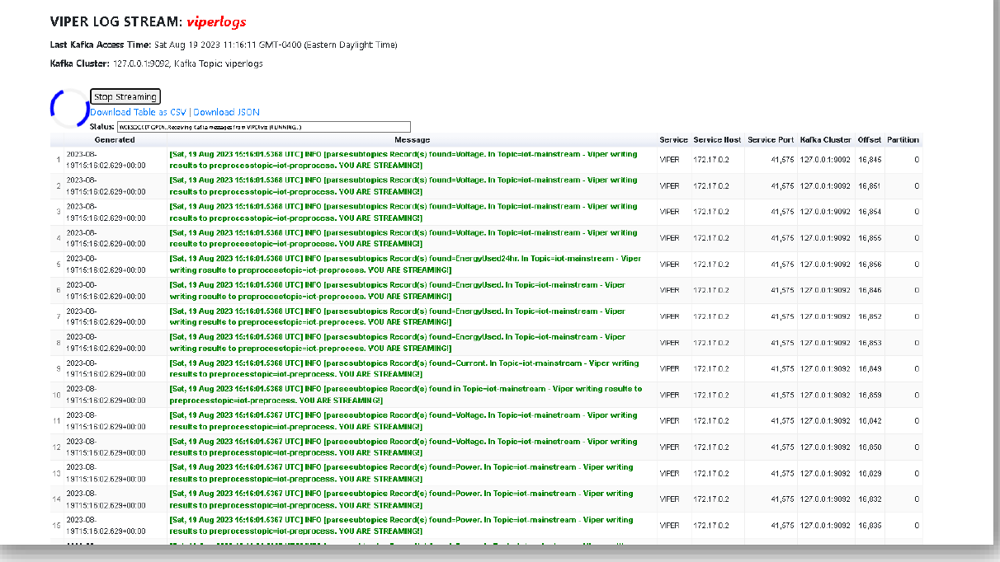

TML Real-Time Logs
======================

Real-Time logs can be viewed in a browser by entering:  http://localhost:9005/viperlogs.html?topic=viperlogs&append=0

.. note::
   To view logs you must have Viperviz binary running.  The Viperviz binary will read the viperlogs Kafka topic and stream the log data to your browser.

   The above URL assumes Viperviz is listening on Port 9005.  This port can be set in STEP 7 Visualization Dag: Refer to :ref:`STEP 7: Real-Time Visualization: tml-system-step-7-kafka-visualization-dag`

Log Example
-----------

Here is an example of logs from a TML Solution.  GREEN items indicate Success, RED items indicate Errors.

