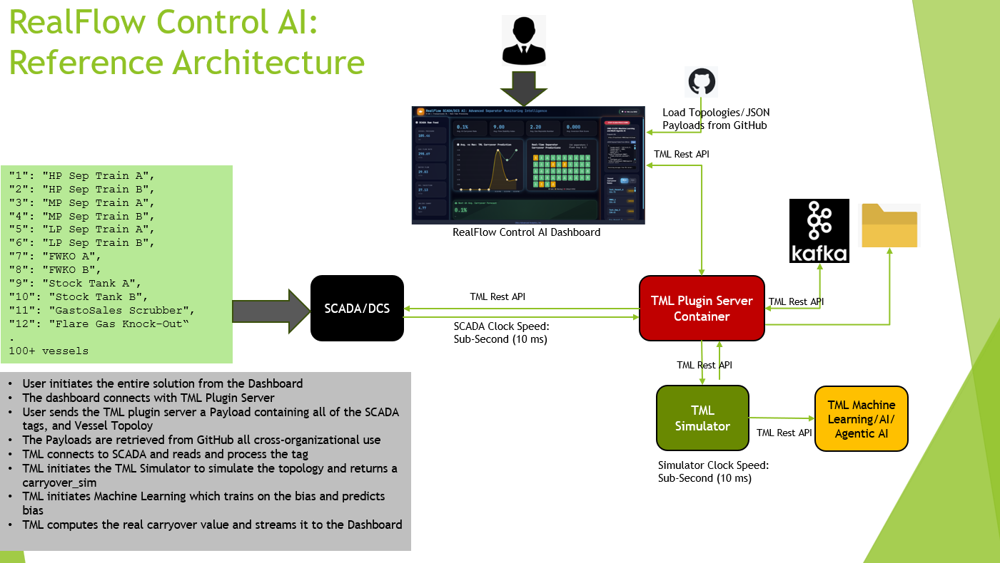
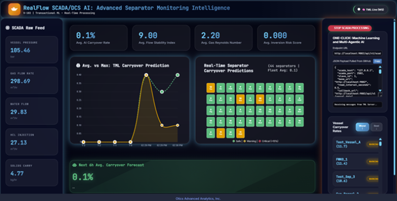
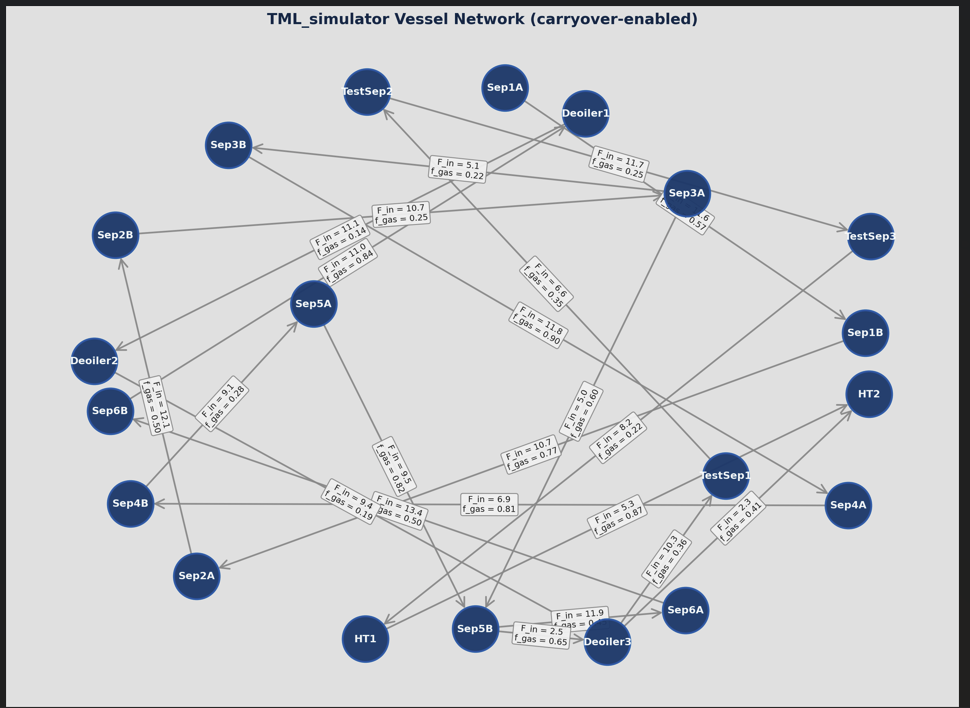
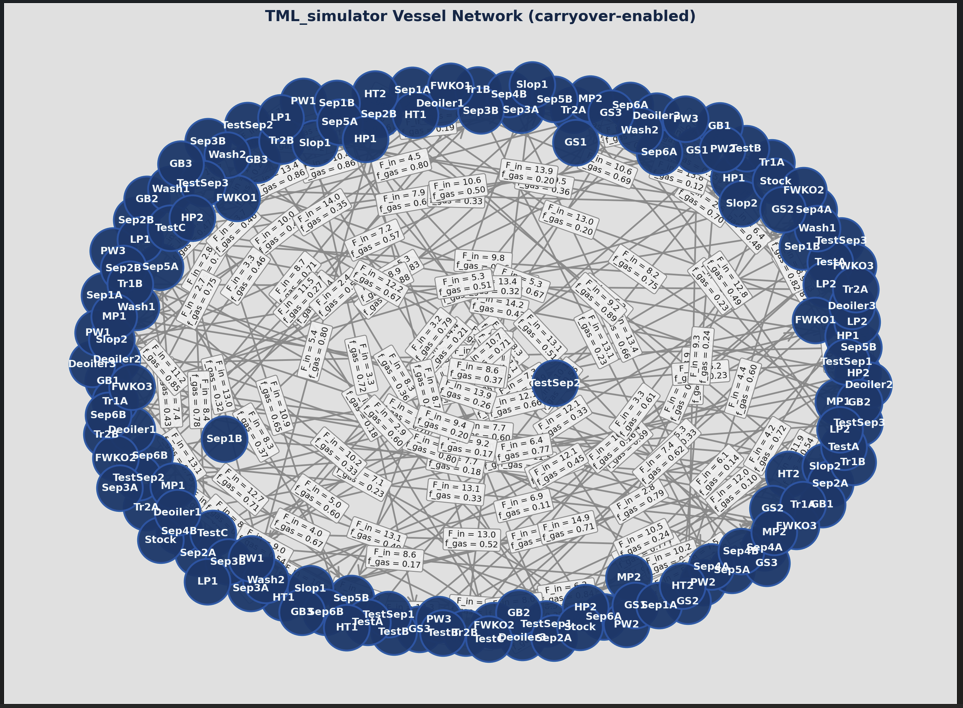

TML Simulator
================

**TML_simulator: The World’s Fastest First‑Principles Carryover Engine
with Direct SCADA/DCS Integration and Real-Time Machine Learning, AI,
Agentic AI**

.. tip::

   1. You can also view the TML Simulator `FAQ <https://tml.readthedocs.io/en/latest/tmlsimfaq.html>`_

   2. `RealFlow Control AI <https://tml.readthedocs.io/en/latest/realflow.html#realflow-control-ai-sub-millisecond-physics-tml-fusion>`_: Dashboard (Main dashboard for running the entire solution)

   3. To use the RealFlow Dashboard, you need to run the `TML Server docker container <https://tml.readthedocs.io/en/latest/tmlapi.html>`_

Executive Summary
----------------

TML_simulator is a **first‑principles physics engine** that computes
**liquid‑carryover risk per vessel in under **1 milliseconds per snapshot** while remaining fully **auditable, equation‑driven, and SCADA‑ready**. Built on Souders‑Brown‑based droplet‑physics and Numba‑accelerated computation, it:

-  Runs **real‑time physics‑baseline snapshots** at SCADA clock‑speed
  
-  To validate enterprise readiness, 150-vessel fleets were executed at 8,006 Hz. 

-  This speed enables Network Topology Convergence, allowing the simulator to perform multiple “internal iterations” of the entire plant’s physics for every single sensor update received.  Below is a 20 and 150 vessel (see Appendix D below: `Vessel 20 <https://github.com/smaurice101/readthedocs/blob/main/docs/source/tmlsimulator.rst#vessel-configuration-example-of-20-vessels>`_ and `Vessel 150 <https://github.com/smaurice101/readthedocs/blob/main/docs/source/tmlsimulator.rst#vessel-configuration-example-of-150-vessels>`_) simulation

- The 8,006 Hz benchmark achieved for a 150-vessel fleet is not merely a speed metric; it is a functional requirement for Level 5 Autonomy. In a standard 100ms SCADA clock cycle, the TML Simulator completes 800 full internal iterations of the plant’s physics. This “Velocity
6 Headroom” allows the system to perform real-time sensitivity auditing—simulating hundreds of “What-If” scenarios (e.g., “What if the pressure spikes 5% in Vessel A?”) before the next sensor update even arrives.

..

   .. image:: benchmark.png
      :width: 6.5in
      :height: 1.72in

-  Generates **offline‑ready, time‑series physics data** for ML, digital
   twins, and alarm‑tuning,

-  NO PI Historian is needed for the Machine Learning and AI – **all
   physics, processing, machine learning, AI, Agentic AI handled by TML
   solution** **Dashboard**: See Appendix E: TML RealFlow Solution

-  Is **config‑driven, not hard‑coded**, so it can be reused across any
   separation‑train topology.

Unlike black‑box AI or heavy‑CFD‑style tools, TML_simulator is
**focused‑physics code**: it does one thing cleanly — **predict
carryover bias** — and integrates that insight into control‑systems,
dashboards, and ML‑bias layers above.

Why TML Simulator Is Industry‑Leading
-------------------------------------

Most “best‑in‑class” simulation technologies fall into two camps:

-  **Full‑dynamic, multi‑phase simulators** — physically rich, but **too
   slow and too complex** for SCADA‑integration and real‑time
   monitoring.

-  **Pure‑data ML models** — fast, but **opaque, statistically
   fragile**, and hard to defend in design‑reviews or audits.

TML_simulator occupies a **third, superior tier**:

-  It **respects real‑world physics** (Souders‑Brown, droplet‑settling,
   mist‑pad efficiency, gravity‑chamber performance).

-  It runs at **SCADA‑clock‑speed** (snapshot mode), enabling continuous
   “physics‑baseline” monitoring inside existing control systems.

-  It **produces training‑data and offline‑time‑series** for ML and
   digital twins, without forcing a trade‑off between “physics” and
   “speed”.

As a result, TML_simulator is:

-  **More interpretable** than any pure‑data ML tool,

-  **Faster and lighter** than any full‑multi‑phase‑dynamic simulator,

-  **More production‑ready** than either, because it can run inside the
   same SCADA environments where operators actually make decisions.

TML Simulator Can Process
-------------------------

These are the vessels TML simulator can process:

 - separator
 - fwko
 - tank   
 - scrubber
 - ko_drum
 - dehydrator

**Default Values for Reference:**

  - "separator": {"diameter": 3.5, "height": 12.0, "gravity_h": 2.5, "mist_eff": 0.98, "souders_k": 0.35, "d_mean_um": 220.0, "carryover_scale": 0.1},
  - "fwko": {"diameter": 2.8, "height": 8.0, "gravity_h": 2.0, "mist_eff": 0.95, "souders_k": 0.32, "d_mean_um": 300.0, "carryover_scale": 0.1},
  - "tank": {"diameter": 5.0, "height": 15.0, "gravity_h": 4.0, "mist_eff": 0.85, "souders_k": 0.25, "d_mean_um": 500.0, "carryover_scale": 0.1},   
  - "scrubber": {"diameter": 2.2, "height": 7.0, "gravity_h": 1.8, "mist_eff": 0.99, "souders_k": 0.35, "d_mean_um": 150.0, "carryover_scale": 0.05},
  - "ko_drum": {"diameter": 2.0, "height": 6.0, "gravity_h": 1.6, "mist_eff": 0.80, "souders_k": 0.28, "d_mean_um": 400.0, "carryover_scale": 0.15},
  - "dehydrator": {"diameter": 3.0, "height": 10.0, "gravity_h": 2.2, "mist_eff": 0.99, "souders_k": 0.38, "d_mean_um": 100.0, "carryover_scale": 0.02}

The Fundamental Physics / Math
------------------------------

TML_simulator is built on **equation‑driven separation physics** that
mirrors real‑world separation‑design practice. The core ideas are:

1. Gas‑Velocity versus Souders‑Brown Limit
~~~~~~~~~~~~~~~~~~~~~~~~~~~~~~~~~~~~~~~~~~

For each vessel, the **cross‑sectional area** and **gas‑velocity** are
computed from geometry and flow:

.. math::

   A_{i} = \pi\left( \frac{D_{i}}{2} \right)^{2},q_{g,i} = \sum_{j}^{}F_{g,ji} \cdot h_{u,j},u_{g,i} = \frac{q_{g,i}}{A_{i} \cdot H_{i}}

where:

-  :math:`A_{i}`: vessel cross‑sectional area,

-  :math:`D_{i}`: diameter, :math:`H_{i}`: height,

-  :math:`q_{g,i}`: effective gas‑flow through the vessel (weighted by
   upstream holdup‑fractions :math:`h_{u}`).

The **Souders‑Brown limiting velocity** is:

.. math::

   v_{S,i} = K_{i}\sqrt{\frac{\rho_{L,i} - \rho_{G,i}}{\rho_{G,i}}}

-  :math:`K_{i}`: vessel‑specific Souders‑Brown constant,

-  :math:`\rho_{L,i},\rho_{G,i}`: liquid and gas densities.

Mist‑loading (dimensionless gas‑velocity ratio):

.. math::

   \left. \ \phi_{u,i} = \frac{u_{g,i}}{v_{S,i}} \in (0,5) \right\rbrack

Mist‑pad capture efficiency:

.. math::

   \eta_{\text{mist},i}(\phi_{u,i}) = \eta_{m,i} \cdot \frac{\phi_{u,i}}{5}

-  :math:`\eta_{m,i}`: maximum mist‑pad efficiency.

2. Droplet‑Settling in the Gravity Section
~~~~~~~~~~~~~~~~~~~~~~~~~~~~~~~~~~~~~~~~~~

The engine models a **log‑normal droplet‑size distribution**:

.. math::

   \ln d \sim \mathcal{N(}\mu = \ln d_{\text{mean}},\text{ }\sigma = \ln d_{\text{sigma}})

At each **3‑point quadrature point**
:math:`z_{j} \in \{ - 1.2,0.0,1.2\}`\ with weight
:math:`w_{j} \in \{ 0.25,0.5,0.25\}`, the droplet diameter is:

.. math::

   d_{j} = d_{\text{mean}} \cdot \exp(z_{j} \cdot \ln d_{\text{sigma}})

Stokes‑regime terminal‑settle velocity:

.. math::

   v_{s,j} = \frac{(\rho_{L,i} - \rho_{G,i})gd_{j}^{2}}{18\mu_{G,i}}

Dimensionless **settling‑number**:

.. math::

   \left. \ \text{Stn}_{j} = \frac{v_{s,j} \cdot h_{g,i}}{u_{g,i} \cdot H_{i}} \in (0,15 \right\rbrack

(capped at 15, as in standard separation‑design practice).

Droplet‑capture fraction in the gravity section:

.. math::

   E_{\text{gravity},j} = 1 - \exp( - \text{Stn}_{j})

Total capture fraction:

.. math::

   E_{T} = 1 - (1 - \eta_{\text{inlet}})(1 - E_{\text{gravity},j})(1 - \eta_{\text{mist},i})

-  :math:`\eta_{\text{inlet}}`: inlet‑device efficiency.

-  :math:`E_{\text{gravity},j}`: droplet‑capture in the gravity section.

-  :math:`\eta_{\text{mist},i}`: mist‑pad capture.

Droplet‑escape (carryover) at each point:

.. math::

   \mathcal{F}_{\text{esc},j} = 1 - E_{T}

Quadrature‑averaged droplet‑carryover:

.. math::

   C_{i} = \sum_{j}^{}w_{j} \cdot \mathcal{F}_{\text{esc},j}

Carryover **percentage**:

.. math::

   \text{carryover}_{i}(t) = 100 \cdot C_{i} \cdot \text{carryover_scale}_{i}

3. Vessel‑Holdup and Time‑Stepping
~~~~~~~~~~~~~~~~~~~~~~~~~~~~~~~~~~

Liquid holdup evolves according to:

.. math::

   \frac{dV_{i}}{dt} = - C_{i} \cdot q_{l,i}

-  :math:`q_{l,i} = \sum_{j}^{}F_{l,ji} \cdot h_{u,j}`: total
   liquid‑in‑flow,

-  :math:`V_{i}`: liquid volume in the vessel.

Discretized via forward‑Euler:

.. math::

   V_{i}(t) = \max\left( V_{i}(t - \Delta t) + \frac{dV_{i}}{dt} \cdot \Delta t,\text{:,}0 \right)

which is exactly what the inner‑loop of physics_carryover computes.

Why This Is Production‑Grade
~~~~~~~~~~~~~~~~~~~~~~~~~~~~

TML_simulator is **production‑physics**, not a toy:

-  It runs **sub‑10‑ms snapshots** per SCADA cycle, giving a
   **physics‑baseline carryover‑% per vessel** in real time.

-  It outputs **time‑series CSV data** for training‑data‑pipelines,
   dashboards, and compliance‑reporting.

-  It is **config‑driven**: topology, dimensions, densities, flow‑rates
   come from a human‑readable JSON, so it can be reused across thousands
   of assets.

This means:

“We’re not just running AI; we’re running **physics‑anchored, real‑time
carryover‑simulation**, integrated directly into SCADA.”

For technical leadership, it means:

-  A **credible, equation‑driven** layer between raw SCADA data and
   high‑level dashboards,

-  A **reusable, company‑wide carryover‑modeling framework** that can be
   deployed across onshore, offshore, and midstream assets.

Light Code Overview (For Technical Review)
~~~~~~~~~~~~~~~~~~~~~~~~~~~~~~~~~~~~~~~~~~

The core algorithm is a **Numba‑accelerated 1D Souders‑Brown carryover
integrator** wrapped in Python:

-  | VesselConfig / FlowConfig / Config:
   | Define the separator‑train topology, geometry, densities, and flows
     in a **config‑driven, JSON‑ready schema**.

-  | load_config:
   | Reads JSON, injects **default physics** (e.g., FWKO vs separator)
     if not provided, returns a typed Config.

-  | physics_carryover (compiled with @njit):
   | Computes **holdup fractions**, **gas / liquid in‑flows**,
     **gas‑velocity vs Souders‑Brown**, and **3‑point droplet‑quadrature
     carryover** per vessel per time‑step.

-  PhysicsCarryover:

   -  Prepares **NumPy arrays** (areas, Souders‑Brown velocities, etc.),

   -  Exposes:

      -  run: offline‑mode time‑series carryover‑% per vessel,

      -  run_snapshot: SCADA‑mode, one‑step snapshot in <10 ms.

-  main:

   -  Parses args,

   -  Calls run_snapshot by default, returning **physics‑carryover per
      vessel** suitable for demos and operator‑guidance.

This structure makes TML_simulator:

-  **Fast** (Numba‑compiled core),

-  **Auditable** (equation‑driven, not black‑box),

-  **Flexible** (config‑driven topology, snapshot + time‑series modes).

Why This Is Industry‑Leading
~~~~~~~~~~~~~~~~~~~~~~~~~~~~

Compared to the **best‑in‑class** simulation technologies available
today, TML_simulator is:

-  **More interpretable** than any pure‑data ML model, because it’s
   rooted in Souders‑Brown‑style separation‑design physics.

-  **Faster and lighter** than any full‑multi‑phase‑dynamic simulator,
   because it focuses on 1D carryover‑risk, not 3D CFD.

-  **More production‑ready** than either, because it can run inside the
   same SCADA environments where operators and engineers actually make
   decisions.

In other words, TML_simulator is **not just faster code**; it is a **new
operating model**: a **physics‑baseline** that can be run continuously,
at SCADA‑speed, across every separation train in an asset portfolio.

**
**

Appendix:
------------

TML Simulator Solution Reference Architecture
-------------------------------------------

The TML simulator is integrated with SCADA/DCS and integrated with real-time TML, AI and Agentic AI right from the dashboard.  

TML RealFlow Control AI Solution
--------------------------------

The TML simulator is integrated with the TML RealFlow Control AI Dashboard.  

Standard Vessel Configuation Template for TML Simulator
-------------------------------------------------------

   Users must provide the following configuration in JSON that is
   consistent with this template:

.. code-block::
      {
   
      "vessels": [ { ... } ],
   
      "flows": [ { ... } ],
   
      "solver": { ... },
   
      "physics": { "g": 9.81 },
   
   "sendtotopic": "<enter name for kafka topic>",
   
   "topologyname": "<enter topology name>",
   
   "localfoldername": "<enter folder name>"
   
      }

1. Example configurations can be found here:
   https://github.com/smaurice101/raspberrypi/tree/main/tml-airflow/data/payloads/scadaai/carryover

2. **vessels:** one entry per vessel, with id, name, type, and V0 (plus
   any extra‑accurate properties if you want).

3. **flows:** one entry per **internal flow** (from one vessel to
   another), with from, to, F_in, f_gas.

4. **solver:** t0, t_end, dt for design‑mode physics.

5. | **physics.g** (gravitational constant).
   | This is sufficient for us to run a **SCADA‑baseline
     carryover‑simulator** on your train, and we can handle **any number
     of vessels, any topology, and any outlet‑style flows**.”

..

   That’s a **clean, global, “Anyone‑Can‑Use‑This” standard** that fits
   your code exactly.

6. **“sendtotopic”:** Kafka topic name – all simulation data will be
   stored in this topic and can be retrieved

7. “\ **topologyname**\ ” : give a name for your topology

8. “\ **localfoldername**\ ” : all simulation data will be stored on a
   localfolder in CSV format for analysis

1. vessels — “every vessel matters”
~~~~~~~~~~~~~~~~~~~~~~~~~~~~~~~~~~~

   Each vessel must have:

-  id

-  name

-  type (used for physics defaults)

-  V0 (initial hold‑up volume)

-  Geometric and physical properties that your VESSEL_PHYSICS can fill
   in if missing.

.. code-block::

         "vessels": [
      
         {
      
         "id": 1,
      
         "name": "HP Sep 1A",
      
         "type": "separator",
      
         "V0": 8.0,
      
         "diameter": 3.8,
      
         "height": 15.0,
      
         "rho_l": 880.0,
      
         "rho_g": 70.0,
      
         "mu_g": 1.7e-5,
      
         "inlet_eff": 0.6,
      
         "mist_eff": 0.98,
      
         "souders_k": 0.36,
      
         "gravity_h": 3.0,
      
         "d_mean_um": 250.0,
      
         "d_sigma_um": 1.4,
      
         "carryover_scale": 1.0
      
         },
      
         {
      
         "id": 2,
      
         "name": "HP Sep 1B",
      
         "type": "separator",
      
         "V0": 8.0
      
         },
      
         {
      
         "id": 3,
      
         "name": "MP Sep 1A",
      
         "type": "separator",
      
         "V0": 6.0
      
         },
      
         {
      
         "id": 4,
      
         "name": "MP Sep 1B",
      
         "type": "separator",
      
         "V0": 6.0
      
         },
      
         {
      
         "id": 5,
      
         "name": "LP Sep 1A",
      
         "type": "separator",
      
         "V0": 4.0
      
         },
      
         {
      
         "id": 6,
      
         "name": "LP Sep 1B",
      
         "type": "separator",
      
         "V0": 4.0
      
         },
      
         {
      
         "id": 7,
      
         "name": "FWKO 1A",
      
         "type": "fwko",
      
         "V0": 2.0
      
         },
      
         {
      
         "id": 8,
      
         "name": "FWKO 1B",
      
         "type": "fwko",
      
         "V0": 2.0
      
         },
      
         {
      
         "id": 9,
      
         "name": "Stock Tank 1A",
      
         "type": "tank",
      
         "V0": 6.0
      
         },
      
         {
      
         "id": 10,
      
         "name": "Stock Tank 1B",
      
         "type": "tank",
      
         "V0": 6.0
      
         },
      
         {
      
         "id": 11,
      
         "name": "GastoSales Scrubber",
      
         "type": "separator",
      
         "V0": 1.5
      
         },
      
         {
      
         "id": 12,
      
         "name": "Flare Gas KO",
      
         "type": "separator",
      
         "V0": 1.0
      
         }
      
         ]

2. flows — “every internal pipe”
~~~~~~~~~~~~~~~~~~~~~~~~~~~~~~~~

Each flow must have:

-  from_id

-  to_id

-  F_in (total flow rate in consistent units, e.g., m³/h)

-  f_gas (gas‑fraction, 0–1)

.. code-block::

      "flows": [
      
      { "from": 1, "to": 3, "F_in": 12.0, "f_gas": 0.60 },
      
      { "from": 2, "to": 4, "F_in": 11.0, "f_gas": 0.60 },
      
      { "from": 3, "to": 5, "F_in": 8.0, "f_gas": 0.55 },
      
      { "from": 4, "to": 6, "F_in": 7.5, "f_gas": 0.55 },
      
      { "from": 5, "to": 7, "F_in": 6.0, "f_gas": 0.50 },
      
      { "from": 6, "to": 8, "F_in": 6.5, "f_gas": 0.50 },
      
      { "from": 7, "to": 9, "F_in": 12.0, "f_gas": 0.10 },
      
      { "from": 8, "to": 10, "F_in": 12.5, "f_gas": 0.10 },
      
      { "from": 5, "to": 11, "F_in": 3.0, "f_gas": 1.00 },
      
      { "from": 6, "to": 11, "F_in": 3.2, "f_gas": 1.00 },
      
      { "from": 11, "to": 0, "F_in": 6.2, "f_gas": 1.00 },
      
      { "from": 12, "to": 0, "F_in": 0.8, "f_gas": 1.00 }
      
      ]

What every company must provide per flow:
~~~~~~~~~~~~~~~~~~~~~~~~~~~~~~~~~~~~~~~~~

-  from and to (matching existing vessel ids for internal flows)

-  F_in (total flow rate)

-  f_gas (gas‑fraction)

If they want to model **outlets** (e.g., “to sales”, “to flare”), they
can:

-  Use to: 0 (or any id not in vessels) and let the simulator silently
   ignore them in the internal‑matrix, or

-  Add a dummy vessel (e.g., id=0, name="GasToSales") and treat it like
   any other node.

Either way, the **standard requirement is only to list all internal
flows**; outlets are optional extras.

3. solver — “run time range”
~~~~~~~~~~~~~~~~~~~~~~~~~~~~

This is **required** for run (design‑mode); run_snapshot can ignore it.

.. code-block::

      "solver": {
      
      "t0": 0.0,
      
      "t_end": 15.0,
      
      "dt": 0.1
      
      }

What every company must provide:
~~~~~~~~~~~~~~~~~~~~~~~~~~~~~~~~

-  t0 (start time, usually 0.0)

-  t_end (end time, e.g., 15.0 hours or 24.0 hours)

-  dt (time step for design‑mode runs, e.g., 0.1 s)

They can choose:

-  COARSE mode: dt = 0.1 for fast physics, or

-  FINE mode: smaller dt, longer t_end.

4. physics — “global constants”
~~~~~~~~~~~~~~~~~~~~~~~~~~~~~~~

.. code-block::
      
     "physics": {
      
      "g": 9.81
      
      }

| At a minimum, every company must provide g (gravitational
  acceleration).
| You can extend this later with:

-  P_gas_ref, T_gas_ref, or other global defaults.

But for now, **g is the only absolute requirement**.

5. Minimal “anything‑goes” version
~~~~~~~~~~~~~~~~~~~~~~~~~~~~~~~~~~

To make it **super easy** for any company to get started, you can accept
a **minimal config** like this:

.. code-block::

      {
      
      "vessels": [
      
      { "id": 1, "name": "Separator 1", "type": "separator", "V0": 10.0 },
      
      { "id": 2, "name": "FWKO 1", "type": "fwko", "V0": 5.0 },
      
      { "id": 3, "name": "Stock Tank 1", "type": "tank", "V0": 8.0 }
      
      ],
      
      "flows": [
      
      { "from": 1, "to": 2, "F_in": 10.0, "f_gas": 0.6 },
      
      { "from": 2, "to": 3, "F_in": 8.0, "f_gas": 0.1 }
      
      ],
      
      "solver": { "t0": 0.0, "t_end": 10.0, "dt": 0.1 },
      
      "physics": { "g": 9.81 },
      
      "sendtotopic": "carryover_physics",
      
      "topologyname": "config2",
      
      “localfoldername”: “mysimulationdata”
      
      }

Everything else can be **filled from defaults** (VESSEL_PHYSICS); they
just need to give:

-  Vessels with id, name, type, V0,

-  Flows with from, to, F_in, f_gas,

-  solver time‑range,

-  physics.g.

-  sendtotopic : sends this result to a kafka topic

-  topologyname: give a name to this topology to keep track

-  localfoldername: stores simulation data to disk

**
**

Mapping the SCADA Tags To Vessel Physics
========================================

“We need per‑vessel SCADA‑tags:

-  operatingPressure, operatingTemperature,

-  gasFlowRate, gasDensity, gasViscosity,

-  hclFlowRate, hclDensity, hclViscosity,

-  | waterFlowRate, waterDensity, waterViscosity.
   | From these, we compute:

-  Total liquid flow,

-  Gas‑fraction,

-  rho_l, rho_g, mu_g,

-  And build an internal flows topology that matches the train‑diagram.

-  We then run our physics‑engine at SCADA‑frequency and
   write **carryover‑%** per vessel back as new tags.”

Below is a **direct, field‑ready integration plan** based on your:

-  List of fields (SCADA tags),

-  The existing PhysicsCarryover engine,

-  And SCADA / Modbus / OPC‑UA‑style drivers.

1. What the SCADA fields give us:
---------------------------------

Your fields list is per‑vessel or per‑flow; for each **vessel** in the
train, you typically get:

-  Operating conditions:

   -  vesselIndex,

   -  operatingPressure,

   -  operatingTemperature.

-  Gas‑stream:

   -  gasFlowRate,

   -  gasDensity,

   -  gasCompressabilityFactor,

   -  gasViscosity.

-  Liquid‑phases:

   -  hclFlowRate, hclDensity, hclViscosity, hclSurfaceTension,

   -  waterFlowRate, waterDensity, waterViscosity, waterSurfaceTension,

   -  hclWaterSurfaceTension,

   -  phseInversionCriticalWaterCut.

-  Solids:

   -  solidFlowRate, solidDensity.

From that, you can construct for each vessel:

-  **Total liquid flow** = hclFlowRate + waterFlowRate.

-  **Total liquid density** (approx): weighted‑average
   of hclDensity and waterDensity.

-  **Total liquid viscosity** (approx): log‑mean or simple average
   of hclViscosity and waterViscosity.

-  **Gas‑fraction**:

   -  f_gas = gasFlowRate / (gasFlowRate + totalLiquidFlowRate).

-  rho_l and rho_g = hcl/water and gasDensity as‑reported.

-  mu_g = gasViscosity.

-  F_in_total = gasFlowRate + totalLiquidFlowRate.

You can ignore:

-  solidFlowRate, solidDensity (for now, unless you want to model
   sand‑enhanced‑carryover later),

-  gasCompressabilityFactor (if you’re not doing rigorous EoS
   corrections).

2. Mapping SCADA tags to physics inputs
---------------------------------------

For each SCADA cycle, for each vessel:

*# Example mapping per vessel (inside your SCADA‑loop)*

.. code-block::

      **def** build_vessel_physics_from_tags(vessel_tags):
      
      *# Assume vessel_tags is a dict from SCADA*
      
      P = vessel_tags["operatingPressure"] *# Pa or bar*
      
      T = vessel_tags["operatingTemperature"] *# °C or K*
      
      Fg = vessel_tags["gasFlowRate"] *# m³/s or equivalent*
      
      F_o = vessel_tags["hclFlowRate"] *# oil / HCL*
      
      F_w = vessel_tags["waterFlowRate"] *# water*
      
      rho_g = vessel_tags["gasDensity"]
      
      rho_o = vessel_tags["hclDensity"]
      
      rho_w = vessel_tags["waterDensity"]
      
      mu_g = vessel_tags["gasViscosity"]
      
      *# Compute total liquid flow*
      
      F_l = F_o + F_w
      
      rho_l = (F_o \* rho_o + F_w \* rho_w) / (F_o + F_w) *# vol‑avg*
      
      *# Gas‑fraction in mixed‑flow (use this for your SolverConfig flows)*
      
      **if** F_g + F_l > 0:
      
      f_gas = F_g / (F_g + F_l)
      
      **else**:
      
      f_gas = 0.0
      
      *# Optional: compute liquid‑viscosity log‑mean*
      
      *# mu_l = ... if you want, but not used by your current kernel*
      
      **return** {
      
      "F_in": F_g + F_l, *# m³/s*
      
      "f_gas": f_gas,
      
      "rho_l": float(rho_l),
      
      "rho_g": float(rho_g),
      
      "mu_g": mu_g,
      
      }

Then for each train:

-  Build flows with from ↔ to and the above F_in, f_gas per vessel.

-  Build vessels with rho_l, rho_g, mu_g pulled from tags (or
   from VESSEL_PHYSICS if you prefer fixed defaults).

CORE Mappings For Each Vessel
~~~~~~~~~~~~~~~~~~~~~~~~~~~~~

-  **F_in**

-  **f_gas**

-  **rho_l**

-  **rho_g**

-  **mu_g**

**
**

What TML Carryover Solution is Predicting
------------------------------------------

| TML is computing and predicting: **“Physics‑baseline + TML bias
  correction”**,
| where the **real, final carryover** the customer cares about is:

:math:`\text{carryover_real}\mathbf{=}\text{carryover_physics}\mathbf{+ TML_}\text{bias_prediction}`

Here’s how to structure it cleanly.

**1. Three carryover quantities**

Users track:

a. | **carryover_empirical**
   | → Carryover computed SCADA data:

   -  **carryover_empirical** = (waterFlowRate + hclFlowRate +
      solidFlowRate) / (waterFlowRate + hclFlowRate + solidFlowRate +
      gasFlowRate)

   -  **raw_co =** (waterFlowRate + hclFlowRate + solidFlowRate) /
      (waterFlowRate + hclFlowRate + solidFlowRate + gasFlowRate)

   -  **TML uses: carryover_empirical = 15.0 \* (raw_co \*\* 0.3)**

   -  "The 15.0 \* (raw_co \*\* 0.3) formula was developed by field
      operators to:

   -  Match their observed compressor trips, foamouts, and mist pad
      inspections

   -  Provide actionable carryover risk on the dashboard they already
      trust

   -  Compress liquid fraction (0-1) into carryover scale (1-15%)

   -  15.0 = scaling factor to match field-observed carryover events

   -  0.3 exponent = diminishing returns (high liquid load → less
      marginal carryover risk)

   -  Validated against: operator experience, upset events, maintenance
      records

      -  1. Range compression: raw_co^0.3 maps [0,1] → [0,1] with
         diminishing returns

      -  raw_co = 0.1 → 0.46, raw_co = 0.9 → 0.97 (matches carryover
         behavior)

      -  2. Scale factor 15.0 brings output to 1-15% range
         (field-observed carryover)

      -  3. Nonlinearity captures physics reality: carryover doesn't
         scale linearly with liquid load

..

   **SCADA → TML Physics → ML Bias Correction → carryover_final**

   Legacy: 15.0 \* (raw_co \*\* 0.3) [Operator proxy]

   Physics: PhysicsCarryover [First principles]

   To ensure we have an Apples-Apples comparison between carryover from SCADA and Physics, the SCADA carryover is scaled using: scaling_factor = carryover_physics/carryover_scada

   This creates a new scaled SCADA variable: carryover_scada_norm = carryover_scada * scaling_factor

   Bias: ML(carryover_scada_norm - carryover_physics)

   Final: carryover_physics + ML_bias [Best of both]

b. | **carryover_physics** from TML simulator
   | → your TML physics‑carryover (%) from PhysicsCarryover (baseline,
     physically interpretable).

c. | **carryover_bias**
   | → empirical “error” of physics vs empirical (or vs field‑data):

.. math::

   \text{carryover_bias} = \text{carryover_scada_norm} - \text{carryover_physics}

d. TML trains and **predicts carryover_bias** from features:

..

   carryover_bias = f(gasFlowRate, waterFlowRate, operatingPressure, stokes_number,
   density_ratio, emulsion_ratio, inversion_risk, ...)

e. finally compute the “real” customer‑carryover as:

.. math::

   \text{carryover_real} = \text{carryover_physics} + \text{TML_bias_prediction}

This is **exactly the “bias‑correction” pattern** used in climate, CFD,
and reservoir‑simulation:

-  Keep a **physics‑baseline model** that is interpretable,

-  Use **data** to learn the **systematic error / bias** (foam,
   slugging, calibration‑drift, etc.),

-  Combine them into a **final prediction** that matches
   field‑experience.

2. Why this is better than using only the empirical or only the physics
-----------------------------------------------------------------------

-  | **Only carryover_empirical**
   | → arbitrary, hard‑to‑explain, hard‑to‑audit.

-  | **Only carryover_physics**
   | → physically sound, but may under‑/over‑estimate real‑world
     carryover due to:

   -  Foam,

   -  Internals,

   -  Sensor‑calibration,

   -  Approximations in Souders‑Brown / mist‑pad‑efficiency.

-  | **carryover_physics + TML_bias_prediction**
   | → best of both worlds:

   -  **Physics‑anchor** (safety‑related, auditable, can be used for
      design),

   -  **ML‑correction** that adapts to real‑world conditions,
      foaming‑regimes, and operator‑experience.

→ This is what we show to operators, dashboards, and alarms.

3. Practical “deployment stages” you can document
~~~~~~~~~~~~~~~~~~~~~~~~~~~~~~~~~~~~~~~~~~~~~~~~~

**3‑stage story**:

1. **Stage 1 – Physics‑baseline only**

   -  carryover_physics runs, compared to carryover_empirical (normalized) and
      field‑data.

   -  Tunes TML‑physics‑parameters
      (mist_eff, souders_k, carryover_scale) until baseline is sensible.

2. **Stage 2 – Physics‑baseline + bias‑learning**

   -  Fit ML to (empirical_normalized – physics) = bias,

   -  Show that ML‑bias‑correction reduces residuals versus field‑data.

3. **Stage 3 – Full “real carryover” layer**

   -  Operators see carryover_real = physics + ML‑bias,

   -  Explainable: “physics says X, ML‑correction adds Y due to foam /
      slugging / calibration‑drift.”

This is key to:

-  **Operators**: “We have a real‑physics‑anchor, not just a black‑box
   formula.”

-  **Engineers / auditors**: “You can inspect the baseline and validate
   it against Aspen‑style tools.”

-  **Executives**: “We’re using ML to *refine* first‑principles physics,
   not replace it.”

Summary
~~~~~~~

**We Do This**:

-  Compute **carryover_physics** (TML),

-  Compute **carryover_empirical** (legacy formula) and normalize to carryover_scada_norm,

-  Define **carryover_bias = carryover_scada_norm − carryover_physics**,

-  Train **ML to predict carryover_bias**,

-  Then report:

.. math::

   \boxed{\text{carryover_real}\mathbf{=}\text{carryover_physics}\mathbf{+}\text{TML_bias_prediction}}

That gives you a **production‑ready, physics‑anchored, ML‑corrected
carryover‑engine** that every oil‑and‑gas company will understand and
trust.

Vessel Configuration: Example of 20 Vessels
-----------------------------------------

**Goto Github to see configuration in section "tml_physics_simulator”:**
https://github.com/smaurice101/raspberrypi/blob/main/tml-airflow/data/payloads/scadaai/carryover/config20

Vessel Configuration: Example of 150 Vessels
-----------------------------------------

**Goto Github to see configuration in section "tml_physics_simulator”:**
https://github.com/smaurice101/raspberrypi/blob/main/tml-airflow/data/payloads/scadaai/carryover/config150

TML RealFlow Solution
-----------------------

The entire physics-based model and SCADA/DCS integration is triggered
directly from the TML RealFlow dashboard shown below.

Customers’ Advantages:
----------------------

1. Worlds **FASTEST** and direct physics-based simulator that directly
   uses SCADA data in real-time for the Physics integrated with
   real-time machine learning, AI, Agentic AI

2. **Low-cost – no PI Historian needed – Physics simulator bundled in
   the Dashboard.**

3. Scalable across complex topologies and configurations

4. Dashboard driven – minimal training required.

5. All data: simulation, machine learning and AI stored on Apache Kafka
   topic, and on local disk in CSV and JSON

6. Complete transparency and auditability

7. **Engineer / Data Scientist Focused with the Business in Mind**

.. image:: realflowmaindash.png
   :width: 6.5in
   :height: 3.30347in

1D Souders-Brown and 3D CFD
===========================

1D Souders-Brown is a fast empirical equation for separator design,
while full 3D CFD provides detailed flow visualization but at much
higher computational cost.

**Core Physics Approach**
-------------------------

**Souders-Brown (1D):**

.. math::

   Vs = K \* sqrt( (ρL - ρG) / ρG )

**Assumptions:**

-  Uniform gas velocity across vessel cross-section, no wall effects,
   droplets follow Stokes settling

-  What it predicts: Maximum allowable superficial gas velocity before
   liquid carryover

-  Dimensions: Single velocity value (scalar) per vessel

-  Runtime: Milliseconds

**3D CFD (CFF/Computational Fluid Dynamics):**

-  Solves full Navier-Stokes equations across vessel mesh (10k-10M
   cells)

-  Captures velocity gradients, recirculation zones, inlet jetting, wall
   wetting

-  Outputs full 3D velocity/pressure/droplet concentration fields

-  Runtime: Hours-days

**Practical Differences**

+--------------+------------------------+------------------------------+
| **Aspect**   | **1D Souders-Brown**   | **3D CFD**                   |
+==============+========================+==============================+
| **Geometry** | Diameter only          | Full CAD vessel + internals  |
+--------------+------------------------+------------------------------+
| **Flow       | Uniform velocity       | 3D velocity vectors +        |
| Field**      |                        | turbulence                   |
+--------------+------------------------+------------------------------+
| **Droplet    | Population balance     | Lagrangian particle tracking |
| Tracking**   | (your code)            |                              |
+--------------+------------------------+------------------------------+
| **           | Field data             | Lab experiments + field      |
| Validation** | correlations           |                              |
+--------------+------------------------+------------------------------+
| **Use Case** | Vessel sizing,         | Troubleshooting carryover,   |
|              | screening              | optimization                 |
+--------------+------------------------+------------------------------+
| **Your       | Implements this        | N/A                          |
| Code**       | exactly                |                              |
+--------------+------------------------+------------------------------+

When Each Wins: 1D vs 3D 
-------------------------

**Use 1D Souders-Brown (your simulator):**

-  Vessel networks (100+ vessels)

-  Real-time SCADA bias correction

-  Parametric studies (what-if sizing)

-  Daily operations monitoring

**Use 3D CFD:**

-  Single problem vessel with unexpected carryover

-  New internals design (mist pads, baffles)

-  Inlet device optimization

-  CFD validates your 1D assumptions

Hybrid Reality (Industry Practice)
----------------------------------

**Most operators run 1D physics → flag vessels >2-3% carryover → run 3D
CFD on those specific vessels only.**

TML Simulator sophisticated: quadrature droplet distribution + Souders
mist loading.

-  The Souders-Brown in your PhysicsCarryover is production-grade for
   fleet monitoring.

-  3D CFD would be for the 5% of vessels that fail your screen.

Perfect architecture.

Industry Perspective
--------------------

1D Souders-Brown remains **excellent** for production use—it's been the
oil & gas industry standard for 80+ years for good reason.

**Why It's Still "Very Good"**

**1. Field-Proven Accuracy**

-  Correctly sizes 90%+ of separators worldwide

-  TML simulation mist loading + quadrature droplets makes it more
   sophisticated than basic Vs equation

-  Validates against decades of operational data across thousands of
   vessels

Computational Reality
---------------------

-  TML Simulator uses Numba code: ~1ms per snapshot (100 vessels)

   -  **Numba code** is Python code accelerated by the Numba JIT
      (Just-In-Time) compiler.

..

   **@njit(fastmath=True) # ← This decorator = Numba magic**

   **def physics_carryover(...):**

   **# NumPy loops → C-speed machine code**

-  **Without Numba:**

..

   100 vessels × 24hr sim = 10+ seconds per call → Too slow for SCADA

-  **With Numba (TML Simulator):**

..

   100 vessels × 24hr sim = 1-10ms → Perfect for real-time flowsheet

-  Full 3D CFD: ~24+ hours per vessel

You can run your physics 86 million times in the same time CFD takes for
one vessel.

Network Scale
-------------

-  Single vessels: CFD occasionally beats 1D by 5-10%

-  **Fleet monitoring** (TML use case): 1D physics catches the 5%
   problem vessels perfectly

-  CFD can't economically screen 100+ vessels daily

Engineering Truth
-----------------

-  Souders-Brown + your droplet distribution + mist efficiency =
   production-grade physics that pays for itself daily through avoided
   carryover losses.

-  CFD is for the edge cases your code correctly identifies.

Carryover Details
---------------------

SCADA carryover IS per-vessel and physics accounts for topology coupling: 

•	SCADA carryover field = measured outbound carryover per vessel i. 

•	Physics carryover[:,i] = predicted outbound carryover for vessel i.

•	Carryover_bias = measured (from SCADA) – predicted (from Physics) (per vessel – directly comparable)

Details:

1.	Carryover_scada = 15.0 * (raw_co ** 0.3) (this equation can be changed by user)

  a.	This value is calculated for every SCADA data generated by the vessels – it is NOT using the Physics simulator – it’s a straightforward calculation

  b.	absolute carryover (kg/s)
  
  c.	it is computed for each vessel -so 12 vessels – 12 carryover_scada calculations each time new data shows up in SCADA
  
  d.	SCADA measures OUTBOUND carryover per vessel
  
  e.	Each sensor sees its vessel's carryover

2.	carryover_physics :
  
  a.	This DOES use the TML simulator physics (with Step=1, steady state)  using the customer provided topology (i.e.config2)
  
  b.	Physics simulates the SAME per-vessel carryover using the SAME SCADA data as in carryover_scada in its topology

EXAMPLE:

•	Vessel 1 (HP Sep):

  o	SCADA: fg_tot=370 kg/h → carryover_scada  = 0.00089 kg/s ✓
  
  o	Physics: fg_tot=370 kg/h → carryover_physics  = 0.000010 kg/s ✓
  
  o	Bias: 0.00089 - 0.000010 = 0.00088 kg/s

Flowsheet: 1D Souders-Brown and 3D CFD
--------------------------------------

**Flowsheet Architecture**

+-----------+------------------------------+--------------------------+
| *         | **TML 1D Souders-Brown**     | **3D CFD**               |
| *Aspect** |                              |                          |
+===========+==============================+==========================+
| **Scope** | Multi-vessel network (HP →   | Single vessel internals  |
|           | IP → LP separators, FWKO,    |                          |
|           | tanks)                       |                          |
+-----------+------------------------------+--------------------------+
| **Nodes** | 50-200 vessels + flows       | 1 vessel (10M+ mesh      |
|           |                              | cells)                   |
+-----------+------------------------------+--------------------------+
| **Conn    | Flow matrices (gas/liquid    | Inlet/outlet boundary    |
| ections** | streams)                     | conditions               |
+-----------+------------------------------+--------------------------+
| **        | Per-vessel carryover %       | 3D                       |
| Physics** |                              | vel                      |
|           |                              | ocity/turbulence/droplet |
|           |                              | fields                   |
+-----------+------------------------------+--------------------------+
| **Solve   | 1-10ms total network         | 12-72hrs per vessel      |
| Time**    |                              |                          |
+-----------+------------------------------+--------------------------+

Units Table
---------------

+-------------------------+--------------------------------------------+
| **Variable**            | **Likely Units / Scaling Explanation**     |
+=========================+============================================+
| vesselIndex             | unitless index (integer 1–12)              |
+-------------------------+--------------------------------------------+
| operatingPressure (Pg)  | **bar** or **psig** (SCADA‑scaled; treat   |
|                         | as absolute pressure in bar if using SI)   |
+-------------------------+--------------------------------------------+
| operatingTemperature    | **°C**                                     |
+-------------------------+--------------------------------------------+
| gasFlowRate (Qg)        | **kg/s** or **m³/s** (mass or volumetric   |
|                         | gas rate)                                  |
+-------------------------+--------------------------------------------+
| gasDensity (rhog)       | **kg/m³** (gas density, but 0.0 here is    |
|                         | invalid / bad signal)                      |
+-------------------------+--------------------------------------------+
| g                       | **unitless**, scaled as Zg = Z×1000 (so    |
| asCompressabilityFactor | 960 → 0.960)                               |
| (Zg)                    |                                            |
+-------------------------+--------------------------------------------+
| gasViscosity (mug       | Raw SCADA value; your derived mug =        |
| signal)                 | gasViscosity / 1000000.0 should be         |
|                         | **Pa·s** (≈ cP scaled to SI)               |
+-------------------------+--------------------------------------------+
| hclFlowRate (Qh)        | **kg/s** or **m³/s** (acid / liquid flow)  |
+-------------------------+--------------------------------------------+
| hclDensity (ρh)         | **kg/m³**                                  |
+-------------------------+--------------------------------------------+
| hclViscosity            | **cP‑like / scaled viscosity**; treat as   |
|                         | **mPas** or **Pa·s** depending on context  |
+-------------------------+--------------------------------------------+
| hclSurfaceTension (sow) | **mN/m** or **dyne/cm** (surface tension   |
|                         | liquid–liquid)                             |
+-------------------------+--------------------------------------------+
| waterFlowRate (Qw)      | **kg/s** or **m³/s** (water flow)          |
+-------------------------+--------------------------------------------+
| waterDensity (rhow)     | **kg/m³** (≈1000 kg/m³ for water)          |
+-------------------------+--------------------------------------------+
| waterViscosity (muw     | Raw SCADA value; derived muw should be     |
| signal)                 | **Pa·s**                                   |
+-------------------------+--------------------------------------------+
| waterSurfaceTension     | **mN/m** or **dyne/cm** (surface tension   |
| (sw)                    | liquid–gas)                                |
+-------------------------+--------------------------------------------+
| hclWaterSurfaceTension  | **mN/m** or **dyne/cm** (liquid–liquid     |
| (sow)                   | surface tension)                           |
+-------------------------+--------------------------------------------+
| phseIn                  | **unitless fraction × 1000**, e.g., 444 →  |
| versionCriticalWaterCut | **0.444** (44.4%)                          |
+-------------------------+--------------------------------------------+
| picwc                   | **unitless fraction** (critical water cut) |
+-------------------------+--------------------------------------------+
| solidFlowRate (Qs)      | **kg/s** or **m³/s** (solid flow)          |
+-------------------------+--------------------------------------------+
| solidDensity            | **kg/m³** (≈100–3000 kg/m³ depending on    |
|                         | solids)                                    |
+-------------------------+--------------------------------------------+
| rho_l                   | **kg/m³** (total liquid density, derived   |
|                         | from mixing rule)                          |
+-------------------------+--------------------------------------------+
| raw_co                  | **unitless fraction** (0–1) of liquid vs   |
|                         | total phase                                |
+-------------------------+--------------------------------------------+
| carryover               | This is a **scaled index** (e.g.,          |
|                         | carryover = 15.0 \* (raw_co**0.3)); after  |
|                         | normalization with carryover_scada_norm =  |
|                         | carryover \* scaling_factor, it becomes    |
|                         | **physical carryover** (kg/s, or same unit |
|                         | as your physics baseline)                  |
|                         |                                            |
|                         | The Scaling factor is simple:              |
|                         | scaling_factor = carryover_sim/carryover   |
|                         |                                            |
|                         | **Carryover_bias** = carryover_scada_norm  |
|                         | – carryover_sim                            |
+-------------------------+--------------------------------------------+
| flow_stability          | **unitless** or engineering index (high    |
|                         | values indicate instability)               |
+-------------------------+--------------------------------------------+
| F_liq                   | **kg/s** or **m³/s** (total liquid flow:   |
|                         | Qw + Qh + Qs)                              |
+-------------------------+--------------------------------------------+
| F_total                 | **kg/s** or **m³/s** (total in‑going flow, |
|                         | Qg + F_liq)                                |
+-------------------------+--------------------------------------------+
| gas_reynolds            | **Re = (Qg × rhog) / (mug + 1e-6)** →      |
|                         | **dimensionless** (gas Reynolds)           |
+-------------------------+--------------------------------------------+
| Qs                      | **kg/s** or **m³/s** (same as above;       |
|                         | duplicated for access)                     |
+-------------------------+--------------------------------------------+
| emulsion_ratio (sw /    | **unitless** (surface tension ratio,       |
| sow)                    | liquid–gas vs liquid–liquid)               |
+-------------------------+--------------------------------------------+
| reynolds_ratio          | **unitless** (Re_gas / Re_water)           |
+-------------------------+--------------------------------------------+
| f_gas                   | **unitless fraction** (gas fraction of     |
|                         | total flow)                                |
+-------------------------+--------------------------------------------+
| muw                     | **Pa·s** (water viscosity, derived)        |
+-------------------------+--------------------------------------------+
| sw                      | **mN/m** or **dyne/cm** (surface tension,  |
|                         | same as above)                             |
+-------------------------+--------------------------------------------+
| rhow                    | **kg/m³** (same as above)                  |
+-------------------------+--------------------------------------------+
| inversion_risk          | **unitless index** (Qw / Qg − picwc)       |
+-------------------------+--------------------------------------------+
| density_ratio (rhow /   | **unitless** (liquid/gas density ratio)    |
| rhog)                   |                                            |
+-------------------------+--------------------------------------------+
| water_reynolds          | **Re_water = (Qw × rhow) / (muw + 1e-6)**  |
|                         | → **dimensionless**                        |
+-------------------------+--------------------------------------------+
| Qw                      | **kg/s** or **m³/s** (same as above)       |
+-------------------------+--------------------------------------------+
| stokes_number           | **unitless** (classical or system‑defined  |
|                         | Stokes‑number‑like term)                   |
+-------------------------+--------------------------------------------+
| Qg                      | **kg/s** or **m³/s** (same as above)       |
+-------------------------+--------------------------------------------+
| Pg                      | **bar** or **psig** (same as               |
|                         | operatingPressure)                         |
+-------------------------+--------------------------------------------+
| Qh                      | **kg/s** or **m³/s** (same as above)       |
+-------------------------+--------------------------------------------+
| mug                     | **Pa·s** (gas viscosity, derived from      |
|                         | gasViscosity scaled)                       |
+-------------------------+--------------------------------------------+
| sow                     | **mN/m** or **dyne/cm** (same as above)    |
+-------------------------+--------------------------------------------+
| Zg                      | **unitless compressibility factor**,       |
|                         | derived as Zg = gasCompressabilityFactor / |
|                         | 1000.0                                     |
+-------------------------+--------------------------------------------+

Vessel and Model Variables
----------------------------

Scada Raw Measurements
~~~~~~~~~~~~~~~~~~~~~~

+------------------+-----+-------+---------------+-------------------+
| **Variable**     | **U | **    | *             | **Role**          |
|                  | nit | Scale | *Importance** |                   |
|                  | s** | Fac   |               |                   |
|                  |     | tor** |               |                   |
+==================+=====+=======+===============+===================+
| o                | p   | /100  | Vessel        | Drives gas        |
| peratingPressure | sig |       | operating     | density,          |
| (Pg)             |     |       | condition     | compressibility,  |
|                  |     |       |               | Souders velocity  |
+------------------+-----+-------+---------------+-------------------+
| oper             | °F  | /100  | Thermodynamic | Affects all fluid |
| atingTemperature |     |       | state         | properties (rho,  |
| (T)              |     |       |               | mu, Z)            |
+------------------+-----+-------+---------------+-------------------+
| gasFlowRate (Qg) | k   | /100  | Primary       | Determines gas    |
|                  | g/h |       | separation    | velocity →        |
|                  |     |       | driver        | carryover         |
+------------------+-----+-------+---------------+-------------------+
| waterFlowRate    | k   | /1000 | Liquid        | Flooding risk,    |
| (Qw)             | g/h |       | loading       | phase inversion   |
+------------------+-----+-------+---------------+-------------------+
| hclFlowRate (Qh) | k   | /100  | Oil/HCl flow  | Liquid density,   |
|                  | g/h |       |               | total F_liq       |
+------------------+-----+-------+---------------+-------------------+
| solidFlowRate    | k   | /100  | Solids        | Erosion, fouling  |
| (Qs)             | g/h |       | carryover     | risk              |
+------------------+-----+-------+---------------+-------------------+

Fluid Properties
----------------

+---------------------------+-----+-------+------------+--------------+
| **Variable**              | **U | **    | **Im       | **Role**     |
|                           | nit | Scale | portance** |              |
|                           | s** | Fac   |            |              |
|                           |     | tor** |            |              |
+===========================+=====+=======+============+==============+
| gasDensity (rhog)         | kg  | /1000 | Gas        | Gas Re# →    |
|                           | /m³ |       | momentum   | entrainment  |
+---------------------------+-----+-------+------------+--------------+
| waterDensity (rhow)       | kg  | /10   | Buoyancy   | Stokes       |
|                           | /m³ |       | force      | settling     |
|                           |     |       |            | velocity     |
+---------------------------+-----+-------+------------+--------------+
| gasViscosity (mug)        | P   | /1e8  | Drag       | Droplet      |
|                           | a·s |       | forces     | Reynolds     |
|                           |     |       |            | number       |
+---------------------------+-----+-------+------------+--------------+
| waterViscosity (muw)      | P   | /1e6  | Liquid     | Liquid film  |
|                           | a·s |       | drag       | stability    |
+---------------------------+-----+-------+------------+--------------+
| waterSurfaceTension (sw)  | N/m | /1e5  | Emulsion   | Inversion    |
|                           |     |       | stability  | risk         |
+---------------------------+-----+-------+------------+--------------+
| hclWaterSurfaceTension    | N/m | /1e5  | Interface  | Emulsion     |
| (sow)                     |     |       | tension    | ratio        |
+---------------------------+-----+-------+------------+--------------+
| gasCompressabilityFactor  | -   | /1000 | Real gas   | Accurate     |
| (Zg)                      |     |       | behavior   | rho_g =      |
|                           |     |       |            | P\ *M/       |
|                           |     |       |            | (Z*\ R\ *T)* |
+---------------------------+-----+-------+------------+--------------+
| phse                      | f   | /1000 | Emulsion   | Phase        |
| InversionCriticalWaterCut | rac |       | threshold  | inversion    |
| (picwc)                   |     |       |            | risk         |
+---------------------------+-----+-------+------------+--------------+

Physics/Derived
---------------

+----------+-----+-----------+-----------------+----------------------+
| **Va     | **U | *         | **Importance**  | **Role**             |
| riable** | nit | *Source** |                 |                      |
|          | s** |           |                 |                      |
+==========+=====+===========+=================+======================+
| F_liq    | k   | Qh+Qw+Qs  | Liquid holdup   | Level control,       |
|          | g/h |           |                 | flooding             |
+----------+-----+-----------+-----------------+----------------------+
| rho_l    | kg  | Weighted  | Liquid momentum | Liquid Re#,          |
|          | /m³ |           |                 | entrainment          |
+----------+-----+-----------+-----------------+----------------------+
| F_total  | k   | Qg+F_liq  | Total           | Vessel capacity      |
|          | g/h |           | throughput      |                      |
+----------+-----+-----------+-----------------+----------------------+
| f_gas    | F   | Q         | Phase ratio     | Gas velocity scaling |
|          | rac | g/F_total |                 |                      |
+----------+-----+-----------+-----------------+----------------------+
| hu[i]    | M   | vol/(ar   | Liquid level    | Gas space volume     |
|          |     | ea\ *ht)* |                 |                      |
+----------+-----+-----------+-----------------+----------------------+
| f        | k   | Σ(fg_m    | Vessel gas load | **Primary carryover  |
| g_tot[i] | g/h | at\ *hu)* |                 | driver**             |
+----------+-----+-----------+-----------------+----------------------+
| f        | k   | Σ(fl_m    | Vessel liquid   | Level dynamics       |
| l_tot[i] | g/h | at\ *hu)* | load            |                      |
+----------+-----+-----------+-----------------+----------------------+
| gvol[i]  | m³  | are       | Gas             | **gvel =             |
|          |     | a*(ht-hl) | disengagement   | fg_tot/gvol**        |
+----------+-----+-----------+-----------------+----------------------+
| gvel[i]  | m/s | fg/       | **Gas           | **Souders-Brown      |
|          |     | 3600/gvol | velocity**      | core**               |
+----------+-----+-----------+-----------------+----------------------+
| carr     | F   | Physics   | Prediction      | ML bias training     |
| yover[i] | rac |           |                 | target               |
+----------+-----+-----------+-----------------+----------------------+

Simulator Arrays
----------------

+-----------------+-------+------+------------+-----------------------+
| **Array**       | **Sh  | *    | **Im       | **Role**              |
|                 | ape** | *Uni | portance** |                       |
|                 |       | ts** |            |                       |
+=================+=======+======+============+=======================+
| areas[i]        | (12,) | m²   | Geometry   | Level → hl = vol/area |
+-----------------+-------+------+------------+-----------------------+
| hts[i]          | (12,) | m    | Geometry   | Gas height = ht-hl    |
+-----------------+-------+------+------------+-----------------------+
| ein[i]          | (12,) | frac | Inlet sep  | Primary separation    |
+-----------------+-------+------+------------+-----------------------+
| vs_souders[i]   | (12,) | m/s  | **Design   | K\ *√[(ρl-ρg)/ρg]*    |
|                 |       |      | limit**    |                       |
+-----------------+-------+------+------------+-----------------------+
| em[i]           | (12,) | frac | Mist pad   | Secondary entrainment |
+-----------------+-------+------+------------+-----------------------+
| car             | (12,) | -    | C          | Physics → SCADA match |
| ryover_scale[i] |       |      | alibration |                       |
+-----------------+-------+------+------------+-----------------------+
| f_gas_mat       | (1    | kg/h | **Flow     | HP→MP→LP topology     |
|                 | 2,12) |      | routing**  |                       |
+-----------------+-------+------+------------+-----------------------+
| carryover[t,i]  | (     | frac | Output     | Real-time predictions |
|                 | N,12) |      |            |                       |
+-----------------+-------+------+------------+-----------------------+

Analytics Features
------------------

+--------------+-----+------------------+------------+----------------+
| **Variable** | **U | **Formula**      | **Im       | **Role**       |
|              | nit |                  | portance** |                |
|              | s** |                  |            |                |
+==============+=====+==================+============+================+
| raw_co       | f   | (Q               | Ground     | ML training    |
|              | rac | w+Qh+Qs)/F_total | truth      | target         |
+--------------+-----+------------------+------------+----------------+
| gas_reynolds | -   | ρg\ *gvel*\ D/μg | Flow       | Tur            |
|              |     |                  | regime     | bulent/laminar |
+--------------+-----+------------------+------------+----------------+
| wa           | -   | ρ                | Liquid     | Film stability |
| ter_reynolds |     | l\ *v_liq*\ D/μl | regime     |                |
+--------------+-----+------------------+------------+----------------+
| s            | -   | (                | Droplet    | Settling       |
| tokes_number |     | ρl-ρg)\ *μl/Pg²* | sep        | efficiency     |
+--------------+-----+------------------+------------+----------------+
| in           | -   | (Qw/Qg)-picwc    | Emulsion   | Operational    |
| version_risk |     |                  | risk       | alert          |
+--------------+-----+------------------+------------+----------------+
| em           | -   | sw/sow           | Stability  | Coalescence    |
| ulsion_ratio |     |                  |            | rate           |
+--------------+-----+------------------+------------+----------------+

Payload Key Fields
---------------------

.. _config-fields-table:

The following table describes the core top‑level configuration fields in the JSON payload.

+----------------------------------+-------------------------------------------------------------+
| Field name                       | Role / meaning                                              |
+==================================+=============================================================+
| ``scada_host``                   | Host IP (or hostname) of the SCADA/Modbus source to read    |
|                                  | from (here ``127.0.0.1``).                                |
+----------------------------------+-------------------------------------------------------------+
| ``scada_port``                   | Port number on the SCADA host for Modbus‑TCP or similar     |
|                                  | polling (here ``2502``).                                  |
+----------------------------------+-------------------------------------------------------------+
| ``slave_id``                     | Modbus slave ID of the device/PLC inside the SCADA network. |
+----------------------------------+-------------------------------------------------------------+
| ``base_url``                     | Base HTTP endpoint for services (e.g., internal APIs or     |
|                                  | dashboards).                                               |
+----------------------------------+-------------------------------------------------------------+
| ``read_interval_seconds``        | Polling interval (in seconds) between SCADA reads;         |
|                                  | ``0.5`` = 500 ms.                                          |
+----------------------------------+-------------------------------------------------------------+
| ``callback_url``                 | Webhook URL (in this block) to POST processed data or      |
|                                  | alerts; empty means no callback.                           |
+----------------------------------+-------------------------------------------------------------+
| ``max_reads``                    | Limit on read cycles; ``-1`` means unlimited / continuous  |
|                                  | polling.                                                   |
+----------------------------------+-------------------------------------------------------------+
| ``start_register``               | Starting Modbus register address (e.g., ``40001``) from    |
|                                  | which raw values are read.                                 |
+----------------------------------+-------------------------------------------------------------+
| ``sendtotopic`` (raw)            | Kafka / messaging topic name for raw SCADA‑style data;     |
|                                  | here ``scada-raw-data``.                                   |
+----------------------------------+-------------------------------------------------------------+
| ``createvariables``              | Inline expression string defining derived physics          |
|                                  | variables (e.g., ``carryover``, ``F_total``,              |
|                                  | ``emulsion_ratio``, etc.).                                 |
+----------------------------------+-------------------------------------------------------------+
| ``fields``                       | List of variable names (e.g., ``gasFlowRate``,            |
|                                  | ``operatingPressure``) read from SCADA and used in         |
|                                  | calculations.                                              |
+----------------------------------+-------------------------------------------------------------+
| ``scaling``                      | Maps each field to a scaling factor (e.g.,                |
|                                  | ``gasCompressabilityFactor`` scaled by ``1000``) for      |
|                                  | unit‑matching.                                             |
+----------------------------------+-------------------------------------------------------------+
| ``vessel_names``                 | Dictionary mapping integer IDs to human‑readable vessel    |
|                                  | names (e.g., ``"1": "HP Sep Train A"``).                  |
+----------------------------------+-------------------------------------------------------------+
| ``carryover_topology``           | Sub‑object describing vessel geometry, flow connections,   |
|                                  | and physics parameters for carryover modeling.             |
+----------------------------------+-------------------------------------------------------------+
| ``sendtotopic`` (physics)        | Topic name for physics‑enriched carryover data; here       |
|                                  | ``carryover_physics``.                                     |
+----------------------------------+-------------------------------------------------------------+
| ``topologyname``                 | Name / tag of this configuration/topology (e.g.,          |
|                                  | ``config12``) used for logging or file‑system naming.      |
+----------------------------------+-------------------------------------------------------------+
| ``localfoldername``              | Local disk folder where to store intermediate/output data  |
|                                  | (here ``mycarryoverdata``).                                |
+----------------------------------+-------------------------------------------------------------+
| ``rollbackoffsets``              | Number of Kafka message offsets to roll back when          |
|                                  | re‑processing physics (here ``300``).                      |
+----------------------------------+-------------------------------------------------------------+
| ``time_interval``                | Time interval (in seconds) between execution or data‑      |
|                                  | bundle events in the physics pipeline (here ``5``).        |
+----------------------------------+-------------------------------------------------------------+
| ``preprocessed_physics_topic``   | Kafka topic name for SCADA‑plus‑physics data after         |
|                                  | preprocessing (here ``scada_with_physics``).              |
+----------------------------------+-------------------------------------------------------------+
| ``savetodiskfrequency``          | Frequency (or period) for saving to disk; ``0`` likely     |
|                                  | means “no periodic save” or event‑driven.                  |
+----------------------------------+-------------------------------------------------------------+
| ``carryoverthreshold``           | Threshold on carryover (e.g., in kg/s or scaled units)     |
|                                  | above which an alert or special path is triggered (here     |
|                                  | ``0.015``).                                                |
+----------------------------------+-------------------------------------------------------------+
| ``alertemails``                  | Comma‑separated email list to notify when thresholds are   |
|                                  | breached; empty here means no email alerts.                |
+----------------------------------+-------------------------------------------------------------+
| ``preprocessing``                | Config block for pre‑processing steps (windowing, JSON     |
|                                  | criteria, source/destination topics, etc.).                 |
+----------------------------------+-------------------------------------------------------------+
| ``machinelearning``              | ML block: training folder, topics, dependent/independent   |
|                                  | variables, and rolling‑window parameters.                  |
+----------------------------------+-------------------------------------------------------------+
| ``predictions``                  | Prediction‑stage config: source topic, input streams,      |
|                                  | model path, and output topic for ML predictions.           |
+----------------------------------+-------------------------------------------------------------+
| ``agenticai``                    | Block for agentic‑style orchestration (step ``9b`` in      |
|                                  | your workflow).                                            |
+----------------------------------+-------------------------------------------------------------+
| ``ai``                           | Higher‑level AI / orchestration step (``9``) in the        |
|                                  | overall pipeline.                                          |
+----------------------------------+-------------------------------------------------------------+
